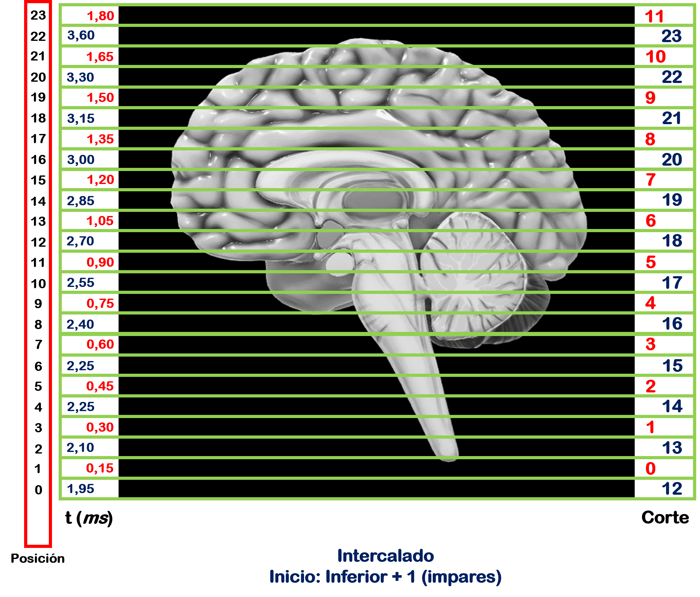
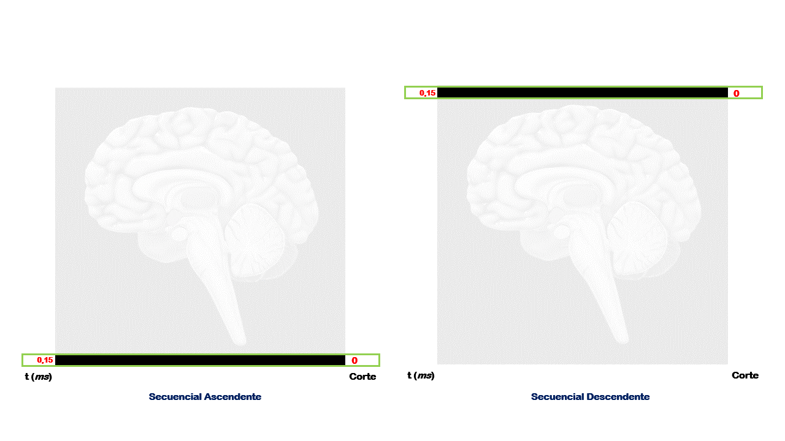
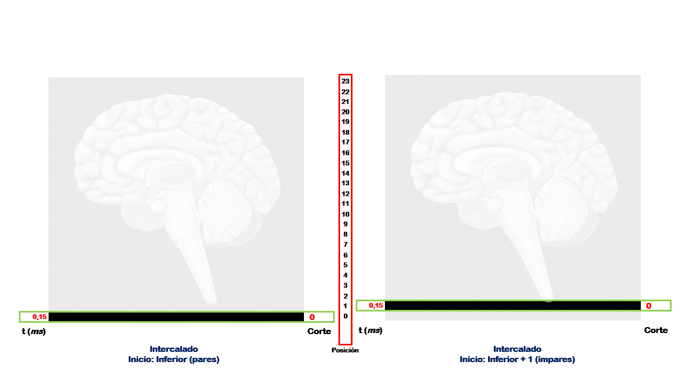

|image0|

--------------

--------------

**Andres Eduardo Aracena Rangel**

*Estudiante del programa del Magister en Física Médica*

--------------

--------------

Función ‘order_slice’
=============================================================

Para la adquisición del orden de adquisición de la imagen, extraemos
algunas variables del archivo ‘.json’ que se encuentra en el mismo
repositorio de la imagen funcional. Como lo describe su página oficial,
un archivo JSON es la abreviatura de: notación de objetos de JavaScript
(*JavaScript Object Notation*), el cual es un formato ligero de
intercambio de datos. Es fácil para los humanos leer y escribir. Es
fácil para las máquinas analizar y generar. JSON es un formato de texto
que es completamente independiente del lenguaje pero utiliza
convenciones que son familiares para los programadores de la familia de
lenguajes C, incluidos C, C++, C#, Java, JavaScript, Perl, Python y
muchos otros. Estas propiedades hacen de JSON un lenguaje de intercambio
de datos ideal.

JSON se basa en dos estructuras:

-  Una colección de pares de nombre/valor. En varios idiomas, esto se
   realiza como un objeto , registro, estructura, diccionario, tabla
   hash, lista con clave o matriz asociativa.
-  Una lista ordenada de valores. En la mayoría de los lenguajes, esto
   se realiza como una matriz , un vector, una lista o una secuencia.

Estas son estructuras de datos universales; prácticamente todos los
lenguajes de programación modernos los admiten de una forma u otra.

**JSON en Python**

JSON puede almacenar listas, booleanos, números, tuplas y diccionarios.
Pero para guardarse en un archivo, todas estas estructuras deben
reducirse a cadenas (cadenas que se puede leer o escribir en un
archivo). Python tiene un módulo JSON que ayudará a convertir las
estructuras de datos en cadenas JSON. Importamos el módulo

::

   import json

Para convertir el diccionario de Python en una cadena JSON que se puede
escribir en un archivo, usamos

::

   json_string = json.dumps(datastore)

Para tomar una cadena JSON y convertirla en una estructura de
diccionario:

::

   datastore = json.load(json_string)

Importamos librerias
--------------------

.. code:: python

   import time # medir el tiempo de ejecución de nuestros programas
   start = time.process_time()
   inicio = time.time()

.. code:: python

   import os # Módulo que permite acceder a funcionalidades dependientes del Sistema Operativo
   from os.path import join as opj # Método que concatena varios componentes de ruta con exactamente un separador de directorio(‘/’)

   from IPython.display import display, Image #IPython proporciona una rica arquitectura para la computación interactiva

   import pandas as pd # librería especializada en el manejo y análisis de estructuras de datos.
   import json # Módulo para trabajar con datos JSON

.. code:: python

   %matplotlib inline

Definimos Parametros
--------------------

.. code:: python

   '''
   Ruta del directorio de la data
   '''
   path_data = '/home/aracena/data/ds002422/'

   '''
   Ruta donde reposa el archivo.json
   '''
   path_json = opj(path_data,'sub-01','func')

   '''
   Ruta donde reposan las imagenes de referencia de orden de adquisición de imagenes
   '''
   path_expe = '/home/aracena/thesis_ds002422/00_fase0_tips_nibabel_funciones/'
   path_ref = opj(path_expe, '00_01_archivo_json_and_func_ordenslice','imagenes')

Cargamos el archivo ‘.json’
---------------------------

Junto al archivo de la imagen funcional, encontramos un archivo ‘.json’
el cual contiene la información de adquisición de la imagen

.. code:: python

   json_arch = opj(path_json,'sub-01_task-rest_bold.json')

.. code:: python

   with open(json_arch, 'rt') as fp:
       task_info = json.load(fp)

La información cargada del archivo ‘.json’ esta en forma de diccionario,
comprobemos

.. code:: python

   print(task_info)

::

   {'TaskName': 'rest', 'MagneticFieldStrength': 1.5, 'Manufacturer': 'Siemens', 'ManufacturersModelName': 'Avanto', 'BodyPartExamined': 'HEAD', 'PatientPosition': 'HFS', 'ProcedureStepDescription': 'head_NEURO', 'SoftwareVersions': 'syngo_MR_B19', 'MRAcquisitionType': '2D', 'ScanningSequence': 'EP', 'SequenceVariant': 'SK', 'ScanOptions': 'FS', 'SequenceName': '_epfid2d1_64', 'ImageType': ['ORIGINAL', 'PRIMARY', 'FMRI', 'NONE', 'ND', 'MOSAIC'], 'SliceThickness': 3.6, 'SpacingBetweenSlices': 3.78, 'EchoTime': 0.05, 'RepetitionTime': 3.56, 'FlipAngle': 90, 'PartialFourier': 1, 'BaseResolution': 64, 'DelayTime': 0.5, 'PhaseResolution': 1, 'ReceiveCoilName': 'HeadMatrix', 'PulseSequenceDetails': '%SiemensSeq%_ep2d_bold', 'PercentPhaseFOV': 100, 'PhaseEncodingSteps': 64, 'AcquisitionMatrixPE': 64, 'ReconMatrixPE': 64, 'BandwidthPerPixelPhaseEncode': 34.722, 'EffectiveEchoSpacing': 0.000450003, 'DerivedVendorReportedEchoSpacing': 0.000450003, 'TotalReadoutTime': 0.0283502, 'PixelBandwidth': 2604, 'DwellTime': 3e-06, 'PhaseEncodingDirection': 'j-', 'SliceTiming': [1.5375, 0, 1.6225, 0.085, 1.7075, 0.1725, 1.7925, 0.2575, 1.8775, 0.3425, 1.9625, 0.4275, 2.05, 0.5125, 2.135, 0.5975, 2.22, 0.6825, 2.305, 0.77, 2.39, 0.855, 2.475, 0.94, 2.56, 1.025, 2.6475, 1.11, 2.7325, 1.195, 2.8175, 1.28, 2.9025, 1.3675, 2.9875, 1.4525], 'InPlanePhaseEncodingDirectionDICOM': 'COL', 'NumberOfVolumesDiscardedByUser': 3, 'Instructions': 'Participants were asked to close their eyes, to not fall asleep, and to avoid consistent thinking about one topic during the period of scanning'}

.. code:: python

   type(task_info)

::

   dict

Creamos un DataFrame (DF) con la información del archivo ‘.json’
----------------------------------------------------------------

Creamos una lista con las claves del diccionario
~~~~~~~~~~~~~~~~~~~~~~~~~~~~~~~~~~~~~~~~~~~~~~~~

.. code:: python

   list_dic = list(task_info.keys())

.. code:: python

   print(list_dic)

::

   ['TaskName', 'MagneticFieldStrength', 'Manufacturer', 'ManufacturersModelName', 'BodyPartExamined', 'PatientPosition', 'ProcedureStepDescription', 'SoftwareVersions', 'MRAcquisitionType', 'ScanningSequence', 'SequenceVariant', 'ScanOptions', 'SequenceName', 'ImageType', 'SliceThickness', 'SpacingBetweenSlices', 'EchoTime', 'RepetitionTime', 'FlipAngle', 'PartialFourier', 'BaseResolution', 'DelayTime', 'PhaseResolution', 'ReceiveCoilName', 'PulseSequenceDetails', 'PercentPhaseFOV', 'PhaseEncodingSteps', 'AcquisitionMatrixPE', 'ReconMatrixPE', 'BandwidthPerPixelPhaseEncode', 'EffectiveEchoSpacing', 'DerivedVendorReportedEchoSpacing', 'TotalReadoutTime', 'PixelBandwidth', 'DwellTime', 'PhaseEncodingDirection', 'SliceTiming', 'InPlanePhaseEncodingDirectionDICOM', 'NumberOfVolumesDiscardedByUser', 'Instructions']

.. code:: python

   type(task_info['TaskName'])

::

   str

.. code:: python

   type(task_info['SliceTiming'])

::

   list

.. code:: python

   lista_json = []
   for i, js in enumerate(list_dic):
       # Como los valores de las claves la quiero visualizar en columnas, debo verificar que el
       # valor de la clave no sea una lista.
       tipo = type(task_info[js])
       if tipo == list:
           #print(tipo)
           A = str(task_info[js])# convertimos en string
           val = ''.join(A)  # unimos elemenros de la lista, convirtiendo en 1 dimension
           lista_json.append(val)
       else:
           #print('string o int')
           lista_json.append((task_info[js]))
       
   # Creamos DF del archivo '.json'
   df_json = pd.DataFrame(lista_json)
   df_json.columns = [('IRMf '+ lista_json[0])]
   df_json.index = [list_dic]

.. code:: python

   pd.set_option('display.max_colwidth', 50)
   display(df_json)

.. container::

   .. raw:: html

      

   .. raw:: html

      <table border="1" class="dataframe">

   .. raw:: html

      <thead>

   .. raw:: html

      <tr style="text-align: right;">

   .. raw:: html

      <th>

   .. raw:: html

      </th>

   .. raw:: html

      <th>

   IRMf rest

   .. raw:: html

      </th>

   .. raw:: html

      </tr>

   .. raw:: html

      </thead>

   .. raw:: html

      <tbody>

   .. raw:: html

      <tr>

   .. raw:: html

      <th>

   TaskName

   .. raw:: html

      </th>

   .. raw:: html

      <td>

   rest

   .. raw:: html

      </td>

   .. raw:: html

      </tr>

   .. raw:: html

      <tr>

   .. raw:: html

      <th>

   MagneticFieldStrength

   .. raw:: html

      </th>

   .. raw:: html

      <td>

   1.5

   .. raw:: html

      </td>

   .. raw:: html

      </tr>

   .. raw:: html

      <tr>

   .. raw:: html

      <th>

   Manufacturer

   .. raw:: html

      </th>

   .. raw:: html

      <td>

   Siemens

   .. raw:: html

      </td>

   .. raw:: html

      </tr>

   .. raw:: html

      <tr>

   .. raw:: html

      <th>

   ManufacturersModelName

   .. raw:: html

      </th>

   .. raw:: html

      <td>

   Avanto

   .. raw:: html

      </td>

   .. raw:: html

      </tr>

   .. raw:: html

      <tr>

   .. raw:: html

      <th>

   BodyPartExamined

   .. raw:: html

      </th>

   .. raw:: html

      <td>

   HEAD

   .. raw:: html

      </td>

   .. raw:: html

      </tr>

   .. raw:: html

      <tr>

   .. raw:: html

      <th>

   PatientPosition

   .. raw:: html

      </th>

   .. raw:: html

      <td>

   HFS

   .. raw:: html

      </td>

   .. raw:: html

      </tr>

   .. raw:: html

      <tr>

   .. raw:: html

      <th>

   ProcedureStepDescription

   .. raw:: html

      </th>

   .. raw:: html

      <td>

   head_NEURO

   .. raw:: html

      </td>

   .. raw:: html

      </tr>

   .. raw:: html

      <tr>

   .. raw:: html

      <th>

   SoftwareVersions

   .. raw:: html

      </th>

   .. raw:: html

      <td>

   syngo_MR_B19

   .. raw:: html

      </td>

   .. raw:: html

      </tr>

   .. raw:: html

      <tr>

   .. raw:: html

      <th>

   MRAcquisitionType

   .. raw:: html

      </th>

   .. raw:: html

      <td>

   2D

   .. raw:: html

      </td>

   .. raw:: html

      </tr>

   .. raw:: html

      <tr>

   .. raw:: html

      <th>

   ScanningSequence

   .. raw:: html

      </th>

   .. raw:: html

      <td>

   EP

   .. raw:: html

      </td>

   .. raw:: html

      </tr>

   .. raw:: html

      <tr>

   .. raw:: html

      <th>

   SequenceVariant

   .. raw:: html

      </th>

   .. raw:: html

      <td>

   SK

   .. raw:: html

      </td>

   .. raw:: html

      </tr>

   .. raw:: html

      <tr>

   .. raw:: html

      <th>

   ScanOptions

   .. raw:: html

      </th>

   .. raw:: html

      <td>

   FS

   .. raw:: html

      </td>

   .. raw:: html

      </tr>

   .. raw:: html

      <tr>

   .. raw:: html

      <th>

   SequenceName

   .. raw:: html

      </th>

   .. raw:: html

      <td>

   \_epfid2d1_64

   .. raw:: html

      </td>

   .. raw:: html

      </tr>

   .. raw:: html

      <tr>

   .. raw:: html

      <th>

   ImageType

   .. raw:: html

      </th>

   .. raw:: html

      <td>

   [‘ORIGINAL’, ‘PRIMARY’, ‘FMRI’, ‘NONE’, ‘ND’, …

   .. raw:: html

      </td>

   .. raw:: html

      </tr>

   .. raw:: html

      <tr>

   .. raw:: html

      <th>

   SliceThickness

   .. raw:: html

      </th>

   .. raw:: html

      <td>

   3.6

   .. raw:: html

      </td>

   .. raw:: html

      </tr>

   .. raw:: html

      <tr>

   .. raw:: html

      <th>

   SpacingBetweenSlices

   .. raw:: html

      </th>

   .. raw:: html

      <td>

   3.78

   .. raw:: html

      </td>

   .. raw:: html

      </tr>

   .. raw:: html

      <tr>

   .. raw:: html

      <th>

   EchoTime

   .. raw:: html

      </th>

   .. raw:: html

      <td>

   0.05

   .. raw:: html

      </td>

   .. raw:: html

      </tr>

   .. raw:: html

      <tr>

   .. raw:: html

      <th>

   RepetitionTime

   .. raw:: html

      </th>

   .. raw:: html

      <td>

   3.56

   .. raw:: html

      </td>

   .. raw:: html

      </tr>

   .. raw:: html

      <tr>

   .. raw:: html

      <th>

   FlipAngle

   .. raw:: html

      </th>

   .. raw:: html

      <td>

   90

   .. raw:: html

      </td>

   .. raw:: html

      </tr>

   .. raw:: html

      <tr>

   .. raw:: html

      <th>

   PartialFourier

   .. raw:: html

      </th>

   .. raw:: html

      <td>

   1

   .. raw:: html

      </td>

   .. raw:: html

      </tr>

   .. raw:: html

      <tr>

   .. raw:: html

      <th>

   BaseResolution

   .. raw:: html

      </th>

   .. raw:: html

      <td>

   64

   .. raw:: html

      </td>

   .. raw:: html

      </tr>

   .. raw:: html

      <tr>

   .. raw:: html

      <th>

   DelayTime

   .. raw:: html

      </th>

   .. raw:: html

      <td>

   0.5

   .. raw:: html

      </td>

   .. raw:: html

      </tr>

   .. raw:: html

      <tr>

   .. raw:: html

      <th>

   PhaseResolution

   .. raw:: html

      </th>

   .. raw:: html

      <td>

   1

   .. raw:: html

      </td>

   .. raw:: html

      </tr>

   .. raw:: html

      <tr>

   .. raw:: html

      <th>

   ReceiveCoilName

   .. raw:: html

      </th>

   .. raw:: html

      <td>

   HeadMatrix

   .. raw:: html

      </td>

   .. raw:: html

      </tr>

   .. raw:: html

      <tr>

   .. raw:: html

      <th>

   PulseSequenceDetails

   .. raw:: html

      </th>

   .. raw:: html

      <td>

   %SiemensSeq%_ep2d_bold

   .. raw:: html

      </td>

   .. raw:: html

      </tr>

   .. raw:: html

      <tr>

   .. raw:: html

      <th>

   PercentPhaseFOV

   .. raw:: html

      </th>

   .. raw:: html

      <td>

   100

   .. raw:: html

      </td>

   .. raw:: html

      </tr>

   .. raw:: html

      <tr>

   .. raw:: html

      <th>

   PhaseEncodingSteps

   .. raw:: html

      </th>

   .. raw:: html

      <td>

   64

   .. raw:: html

      </td>

   .. raw:: html

      </tr>

   .. raw:: html

      <tr>

   .. raw:: html

      <th>

   AcquisitionMatrixPE

   .. raw:: html

      </th>

   .. raw:: html

      <td>

   64

   .. raw:: html

      </td>

   .. raw:: html

      </tr>

   .. raw:: html

      <tr>

   .. raw:: html

      <th>

   ReconMatrixPE

   .. raw:: html

      </th>

   .. raw:: html

      <td>

   64

   .. raw:: html

      </td>

   .. raw:: html

      </tr>

   .. raw:: html

      <tr>

   .. raw:: html

      <th>

   BandwidthPerPixelPhaseEncode

   .. raw:: html

      </th>

   .. raw:: html

      <td>

   34.722

   .. raw:: html

      </td>

   .. raw:: html

      </tr>

   .. raw:: html

      <tr>

   .. raw:: html

      <th>

   EffectiveEchoSpacing

   .. raw:: html

      </th>

   .. raw:: html

      <td>

   0.00045

   .. raw:: html

      </td>

   .. raw:: html

      </tr>

   .. raw:: html

      <tr>

   .. raw:: html

      <th>

   DerivedVendorReportedEchoSpacing

   .. raw:: html

      </th>

   .. raw:: html

      <td>

   0.00045

   .. raw:: html

      </td>

   .. raw:: html

      </tr>

   .. raw:: html

      <tr>

   .. raw:: html

      <th>

   TotalReadoutTime

   .. raw:: html

      </th>

   .. raw:: html

      <td>

   0.02835

   .. raw:: html

      </td>

   .. raw:: html

      </tr>

   .. raw:: html

      <tr>

   .. raw:: html

      <th>

   PixelBandwidth

   .. raw:: html

      </th>

   .. raw:: html

      <td>

   2604

   .. raw:: html

      </td>

   .. raw:: html

      </tr>

   .. raw:: html

      <tr>

   .. raw:: html

      <th>

   DwellTime

   .. raw:: html

      </th>

   .. raw:: html

      <td>

   0.000003

   .. raw:: html

      </td>

   .. raw:: html

      </tr>

   .. raw:: html

      <tr>

   .. raw:: html

      <th>

   PhaseEncodingDirection

   .. raw:: html

      </th>

   .. raw:: html

      <td>

   j-

   .. raw:: html

      </td>

   .. raw:: html

      </tr>

   .. raw:: html

      <tr>

   .. raw:: html

      <th>

   SliceTiming

   .. raw:: html

      </th>

   .. raw:: html

      <td>

   [1.5375, 0, 1.6225, 0.085, 1.7075, 0.1725, 1.7…

   .. raw:: html

      </td>

   .. raw:: html

      </tr>

   .. raw:: html

      <tr>

   .. raw:: html

      <th>

   InPlanePhaseEncodingDirectionDICOM

   .. raw:: html

      </th>

   .. raw:: html

      <td>

   COL

   .. raw:: html

      </td>

   .. raw:: html

      </tr>

   .. raw:: html

      <tr>

   .. raw:: html

      <th>

   NumberOfVolumesDiscardedByUser

   .. raw:: html

      </th>

   .. raw:: html

      <td>

   3

   .. raw:: html

      </td>

   .. raw:: html

      </tr>

   .. raw:: html

      <tr>

   .. raw:: html

      <th>

   Instructions

   .. raw:: html

      </th>

   .. raw:: html

      <td>

   Participants were asked to close their eyes, t…

   .. raw:: html

      </td>

   .. raw:: html

      </tr>

   .. raw:: html

      </tbody>

   .. raw:: html

      </table>

Orden de adquisición de los slices
----------------------------------

Casi todos los datos de resonancia magnética funcional se recopilan
mediante adquisición de resonancia magnética bidimensional, en la que
los datos se adquieren a un corte a la vez. Los dos métodos más
utilizados para crear volúmenes son la adquisición de cortes
secuenciales e intercalados.

La adquisición secuencial de cortes adquiere cada corte adyacente de
forma consecutiva, ya sea de abajo hacia arriba (ascendente) o de arriba
hacia abajo (descendente), como se ilustra en la figura dinámica. Cada
método secuencial lo denominaremos: ‘adquisición de cortes secuencial
ascendente’ y ‘adquisición de cortes secuencial descendente’ y ambos se
ilustran en la figura dinámica izquierda y derecha respectivamente.

|image1|

La adquisición de cortes intercalados adquiere cada dos cortes y luego
llena los espacios en el segundo paso. Como se ilustra en la figura
dinámica izquierda, se adquieren cada dos slices secuencialmente, de
modo que se adquieren la mitad de los slices (los slices pares) seguidas
por la otra mitad (los slices impares), llamaremos a este método de
adquisición: ‘adquisición de cortes intercalados inferior/pares’; por
otro lado, en la figura dinámica derecha, se adquieren cada dos slices
secuencialmente, de modo que se adquieren la mitad de los slices (los
slices impares) seguidas por la otra mitad (los slices pares),
llamaremos a este método de adquisición: ‘adquisición de cortes
intercalados inferior+1/impares’.

|image2|

El uso de la adquisición 2D significa que los datos en diferentes partes
de la imagen se adquieren en tiempos sistemáticamente diferentes, con
estas diferencias que van hasta varios segundos (dependiendo del tiempo
de repetición, o TR de la secuencia de pulso)

Para extraer el orden de adquisón de los slices, de la información
sumistrada por el archivo ‘.json’ debemos trabajar con los datos de
‘RepetitionTime’ y ‘SliceTiming’

.. code:: python

   '''
   Creamos una lista de las imagenes de referencia de adquisición de cortes
   '''
   lista_imagenes = [opj(path_ref,'GIF_SECUENCIAL_ASCENDENTE.gif'),
                     opj(path_ref,'GIF_SECUENCIAL_DESCENDENTE.gif'),
                     opj(path_ref,'GIF_INTERCALADO_PAR.gif'),
                     opj(path_ref,'GIF_INTERCALADO_IMPAR.gif')]

   '''
   Extraemos información del arhivo .json
   '''
   # tiempo de repeticion
   TR = task_info['RepetitionTime']
   # tiempo de adquisión de cortes
   slice_timing = task_info['SliceTiming']

   '''
   Procesamos data extraida del archivo .json
   '''
   # Número de slices
   number_of_slices = len(slice_timing)
   # Tiempo en adquirir primer corte
   time_first = TR/number_of_slices
   # Valor mínimo de slice_timing
   mini = min(slice_timing)
   # Valor máximo de slice_timing
   maxi = max(slice_timing)
   # Primer valor de slice_timing
   prim = slice_timing[0]
   # Segundo valor de slice_timing
   segu = slice_timing[1]

   if prim == mini:
       if segu == mini+time_first:
           print('Orden de adquisición de cortes secuenciales ascendente')
           slice_order = list(range(1, number_of_slices+1, 1))
           print(slice_timing)
           display(Image(lista_imagenes[3]))
       else:
           print('Orden de adquisición de cortes intercalados inferior/pares')
           slice_order = list(range(1, number_of_slices+1, 2)) + list(range(2, number_of_slices+1, 2))
           print(slice_timing)
           display(Image(lista_imagenes[2]))
   else:
       if segu == maxi - time_first:
           print('Orden de adquisición de cortes secuenciales descendente')
           slice_order = list(range(snumber_of_slices,0 , -1))
           print(slice_timing)
           display(Image(lista_imagenes[1]))
       else:
           print('Orden de adquisición de cortes intercalados inferior+1/impares: \n')
           slice_order = list(range(2, number_of_slices+1, 2))+list(range(1, number_of_slices+1, 2))
           print(slice_timing)
           display(Image(lista_imagenes[3]))

::

   Orden de adquisición de cortes intercalados inferior+1/impares: 

   [1.5375, 0, 1.6225, 0.085, 1.7075, 0.1725, 1.7925, 0.2575, 1.8775, 0.3425, 1.9625, 0.4275, 2.05, 0.5125, 2.135, 0.5975, 2.22, 0.6825, 2.305, 0.77, 2.39, 0.855, 2.475, 0.94, 2.56, 1.025, 2.6475, 1.11, 2.7325, 1.195, 2.8175, 1.28, 2.9025, 1.3675, 2.9875, 1.4525]

   <IPython.core.display.Image object>

Creación de la función ‘order_slice’
------------------------------------

.. code:: python

   '''
   Funcion para extraer el orden de adquisión de los cortes de la imagen.

   Inputs:

   - json_arch: archivo '.json'

   Output:

   - slice_order: orden de adqusión de los cortes
   - TR: tiempo de repetición
   - number_of_slices: número de slices
   - df_json: DF con la información del archivo '.json'
   '''
    
   def order_slice(json_arch):
       import json
       from IPython.display import Image, display
       import pandas as pd
       
       '''
       Cargamos el archivo '.json'
       '''
       with open(json_arch, 'rt') as fp:
           task_info = json.load(fp)
       
       '''
       Creamos una lista de las imágenes de referencia de adquisición de cortes
       '''
       lista_imagenes = [opj(path_ref,'SECUENCIAL_ASCENDENTE.png'),
                         opj(path_ref,'SECUENCIAL_DESCENDENTE.png'),
                         opj(path_ref,'INTERCALADO_PAR.png'),
                         opj(path_ref,'INTERCALADO_IMPAR.png')]

       '''
       Extraemos información del arhivo .json
       '''
       # tiempo de repeticion
       TR = task_info['RepetitionTime']
       # tiempo de adquisión de cortes
       slice_timing = task_info['SliceTiming']

       '''
       Procesamos data extraida del archivo .json
       '''
       # Número de slices
       number_of_slices = len(slice_timing)
       # Tiempo en adquirir primer corte
       time_first = TR/number_of_slices
       # Valor mínimo de slice_timing
       mini = min(slice_timing)
       # Valor máximo de slice_timing
       maxi = max(slice_timing)
       # Primer valor de slice_timing
       prim = slice_timing[0]
       # Segundo valor de slice_timing
       segu = slice_timing[1]

       if prim == mini:
           if segu == mini+time_first:
               print('Orden de adquisición de cortes secuenciales ascendente')
               slice_order = list(range(1, number_of_slices+1, 1))
               print(slice_timing)
               imagen_ref = lista_imagenes[3]
           else:
               print('Orden de adquisición de cortes intercalados inferior/pares')
               slice_order = list(range(1, number_of_slices+1, 2)) + list(range(2, number_of_slices+1, 2))
               print(slice_timing)
               imagen_ref = lista_imagenes[2]
       else:
           if segu == maxi - time_first:
               print('Orden de adquisición de cortes secuenciales descendente')
               slice_order = list(range(snumber_of_slices,0 , -1))
               print(slice_timing)
               imagen_ref = lista_imagenes[1]
           else:
               print('Orden de adquisición de cortes intercalados inferior+1/impares: \n')
               slice_order = list(range(2, number_of_slices+1, 2))+list(range(1, number_of_slices+1, 2))
               print(slice_timing)
               imagen_ref = lista_imagenes[3]
       
       '''
       Creamos un DataFrame (DF) con la información del archivo '.json'
       '''
       list_dic = list(task_info.keys())
       lista_json = []
       for i, js in enumerate(list_dic):
           # Como los valores de las claves la quiero visualizar en columnas, debo verificar que el
           # valor de la clave no sea una lista.
           tipo = type(task_info[js])
           if tipo == list:
               A = str(task_info[js])# convertimos en string
               val = ''.join(A)  # unimos elemenros de la lista, convirtiendo en 1 dimension
               lista_json.append(val)
           else:
               lista_json.append((task_info[js]))

       # Creamos DF del archivo '.json'
       df_json = pd.DataFrame(lista_json)
       df_json.columns = [('IRMf '+ lista_json[0])]
       df_json.index = [list_dic]
       
       return slice_order,TR, number_of_slices, df_json, imagen_ref

Ejecutamos función
~~~~~~~~~~~~~~~~~~

.. code:: python

   datos_json_img = order_slice(json_arch= json_arch)
   print('\nTiempo de repetición (TR)= ', datos_json_img[1])
   print('\nNúmero de cortes = ', datos_json_img[2])
   display(Image(datos_json_img[4], width=400, height=400))
   display(datos_json_img[3])

::

   Orden de adquisición de cortes intercalados inferior+1/impares: 

   [1.5375, 0, 1.6225, 0.085, 1.7075, 0.1725, 1.7925, 0.2575, 1.8775, 0.3425, 1.9625, 0.4275, 2.05, 0.5125, 2.135, 0.5975, 2.22, 0.6825, 2.305, 0.77, 2.39, 0.855, 2.475, 0.94, 2.56, 1.025, 2.6475, 1.11, 2.7325, 1.195, 2.8175, 1.28, 2.9025, 1.3675, 2.9875, 1.4525]

   Tiempo de repetición (TR)=  3.56

   Número de cortes =  36

   png

.. container::

   .. raw:: html

      

   .. raw:: html

      <table border="1" class="dataframe">

   .. raw:: html

      <thead>

   .. raw:: html

      <tr style="text-align: right;">

   .. raw:: html

      <th>

   .. raw:: html

      </th>

   .. raw:: html

      <th>

   IRMf rest

   .. raw:: html

      </th>

   .. raw:: html

      </tr>

   .. raw:: html

      </thead>

   .. raw:: html

      <tbody>

   .. raw:: html

      <tr>

   .. raw:: html

      <th>

   TaskName

   .. raw:: html

      </th>

   .. raw:: html

      <td>

   rest

   .. raw:: html

      </td>

   .. raw:: html

      </tr>

   .. raw:: html

      <tr>

   .. raw:: html

      <th>

   MagneticFieldStrength

   .. raw:: html

      </th>

   .. raw:: html

      <td>

   1.5

   .. raw:: html

      </td>

   .. raw:: html

      </tr>

   .. raw:: html

      <tr>

   .. raw:: html

      <th>

   Manufacturer

   .. raw:: html

      </th>

   .. raw:: html

      <td>

   Siemens

   .. raw:: html

      </td>

   .. raw:: html

      </tr>

   .. raw:: html

      <tr>

   .. raw:: html

      <th>

   ManufacturersModelName

   .. raw:: html

      </th>

   .. raw:: html

      <td>

   Avanto

   .. raw:: html

      </td>

   .. raw:: html

      </tr>

   .. raw:: html

      <tr>

   .. raw:: html

      <th>

   BodyPartExamined

   .. raw:: html

      </th>

   .. raw:: html

      <td>

   HEAD

   .. raw:: html

      </td>

   .. raw:: html

      </tr>

   .. raw:: html

      <tr>

   .. raw:: html

      <th>

   PatientPosition

   .. raw:: html

      </th>

   .. raw:: html

      <td>

   HFS

   .. raw:: html

      </td>

   .. raw:: html

      </tr>

   .. raw:: html

      <tr>

   .. raw:: html

      <th>

   ProcedureStepDescription

   .. raw:: html

      </th>

   .. raw:: html

      <td>

   head_NEURO

   .. raw:: html

      </td>

   .. raw:: html

      </tr>

   .. raw:: html

      <tr>

   .. raw:: html

      <th>

   SoftwareVersions

   .. raw:: html

      </th>

   .. raw:: html

      <td>

   syngo_MR_B19

   .. raw:: html

      </td>

   .. raw:: html

      </tr>

   .. raw:: html

      <tr>

   .. raw:: html

      <th>

   MRAcquisitionType

   .. raw:: html

      </th>

   .. raw:: html

      <td>

   2D

   .. raw:: html

      </td>

   .. raw:: html

      </tr>

   .. raw:: html

      <tr>

   .. raw:: html

      <th>

   ScanningSequence

   .. raw:: html

      </th>

   .. raw:: html

      <td>

   EP

   .. raw:: html

      </td>

   .. raw:: html

      </tr>

   .. raw:: html

      <tr>

   .. raw:: html

      <th>

   SequenceVariant

   .. raw:: html

      </th>

   .. raw:: html

      <td>

   SK

   .. raw:: html

      </td>

   .. raw:: html

      </tr>

   .. raw:: html

      <tr>

   .. raw:: html

      <th>

   ScanOptions

   .. raw:: html

      </th>

   .. raw:: html

      <td>

   FS

   .. raw:: html

      </td>

   .. raw:: html

      </tr>

   .. raw:: html

      <tr>

   .. raw:: html

      <th>

   SequenceName

   .. raw:: html

      </th>

   .. raw:: html

      <td>

   \_epfid2d1_64

   .. raw:: html

      </td>

   .. raw:: html

      </tr>

   .. raw:: html

      <tr>

   .. raw:: html

      <th>

   ImageType

   .. raw:: html

      </th>

   .. raw:: html

      <td>

   [‘ORIGINAL’, ‘PRIMARY’, ‘FMRI’, ‘NONE’, ‘ND’, …

   .. raw:: html

      </td>

   .. raw:: html

      </tr>

   .. raw:: html

      <tr>

   .. raw:: html

      <th>

   SliceThickness

   .. raw:: html

      </th>

   .. raw:: html

      <td>

   3.6

   .. raw:: html

      </td>

   .. raw:: html

      </tr>

   .. raw:: html

      <tr>

   .. raw:: html

      <th>

   SpacingBetweenSlices

   .. raw:: html

      </th>

   .. raw:: html

      <td>

   3.78

   .. raw:: html

      </td>

   .. raw:: html

      </tr>

   .. raw:: html

      <tr>

   .. raw:: html

      <th>

   EchoTime

   .. raw:: html

      </th>

   .. raw:: html

      <td>

   0.05

   .. raw:: html

      </td>

   .. raw:: html

      </tr>

   .. raw:: html

      <tr>

   .. raw:: html

      <th>

   RepetitionTime

   .. raw:: html

      </th>

   .. raw:: html

      <td>

   3.56

   .. raw:: html

      </td>

   .. raw:: html

      </tr>

   .. raw:: html

      <tr>

   .. raw:: html

      <th>

   FlipAngle

   .. raw:: html

      </th>

   .. raw:: html

      <td>

   90

   .. raw:: html

      </td>

   .. raw:: html

      </tr>

   .. raw:: html

      <tr>

   .. raw:: html

      <th>

   PartialFourier

   .. raw:: html

      </th>

   .. raw:: html

      <td>

   1

   .. raw:: html

      </td>

   .. raw:: html

      </tr>

   .. raw:: html

      <tr>

   .. raw:: html

      <th>

   BaseResolution

   .. raw:: html

      </th>

   .. raw:: html

      <td>

   64

   .. raw:: html

      </td>

   .. raw:: html

      </tr>

   .. raw:: html

      <tr>

   .. raw:: html

      <th>

   DelayTime

   .. raw:: html

      </th>

   .. raw:: html

      <td>

   0.5

   .. raw:: html

      </td>

   .. raw:: html

      </tr>

   .. raw:: html

      <tr>

   .. raw:: html

      <th>

   PhaseResolution

   .. raw:: html

      </th>

   .. raw:: html

      <td>

   1

   .. raw:: html

      </td>

   .. raw:: html

      </tr>

   .. raw:: html

      <tr>

   .. raw:: html

      <th>

   ReceiveCoilName

   .. raw:: html

      </th>

   .. raw:: html

      <td>

   HeadMatrix

   .. raw:: html

      </td>

   .. raw:: html

      </tr>

   .. raw:: html

      <tr>

   .. raw:: html

      <th>

   PulseSequenceDetails

   .. raw:: html

      </th>

   .. raw:: html

      <td>

   %SiemensSeq%_ep2d_bold

   .. raw:: html

      </td>

   .. raw:: html

      </tr>

   .. raw:: html

      <tr>

   .. raw:: html

      <th>

   PercentPhaseFOV

   .. raw:: html

      </th>

   .. raw:: html

      <td>

   100

   .. raw:: html

      </td>

   .. raw:: html

      </tr>

   .. raw:: html

      <tr>

   .. raw:: html

      <th>

   PhaseEncodingSteps

   .. raw:: html

      </th>

   .. raw:: html

      <td>

   64

   .. raw:: html

      </td>

   .. raw:: html

      </tr>

   .. raw:: html

      <tr>

   .. raw:: html

      <th>

   AcquisitionMatrixPE

   .. raw:: html

      </th>

   .. raw:: html

      <td>

   64

   .. raw:: html

      </td>

   .. raw:: html

      </tr>

   .. raw:: html

      <tr>

   .. raw:: html

      <th>

   ReconMatrixPE

   .. raw:: html

      </th>

   .. raw:: html

      <td>

   64

   .. raw:: html

      </td>

   .. raw:: html

      </tr>

   .. raw:: html

      <tr>

   .. raw:: html

      <th>

   BandwidthPerPixelPhaseEncode

   .. raw:: html

      </th>

   .. raw:: html

      <td>

   34.722

   .. raw:: html

      </td>

   .. raw:: html

      </tr>

   .. raw:: html

      <tr>

   .. raw:: html

      <th>

   EffectiveEchoSpacing

   .. raw:: html

      </th>

   .. raw:: html

      <td>

   0.00045

   .. raw:: html

      </td>

   .. raw:: html

      </tr>

   .. raw:: html

      <tr>

   .. raw:: html

      <th>

   DerivedVendorReportedEchoSpacing

   .. raw:: html

      </th>

   .. raw:: html

      <td>

   0.00045

   .. raw:: html

      </td>

   .. raw:: html

      </tr>

   .. raw:: html

      <tr>

   .. raw:: html

      <th>

   TotalReadoutTime

   .. raw:: html

      </th>

   .. raw:: html

      <td>

   0.02835

   .. raw:: html

      </td>

   .. raw:: html

      </tr>

   .. raw:: html

      <tr>

   .. raw:: html

      <th>

   PixelBandwidth

   .. raw:: html

      </th>

   .. raw:: html

      <td>

   2604

   .. raw:: html

      </td>

   .. raw:: html

      </tr>

   .. raw:: html

      <tr>

   .. raw:: html

      <th>

   DwellTime

   .. raw:: html

      </th>

   .. raw:: html

      <td>

   0.000003

   .. raw:: html

      </td>

   .. raw:: html

      </tr>

   .. raw:: html

      <tr>

   .. raw:: html

      <th>

   PhaseEncodingDirection

   .. raw:: html

      </th>

   .. raw:: html

      <td>

   j-

   .. raw:: html

      </td>

   .. raw:: html

      </tr>

   .. raw:: html

      <tr>

   .. raw:: html

      <th>

   SliceTiming

   .. raw:: html

      </th>

   .. raw:: html

      <td>

   [1.5375, 0, 1.6225, 0.085, 1.7075, 0.1725, 1.7…

   .. raw:: html

      </td>

   .. raw:: html

      </tr>

   .. raw:: html

      <tr>

   .. raw:: html

      <th>

   InPlanePhaseEncodingDirectionDICOM

   .. raw:: html

      </th>

   .. raw:: html

      <td>

   COL

   .. raw:: html

      </td>

   .. raw:: html

      </tr>

   .. raw:: html

      <tr>

   .. raw:: html

      <th>

   NumberOfVolumesDiscardedByUser

   .. raw:: html

      </th>

   .. raw:: html

      <td>

   3

   .. raw:: html

      </td>

   .. raw:: html

      </tr>

   .. raw:: html

      <tr>

   .. raw:: html

      <th>

   Instructions

   .. raw:: html

      </th>

   .. raw:: html

      <td>

   Participants were asked to close their eyes, t…

   .. raw:: html

      </td>

   .. raw:: html

      </tr>

   .. raw:: html

      </tbody>

   .. raw:: html

      </table>

Tiempo de ejecución
-------------------

.. code:: python

   fin = time.time()
   end = time.process_time()
   tiempo = fin - inicio
   tiempo2 = end - start

   print('--------------------------------------')
   print('tiempo de ejecución\n\n', round(tiempo,3), 'seg\n', round(tiempo/60,3), 'min')     
   print('--------------------------------------')
   print('tiempo de ejecución del sistema y CPU\n\n', round(tiempo2,3), 'seg\n', round(tiempo2/60,3), 'min')
   print('--------------------------------------')

::

   --------------------------------------
   tiempo de ejecución

    2.214 seg
    0.037 min
   --------------------------------------
   tiempo de ejecución del sistema y CPU

    1.708 seg
    0.028 min
   --------------------------------------

Referencia
----------

Imagenes de fMRI extraidas de OpenNeuro:

-  `ds002422 <https://openneuro.org/datasets/ds002422/versions/1.1.0>`__

--------------

--------------

  Con referencia:

-  `Pagina oficial NIbabel <https://nipy.org/nibabel/index.html>`__
-  `Pagina oficial JSON <https://www.json.org/>`__

Adquisisción de cortes:

-  Poldrack, R. A., Mumford, J. A., and Nichols, T. E. (2011). Handbook
   of functional MRI data analysis. Cambridge University Press.

--------------

--------------

Imágenes realizadas por el autor del script, con apoyo de imagen 3D de
corte sagital del cerebro del programa Microsoft PowerPoint.

Localización del script de python
---------------------------------

-  `00_01_Funcion_ordenslice <https://github.com/aracenafisica/00_01_Funcion_ordenslice.git>`__

Fin
---

.. |image0| image:: imagenes/UC_FMRI.jpg

