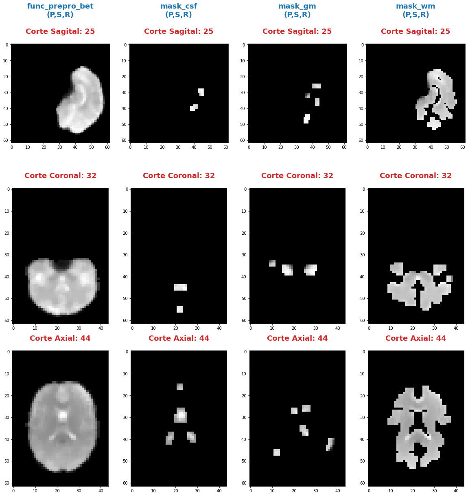
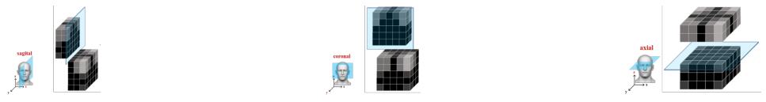
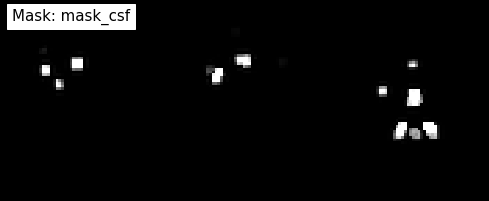
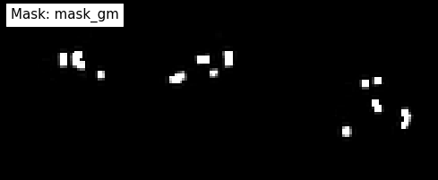
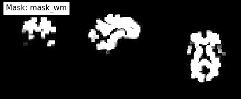

|image0|

--------------

--------------

**Andres Eduardo Aracena Rangel**

*Estudiante del programa del Magister en Física Médica*

--------------

--------------

Acronimos:

-  CSF: Cerebrospinal Fluid (*líquido cefalorraquídeo*)
-  GM: Gray Matter (*materia gris*)
-  WM: White Matter (*materia blanca*)

--------------

--------------

NOTA: Cuando indiquemos imagenes brain o mascaras brain, nos estamos
refieriendo a las imagenes o mascaras de csf, wm, gm

--------------

--------------

Extracción de series de tiempo del CSF, GM yWM
==============================================

Del notebook **workflow_preprocesamiento_iterables_maskref.ipynb** se
extrajo las mascaras para csf, gm y wm para tres umbrales \*0.5, 0.9 y
0.99: y en el notebook **serie_tiempo_masks_4D_CSFgmWM.ipynb** se
extrajo series de tiempo para las mascaras y sus umbrales.

En este notebook solo trabajaremos con las mascaras de csf, gm y wm pafa
el umbral de 0.99, donde extraeremos su serie de tiempo promedio

  ## Importamos librerias

.. code:: python

   import time # medir el tiempo de ejecución de nuestros programas
   start = time.process_time()
   inicio = time.time()

.. code:: python

   import os # El módulo os nos permite acceder a funcionalidades dependientes del Sistema Operativo
   from os.path import join as opj # Este método concatena varios componentes de ruta con exactamente un separador de directorio(‘/’)

   from nipype import SelectFiles

   import nibabel as nib
   import numpy as np
   import matplotlib.pyplot as plt

   import pandas as pd

   from nilearn.plotting import plot_anat
   %matplotlib inline

::

   220720-02:07:46,604 nipype.utils WARNING:
        A newer version (1.8.3) of nipy/nipype is available. You are using 1.7.0

   /home/aracena/.local/lib/python3.9/site-packages/nilearn/datasets/__init__.py:93: FutureWarning: Fetchers from the nilearn.datasets module will be updated in version 0.9 to return python strings instead of bytes and Pandas dataframes instead of Numpy arrays.
     warn("Fetchers from the nilearn.datasets module will be "

Definimos parámetros
--------------------

.. code:: python

   '''
   Ruta del directorio de la data
   '''
   path_data = '/home/aracena/thesis_ds002422/' 

   '''
   Ruta donde reposa la imagen funcional preprocesada con bet
   '''
   path_fmri = opj(path_data,'02_fase1_extraccion_brain_fmri_prepro','output')

   '''
   Ruta mascaras brain
   '''
   path_brain = opj(path_data,'01_fase1_extraccion_mask_brain','output','datasink','masks_brain')

   '''
   Ruta donde reposan las imagenes de referencia de los cortes anatomicos
   '''
   path_ref = opj(path_data,'03_fase2_extraccion_series_tiempo_brain', 'imagenes')

   '''
   lista de tejidos a procesar
   '''
   tejido = ['mask_csf', 'mask_gm', 'mask_wm']

           
   '''
   Ingrese el umbral que desea extraer (se extrajeron tres mask brain para tres umbrales distintos)
   '''
   umbral_sel = '0.95'

   '''
   Ruta donde se guardaran los resultados
   '''
   path_out = opj(path_data,'03_fase2_extraccion_series_tiempo_brain','output', umbral_sel)

   # Ruta donde se guardara archivos csv
   path_csv = opj(path_out,'archivos_csv')

   # Ruta donde se guardaran las imagenes png
   path_png = opj(path_out,'archivos_png')

   '''
   Creamos la carpeta de salida
   '''
   os.system('mkdir -p %s'%path_out)
   os.system('mkdir -p %s'%path_csv)
   os.system('mkdir -p %s'%path_png)

   '''
   Creamos la carpeta de salida para tablas
   '''
   path_out_DF = opj(path_out,'tablas_proyecto')
   os.system('mkdir -p %s'%path_out_DF);

Definimos funciones
-------------------

Función para extraer los atributos de la(s) imagen(es)
~~~~~~~~~~~~~~~~~~~~~~~~~~~~~~~~~~~~~~~~~~~~~~~~~~~~~~

.. code:: python

   '''
   Función para extraer los atributos de la(s) imagen(es).

   Inputs:

   - img: Diccionario con las imagenes nifti

   Output:

   df_atri: Dataframe con los principales atributos de las imagenes contenidas en el diccionario 'img'
   '''

   def atributo_img(img):
       import pandas as pd
       lista_img = list(img.keys()) # Creamos una lista con las claves del diccionario

       df_atri = pd.DataFrame()
       df_atri.index = ['forma', 'dimension', 'orientacion', '', 'x_img', 'y_img' , 'z_img', 'volumenes_(N)', 'voxel_size_(mm)', 
                          'TR_(s)', 'tipo_dato', 'numero_voxels','min_img', 'max_img']
       
       for i, ima in enumerate(lista_img):
           lista_atri = []
           #cargamos el header de la imagen
           header_img = img[ima].header
           
           # Forma y dimensión de la imágen
           forma = header_img.get_data_shape() 
           lista_atri.append(str(forma))
           lista_atri.append(len(forma))
           
           # Orientacion de la imágen
           orientacion = nib.orientations.aff2axcodes(img[ima].affine)
           lista_atri.append(orientacion)

           # x, y, z y volumenes
           ejes=[]
           for i in range(len(orientacion)):
               tam = img[ima].shape[i]
               ori = str(orientacion[i])
               if  ori == 'L'or ori == 'R':
                   x_img = tam
                   a = 'x'

               elif ori == 'A' or ori == 'P':
                   y_img = tam
                   a = 'y'

               elif ori == 'I'or ori == 'S':
                   z_img = tam
                   a = 'z'
                   
               ejes.append(a)
           
           # Agregamos a la lista de atributos forma, x, y, z
           lista_atri.append(ejes)
           lista_atri.append(x_img)
           lista_atri.append(y_img)
           lista_atri.append(z_img)
           
           # Agregamos volumes a la lista de atributos 
           if len(forma) == 4:
               lista_atri.append(forma[-1])
           else:
               lista_atri.append('1')

           # Tamaño del voxel
           tavo = header_img.get_zooms()[0:3]
           
           tamvox=[]
           for i in range(len(tavo)):
               tamvox.append(round(tavo[i],3))
               
           lista_atri.append(tamvox) 
           
           # Tiempo de exploración
           if len(header_img.get_zooms()) == 4:
               lista_atri.append(header_img.get_zooms()[-1])
           else:
               lista_atri.append('---')     
           
           
           #lista_atri.append(header_img.get_zooms()[-1])   # Tiempo de exploración
           lista_atri.append(header_img.get_data_dtype())   # Tipo de datos numérico
           lista_atri.append(img[ima].get_fdata().size) # Número de elementos de la matriz
           lista_atri.append(round(img[ima].get_fdata().min(),2)) # Valor minimo de la imágen
           lista_atri.append(round(img[ima].get_fdata().max(),2)) # Valor maximio de la imágen
           
           # Creamos DF de atributos de la imagen
           df_at = pd.DataFrame()
           df_at = pd.DataFrame(lista_atri)
           df_at.columns = [ima]
           df_at.index = df_atri.index
           #display(df_at)

           # Unimos las DF
           df_atri = pd.merge(df_atri, df_at,
                              right_index=True,left_index=True)
       return df_atri

Funcion para visualizar y guardar los cortes anatomicos sobre un voxel
~~~~~~~~~~~~~~~~~~~~~~~~~~~~~~~~~~~~~~~~~~~~~~~~~~~~~~~~~~~~~~~~~~~~~~

.. code:: python

   '''
   Función para generar la visualización de los cortes anatómico de varias imágenes (hasta cuatro) 

   Inputs:

   - img: Diccionario con las imágenes nifti
   - vol: Volumen donde se desea visualizar los cortes anatómicos
   - vox: Posición i,j,k del voxel sobre el cual se proyectarán los cortes
   #- nom_img = nombre de la imagen con que se desea visualizar y guardar

   Outputs:
   - plot de los diferentes cortes anatómicos sobre un voxel de las imágenes ingresadas en 'img'
   '''

   def visual_cortes_ana(img, vol, voxel):
       import nibabel as nib
       import numpy as np
       import matplotlib.pyplot as plt
       import matplotlib.image as mpimg
      
       # Creamos una lista con las claves del diccionario ingresado
       lista_img = list(img.keys())

       corte_sag = {}
       corte_cor = {}
       corte_axi = {}
       datos_img = {}
       x_cor = {}
       y_cor = {}
       z_cor = {}
       nomb_ori={}
       for i, ima in enumerate(lista_img):
           # Orientacion de la imágen
           orientacion = nib.orientations.aff2axcodes(img[ima].affine)
           # creamos un nombre para la grafica
           a = ','.join(orientacion)
           nomb_ori[ima] = '('+ a +')'
           
           #cargamos datos de la imagen
           datos_img[ima] = img[ima].get_fdata()
           ta = len(datos_img[ima].shape)
           if ta == 4:
               datos_img[ima] = datos_img[ima][...,vol]
           else:
               datos_img[ima] = datos_img[ima][...]

           #se extraen valores x, y, z del voxel ingresado y cortes segun posición anatómica
           for j in range(len(orientacion)):
               ori = str(orientacion[j])

               if  ori == 'L'or ori == 'R':
                   x_cor[ima] = voxel[j]
                   
                   # corte segun posición anatómica
                   if j == 0:
                       corte_sag[ima] = datos_img[ima][x_cor[ima],:,:]
                   elif j == 1:
                       corte_sag[ima] = datos_img[ima][:,x_cor[ima],:]
                   elif j == 2:
                       corte_sag[ima] = datos_img[ima][:,:,x_cor[ima]]

               elif ori == 'A' or ori == 'P':
                   y_cor[ima] = voxel[j]
                   
                   # corte segun posición anatómica
                   if j == 0:
                       corte_cor[ima] = datos_img[ima][y_cor[ima],:,:]
                   elif j == 1:
                       corte_cor[ima] = datos_img[ima][:,y_cor[ima],:]
                   elif j == 2:
                       corte_cor[ima] = datos_img[ima][:,:,y_cor[ima]]

               elif ori == 'I'or ori == 'S':
                   z_cor[ima] = voxel[j]
                   
                   # corte segun posición anatómica
                   if j == 0:
                       corte_axi[ima] = datos_img[ima][z_cor[ima],:,:]
                   elif j == 1:
                       corte_axi[ima] = datos_img[ima][:,z_cor[ima],:]
                   elif j == 2:
                       corte_axi[ima] = datos_img[ima][:,:,z_cor[ima]]
       
       # Definimos estilo de letra para la grafica
       font1 = {'fontsize':18, 'fontweight':'bold', 'color':'tab:blue'}
       font2  = {'fontsize':18, 'fontweight':'bold', 'color':'tab:red'}
       
       if (len(lista_img))==1:
           #Graficamos
           nom = lista_img[0] + '\n' + nomb_ori[lista_img[0]]

           fig, axes = plt.subplots(1,3, figsize=(15, 15))
           fig.suptitle(nom, fontweight ="bold", fontsize = 22, color = 'tab:blue')
           axes[0].imshow(corte_sag[ima], cmap = 'gray')
           axes[1].imshow(corte_cor[ima], cmap = 'gray')
           axes[2].imshow(corte_axi[ima], cmap = 'gray')
           for i in range(3):
               axes[i].axis('off')

           # Titulos de las graficas
           titulo =['Corte Sagital: '+ str(x_cor[ima]) + '\n', 
                    'Corte Coronal: '+ str(y_cor[ima]) + '\n',
                    'Corte Axial: '+ str(z_cor[ima]) + '\n']

           for i, title in enumerate(titulo):
               axes[i].set_title(title, fontdict=font2)

           plt.subplots_adjust(#left=0.5,
                           #bottom=0.5, 
                           #right=0.7,
                           hspace=0.3,
                           top=1.26)
           fig.patch.set_facecolor('xkcd:white')
           plt.show()
       
       else:
           # Graficamos
           fig, axes = plt.subplots(3, len(lista_img),figsize=(20, 20))
           for i, im in enumerate(lista_img):
               axes[0,i].imshow(corte_sag[im], cmap = 'gray')
               axes[1,i].imshow(corte_cor[im], cmap = 'gray')
               axes[2,i].imshow(corte_axi[im], cmap = 'gray')

           
               # Identificamos los cortes
               titulo =['Corte Sagital: '+ str(x_cor[im]) + '\n', 
                        'Corte Coronal: '+ str(y_cor[im]) + '\n',
                        'Corte Axial: '+ str(z_cor[im]) + '\n']

               for j, title in enumerate(titulo):
                   axes[j,i].xaxis.set_label_position('top')
                   axes[j,i].set_xlabel(title, fontdict=font2)
               

           # Titulos que que identifica la imagen y la orientacion
           for i,im in enumerate(lista_img):
               axes[0,i].set_title((im+'\n'+nomb_ori[im]+'\n'), 
                                   fontdict=font1)
           
           #for j in range(3):
               #for i in range(2):
                   #axes[j,i].axis('off')

       
           plt.subplots_adjust(#left=0.5,
                               #bottom=0.5, 
                               #right=0.7,        
                               #hspace=0.3,
                               top=0.91)
       plt.show()
       
       # cargamos imagen de referencia de los cortes anatomicos
       img_cor_sag = mpimg.imread(opj(path_ref,'corte_sagital.png'))
       img_cor_cor = mpimg.imread(opj(path_ref,'corte_coronal.png'))
       img_cor_axi = mpimg.imread(opj(path_ref,'corte_axial.png'))

       img_cor = [img_cor_sag,img_cor_cor,img_cor_axi]

       fig, axes = plt.subplots(1,3, figsize=(2,2))
       for i,imco in enumerate(img_cor):
           axes[i].imshow(img_cor[i])
           axes[i].axis('off')

       # para cambiar el espacio entre las subtramas de Matplotlib
       plt.subplots_adjust(left=0, 
                           bottom=0.1,  
                           right=7,  
                           top=0.9,  
                           wspace=1,  
                           hspace=0.4)
       #fig.tight_layout()
       fig.patch.set_facecolor('xkcd:white')
       plt.plot()

Funcion que recorre los voxels y extrae series de tiempos: Imagenes 4D o mascaras binarias
~~~~~~~~~~~~~~~~~~~~~~~~~~~~~~~~~~~~~~~~~~~~~~~~~~~~~~~~~~~~~~~~~~~~~~~~~~~~~~~~~~~~~~~~~~

.. code:: python

   '''
   Función que recorre voxel a voxel y extrae sus series de tiempo de las imagens 4D y de las mascaras binarias 
   o su convulion con imagenes 4D. Se requiere input:

   - datos_img = datos de la imagen 4D a procesar
   - binaria = si es una mascara o convolución, su valor es de 1
               si es una imagen anatomica o funcional, su valor es 0
   '''

   def vox_all(datos_img, binaria):    
       import numpy as np
       
       x_img=datos_img.shape[2] 
       y_img=datos_img.shape[1] 
       z_img=datos_img.shape[0] 
       tf=datos_img.shape[3]
       
       # creamos listas para luego ser guardadas en DF
       pos_vox = [] #posicion dl voxel
       ser_vox = [] #series de tiempo
       ser_vox_nor = [] #series de tiempo normalizada
       ser_etiq = [] #etiquetas de los voxels
       #voxel_norm_glob = []
       #mean = []    
         
       n = 0
       p = 0
       etiqueta = 0
       for k in range(z_img):
           for j in range(y_img):
               for i in range(x_img):                
                   val_eva = datos_img[k, j, i, 0] #valor del voxel en la posicion x,y,z
                   
                   if val_eva == 0:
                       if binaria == 1:
                           n = n
                           etiqueta += 1
                           continue
                   
                   # lista de la posición del voxel y su etiqueta
                   pos_vox.append([etiqueta, k, j, i])
                                   
                   #lista de las series de tiempo de cada voxel                
                   valu_voxel = datos_img[k, j, i, :]
                   ser_vox.append(valu_voxel)
                   
                   # normalizamos
                   dividendo = (np.amax(valu_voxel)-np.amin(valu_voxel))
                   if dividendo == 0:
                       #print(i,j,k)
                       w = np.zeros(tf,dtype='float')
                       ser_vox_nor.append(w)
                       #mean.append(mean_voxel)
                       p = p+1
                       n = n+1
                   else:                    
                       ser_vox_nor.append((valu_voxel-np.amin(valu_voxel))/dividendo)     
                       #mean.append(mean_voxel)
                       n = n+1
                   
                   # lista de la etiqueta del voxels recorrido
                   ser_etiq.append(etiqueta)
                   etiqueta += 1
                   
       
       # Creamos DF de la posición del voxel
       df_pos_vox = pd.DataFrame(pos_vox)
       df_pos_vox.columns = ['voxel/serie', 'z', 'y', 'x']
       
       # Creamos DF de las series de tiempo
       df_ser_vox = pd.DataFrame(ser_vox)
       df_ser_vox.index = [ser_etiq]
       
       # Creamos DF de las series de tiempo normalizadas
       df_ser_vox_nor = pd.DataFrame(ser_vox_nor)
       df_ser_vox_nor.index = [ser_etiq]
               
       return df_pos_vox, df_ser_vox, df_ser_vox_nor, n, p

Función para graficar series de tiempo
~~~~~~~~~~~~~~~~~~~~~~~~~~~~~~~~~~~~~~

.. code:: python

   '''
   Función grafica las series de tiempo de una DF introducida. Se requiere input:

   - df_data = Dataframe que contiene las series de tiempo
   - name_save = nombre con que desea guardar el grafico
   '''

   def plot_series_time(df_data, name_save): 
       # Creamos una lista con las claves del diccionario ingresado
       tejido = list(df_data.keys())
       # definimos una ventana
       vent_min = 50
       vent_max = 75

       font1 = {'fontsize':14, 'fontweight':'bold', 'color':'tab:blue'}
       font2  = {'fontsize':18, 'fontweight':'bold', 'color':'tab:red'}
       titulo = "Promedio de las series de tiempo csf y wm normalizados"

       fig, ax = plt.subplots(figsize = (17,8))
       for i,tisue in enumerate(tejido):
           if i == 1:
               ax.plot(df_data[tisue], linewidth=2, label=tisue)
           else:           
               ax.plot(df_data[tisue], '--.', linewidth=2, label=tisue)

       ax.legend()
       ax.set_xlabel('Tiempo',fontdict=font1)
       ax.set_ylabel('Señal fMRI',fontdict=font1)
       ax.set_title(titulo, fontdict = font2)
       ax.grid(axis = 'x', color = 'gray', linestyle = 'dashed')
       ax.grid(axis = 'y', color = 'gray', linestyle = 'dashed')
       ax.axvspan(vent_min,vent_max, alpha=0.3, facecolor='y')

       plt.savefig(opj(path_png, name_save))

Cargamos imagen funcional preprocesada con bet y datos de la imagen funcional
-----------------------------------------------------------------------------

.. code:: python

   img_func = 'fmri_prepro_bet.nii.gz'
   img_func_orig = nib.load(opj(path_fmri,img_func)) # Cargamos imagen nifti
   datos_func_orig = img_func_orig.get_fdata()       # Cargamos datos de la imagen
   datos_func_orig.shape

::

   (62, 62, 44, 196)

Diccionario: Crear diccionario general de la imagenes y datos a procesar
------------------------------------------------------------------------

El objetivo de guardar las imagenes y datos de las imagenes a procesar
(imagenes funcional y mascaras brain) es para luego poder utilizar los
respectivos datos de manera sencilla en bucles. Se crea los siguientes
diccionario general:

-  ‘img’: para guaradar las imagenes a procesar
-  ‘datos_img’: para guardar los datos de las imagenes a procesar

Diccionario: Agregar imagen y datos de la imagen funcional al diccionario general
~~~~~~~~~~~~~~~~~~~~~~~~~~~~~~~~~~~~~~~~~~~~~~~~~~~~~~~~~~~~~~~~~~~~~~~~~~~~~~~~~

.. code:: python

   img = {'func_prepro_bet': img_func_orig}
   datos_img = {'func_prepro_bet' : datos_func_orig}

.. code:: python

   type(img)

::

   dict

Cargamos imagen y datos de la imagenes de las mascaras brain
------------------------------------------------------------

Interfaz SelectFiles - mascaras brain
~~~~~~~~~~~~~~~~~~~~~~~~~~~~~~~~~~~~~

En esta oprtunidad, trabajaremos con interfaces y no con nodos, ya que
queremos trabajar directamente y visualizar las mascaras.

Extramos las rutas de las mascaras para los umbrales previamente calculo
en el notebook **01_fase1_extraccion_mask_brain**

.. code:: python

   # La entrada template indica la plantilla de cadena que debe coincidir en el directorio indicado a buscar
   templates = {'mask_brain': 'mask_ext_*/threshold_{umbral}/fmri_rest_prepro.nii.gz'}
          
   selectfiles = SelectFiles(templates)

   '''
   Inputs
   - Ubicación de la carpeta del conjunto de datos
   - Cadenas de marcador de posición {}
   '''
   # La entrada base_directory indica en que directorio buscar
   selectfiles.inputs.base_directory = path_brain

   #Ingresamos la(s) cadena(s) de marcador de posición {} con valores
   selectfiles.inputs.umbral = umbral_sel

   #selectfiles.inputs.tejido = [tejido]
   #get_mask_ext.iterables = ('mask_ext', mask_ext)

   # ejecutamos 
   brain_mask = selectfiles.run().outputs

.. code:: python

   brain_mask

::

   mask_brain = ['/home/aracena/thesis_ds002422/01_fase1_extraccion_mask_brain/output/datasink/masks_brain/mask_ext_csf/threshold_0.95/fmri_rest_prepro.nii.gz', '/home/aracena/thesis_ds002422/01_fase1_extraccion_mask_brain/output/datasink/masks_brain/mask_ext_gm/threshold_0.95/fmri_rest_prepro.nii.gz', '/home/aracena/thesis_ds002422/01_fase1_extraccion_mask_brain/output/datasink/masks_brain/mask_ext_wm/threshold_0.95/fmri_rest_prepro.nii.gz']

Diccionarios para los mascaras tejido-umbrales
~~~~~~~~~~~~~~~~~~~~~~~~~~~~~~~~~~~~~~~~~~~~~~

.. code:: python

   mask = dict(zip(tejido,brain_mask.mask_brain))
   print('mask\n', mask)

::

   mask
    {'mask_csf': '/home/aracena/thesis_ds002422/01_fase1_extraccion_mask_brain/output/datasink/masks_brain/mask_ext_csf/threshold_0.95/fmri_rest_prepro.nii.gz', 'mask_gm': '/home/aracena/thesis_ds002422/01_fase1_extraccion_mask_brain/output/datasink/masks_brain/mask_ext_gm/threshold_0.95/fmri_rest_prepro.nii.gz', 'mask_wm': '/home/aracena/thesis_ds002422/01_fase1_extraccion_mask_brain/output/datasink/masks_brain/mask_ext_wm/threshold_0.95/fmri_rest_prepro.nii.gz'}

Diccionario: Cargamos imagenes nifti de mascaras
~~~~~~~~~~~~~~~~~~~~~~~~~~~~~~~~~~~~~~~~~~~~~~~~

.. code:: python

   lista_brain = list(mask.keys()) # extraemos una lista de las mascaras

   img_mask = {}
   for i, tisue in enumerate(lista_brain):
       img_mask[tisue] = nib.load(mask[tisue])

   print(img_mask['mask_csf'].shape)
   print(img_mask['mask_wm'].shape)
   print(img_mask['mask_gm'].shape)

::

   (62, 62, 44, 196)
   (62, 62, 44, 196)
   (62, 62, 44, 196)

.. code:: python

   img_mask

::

   {'mask_csf': <nibabel.nifti1.Nifti1Image at 0x7fa7082beb50>,
    'mask_gm': <nibabel.nifti1.Nifti1Image at 0x7fa7082be5b0>,
    'mask_wm': <nibabel.nifti1.Nifti1Image at 0x7fa7082be070>}

Diccionario: cargamos datos de mascaras
~~~~~~~~~~~~~~~~~~~~~~~~~~~~~~~~~~~~~~~

.. code:: python

   datos_img_mask = {}
   for i, tisue in enumerate(lista_brain):
       datos_img_mask[tisue] = img_mask[tisue].get_fdata()

   print(datos_img_mask['mask_wm'].shape)

::

   (62, 62, 44, 196)

Diccionario: Agregamos las imagenes y datos de las imagenes da las mascaras brain al diccionario general
--------------------------------------------------------------------------------------------------------

.. code:: python

   '''
   Para añadir los pares clave-valor de un diccionario a otro, empleamos el método update().
   '''

   img.update(img_mask)
   datos_img.update(datos_img_mask)

.. code:: python

   print(img)

::

   {'func_prepro_bet': <nibabel.nifti1.Nifti1Image object at 0x7fa7082c6af0>, 'mask_csf': <nibabel.nifti1.Nifti1Image object at 0x7fa7082beb50>, 'mask_gm': <nibabel.nifti1.Nifti1Image object at 0x7fa7082be5b0>, 'mask_wm': <nibabel.nifti1.Nifti1Image object at 0x7fa7082be070>}

Extraemos los atributos de las imagen(es)
-----------------------------------------

.. code:: python

   '''
   Creamos diccionario de las imagenes (img) y datos de imagenes (datos_img)
   '''
   # Ya los diccionario img y datos_img estan creados en la lineas anteriores

   '''
   Ejecutamos la función atributo_img()
   '''
   atributo = atributo_img(img=img)
   atributo

.. container::

   .. raw:: html

      

   .. raw:: html

      <table border="1" class="dataframe">

   .. raw:: html

      <thead>

   .. raw:: html

      <tr style="text-align: right;">

   .. raw:: html

      <th>

   .. raw:: html

      </th>

   .. raw:: html

      <th>

   func_prepro_bet

   .. raw:: html

      </th>

   .. raw:: html

      <th>

   mask_csf

   .. raw:: html

      </th>

   .. raw:: html

      <th>

   mask_gm

   .. raw:: html

      </th>

   .. raw:: html

      <th>

   mask_wm

   .. raw:: html

      </th>

   .. raw:: html

      </tr>

   .. raw:: html

      </thead>

   .. raw:: html

      <tbody>

   .. raw:: html

      <tr>

   .. raw:: html

      <th>

   forma

   .. raw:: html

      </th>

   .. raw:: html

      <td>

   (62, 62, 44, 196)

   .. raw:: html

      </td>

   .. raw:: html

      <td>

   (62, 62, 44, 196)

   .. raw:: html

      </td>

   .. raw:: html

      <td>

   (62, 62, 44, 196)

   .. raw:: html

      </td>

   .. raw:: html

      <td>

   (62, 62, 44, 196)

   .. raw:: html

      </td>

   .. raw:: html

      </tr>

   .. raw:: html

      <tr>

   .. raw:: html

      <th>

   dimension

   .. raw:: html

      </th>

   .. raw:: html

      <td>

   4

   .. raw:: html

      </td>

   .. raw:: html

      <td>

   4

   .. raw:: html

      </td>

   .. raw:: html

      <td>

   4

   .. raw:: html

      </td>

   .. raw:: html

      <td>

   4

   .. raw:: html

      </td>

   .. raw:: html

      </tr>

   .. raw:: html

      <tr>

   .. raw:: html

      <th>

   orientacion

   .. raw:: html

      </th>

   .. raw:: html

      <td>

   (P, S, R)

   .. raw:: html

      </td>

   .. raw:: html

      <td>

   (P, S, R)

   .. raw:: html

      </td>

   .. raw:: html

      <td>

   (P, S, R)

   .. raw:: html

      </td>

   .. raw:: html

      <td>

   (P, S, R)

   .. raw:: html

      </td>

   .. raw:: html

      </tr>

   .. raw:: html

      <tr>

   .. raw:: html

      <th>

   .. raw:: html

      </th>

   .. raw:: html

      <td>

   [y, z, x]

   .. raw:: html

      </td>

   .. raw:: html

      <td>

   [y, z, x]

   .. raw:: html

      </td>

   .. raw:: html

      <td>

   [y, z, x]

   .. raw:: html

      </td>

   .. raw:: html

      <td>

   [y, z, x]

   .. raw:: html

      </td>

   .. raw:: html

      </tr>

   .. raw:: html

      <tr>

   .. raw:: html

      <th>

   x_img

   .. raw:: html

      </th>

   .. raw:: html

      <td>

   44

   .. raw:: html

      </td>

   .. raw:: html

      <td>

   44

   .. raw:: html

      </td>

   .. raw:: html

      <td>

   44

   .. raw:: html

      </td>

   .. raw:: html

      <td>

   44

   .. raw:: html

      </td>

   .. raw:: html

      </tr>

   .. raw:: html

      <tr>

   .. raw:: html

      <th>

   y_img

   .. raw:: html

      </th>

   .. raw:: html

      <td>

   62

   .. raw:: html

      </td>

   .. raw:: html

      <td>

   62

   .. raw:: html

      </td>

   .. raw:: html

      <td>

   62

   .. raw:: html

      </td>

   .. raw:: html

      <td>

   62

   .. raw:: html

      </td>

   .. raw:: html

      </tr>

   .. raw:: html

      <tr>

   .. raw:: html

      <th>

   z_img

   .. raw:: html

      </th>

   .. raw:: html

      <td>

   62

   .. raw:: html

      </td>

   .. raw:: html

      <td>

   62

   .. raw:: html

      </td>

   .. raw:: html

      <td>

   62

   .. raw:: html

      </td>

   .. raw:: html

      <td>

   62

   .. raw:: html

      </td>

   .. raw:: html

      </tr>

   .. raw:: html

      <tr>

   .. raw:: html

      <th>

   volumenes_(N)

   .. raw:: html

      </th>

   .. raw:: html

      <td>

   196

   .. raw:: html

      </td>

   .. raw:: html

      <td>

   196

   .. raw:: html

      </td>

   .. raw:: html

      <td>

   196

   .. raw:: html

      </td>

   .. raw:: html

      <td>

   196

   .. raw:: html

      </td>

   .. raw:: html

      </tr>

   .. raw:: html

      <tr>

   .. raw:: html

      <th>

   voxel_size_(mm)

   .. raw:: html

      </th>

   .. raw:: html

      <td>

   [4.0, 4.0, 4.0]

   .. raw:: html

      </td>

   .. raw:: html

      <td>

   [4.0, 4.0, 4.0]

   .. raw:: html

      </td>

   .. raw:: html

      <td>

   [4.0, 4.0, 4.0]

   .. raw:: html

      </td>

   .. raw:: html

      <td>

   [4.0, 4.0, 4.0]

   .. raw:: html

      </td>

   .. raw:: html

      </tr>

   .. raw:: html

      <tr>

   .. raw:: html

      <th>

   TR_(s)

   .. raw:: html

      </th>

   .. raw:: html

      <td>

   3.56

   .. raw:: html

      </td>

   .. raw:: html

      <td>

   3.56

   .. raw:: html

      </td>

   .. raw:: html

      <td>

   3.56

   .. raw:: html

      </td>

   .. raw:: html

      <td>

   3.56

   .. raw:: html

      </td>

   .. raw:: html

      </tr>

   .. raw:: html

      <tr>

   .. raw:: html

      <th>

   tipo_dato

   .. raw:: html

      </th>

   .. raw:: html

      <td>

   float32

   .. raw:: html

      </td>

   .. raw:: html

      <td>

   float32

   .. raw:: html

      </td>

   .. raw:: html

      <td>

   float32

   .. raw:: html

      </td>

   .. raw:: html

      <td>

   float32

   .. raw:: html

      </td>

   .. raw:: html

      </tr>

   .. raw:: html

      <tr>

   .. raw:: html

      <th>

   numero_voxels

   .. raw:: html

      </th>

   .. raw:: html

      <td>

   33150656

   .. raw:: html

      </td>

   .. raw:: html

      <td>

   33150656

   .. raw:: html

      </td>

   .. raw:: html

      <td>

   33150656

   .. raw:: html

      </td>

   .. raw:: html

      <td>

   33150656

   .. raw:: html

      </td>

   .. raw:: html

      </tr>

   .. raw:: html

      <tr>

   .. raw:: html

      <th>

   min_img

   .. raw:: html

      </th>

   .. raw:: html

      <td>

   0.0

   .. raw:: html

      </td>

   .. raw:: html

      <td>

   0.0

   .. raw:: html

      </td>

   .. raw:: html

      <td>

   0.0

   .. raw:: html

      </td>

   .. raw:: html

      <td>

   0.0

   .. raw:: html

      </td>

   .. raw:: html

      </tr>

   .. raw:: html

      <tr>

   .. raw:: html

      <th>

   max_img

   .. raw:: html

      </th>

   .. raw:: html

      <td>

   941.74

   .. raw:: html

      </td>

   .. raw:: html

      <td>

   941.74

   .. raw:: html

      </td>

   .. raw:: html

      <td>

   835.97

   .. raw:: html

      </td>

   .. raw:: html

      <td>

   890.82

   .. raw:: html

      </td>

   .. raw:: html

      </tr>

   .. raw:: html

      </tbody>

   .. raw:: html

      </table>

.. code:: python

   atributo['func_prepro_bet']['x_img']

::

   44

Visualizamos los cortes anatomicos de las imagenes
--------------------------------------------------

.. code:: python

   visual_cortes_ana(img= img,
                     vol= 40, 
                     voxel= (32,44,25))

   png

   png

Visualizamos con plot_anat
~~~~~~~~~~~~~~~~~~~~~~~~~~

.. code:: python

   # elegimos un volumen
   vol = 40

   lista_vis = list(img.keys()) # extraemos una lista de las mascaras

   vol_vis = {}
   for i, mas in enumerate(lista_vis):
       vol_vis[mas] = img[mas].slicer[...,vol]

   for i, mas in enumerate(lista_vis):
       plot_anat(vol_vis[mas], title='Mask: '+mas, 
                 cut_coords=(10,10,10), display_mode='ortho', 
                 dim=-1, draw_cross=False, annotate=False);

   png

   png

   png

   png

Extraemos todas las series de tiempo de la imagen funcional.
------------------------------------------------------------

Aplicamos funcion vox_all
~~~~~~~~~~~~~~~~~~~~~~~~~

.. code:: python

   '''
   Ejecutamos la función vox_all
   '''
   res = vox_all(datos_img=datos_img['func_prepro_bet'], 
                 binaria=0)

   '''
   Cargamos la posición de los voxels
   '''
   vox_pos_func = res[0]

   '''
   Cargamos los valores de los voxels
   '''
   voxel_val_func = res[1]

   '''
   Cargamos los valores de los voxels normalizado
   '''
   voxel_norm_func = res[2]

   '''
   Cargamos el numero de voxels en la masacara
   '''
   vox_num_func= res[3]

   print('--------------------------------------------\n' )
   print('numero de voxels de la imagen funcional:\n', vox_num_func)

   '''
   Cargamos el numero de voxels donde la series es de cero
   '''

   ceros_func = res[4]
   print('\n-------------------------------------------\n')
   print('cantidad de voxel series ceros:\n',ceros_func)
   print('\n-------------------------------------------')

::

   --------------------------------------------

   numero de voxels de la imagen funcional:
    169136

   -------------------------------------------

   cantidad de voxel series ceros:
    146180

   -------------------------------------------

.. code:: python

   pd.options.display.max_columns = 15 # para mejorar la visualización del DataFrame

   voxel_val_func

.. container::

   .. raw:: html

      

   .. raw:: html

      <table border="1" class="dataframe">

   .. raw:: html

      <thead>

   .. raw:: html

      <tr style="text-align: right;">

   .. raw:: html

      <th>

   .. raw:: html

      </th>

   .. raw:: html

      <th>

   0

   .. raw:: html

      </th>

   .. raw:: html

      <th>

   1

   .. raw:: html

      </th>

   .. raw:: html

      <th>

   2

   .. raw:: html

      </th>

   .. raw:: html

      <th>

   3

   .. raw:: html

      </th>

   .. raw:: html

      <th>

   4

   .. raw:: html

      </th>

   .. raw:: html

      <th>

   5

   .. raw:: html

      </th>

   .. raw:: html

      <th>

   6

   .. raw:: html

      </th>

   .. raw:: html

      <th>

   …

   .. raw:: html

      </th>

   .. raw:: html

      <th>

   189

   .. raw:: html

      </th>

   .. raw:: html

      <th>

   190

   .. raw:: html

      </th>

   .. raw:: html

      <th>

   191

   .. raw:: html

      </th>

   .. raw:: html

      <th>

   192

   .. raw:: html

      </th>

   .. raw:: html

      <th>

   193

   .. raw:: html

      </th>

   .. raw:: html

      <th>

   194

   .. raw:: html

      </th>

   .. raw:: html

      <th>

   195

   .. raw:: html

      </th>

   .. raw:: html

      </tr>

   .. raw:: html

      </thead>

   .. raw:: html

      <tbody>

   .. raw:: html

      <tr>

   .. raw:: html

      <th>

   0

   .. raw:: html

      </th>

   .. raw:: html

      <td>

   0.0

   .. raw:: html

      </td>

   .. raw:: html

      <td>

   0.0

   .. raw:: html

      </td>

   .. raw:: html

      <td>

   0.0

   .. raw:: html

      </td>

   .. raw:: html

      <td>

   0.0

   .. raw:: html

      </td>

   .. raw:: html

      <td>

   0.0

   .. raw:: html

      </td>

   .. raw:: html

      <td>

   0.0

   .. raw:: html

      </td>

   .. raw:: html

      <td>

   0.0

   .. raw:: html

      </td>

   .. raw:: html

      <td>

   …

   .. raw:: html

      </td>

   .. raw:: html

      <td>

   0.0

   .. raw:: html

      </td>

   .. raw:: html

      <td>

   0.0

   .. raw:: html

      </td>

   .. raw:: html

      <td>

   0.0

   .. raw:: html

      </td>

   .. raw:: html

      <td>

   0.0

   .. raw:: html

      </td>

   .. raw:: html

      <td>

   0.0

   .. raw:: html

      </td>

   .. raw:: html

      <td>

   0.0

   .. raw:: html

      </td>

   .. raw:: html

      <td>

   0.0

   .. raw:: html

      </td>

   .. raw:: html

      </tr>

   .. raw:: html

      <tr>

   .. raw:: html

      <th>

   1

   .. raw:: html

      </th>

   .. raw:: html

      <td>

   0.0

   .. raw:: html

      </td>

   .. raw:: html

      <td>

   0.0

   .. raw:: html

      </td>

   .. raw:: html

      <td>

   0.0

   .. raw:: html

      </td>

   .. raw:: html

      <td>

   0.0

   .. raw:: html

      </td>

   .. raw:: html

      <td>

   0.0

   .. raw:: html

      </td>

   .. raw:: html

      <td>

   0.0

   .. raw:: html

      </td>

   .. raw:: html

      <td>

   0.0

   .. raw:: html

      </td>

   .. raw:: html

      <td>

   …

   .. raw:: html

      </td>

   .. raw:: html

      <td>

   0.0

   .. raw:: html

      </td>

   .. raw:: html

      <td>

   0.0

   .. raw:: html

      </td>

   .. raw:: html

      <td>

   0.0

   .. raw:: html

      </td>

   .. raw:: html

      <td>

   0.0

   .. raw:: html

      </td>

   .. raw:: html

      <td>

   0.0

   .. raw:: html

      </td>

   .. raw:: html

      <td>

   0.0

   .. raw:: html

      </td>

   .. raw:: html

      <td>

   0.0

   .. raw:: html

      </td>

   .. raw:: html

      </tr>

   .. raw:: html

      <tr>

   .. raw:: html

      <th>

   2

   .. raw:: html

      </th>

   .. raw:: html

      <td>

   0.0

   .. raw:: html

      </td>

   .. raw:: html

      <td>

   0.0

   .. raw:: html

      </td>

   .. raw:: html

      <td>

   0.0

   .. raw:: html

      </td>

   .. raw:: html

      <td>

   0.0

   .. raw:: html

      </td>

   .. raw:: html

      <td>

   0.0

   .. raw:: html

      </td>

   .. raw:: html

      <td>

   0.0

   .. raw:: html

      </td>

   .. raw:: html

      <td>

   0.0

   .. raw:: html

      </td>

   .. raw:: html

      <td>

   …

   .. raw:: html

      </td>

   .. raw:: html

      <td>

   0.0

   .. raw:: html

      </td>

   .. raw:: html

      <td>

   0.0

   .. raw:: html

      </td>

   .. raw:: html

      <td>

   0.0

   .. raw:: html

      </td>

   .. raw:: html

      <td>

   0.0

   .. raw:: html

      </td>

   .. raw:: html

      <td>

   0.0

   .. raw:: html

      </td>

   .. raw:: html

      <td>

   0.0

   .. raw:: html

      </td>

   .. raw:: html

      <td>

   0.0

   .. raw:: html

      </td>

   .. raw:: html

      </tr>

   .. raw:: html

      <tr>

   .. raw:: html

      <th>

   3

   .. raw:: html

      </th>

   .. raw:: html

      <td>

   0.0

   .. raw:: html

      </td>

   .. raw:: html

      <td>

   0.0

   .. raw:: html

      </td>

   .. raw:: html

      <td>

   0.0

   .. raw:: html

      </td>

   .. raw:: html

      <td>

   0.0

   .. raw:: html

      </td>

   .. raw:: html

      <td>

   0.0

   .. raw:: html

      </td>

   .. raw:: html

      <td>

   0.0

   .. raw:: html

      </td>

   .. raw:: html

      <td>

   0.0

   .. raw:: html

      </td>

   .. raw:: html

      <td>

   …

   .. raw:: html

      </td>

   .. raw:: html

      <td>

   0.0

   .. raw:: html

      </td>

   .. raw:: html

      <td>

   0.0

   .. raw:: html

      </td>

   .. raw:: html

      <td>

   0.0

   .. raw:: html

      </td>

   .. raw:: html

      <td>

   0.0

   .. raw:: html

      </td>

   .. raw:: html

      <td>

   0.0

   .. raw:: html

      </td>

   .. raw:: html

      <td>

   0.0

   .. raw:: html

      </td>

   .. raw:: html

      <td>

   0.0

   .. raw:: html

      </td>

   .. raw:: html

      </tr>

   .. raw:: html

      <tr>

   .. raw:: html

      <th>

   4

   .. raw:: html

      </th>

   .. raw:: html

      <td>

   0.0

   .. raw:: html

      </td>

   .. raw:: html

      <td>

   0.0

   .. raw:: html

      </td>

   .. raw:: html

      <td>

   0.0

   .. raw:: html

      </td>

   .. raw:: html

      <td>

   0.0

   .. raw:: html

      </td>

   .. raw:: html

      <td>

   0.0

   .. raw:: html

      </td>

   .. raw:: html

      <td>

   0.0

   .. raw:: html

      </td>

   .. raw:: html

      <td>

   0.0

   .. raw:: html

      </td>

   .. raw:: html

      <td>

   …

   .. raw:: html

      </td>

   .. raw:: html

      <td>

   0.0

   .. raw:: html

      </td>

   .. raw:: html

      <td>

   0.0

   .. raw:: html

      </td>

   .. raw:: html

      <td>

   0.0

   .. raw:: html

      </td>

   .. raw:: html

      <td>

   0.0

   .. raw:: html

      </td>

   .. raw:: html

      <td>

   0.0

   .. raw:: html

      </td>

   .. raw:: html

      <td>

   0.0

   .. raw:: html

      </td>

   .. raw:: html

      <td>

   0.0

   .. raw:: html

      </td>

   .. raw:: html

      </tr>

   .. raw:: html

      <tr>

   .. raw:: html

      <th>

   …

   .. raw:: html

      </th>

   .. raw:: html

      <td>

   …

   .. raw:: html

      </td>

   .. raw:: html

      <td>

   …

   .. raw:: html

      </td>

   .. raw:: html

      <td>

   …

   .. raw:: html

      </td>

   .. raw:: html

      <td>

   …

   .. raw:: html

      </td>

   .. raw:: html

      <td>

   …

   .. raw:: html

      </td>

   .. raw:: html

      <td>

   …

   .. raw:: html

      </td>

   .. raw:: html

      <td>

   …

   .. raw:: html

      </td>

   .. raw:: html

      <td>

   …

   .. raw:: html

      </td>

   .. raw:: html

      <td>

   …

   .. raw:: html

      </td>

   .. raw:: html

      <td>

   …

   .. raw:: html

      </td>

   .. raw:: html

      <td>

   …

   .. raw:: html

      </td>

   .. raw:: html

      <td>

   …

   .. raw:: html

      </td>

   .. raw:: html

      <td>

   …

   .. raw:: html

      </td>

   .. raw:: html

      <td>

   …

   .. raw:: html

      </td>

   .. raw:: html

      <td>

   …

   .. raw:: html

      </td>

   .. raw:: html

      </tr>

   .. raw:: html

      <tr>

   .. raw:: html

      <th>

   169131

   .. raw:: html

      </th>

   .. raw:: html

      <td>

   0.0

   .. raw:: html

      </td>

   .. raw:: html

      <td>

   0.0

   .. raw:: html

      </td>

   .. raw:: html

      <td>

   0.0

   .. raw:: html

      </td>

   .. raw:: html

      <td>

   0.0

   .. raw:: html

      </td>

   .. raw:: html

      <td>

   0.0

   .. raw:: html

      </td>

   .. raw:: html

      <td>

   0.0

   .. raw:: html

      </td>

   .. raw:: html

      <td>

   0.0

   .. raw:: html

      </td>

   .. raw:: html

      <td>

   …

   .. raw:: html

      </td>

   .. raw:: html

      <td>

   0.0

   .. raw:: html

      </td>

   .. raw:: html

      <td>

   0.0

   .. raw:: html

      </td>

   .. raw:: html

      <td>

   0.0

   .. raw:: html

      </td>

   .. raw:: html

      <td>

   0.0

   .. raw:: html

      </td>

   .. raw:: html

      <td>

   0.0

   .. raw:: html

      </td>

   .. raw:: html

      <td>

   0.0

   .. raw:: html

      </td>

   .. raw:: html

      <td>

   0.0

   .. raw:: html

      </td>

   .. raw:: html

      </tr>

   .. raw:: html

      <tr>

   .. raw:: html

      <th>

   169132

   .. raw:: html

      </th>

   .. raw:: html

      <td>

   0.0

   .. raw:: html

      </td>

   .. raw:: html

      <td>

   0.0

   .. raw:: html

      </td>

   .. raw:: html

      <td>

   0.0

   .. raw:: html

      </td>

   .. raw:: html

      <td>

   0.0

   .. raw:: html

      </td>

   .. raw:: html

      <td>

   0.0

   .. raw:: html

      </td>

   .. raw:: html

      <td>

   0.0

   .. raw:: html

      </td>

   .. raw:: html

      <td>

   0.0

   .. raw:: html

      </td>

   .. raw:: html

      <td>

   …

   .. raw:: html

      </td>

   .. raw:: html

      <td>

   0.0

   .. raw:: html

      </td>

   .. raw:: html

      <td>

   0.0

   .. raw:: html

      </td>

   .. raw:: html

      <td>

   0.0

   .. raw:: html

      </td>

   .. raw:: html

      <td>

   0.0

   .. raw:: html

      </td>

   .. raw:: html

      <td>

   0.0

   .. raw:: html

      </td>

   .. raw:: html

      <td>

   0.0

   .. raw:: html

      </td>

   .. raw:: html

      <td>

   0.0

   .. raw:: html

      </td>

   .. raw:: html

      </tr>

   .. raw:: html

      <tr>

   .. raw:: html

      <th>

   169133

   .. raw:: html

      </th>

   .. raw:: html

      <td>

   0.0

   .. raw:: html

      </td>

   .. raw:: html

      <td>

   0.0

   .. raw:: html

      </td>

   .. raw:: html

      <td>

   0.0

   .. raw:: html

      </td>

   .. raw:: html

      <td>

   0.0

   .. raw:: html

      </td>

   .. raw:: html

      <td>

   0.0

   .. raw:: html

      </td>

   .. raw:: html

      <td>

   0.0

   .. raw:: html

      </td>

   .. raw:: html

      <td>

   0.0

   .. raw:: html

      </td>

   .. raw:: html

      <td>

   …

   .. raw:: html

      </td>

   .. raw:: html

      <td>

   0.0

   .. raw:: html

      </td>

   .. raw:: html

      <td>

   0.0

   .. raw:: html

      </td>

   .. raw:: html

      <td>

   0.0

   .. raw:: html

      </td>

   .. raw:: html

      <td>

   0.0

   .. raw:: html

      </td>

   .. raw:: html

      <td>

   0.0

   .. raw:: html

      </td>

   .. raw:: html

      <td>

   0.0

   .. raw:: html

      </td>

   .. raw:: html

      <td>

   0.0

   .. raw:: html

      </td>

   .. raw:: html

      </tr>

   .. raw:: html

      <tr>

   .. raw:: html

      <th>

   169134

   .. raw:: html

      </th>

   .. raw:: html

      <td>

   0.0

   .. raw:: html

      </td>

   .. raw:: html

      <td>

   0.0

   .. raw:: html

      </td>

   .. raw:: html

      <td>

   0.0

   .. raw:: html

      </td>

   .. raw:: html

      <td>

   0.0

   .. raw:: html

      </td>

   .. raw:: html

      <td>

   0.0

   .. raw:: html

      </td>

   .. raw:: html

      <td>

   0.0

   .. raw:: html

      </td>

   .. raw:: html

      <td>

   0.0

   .. raw:: html

      </td>

   .. raw:: html

      <td>

   …

   .. raw:: html

      </td>

   .. raw:: html

      <td>

   0.0

   .. raw:: html

      </td>

   .. raw:: html

      <td>

   0.0

   .. raw:: html

      </td>

   .. raw:: html

      <td>

   0.0

   .. raw:: html

      </td>

   .. raw:: html

      <td>

   0.0

   .. raw:: html

      </td>

   .. raw:: html

      <td>

   0.0

   .. raw:: html

      </td>

   .. raw:: html

      <td>

   0.0

   .. raw:: html

      </td>

   .. raw:: html

      <td>

   0.0

   .. raw:: html

      </td>

   .. raw:: html

      </tr>

   .. raw:: html

      <tr>

   .. raw:: html

      <th>

   169135

   .. raw:: html

      </th>

   .. raw:: html

      <td>

   0.0

   .. raw:: html

      </td>

   .. raw:: html

      <td>

   0.0

   .. raw:: html

      </td>

   .. raw:: html

      <td>

   0.0

   .. raw:: html

      </td>

   .. raw:: html

      <td>

   0.0

   .. raw:: html

      </td>

   .. raw:: html

      <td>

   0.0

   .. raw:: html

      </td>

   .. raw:: html

      <td>

   0.0

   .. raw:: html

      </td>

   .. raw:: html

      <td>

   0.0

   .. raw:: html

      </td>

   .. raw:: html

      <td>

   …

   .. raw:: html

      </td>

   .. raw:: html

      <td>

   0.0

   .. raw:: html

      </td>

   .. raw:: html

      <td>

   0.0

   .. raw:: html

      </td>

   .. raw:: html

      <td>

   0.0

   .. raw:: html

      </td>

   .. raw:: html

      <td>

   0.0

   .. raw:: html

      </td>

   .. raw:: html

      <td>

   0.0

   .. raw:: html

      </td>

   .. raw:: html

      <td>

   0.0

   .. raw:: html

      </td>

   .. raw:: html

      <td>

   0.0

   .. raw:: html

      </td>

   .. raw:: html

      </tr>

   .. raw:: html

      </tbody>

   .. raw:: html

      </table>

   .. raw:: html

      

   169136 rows × 196 columns

   .. raw:: html

      

Ejemplo de esta imagen donde la serie es de cero
~~~~~~~~~~~~~~~~~~~~~~~~~~~~~~~~~~~~~~~~~~~~~~~~

.. code:: python

   serie_prueba = datos_func_orig[4,32,0,:]
   df_serie_prueba = pd.DataFrame(serie_prueba)
   df_serie_prueba

.. container::

   .. raw:: html

      

   .. raw:: html

      <table border="1" class="dataframe">

   .. raw:: html

      <thead>

   .. raw:: html

      <tr style="text-align: right;">

   .. raw:: html

      <th>

   .. raw:: html

      </th>

   .. raw:: html

      <th>

   0

   .. raw:: html

      </th>

   .. raw:: html

      </tr>

   .. raw:: html

      </thead>

   .. raw:: html

      <tbody>

   .. raw:: html

      <tr>

   .. raw:: html

      <th>

   0

   .. raw:: html

      </th>

   .. raw:: html

      <td>

   0.0

   .. raw:: html

      </td>

   .. raw:: html

      </tr>

   .. raw:: html

      <tr>

   .. raw:: html

      <th>

   1

   .. raw:: html

      </th>

   .. raw:: html

      <td>

   0.0

   .. raw:: html

      </td>

   .. raw:: html

      </tr>

   .. raw:: html

      <tr>

   .. raw:: html

      <th>

   2

   .. raw:: html

      </th>

   .. raw:: html

      <td>

   0.0

   .. raw:: html

      </td>

   .. raw:: html

      </tr>

   .. raw:: html

      <tr>

   .. raw:: html

      <th>

   3

   .. raw:: html

      </th>

   .. raw:: html

      <td>

   0.0

   .. raw:: html

      </td>

   .. raw:: html

      </tr>

   .. raw:: html

      <tr>

   .. raw:: html

      <th>

   4

   .. raw:: html

      </th>

   .. raw:: html

      <td>

   0.0

   .. raw:: html

      </td>

   .. raw:: html

      </tr>

   .. raw:: html

      <tr>

   .. raw:: html

      <th>

   …

   .. raw:: html

      </th>

   .. raw:: html

      <td>

   …

   .. raw:: html

      </td>

   .. raw:: html

      </tr>

   .. raw:: html

      <tr>

   .. raw:: html

      <th>

   191

   .. raw:: html

      </th>

   .. raw:: html

      <td>

   0.0

   .. raw:: html

      </td>

   .. raw:: html

      </tr>

   .. raw:: html

      <tr>

   .. raw:: html

      <th>

   192

   .. raw:: html

      </th>

   .. raw:: html

      <td>

   0.0

   .. raw:: html

      </td>

   .. raw:: html

      </tr>

   .. raw:: html

      <tr>

   .. raw:: html

      <th>

   193

   .. raw:: html

      </th>

   .. raw:: html

      <td>

   0.0

   .. raw:: html

      </td>

   .. raw:: html

      </tr>

   .. raw:: html

      <tr>

   .. raw:: html

      <th>

   194

   .. raw:: html

      </th>

   .. raw:: html

      <td>

   0.0

   .. raw:: html

      </td>

   .. raw:: html

      </tr>

   .. raw:: html

      <tr>

   .. raw:: html

      <th>

   195

   .. raw:: html

      </th>

   .. raw:: html

      <td>

   0.0

   .. raw:: html

      </td>

   .. raw:: html

      </tr>

   .. raw:: html

      </tbody>

   .. raw:: html

      </table>

   .. raw:: html

      

   196 rows × 1 columns

   .. raw:: html

      

.. code:: python

   df_serie_prueba.describe()

.. container::

   .. raw:: html

      

   .. raw:: html

      <table border="1" class="dataframe">

   .. raw:: html

      <thead>

   .. raw:: html

      <tr style="text-align: right;">

   .. raw:: html

      <th>

   .. raw:: html

      </th>

   .. raw:: html

      <th>

   0

   .. raw:: html

      </th>

   .. raw:: html

      </tr>

   .. raw:: html

      </thead>

   .. raw:: html

      <tbody>

   .. raw:: html

      <tr>

   .. raw:: html

      <th>

   count

   .. raw:: html

      </th>

   .. raw:: html

      <td>

   196.0

   .. raw:: html

      </td>

   .. raw:: html

      </tr>

   .. raw:: html

      <tr>

   .. raw:: html

      <th>

   mean

   .. raw:: html

      </th>

   .. raw:: html

      <td>

   0.0

   .. raw:: html

      </td>

   .. raw:: html

      </tr>

   .. raw:: html

      <tr>

   .. raw:: html

      <th>

   std

   .. raw:: html

      </th>

   .. raw:: html

      <td>

   0.0

   .. raw:: html

      </td>

   .. raw:: html

      </tr>

   .. raw:: html

      <tr>

   .. raw:: html

      <th>

   min

   .. raw:: html

      </th>

   .. raw:: html

      <td>

   0.0

   .. raw:: html

      </td>

   .. raw:: html

      </tr>

   .. raw:: html

      <tr>

   .. raw:: html

      <th>

   25%

   .. raw:: html

      </th>

   .. raw:: html

      <td>

   0.0

   .. raw:: html

      </td>

   .. raw:: html

      </tr>

   .. raw:: html

      <tr>

   .. raw:: html

      <th>

   50%

   .. raw:: html

      </th>

   .. raw:: html

      <td>

   0.0

   .. raw:: html

      </td>

   .. raw:: html

      </tr>

   .. raw:: html

      <tr>

   .. raw:: html

      <th>

   75%

   .. raw:: html

      </th>

   .. raw:: html

      <td>

   0.0

   .. raw:: html

      </td>

   .. raw:: html

      </tr>

   .. raw:: html

      <tr>

   .. raw:: html

      <th>

   max

   .. raw:: html

      </th>

   .. raw:: html

      <td>

   0.0

   .. raw:: html

      </td>

   .. raw:: html

      </tr>

   .. raw:: html

      </tbody>

   .. raw:: html

      </table>

Guardamos resultados en formato csv
~~~~~~~~~~~~~~~~~~~~~~~~~~~~~~~~~~~

.. code:: python

   '''
   Valores voxel_val
   '''
   df_voxel_val_func = voxel_val_func.T

   name = 'serie_tiempo_all_func.csv'
   #df = pd.DataFrame(df_func_orig)
   df_voxel_val_func.to_csv(opj(path_csv,name),index = False)

   '''
   Valores voxel_norm
   '''
   df_voxel_val_func_norm = voxel_norm_func.T

   name = 'serie_tiempo_all_func_norm.csv'
   df_voxel_val_func_norm.to_csv(opj(path_csv,name),index = False)

   '''
   La posición de los voxels
   '''
   name = 'pos_vox_func.csv'
   vox_pos_func.to_csv(opj(path_csv,name),index = False)

Ejecutamos la función vox_all a las mascaras
--------------------------------------------

.. code:: python

   # creamos lista para solo iterar sobre las mascaras

   lista_brain = list(mask.keys()) # extraemos una lista de las mascaras

   #creamos diccionarios vacios para guardar resultados de vox_all
   res = {}
   vox_pos = {}
   voxel_norm = {}
   voxel_val = {}
   vox_num_mask = {}
   df_num_vox = pd.DataFrame()

   binaria = 1

   for i, tisue in enumerate(lista_brain):
       '''
       Ejecutamos la función vox_all
       '''
       res = vox_all(datos_img=datos_img[tisue], 
                     binaria=1)
       
       '''
       Cargamos la posición de los voxels
       '''
       vox_pos[tisue] = res[0]
       
       '''
       Cargamos los valores de los voxels
       '''
       voxel_val[tisue] = res[1]
           
       '''
       Cargamos los valores de los voxels normalizado
       '''
       voxel_norm[tisue] = res[2]

       '''
       Cargamos el numero de voxels en la y creamos DF
       '''
       vox_num_mask[tisue] = res[3]
       df_num_vox[tisue] = [res[3]]
       #print('numero de voxels en la mascara csf:\n', vox_num_mask)

.. code:: python

   df_num_vox_mask = df_num_vox.T
   df_num_vox_mask.columns = ['numero_voxels_mask']
   df_num_vox_mask

.. container::

   .. raw:: html

      

   .. raw:: html

      <table border="1" class="dataframe">

   .. raw:: html

      <thead>

   .. raw:: html

      <tr style="text-align: right;">

   .. raw:: html

      <th>

   .. raw:: html

      </th>

   .. raw:: html

      <th>

   numero_voxels_mask

   .. raw:: html

      </th>

   .. raw:: html

      </tr>

   .. raw:: html

      </thead>

   .. raw:: html

      <tbody>

   .. raw:: html

      <tr>

   .. raw:: html

      <th>

   mask_csf

   .. raw:: html

      </th>

   .. raw:: html

      <td>

   664

   .. raw:: html

      </td>

   .. raw:: html

      </tr>

   .. raw:: html

      <tr>

   .. raw:: html

      <th>

   mask_gm

   .. raw:: html

      </th>

   .. raw:: html

      <td>

   1794

   .. raw:: html

      </td>

   .. raw:: html

      </tr>

   .. raw:: html

      <tr>

   .. raw:: html

      <th>

   mask_wm

   .. raw:: html

      </th>

   .. raw:: html

      <td>

   9439

   .. raw:: html

      </td>

   .. raw:: html

      </tr>

   .. raw:: html

      </tbody>

   .. raw:: html

      </table>

Visualizamos las series de tiempo
~~~~~~~~~~~~~~~~~~~~~~~~~~~~~~~~~

.. code:: python

   pd.options.display.max_columns = 12

   voxel_val['mask_csf'].T

.. container::

   .. raw:: html

      

   .. raw:: html

      <table border="1" class="dataframe">

   .. raw:: html

      <thead>

   .. raw:: html

      <tr>

   .. raw:: html

      <th>

   .. raw:: html

      </th>

   .. raw:: html

      <th>

   42789

   .. raw:: html

      </th>

   .. raw:: html

      <th>

   42790

   .. raw:: html

      </th>

   .. raw:: html

      <th>

   42791

   .. raw:: html

      </th>

   .. raw:: html

      <th>

   42833

   .. raw:: html

      </th>

   .. raw:: html

      <th>

   42834

   .. raw:: html

      </th>

   .. raw:: html

      <th>

   42835

   .. raw:: html

      </th>

   .. raw:: html

      <th>

   …

   .. raw:: html

      </th>

   .. raw:: html

      <th>

   119218

   .. raw:: html

      </th>

   .. raw:: html

      <th>

   119219

   .. raw:: html

      </th>

   .. raw:: html

      <th>

   119220

   .. raw:: html

      </th>

   .. raw:: html

      <th>

   119224

   .. raw:: html

      </th>

   .. raw:: html

      <th>

   119225

   .. raw:: html

      </th>

   .. raw:: html

      <th>

   119226

   .. raw:: html

      </th>

   .. raw:: html

      </tr>

   .. raw:: html

      </thead>

   .. raw:: html

      <tbody>

   .. raw:: html

      <tr>

   .. raw:: html

      <th>

   0

   .. raw:: html

      </th>

   .. raw:: html

      <td>

   147.668701

   .. raw:: html

      </td>

   .. raw:: html

      <td>

   199.851395

   .. raw:: html

      </td>

   .. raw:: html

      <td>

   321.464417

   .. raw:: html

      </td>

   .. raw:: html

      <td>

   319.859619

   .. raw:: html

      </td>

   .. raw:: html

      <td>

   390.075043

   .. raw:: html

      </td>

   .. raw:: html

      <td>

   485.286591

   .. raw:: html

      </td>

   .. raw:: html

      <td>

   …

   .. raw:: html

      </td>

   .. raw:: html

      <td>

   575.245911

   .. raw:: html

      </td>

   .. raw:: html

      <td>

   564.928162

   .. raw:: html

      </td>

   .. raw:: html

      <td>

   563.222595

   .. raw:: html

      </td>

   .. raw:: html

      <td>

   571.135742

   .. raw:: html

      </td>

   .. raw:: html

      <td>

   569.495667

   .. raw:: html

      </td>

   .. raw:: html

      <td>

   573.659790

   .. raw:: html

      </td>

   .. raw:: html

      </tr>

   .. raw:: html

      <tr>

   .. raw:: html

      <th>

   1

   .. raw:: html

      </th>

   .. raw:: html

      <td>

   147.734985

   .. raw:: html

      </td>

   .. raw:: html

      <td>

   203.295837

   .. raw:: html

      </td>

   .. raw:: html

      <td>

   316.090210

   .. raw:: html

      </td>

   .. raw:: html

      <td>

   320.602753

   .. raw:: html

      </td>

   .. raw:: html

      <td>

   394.869293

   .. raw:: html

      </td>

   .. raw:: html

      <td>

   489.250885

   .. raw:: html

      </td>

   .. raw:: html

      <td>

   …

   .. raw:: html

      </td>

   .. raw:: html

      <td>

   576.844482

   .. raw:: html

      </td>

   .. raw:: html

      <td>

   574.859253

   .. raw:: html

      </td>

   .. raw:: html

      <td>

   572.265747

   .. raw:: html

      </td>

   .. raw:: html

      <td>

   574.809692

   .. raw:: html

      </td>

   .. raw:: html

      <td>

   565.620789

   .. raw:: html

      </td>

   .. raw:: html

      <td>

   569.487976

   .. raw:: html

      </td>

   .. raw:: html

      </tr>

   .. raw:: html

      <tr>

   .. raw:: html

      <th>

   2

   .. raw:: html

      </th>

   .. raw:: html

      <td>

   147.813690

   .. raw:: html

      </td>

   .. raw:: html

      <td>

   198.290558

   .. raw:: html

      </td>

   .. raw:: html

      <td>

   318.719666

   .. raw:: html

      </td>

   .. raw:: html

      <td>

   324.457642

   .. raw:: html

      </td>

   .. raw:: html

      <td>

   391.678802

   .. raw:: html

      </td>

   .. raw:: html

      <td>

   484.849060

   .. raw:: html

      </td>

   .. raw:: html

      <td>

   …

   .. raw:: html

      </td>

   .. raw:: html

      <td>

   571.221802

   .. raw:: html

      </td>

   .. raw:: html

      <td>

   582.090027

   .. raw:: html

      </td>

   .. raw:: html

      <td>

   579.156067

   .. raw:: html

      </td>

   .. raw:: html

      <td>

   568.527588

   .. raw:: html

      </td>

   .. raw:: html

      <td>

   569.592651

   .. raw:: html

      </td>

   .. raw:: html

      <td>

   570.382019

   .. raw:: html

      </td>

   .. raw:: html

      </tr>

   .. raw:: html

      <tr>

   .. raw:: html

      <th>

   3

   .. raw:: html

      </th>

   .. raw:: html

      <td>

   148.630875

   .. raw:: html

      </td>

   .. raw:: html

      <td>

   207.636703

   .. raw:: html

      </td>

   .. raw:: html

      <td>

   311.952423

   .. raw:: html

      </td>

   .. raw:: html

      <td>

   325.447235

   .. raw:: html

      </td>

   .. raw:: html

      <td>

   387.747406

   .. raw:: html

      </td>

   .. raw:: html

      <td>

   489.182068

   .. raw:: html

      </td>

   .. raw:: html

      <td>

   …

   .. raw:: html

      </td>

   .. raw:: html

      <td>

   562.674438

   .. raw:: html

      </td>

   .. raw:: html

      <td>

   564.800537

   .. raw:: html

      </td>

   .. raw:: html

      <td>

   562.293640

   .. raw:: html

      </td>

   .. raw:: html

      <td>

   570.185669

   .. raw:: html

      </td>

   .. raw:: html

      <td>

   564.723206

   .. raw:: html

      </td>

   .. raw:: html

      <td>

   571.315186

   .. raw:: html

      </td>

   .. raw:: html

      </tr>

   .. raw:: html

      <tr>

   .. raw:: html

      <th>

   4

   .. raw:: html

      </th>

   .. raw:: html

      <td>

   148.653290

   .. raw:: html

      </td>

   .. raw:: html

      <td>

   203.587326

   .. raw:: html

      </td>

   .. raw:: html

      <td>

   304.501617

   .. raw:: html

      </td>

   .. raw:: html

      <td>

   329.378143

   .. raw:: html

      </td>

   .. raw:: html

      <td>

   391.722839

   .. raw:: html

      </td>

   .. raw:: html

      <td>

   488.992188

   .. raw:: html

      </td>

   .. raw:: html

      <td>

   …

   .. raw:: html

      </td>

   .. raw:: html

      <td>

   570.756592

   .. raw:: html

      </td>

   .. raw:: html

      <td>

   564.414001

   .. raw:: html

      </td>

   .. raw:: html

      <td>

   564.004456

   .. raw:: html

      </td>

   .. raw:: html

      <td>

   575.846069

   .. raw:: html

      </td>

   .. raw:: html

      <td>

   566.695435

   .. raw:: html

      </td>

   .. raw:: html

      <td>

   577.148010

   .. raw:: html

      </td>

   .. raw:: html

      </tr>

   .. raw:: html

      <tr>

   .. raw:: html

      <th>

   …

   .. raw:: html

      </th>

   .. raw:: html

      <td>

   …

   .. raw:: html

      </td>

   .. raw:: html

      <td>

   …

   .. raw:: html

      </td>

   .. raw:: html

      <td>

   …

   .. raw:: html

      </td>

   .. raw:: html

      <td>

   …

   .. raw:: html

      </td>

   .. raw:: html

      <td>

   …

   .. raw:: html

      </td>

   .. raw:: html

      <td>

   …

   .. raw:: html

      </td>

   .. raw:: html

      <td>

   …

   .. raw:: html

      </td>

   .. raw:: html

      <td>

   …

   .. raw:: html

      </td>

   .. raw:: html

      <td>

   …

   .. raw:: html

      </td>

   .. raw:: html

      <td>

   …

   .. raw:: html

      </td>

   .. raw:: html

      <td>

   …

   .. raw:: html

      </td>

   .. raw:: html

      <td>

   …

   .. raw:: html

      </td>

   .. raw:: html

      <td>

   …

   .. raw:: html

      </td>

   .. raw:: html

      </tr>

   .. raw:: html

      <tr>

   .. raw:: html

      <th>

   191

   .. raw:: html

      </th>

   .. raw:: html

      <td>

   141.190781

   .. raw:: html

      </td>

   .. raw:: html

      <td>

   206.106812

   .. raw:: html

      </td>

   .. raw:: html

      <td>

   308.748840

   .. raw:: html

      </td>

   .. raw:: html

      <td>

   318.514404

   .. raw:: html

      </td>

   .. raw:: html

      <td>

   415.739349

   .. raw:: html

      </td>

   .. raw:: html

      <td>

   496.409668

   .. raw:: html

      </td>

   .. raw:: html

      <td>

   …

   .. raw:: html

      </td>

   .. raw:: html

      <td>

   567.523254

   .. raw:: html

      </td>

   .. raw:: html

      <td>

   567.580322

   .. raw:: html

      </td>

   .. raw:: html

      <td>

   570.030457

   .. raw:: html

      </td>

   .. raw:: html

      <td>

   570.975403

   .. raw:: html

      </td>

   .. raw:: html

      <td>

   568.758972

   .. raw:: html

      </td>

   .. raw:: html

      <td>

   574.168945

   .. raw:: html

      </td>

   .. raw:: html

      </tr>

   .. raw:: html

      <tr>

   .. raw:: html

      <th>

   192

   .. raw:: html

      </th>

   .. raw:: html

      <td>

   148.696869

   .. raw:: html

      </td>

   .. raw:: html

      <td>

   212.194748

   .. raw:: html

      </td>

   .. raw:: html

      <td>

   314.824097

   .. raw:: html

      </td>

   .. raw:: html

      <td>

   325.573364

   .. raw:: html

      </td>

   .. raw:: html

      <td>

   412.295959

   .. raw:: html

      </td>

   .. raw:: html

      <td>

   502.475403

   .. raw:: html

      </td>

   .. raw:: html

      <td>

   …

   .. raw:: html

      </td>

   .. raw:: html

      <td>

   575.559021

   .. raw:: html

      </td>

   .. raw:: html

      <td>

   570.799500

   .. raw:: html

      </td>

   .. raw:: html

      <td>

   576.565796

   .. raw:: html

      </td>

   .. raw:: html

      <td>

   573.521729

   .. raw:: html

      </td>

   .. raw:: html

      <td>

   570.436768

   .. raw:: html

      </td>

   .. raw:: html

      <td>

   570.730591

   .. raw:: html

      </td>

   .. raw:: html

      </tr>

   .. raw:: html

      <tr>

   .. raw:: html

      <th>

   193

   .. raw:: html

      </th>

   .. raw:: html

      <td>

   152.130447

   .. raw:: html

      </td>

   .. raw:: html

      <td>

   211.498489

   .. raw:: html

      </td>

   .. raw:: html

      <td>

   313.927216

   .. raw:: html

      </td>

   .. raw:: html

      <td>

   315.044403

   .. raw:: html

      </td>

   .. raw:: html

      <td>

   415.206024

   .. raw:: html

      </td>

   .. raw:: html

      <td>

   503.547485

   .. raw:: html

      </td>

   .. raw:: html

      <td>

   …

   .. raw:: html

      </td>

   .. raw:: html

      <td>

   582.249146

   .. raw:: html

      </td>

   .. raw:: html

      <td>

   576.852112

   .. raw:: html

      </td>

   .. raw:: html

      <td>

   569.587463

   .. raw:: html

      </td>

   .. raw:: html

      <td>

   565.593323

   .. raw:: html

      </td>

   .. raw:: html

      <td>

   567.328613

   .. raw:: html

      </td>

   .. raw:: html

      <td>

   574.088501

   .. raw:: html

      </td>

   .. raw:: html

      </tr>

   .. raw:: html

      <tr>

   .. raw:: html

      <th>

   194

   .. raw:: html

      </th>

   .. raw:: html

      <td>

   146.669983

   .. raw:: html

      </td>

   .. raw:: html

      <td>

   214.301300

   .. raw:: html

      </td>

   .. raw:: html

      <td>

   301.381012

   .. raw:: html

      </td>

   .. raw:: html

      <td>

   306.016785

   .. raw:: html

      </td>

   .. raw:: html

      <td>

   417.359467

   .. raw:: html

      </td>

   .. raw:: html

      <td>

   507.997894

   .. raw:: html

      </td>

   .. raw:: html

      <td>

   …

   .. raw:: html

      </td>

   .. raw:: html

      <td>

   571.097778

   .. raw:: html

      </td>

   .. raw:: html

      <td>

   570.077942

   .. raw:: html

      </td>

   .. raw:: html

      <td>

   573.925476

   .. raw:: html

      </td>

   .. raw:: html

      <td>

   576.993652

   .. raw:: html

      </td>

   .. raw:: html

      <td>

   574.053040

   .. raw:: html

      </td>

   .. raw:: html

      <td>

   576.496826

   .. raw:: html

      </td>

   .. raw:: html

      </tr>

   .. raw:: html

      <tr>

   .. raw:: html

      <th>

   195

   .. raw:: html

      </th>

   .. raw:: html

      <td>

   140.227005

   .. raw:: html

      </td>

   .. raw:: html

      <td>

   208.586624

   .. raw:: html

      </td>

   .. raw:: html

      <td>

   303.595093

   .. raw:: html

      </td>

   .. raw:: html

      <td>

   295.467163

   .. raw:: html

      </td>

   .. raw:: html

      <td>

   411.607483

   .. raw:: html

      </td>

   .. raw:: html

      <td>

   511.367737

   .. raw:: html

      </td>

   .. raw:: html

      <td>

   …

   .. raw:: html

      </td>

   .. raw:: html

      <td>

   573.688782

   .. raw:: html

      </td>

   .. raw:: html

      <td>

   574.971375

   .. raw:: html

      </td>

   .. raw:: html

      <td>

   568.996338

   .. raw:: html

      </td>

   .. raw:: html

      <td>

   571.335266

   .. raw:: html

      </td>

   .. raw:: html

      <td>

   571.035278

   .. raw:: html

      </td>

   .. raw:: html

      <td>

   575.821350

   .. raw:: html

      </td>

   .. raw:: html

      </tr>

   .. raw:: html

      </tbody>

   .. raw:: html

      </table>

   .. raw:: html

      

   196 rows × 664 columns

   .. raw:: html

      

Calculamos los tiempos de observación
^^^^^^^^^^^^^^^^^^^^^^^^^^^^^^^^^^^^^

El tiempo de observación esta dado por

:math:`\tau_N = \tau_0+(N-1)\cdot TR`

Con :math:`N` igual al numero de observaciones/volumenes y TR el tiempo
de repetición. Si :math:`\tau_0` es igual al origen tendremos

.. code:: python

   # Extraemos el indice y sumamos 1, para inidcar la cantidad de observaciones
   a=voxel_val['mask_csf'].T
   indice = a.index + 1

.. code:: python

   tau_0 = 0
   TR = atributo['func_prepro_bet']['TR_(s)']
   val_tiempo = []
   for i in range (len(indice)):
       N=i+1
       val_tiempo.append(round(tau_0+(N-1)*TR,2))                     

   df_val_tiempo = pd.DataFrame()
   df_val_tiempo['observacion/volumen (N)'] = indice
   df_val_tiempo['valor $\\tau_N$' +'  (s)']= val_tiempo
   df_val_tiempo.index = indice
   df_val_tiempo.index.name = 'tiempo ($\\tau_N$)'
   df_val_tiempo

.. container::

   .. raw:: html

      

   .. raw:: html

      <table border="1" class="dataframe">

   .. raw:: html

      <thead>

   .. raw:: html

      <tr style="text-align: right;">

   .. raw:: html

      <th>

   .. raw:: html

      </th>

   .. raw:: html

      <th>

   observacion/volumen (N)

   .. raw:: html

      </th>

   .. raw:: html

      <th>

   valor :math:`\tau_N` (s)

   .. raw:: html

      </th>

   .. raw:: html

      </tr>

   .. raw:: html

      <tr>

   .. raw:: html

      <th>

   tiempo (:math:`\tau_N`)

   .. raw:: html

      </th>

   .. raw:: html

      <th>

   .. raw:: html

      </th>

   .. raw:: html

      <th>

   .. raw:: html

      </th>

   .. raw:: html

      </tr>

   .. raw:: html

      </thead>

   .. raw:: html

      <tbody>

   .. raw:: html

      <tr>

   .. raw:: html

      <th>

   1

   .. raw:: html

      </th>

   .. raw:: html

      <td>

   1

   .. raw:: html

      </td>

   .. raw:: html

      <td>

   0.00

   .. raw:: html

      </td>

   .. raw:: html

      </tr>

   .. raw:: html

      <tr>

   .. raw:: html

      <th>

   2

   .. raw:: html

      </th>

   .. raw:: html

      <td>

   2

   .. raw:: html

      </td>

   .. raw:: html

      <td>

   3.56

   .. raw:: html

      </td>

   .. raw:: html

      </tr>

   .. raw:: html

      <tr>

   .. raw:: html

      <th>

   3

   .. raw:: html

      </th>

   .. raw:: html

      <td>

   3

   .. raw:: html

      </td>

   .. raw:: html

      <td>

   7.12

   .. raw:: html

      </td>

   .. raw:: html

      </tr>

   .. raw:: html

      <tr>

   .. raw:: html

      <th>

   4

   .. raw:: html

      </th>

   .. raw:: html

      <td>

   4

   .. raw:: html

      </td>

   .. raw:: html

      <td>

   10.68

   .. raw:: html

      </td>

   .. raw:: html

      </tr>

   .. raw:: html

      <tr>

   .. raw:: html

      <th>

   5

   .. raw:: html

      </th>

   .. raw:: html

      <td>

   5

   .. raw:: html

      </td>

   .. raw:: html

      <td>

   14.24

   .. raw:: html

      </td>

   .. raw:: html

      </tr>

   .. raw:: html

      <tr>

   .. raw:: html

      <th>

   …

   .. raw:: html

      </th>

   .. raw:: html

      <td>

   …

   .. raw:: html

      </td>

   .. raw:: html

      <td>

   …

   .. raw:: html

      </td>

   .. raw:: html

      </tr>

   .. raw:: html

      <tr>

   .. raw:: html

      <th>

   192

   .. raw:: html

      </th>

   .. raw:: html

      <td>

   192

   .. raw:: html

      </td>

   .. raw:: html

      <td>

   679.96

   .. raw:: html

      </td>

   .. raw:: html

      </tr>

   .. raw:: html

      <tr>

   .. raw:: html

      <th>

   193

   .. raw:: html

      </th>

   .. raw:: html

      <td>

   193

   .. raw:: html

      </td>

   .. raw:: html

      <td>

   683.52

   .. raw:: html

      </td>

   .. raw:: html

      </tr>

   .. raw:: html

      <tr>

   .. raw:: html

      <th>

   194

   .. raw:: html

      </th>

   .. raw:: html

      <td>

   194

   .. raw:: html

      </td>

   .. raw:: html

      <td>

   687.08

   .. raw:: html

      </td>

   .. raw:: html

      </tr>

   .. raw:: html

      <tr>

   .. raw:: html

      <th>

   195

   .. raw:: html

      </th>

   .. raw:: html

      <td>

   195

   .. raw:: html

      </td>

   .. raw:: html

      <td>

   690.64

   .. raw:: html

      </td>

   .. raw:: html

      </tr>

   .. raw:: html

      <tr>

   .. raw:: html

      <th>

   196

   .. raw:: html

      </th>

   .. raw:: html

      <td>

   196

   .. raw:: html

      </td>

   .. raw:: html

      <td>

   694.20

   .. raw:: html

      </td>

   .. raw:: html

      </tr>

   .. raw:: html

      </tbody>

   .. raw:: html

      </table>

   .. raw:: html

      

   196 rows × 2 columns

   .. raw:: html

      

Damos un formato a las DF solo para ser extraidas a un documento
^^^^^^^^^^^^^^^^^^^^^^^^^^^^^^^^^^^^^^^^^^^^^^^^^^^^^^^^^^^^^^^^

.. code:: python

   #df = {}
   pd.options.display.max_columns = 8

   for i, tisue in enumerate(tejido):
       df_1 = voxel_val[tisue].copy()
       df_1 = df_1.T
       df_1

       no_col = df_1.columns.values

       nomb_colum = []

       for i, nc in enumerate(no_col):
           nomb_colum.append(nc[0])
       
       new_index = df_1.index+1

       header = pd.MultiIndex.from_product([['Series de tiempo: '+tisue], nomb_colum],
                                           names=[' ','tiempo ($\\tau_N$)'])
       df_1 = pd.DataFrame(df_1.values, columns=header, index=new_index)

       display(df_1.round(3))

.. container::

   .. raw:: html

      

   .. raw:: html

      <table border="1" class="dataframe">

   .. raw:: html

      <thead>

   .. raw:: html

      <tr>

   .. raw:: html

      <th>

   .. raw:: html

      </th>

   .. raw:: html

      <th colspan="9" halign="left">

   Series de tiempo: mask_csf

   .. raw:: html

      </th>

   .. raw:: html

      </tr>

   .. raw:: html

      <tr>

   .. raw:: html

      <th>

   tiempo (:math:`\tau_N`)

   .. raw:: html

      </th>

   .. raw:: html

      <th>

   42789

   .. raw:: html

      </th>

   .. raw:: html

      <th>

   42790

   .. raw:: html

      </th>

   .. raw:: html

      <th>

   42791

   .. raw:: html

      </th>

   .. raw:: html

      <th>

   42833

   .. raw:: html

      </th>

   .. raw:: html

      <th>

   …

   .. raw:: html

      </th>

   .. raw:: html

      <th>

   119220

   .. raw:: html

      </th>

   .. raw:: html

      <th>

   119224

   .. raw:: html

      </th>

   .. raw:: html

      <th>

   119225

   .. raw:: html

      </th>

   .. raw:: html

      <th>

   119226

   .. raw:: html

      </th>

   .. raw:: html

      </tr>

   .. raw:: html

      </thead>

   .. raw:: html

      <tbody>

   .. raw:: html

      <tr>

   .. raw:: html

      <th>

   1

   .. raw:: html

      </th>

   .. raw:: html

      <td>

   147.669

   .. raw:: html

      </td>

   .. raw:: html

      <td>

   199.851

   .. raw:: html

      </td>

   .. raw:: html

      <td>

   321.464

   .. raw:: html

      </td>

   .. raw:: html

      <td>

   319.860

   .. raw:: html

      </td>

   .. raw:: html

      <td>

   …

   .. raw:: html

      </td>

   .. raw:: html

      <td>

   563.223

   .. raw:: html

      </td>

   .. raw:: html

      <td>

   571.136

   .. raw:: html

      </td>

   .. raw:: html

      <td>

   569.496

   .. raw:: html

      </td>

   .. raw:: html

      <td>

   573.660

   .. raw:: html

      </td>

   .. raw:: html

      </tr>

   .. raw:: html

      <tr>

   .. raw:: html

      <th>

   2

   .. raw:: html

      </th>

   .. raw:: html

      <td>

   147.735

   .. raw:: html

      </td>

   .. raw:: html

      <td>

   203.296

   .. raw:: html

      </td>

   .. raw:: html

      <td>

   316.090

   .. raw:: html

      </td>

   .. raw:: html

      <td>

   320.603

   .. raw:: html

      </td>

   .. raw:: html

      <td>

   …

   .. raw:: html

      </td>

   .. raw:: html

      <td>

   572.266

   .. raw:: html

      </td>

   .. raw:: html

      <td>

   574.810

   .. raw:: html

      </td>

   .. raw:: html

      <td>

   565.621

   .. raw:: html

      </td>

   .. raw:: html

      <td>

   569.488

   .. raw:: html

      </td>

   .. raw:: html

      </tr>

   .. raw:: html

      <tr>

   .. raw:: html

      <th>

   3

   .. raw:: html

      </th>

   .. raw:: html

      <td>

   147.814

   .. raw:: html

      </td>

   .. raw:: html

      <td>

   198.291

   .. raw:: html

      </td>

   .. raw:: html

      <td>

   318.720

   .. raw:: html

      </td>

   .. raw:: html

      <td>

   324.458

   .. raw:: html

      </td>

   .. raw:: html

      <td>

   …

   .. raw:: html

      </td>

   .. raw:: html

      <td>

   579.156

   .. raw:: html

      </td>

   .. raw:: html

      <td>

   568.528

   .. raw:: html

      </td>

   .. raw:: html

      <td>

   569.593

   .. raw:: html

      </td>

   .. raw:: html

      <td>

   570.382

   .. raw:: html

      </td>

   .. raw:: html

      </tr>

   .. raw:: html

      <tr>

   .. raw:: html

      <th>

   4

   .. raw:: html

      </th>

   .. raw:: html

      <td>

   148.631

   .. raw:: html

      </td>

   .. raw:: html

      <td>

   207.637

   .. raw:: html

      </td>

   .. raw:: html

      <td>

   311.952

   .. raw:: html

      </td>

   .. raw:: html

      <td>

   325.447

   .. raw:: html

      </td>

   .. raw:: html

      <td>

   …

   .. raw:: html

      </td>

   .. raw:: html

      <td>

   562.294

   .. raw:: html

      </td>

   .. raw:: html

      <td>

   570.186

   .. raw:: html

      </td>

   .. raw:: html

      <td>

   564.723

   .. raw:: html

      </td>

   .. raw:: html

      <td>

   571.315

   .. raw:: html

      </td>

   .. raw:: html

      </tr>

   .. raw:: html

      <tr>

   .. raw:: html

      <th>

   5

   .. raw:: html

      </th>

   .. raw:: html

      <td>

   148.653

   .. raw:: html

      </td>

   .. raw:: html

      <td>

   203.587

   .. raw:: html

      </td>

   .. raw:: html

      <td>

   304.502

   .. raw:: html

      </td>

   .. raw:: html

      <td>

   329.378

   .. raw:: html

      </td>

   .. raw:: html

      <td>

   …

   .. raw:: html

      </td>

   .. raw:: html

      <td>

   564.004

   .. raw:: html

      </td>

   .. raw:: html

      <td>

   575.846

   .. raw:: html

      </td>

   .. raw:: html

      <td>

   566.695

   .. raw:: html

      </td>

   .. raw:: html

      <td>

   577.148

   .. raw:: html

      </td>

   .. raw:: html

      </tr>

   .. raw:: html

      <tr>

   .. raw:: html

      <th>

   …

   .. raw:: html

      </th>

   .. raw:: html

      <td>

   …

   .. raw:: html

      </td>

   .. raw:: html

      <td>

   …

   .. raw:: html

      </td>

   .. raw:: html

      <td>

   …

   .. raw:: html

      </td>

   .. raw:: html

      <td>

   …

   .. raw:: html

      </td>

   .. raw:: html

      <td>

   …

   .. raw:: html

      </td>

   .. raw:: html

      <td>

   …

   .. raw:: html

      </td>

   .. raw:: html

      <td>

   …

   .. raw:: html

      </td>

   .. raw:: html

      <td>

   …

   .. raw:: html

      </td>

   .. raw:: html

      <td>

   …

   .. raw:: html

      </td>

   .. raw:: html

      </tr>

   .. raw:: html

      <tr>

   .. raw:: html

      <th>

   192

   .. raw:: html

      </th>

   .. raw:: html

      <td>

   141.191

   .. raw:: html

      </td>

   .. raw:: html

      <td>

   206.107

   .. raw:: html

      </td>

   .. raw:: html

      <td>

   308.749

   .. raw:: html

      </td>

   .. raw:: html

      <td>

   318.514

   .. raw:: html

      </td>

   .. raw:: html

      <td>

   …

   .. raw:: html

      </td>

   .. raw:: html

      <td>

   570.030

   .. raw:: html

      </td>

   .. raw:: html

      <td>

   570.975

   .. raw:: html

      </td>

   .. raw:: html

      <td>

   568.759

   .. raw:: html

      </td>

   .. raw:: html

      <td>

   574.169

   .. raw:: html

      </td>

   .. raw:: html

      </tr>

   .. raw:: html

      <tr>

   .. raw:: html

      <th>

   193

   .. raw:: html

      </th>

   .. raw:: html

      <td>

   148.697

   .. raw:: html

      </td>

   .. raw:: html

      <td>

   212.195

   .. raw:: html

      </td>

   .. raw:: html

      <td>

   314.824

   .. raw:: html

      </td>

   .. raw:: html

      <td>

   325.573

   .. raw:: html

      </td>

   .. raw:: html

      <td>

   …

   .. raw:: html

      </td>

   .. raw:: html

      <td>

   576.566

   .. raw:: html

      </td>

   .. raw:: html

      <td>

   573.522

   .. raw:: html

      </td>

   .. raw:: html

      <td>

   570.437

   .. raw:: html

      </td>

   .. raw:: html

      <td>

   570.731

   .. raw:: html

      </td>

   .. raw:: html

      </tr>

   .. raw:: html

      <tr>

   .. raw:: html

      <th>

   194

   .. raw:: html

      </th>

   .. raw:: html

      <td>

   152.130

   .. raw:: html

      </td>

   .. raw:: html

      <td>

   211.498

   .. raw:: html

      </td>

   .. raw:: html

      <td>

   313.927

   .. raw:: html

      </td>

   .. raw:: html

      <td>

   315.044

   .. raw:: html

      </td>

   .. raw:: html

      <td>

   …

   .. raw:: html

      </td>

   .. raw:: html

      <td>

   569.587

   .. raw:: html

      </td>

   .. raw:: html

      <td>

   565.593

   .. raw:: html

      </td>

   .. raw:: html

      <td>

   567.329

   .. raw:: html

      </td>

   .. raw:: html

      <td>

   574.089

   .. raw:: html

      </td>

   .. raw:: html

      </tr>

   .. raw:: html

      <tr>

   .. raw:: html

      <th>

   195

   .. raw:: html

      </th>

   .. raw:: html

      <td>

   146.670

   .. raw:: html

      </td>

   .. raw:: html

      <td>

   214.301

   .. raw:: html

      </td>

   .. raw:: html

      <td>

   301.381

   .. raw:: html

      </td>

   .. raw:: html

      <td>

   306.017

   .. raw:: html

      </td>

   .. raw:: html

      <td>

   …

   .. raw:: html

      </td>

   .. raw:: html

      <td>

   573.925

   .. raw:: html

      </td>

   .. raw:: html

      <td>

   576.994

   .. raw:: html

      </td>

   .. raw:: html

      <td>

   574.053

   .. raw:: html

      </td>

   .. raw:: html

      <td>

   576.497

   .. raw:: html

      </td>

   .. raw:: html

      </tr>

   .. raw:: html

      <tr>

   .. raw:: html

      <th>

   196

   .. raw:: html

      </th>

   .. raw:: html

      <td>

   140.227

   .. raw:: html

      </td>

   .. raw:: html

      <td>

   208.587

   .. raw:: html

      </td>

   .. raw:: html

      <td>

   303.595

   .. raw:: html

      </td>

   .. raw:: html

      <td>

   295.467

   .. raw:: html

      </td>

   .. raw:: html

      <td>

   …

   .. raw:: html

      </td>

   .. raw:: html

      <td>

   568.996

   .. raw:: html

      </td>

   .. raw:: html

      <td>

   571.335

   .. raw:: html

      </td>

   .. raw:: html

      <td>

   571.035

   .. raw:: html

      </td>

   .. raw:: html

      <td>

   575.821

   .. raw:: html

      </td>

   .. raw:: html

      </tr>

   .. raw:: html

      </tbody>

   .. raw:: html

      </table>

   .. raw:: html

      

   196 rows × 664 columns

   .. raw:: html

      

.. container::

   .. raw:: html

      

   .. raw:: html

      <table border="1" class="dataframe">

   .. raw:: html

      <thead>

   .. raw:: html

      <tr>

   .. raw:: html

      <th>

   .. raw:: html

      </th>

   .. raw:: html

      <th colspan="9" halign="left">

   Series de tiempo: mask_gm

   .. raw:: html

      </th>

   .. raw:: html

      </tr>

   .. raw:: html

      <tr>

   .. raw:: html

      <th>

   tiempo (:math:`\tau_N`)

   .. raw:: html

      </th>

   .. raw:: html

      <th>

   69984

   .. raw:: html

      </th>

   .. raw:: html

      <th>

   69985

   .. raw:: html

      </th>

   .. raw:: html

      <th>

   69986

   .. raw:: html

      </th>

   .. raw:: html

      <th>

   70028

   .. raw:: html

      </th>

   .. raw:: html

      <th>

   …

   .. raw:: html

      </th>

   .. raw:: html

      <th>

   138013

   .. raw:: html

      </th>

   .. raw:: html

      <th>

   138054

   .. raw:: html

      </th>

   .. raw:: html

      <th>

   138055

   .. raw:: html

      </th>

   .. raw:: html

      <th>

   138056

   .. raw:: html

      </th>

   .. raw:: html

      </tr>

   .. raw:: html

      </thead>

   .. raw:: html

      <tbody>

   .. raw:: html

      <tr>

   .. raw:: html

      <th>

   1

   .. raw:: html

      </th>

   .. raw:: html

      <td>

   482.692

   .. raw:: html

      </td>

   .. raw:: html

      <td>

   483.876

   .. raw:: html

      </td>

   .. raw:: html

      <td>

   523.863

   .. raw:: html

      </td>

   .. raw:: html

      <td>

   500.586

   .. raw:: html

      </td>

   .. raw:: html

      <td>

   …

   .. raw:: html

      </td>

   .. raw:: html

      <td>

   566.739

   .. raw:: html

      </td>

   .. raw:: html

      <td>

   604.856

   .. raw:: html

      </td>

   .. raw:: html

      <td>

   611.386

   .. raw:: html

      </td>

   .. raw:: html

      <td>

   608.636

   .. raw:: html

      </td>

   .. raw:: html

      </tr>

   .. raw:: html

      <tr>

   .. raw:: html

      <th>

   2

   .. raw:: html

      </th>

   .. raw:: html

      <td>

   490.439

   .. raw:: html

      </td>

   .. raw:: html

      <td>

   490.441

   .. raw:: html

      </td>

   .. raw:: html

      <td>

   517.637

   .. raw:: html

      </td>

   .. raw:: html

      <td>

   499.352

   .. raw:: html

      </td>

   .. raw:: html

      <td>

   …

   .. raw:: html

      </td>

   .. raw:: html

      <td>

   565.928

   .. raw:: html

      </td>

   .. raw:: html

      <td>

   607.191

   .. raw:: html

      </td>

   .. raw:: html

      <td>

   616.315

   .. raw:: html

      </td>

   .. raw:: html

      <td>

   612.303

   .. raw:: html

      </td>

   .. raw:: html

      </tr>

   .. raw:: html

      <tr>

   .. raw:: html

      <th>

   3

   .. raw:: html

      </th>

   .. raw:: html

      <td>

   485.500

   .. raw:: html

      </td>

   .. raw:: html

      <td>

   484.314

   .. raw:: html

      </td>

   .. raw:: html

      <td>

   512.509

   .. raw:: html

      </td>

   .. raw:: html

      <td>

   502.541

   .. raw:: html

      </td>

   .. raw:: html

      <td>

   …

   .. raw:: html

      </td>

   .. raw:: html

      <td>

   560.519

   .. raw:: html

      </td>

   .. raw:: html

      <td>

   603.756

   .. raw:: html

      </td>

   .. raw:: html

      <td>

   613.509

   .. raw:: html

      </td>

   .. raw:: html

      <td>

   611.362

   .. raw:: html

      </td>

   .. raw:: html

      </tr>

   .. raw:: html

      <tr>

   .. raw:: html

      <th>

   4

   .. raw:: html

      </th>

   .. raw:: html

      <td>

   476.901

   .. raw:: html

      </td>

   .. raw:: html

      <td>

   484.135

   .. raw:: html

      </td>

   .. raw:: html

      <td>

   516.711

   .. raw:: html

      </td>

   .. raw:: html

      <td>

   492.174

   .. raw:: html

      </td>

   .. raw:: html

      <td>

   …

   .. raw:: html

      </td>

   .. raw:: html

      <td>

   577.032

   .. raw:: html

      </td>

   .. raw:: html

      <td>

   596.944

   .. raw:: html

      </td>

   .. raw:: html

      <td>

   603.076

   .. raw:: html

      </td>

   .. raw:: html

      <td>

   608.359

   .. raw:: html

      </td>

   .. raw:: html

      </tr>

   .. raw:: html

      <tr>

   .. raw:: html

      <th>

   5

   .. raw:: html

      </th>

   .. raw:: html

      <td>

   485.045

   .. raw:: html

      </td>

   .. raw:: html

      <td>

   488.924

   .. raw:: html

      </td>

   .. raw:: html

      <td>

   517.883

   .. raw:: html

      </td>

   .. raw:: html

      <td>

   494.483

   .. raw:: html

      </td>

   .. raw:: html

      <td>

   …

   .. raw:: html

      </td>

   .. raw:: html

      <td>

   553.957

   .. raw:: html

      </td>

   .. raw:: html

      <td>

   606.034

   .. raw:: html

      </td>

   .. raw:: html

      <td>

   615.233

   .. raw:: html

      </td>

   .. raw:: html

      <td>

   603.549

   .. raw:: html

      </td>

   .. raw:: html

      </tr>

   .. raw:: html

      <tr>

   .. raw:: html

      <th>

   …

   .. raw:: html

      </th>

   .. raw:: html

      <td>

   …

   .. raw:: html

      </td>

   .. raw:: html

      <td>

   …

   .. raw:: html

      </td>

   .. raw:: html

      <td>

   …

   .. raw:: html

      </td>

   .. raw:: html

      <td>

   …

   .. raw:: html

      </td>

   .. raw:: html

      <td>

   …

   .. raw:: html

      </td>

   .. raw:: html

      <td>

   …

   .. raw:: html

      </td>

   .. raw:: html

      <td>

   …

   .. raw:: html

      </td>

   .. raw:: html

      <td>

   …

   .. raw:: html

      </td>

   .. raw:: html

      <td>

   …

   .. raw:: html

      </td>

   .. raw:: html

      </tr>

   .. raw:: html

      <tr>

   .. raw:: html

      <th>

   192

   .. raw:: html

      </th>

   .. raw:: html

      <td>

   479.273

   .. raw:: html

      </td>

   .. raw:: html

      <td>

   482.000

   .. raw:: html

      </td>

   .. raw:: html

      <td>

   520.090

   .. raw:: html

      </td>

   .. raw:: html

      <td>

   495.017

   .. raw:: html

      </td>

   .. raw:: html

      <td>

   …

   .. raw:: html

      </td>

   .. raw:: html

      <td>

   569.794

   .. raw:: html

      </td>

   .. raw:: html

      <td>

   598.264

   .. raw:: html

      </td>

   .. raw:: html

      <td>

   613.220

   .. raw:: html

      </td>

   .. raw:: html

      <td>

   609.639

   .. raw:: html

      </td>

   .. raw:: html

      </tr>

   .. raw:: html

      <tr>

   .. raw:: html

      <th>

   193

   .. raw:: html

      </th>

   .. raw:: html

      <td>

   484.101

   .. raw:: html

      </td>

   .. raw:: html

      <td>

   482.913

   .. raw:: html

      </td>

   .. raw:: html

      <td>

   516.417

   .. raw:: html

      </td>

   .. raw:: html

      <td>

   497.961

   .. raw:: html

      </td>

   .. raw:: html

      <td>

   …

   .. raw:: html

      </td>

   .. raw:: html

      <td>

   565.766

   .. raw:: html

      </td>

   .. raw:: html

      <td>

   603.288

   .. raw:: html

      </td>

   .. raw:: html

      <td>

   609.639

   .. raw:: html

      </td>

   .. raw:: html

      <td>

   608.893

   .. raw:: html

      </td>

   .. raw:: html

      </tr>

   .. raw:: html

      <tr>

   .. raw:: html

      <th>

   194

   .. raw:: html

      </th>

   .. raw:: html

      <td>

   484.148

   .. raw:: html

      </td>

   .. raw:: html

      <td>

   482.442

   .. raw:: html

      </td>

   .. raw:: html

      <td>

   520.879

   .. raw:: html

      </td>

   .. raw:: html

      <td>

   497.371

   .. raw:: html

      </td>

   .. raw:: html

      <td>

   …

   .. raw:: html

      </td>

   .. raw:: html

      <td>

   564.594

   .. raw:: html

      </td>

   .. raw:: html

      <td>

   602.538

   .. raw:: html

      </td>

   .. raw:: html

      <td>

   611.554

   .. raw:: html

      </td>

   .. raw:: html

      <td>

   612.416

   .. raw:: html

      </td>

   .. raw:: html

      </tr>

   .. raw:: html

      <tr>

   .. raw:: html

      <th>

   195

   .. raw:: html

      </th>

   .. raw:: html

      <td>

   484.835

   .. raw:: html

      </td>

   .. raw:: html

      <td>

   488.470

   .. raw:: html

      </td>

   .. raw:: html

      <td>

   519.455

   .. raw:: html

      </td>

   .. raw:: html

      <td>

   500.314

   .. raw:: html

      </td>

   .. raw:: html

      <td>

   …

   .. raw:: html

      </td>

   .. raw:: html

      <td>

   568.227

   .. raw:: html

      </td>

   .. raw:: html

      <td>

   604.447

   .. raw:: html

      </td>

   .. raw:: html

      <td>

   611.405

   .. raw:: html

      </td>

   .. raw:: html

      <td>

   607.778

   .. raw:: html

      </td>

   .. raw:: html

      </tr>

   .. raw:: html

      <tr>

   .. raw:: html

      <th>

   196

   .. raw:: html

      </th>

   .. raw:: html

      <td>

   484.571

   .. raw:: html

      </td>

   .. raw:: html

      <td>

   487.482

   .. raw:: html

      </td>

   .. raw:: html

      <td>

   511.344

   .. raw:: html

      </td>

   .. raw:: html

      <td>

   499.337

   .. raw:: html

      </td>

   .. raw:: html

      <td>

   …

   .. raw:: html

      </td>

   .. raw:: html

      <td>

   580.032

   .. raw:: html

      </td>

   .. raw:: html

      <td>

   606.760

   .. raw:: html

      </td>

   .. raw:: html

      <td>

   614.058

   .. raw:: html

      </td>

   .. raw:: html

      <td>

   614.360

   .. raw:: html

      </td>

   .. raw:: html

      </tr>

   .. raw:: html

      </tbody>

   .. raw:: html

      </table>

   .. raw:: html

      

   196 rows × 1794 columns

   .. raw:: html

      

.. container::

   .. raw:: html

      

   .. raw:: html

      <table border="1" class="dataframe">

   .. raw:: html

      <thead>

   .. raw:: html

      <tr>

   .. raw:: html

      <th>

   .. raw:: html

      </th>

   .. raw:: html

      <th colspan="9" halign="left">

   Series de tiempo: mask_wm

   .. raw:: html

      </th>

   .. raw:: html

      </tr>

   .. raw:: html

      <tr>

   .. raw:: html

      <th>

   tiempo (:math:`\tau_N`)

   .. raw:: html

      </th>

   .. raw:: html

      <th>

   45521

   .. raw:: html

      </th>

   .. raw:: html

      <th>

   45522

   .. raw:: html

      </th>

   .. raw:: html

      <th>

   45523

   .. raw:: html

      </th>

   .. raw:: html

      <th>

   45565

   .. raw:: html

      </th>

   .. raw:: html

      <th>

   …

   .. raw:: html

      </th>

   .. raw:: html

      <th>

   149135

   .. raw:: html

      </th>

   .. raw:: html

      <th>

   149177

   .. raw:: html

      </th>

   .. raw:: html

      <th>

   149178

   .. raw:: html

      </th>

   .. raw:: html

      <th>

   149179

   .. raw:: html

      </th>

   .. raw:: html

      </tr>

   .. raw:: html

      </thead>

   .. raw:: html

      <tbody>

   .. raw:: html

      <tr>

   .. raw:: html

      <th>

   1

   .. raw:: html

      </th>

   .. raw:: html

      <td>

   558.510

   .. raw:: html

      </td>

   .. raw:: html

      <td>

   540.997

   .. raw:: html

      </td>

   .. raw:: html

      <td>

   541.390

   .. raw:: html

      </td>

   .. raw:: html

      <td>

   612.871

   .. raw:: html

      </td>

   .. raw:: html

      <td>

   …

   .. raw:: html

      </td>

   .. raw:: html

      <td>

   692.887

   .. raw:: html

      </td>

   .. raw:: html

      <td>

   705.566

   .. raw:: html

      </td>

   .. raw:: html

      <td>

   682.213

   .. raw:: html

      </td>

   .. raw:: html

      <td>

   680.012

   .. raw:: html

      </td>

   .. raw:: html

      </tr>

   .. raw:: html

      <tr>

   .. raw:: html

      <th>

   2

   .. raw:: html

      </th>

   .. raw:: html

      <td>

   557.311

   .. raw:: html

      </td>

   .. raw:: html

      <td>

   531.427

   .. raw:: html

      </td>

   .. raw:: html

      <td>

   531.750

   .. raw:: html

      </td>

   .. raw:: html

      <td>

   614.957

   .. raw:: html

      </td>

   .. raw:: html

      <td>

   …

   .. raw:: html

      </td>

   .. raw:: html

      <td>

   688.677

   .. raw:: html

      </td>

   .. raw:: html

      <td>

   699.487

   .. raw:: html

      </td>

   .. raw:: html

      <td>

   686.829

   .. raw:: html

      </td>

   .. raw:: html

      <td>

   682.570

   .. raw:: html

      </td>

   .. raw:: html

      </tr>

   .. raw:: html

      <tr>

   .. raw:: html

      <th>

   3

   .. raw:: html

      </th>

   .. raw:: html

      <td>

   553.042

   .. raw:: html

      </td>

   .. raw:: html

      <td>

   542.497

   .. raw:: html

      </td>

   .. raw:: html

      <td>

   542.753

   .. raw:: html

      </td>

   .. raw:: html

      <td>

   612.460

   .. raw:: html

      </td>

   .. raw:: html

      <td>

   …

   .. raw:: html

      </td>

   .. raw:: html

      <td>

   695.907

   .. raw:: html

      </td>

   .. raw:: html

      <td>

   697.279

   .. raw:: html

      </td>

   .. raw:: html

      <td>

   682.359

   .. raw:: html

      </td>

   .. raw:: html

      <td>

   680.454

   .. raw:: html

      </td>

   .. raw:: html

      </tr>

   .. raw:: html

      <tr>

   .. raw:: html

      <th>

   4

   .. raw:: html

      </th>

   .. raw:: html

      <td>

   556.084

   .. raw:: html

      </td>

   .. raw:: html

      <td>

   536.858

   .. raw:: html

      </td>

   .. raw:: html

      <td>

   537.048

   .. raw:: html

      </td>

   .. raw:: html

      <td>

   609.126

   .. raw:: html

      </td>

   .. raw:: html

      <td>

   …

   .. raw:: html

      </td>

   .. raw:: html

      <td>

   690.544

   .. raw:: html

      </td>

   .. raw:: html

      <td>

   697.413

   .. raw:: html

      </td>

   .. raw:: html

      <td>

   687.366

   .. raw:: html

      </td>

   .. raw:: html

      <td>

   683.098

   .. raw:: html

      </td>

   .. raw:: html

      </tr>

   .. raw:: html

      <tr>

   .. raw:: html

      <th>

   5

   .. raw:: html

      </th>

   .. raw:: html

      <td>

   552.461

   .. raw:: html

      </td>

   .. raw:: html

      <td>

   535.621

   .. raw:: html

      </td>

   .. raw:: html

      <td>

   535.745

   .. raw:: html

      </td>

   .. raw:: html

      <td>

   614.711

   .. raw:: html

      </td>

   .. raw:: html

      <td>

   …

   .. raw:: html

      </td>

   .. raw:: html

      <td>

   691.491

   .. raw:: html

      </td>

   .. raw:: html

      <td>

   704.485

   .. raw:: html

      </td>

   .. raw:: html

      <td>

   686.239

   .. raw:: html

      </td>

   .. raw:: html

      <td>

   679.217

   .. raw:: html

      </td>

   .. raw:: html

      </tr>

   .. raw:: html

      <tr>

   .. raw:: html

      <th>

   …

   .. raw:: html

      </th>

   .. raw:: html

      <td>

   …

   .. raw:: html

      </td>

   .. raw:: html

      <td>

   …

   .. raw:: html

      </td>

   .. raw:: html

      <td>

   …

   .. raw:: html

      </td>

   .. raw:: html

      <td>

   …

   .. raw:: html

      </td>

   .. raw:: html

      <td>

   …

   .. raw:: html

      </td>

   .. raw:: html

      <td>

   …

   .. raw:: html

      </td>

   .. raw:: html

      <td>

   …

   .. raw:: html

      </td>

   .. raw:: html

      <td>

   …

   .. raw:: html

      </td>

   .. raw:: html

      <td>

   …

   .. raw:: html

      </td>

   .. raw:: html

      </tr>

   .. raw:: html

      <tr>

   .. raw:: html

      <th>

   192

   .. raw:: html

      </th>

   .. raw:: html

      <td>

   561.972

   .. raw:: html

      </td>

   .. raw:: html

      <td>

   529.631

   .. raw:: html

      </td>

   .. raw:: html

      <td>

   535.688

   .. raw:: html

      </td>

   .. raw:: html

      <td>

   614.774

   .. raw:: html

      </td>

   .. raw:: html

      <td>

   …

   .. raw:: html

      </td>

   .. raw:: html

      <td>

   688.721

   .. raw:: html

      </td>

   .. raw:: html

      <td>

   699.697

   .. raw:: html

      </td>

   .. raw:: html

      <td>

   680.160

   .. raw:: html

      </td>

   .. raw:: html

      <td>

   678.870

   .. raw:: html

      </td>

   .. raw:: html

      </tr>

   .. raw:: html

      <tr>

   .. raw:: html

      <th>

   193

   .. raw:: html

      </th>

   .. raw:: html

      <td>

   557.835

   .. raw:: html

      </td>

   .. raw:: html

      <td>

   536.516

   .. raw:: html

      </td>

   .. raw:: html

      <td>

   541.599

   .. raw:: html

      </td>

   .. raw:: html

      <td>

   609.854

   .. raw:: html

      </td>

   .. raw:: html

      <td>

   …

   .. raw:: html

      </td>

   .. raw:: html

      <td>

   687.257

   .. raw:: html

      </td>

   .. raw:: html

      <td>

   702.897

   .. raw:: html

      </td>

   .. raw:: html

      <td>

   682.628

   .. raw:: html

      </td>

   .. raw:: html

      <td>

   680.962

   .. raw:: html

      </td>

   .. raw:: html

      </tr>

   .. raw:: html

      <tr>

   .. raw:: html

      <th>

   194

   .. raw:: html

      </th>

   .. raw:: html

      <td>

   559.802

   .. raw:: html

      </td>

   .. raw:: html

      <td>

   531.377

   .. raw:: html

      </td>

   .. raw:: html

      <td>

   534.837

   .. raw:: html

      </td>

   .. raw:: html

      <td>

   609.735

   .. raw:: html

      </td>

   .. raw:: html

      <td>

   …

   .. raw:: html

      </td>

   .. raw:: html

      <td>

   689.940

   .. raw:: html

      </td>

   .. raw:: html

      <td>

   694.145

   .. raw:: html

      </td>

   .. raw:: html

      <td>

   685.434

   .. raw:: html

      </td>

   .. raw:: html

      <td>

   684.456

   .. raw:: html

      </td>

   .. raw:: html

      </tr>

   .. raw:: html

      <tr>

   .. raw:: html

      <th>

   195

   .. raw:: html

      </th>

   .. raw:: html

      <td>

   555.848

   .. raw:: html

      </td>

   .. raw:: html

      <td>

   542.342

   .. raw:: html

      </td>

   .. raw:: html

      <td>

   533.729

   .. raw:: html

      </td>

   .. raw:: html

      <td>

   616.522

   .. raw:: html

      </td>

   .. raw:: html

      <td>

   …

   .. raw:: html

      </td>

   .. raw:: html

      <td>

   690.554

   .. raw:: html

      </td>

   .. raw:: html

      <td>

   694.869

   .. raw:: html

      </td>

   .. raw:: html

      <td>

   688.941

   .. raw:: html

      </td>

   .. raw:: html

      <td>

   687.569

   .. raw:: html

      </td>

   .. raw:: html

      </tr>

   .. raw:: html

      <tr>

   .. raw:: html

      <th>

   196

   .. raw:: html

      </th>

   .. raw:: html

      <td>

   553.873

   .. raw:: html

      </td>

   .. raw:: html

      <td>

   537.617

   .. raw:: html

      </td>

   .. raw:: html

      <td>

   535.469

   .. raw:: html

      </td>

   .. raw:: html

      <td>

   618.154

   .. raw:: html

      </td>

   .. raw:: html

      <td>

   …

   .. raw:: html

      </td>

   .. raw:: html

      <td>

   693.699

   .. raw:: html

      </td>

   .. raw:: html

      <td>

   699.624

   .. raw:: html

      </td>

   .. raw:: html

      <td>

   685.680

   .. raw:: html

      </td>

   .. raw:: html

      <td>

   679.593

   .. raw:: html

      </td>

   .. raw:: html

      </tr>

   .. raw:: html

      </tbody>

   .. raw:: html

      </table>

   .. raw:: html

      

   196 rows × 9439 columns

   .. raw:: html

      

Visualizamos las series de tiempo normalizadas
~~~~~~~~~~~~~~~~~~~~~~~~~~~~~~~~~~~~~~~~~~~~~~

.. code:: python

   voxel_norm['mask_csf'].T

.. container::

   .. raw:: html

      

   .. raw:: html

      <table border="1" class="dataframe">

   .. raw:: html

      <thead>

   .. raw:: html

      <tr>

   .. raw:: html

      <th>

   .. raw:: html

      </th>

   .. raw:: html

      <th>

   42789

   .. raw:: html

      </th>

   .. raw:: html

      <th>

   42790

   .. raw:: html

      </th>

   .. raw:: html

      <th>

   42791

   .. raw:: html

      </th>

   .. raw:: html

      <th>

   42833

   .. raw:: html

      </th>

   .. raw:: html

      <th>

   …

   .. raw:: html

      </th>

   .. raw:: html

      <th>

   119220

   .. raw:: html

      </th>

   .. raw:: html

      <th>

   119224

   .. raw:: html

      </th>

   .. raw:: html

      <th>

   119225

   .. raw:: html

      </th>

   .. raw:: html

      <th>

   119226

   .. raw:: html

      </th>

   .. raw:: html

      </tr>

   .. raw:: html

      </thead>

   .. raw:: html

      <tbody>

   .. raw:: html

      <tr>

   .. raw:: html

      <th>

   0

   .. raw:: html

      </th>

   .. raw:: html

      <td>

   0.648482

   .. raw:: html

      </td>

   .. raw:: html

      <td>

   0.465610

   .. raw:: html

      </td>

   .. raw:: html

      <td>

   0.696788

   .. raw:: html

      </td>

   .. raw:: html

      <td>

   0.561077

   .. raw:: html

      </td>

   .. raw:: html

      <td>

   …

   .. raw:: html

      </td>

   .. raw:: html

      <td>

   0.326825

   .. raw:: html

      </td>

   .. raw:: html

      <td>

   0.561927

   .. raw:: html

      </td>

   .. raw:: html

      <td>

   0.516017

   .. raw:: html

      </td>

   .. raw:: html

      <td>

   0.585941

   .. raw:: html

      </td>

   .. raw:: html

      </tr>

   .. raw:: html

      <tr>

   .. raw:: html

      <th>

   1

   .. raw:: html

      </th>

   .. raw:: html

      <td>

   0.650302

   .. raw:: html

      </td>

   .. raw:: html

      <td>

   0.557280

   .. raw:: html

      </td>

   .. raw:: html

      <td>

   0.593478

   .. raw:: html

      </td>

   .. raw:: html

      <td>

   0.577106

   .. raw:: html

      </td>

   .. raw:: html

      <td>

   …

   .. raw:: html

      </td>

   .. raw:: html

      <td>

   0.668015

   .. raw:: html

      </td>

   .. raw:: html

      <td>

   0.744916

   .. raw:: html

      </td>

   .. raw:: html

      <td>

   0.311767

   .. raw:: html

      </td>

   .. raw:: html

      <td>

   0.331785

   .. raw:: html

      </td>

   .. raw:: html

      </tr>

   .. raw:: html

      <tr>

   .. raw:: html

      <th>

   2

   .. raw:: html

      </th>

   .. raw:: html

      <td>

   0.652463

   .. raw:: html

      </td>

   .. raw:: html

      <td>

   0.424070

   .. raw:: html

      </td>

   .. raw:: html

      <td>

   0.644025

   .. raw:: html

      </td>

   .. raw:: html

      <td>

   0.660252

   .. raw:: html

      </td>

   .. raw:: html

      <td>

   …

   .. raw:: html

      </td>

   .. raw:: html

      <td>

   0.927980

   .. raw:: html

      </td>

   .. raw:: html

      <td>

   0.432023

   .. raw:: html

      </td>

   .. raw:: html

      <td>

   0.521129

   .. raw:: html

      </td>

   .. raw:: html

      <td>

   0.386252

   .. raw:: html

      </td>

   .. raw:: html

      </tr>

   .. raw:: html

      <tr>

   .. raw:: html

      <th>

   3

   .. raw:: html

      </th>

   .. raw:: html

      <td>

   0.674902

   .. raw:: html

      </td>

   .. raw:: html

      <td>

   0.672808

   .. raw:: html

      </td>

   .. raw:: html

      <td>

   0.513937

   .. raw:: html

      </td>

   .. raw:: html

      <td>

   0.681597

   .. raw:: html

      </td>

   .. raw:: html

      <td>

   …

   .. raw:: html

      </td>

   .. raw:: html

      <td>

   0.291776

   .. raw:: html

      </td>

   .. raw:: html

      <td>

   0.514607

   .. raw:: html

      </td>

   .. raw:: html

      <td>

   0.264454

   .. raw:: html

      </td>

   .. raw:: html

      <td>

   0.443103

   .. raw:: html

      </td>

   .. raw:: html

      </tr>

   .. raw:: html

      <tr>

   .. raw:: html

      <th>

   4

   .. raw:: html

      </th>

   .. raw:: html

      <td>

   0.675517

   .. raw:: html

      </td>

   .. raw:: html

      <td>

   0.565038

   .. raw:: html

      </td>

   .. raw:: html

      <td>

   0.370708

   .. raw:: html

      </td>

   .. raw:: html

      <td>

   0.766383

   .. raw:: html

      </td>

   .. raw:: html

      <td>

   …

   .. raw:: html

      </td>

   .. raw:: html

      <td>

   0.356324

   .. raw:: html

      </td>

   .. raw:: html

      <td>

   0.796534

   .. raw:: html

      </td>

   .. raw:: html

      <td>

   0.368413

   .. raw:: html

      </td>

   .. raw:: html

      <td>

   0.798452

   .. raw:: html

      </td>

   .. raw:: html

      </tr>

   .. raw:: html

      <tr>

   .. raw:: html

      <th>

   …

   .. raw:: html

      </th>

   .. raw:: html

      <td>

   …

   .. raw:: html

      </td>

   .. raw:: html

      <td>

   …

   .. raw:: html

      </td>

   .. raw:: html

      <td>

   …

   .. raw:: html

      </td>

   .. raw:: html

      <td>

   …

   .. raw:: html

      </td>

   .. raw:: html

      <td>

   …

   .. raw:: html

      </td>

   .. raw:: html

      <td>

   …

   .. raw:: html

      </td>

   .. raw:: html

      <td>

   …

   .. raw:: html

      </td>

   .. raw:: html

      <td>

   …

   .. raw:: html

      </td>

   .. raw:: html

      <td>

   …

   .. raw:: html

      </td>

   .. raw:: html

      </tr>

   .. raw:: html

      <tr>

   .. raw:: html

      <th>

   191

   .. raw:: html

      </th>

   .. raw:: html

      <td>

   0.470607

   .. raw:: html

      </td>

   .. raw:: html

      <td>

   0.632092

   .. raw:: html

      </td>

   .. raw:: html

      <td>

   0.452353

   .. raw:: html

      </td>

   .. raw:: html

      <td>

   0.532062

   .. raw:: html

      </td>

   .. raw:: html

      <td>

   …

   .. raw:: html

      </td>

   .. raw:: html

      <td>

   0.583679

   .. raw:: html

      </td>

   .. raw:: html

      <td>

   0.553941

   .. raw:: html

      </td>

   .. raw:: html

      <td>

   0.477185

   .. raw:: html

      </td>

   .. raw:: html

      <td>

   0.616960

   .. raw:: html

      </td>

   .. raw:: html

      </tr>

   .. raw:: html

      <tr>

   .. raw:: html

      <th>

   192

   .. raw:: html

      </th>

   .. raw:: html

      <td>

   0.676714

   .. raw:: html

      </td>

   .. raw:: html

      <td>

   0.794115

   .. raw:: html

      </td>

   .. raw:: html

      <td>

   0.569139

   .. raw:: html

      </td>

   .. raw:: html

      <td>

   0.684318

   .. raw:: html

      </td>

   .. raw:: html

      <td>

   …

   .. raw:: html

      </td>

   .. raw:: html

      <td>

   0.830251

   .. raw:: html

      </td>

   .. raw:: html

      <td>

   0.680766

   .. raw:: html

      </td>

   .. raw:: html

      <td>

   0.565624

   .. raw:: html

      </td>

   .. raw:: html

      <td>

   0.407488

   .. raw:: html

      </td>

   .. raw:: html

      </tr>

   .. raw:: html

      <tr>

   .. raw:: html

      <th>

   193

   .. raw:: html

      </th>

   .. raw:: html

      <td>

   0.770995

   .. raw:: html

      </td>

   .. raw:: html

      <td>

   0.775585

   .. raw:: html

      </td>

   .. raw:: html

      <td>

   0.551899

   .. raw:: html

      </td>

   .. raw:: html

      <td>

   0.457217

   .. raw:: html

      </td>

   .. raw:: html

      <td>

   …

   .. raw:: html

      </td>

   .. raw:: html

      <td>

   0.566965

   .. raw:: html

      </td>

   .. raw:: html

      <td>

   0.285876

   .. raw:: html

      </td>

   .. raw:: html

      <td>

   0.401789

   .. raw:: html

      </td>

   .. raw:: html

      <td>

   0.612060

   .. raw:: html

      </td>

   .. raw:: html

      </tr>

   .. raw:: html

      <tr>

   .. raw:: html

      <th>

   194

   .. raw:: html

      </th>

   .. raw:: html

      <td>

   0.621058

   .. raw:: html

      </td>

   .. raw:: html

      <td>

   0.850179

   .. raw:: html

      </td>

   .. raw:: html

      <td>

   0.310720

   .. raw:: html

      </td>

   .. raw:: html

      <td>

   0.262500

   .. raw:: html

      </td>

   .. raw:: html

      <td>

   …

   .. raw:: html

      </td>

   .. raw:: html

      <td>

   0.730635

   .. raw:: html

      </td>

   .. raw:: html

      <td>

   0.853692

   .. raw:: html

      </td>

   .. raw:: html

      <td>

   0.756242

   .. raw:: html

      </td>

   .. raw:: html

      <td>

   0.758780

   .. raw:: html

      </td>

   .. raw:: html

      </tr>

   .. raw:: html

      <tr>

   .. raw:: html

      <th>

   195

   .. raw:: html

      </th>

   .. raw:: html

      <td>

   0.444143

   .. raw:: html

      </td>

   .. raw:: html

      <td>

   0.698089

   .. raw:: html

      </td>

   .. raw:: html

      <td>

   0.353282

   .. raw:: html

      </td>

   .. raw:: html

      <td>

   0.034954

   .. raw:: html

      </td>

   .. raw:: html

      <td>

   …

   .. raw:: html

      </td>

   .. raw:: html

      <td>

   0.544663

   .. raw:: html

      </td>

   .. raw:: html

      <td>

   0.571865

   .. raw:: html

      </td>

   .. raw:: html

      <td>

   0.597172

   .. raw:: html

      </td>

   .. raw:: html

      <td>

   0.717629

   .. raw:: html

      </td>

   .. raw:: html

      </tr>

   .. raw:: html

      </tbody>

   .. raw:: html

      </table>

   .. raw:: html

      

   196 rows × 664 columns

   .. raw:: html

      

.. _damos-un-formato-a-las-df-solo-para-ser-extraidas-a-un-documento-1:

Damos un formato a las DF solo para ser extraidas a un documento
^^^^^^^^^^^^^^^^^^^^^^^^^^^^^^^^^^^^^^^^^^^^^^^^^^^^^^^^^^^^^^^^

.. code:: python

   for i, tisue in enumerate(tejido):
       df_2 = voxel_norm[tisue].copy()
       df_2 = df_2.T
       df_2

       no_col = df_2.columns.values

       nomb_colum = []

       for i, nc in enumerate(no_col):
           nomb_colum.append(nc[0])
       
       new_index = df_2.index+1

       header = pd.MultiIndex.from_product([['Series de tiempo normalizadas: '+tisue],
                                            nomb_colum],
                                           names=[' ','tiempo ($\\tau_N$)'])
       df_2 = pd.DataFrame(df_2.values, columns=header, index=new_index)

       display(df_2.round(3))

.. container::

   .. raw:: html

      

   .. raw:: html

      <table border="1" class="dataframe">

   .. raw:: html

      <thead>

   .. raw:: html

      <tr>

   .. raw:: html

      <th>

   .. raw:: html

      </th>

   .. raw:: html

      <th colspan="9" halign="left">

   Series de tiempo normalizadas: mask_csf

   .. raw:: html

      </th>

   .. raw:: html

      </tr>

   .. raw:: html

      <tr>

   .. raw:: html

      <th>

   tiempo (:math:`\tau_N`)

   .. raw:: html

      </th>

   .. raw:: html

      <th>

   42789

   .. raw:: html

      </th>

   .. raw:: html

      <th>

   42790

   .. raw:: html

      </th>

   .. raw:: html

      <th>

   42791

   .. raw:: html

      </th>

   .. raw:: html

      <th>

   42833

   .. raw:: html

      </th>

   .. raw:: html

      <th>

   …

   .. raw:: html

      </th>

   .. raw:: html

      <th>

   119220

   .. raw:: html

      </th>

   .. raw:: html

      <th>

   119224

   .. raw:: html

      </th>

   .. raw:: html

      <th>

   119225

   .. raw:: html

      </th>

   .. raw:: html

      <th>

   119226

   .. raw:: html

      </th>

   .. raw:: html

      </tr>

   .. raw:: html

      </thead>

   .. raw:: html

      <tbody>

   .. raw:: html

      <tr>

   .. raw:: html

      <th>

   1

   .. raw:: html

      </th>

   .. raw:: html

      <td>

   0.648

   .. raw:: html

      </td>

   .. raw:: html

      <td>

   0.466

   .. raw:: html

      </td>

   .. raw:: html

      <td>

   0.697

   .. raw:: html

      </td>

   .. raw:: html

      <td>

   0.561

   .. raw:: html

      </td>

   .. raw:: html

      <td>

   …

   .. raw:: html

      </td>

   .. raw:: html

      <td>

   0.327

   .. raw:: html

      </td>

   .. raw:: html

      <td>

   0.562

   .. raw:: html

      </td>

   .. raw:: html

      <td>

   0.516

   .. raw:: html

      </td>

   .. raw:: html

      <td>

   0.586

   .. raw:: html

      </td>

   .. raw:: html

      </tr>

   .. raw:: html

      <tr>

   .. raw:: html

      <th>

   2

   .. raw:: html

      </th>

   .. raw:: html

      <td>

   0.650

   .. raw:: html

      </td>

   .. raw:: html

      <td>

   0.557

   .. raw:: html

      </td>

   .. raw:: html

      <td>

   0.593

   .. raw:: html

      </td>

   .. raw:: html

      <td>

   0.577

   .. raw:: html

      </td>

   .. raw:: html

      <td>

   …

   .. raw:: html

      </td>

   .. raw:: html

      <td>

   0.668

   .. raw:: html

      </td>

   .. raw:: html

      <td>

   0.745

   .. raw:: html

      </td>

   .. raw:: html

      <td>

   0.312

   .. raw:: html

      </td>

   .. raw:: html

      <td>

   0.332

   .. raw:: html

      </td>

   .. raw:: html

      </tr>

   .. raw:: html

      <tr>

   .. raw:: html

      <th>

   3

   .. raw:: html

      </th>

   .. raw:: html

      <td>

   0.652

   .. raw:: html

      </td>

   .. raw:: html

      <td>

   0.424

   .. raw:: html

      </td>

   .. raw:: html

      <td>

   0.644

   .. raw:: html

      </td>

   .. raw:: html

      <td>

   0.660

   .. raw:: html

      </td>

   .. raw:: html

      <td>

   …

   .. raw:: html

      </td>

   .. raw:: html

      <td>

   0.928

   .. raw:: html

      </td>

   .. raw:: html

      <td>

   0.432

   .. raw:: html

      </td>

   .. raw:: html

      <td>

   0.521

   .. raw:: html

      </td>

   .. raw:: html

      <td>

   0.386

   .. raw:: html

      </td>

   .. raw:: html

      </tr>

   .. raw:: html

      <tr>

   .. raw:: html

      <th>

   4

   .. raw:: html

      </th>

   .. raw:: html

      <td>

   0.675

   .. raw:: html

      </td>

   .. raw:: html

      <td>

   0.673

   .. raw:: html

      </td>

   .. raw:: html

      <td>

   0.514

   .. raw:: html

      </td>

   .. raw:: html

      <td>

   0.682

   .. raw:: html

      </td>

   .. raw:: html

      <td>

   …

   .. raw:: html

      </td>

   .. raw:: html

      <td>

   0.292

   .. raw:: html

      </td>

   .. raw:: html

      <td>

   0.515

   .. raw:: html

      </td>

   .. raw:: html

      <td>

   0.264

   .. raw:: html

      </td>

   .. raw:: html

      <td>

   0.443

   .. raw:: html

      </td>

   .. raw:: html

      </tr>

   .. raw:: html

      <tr>

   .. raw:: html

      <th>

   5

   .. raw:: html

      </th>

   .. raw:: html

      <td>

   0.676

   .. raw:: html

      </td>

   .. raw:: html

      <td>

   0.565

   .. raw:: html

      </td>

   .. raw:: html

      <td>

   0.371

   .. raw:: html

      </td>

   .. raw:: html

      <td>

   0.766

   .. raw:: html

      </td>

   .. raw:: html

      <td>

   …

   .. raw:: html

      </td>

   .. raw:: html

      <td>

   0.356

   .. raw:: html

      </td>

   .. raw:: html

      <td>

   0.797

   .. raw:: html

      </td>

   .. raw:: html

      <td>

   0.368

   .. raw:: html

      </td>

   .. raw:: html

      <td>

   0.798

   .. raw:: html

      </td>

   .. raw:: html

      </tr>

   .. raw:: html

      <tr>

   .. raw:: html

      <th>

   …

   .. raw:: html

      </th>

   .. raw:: html

      <td>

   …

   .. raw:: html

      </td>

   .. raw:: html

      <td>

   …

   .. raw:: html

      </td>

   .. raw:: html

      <td>

   …

   .. raw:: html

      </td>

   .. raw:: html

      <td>

   …

   .. raw:: html

      </td>

   .. raw:: html

      <td>

   …

   .. raw:: html

      </td>

   .. raw:: html

      <td>

   …

   .. raw:: html

      </td>

   .. raw:: html

      <td>

   …

   .. raw:: html

      </td>

   .. raw:: html

      <td>

   …

   .. raw:: html

      </td>

   .. raw:: html

      <td>

   …

   .. raw:: html

      </td>

   .. raw:: html

      </tr>

   .. raw:: html

      <tr>

   .. raw:: html

      <th>

   192

   .. raw:: html

      </th>

   .. raw:: html

      <td>

   0.471

   .. raw:: html

      </td>

   .. raw:: html

      <td>

   0.632

   .. raw:: html

      </td>

   .. raw:: html

      <td>

   0.452

   .. raw:: html

      </td>

   .. raw:: html

      <td>

   0.532

   .. raw:: html

      </td>

   .. raw:: html

      <td>

   …

   .. raw:: html

      </td>

   .. raw:: html

      <td>

   0.584

   .. raw:: html

      </td>

   .. raw:: html

      <td>

   0.554

   .. raw:: html

      </td>

   .. raw:: html

      <td>

   0.477

   .. raw:: html

      </td>

   .. raw:: html

      <td>

   0.617

   .. raw:: html

      </td>

   .. raw:: html

      </tr>

   .. raw:: html

      <tr>

   .. raw:: html

      <th>

   193

   .. raw:: html

      </th>

   .. raw:: html

      <td>

   0.677

   .. raw:: html

      </td>

   .. raw:: html

      <td>

   0.794

   .. raw:: html

      </td>

   .. raw:: html

      <td>

   0.569

   .. raw:: html

      </td>

   .. raw:: html

      <td>

   0.684

   .. raw:: html

      </td>

   .. raw:: html

      <td>

   …

   .. raw:: html

      </td>

   .. raw:: html

      <td>

   0.830

   .. raw:: html

      </td>

   .. raw:: html

      <td>

   0.681

   .. raw:: html

      </td>

   .. raw:: html

      <td>

   0.566

   .. raw:: html

      </td>

   .. raw:: html

      <td>

   0.407

   .. raw:: html

      </td>

   .. raw:: html

      </tr>

   .. raw:: html

      <tr>

   .. raw:: html

      <th>

   194

   .. raw:: html

      </th>

   .. raw:: html

      <td>

   0.771

   .. raw:: html

      </td>

   .. raw:: html

      <td>

   0.776

   .. raw:: html

      </td>

   .. raw:: html

      <td>

   0.552

   .. raw:: html

      </td>

   .. raw:: html

      <td>

   0.457

   .. raw:: html

      </td>

   .. raw:: html

      <td>

   …

   .. raw:: html

      </td>

   .. raw:: html

      <td>

   0.567

   .. raw:: html

      </td>

   .. raw:: html

      <td>

   0.286

   .. raw:: html

      </td>

   .. raw:: html

      <td>

   0.402

   .. raw:: html

      </td>

   .. raw:: html

      <td>

   0.612

   .. raw:: html

      </td>

   .. raw:: html

      </tr>

   .. raw:: html

      <tr>

   .. raw:: html

      <th>

   195

   .. raw:: html

      </th>

   .. raw:: html

      <td>

   0.621

   .. raw:: html

      </td>

   .. raw:: html

      <td>

   0.850

   .. raw:: html

      </td>

   .. raw:: html

      <td>

   0.311

   .. raw:: html

      </td>

   .. raw:: html

      <td>

   0.262

   .. raw:: html

      </td>

   .. raw:: html

      <td>

   …

   .. raw:: html

      </td>

   .. raw:: html

      <td>

   0.731

   .. raw:: html

      </td>

   .. raw:: html

      <td>

   0.854

   .. raw:: html

      </td>

   .. raw:: html

      <td>

   0.756

   .. raw:: html

      </td>

   .. raw:: html

      <td>

   0.759

   .. raw:: html

      </td>

   .. raw:: html

      </tr>

   .. raw:: html

      <tr>

   .. raw:: html

      <th>

   196

   .. raw:: html

      </th>

   .. raw:: html

      <td>

   0.444

   .. raw:: html

      </td>

   .. raw:: html

      <td>

   0.698

   .. raw:: html

      </td>

   .. raw:: html

      <td>

   0.353

   .. raw:: html

      </td>

   .. raw:: html

      <td>

   0.035

   .. raw:: html

      </td>

   .. raw:: html

      <td>

   …

   .. raw:: html

      </td>

   .. raw:: html

      <td>

   0.545

   .. raw:: html

      </td>

   .. raw:: html

      <td>

   0.572

   .. raw:: html

      </td>

   .. raw:: html

      <td>

   0.597

   .. raw:: html

      </td>

   .. raw:: html

      <td>

   0.718

   .. raw:: html

      </td>

   .. raw:: html

      </tr>

   .. raw:: html

      </tbody>

   .. raw:: html

      </table>

   .. raw:: html

      

   196 rows × 664 columns

   .. raw:: html

      

.. container::

   .. raw:: html

      

   .. raw:: html

      <table border="1" class="dataframe">

   .. raw:: html

      <thead>

   .. raw:: html

      <tr>

   .. raw:: html

      <th>

   .. raw:: html

      </th>

   .. raw:: html

      <th colspan="9" halign="left">

   Series de tiempo normalizadas: mask_gm

   .. raw:: html

      </th>

   .. raw:: html

      </tr>

   .. raw:: html

      <tr>

   .. raw:: html

      <th>

   tiempo (:math:`\tau_N`)

   .. raw:: html

      </th>

   .. raw:: html

      <th>

   69984

   .. raw:: html

      </th>

   .. raw:: html

      <th>

   69985

   .. raw:: html

      </th>

   .. raw:: html

      <th>

   69986

   .. raw:: html

      </th>

   .. raw:: html

      <th>

   70028

   .. raw:: html

      </th>

   .. raw:: html

      <th>

   …

   .. raw:: html

      </th>

   .. raw:: html

      <th>

   138013

   .. raw:: html

      </th>

   .. raw:: html

      <th>

   138054

   .. raw:: html

      </th>

   .. raw:: html

      <th>

   138055

   .. raw:: html

      </th>

   .. raw:: html

      <th>

   138056

   .. raw:: html

      </th>

   .. raw:: html

      </tr>

   .. raw:: html

      </thead>

   .. raw:: html

      <tbody>

   .. raw:: html

      <tr>

   .. raw:: html

      <th>

   1

   .. raw:: html

      </th>

   .. raw:: html

      <td>

   0.413

   .. raw:: html

      </td>

   .. raw:: html

      <td>

   0.418

   .. raw:: html

      </td>

   .. raw:: html

      <td>

   0.822

   .. raw:: html

      </td>

   .. raw:: html

      <td>

   0.676

   .. raw:: html

      </td>

   .. raw:: html

      <td>

   …

   .. raw:: html

      </td>

   .. raw:: html

      <td>

   0.437

   .. raw:: html

      </td>

   .. raw:: html

      <td>

   0.494

   .. raw:: html

      </td>

   .. raw:: html

      <td>

   0.385

   .. raw:: html

      </td>

   .. raw:: html

      <td>

   0.337

   .. raw:: html

      </td>

   .. raw:: html

      </tr>

   .. raw:: html

      <tr>

   .. raw:: html

      <th>

   2

   .. raw:: html

      </th>

   .. raw:: html

      <td>

   0.718

   .. raw:: html

      </td>

   .. raw:: html

      <td>

   0.672

   .. raw:: html

      </td>

   .. raw:: html

      <td>

   0.478

   .. raw:: html

      </td>

   .. raw:: html

      <td>

   0.629

   .. raw:: html

      </td>

   .. raw:: html

      <td>

   …

   .. raw:: html

      </td>

   .. raw:: html

      <td>

   0.418

   .. raw:: html

      </td>

   .. raw:: html

      <td>

   0.620

   .. raw:: html

      </td>

   .. raw:: html

      <td>

   0.580

   .. raw:: html

      </td>

   .. raw:: html

      <td>

   0.506

   .. raw:: html

      </td>

   .. raw:: html

      </tr>

   .. raw:: html

      <tr>

   .. raw:: html

      <th>

   3

   .. raw:: html

      </th>

   .. raw:: html

      <td>

   0.523

   .. raw:: html

      </td>

   .. raw:: html

      <td>

   0.435

   .. raw:: html

      </td>

   .. raw:: html

      <td>

   0.195

   .. raw:: html

      </td>

   .. raw:: html

      <td>

   0.750

   .. raw:: html

      </td>

   .. raw:: html

      <td>

   …

   .. raw:: html

      </td>

   .. raw:: html

      <td>

   0.291

   .. raw:: html

      </td>

   .. raw:: html

      <td>

   0.434

   .. raw:: html

      </td>

   .. raw:: html

      <td>

   0.469

   .. raw:: html

      </td>

   .. raw:: html

      <td>

   0.463

   .. raw:: html

      </td>

   .. raw:: html

      </tr>

   .. raw:: html

      <tr>

   .. raw:: html

      <th>

   4

   .. raw:: html

      </th>

   .. raw:: html

      <td>

   0.185

   .. raw:: html

      </td>

   .. raw:: html

      <td>

   0.429

   .. raw:: html

      </td>

   .. raw:: html

      <td>

   0.427

   .. raw:: html

      </td>

   .. raw:: html

      <td>

   0.356

   .. raw:: html

      </td>

   .. raw:: html

      <td>

   …

   .. raw:: html

      </td>

   .. raw:: html

      <td>

   0.679

   .. raw:: html

      </td>

   .. raw:: html

      <td>

   0.065

   .. raw:: html

      </td>

   .. raw:: html

      <td>

   0.056

   .. raw:: html

      </td>

   .. raw:: html

      <td>

   0.325

   .. raw:: html

      </td>

   .. raw:: html

      </tr>

   .. raw:: html

      <tr>

   .. raw:: html

      <th>

   5

   .. raw:: html

      </th>

   .. raw:: html

      <td>

   0.505

   .. raw:: html

      </td>

   .. raw:: html

      <td>

   0.614

   .. raw:: html

      </td>

   .. raw:: html

      <td>

   0.492

   .. raw:: html

      </td>

   .. raw:: html

      <td>

   0.444

   .. raw:: html

      </td>

   .. raw:: html

      <td>

   …

   .. raw:: html

      </td>

   .. raw:: html

      <td>

   0.136

   .. raw:: html

      </td>

   .. raw:: html

      <td>

   0.557

   .. raw:: html

      </td>

   .. raw:: html

      <td>

   0.537

   .. raw:: html

      </td>

   .. raw:: html

      <td>

   0.103

   .. raw:: html

      </td>

   .. raw:: html

      </tr>

   .. raw:: html

      <tr>

   .. raw:: html

      <th>

   …

   .. raw:: html

      </th>

   .. raw:: html

      <td>

   …

   .. raw:: html

      </td>

   .. raw:: html

      <td>

   …

   .. raw:: html

      </td>

   .. raw:: html

      <td>

   …

   .. raw:: html

      </td>

   .. raw:: html

      <td>

   …

   .. raw:: html

      </td>

   .. raw:: html

      <td>

   …

   .. raw:: html

      </td>

   .. raw:: html

      <td>

   …

   .. raw:: html

      </td>

   .. raw:: html

      <td>

   …

   .. raw:: html

      </td>

   .. raw:: html

      <td>

   …

   .. raw:: html

      </td>

   .. raw:: html

      <td>

   …

   .. raw:: html

      </td>

   .. raw:: html

      </tr>

   .. raw:: html

      <tr>

   .. raw:: html

      <th>

   192

   .. raw:: html

      </th>

   .. raw:: html

      <td>

   0.278

   .. raw:: html

      </td>

   .. raw:: html

      <td>

   0.346

   .. raw:: html

      </td>

   .. raw:: html

      <td>

   0.614

   .. raw:: html

      </td>

   .. raw:: html

      <td>

   0.464

   .. raw:: html

      </td>

   .. raw:: html

      <td>

   …

   .. raw:: html

      </td>

   .. raw:: html

      <td>

   0.509

   .. raw:: html

      </td>

   .. raw:: html

      <td>

   0.137

   .. raw:: html

      </td>

   .. raw:: html

      <td>

   0.458

   .. raw:: html

      </td>

   .. raw:: html

      <td>

   0.383

   .. raw:: html

      </td>

   .. raw:: html

      </tr>

   .. raw:: html

      <tr>

   .. raw:: html

      <th>

   193

   .. raw:: html

      </th>

   .. raw:: html

      <td>

   0.468

   .. raw:: html

      </td>

   .. raw:: html

      <td>

   0.381

   .. raw:: html

      </td>

   .. raw:: html

      <td>

   0.411

   .. raw:: html

      </td>

   .. raw:: html

      <td>

   0.576

   .. raw:: html

      </td>

   .. raw:: html

      <td>

   …

   .. raw:: html

      </td>

   .. raw:: html

      <td>

   0.414

   .. raw:: html

      </td>

   .. raw:: html

      <td>

   0.409

   .. raw:: html

      </td>

   .. raw:: html

      <td>

   0.316

   .. raw:: html

      </td>

   .. raw:: html

      <td>

   0.349

   .. raw:: html

      </td>

   .. raw:: html

      </tr>

   .. raw:: html

      <tr>

   .. raw:: html

      <th>

   194

   .. raw:: html

      </th>

   .. raw:: html

      <td>

   0.470

   .. raw:: html

      </td>

   .. raw:: html

      <td>

   0.363

   .. raw:: html

      </td>

   .. raw:: html

      <td>

   0.658

   .. raw:: html

      </td>

   .. raw:: html

      <td>

   0.554

   .. raw:: html

      </td>

   .. raw:: html

      <td>

   …

   .. raw:: html

      </td>

   .. raw:: html

      <td>

   0.387

   .. raw:: html

      </td>

   .. raw:: html

      <td>

   0.368

   .. raw:: html

      </td>

   .. raw:: html

      <td>

   0.392

   .. raw:: html

      </td>

   .. raw:: html

      <td>

   0.511

   .. raw:: html

      </td>

   .. raw:: html

      </tr>

   .. raw:: html

      <tr>

   .. raw:: html

      <th>

   195

   .. raw:: html

      </th>

   .. raw:: html

      <td>

   0.497

   .. raw:: html

      </td>

   .. raw:: html

      <td>

   0.596

   .. raw:: html

      </td>

   .. raw:: html

      <td>

   0.579

   .. raw:: html

      </td>

   .. raw:: html

      <td>

   0.666

   .. raw:: html

      </td>

   .. raw:: html

      <td>

   …

   .. raw:: html

      </td>

   .. raw:: html

      <td>

   0.472

   .. raw:: html

      </td>

   .. raw:: html

      <td>

   0.471

   .. raw:: html

      </td>

   .. raw:: html

      <td>

   0.386

   .. raw:: html

      </td>

   .. raw:: html

      <td>

   0.298

   .. raw:: html

      </td>

   .. raw:: html

      </tr>

   .. raw:: html

      <tr>

   .. raw:: html

      <th>

   196

   .. raw:: html

      </th>

   .. raw:: html

      <td>

   0.487

   .. raw:: html

      </td>

   .. raw:: html

      <td>

   0.558

   .. raw:: html

      </td>

   .. raw:: html

      <td>

   0.131

   .. raw:: html

      </td>

   .. raw:: html

      <td>

   0.628

   .. raw:: html

      </td>

   .. raw:: html

      <td>

   …

   .. raw:: html

      </td>

   .. raw:: html

      <td>

   0.750

   .. raw:: html

      </td>

   .. raw:: html

      <td>

   0.597

   .. raw:: html

      </td>

   .. raw:: html

      <td>

   0.491

   .. raw:: html

      </td>

   .. raw:: html

      <td>

   0.601

   .. raw:: html

      </td>

   .. raw:: html

      </tr>

   .. raw:: html

      </tbody>

   .. raw:: html

      </table>

   .. raw:: html

      

   196 rows × 1794 columns

   .. raw:: html

      

.. container::

   .. raw:: html

      

   .. raw:: html

      <table border="1" class="dataframe">

   .. raw:: html

      <thead>

   .. raw:: html

      <tr>

   .. raw:: html

      <th>

   .. raw:: html

      </th>

   .. raw:: html

      <th colspan="9" halign="left">

   Series de tiempo normalizadas: mask_wm

   .. raw:: html

      </th>

   .. raw:: html

      </tr>

   .. raw:: html

      <tr>

   .. raw:: html

      <th>

   tiempo (:math:`\tau_N`)

   .. raw:: html

      </th>

   .. raw:: html

      <th>

   45521

   .. raw:: html

      </th>

   .. raw:: html

      <th>

   45522

   .. raw:: html

      </th>

   .. raw:: html

      <th>

   45523

   .. raw:: html

      </th>

   .. raw:: html

      <th>

   45565

   .. raw:: html

      </th>

   .. raw:: html

      <th>

   …

   .. raw:: html

      </th>

   .. raw:: html

      <th>

   149135

   .. raw:: html

      </th>

   .. raw:: html

      <th>

   149177

   .. raw:: html

      </th>

   .. raw:: html

      <th>

   149178

   .. raw:: html

      </th>

   .. raw:: html

      <th>

   149179

   .. raw:: html

      </th>

   .. raw:: html

      </tr>

   .. raw:: html

      </thead>

   .. raw:: html

      <tbody>

   .. raw:: html

      <tr>

   .. raw:: html

      <th>

   1

   .. raw:: html

      </th>

   .. raw:: html

      <td>

   0.754

   .. raw:: html

      </td>

   .. raw:: html

      <td>

   0.660

   .. raw:: html

      </td>

   .. raw:: html

      <td>

   0.701

   .. raw:: html

      </td>

   .. raw:: html

      <td>

   0.517

   .. raw:: html

      </td>

   .. raw:: html

      <td>

   …

   .. raw:: html

      </td>

   .. raw:: html

      <td>

   0.597

   .. raw:: html

      </td>

   .. raw:: html

      <td>

   0.859

   .. raw:: html

      </td>

   .. raw:: html

      <td>

   0.426

   .. raw:: html

      </td>

   .. raw:: html

      <td>

   0.411

   .. raw:: html

      </td>

   .. raw:: html

      </tr>

   .. raw:: html

      <tr>

   .. raw:: html

      <th>

   2

   .. raw:: html

      </th>

   .. raw:: html

      <td>

   0.716

   .. raw:: html

      </td>

   .. raw:: html

      <td>

   0.344

   .. raw:: html

      </td>

   .. raw:: html

      <td>

   0.402

   .. raw:: html

      </td>

   .. raw:: html

      <td>

   0.589

   .. raw:: html

      </td>

   .. raw:: html

      <td>

   …

   .. raw:: html

      </td>

   .. raw:: html

      <td>

   0.398

   .. raw:: html

      </td>

   .. raw:: html

      <td>

   0.621

   .. raw:: html

      </td>

   .. raw:: html

      <td>

   0.594

   .. raw:: html

      </td>

   .. raw:: html

      <td>

   0.518

   .. raw:: html

      </td>

   .. raw:: html

      </tr>

   .. raw:: html

      <tr>

   .. raw:: html

      <th>

   3

   .. raw:: html

      </th>

   .. raw:: html

      <td>

   0.582

   .. raw:: html

      </td>

   .. raw:: html

      <td>

   0.709

   .. raw:: html

      </td>

   .. raw:: html

      <td>

   0.744

   .. raw:: html

      </td>

   .. raw:: html

      <td>

   0.503

   .. raw:: html

      </td>

   .. raw:: html

      <td>

   …

   .. raw:: html

      </td>

   .. raw:: html

      <td>

   0.739

   .. raw:: html

      </td>

   .. raw:: html

      <td>

   0.535

   .. raw:: html

      </td>

   .. raw:: html

      <td>

   0.432

   .. raw:: html

      </td>

   .. raw:: html

      <td>

   0.429

   .. raw:: html

      </td>

   .. raw:: html

      </tr>

   .. raw:: html

      <tr>

   .. raw:: html

      <th>

   4

   .. raw:: html

      </th>

   .. raw:: html

      <td>

   0.678

   .. raw:: html

      </td>

   .. raw:: html

      <td>

   0.523

   .. raw:: html

      </td>

   .. raw:: html

      <td>

   0.567

   .. raw:: html

      </td>

   .. raw:: html

      <td>

   0.388

   .. raw:: html

      </td>

   .. raw:: html

      <td>

   …

   .. raw:: html

      </td>

   .. raw:: html

      <td>

   0.486

   .. raw:: html

      </td>

   .. raw:: html

      <td>

   0.540

   .. raw:: html

      </td>

   .. raw:: html

      <td>

   0.613

   .. raw:: html

      </td>

   .. raw:: html

      <td>

   0.540

   .. raw:: html

      </td>

   .. raw:: html

      </tr>

   .. raw:: html

      <tr>

   .. raw:: html

      <th>

   5

   .. raw:: html

      </th>

   .. raw:: html

      <td>

   0.563

   .. raw:: html

      </td>

   .. raw:: html

      <td>

   0.482

   .. raw:: html

      </td>

   .. raw:: html

      <td>

   0.526

   .. raw:: html

      </td>

   .. raw:: html

      <td>

   0.580

   .. raw:: html

      </td>

   .. raw:: html

      <td>

   …

   .. raw:: html

      </td>

   .. raw:: html

      <td>

   0.531

   .. raw:: html

      </td>

   .. raw:: html

      <td>

   0.816

   .. raw:: html

      </td>

   .. raw:: html

      <td>

   0.573

   .. raw:: html

      </td>

   .. raw:: html

      <td>

   0.378

   .. raw:: html

      </td>

   .. raw:: html

      </tr>

   .. raw:: html

      <tr>

   .. raw:: html

      <th>

   …

   .. raw:: html

      </th>

   .. raw:: html

      <td>

   …

   .. raw:: html

      </td>

   .. raw:: html

      <td>

   …

   .. raw:: html

      </td>

   .. raw:: html

      <td>

   …

   .. raw:: html

      </td>

   .. raw:: html

      <td>

   …

   .. raw:: html

      </td>

   .. raw:: html

      <td>

   …

   .. raw:: html

      </td>

   .. raw:: html

      <td>

   …

   .. raw:: html

      </td>

   .. raw:: html

      <td>

   …

   .. raw:: html

      </td>

   .. raw:: html

      <td>

   …

   .. raw:: html

      </td>

   .. raw:: html

      <td>

   …

   .. raw:: html

      </td>

   .. raw:: html

      </tr>

   .. raw:: html

      <tr>

   .. raw:: html

      <th>

   192

   .. raw:: html

      </th>

   .. raw:: html

      <td>

   0.863

   .. raw:: html

      </td>

   .. raw:: html

      <td>

   0.285

   .. raw:: html

      </td>

   .. raw:: html

      <td>

   0.524

   .. raw:: html

      </td>

   .. raw:: html

      <td>

   0.583

   .. raw:: html

      </td>

   .. raw:: html

      <td>

   …

   .. raw:: html

      </td>

   .. raw:: html

      <td>

   0.400

   .. raw:: html

      </td>

   .. raw:: html

      <td>

   0.629

   .. raw:: html

      </td>

   .. raw:: html

      <td>

   0.352

   .. raw:: html

      </td>

   .. raw:: html

      <td>

   0.363

   .. raw:: html

      </td>

   .. raw:: html

      </tr>

   .. raw:: html

      <tr>

   .. raw:: html

      <th>

   193

   .. raw:: html

      </th>

   .. raw:: html

      <td>

   0.733

   .. raw:: html

      </td>

   .. raw:: html

      <td>

   0.512

   .. raw:: html

      </td>

   .. raw:: html

      <td>

   0.708

   .. raw:: html

      </td>

   .. raw:: html

      <td>

   0.413

   .. raw:: html

      </td>

   .. raw:: html

      <td>

   …

   .. raw:: html

      </td>

   .. raw:: html

      <td>

   0.331

   .. raw:: html

      </td>

   .. raw:: html

      <td>

   0.754

   .. raw:: html

      </td>

   .. raw:: html

      <td>

   0.441

   .. raw:: html

      </td>

   .. raw:: html

      <td>

   0.451

   .. raw:: html

      </td>

   .. raw:: html

      </tr>

   .. raw:: html

      <tr>

   .. raw:: html

      <th>

   194

   .. raw:: html

      </th>

   .. raw:: html

      <td>

   0.795

   .. raw:: html

      </td>

   .. raw:: html

      <td>

   0.343

   .. raw:: html

      </td>

   .. raw:: html

      <td>

   0.498

   .. raw:: html

      </td>

   .. raw:: html

      <td>

   0.409

   .. raw:: html

      </td>

   .. raw:: html

      <td>

   …

   .. raw:: html

      </td>

   .. raw:: html

      <td>

   0.458

   .. raw:: html

      </td>

   .. raw:: html

      <td>

   0.412

   .. raw:: html

      </td>

   .. raw:: html

      <td>

   0.543

   .. raw:: html

      </td>

   .. raw:: html

      <td>

   0.597

   .. raw:: html

      </td>

   .. raw:: html

      </tr>

   .. raw:: html

      <tr>

   .. raw:: html

      <th>

   195

   .. raw:: html

      </th>

   .. raw:: html

      <td>

   0.670

   .. raw:: html

      </td>

   .. raw:: html

      <td>

   0.704

   .. raw:: html

      </td>

   .. raw:: html

      <td>

   0.464

   .. raw:: html

      </td>

   .. raw:: html

      <td>

   0.643

   .. raw:: html

      </td>

   .. raw:: html

      <td>

   …

   .. raw:: html

      </td>

   .. raw:: html

      <td>

   0.487

   .. raw:: html

      </td>

   .. raw:: html

      <td>

   0.440

   .. raw:: html

      </td>

   .. raw:: html

      <td>

   0.671

   .. raw:: html

      </td>

   .. raw:: html

      <td>

   0.727

   .. raw:: html

      </td>

   .. raw:: html

      </tr>

   .. raw:: html

      <tr>

   .. raw:: html

      <th>

   196

   .. raw:: html

      </th>

   .. raw:: html

      <td>

   0.608

   .. raw:: html

      </td>

   .. raw:: html

      <td>

   0.548

   .. raw:: html

      </td>

   .. raw:: html

      <td>

   0.518

   .. raw:: html

      </td>

   .. raw:: html

      <td>

   0.699

   .. raw:: html

      </td>

   .. raw:: html

      <td>

   …

   .. raw:: html

      </td>

   .. raw:: html

      <td>

   0.635

   .. raw:: html

      </td>

   .. raw:: html

      <td>

   0.626

   .. raw:: html

      </td>

   .. raw:: html

      <td>

   0.552

   .. raw:: html

      </td>

   .. raw:: html

      <td>

   0.393

   .. raw:: html

      </td>

   .. raw:: html

      </tr>

   .. raw:: html

      </tbody>

   .. raw:: html

      </table>

   .. raw:: html

      

   196 rows × 9439 columns

   .. raw:: html

      

Verificamos que las etiquetas de las series esten correctas
~~~~~~~~~~~~~~~~~~~~~~~~~~~~~~~~~~~~~~~~~~~~~~~~~~~~~~~~~~~

.. code:: python

   vox_pos['mask_csf']

.. container::

   .. raw:: html

      

   .. raw:: html

      <table border="1" class="dataframe">

   .. raw:: html

      <thead>

   .. raw:: html

      <tr style="text-align: right;">

   .. raw:: html

      <th>

   .. raw:: html

      </th>

   .. raw:: html

      <th>

   voxel/serie

   .. raw:: html

      </th>

   .. raw:: html

      <th>

   z

   .. raw:: html

      </th>

   .. raw:: html

      <th>

   y

   .. raw:: html

      </th>

   .. raw:: html

      <th>

   x

   .. raw:: html

      </th>

   .. raw:: html

      </tr>

   .. raw:: html

      </thead>

   .. raw:: html

      <tbody>

   .. raw:: html

      <tr>

   .. raw:: html

      <th>

   0

   .. raw:: html

      </th>

   .. raw:: html

      <td>

   42789

   .. raw:: html

      </td>

   .. raw:: html

      <td>

   15

   .. raw:: html

      </td>

   .. raw:: html

      <td>

   42

   .. raw:: html

      </td>

   .. raw:: html

      <td>

   21

   .. raw:: html

      </td>

   .. raw:: html

      </tr>

   .. raw:: html

      <tr>

   .. raw:: html

      <th>

   1

   .. raw:: html

      </th>

   .. raw:: html

      <td>

   42790

   .. raw:: html

      </td>

   .. raw:: html

      <td>

   15

   .. raw:: html

      </td>

   .. raw:: html

      <td>

   42

   .. raw:: html

      </td>

   .. raw:: html

      <td>

   22

   .. raw:: html

      </td>

   .. raw:: html

      </tr>

   .. raw:: html

      <tr>

   .. raw:: html

      <th>

   2

   .. raw:: html

      </th>

   .. raw:: html

      <td>

   42791

   .. raw:: html

      </td>

   .. raw:: html

      <td>

   15

   .. raw:: html

      </td>

   .. raw:: html

      <td>

   42

   .. raw:: html

      </td>

   .. raw:: html

      <td>

   23

   .. raw:: html

      </td>

   .. raw:: html

      </tr>

   .. raw:: html

      <tr>

   .. raw:: html

      <th>

   3

   .. raw:: html

      </th>

   .. raw:: html

      <td>

   42833

   .. raw:: html

      </td>

   .. raw:: html

      <td>

   15

   .. raw:: html

      </td>

   .. raw:: html

      <td>

   43

   .. raw:: html

      </td>

   .. raw:: html

      <td>

   21

   .. raw:: html

      </td>

   .. raw:: html

      </tr>

   .. raw:: html

      <tr>

   .. raw:: html

      <th>

   4

   .. raw:: html

      </th>

   .. raw:: html

      <td>

   42834

   .. raw:: html

      </td>

   .. raw:: html

      <td>

   15

   .. raw:: html

      </td>

   .. raw:: html

      <td>

   43

   .. raw:: html

      </td>

   .. raw:: html

      <td>

   22

   .. raw:: html

      </td>

   .. raw:: html

      </tr>

   .. raw:: html

      <tr>

   .. raw:: html

      <th>

   …

   .. raw:: html

      </th>

   .. raw:: html

      <td>

   …

   .. raw:: html

      </td>

   .. raw:: html

      <td>

   …

   .. raw:: html

      </td>

   .. raw:: html

      <td>

   …

   .. raw:: html

      </td>

   .. raw:: html

      <td>

   …

   .. raw:: html

      </td>

   .. raw:: html

      </tr>

   .. raw:: html

      <tr>

   .. raw:: html

      <th>

   659

   .. raw:: html

      </th>

   .. raw:: html

      <td>

   119219

   .. raw:: html

      </td>

   .. raw:: html

      <td>

   43

   .. raw:: html

      </td>

   .. raw:: html

      <td>

   43

   .. raw:: html

      </td>

   .. raw:: html

      <td>

   23

   .. raw:: html

      </td>

   .. raw:: html

      </tr>

   .. raw:: html

      <tr>

   .. raw:: html

      <th>

   660

   .. raw:: html

      </th>

   .. raw:: html

      <td>

   119220

   .. raw:: html

      </td>

   .. raw:: html

      <td>

   43

   .. raw:: html

      </td>

   .. raw:: html

      <td>

   43

   .. raw:: html

      </td>

   .. raw:: html

      <td>

   24

   .. raw:: html

      </td>

   .. raw:: html

      </tr>

   .. raw:: html

      <tr>

   .. raw:: html

      <th>

   661

   .. raw:: html

      </th>

   .. raw:: html

      <td>

   119224

   .. raw:: html

      </td>

   .. raw:: html

      <td>

   43

   .. raw:: html

      </td>

   .. raw:: html

      <td>

   43

   .. raw:: html

      </td>

   .. raw:: html

      <td>

   28

   .. raw:: html

      </td>

   .. raw:: html

      </tr>

   .. raw:: html

      <tr>

   .. raw:: html

      <th>

   662

   .. raw:: html

      </th>

   .. raw:: html

      <td>

   119225

   .. raw:: html

      </td>

   .. raw:: html

      <td>

   43

   .. raw:: html

      </td>

   .. raw:: html

      <td>

   43

   .. raw:: html

      </td>

   .. raw:: html

      <td>

   29

   .. raw:: html

      </td>

   .. raw:: html

      </tr>

   .. raw:: html

      <tr>

   .. raw:: html

      <th>

   663

   .. raw:: html

      </th>

   .. raw:: html

      <td>

   119226

   .. raw:: html

      </td>

   .. raw:: html

      <td>

   43

   .. raw:: html

      </td>

   .. raw:: html

      <td>

   43

   .. raw:: html

      </td>

   .. raw:: html

      <td>

   30

   .. raw:: html

      </td>

   .. raw:: html

      </tr>

   .. raw:: html

      </tbody>

   .. raw:: html

      </table>

   .. raw:: html

      

   664 rows × 4 columns

   .. raw:: html

      

.. code:: python

   vox_pos['mask_gm']

.. container::

   .. raw:: html

      

   .. raw:: html

      <table border="1" class="dataframe">

   .. raw:: html

      <thead>

   .. raw:: html

      <tr style="text-align: right;">

   .. raw:: html

      <th>

   .. raw:: html

      </th>

   .. raw:: html

      <th>

   voxel/serie

   .. raw:: html

      </th>

   .. raw:: html

      <th>

   z

   .. raw:: html

      </th>

   .. raw:: html

      <th>

   y

   .. raw:: html

      </th>

   .. raw:: html

      <th>

   x

   .. raw:: html

      </th>

   .. raw:: html

      </tr>

   .. raw:: html

      </thead>

   .. raw:: html

      <tbody>

   .. raw:: html

      <tr>

   .. raw:: html

      <th>

   0

   .. raw:: html

      </th>

   .. raw:: html

      <td>

   69984

   .. raw:: html

      </td>

   .. raw:: html

      <td>

   25

   .. raw:: html

      </td>

   .. raw:: html

      <td>

   40

   .. raw:: html

      </td>

   .. raw:: html

      <td>

   24

   .. raw:: html

      </td>

   .. raw:: html

      </tr>

   .. raw:: html

      <tr>

   .. raw:: html

      <th>

   1

   .. raw:: html

      </th>

   .. raw:: html

      <td>

   69985

   .. raw:: html

      </td>

   .. raw:: html

      <td>

   25

   .. raw:: html

      </td>

   .. raw:: html

      <td>

   40

   .. raw:: html

      </td>

   .. raw:: html

      <td>

   25

   .. raw:: html

      </td>

   .. raw:: html

      </tr>

   .. raw:: html

      <tr>

   .. raw:: html

      <th>

   2

   .. raw:: html

      </th>

   .. raw:: html

      <td>

   69986

   .. raw:: html

      </td>

   .. raw:: html

      <td>

   25

   .. raw:: html

      </td>

   .. raw:: html

      <td>

   40

   .. raw:: html

      </td>

   .. raw:: html

      <td>

   26

   .. raw:: html

      </td>

   .. raw:: html

      </tr>

   .. raw:: html

      <tr>

   .. raw:: html

      <th>

   3

   .. raw:: html

      </th>

   .. raw:: html

      <td>

   70028

   .. raw:: html

      </td>

   .. raw:: html

      <td>

   25

   .. raw:: html

      </td>

   .. raw:: html

      <td>

   41

   .. raw:: html

      </td>

   .. raw:: html

      <td>

   24

   .. raw:: html

      </td>

   .. raw:: html

      </tr>

   .. raw:: html

      <tr>

   .. raw:: html

      <th>

   4

   .. raw:: html

      </th>

   .. raw:: html

      <td>

   70029

   .. raw:: html

      </td>

   .. raw:: html

      <td>

   25

   .. raw:: html

      </td>

   .. raw:: html

      <td>

   41

   .. raw:: html

      </td>

   .. raw:: html

      <td>

   25

   .. raw:: html

      </td>

   .. raw:: html

      </tr>

   .. raw:: html

      <tr>

   .. raw:: html

      <th>

   …

   .. raw:: html

      </th>

   .. raw:: html

      <td>

   …

   .. raw:: html

      </td>

   .. raw:: html

      <td>

   …

   .. raw:: html

      </td>

   .. raw:: html

      <td>

   …

   .. raw:: html

      </td>

   .. raw:: html

      <td>

   …

   .. raw:: html

      </td>

   .. raw:: html

      </tr>

   .. raw:: html

      <tr>

   .. raw:: html

      <th>

   1789

   .. raw:: html

      </th>

   .. raw:: html

      <td>

   138012

   .. raw:: html

      </td>

   .. raw:: html

      <td>

   50

   .. raw:: html

      </td>

   .. raw:: html

      <td>

   36

   .. raw:: html

      </td>

   .. raw:: html

      <td>

   28

   .. raw:: html

      </td>

   .. raw:: html

      </tr>

   .. raw:: html

      <tr>

   .. raw:: html

      <th>

   1790

   .. raw:: html

      </th>

   .. raw:: html

      <td>

   138013

   .. raw:: html

      </td>

   .. raw:: html

      <td>

   50

   .. raw:: html

      </td>

   .. raw:: html

      <td>

   36

   .. raw:: html

      </td>

   .. raw:: html

      <td>

   29

   .. raw:: html

      </td>

   .. raw:: html

      </tr>

   .. raw:: html

      <tr>

   .. raw:: html

      <th>

   1791

   .. raw:: html

      </th>

   .. raw:: html

      <td>

   138054

   .. raw:: html

      </td>

   .. raw:: html

      <td>

   50

   .. raw:: html

      </td>

   .. raw:: html

      <td>

   37

   .. raw:: html

      </td>

   .. raw:: html

      <td>

   26

   .. raw:: html

      </td>

   .. raw:: html

      </tr>

   .. raw:: html

      <tr>

   .. raw:: html

      <th>

   1792

   .. raw:: html

      </th>

   .. raw:: html

      <td>

   138055

   .. raw:: html

      </td>

   .. raw:: html

      <td>

   50

   .. raw:: html

      </td>

   .. raw:: html

      <td>

   37

   .. raw:: html

      </td>

   .. raw:: html

      <td>

   27

   .. raw:: html

      </td>

   .. raw:: html

      </tr>

   .. raw:: html

      <tr>

   .. raw:: html

      <th>

   1793

   .. raw:: html

      </th>

   .. raw:: html

      <td>

   138056

   .. raw:: html

      </td>

   .. raw:: html

      <td>

   50

   .. raw:: html

      </td>

   .. raw:: html

      <td>

   37

   .. raw:: html

      </td>

   .. raw:: html

      <td>

   28

   .. raw:: html

      </td>

   .. raw:: html

      </tr>

   .. raw:: html

      </tbody>

   .. raw:: html

      </table>

   .. raw:: html

      

   1794 rows × 4 columns

   .. raw:: html

      

.. code:: python

   vox_pos['mask_wm']

.. container::

   .. raw:: html

      

   .. raw:: html

      <table border="1" class="dataframe">

   .. raw:: html

      <thead>

   .. raw:: html

      <tr style="text-align: right;">

   .. raw:: html

      <th>

   .. raw:: html

      </th>

   .. raw:: html

      <th>

   voxel/serie

   .. raw:: html

      </th>

   .. raw:: html

      <th>

   z

   .. raw:: html

      </th>

   .. raw:: html

      <th>

   y

   .. raw:: html

      </th>

   .. raw:: html

      <th>

   x

   .. raw:: html

      </th>

   .. raw:: html

      </tr>

   .. raw:: html

      </thead>

   .. raw:: html

      <tbody>

   .. raw:: html

      <tr>

   .. raw:: html

      <th>

   0

   .. raw:: html

      </th>

   .. raw:: html

      <td>

   45521

   .. raw:: html

      </td>

   .. raw:: html

      <td>

   16

   .. raw:: html

      </td>

   .. raw:: html

      <td>

   42

   .. raw:: html

      </td>

   .. raw:: html

      <td>

   25

   .. raw:: html

      </td>

   .. raw:: html

      </tr>

   .. raw:: html

      <tr>

   .. raw:: html

      <th>

   1

   .. raw:: html

      </th>

   .. raw:: html

      <td>

   45522

   .. raw:: html

      </td>

   .. raw:: html

      <td>

   16

   .. raw:: html

      </td>

   .. raw:: html

      <td>

   42

   .. raw:: html

      </td>

   .. raw:: html

      <td>

   26

   .. raw:: html

      </td>

   .. raw:: html

      </tr>

   .. raw:: html

      <tr>

   .. raw:: html

      <th>

   2

   .. raw:: html

      </th>

   .. raw:: html

      <td>

   45523

   .. raw:: html

      </td>

   .. raw:: html

      <td>

   16

   .. raw:: html

      </td>

   .. raw:: html

      <td>

   42

   .. raw:: html

      </td>

   .. raw:: html

      <td>

   27

   .. raw:: html

      </td>

   .. raw:: html

      </tr>

   .. raw:: html

      <tr>

   .. raw:: html

      <th>

   3

   .. raw:: html

      </th>

   .. raw:: html

      <td>

   45565

   .. raw:: html

      </td>

   .. raw:: html

      <td>

   16

   .. raw:: html

      </td>

   .. raw:: html

      <td>

   43

   .. raw:: html

      </td>

   .. raw:: html

      <td>

   25

   .. raw:: html

      </td>

   .. raw:: html

      </tr>

   .. raw:: html

      <tr>

   .. raw:: html

      <th>

   4

   .. raw:: html

      </th>

   .. raw:: html

      <td>

   45566

   .. raw:: html

      </td>

   .. raw:: html

      <td>

   16

   .. raw:: html

      </td>

   .. raw:: html

      <td>

   43

   .. raw:: html

      </td>

   .. raw:: html

      <td>

   26

   .. raw:: html

      </td>

   .. raw:: html

      </tr>

   .. raw:: html

      <tr>

   .. raw:: html

      <th>

   …

   .. raw:: html

      </th>

   .. raw:: html

      <td>

   …

   .. raw:: html

      </td>

   .. raw:: html

      <td>

   …

   .. raw:: html

      </td>

   .. raw:: html

      <td>

   …

   .. raw:: html

      </td>

   .. raw:: html

      <td>

   …

   .. raw:: html

      </td>

   .. raw:: html

      </tr>

   .. raw:: html

      <tr>

   .. raw:: html

      <th>

   9434

   .. raw:: html

      </th>

   .. raw:: html

      <td>

   149134

   .. raw:: html

      </td>

   .. raw:: html

      <td>

   54

   .. raw:: html

      </td>

   .. raw:: html

      <td>

   41

   .. raw:: html

      </td>

   .. raw:: html

      <td>

   18

   .. raw:: html

      </td>

   .. raw:: html

      </tr>

   .. raw:: html

      <tr>

   .. raw:: html

      <th>

   9435

   .. raw:: html

      </th>

   .. raw:: html

      <td>

   149135

   .. raw:: html

      </td>

   .. raw:: html

      <td>

   54

   .. raw:: html

      </td>

   .. raw:: html

      <td>

   41

   .. raw:: html

      </td>

   .. raw:: html

      <td>

   19

   .. raw:: html

      </td>

   .. raw:: html

      </tr>

   .. raw:: html

      <tr>

   .. raw:: html

      <th>

   9436

   .. raw:: html

      </th>

   .. raw:: html

      <td>

   149177

   .. raw:: html

      </td>

   .. raw:: html

      <td>

   54

   .. raw:: html

      </td>

   .. raw:: html

      <td>

   42

   .. raw:: html

      </td>

   .. raw:: html

      <td>

   17

   .. raw:: html

      </td>

   .. raw:: html

      </tr>

   .. raw:: html

      <tr>

   .. raw:: html

      <th>

   9437

   .. raw:: html

      </th>

   .. raw:: html

      <td>

   149178

   .. raw:: html

      </td>

   .. raw:: html

      <td>

   54

   .. raw:: html

      </td>

   .. raw:: html

      <td>

   42

   .. raw:: html

      </td>

   .. raw:: html

      <td>

   18

   .. raw:: html

      </td>

   .. raw:: html

      </tr>

   .. raw:: html

      <tr>

   .. raw:: html

      <th>

   9438

   .. raw:: html

      </th>

   .. raw:: html

      <td>

   149179

   .. raw:: html

      </td>

   .. raw:: html

      <td>

   54

   .. raw:: html

      </td>

   .. raw:: html

      <td>

   42

   .. raw:: html

      </td>

   .. raw:: html

      <td>

   19

   .. raw:: html

      </td>

   .. raw:: html

      </tr>

   .. raw:: html

      </tbody>

   .. raw:: html

      </table>

   .. raw:: html

      

   9439 rows × 4 columns

   .. raw:: html

      

.. code:: python

   vox_pos_func

.. container::

   .. raw:: html

      

   .. raw:: html

      <table border="1" class="dataframe">

   .. raw:: html

      <thead>

   .. raw:: html

      <tr style="text-align: right;">

   .. raw:: html

      <th>

   .. raw:: html

      </th>

   .. raw:: html

      <th>

   voxel/serie

   .. raw:: html

      </th>

   .. raw:: html

      <th>

   z

   .. raw:: html

      </th>

   .. raw:: html

      <th>

   y

   .. raw:: html

      </th>

   .. raw:: html

      <th>

   x

   .. raw:: html

      </th>

   .. raw:: html

      </tr>

   .. raw:: html

      </thead>

   .. raw:: html

      <tbody>

   .. raw:: html

      <tr>

   .. raw:: html

      <th>

   0

   .. raw:: html

      </th>

   .. raw:: html

      <td>

   0

   .. raw:: html

      </td>

   .. raw:: html

      <td>

   0

   .. raw:: html

      </td>

   .. raw:: html

      <td>

   0

   .. raw:: html

      </td>

   .. raw:: html

      <td>

   0

   .. raw:: html

      </td>

   .. raw:: html

      </tr>

   .. raw:: html

      <tr>

   .. raw:: html

      <th>

   1

   .. raw:: html

      </th>

   .. raw:: html

      <td>

   1

   .. raw:: html

      </td>

   .. raw:: html

      <td>

   0

   .. raw:: html

      </td>

   .. raw:: html

      <td>

   0

   .. raw:: html

      </td>

   .. raw:: html

      <td>

   1

   .. raw:: html

      </td>

   .. raw:: html

      </tr>

   .. raw:: html

      <tr>

   .. raw:: html

      <th>

   2

   .. raw:: html

      </th>

   .. raw:: html

      <td>

   2

   .. raw:: html

      </td>

   .. raw:: html

      <td>

   0

   .. raw:: html

      </td>

   .. raw:: html

      <td>

   0

   .. raw:: html

      </td>

   .. raw:: html

      <td>

   2

   .. raw:: html

      </td>

   .. raw:: html

      </tr>

   .. raw:: html

      <tr>

   .. raw:: html

      <th>

   3

   .. raw:: html

      </th>

   .. raw:: html

      <td>

   3

   .. raw:: html

      </td>

   .. raw:: html

      <td>

   0

   .. raw:: html

      </td>

   .. raw:: html

      <td>

   0

   .. raw:: html

      </td>

   .. raw:: html

      <td>

   3

   .. raw:: html

      </td>

   .. raw:: html

      </tr>

   .. raw:: html

      <tr>

   .. raw:: html

      <th>

   4

   .. raw:: html

      </th>

   .. raw:: html

      <td>

   4

   .. raw:: html

      </td>

   .. raw:: html

      <td>

   0

   .. raw:: html

      </td>

   .. raw:: html

      <td>

   0

   .. raw:: html

      </td>

   .. raw:: html

      <td>

   4

   .. raw:: html

      </td>

   .. raw:: html

      </tr>

   .. raw:: html

      <tr>

   .. raw:: html

      <th>

   …

   .. raw:: html

      </th>

   .. raw:: html

      <td>

   …

   .. raw:: html

      </td>

   .. raw:: html

      <td>

   …

   .. raw:: html

      </td>

   .. raw:: html

      <td>

   …

   .. raw:: html

      </td>

   .. raw:: html

      <td>

   …

   .. raw:: html

      </td>

   .. raw:: html

      </tr>

   .. raw:: html

      <tr>

   .. raw:: html

      <th>

   169131

   .. raw:: html

      </th>

   .. raw:: html

      <td>

   169131

   .. raw:: html

      </td>

   .. raw:: html

      <td>

   61

   .. raw:: html

      </td>

   .. raw:: html

      <td>

   61

   .. raw:: html

      </td>

   .. raw:: html

      <td>

   39

   .. raw:: html

      </td>

   .. raw:: html

      </tr>

   .. raw:: html

      <tr>

   .. raw:: html

      <th>

   169132

   .. raw:: html

      </th>

   .. raw:: html

      <td>

   169132

   .. raw:: html

      </td>

   .. raw:: html

      <td>

   61

   .. raw:: html

      </td>

   .. raw:: html

      <td>

   61

   .. raw:: html

      </td>

   .. raw:: html

      <td>

   40

   .. raw:: html

      </td>

   .. raw:: html

      </tr>

   .. raw:: html

      <tr>

   .. raw:: html

      <th>

   169133

   .. raw:: html

      </th>

   .. raw:: html

      <td>

   169133

   .. raw:: html

      </td>

   .. raw:: html

      <td>

   61

   .. raw:: html

      </td>

   .. raw:: html

      <td>

   61

   .. raw:: html

      </td>

   .. raw:: html

      <td>

   41

   .. raw:: html

      </td>

   .. raw:: html

      </tr>

   .. raw:: html

      <tr>

   .. raw:: html

      <th>

   169134

   .. raw:: html

      </th>

   .. raw:: html

      <td>

   169134

   .. raw:: html

      </td>

   .. raw:: html

      <td>

   61

   .. raw:: html

      </td>

   .. raw:: html

      <td>

   61

   .. raw:: html

      </td>

   .. raw:: html

      <td>

   42

   .. raw:: html

      </td>

   .. raw:: html

      </tr>

   .. raw:: html

      <tr>

   .. raw:: html

      <th>

   169135

   .. raw:: html

      </th>

   .. raw:: html

      <td>

   169135

   .. raw:: html

      </td>

   .. raw:: html

      <td>

   61

   .. raw:: html

      </td>

   .. raw:: html

      <td>

   61

   .. raw:: html

      </td>

   .. raw:: html

      <td>

   43

   .. raw:: html

      </td>

   .. raw:: html

      </tr>

   .. raw:: html

      </tbody>

   .. raw:: html

      </table>

   .. raw:: html

      

   169136 rows × 4 columns

   .. raw:: html

      

.. code:: python

   voxels_sel  = vox_pos_func.loc[(vox_pos_func['z'] == 15) & 
                                   (vox_pos_func['y'] == 42) &
                                   (vox_pos_func['x'] == 21)]
   voxels_sel

.. container::

   .. raw:: html

      

   .. raw:: html

      <table border="1" class="dataframe">

   .. raw:: html

      <thead>

   .. raw:: html

      <tr style="text-align: right;">

   .. raw:: html

      <th>

   .. raw:: html

      </th>

   .. raw:: html

      <th>

   voxel/serie

   .. raw:: html

      </th>

   .. raw:: html

      <th>

   z

   .. raw:: html

      </th>

   .. raw:: html

      <th>

   y

   .. raw:: html

      </th>

   .. raw:: html

      <th>

   x

   .. raw:: html

      </th>

   .. raw:: html

      </tr>

   .. raw:: html

      </thead>

   .. raw:: html

      <tbody>

   .. raw:: html

      <tr>

   .. raw:: html

      <th>

   42789

   .. raw:: html

      </th>

   .. raw:: html

      <td>

   42789

   .. raw:: html

      </td>

   .. raw:: html

      <td>

   15

   .. raw:: html

      </td>

   .. raw:: html

      <td>

   42

   .. raw:: html

      </td>

   .. raw:: html

      <td>

   21

   .. raw:: html

      </td>

   .. raw:: html

      </tr>

   .. raw:: html

      </tbody>

   .. raw:: html

      </table>

.. _guardamos-resultados-en-formato-csv-1:

Guardamos resultados en formato csv
-----------------------------------

.. code:: python

   '''
   Valores voxel_val
   '''
   for i,tisue in enumerate(tejido): 
       df_voxel_val = voxel_val[tisue].T
       name = 'serie_tiempo_all_'+tisue+'.csv'
       df_voxel_val.to_csv(opj(path_csv,name),index = False)

   '''
   Valores voxel_norm
   '''
   for i,tisue in enumerate(tejido): 
       df_voxel_val_norm = voxel_norm[tisue].T
       name = 'serie_tiempo_all_norm_'+tisue+'.csv'
       df_voxel_val_norm.to_csv(opj(path_csv,name),index = False)

   '''
   La posición de los voxels de cada mascara
   '''
   for i,tisue in enumerate(tejido):
       name = 'pos_vox_' +tisue + '.csv'
       vox_pos[tisue].to_csv(opj(path_csv,name),index = False)

Tiempo de ejecución
-------------------

.. code:: python

   fin = time.time()
   end = time.process_time()
   tiempo = fin - inicio
   tiempo2 = end - start

   print('-----------------------------\n', 
         'tiempo de ejecución\n\n', tiempo, 'seg\n', tiempo/60, 'min\n',      
        '-----------------------------\n')
   print('---------------------------------------\n', 
         'tiempo de ejecución del sistema y CPU\n\n', tiempo2, 'seg\n', tiempo2/60, 'min\n',   
        '---------------------------------------\n')

::

   -----------------------------
    tiempo de ejecución

    163.4835786819458 seg
    2.7247263113657634 min
    -----------------------------

   ---------------------------------------
    tiempo de ejecución del sistema y CPU

    164.443020646 seg
    2.7407170107666667 min
    ---------------------------------------

Referencia
----------

Con referencia:

-  `Pagina oficial NIbabel <https://nipy.org/nibabel/index.html>`__

Imagenes de fMRI extraidas de OpenNuero:

-  `ds002422 <https://openneuro.org/datasets/ds002422/versions/1.1.0>`__

Localización del script de python
---------------------------------

`03_Implementacion_extraccion_series_tiempo <https://github.com/aracenafisica/03_Implementacion_extraccion_series_tiempo.git>`__

Fin
---

.. |image0| image:: imagenes/UC_FMRI.jpg
