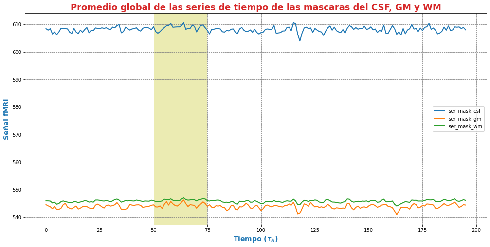
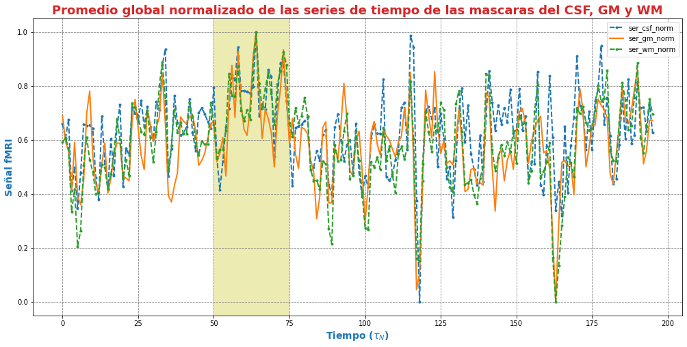
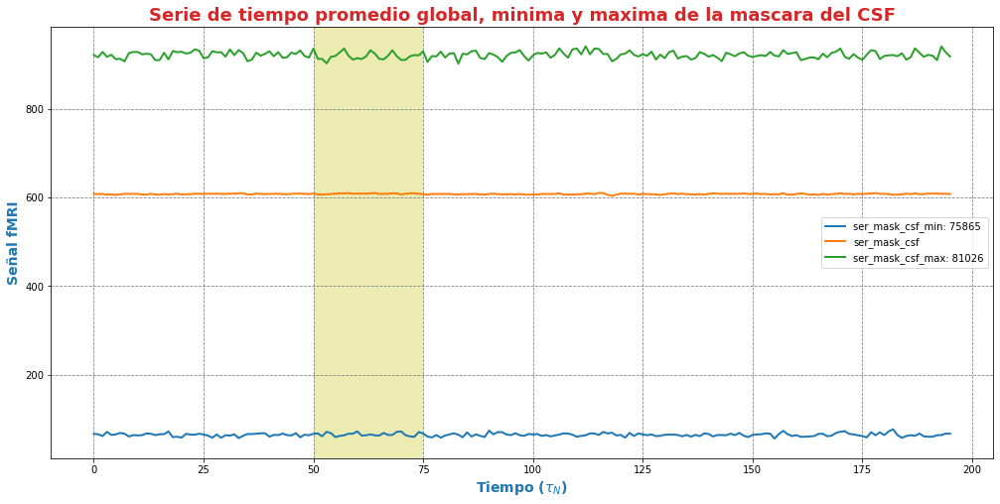
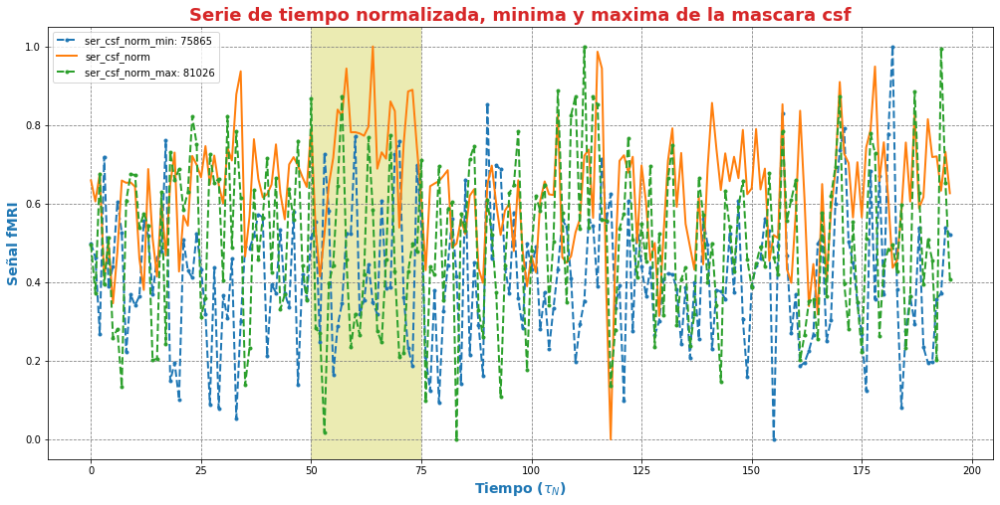
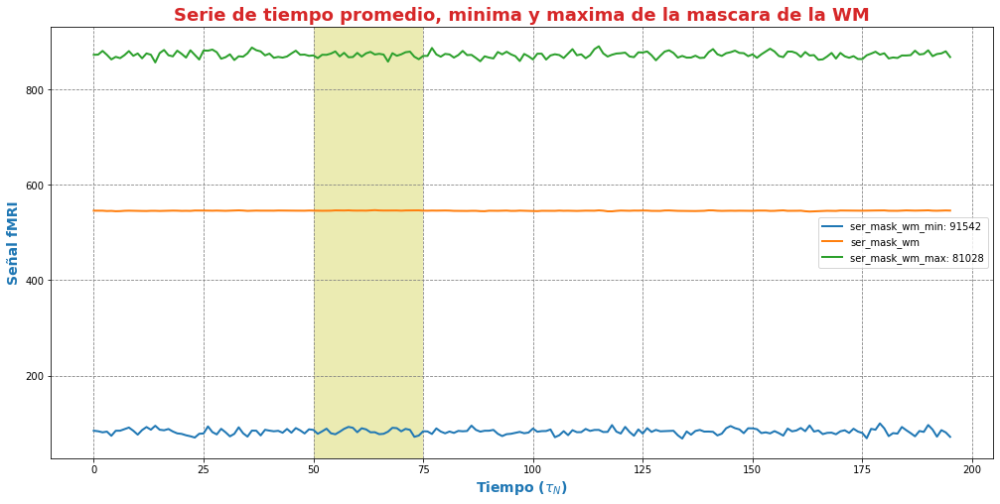
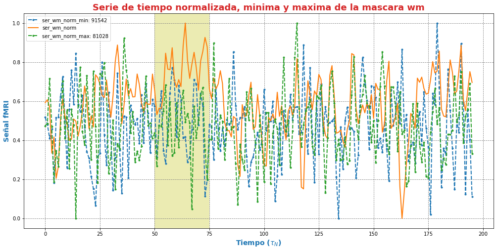

|image0|

--------------

--------------

**Andres Eduardo Aracena Rangel**

*Estudiante del programa del Magister en Física Médica*

--------------

--------------

Acronimos:

-  CSF: Cerebrospinal Fluid (*líquido cefalorraquídeo*)
-  GM: Gray Matter (*materia gris*)
-  WM: White Matter (*materia blanca*)

--------------

--------------

NOTA: Cuando indiquemos imagenes brain o mascaras brain, nos estamos
refieriendo a las imagenes o mascaras de csf, wm, gm

--------------

--------------

Promedio de las series de tiempo del tejido cerebral
====================================================

Del notebook **03_extraccion_series_tiempo_brain_umbral_095.ipynb** se
extrajo las series de tiempo que corresponden a las mascaras para csf,
gm y wm para el umbral de *0.95*.

En este notebook solo trabajaremos con las mascaras de csf, gm y wm pafa
el umbral de 0.95, donde extraeremos su serie de tiempo promedio y
normalizada.

  ## Importamos librerias

.. code:: python

   import time # medir el tiempo de ejecución de nuestros programas
   start = time.process_time()
   inicio = time.time()

.. code:: python

   import os # El módulo os nos permite acceder a funcionalidades dependientes del Sistema Operativo
   from os.path import join as opj # Este método concatena varios componentes de ruta con exactamente un separador de directorio(‘/’)

   from nipype import SelectFiles

   import nibabel as nib
   import numpy as np
   import matplotlib.pyplot as plt

   import pandas as pd

   from nilearn.plotting import plot_anat
   %matplotlib inline

::

   220720-15:29:56,936 nipype.utils WARNING:
        A newer version (1.8.3) of nipy/nipype is available. You are using 1.7.0

   /home/aracena/.local/lib/python3.9/site-packages/nilearn/datasets/__init__.py:93: FutureWarning: Fetchers from the nilearn.datasets module will be updated in version 0.9 to return python strings instead of bytes and Pandas dataframes instead of Numpy arrays.
     warn("Fetchers from the nilearn.datasets module will be "

Definimos parámetros
--------------------

.. code:: python

   '''
   Ruta del directorio de la data
   '''
   path_data = '/home/aracena/thesis_ds002422/' 

   '''
   Ruta donde reposa las series de tiempo (y posición de voxels) extraidas de las mascacaras csf, gm y wm
   '''
   path_ser = opj(path_data,'03_fase2_extraccion_series_tiempo_brain','output')

   '''
   lista de tejidos a procesar
   '''
   tejido = ['ser_mask_csf', 'ser_mask_gm', 'ser_mask_wm']

         
   '''
   Ingrese el umbral de la mascara que se realiza el promedio de sus series
   (se extrajeron tres mask brain para tres umbrales distintos)
   '''
   umbral_sel = '0.95'

   '''
   Ruta donde se guardaran los resultados
   '''
   path_out = opj(path_data,'04_fase2_promedio_series_tiempo_brain','output', umbral_sel)

   # Ruta donde se guardara archivos csv
   path_csv = opj(path_out,'archivos_csv')

   # Ruta donde se guardaran las imagenes png
   path_png = opj(path_out,'archivos_png')

   '''
   Creamos la carpeta de salida
   '''
   os.system('mkdir -p %s'%path_out)
   os.system('mkdir -p %s'%path_csv)
   os.system('mkdir -p %s'%path_png)

   '''
   Creamos la carpeta de salida para tablas
   '''
   path_out_DF = opj(path_out,'tablas_proyecto')
   os.system('mkdir -p %s'%path_out_DF);

Definimos funciones
-------------------

Función para graficar series de tiempo
~~~~~~~~~~~~~~~~~~~~~~~~~~~~~~~~~~~~~~

.. code:: python

   '''
   Función grafica las series de tiempo de una DF introducida. Se requiere input:

   - df_data = Dataframe que contiene las series de tiempo
   - name_save = nombre con que desea guardar el grafico
   '''

   def plot_series_time(df_data, resaltar, titulo, name_save): 
       # Creamos una lista con las claves del diccionario ingresado
       tejido = list(df_data.keys())
       # definimos una ventana
       vent_min = 50
       vent_max = 75

       font1 = {'fontsize':14, 'fontweight':'bold', 'color':'tab:blue'}
       font2  = {'fontsize':18, 'fontweight':'bold', 'color':'tab:red'}

       fig, ax = plt.subplots(figsize = (17,8))
       for i,tisue in enumerate(tejido):
           if resaltar == 'all':
               ax.plot(df_data[tisue], linewidth=2, label=tisue)
           else:
               if tisue == resaltar:
                   ax.plot(df_data[tisue], linewidth=2, label=tisue)
               else:           
                   ax.plot(df_data[tisue], '--.', linewidth=2, label=tisue)

       ax.legend()
       ax.set_xlabel('Tiempo ($\\tau_N$)',fontdict=font1)
       ax.set_ylabel('Señal fMRI',fontdict=font1)
       ax.set_title(titulo, fontdict = font2)
       ax.grid(axis = 'x', color = 'gray', linestyle = 'dashed')
       ax.grid(axis = 'y', color = 'gray', linestyle = 'dashed')
       ax.axvspan(vent_min,vent_max, alpha=0.3, facecolor='y')

       plt.savefig(opj(path_png, name_save))

Cargamos datos de las series de tiempo de las mascaras brain
------------------------------------------------------------

Interfaz SelectFiles - ser_brain_mask
~~~~~~~~~~~~~~~~~~~~~~~~~~~~~~~~~~~~~

En esta oportunidad, trabajaremos con interface\* SelectFiles*, para
extraer las direcciones de las series de tiempo extraidas de las
mascaras brain, y posteriormente cargamos sus datos en un diccionario.

Extramos las rutas de las series de tiempo de las mascaras para el
umbralestablecido; extracion de series de tiempo en el notebook
**03_extraccion_series_tiempo_brain_umbral_095.ipynb**

.. code:: python

   # La entrada template indica la plantilla de cadena que debe coincidir en el directorio indicado a buscar
   templates = {'ser_brain': '{umbral}/archivos_csv/serie_tiempo_all_mask_*.csv'}
          
   selectfiles = SelectFiles(templates)

   '''
   Inputs
   - Ubicación de la carpeta del conjunto de datos
   - Cadenas de marcador de posición {}
   '''
   # La entrada base_directory indica en que directorio buscar
   selectfiles.inputs.base_directory = path_ser

   #Ingresamos la(s) cadena(s) de marcador de posición {} con valores
   selectfiles.inputs.umbral = umbral_sel
   #selectfiles.inputs.tejido = tejido
   #ser_brain_mask.iterables = ('tejido', tejido)

   # ejecutamos 
   ser_brain_mask = selectfiles.run().outputs

.. code:: python

   ser_brain_mask

::

   ser_brain = ['/home/aracena/thesis_ds002422/03_fase2_extraccion_series_tiempo_brain/output/0.95/archivos_csv/serie_tiempo_all_mask_csf.csv', '/home/aracena/thesis_ds002422/03_fase2_extraccion_series_tiempo_brain/output/0.95/archivos_csv/serie_tiempo_all_mask_gm.csv', '/home/aracena/thesis_ds002422/03_fase2_extraccion_series_tiempo_brain/output/0.95/archivos_csv/serie_tiempo_all_mask_wm.csv']

Diccionarios para las series de tiempo de las mascaras brain
~~~~~~~~~~~~~~~~~~~~~~~~~~~~~~~~~~~~~~~~~~~~~~~~~~~~~~~~~~~~

.. code:: python

   ser_all_brain = dict(zip(tejido,ser_brain_mask.ser_brain))
   print('series de tiempo de las mascaras\n', ser_all_brain)

::

   series de tiempo de las mascaras
    {'ser_mask_csf': '/home/aracena/thesis_ds002422/03_fase2_extraccion_series_tiempo_brain/output/0.95/archivos_csv/serie_tiempo_all_mask_csf.csv', 'ser_mask_gm': '/home/aracena/thesis_ds002422/03_fase2_extraccion_series_tiempo_brain/output/0.95/archivos_csv/serie_tiempo_all_mask_gm.csv', 'ser_mask_wm': '/home/aracena/thesis_ds002422/03_fase2_extraccion_series_tiempo_brain/output/0.95/archivos_csv/serie_tiempo_all_mask_wm.csv'}

Cargamos los datos de las series de tiempo
~~~~~~~~~~~~~~~~~~~~~~~~~~~~~~~~~~~~~~~~~~

.. code:: python

   #lista_brain = list(mask.keys()) # extraemos una lista de las mascaras

   ser_tiem = {}
   for i, tisue in enumerate(ser_all_brain):
       ser_tiem[tisue] = pd.read_csv(ser_all_brain[tisue])

   print(ser_tiem['ser_mask_csf'].shape)
   print(ser_tiem['ser_mask_wm'].shape)
   print(ser_tiem['ser_mask_gm'].shape)

::

   (196, 664)
   (196, 9439)
   (196, 1794)

.. code:: python

   pd.options.display.max_columns = 8
   ser_tiem['ser_mask_csf']

.. container::

   .. raw:: html

      

   .. raw:: html

      <table border="1" class="dataframe">

   .. raw:: html

      <thead>

   .. raw:: html

      <tr style="text-align: right;">

   .. raw:: html

      <th>

   .. raw:: html

      </th>

   .. raw:: html

      <th>

   42789

   .. raw:: html

      </th>

   .. raw:: html

      <th>

   42790

   .. raw:: html

      </th>

   .. raw:: html

      <th>

   42791

   .. raw:: html

      </th>

   .. raw:: html

      <th>

   42833

   .. raw:: html

      </th>

   .. raw:: html

      <th>

   …

   .. raw:: html

      </th>

   .. raw:: html

      <th>

   119220

   .. raw:: html

      </th>

   .. raw:: html

      <th>

   119224

   .. raw:: html

      </th>

   .. raw:: html

      <th>

   119225

   .. raw:: html

      </th>

   .. raw:: html

      <th>

   119226

   .. raw:: html

      </th>

   .. raw:: html

      </tr>

   .. raw:: html

      </thead>

   .. raw:: html

      <tbody>

   .. raw:: html

      <tr>

   .. raw:: html

      <th>

   0

   .. raw:: html

      </th>

   .. raw:: html

      <td>

   147.668701

   .. raw:: html

      </td>

   .. raw:: html

      <td>

   199.851395

   .. raw:: html

      </td>

   .. raw:: html

      <td>

   321.464417

   .. raw:: html

      </td>

   .. raw:: html

      <td>

   319.859619

   .. raw:: html

      </td>

   .. raw:: html

      <td>

   …

   .. raw:: html

      </td>

   .. raw:: html

      <td>

   563.222595

   .. raw:: html

      </td>

   .. raw:: html

      <td>

   571.135742

   .. raw:: html

      </td>

   .. raw:: html

      <td>

   569.495667

   .. raw:: html

      </td>

   .. raw:: html

      <td>

   573.659790

   .. raw:: html

      </td>

   .. raw:: html

      </tr>

   .. raw:: html

      <tr>

   .. raw:: html

      <th>

   1

   .. raw:: html

      </th>

   .. raw:: html

      <td>

   147.734985

   .. raw:: html

      </td>

   .. raw:: html

      <td>

   203.295837

   .. raw:: html

      </td>

   .. raw:: html

      <td>

   316.090210

   .. raw:: html

      </td>

   .. raw:: html

      <td>

   320.602753

   .. raw:: html

      </td>

   .. raw:: html

      <td>

   …

   .. raw:: html

      </td>

   .. raw:: html

      <td>

   572.265747

   .. raw:: html

      </td>

   .. raw:: html

      <td>

   574.809692

   .. raw:: html

      </td>

   .. raw:: html

      <td>

   565.620789

   .. raw:: html

      </td>

   .. raw:: html

      <td>

   569.487976

   .. raw:: html

      </td>

   .. raw:: html

      </tr>

   .. raw:: html

      <tr>

   .. raw:: html

      <th>

   2

   .. raw:: html

      </th>

   .. raw:: html

      <td>

   147.813690

   .. raw:: html

      </td>

   .. raw:: html

      <td>

   198.290558

   .. raw:: html

      </td>

   .. raw:: html

      <td>

   318.719666

   .. raw:: html

      </td>

   .. raw:: html

      <td>

   324.457642

   .. raw:: html

      </td>

   .. raw:: html

      <td>

   …

   .. raw:: html

      </td>

   .. raw:: html

      <td>

   579.156067

   .. raw:: html

      </td>

   .. raw:: html

      <td>

   568.527588

   .. raw:: html

      </td>

   .. raw:: html

      <td>

   569.592651

   .. raw:: html

      </td>

   .. raw:: html

      <td>

   570.382019

   .. raw:: html

      </td>

   .. raw:: html

      </tr>

   .. raw:: html

      <tr>

   .. raw:: html

      <th>

   3

   .. raw:: html

      </th>

   .. raw:: html

      <td>

   148.630875

   .. raw:: html

      </td>

   .. raw:: html

      <td>

   207.636703

   .. raw:: html

      </td>

   .. raw:: html

      <td>

   311.952423

   .. raw:: html

      </td>

   .. raw:: html

      <td>

   325.447235

   .. raw:: html

      </td>

   .. raw:: html

      <td>

   …

   .. raw:: html

      </td>

   .. raw:: html

      <td>

   562.293640

   .. raw:: html

      </td>

   .. raw:: html

      <td>

   570.185669

   .. raw:: html

      </td>

   .. raw:: html

      <td>

   564.723206

   .. raw:: html

      </td>

   .. raw:: html

      <td>

   571.315186

   .. raw:: html

      </td>

   .. raw:: html

      </tr>

   .. raw:: html

      <tr>

   .. raw:: html

      <th>

   4

   .. raw:: html

      </th>

   .. raw:: html

      <td>

   148.653290

   .. raw:: html

      </td>

   .. raw:: html

      <td>

   203.587326

   .. raw:: html

      </td>

   .. raw:: html

      <td>

   304.501617

   .. raw:: html

      </td>

   .. raw:: html

      <td>

   329.378143

   .. raw:: html

      </td>

   .. raw:: html

      <td>

   …

   .. raw:: html

      </td>

   .. raw:: html

      <td>

   564.004456

   .. raw:: html

      </td>

   .. raw:: html

      <td>

   575.846069

   .. raw:: html

      </td>

   .. raw:: html

      <td>

   566.695435

   .. raw:: html

      </td>

   .. raw:: html

      <td>

   577.148010

   .. raw:: html

      </td>

   .. raw:: html

      </tr>

   .. raw:: html

      <tr>

   .. raw:: html

      <th>

   …

   .. raw:: html

      </th>

   .. raw:: html

      <td>

   …

   .. raw:: html

      </td>

   .. raw:: html

      <td>

   …

   .. raw:: html

      </td>

   .. raw:: html

      <td>

   …

   .. raw:: html

      </td>

   .. raw:: html

      <td>

   …

   .. raw:: html

      </td>

   .. raw:: html

      <td>

   …

   .. raw:: html

      </td>

   .. raw:: html

      <td>

   …

   .. raw:: html

      </td>

   .. raw:: html

      <td>

   …

   .. raw:: html

      </td>

   .. raw:: html

      <td>

   …

   .. raw:: html

      </td>

   .. raw:: html

      <td>

   …

   .. raw:: html

      </td>

   .. raw:: html

      </tr>

   .. raw:: html

      <tr>

   .. raw:: html

      <th>

   191

   .. raw:: html

      </th>

   .. raw:: html

      <td>

   141.190781

   .. raw:: html

      </td>

   .. raw:: html

      <td>

   206.106812

   .. raw:: html

      </td>

   .. raw:: html

      <td>

   308.748840

   .. raw:: html

      </td>

   .. raw:: html

      <td>

   318.514404

   .. raw:: html

      </td>

   .. raw:: html

      <td>

   …

   .. raw:: html

      </td>

   .. raw:: html

      <td>

   570.030457

   .. raw:: html

      </td>

   .. raw:: html

      <td>

   570.975403

   .. raw:: html

      </td>

   .. raw:: html

      <td>

   568.758972

   .. raw:: html

      </td>

   .. raw:: html

      <td>

   574.168945

   .. raw:: html

      </td>

   .. raw:: html

      </tr>

   .. raw:: html

      <tr>

   .. raw:: html

      <th>

   192

   .. raw:: html

      </th>

   .. raw:: html

      <td>

   148.696869

   .. raw:: html

      </td>

   .. raw:: html

      <td>

   212.194748

   .. raw:: html

      </td>

   .. raw:: html

      <td>

   314.824097

   .. raw:: html

      </td>

   .. raw:: html

      <td>

   325.573364

   .. raw:: html

      </td>

   .. raw:: html

      <td>

   …

   .. raw:: html

      </td>

   .. raw:: html

      <td>

   576.565796

   .. raw:: html

      </td>

   .. raw:: html

      <td>

   573.521729

   .. raw:: html

      </td>

   .. raw:: html

      <td>

   570.436768

   .. raw:: html

      </td>

   .. raw:: html

      <td>

   570.730591

   .. raw:: html

      </td>

   .. raw:: html

      </tr>

   .. raw:: html

      <tr>

   .. raw:: html

      <th>

   193

   .. raw:: html

      </th>

   .. raw:: html

      <td>

   152.130447

   .. raw:: html

      </td>

   .. raw:: html

      <td>

   211.498489

   .. raw:: html

      </td>

   .. raw:: html

      <td>

   313.927216

   .. raw:: html

      </td>

   .. raw:: html

      <td>

   315.044403

   .. raw:: html

      </td>

   .. raw:: html

      <td>

   …

   .. raw:: html

      </td>

   .. raw:: html

      <td>

   569.587463

   .. raw:: html

      </td>

   .. raw:: html

      <td>

   565.593323

   .. raw:: html

      </td>

   .. raw:: html

      <td>

   567.328613

   .. raw:: html

      </td>

   .. raw:: html

      <td>

   574.088501

   .. raw:: html

      </td>

   .. raw:: html

      </tr>

   .. raw:: html

      <tr>

   .. raw:: html

      <th>

   194

   .. raw:: html

      </th>

   .. raw:: html

      <td>

   146.669983

   .. raw:: html

      </td>

   .. raw:: html

      <td>

   214.301300

   .. raw:: html

      </td>

   .. raw:: html

      <td>

   301.381012

   .. raw:: html

      </td>

   .. raw:: html

      <td>

   306.016785

   .. raw:: html

      </td>

   .. raw:: html

      <td>

   …

   .. raw:: html

      </td>

   .. raw:: html

      <td>

   573.925476

   .. raw:: html

      </td>

   .. raw:: html

      <td>

   576.993652

   .. raw:: html

      </td>

   .. raw:: html

      <td>

   574.053040

   .. raw:: html

      </td>

   .. raw:: html

      <td>

   576.496826

   .. raw:: html

      </td>

   .. raw:: html

      </tr>

   .. raw:: html

      <tr>

   .. raw:: html

      <th>

   195

   .. raw:: html

      </th>

   .. raw:: html

      <td>

   140.227005

   .. raw:: html

      </td>

   .. raw:: html

      <td>

   208.586624

   .. raw:: html

      </td>

   .. raw:: html

      <td>

   303.595093

   .. raw:: html

      </td>

   .. raw:: html

      <td>

   295.467163

   .. raw:: html

      </td>

   .. raw:: html

      <td>

   …

   .. raw:: html

      </td>

   .. raw:: html

      <td>

   568.996338

   .. raw:: html

      </td>

   .. raw:: html

      <td>

   571.335266

   .. raw:: html

      </td>

   .. raw:: html

      <td>

   571.035278

   .. raw:: html

      </td>

   .. raw:: html

      <td>

   575.821350

   .. raw:: html

      </td>

   .. raw:: html

      </tr>

   .. raw:: html

      </tbody>

   .. raw:: html

      </table>

   .. raw:: html

      

   196 rows × 664 columns

   .. raw:: html

      

.. code:: python

   ser_tiem['ser_mask_csf']['42789'].describe()

::

   count    196.000000
   mean     143.845704
   std        6.412026
   min      124.052040
   25%      140.418392
   50%      144.187172
   75%      147.754662
   max      160.470428
   Name: 42789, dtype: float64

.. code:: python

   ser_tiem['ser_mask_csf']['119226'].describe()

::

   count    196.000000
   mean     572.781509
   std        2.955697
   min      564.041931
   25%      570.722473
   50%      572.566437
   75%      574.722824
   max      580.456299
   Name: 119226, dtype: float64

Cargamos datos del promedio de las series de tiempo de las mascaras brain
-------------------------------------------------------------------------

Interfaz SelectFiles - ser_norm_brain_mask
~~~~~~~~~~~~~~~~~~~~~~~~~~~~~~~~~~~~~~~~~~

En esta oportunidad, trabajaremos con interface\* SelectFiles*, para
extraer las direcciones del promedio de las series de tiempo extraidas
de las mascaras brain, y posteriormente cargamos sus datos en un
diccionario.

Extramos las rutas de las series de tiempo de las mascaras para el
umbralestablecido; extracion de series de tiempo en el notebook
**03_extraccion_series_tiempo_brain_umbral_095.ipynb**

.. code:: python

   # La entrada template indica la plantilla de cadena que debe coincidir en el directorio indicado a buscar
   templates = {'ser_norm_brain': '{umbral}/archivos_csv/serie_tiempo_all_norm_mask_*.csv'}
          
   selectfiles = SelectFiles(templates)

   '''
   Inputs
   - Ubicación de la carpeta del conjunto de datos
   - Cadenas de marcador de posición {}
   '''
   # La entrada base_directory indica en que directorio buscar
   selectfiles.inputs.base_directory = path_ser

   #Ingresamos la(s) cadena(s) de marcador de posición {} con valores
   selectfiles.inputs.umbral = umbral_sel
   #selectfiles.inputs.tejido = tejido
   #ser_brain_mask.iterables = ('tejido', tejido)

   # ejecutamos 
   ser_norm_brain_mask = selectfiles.run().outputs

.. code:: python

   ser_norm_brain_mask

::

   ser_norm_brain = ['/home/aracena/thesis_ds002422/03_fase2_extraccion_series_tiempo_brain/output/0.95/archivos_csv/serie_tiempo_all_norm_mask_csf.csv', '/home/aracena/thesis_ds002422/03_fase2_extraccion_series_tiempo_brain/output/0.95/archivos_csv/serie_tiempo_all_norm_mask_gm.csv', '/home/aracena/thesis_ds002422/03_fase2_extraccion_series_tiempo_brain/output/0.95/archivos_csv/serie_tiempo_all_norm_mask_wm.csv']

Diccionarios para el promedio de las series de tiempo de las mascaras brain
~~~~~~~~~~~~~~~~~~~~~~~~~~~~~~~~~~~~~~~~~~~~~~~~~~~~~~~~~~~~~~~~~~~~~~~~~~~

.. code:: python

   ser_norm_all_brain = dict(zip(tejido,ser_norm_brain_mask.ser_norm_brain))
   print('series de tiempo normalizadas de las mascaras\n', ser_norm_all_brain)

::

   series de tiempo normalizadas de las mascaras
    {'ser_mask_csf': '/home/aracena/thesis_ds002422/03_fase2_extraccion_series_tiempo_brain/output/0.95/archivos_csv/serie_tiempo_all_norm_mask_csf.csv', 'ser_mask_gm': '/home/aracena/thesis_ds002422/03_fase2_extraccion_series_tiempo_brain/output/0.95/archivos_csv/serie_tiempo_all_norm_mask_gm.csv', 'ser_mask_wm': '/home/aracena/thesis_ds002422/03_fase2_extraccion_series_tiempo_brain/output/0.95/archivos_csv/serie_tiempo_all_norm_mask_wm.csv'}

Cargamos los datos del promedio de las series de tiempo
~~~~~~~~~~~~~~~~~~~~~~~~~~~~~~~~~~~~~~~~~~~~~~~~~~~~~~~

.. code:: python

   #lista_brain = list(mask.keys()) # extraemos una lista de las mascaras

   ser_tiem_norm = {}
   for i, tisue in enumerate(ser_norm_all_brain):
       ser_tiem_norm[tisue] = pd.read_csv(ser_norm_all_brain[tisue])

.. code:: python

   pd.options.display.max_columns = 8
   ser_tiem_norm['ser_mask_csf']

.. container::

   .. raw:: html

      

   .. raw:: html

      <table border="1" class="dataframe">

   .. raw:: html

      <thead>

   .. raw:: html

      <tr style="text-align: right;">

   .. raw:: html

      <th>

   .. raw:: html

      </th>

   .. raw:: html

      <th>

   42789

   .. raw:: html

      </th>

   .. raw:: html

      <th>

   42790

   .. raw:: html

      </th>

   .. raw:: html

      <th>

   42791

   .. raw:: html

      </th>

   .. raw:: html

      <th>

   42833

   .. raw:: html

      </th>

   .. raw:: html

      <th>

   …

   .. raw:: html

      </th>

   .. raw:: html

      <th>

   119220

   .. raw:: html

      </th>

   .. raw:: html

      <th>

   119224

   .. raw:: html

      </th>

   .. raw:: html

      <th>

   119225

   .. raw:: html

      </th>

   .. raw:: html

      <th>

   119226

   .. raw:: html

      </th>

   .. raw:: html

      </tr>

   .. raw:: html

      </thead>

   .. raw:: html

      <tbody>

   .. raw:: html

      <tr>

   .. raw:: html

      <th>

   0

   .. raw:: html

      </th>

   .. raw:: html

      <td>

   0.648482

   .. raw:: html

      </td>

   .. raw:: html

      <td>

   0.465610

   .. raw:: html

      </td>

   .. raw:: html

      <td>

   0.696788

   .. raw:: html

      </td>

   .. raw:: html

      <td>

   0.561077

   .. raw:: html

      </td>

   .. raw:: html

      <td>

   …

   .. raw:: html

      </td>

   .. raw:: html

      <td>

   0.326825

   .. raw:: html

      </td>

   .. raw:: html

      <td>

   0.561927

   .. raw:: html

      </td>

   .. raw:: html

      <td>

   0.516017

   .. raw:: html

      </td>

   .. raw:: html

      <td>

   0.585941

   .. raw:: html

      </td>

   .. raw:: html

      </tr>

   .. raw:: html

      <tr>

   .. raw:: html

      <th>

   1

   .. raw:: html

      </th>

   .. raw:: html

      <td>

   0.650302

   .. raw:: html

      </td>

   .. raw:: html

      <td>

   0.557280

   .. raw:: html

      </td>

   .. raw:: html

      <td>

   0.593478

   .. raw:: html

      </td>

   .. raw:: html

      <td>

   0.577106

   .. raw:: html

      </td>

   .. raw:: html

      <td>

   …

   .. raw:: html

      </td>

   .. raw:: html

      <td>

   0.668015

   .. raw:: html

      </td>

   .. raw:: html

      <td>

   0.744916

   .. raw:: html

      </td>

   .. raw:: html

      <td>

   0.311767

   .. raw:: html

      </td>

   .. raw:: html

      <td>

   0.331785

   .. raw:: html

      </td>

   .. raw:: html

      </tr>

   .. raw:: html

      <tr>

   .. raw:: html

      <th>

   2

   .. raw:: html

      </th>

   .. raw:: html

      <td>

   0.652463

   .. raw:: html

      </td>

   .. raw:: html

      <td>

   0.424070

   .. raw:: html

      </td>

   .. raw:: html

      <td>

   0.644025

   .. raw:: html

      </td>

   .. raw:: html

      <td>

   0.660252

   .. raw:: html

      </td>

   .. raw:: html

      <td>

   …

   .. raw:: html

      </td>

   .. raw:: html

      <td>

   0.927980

   .. raw:: html

      </td>

   .. raw:: html

      <td>

   0.432023

   .. raw:: html

      </td>

   .. raw:: html

      <td>

   0.521129

   .. raw:: html

      </td>

   .. raw:: html

      <td>

   0.386252

   .. raw:: html

      </td>

   .. raw:: html

      </tr>

   .. raw:: html

      <tr>

   .. raw:: html

      <th>

   3

   .. raw:: html

      </th>

   .. raw:: html

      <td>

   0.674902

   .. raw:: html

      </td>

   .. raw:: html

      <td>

   0.672808

   .. raw:: html

      </td>

   .. raw:: html

      <td>

   0.513937

   .. raw:: html

      </td>

   .. raw:: html

      <td>

   0.681597

   .. raw:: html

      </td>

   .. raw:: html

      <td>

   …

   .. raw:: html

      </td>

   .. raw:: html

      <td>

   0.291776

   .. raw:: html

      </td>

   .. raw:: html

      <td>

   0.514607

   .. raw:: html

      </td>

   .. raw:: html

      <td>

   0.264454

   .. raw:: html

      </td>

   .. raw:: html

      <td>

   0.443103

   .. raw:: html

      </td>

   .. raw:: html

      </tr>

   .. raw:: html

      <tr>

   .. raw:: html

      <th>

   4

   .. raw:: html

      </th>

   .. raw:: html

      <td>

   0.675517

   .. raw:: html

      </td>

   .. raw:: html

      <td>

   0.565038

   .. raw:: html

      </td>

   .. raw:: html

      <td>

   0.370708

   .. raw:: html

      </td>

   .. raw:: html

      <td>

   0.766383

   .. raw:: html

      </td>

   .. raw:: html

      <td>

   …

   .. raw:: html

      </td>

   .. raw:: html

      <td>

   0.356324

   .. raw:: html

      </td>

   .. raw:: html

      <td>

   0.796534

   .. raw:: html

      </td>

   .. raw:: html

      <td>

   0.368413

   .. raw:: html

      </td>

   .. raw:: html

      <td>

   0.798452

   .. raw:: html

      </td>

   .. raw:: html

      </tr>

   .. raw:: html

      <tr>

   .. raw:: html

      <th>

   …

   .. raw:: html

      </th>

   .. raw:: html

      <td>

   …

   .. raw:: html

      </td>

   .. raw:: html

      <td>

   …

   .. raw:: html

      </td>

   .. raw:: html

      <td>

   …

   .. raw:: html

      </td>

   .. raw:: html

      <td>

   …

   .. raw:: html

      </td>

   .. raw:: html

      <td>

   …

   .. raw:: html

      </td>

   .. raw:: html

      <td>

   …

   .. raw:: html

      </td>

   .. raw:: html

      <td>

   …

   .. raw:: html

      </td>

   .. raw:: html

      <td>

   …

   .. raw:: html

      </td>

   .. raw:: html

      <td>

   …

   .. raw:: html

      </td>

   .. raw:: html

      </tr>

   .. raw:: html

      <tr>

   .. raw:: html

      <th>

   191

   .. raw:: html

      </th>

   .. raw:: html

      <td>

   0.470607

   .. raw:: html

      </td>

   .. raw:: html

      <td>

   0.632092

   .. raw:: html

      </td>

   .. raw:: html

      <td>

   0.452353

   .. raw:: html

      </td>

   .. raw:: html

      <td>

   0.532062

   .. raw:: html

      </td>

   .. raw:: html

      <td>

   …

   .. raw:: html

      </td>

   .. raw:: html

      <td>

   0.583679

   .. raw:: html

      </td>

   .. raw:: html

      <td>

   0.553941

   .. raw:: html

      </td>

   .. raw:: html

      <td>

   0.477185

   .. raw:: html

      </td>

   .. raw:: html

      <td>

   0.616960

   .. raw:: html

      </td>

   .. raw:: html

      </tr>

   .. raw:: html

      <tr>

   .. raw:: html

      <th>

   192

   .. raw:: html

      </th>

   .. raw:: html

      <td>

   0.676714

   .. raw:: html

      </td>

   .. raw:: html

      <td>

   0.794115

   .. raw:: html

      </td>

   .. raw:: html

      <td>

   0.569139

   .. raw:: html

      </td>

   .. raw:: html

      <td>

   0.684318

   .. raw:: html

      </td>

   .. raw:: html

      <td>

   …

   .. raw:: html

      </td>

   .. raw:: html

      <td>

   0.830251

   .. raw:: html

      </td>

   .. raw:: html

      <td>

   0.680766

   .. raw:: html

      </td>

   .. raw:: html

      <td>

   0.565624

   .. raw:: html

      </td>

   .. raw:: html

      <td>

   0.407488

   .. raw:: html

      </td>

   .. raw:: html

      </tr>

   .. raw:: html

      <tr>

   .. raw:: html

      <th>

   193

   .. raw:: html

      </th>

   .. raw:: html

      <td>

   0.770995

   .. raw:: html

      </td>

   .. raw:: html

      <td>

   0.775585

   .. raw:: html

      </td>

   .. raw:: html

      <td>

   0.551899

   .. raw:: html

      </td>

   .. raw:: html

      <td>

   0.457217

   .. raw:: html

      </td>

   .. raw:: html

      <td>

   …

   .. raw:: html

      </td>

   .. raw:: html

      <td>

   0.566965

   .. raw:: html

      </td>

   .. raw:: html

      <td>

   0.285876

   .. raw:: html

      </td>

   .. raw:: html

      <td>

   0.401789

   .. raw:: html

      </td>

   .. raw:: html

      <td>

   0.612060

   .. raw:: html

      </td>

   .. raw:: html

      </tr>

   .. raw:: html

      <tr>

   .. raw:: html

      <th>

   194

   .. raw:: html

      </th>

   .. raw:: html

      <td>

   0.621058

   .. raw:: html

      </td>

   .. raw:: html

      <td>

   0.850179

   .. raw:: html

      </td>

   .. raw:: html

      <td>

   0.310720

   .. raw:: html

      </td>

   .. raw:: html

      <td>

   0.262500

   .. raw:: html

      </td>

   .. raw:: html

      <td>

   …

   .. raw:: html

      </td>

   .. raw:: html

      <td>

   0.730635

   .. raw:: html

      </td>

   .. raw:: html

      <td>

   0.853692

   .. raw:: html

      </td>

   .. raw:: html

      <td>

   0.756242

   .. raw:: html

      </td>

   .. raw:: html

      <td>

   0.758780

   .. raw:: html

      </td>

   .. raw:: html

      </tr>

   .. raw:: html

      <tr>

   .. raw:: html

      <th>

   195

   .. raw:: html

      </th>

   .. raw:: html

      <td>

   0.444143

   .. raw:: html

      </td>

   .. raw:: html

      <td>

   0.698089

   .. raw:: html

      </td>

   .. raw:: html

      <td>

   0.353282

   .. raw:: html

      </td>

   .. raw:: html

      <td>

   0.034954

   .. raw:: html

      </td>

   .. raw:: html

      <td>

   …

   .. raw:: html

      </td>

   .. raw:: html

      <td>

   0.544663

   .. raw:: html

      </td>

   .. raw:: html

      <td>

   0.571865

   .. raw:: html

      </td>

   .. raw:: html

      <td>

   0.597172

   .. raw:: html

      </td>

   .. raw:: html

      <td>

   0.717629

   .. raw:: html

      </td>

   .. raw:: html

      </tr>

   .. raw:: html

      </tbody>

   .. raw:: html

      </table>

   .. raw:: html

      

   196 rows × 664 columns

   .. raw:: html

      

Promediamos las series de tiempo de cada mascara
------------------------------------------------

Estrategia
~~~~~~~~~~

Aplicamos la transpuesta del dataframe que contiene las series de tiempo
de la mascara que deseamos promediar, asi de esta manera, tendremos en
las columnas la variable **tiempo** y aplicamos el método de pandas
*mean()* para calcular el promedio de una columna del dataframe. DE esta
manera obtenemos la seria promedio de las mascaras brain

.. code:: python

   ser_tiem['ser_mask_csf']

.. container::

   .. raw:: html

      

   .. raw:: html

      <table border="1" class="dataframe">

   .. raw:: html

      <thead>

   .. raw:: html

      <tr style="text-align: right;">

   .. raw:: html

      <th>

   .. raw:: html

      </th>

   .. raw:: html

      <th>

   42789

   .. raw:: html

      </th>

   .. raw:: html

      <th>

   42790

   .. raw:: html

      </th>

   .. raw:: html

      <th>

   42791

   .. raw:: html

      </th>

   .. raw:: html

      <th>

   42833

   .. raw:: html

      </th>

   .. raw:: html

      <th>

   …

   .. raw:: html

      </th>

   .. raw:: html

      <th>

   119220

   .. raw:: html

      </th>

   .. raw:: html

      <th>

   119224

   .. raw:: html

      </th>

   .. raw:: html

      <th>

   119225

   .. raw:: html

      </th>

   .. raw:: html

      <th>

   119226

   .. raw:: html

      </th>

   .. raw:: html

      </tr>

   .. raw:: html

      </thead>

   .. raw:: html

      <tbody>

   .. raw:: html

      <tr>

   .. raw:: html

      <th>

   0

   .. raw:: html

      </th>

   .. raw:: html

      <td>

   147.668701

   .. raw:: html

      </td>

   .. raw:: html

      <td>

   199.851395

   .. raw:: html

      </td>

   .. raw:: html

      <td>

   321.464417

   .. raw:: html

      </td>

   .. raw:: html

      <td>

   319.859619

   .. raw:: html

      </td>

   .. raw:: html

      <td>

   …

   .. raw:: html

      </td>

   .. raw:: html

      <td>

   563.222595

   .. raw:: html

      </td>

   .. raw:: html

      <td>

   571.135742

   .. raw:: html

      </td>

   .. raw:: html

      <td>

   569.495667

   .. raw:: html

      </td>

   .. raw:: html

      <td>

   573.659790

   .. raw:: html

      </td>

   .. raw:: html

      </tr>

   .. raw:: html

      <tr>

   .. raw:: html

      <th>

   1

   .. raw:: html

      </th>

   .. raw:: html

      <td>

   147.734985

   .. raw:: html

      </td>

   .. raw:: html

      <td>

   203.295837

   .. raw:: html

      </td>

   .. raw:: html

      <td>

   316.090210

   .. raw:: html

      </td>

   .. raw:: html

      <td>

   320.602753

   .. raw:: html

      </td>

   .. raw:: html

      <td>

   …

   .. raw:: html

      </td>

   .. raw:: html

      <td>

   572.265747

   .. raw:: html

      </td>

   .. raw:: html

      <td>

   574.809692

   .. raw:: html

      </td>

   .. raw:: html

      <td>

   565.620789

   .. raw:: html

      </td>

   .. raw:: html

      <td>

   569.487976

   .. raw:: html

      </td>

   .. raw:: html

      </tr>

   .. raw:: html

      <tr>

   .. raw:: html

      <th>

   2

   .. raw:: html

      </th>

   .. raw:: html

      <td>

   147.813690

   .. raw:: html

      </td>

   .. raw:: html

      <td>

   198.290558

   .. raw:: html

      </td>

   .. raw:: html

      <td>

   318.719666

   .. raw:: html

      </td>

   .. raw:: html

      <td>

   324.457642

   .. raw:: html

      </td>

   .. raw:: html

      <td>

   …

   .. raw:: html

      </td>

   .. raw:: html

      <td>

   579.156067

   .. raw:: html

      </td>

   .. raw:: html

      <td>

   568.527588

   .. raw:: html

      </td>

   .. raw:: html

      <td>

   569.592651

   .. raw:: html

      </td>

   .. raw:: html

      <td>

   570.382019

   .. raw:: html

      </td>

   .. raw:: html

      </tr>

   .. raw:: html

      <tr>

   .. raw:: html

      <th>

   3

   .. raw:: html

      </th>

   .. raw:: html

      <td>

   148.630875

   .. raw:: html

      </td>

   .. raw:: html

      <td>

   207.636703

   .. raw:: html

      </td>

   .. raw:: html

      <td>

   311.952423

   .. raw:: html

      </td>

   .. raw:: html

      <td>

   325.447235

   .. raw:: html

      </td>

   .. raw:: html

      <td>

   …

   .. raw:: html

      </td>

   .. raw:: html

      <td>

   562.293640

   .. raw:: html

      </td>

   .. raw:: html

      <td>

   570.185669

   .. raw:: html

      </td>

   .. raw:: html

      <td>

   564.723206

   .. raw:: html

      </td>

   .. raw:: html

      <td>

   571.315186

   .. raw:: html

      </td>

   .. raw:: html

      </tr>

   .. raw:: html

      <tr>

   .. raw:: html

      <th>

   4

   .. raw:: html

      </th>

   .. raw:: html

      <td>

   148.653290

   .. raw:: html

      </td>

   .. raw:: html

      <td>

   203.587326

   .. raw:: html

      </td>

   .. raw:: html

      <td>

   304.501617

   .. raw:: html

      </td>

   .. raw:: html

      <td>

   329.378143

   .. raw:: html

      </td>

   .. raw:: html

      <td>

   …

   .. raw:: html

      </td>

   .. raw:: html

      <td>

   564.004456

   .. raw:: html

      </td>

   .. raw:: html

      <td>

   575.846069

   .. raw:: html

      </td>

   .. raw:: html

      <td>

   566.695435

   .. raw:: html

      </td>

   .. raw:: html

      <td>

   577.148010

   .. raw:: html

      </td>

   .. raw:: html

      </tr>

   .. raw:: html

      <tr>

   .. raw:: html

      <th>

   …

   .. raw:: html

      </th>

   .. raw:: html

      <td>

   …

   .. raw:: html

      </td>

   .. raw:: html

      <td>

   …

   .. raw:: html

      </td>

   .. raw:: html

      <td>

   …

   .. raw:: html

      </td>

   .. raw:: html

      <td>

   …

   .. raw:: html

      </td>

   .. raw:: html

      <td>

   …

   .. raw:: html

      </td>

   .. raw:: html

      <td>

   …

   .. raw:: html

      </td>

   .. raw:: html

      <td>

   …

   .. raw:: html

      </td>

   .. raw:: html

      <td>

   …

   .. raw:: html

      </td>

   .. raw:: html

      <td>

   …

   .. raw:: html

      </td>

   .. raw:: html

      </tr>

   .. raw:: html

      <tr>

   .. raw:: html

      <th>

   191

   .. raw:: html

      </th>

   .. raw:: html

      <td>

   141.190781

   .. raw:: html

      </td>

   .. raw:: html

      <td>

   206.106812

   .. raw:: html

      </td>

   .. raw:: html

      <td>

   308.748840

   .. raw:: html

      </td>

   .. raw:: html

      <td>

   318.514404

   .. raw:: html

      </td>

   .. raw:: html

      <td>

   …

   .. raw:: html

      </td>

   .. raw:: html

      <td>

   570.030457

   .. raw:: html

      </td>

   .. raw:: html

      <td>

   570.975403

   .. raw:: html

      </td>

   .. raw:: html

      <td>

   568.758972

   .. raw:: html

      </td>

   .. raw:: html

      <td>

   574.168945

   .. raw:: html

      </td>

   .. raw:: html

      </tr>

   .. raw:: html

      <tr>

   .. raw:: html

      <th>

   192

   .. raw:: html

      </th>

   .. raw:: html

      <td>

   148.696869

   .. raw:: html

      </td>

   .. raw:: html

      <td>

   212.194748

   .. raw:: html

      </td>

   .. raw:: html

      <td>

   314.824097

   .. raw:: html

      </td>

   .. raw:: html

      <td>

   325.573364

   .. raw:: html

      </td>

   .. raw:: html

      <td>

   …

   .. raw:: html

      </td>

   .. raw:: html

      <td>

   576.565796

   .. raw:: html

      </td>

   .. raw:: html

      <td>

   573.521729

   .. raw:: html

      </td>

   .. raw:: html

      <td>

   570.436768

   .. raw:: html

      </td>

   .. raw:: html

      <td>

   570.730591

   .. raw:: html

      </td>

   .. raw:: html

      </tr>

   .. raw:: html

      <tr>

   .. raw:: html

      <th>

   193

   .. raw:: html

      </th>

   .. raw:: html

      <td>

   152.130447

   .. raw:: html

      </td>

   .. raw:: html

      <td>

   211.498489

   .. raw:: html

      </td>

   .. raw:: html

      <td>

   313.927216

   .. raw:: html

      </td>

   .. raw:: html

      <td>

   315.044403

   .. raw:: html

      </td>

   .. raw:: html

      <td>

   …

   .. raw:: html

      </td>

   .. raw:: html

      <td>

   569.587463

   .. raw:: html

      </td>

   .. raw:: html

      <td>

   565.593323

   .. raw:: html

      </td>

   .. raw:: html

      <td>

   567.328613

   .. raw:: html

      </td>

   .. raw:: html

      <td>

   574.088501

   .. raw:: html

      </td>

   .. raw:: html

      </tr>

   .. raw:: html

      <tr>

   .. raw:: html

      <th>

   194

   .. raw:: html

      </th>

   .. raw:: html

      <td>

   146.669983

   .. raw:: html

      </td>

   .. raw:: html

      <td>

   214.301300

   .. raw:: html

      </td>

   .. raw:: html

      <td>

   301.381012

   .. raw:: html

      </td>

   .. raw:: html

      <td>

   306.016785

   .. raw:: html

      </td>

   .. raw:: html

      <td>

   …

   .. raw:: html

      </td>

   .. raw:: html

      <td>

   573.925476

   .. raw:: html

      </td>

   .. raw:: html

      <td>

   576.993652

   .. raw:: html

      </td>

   .. raw:: html

      <td>

   574.053040

   .. raw:: html

      </td>

   .. raw:: html

      <td>

   576.496826

   .. raw:: html

      </td>

   .. raw:: html

      </tr>

   .. raw:: html

      <tr>

   .. raw:: html

      <th>

   195

   .. raw:: html

      </th>

   .. raw:: html

      <td>

   140.227005

   .. raw:: html

      </td>

   .. raw:: html

      <td>

   208.586624

   .. raw:: html

      </td>

   .. raw:: html

      <td>

   303.595093

   .. raw:: html

      </td>

   .. raw:: html

      <td>

   295.467163

   .. raw:: html

      </td>

   .. raw:: html

      <td>

   …

   .. raw:: html

      </td>

   .. raw:: html

      <td>

   568.996338

   .. raw:: html

      </td>

   .. raw:: html

      <td>

   571.335266

   .. raw:: html

      </td>

   .. raw:: html

      <td>

   571.035278

   .. raw:: html

      </td>

   .. raw:: html

      <td>

   575.821350

   .. raw:: html

      </td>

   .. raw:: html

      </tr>

   .. raw:: html

      </tbody>

   .. raw:: html

      </table>

   .. raw:: html

      

   196 rows × 664 columns

   .. raw:: html

      

.. code:: python

   ser_tiem['ser_mask_csf'].T

.. container::

   .. raw:: html

      

   .. raw:: html

      <table border="1" class="dataframe">

   .. raw:: html

      <thead>

   .. raw:: html

      <tr style="text-align: right;">

   .. raw:: html

      <th>

   .. raw:: html

      </th>

   .. raw:: html

      <th>

   0

   .. raw:: html

      </th>

   .. raw:: html

      <th>

   1

   .. raw:: html

      </th>

   .. raw:: html

      <th>

   2

   .. raw:: html

      </th>

   .. raw:: html

      <th>

   3

   .. raw:: html

      </th>

   .. raw:: html

      <th>

   …

   .. raw:: html

      </th>

   .. raw:: html

      <th>

   192

   .. raw:: html

      </th>

   .. raw:: html

      <th>

   193

   .. raw:: html

      </th>

   .. raw:: html

      <th>

   194

   .. raw:: html

      </th>

   .. raw:: html

      <th>

   195

   .. raw:: html

      </th>

   .. raw:: html

      </tr>

   .. raw:: html

      </thead>

   .. raw:: html

      <tbody>

   .. raw:: html

      <tr>

   .. raw:: html

      <th>

   42789

   .. raw:: html

      </th>

   .. raw:: html

      <td>

   147.668701

   .. raw:: html

      </td>

   .. raw:: html

      <td>

   147.734985

   .. raw:: html

      </td>

   .. raw:: html

      <td>

   147.813690

   .. raw:: html

      </td>

   .. raw:: html

      <td>

   148.630875

   .. raw:: html

      </td>

   .. raw:: html

      <td>

   …

   .. raw:: html

      </td>

   .. raw:: html

      <td>

   148.696869

   .. raw:: html

      </td>

   .. raw:: html

      <td>

   152.130447

   .. raw:: html

      </td>

   .. raw:: html

      <td>

   146.669983

   .. raw:: html

      </td>

   .. raw:: html

      <td>

   140.227005

   .. raw:: html

      </td>

   .. raw:: html

      </tr>

   .. raw:: html

      <tr>

   .. raw:: html

      <th>

   42790

   .. raw:: html

      </th>

   .. raw:: html

      <td>

   199.851395

   .. raw:: html

      </td>

   .. raw:: html

      <td>

   203.295837

   .. raw:: html

      </td>

   .. raw:: html

      <td>

   198.290558

   .. raw:: html

      </td>

   .. raw:: html

      <td>

   207.636703

   .. raw:: html

      </td>

   .. raw:: html

      <td>

   …

   .. raw:: html

      </td>

   .. raw:: html

      <td>

   212.194748

   .. raw:: html

      </td>

   .. raw:: html

      <td>

   211.498489

   .. raw:: html

      </td>

   .. raw:: html

      <td>

   214.301300

   .. raw:: html

      </td>

   .. raw:: html

      <td>

   208.586624

   .. raw:: html

      </td>

   .. raw:: html

      </tr>

   .. raw:: html

      <tr>

   .. raw:: html

      <th>

   42791

   .. raw:: html

      </th>

   .. raw:: html

      <td>

   321.464417

   .. raw:: html

      </td>

   .. raw:: html

      <td>

   316.090210

   .. raw:: html

      </td>

   .. raw:: html

      <td>

   318.719666

   .. raw:: html

      </td>

   .. raw:: html

      <td>

   311.952423

   .. raw:: html

      </td>

   .. raw:: html

      <td>

   …

   .. raw:: html

      </td>

   .. raw:: html

      <td>

   314.824097

   .. raw:: html

      </td>

   .. raw:: html

      <td>

   313.927216

   .. raw:: html

      </td>

   .. raw:: html

      <td>

   301.381012

   .. raw:: html

      </td>

   .. raw:: html

      <td>

   303.595093

   .. raw:: html

      </td>

   .. raw:: html

      </tr>

   .. raw:: html

      <tr>

   .. raw:: html

      <th>

   42833

   .. raw:: html

      </th>

   .. raw:: html

      <td>

   319.859619

   .. raw:: html

      </td>

   .. raw:: html

      <td>

   320.602753

   .. raw:: html

      </td>

   .. raw:: html

      <td>

   324.457642

   .. raw:: html

      </td>

   .. raw:: html

      <td>

   325.447235

   .. raw:: html

      </td>

   .. raw:: html

      <td>

   …

   .. raw:: html

      </td>

   .. raw:: html

      <td>

   325.573364

   .. raw:: html

      </td>

   .. raw:: html

      <td>

   315.044403

   .. raw:: html

      </td>

   .. raw:: html

      <td>

   306.016785

   .. raw:: html

      </td>

   .. raw:: html

      <td>

   295.467163

   .. raw:: html

      </td>

   .. raw:: html

      </tr>

   .. raw:: html

      <tr>

   .. raw:: html

      <th>

   42834

   .. raw:: html

      </th>

   .. raw:: html

      <td>

   390.075043

   .. raw:: html

      </td>

   .. raw:: html

      <td>

   394.869293

   .. raw:: html

      </td>

   .. raw:: html

      <td>

   391.678802

   .. raw:: html

      </td>

   .. raw:: html

      <td>

   387.747406

   .. raw:: html

      </td>

   .. raw:: html

      <td>

   …

   .. raw:: html

      </td>

   .. raw:: html

      <td>

   412.295959

   .. raw:: html

      </td>

   .. raw:: html

      <td>

   415.206024

   .. raw:: html

      </td>

   .. raw:: html

      <td>

   417.359467

   .. raw:: html

      </td>

   .. raw:: html

      <td>

   411.607483

   .. raw:: html

      </td>

   .. raw:: html

      </tr>

   .. raw:: html

      <tr>

   .. raw:: html

      <th>

   …

   .. raw:: html

      </th>

   .. raw:: html

      <td>

   …

   .. raw:: html

      </td>

   .. raw:: html

      <td>

   …

   .. raw:: html

      </td>

   .. raw:: html

      <td>

   …

   .. raw:: html

      </td>

   .. raw:: html

      <td>

   …

   .. raw:: html

      </td>

   .. raw:: html

      <td>

   …

   .. raw:: html

      </td>

   .. raw:: html

      <td>

   …

   .. raw:: html

      </td>

   .. raw:: html

      <td>

   …

   .. raw:: html

      </td>

   .. raw:: html

      <td>

   …

   .. raw:: html

      </td>

   .. raw:: html

      <td>

   …

   .. raw:: html

      </td>

   .. raw:: html

      </tr>

   .. raw:: html

      <tr>

   .. raw:: html

      <th>

   119219

   .. raw:: html

      </th>

   .. raw:: html

      <td>

   564.928162

   .. raw:: html

      </td>

   .. raw:: html

      <td>

   574.859253

   .. raw:: html

      </td>

   .. raw:: html

      <td>

   582.090027

   .. raw:: html

      </td>

   .. raw:: html

      <td>

   564.800537

   .. raw:: html

      </td>

   .. raw:: html

      <td>

   …

   .. raw:: html

      </td>

   .. raw:: html

      <td>

   570.799500

   .. raw:: html

      </td>

   .. raw:: html

      <td>

   576.852112

   .. raw:: html

      </td>

   .. raw:: html

      <td>

   570.077942

   .. raw:: html

      </td>

   .. raw:: html

      <td>

   574.971375

   .. raw:: html

      </td>

   .. raw:: html

      </tr>

   .. raw:: html

      <tr>

   .. raw:: html

      <th>

   119220

   .. raw:: html

      </th>

   .. raw:: html

      <td>

   563.222595

   .. raw:: html

      </td>

   .. raw:: html

      <td>

   572.265747

   .. raw:: html

      </td>

   .. raw:: html

      <td>

   579.156067

   .. raw:: html

      </td>

   .. raw:: html

      <td>

   562.293640

   .. raw:: html

      </td>

   .. raw:: html

      <td>

   …

   .. raw:: html

      </td>

   .. raw:: html

      <td>

   576.565796

   .. raw:: html

      </td>

   .. raw:: html

      <td>

   569.587463

   .. raw:: html

      </td>

   .. raw:: html

      <td>

   573.925476

   .. raw:: html

      </td>

   .. raw:: html

      <td>

   568.996338

   .. raw:: html

      </td>

   .. raw:: html

      </tr>

   .. raw:: html

      <tr>

   .. raw:: html

      <th>

   119224

   .. raw:: html

      </th>

   .. raw:: html

      <td>

   571.135742

   .. raw:: html

      </td>

   .. raw:: html

      <td>

   574.809692

   .. raw:: html

      </td>

   .. raw:: html

      <td>

   568.527588

   .. raw:: html

      </td>

   .. raw:: html

      <td>

   570.185669

   .. raw:: html

      </td>

   .. raw:: html

      <td>

   …

   .. raw:: html

      </td>

   .. raw:: html

      <td>

   573.521729

   .. raw:: html

      </td>

   .. raw:: html

      <td>

   565.593323

   .. raw:: html

      </td>

   .. raw:: html

      <td>

   576.993652

   .. raw:: html

      </td>

   .. raw:: html

      <td>

   571.335266

   .. raw:: html

      </td>

   .. raw:: html

      </tr>

   .. raw:: html

      <tr>

   .. raw:: html

      <th>

   119225

   .. raw:: html

      </th>

   .. raw:: html

      <td>

   569.495667

   .. raw:: html

      </td>

   .. raw:: html

      <td>

   565.620789

   .. raw:: html

      </td>

   .. raw:: html

      <td>

   569.592651

   .. raw:: html

      </td>

   .. raw:: html

      <td>

   564.723206

   .. raw:: html

      </td>

   .. raw:: html

      <td>

   …

   .. raw:: html

      </td>

   .. raw:: html

      <td>

   570.436768

   .. raw:: html

      </td>

   .. raw:: html

      <td>

   567.328613

   .. raw:: html

      </td>

   .. raw:: html

      <td>

   574.053040

   .. raw:: html

      </td>

   .. raw:: html

      <td>

   571.035278

   .. raw:: html

      </td>

   .. raw:: html

      </tr>

   .. raw:: html

      <tr>

   .. raw:: html

      <th>

   119226

   .. raw:: html

      </th>

   .. raw:: html

      <td>

   573.659790

   .. raw:: html

      </td>

   .. raw:: html

      <td>

   569.487976

   .. raw:: html

      </td>

   .. raw:: html

      <td>

   570.382019

   .. raw:: html

      </td>

   .. raw:: html

      <td>

   571.315186

   .. raw:: html

      </td>

   .. raw:: html

      <td>

   …

   .. raw:: html

      </td>

   .. raw:: html

      <td>

   570.730591

   .. raw:: html

      </td>

   .. raw:: html

      <td>

   574.088501

   .. raw:: html

      </td>

   .. raw:: html

      <td>

   576.496826

   .. raw:: html

      </td>

   .. raw:: html

      <td>

   575.821350

   .. raw:: html

      </td>

   .. raw:: html

      </tr>

   .. raw:: html

      </tbody>

   .. raw:: html

      </table>

   .. raw:: html

      

   664 rows × 196 columns

   .. raw:: html

      

.. code:: python

   ser_tiem['ser_mask_csf'].T.mean()

::

   0      608.445532
   1      607.909773
   2      608.436558
   3      606.512312
   4      607.254498
             ...    
   191    608.981452
   192    609.086091
   193    608.484934
   194    608.888241
   195    608.049152
   Length: 196, dtype: float64

Damos un formato a las DF solo para ser extraidas a un documento
~~~~~~~~~~~~~~~~~~~~~~~~~~~~~~~~~~~~~~~~~~~~~~~~~~~~~~~~~~~~~~~~

.. code:: python

   df_1 = ser_tiem['ser_mask_csf'].copy()
   df_1 = df_1.T
   df_1

   nomb_colum = df_1.columns.values
   a = df_1.index

   header = pd.MultiIndex.from_product([['tiempo ($\\tau_N$)'], nomb_colum],
                                       names=[' ','Series de tiempo: '+ 'ser_mask_csf'])
   df_1 = pd.DataFrame(df_1.values, columns=header, index = a)

   display(df_1.round(3))

.. container::

   .. raw:: html

      

   .. raw:: html

      <table border="1" class="dataframe">

   .. raw:: html

      <thead>

   .. raw:: html

      <tr>

   .. raw:: html

      <th>

   .. raw:: html

      </th>

   .. raw:: html

      <th colspan="9" halign="left">

   tiempo (:math:`\tau_N`)

   .. raw:: html

      </th>

   .. raw:: html

      </tr>

   .. raw:: html

      <tr>

   .. raw:: html

      <th>

   Series de tiempo: ser_mask_csf

   .. raw:: html

      </th>

   .. raw:: html

      <th>

   0

   .. raw:: html

      </th>

   .. raw:: html

      <th>

   1

   .. raw:: html

      </th>

   .. raw:: html

      <th>

   2

   .. raw:: html

      </th>

   .. raw:: html

      <th>

   3

   .. raw:: html

      </th>

   .. raw:: html

      <th>

   …

   .. raw:: html

      </th>

   .. raw:: html

      <th>

   192

   .. raw:: html

      </th>

   .. raw:: html

      <th>

   193

   .. raw:: html

      </th>

   .. raw:: html

      <th>

   194

   .. raw:: html

      </th>

   .. raw:: html

      <th>

   195

   .. raw:: html

      </th>

   .. raw:: html

      </tr>

   .. raw:: html

      </thead>

   .. raw:: html

      <tbody>

   .. raw:: html

      <tr>

   .. raw:: html

      <th>

   42789

   .. raw:: html

      </th>

   .. raw:: html

      <td>

   147.669

   .. raw:: html

      </td>

   .. raw:: html

      <td>

   147.735

   .. raw:: html

      </td>

   .. raw:: html

      <td>

   147.814

   .. raw:: html

      </td>

   .. raw:: html

      <td>

   148.631

   .. raw:: html

      </td>

   .. raw:: html

      <td>

   …

   .. raw:: html

      </td>

   .. raw:: html

      <td>

   148.697

   .. raw:: html

      </td>

   .. raw:: html

      <td>

   152.130

   .. raw:: html

      </td>

   .. raw:: html

      <td>

   146.670

   .. raw:: html

      </td>

   .. raw:: html

      <td>

   140.227

   .. raw:: html

      </td>

   .. raw:: html

      </tr>

   .. raw:: html

      <tr>

   .. raw:: html

      <th>

   42790

   .. raw:: html

      </th>

   .. raw:: html

      <td>

   199.851

   .. raw:: html

      </td>

   .. raw:: html

      <td>

   203.296

   .. raw:: html

      </td>

   .. raw:: html

      <td>

   198.291

   .. raw:: html

      </td>

   .. raw:: html

      <td>

   207.637

   .. raw:: html

      </td>

   .. raw:: html

      <td>

   …

   .. raw:: html

      </td>

   .. raw:: html

      <td>

   212.195

   .. raw:: html

      </td>

   .. raw:: html

      <td>

   211.498

   .. raw:: html

      </td>

   .. raw:: html

      <td>

   214.301

   .. raw:: html

      </td>

   .. raw:: html

      <td>

   208.587

   .. raw:: html

      </td>

   .. raw:: html

      </tr>

   .. raw:: html

      <tr>

   .. raw:: html

      <th>

   42791

   .. raw:: html

      </th>

   .. raw:: html

      <td>

   321.464

   .. raw:: html

      </td>

   .. raw:: html

      <td>

   316.090

   .. raw:: html

      </td>

   .. raw:: html

      <td>

   318.720

   .. raw:: html

      </td>

   .. raw:: html

      <td>

   311.952

   .. raw:: html

      </td>

   .. raw:: html

      <td>

   …

   .. raw:: html

      </td>

   .. raw:: html

      <td>

   314.824

   .. raw:: html

      </td>

   .. raw:: html

      <td>

   313.927

   .. raw:: html

      </td>

   .. raw:: html

      <td>

   301.381

   .. raw:: html

      </td>

   .. raw:: html

      <td>

   303.595

   .. raw:: html

      </td>

   .. raw:: html

      </tr>

   .. raw:: html

      <tr>

   .. raw:: html

      <th>

   42833

   .. raw:: html

      </th>

   .. raw:: html

      <td>

   319.860

   .. raw:: html

      </td>

   .. raw:: html

      <td>

   320.603

   .. raw:: html

      </td>

   .. raw:: html

      <td>

   324.458

   .. raw:: html

      </td>

   .. raw:: html

      <td>

   325.447

   .. raw:: html

      </td>

   .. raw:: html

      <td>

   …

   .. raw:: html

      </td>

   .. raw:: html

      <td>

   325.573

   .. raw:: html

      </td>

   .. raw:: html

      <td>

   315.044

   .. raw:: html

      </td>

   .. raw:: html

      <td>

   306.017

   .. raw:: html

      </td>

   .. raw:: html

      <td>

   295.467

   .. raw:: html

      </td>

   .. raw:: html

      </tr>

   .. raw:: html

      <tr>

   .. raw:: html

      <th>

   42834

   .. raw:: html

      </th>

   .. raw:: html

      <td>

   390.075

   .. raw:: html

      </td>

   .. raw:: html

      <td>

   394.869

   .. raw:: html

      </td>

   .. raw:: html

      <td>

   391.679

   .. raw:: html

      </td>

   .. raw:: html

      <td>

   387.747

   .. raw:: html

      </td>

   .. raw:: html

      <td>

   …

   .. raw:: html

      </td>

   .. raw:: html

      <td>

   412.296

   .. raw:: html

      </td>

   .. raw:: html

      <td>

   415.206

   .. raw:: html

      </td>

   .. raw:: html

      <td>

   417.359

   .. raw:: html

      </td>

   .. raw:: html

      <td>

   411.607

   .. raw:: html

      </td>

   .. raw:: html

      </tr>

   .. raw:: html

      <tr>

   .. raw:: html

      <th>

   …

   .. raw:: html

      </th>

   .. raw:: html

      <td>

   …

   .. raw:: html

      </td>

   .. raw:: html

      <td>

   …

   .. raw:: html

      </td>

   .. raw:: html

      <td>

   …

   .. raw:: html

      </td>

   .. raw:: html

      <td>

   …

   .. raw:: html

      </td>

   .. raw:: html

      <td>

   …

   .. raw:: html

      </td>

   .. raw:: html

      <td>

   …

   .. raw:: html

      </td>

   .. raw:: html

      <td>

   …

   .. raw:: html

      </td>

   .. raw:: html

      <td>

   …

   .. raw:: html

      </td>

   .. raw:: html

      <td>

   …

   .. raw:: html

      </td>

   .. raw:: html

      </tr>

   .. raw:: html

      <tr>

   .. raw:: html

      <th>

   119219

   .. raw:: html

      </th>

   .. raw:: html

      <td>

   564.928

   .. raw:: html

      </td>

   .. raw:: html

      <td>

   574.859

   .. raw:: html

      </td>

   .. raw:: html

      <td>

   582.090

   .. raw:: html

      </td>

   .. raw:: html

      <td>

   564.801

   .. raw:: html

      </td>

   .. raw:: html

      <td>

   …

   .. raw:: html

      </td>

   .. raw:: html

      <td>

   570.799

   .. raw:: html

      </td>

   .. raw:: html

      <td>

   576.852

   .. raw:: html

      </td>

   .. raw:: html

      <td>

   570.078

   .. raw:: html

      </td>

   .. raw:: html

      <td>

   574.971

   .. raw:: html

      </td>

   .. raw:: html

      </tr>

   .. raw:: html

      <tr>

   .. raw:: html

      <th>

   119220

   .. raw:: html

      </th>

   .. raw:: html

      <td>

   563.223

   .. raw:: html

      </td>

   .. raw:: html

      <td>

   572.266

   .. raw:: html

      </td>

   .. raw:: html

      <td>

   579.156

   .. raw:: html

      </td>

   .. raw:: html

      <td>

   562.294

   .. raw:: html

      </td>

   .. raw:: html

      <td>

   …

   .. raw:: html

      </td>

   .. raw:: html

      <td>

   576.566

   .. raw:: html

      </td>

   .. raw:: html

      <td>

   569.587

   .. raw:: html

      </td>

   .. raw:: html

      <td>

   573.925

   .. raw:: html

      </td>

   .. raw:: html

      <td>

   568.996

   .. raw:: html

      </td>

   .. raw:: html

      </tr>

   .. raw:: html

      <tr>

   .. raw:: html

      <th>

   119224

   .. raw:: html

      </th>

   .. raw:: html

      <td>

   571.136

   .. raw:: html

      </td>

   .. raw:: html

      <td>

   574.810

   .. raw:: html

      </td>

   .. raw:: html

      <td>

   568.528

   .. raw:: html

      </td>

   .. raw:: html

      <td>

   570.186

   .. raw:: html

      </td>

   .. raw:: html

      <td>

   …

   .. raw:: html

      </td>

   .. raw:: html

      <td>

   573.522

   .. raw:: html

      </td>

   .. raw:: html

      <td>

   565.593

   .. raw:: html

      </td>

   .. raw:: html

      <td>

   576.994

   .. raw:: html

      </td>

   .. raw:: html

      <td>

   571.335

   .. raw:: html

      </td>

   .. raw:: html

      </tr>

   .. raw:: html

      <tr>

   .. raw:: html

      <th>

   119225

   .. raw:: html

      </th>

   .. raw:: html

      <td>

   569.496

   .. raw:: html

      </td>

   .. raw:: html

      <td>

   565.621

   .. raw:: html

      </td>

   .. raw:: html

      <td>

   569.593

   .. raw:: html

      </td>

   .. raw:: html

      <td>

   564.723

   .. raw:: html

      </td>

   .. raw:: html

      <td>

   …

   .. raw:: html

      </td>

   .. raw:: html

      <td>

   570.437

   .. raw:: html

      </td>

   .. raw:: html

      <td>

   567.329

   .. raw:: html

      </td>

   .. raw:: html

      <td>

   574.053

   .. raw:: html

      </td>

   .. raw:: html

      <td>

   571.035

   .. raw:: html

      </td>

   .. raw:: html

      </tr>

   .. raw:: html

      <tr>

   .. raw:: html

      <th>

   119226

   .. raw:: html

      </th>

   .. raw:: html

      <td>

   573.660

   .. raw:: html

      </td>

   .. raw:: html

      <td>

   569.488

   .. raw:: html

      </td>

   .. raw:: html

      <td>

   570.382

   .. raw:: html

      </td>

   .. raw:: html

      <td>

   571.315

   .. raw:: html

      </td>

   .. raw:: html

      <td>

   …

   .. raw:: html

      </td>

   .. raw:: html

      <td>

   570.731

   .. raw:: html

      </td>

   .. raw:: html

      <td>

   574.089

   .. raw:: html

      </td>

   .. raw:: html

      <td>

   576.497

   .. raw:: html

      </td>

   .. raw:: html

      <td>

   575.821

   .. raw:: html

      </td>

   .. raw:: html

      </tr>

   .. raw:: html

      </tbody>

   .. raw:: html

      </table>

   .. raw:: html

      

   664 rows × 196 columns

   .. raw:: html

      

Promedio de las series de tiempo de las mascaras y posterior normalización
~~~~~~~~~~~~~~~~~~~~~~~~~~~~~~~~~~~~~~~~~~~~~~~~~~~~~~~~~~~~~~~~~~~~~~~~~~

.. code:: python

   df_brain_val_prom = pd.DataFrame()
   df_brain_val_norm_pr = pd.DataFrame()
   df_brain_norm_prom = pd.DataFrame()
   for i,tisue in enumerate(tejido):   
       '''
       DF de valores promedios de voxel_val y voxel_norm
       '''

       df_brain_val_prom[tisue]=pd.DataFrame(ser_tiem[tisue].T.mean())
       df_brain_val_prom[tisue].columns = [tisue]

       df_brain_val_norm_pr[tisue]=pd.DataFrame(ser_tiem_norm[tisue].T.mean())
       df_brain_val_norm_pr[tisue].columns = [tisue]
       
       '''
       Volvemos a normalizar entre 0 y 1 a df_brain_norm_prom
       '''
       mini = df_brain_val_norm_pr[tisue].min()
       maxi = df_brain_val_norm_pr[tisue].max()
       df_brain_norm_prom[tisue] = (df_brain_val_norm_pr[tisue] - mini)/(maxi-mini)

   lista_normalizacion = ['ser_csf_norm', 'ser_gm_norm', 'ser_wm_norm']
   df_brain_norm_prom.columns = lista_normalizacion

.. code:: python

   df_brain_val_prom.round(3)

.. container::

   .. raw:: html

      

   .. raw:: html

      <table border="1" class="dataframe">

   .. raw:: html

      <thead>

   .. raw:: html

      <tr style="text-align: right;">

   .. raw:: html

      <th>

   .. raw:: html

      </th>

   .. raw:: html

      <th>

   ser_mask_csf

   .. raw:: html

      </th>

   .. raw:: html

      <th>

   ser_mask_gm

   .. raw:: html

      </th>

   .. raw:: html

      <th>

   ser_mask_wm

   .. raw:: html

      </th>

   .. raw:: html

      </tr>

   .. raw:: html

      </thead>

   .. raw:: html

      <tbody>

   .. raw:: html

      <tr>

   .. raw:: html

      <th>

   0

   .. raw:: html

      </th>

   .. raw:: html

      <td>

   608.446

   .. raw:: html

      </td>

   .. raw:: html

      <td>

   544.591

   .. raw:: html

      </td>

   .. raw:: html

      <td>

   545.955

   .. raw:: html

      </td>

   .. raw:: html

      </tr>

   .. raw:: html

      <tr>

   .. raw:: html

      <th>

   1

   .. raw:: html

      </th>

   .. raw:: html

      <td>

   607.910

   .. raw:: html

      </td>

   .. raw:: html

      <td>

   544.170

   .. raw:: html

      </td>

   .. raw:: html

      <td>

   545.948

   .. raw:: html

      </td>

   .. raw:: html

      </tr>

   .. raw:: html

      <tr>

   .. raw:: html

      <th>

   2

   .. raw:: html

      </th>

   .. raw:: html

      <td>

   608.437

   .. raw:: html

      </td>

   .. raw:: html

      <td>

   543.839

   .. raw:: html

      </td>

   .. raw:: html

      <td>

   545.871

   .. raw:: html

      </td>

   .. raw:: html

      </tr>

   .. raw:: html

      <tr>

   .. raw:: html

      <th>

   3

   .. raw:: html

      </th>

   .. raw:: html

      <td>

   606.512

   .. raw:: html

      </td>

   .. raw:: html

      <td>

   543.127

   .. raw:: html

      </td>

   .. raw:: html

      <td>

   545.200

   .. raw:: html

      </td>

   .. raw:: html

      </tr>

   .. raw:: html

      <tr>

   .. raw:: html

      <th>

   4

   .. raw:: html

      </th>

   .. raw:: html

      <td>

   607.254

   .. raw:: html

      </td>

   .. raw:: html

      <td>

   543.957

   .. raw:: html

      </td>

   .. raw:: html

      <td>

   545.471

   .. raw:: html

      </td>

   .. raw:: html

      </tr>

   .. raw:: html

      <tr>

   .. raw:: html

      <th>

   …

   .. raw:: html

      </th>

   .. raw:: html

      <td>

   …

   .. raw:: html

      </td>

   .. raw:: html

      <td>

   …

   .. raw:: html

      </td>

   .. raw:: html

      <td>

   …

   .. raw:: html

      </td>

   .. raw:: html

      </tr>

   .. raw:: html

      <tr>

   .. raw:: html

      <th>

   191

   .. raw:: html

      </th>

   .. raw:: html

      <td>

   608.981

   .. raw:: html

      </td>

   .. raw:: html

      <td>

   544.611

   .. raw:: html

      </td>

   .. raw:: html

      <td>

   545.935

   .. raw:: html

      </td>

   .. raw:: html

      </tr>

   .. raw:: html

      <tr>

   .. raw:: html

      <th>

   192

   .. raw:: html

      </th>

   .. raw:: html

      <td>

   609.086

   .. raw:: html

      </td>

   .. raw:: html

      <td>

   543.623

   .. raw:: html

      </td>

   .. raw:: html

      <td>

   545.773

   .. raw:: html

      </td>

   .. raw:: html

      </tr>

   .. raw:: html

      <tr>

   .. raw:: html

      <th>

   193

   .. raw:: html

      </th>

   .. raw:: html

      <td>

   608.485

   .. raw:: html

      </td>

   .. raw:: html

      <td>

   543.943

   .. raw:: html

      </td>

   .. raw:: html

      <td>

   545.999

   .. raw:: html

      </td>

   .. raw:: html

      </tr>

   .. raw:: html

      <tr>

   .. raw:: html

      <th>

   194

   .. raw:: html

      </th>

   .. raw:: html

      <td>

   608.888

   .. raw:: html

      </td>

   .. raw:: html

      <td>

   544.576

   .. raw:: html

      </td>

   .. raw:: html

      <td>

   546.369

   .. raw:: html

      </td>

   .. raw:: html

      </tr>

   .. raw:: html

      <tr>

   .. raw:: html

      <th>

   195

   .. raw:: html

      </th>

   .. raw:: html

      <td>

   608.049

   .. raw:: html

      </td>

   .. raw:: html

      <td>

   544.453

   .. raw:: html

      </td>

   .. raw:: html

      <td>

   546.134

   .. raw:: html

      </td>

   .. raw:: html

      </tr>

   .. raw:: html

      </tbody>

   .. raw:: html

      </table>

   .. raw:: html

      

   196 rows × 3 columns

   .. raw:: html

      

.. code:: python

   df_brain_norm_prom.round(3)

.. container::

   .. raw:: html

      

   .. raw:: html

      <table border="1" class="dataframe">

   .. raw:: html

      <thead>

   .. raw:: html

      <tr style="text-align: right;">

   .. raw:: html

      <th>

   .. raw:: html

      </th>

   .. raw:: html

      <th>

   ser_csf_norm

   .. raw:: html

      </th>

   .. raw:: html

      <th>

   ser_gm_norm

   .. raw:: html

      </th>

   .. raw:: html

      <th>

   ser_wm_norm

   .. raw:: html

      </th>

   .. raw:: html

      </tr>

   .. raw:: html

      </thead>

   .. raw:: html

      <tbody>

   .. raw:: html

      <tr>

   .. raw:: html

      <th>

   0

   .. raw:: html

      </th>

   .. raw:: html

      <td>

   0.659

   .. raw:: html

      </td>

   .. raw:: html

      <td>

   0.691

   .. raw:: html

      </td>

   .. raw:: html

      <td>

   0.593

   .. raw:: html

      </td>

   .. raw:: html

      </tr>

   .. raw:: html

      <tr>

   .. raw:: html

      <th>

   1

   .. raw:: html

      </th>

   .. raw:: html

      <td>

   0.606

   .. raw:: html

      </td>

   .. raw:: html

      <td>

   0.594

   .. raw:: html

      </td>

   .. raw:: html

      <td>

   0.608

   .. raw:: html

      </td>

   .. raw:: html

      </tr>

   .. raw:: html

      <tr>

   .. raw:: html

      <th>

   2

   .. raw:: html

      </th>

   .. raw:: html

      <td>

   0.676

   .. raw:: html

      </td>

   .. raw:: html

      <td>

   0.560

   .. raw:: html

      </td>

   .. raw:: html

      <td>

   0.569

   .. raw:: html

      </td>

   .. raw:: html

      </tr>

   .. raw:: html

      <tr>

   .. raw:: html

      <th>

   3

   .. raw:: html

      </th>

   .. raw:: html

      <td>

   0.413

   .. raw:: html

      </td>

   .. raw:: html

      <td>

   0.408

   .. raw:: html

      </td>

   .. raw:: html

      <td>

   0.334

   .. raw:: html

      </td>

   .. raw:: html

      </tr>

   .. raw:: html

      <tr>

   .. raw:: html

      <th>

   4

   .. raw:: html

      </th>

   .. raw:: html

      <td>

   0.499

   .. raw:: html

      </td>

   .. raw:: html

      <td>

   0.591

   .. raw:: html

      </td>

   .. raw:: html

      <td>

   0.417

   .. raw:: html

      </td>

   .. raw:: html

      </tr>

   .. raw:: html

      <tr>

   .. raw:: html

      <th>

   …

   .. raw:: html

      </th>

   .. raw:: html

      <td>

   …

   .. raw:: html

      </td>

   .. raw:: html

      <td>

   …

   .. raw:: html

      </td>

   .. raw:: html

      <td>

   …

   .. raw:: html

      </td>

   .. raw:: html

      </tr>

   .. raw:: html

      <tr>

   .. raw:: html

      <th>

   191

   .. raw:: html

      </th>

   .. raw:: html

      <td>

   0.718

   .. raw:: html

      </td>

   .. raw:: html

      <td>

   0.687

   .. raw:: html

      </td>

   .. raw:: html

      <td>

   0.608

   .. raw:: html

      </td>

   .. raw:: html

      </tr>

   .. raw:: html

      <tr>

   .. raw:: html

      <th>

   192

   .. raw:: html

      </th>

   .. raw:: html

      <td>

   0.720

   .. raw:: html

      </td>

   .. raw:: html

      <td>

   0.512

   .. raw:: html

      </td>

   .. raw:: html

      <td>

   0.551

   .. raw:: html

      </td>

   .. raw:: html

      </tr>

   .. raw:: html

      <tr>

   .. raw:: html

      <th>

   193

   .. raw:: html

      </th>

   .. raw:: html

      <td>

   0.633

   .. raw:: html

      </td>

   .. raw:: html

      <td>

   0.561

   .. raw:: html

      </td>

   .. raw:: html

      <td>

   0.651

   .. raw:: html

      </td>

   .. raw:: html

      </tr>

   .. raw:: html

      <tr>

   .. raw:: html

      <th>

   194

   .. raw:: html

      </th>

   .. raw:: html

      <td>

   0.731

   .. raw:: html

      </td>

   .. raw:: html

      <td>

   0.673

   .. raw:: html

      </td>

   .. raw:: html

      <td>

   0.751

   .. raw:: html

      </td>

   .. raw:: html

      </tr>

   .. raw:: html

      <tr>

   .. raw:: html

      <th>

   195

   .. raw:: html

      </th>

   .. raw:: html

      <td>

   0.626

   .. raw:: html

      </td>

   .. raw:: html

      <td>

   0.672

   .. raw:: html

      </td>

   .. raw:: html

      <td>

   0.696

   .. raw:: html

      </td>

   .. raw:: html

      </tr>

   .. raw:: html

      </tbody>

   .. raw:: html

      </table>

   .. raw:: html

      

   196 rows × 3 columns

   .. raw:: html

      

.. _damos-un-formato-a-las-df-solo-para-ser-extraidas-a-un-documento-1:

Damos un formato a las DF solo para ser extraidas a un documento
~~~~~~~~~~~~~~~~~~~~~~~~~~~~~~~~~~~~~~~~~~~~~~~~~~~~~~~~~~~~~~~~

.. code:: python

   df_1 = df_brain_val_prom['ser_mask_csf'].copy()
   df_1 = pd.DataFrame(df_1)

   nomb_colum = df_1.columns.values

   header = pd.MultiIndex.from_product([[' '], nomb_colum],
                                       names=[' ','tiempo'])
   df_1 = pd.DataFrame(df_1.values, columns=header)

   df_1.round(3)

.. container::

   .. raw:: html

      

   .. raw:: html

      <table border="1" class="dataframe">

   .. raw:: html

      <thead>

   .. raw:: html

      <tr>

   .. raw:: html

      <th>

   .. raw:: html

      </th>

   .. raw:: html

      <th>

   .. raw:: html

      </th>

   .. raw:: html

      </tr>

   .. raw:: html

      <tr>

   .. raw:: html

      <th>

   tiempo

   .. raw:: html

      </th>

   .. raw:: html

      <th>

   ser_mask_csf

   .. raw:: html

      </th>

   .. raw:: html

      </tr>

   .. raw:: html

      </thead>

   .. raw:: html

      <tbody>

   .. raw:: html

      <tr>

   .. raw:: html

      <th>

   0

   .. raw:: html

      </th>

   .. raw:: html

      <td>

   608.446

   .. raw:: html

      </td>

   .. raw:: html

      </tr>

   .. raw:: html

      <tr>

   .. raw:: html

      <th>

   1

   .. raw:: html

      </th>

   .. raw:: html

      <td>

   607.910

   .. raw:: html

      </td>

   .. raw:: html

      </tr>

   .. raw:: html

      <tr>

   .. raw:: html

      <th>

   2

   .. raw:: html

      </th>

   .. raw:: html

      <td>

   608.437

   .. raw:: html

      </td>

   .. raw:: html

      </tr>

   .. raw:: html

      <tr>

   .. raw:: html

      <th>

   3

   .. raw:: html

      </th>

   .. raw:: html

      <td>

   606.512

   .. raw:: html

      </td>

   .. raw:: html

      </tr>

   .. raw:: html

      <tr>

   .. raw:: html

      <th>

   4

   .. raw:: html

      </th>

   .. raw:: html

      <td>

   607.254

   .. raw:: html

      </td>

   .. raw:: html

      </tr>

   .. raw:: html

      <tr>

   .. raw:: html

      <th>

   …

   .. raw:: html

      </th>

   .. raw:: html

      <td>

   …

   .. raw:: html

      </td>

   .. raw:: html

      </tr>

   .. raw:: html

      <tr>

   .. raw:: html

      <th>

   191

   .. raw:: html

      </th>

   .. raw:: html

      <td>

   608.981

   .. raw:: html

      </td>

   .. raw:: html

      </tr>

   .. raw:: html

      <tr>

   .. raw:: html

      <th>

   192

   .. raw:: html

      </th>

   .. raw:: html

      <td>

   609.086

   .. raw:: html

      </td>

   .. raw:: html

      </tr>

   .. raw:: html

      <tr>

   .. raw:: html

      <th>

   193

   .. raw:: html

      </th>

   .. raw:: html

      <td>

   608.485

   .. raw:: html

      </td>

   .. raw:: html

      </tr>

   .. raw:: html

      <tr>

   .. raw:: html

      <th>

   194

   .. raw:: html

      </th>

   .. raw:: html

      <td>

   608.888

   .. raw:: html

      </td>

   .. raw:: html

      </tr>

   .. raw:: html

      <tr>

   .. raw:: html

      <th>

   195

   .. raw:: html

      </th>

   .. raw:: html

      <td>

   608.049

   .. raw:: html

      </td>

   .. raw:: html

      </tr>

   .. raw:: html

      </tbody>

   .. raw:: html

      </table>

   .. raw:: html

      

   196 rows × 1 columns

   .. raw:: html

      

.. code:: python

   df_1 = df_brain_val_prom.copy()

   new_index = df_1.index+1

   nomb_colum = df_1.columns.values

   header = pd.MultiIndex.from_product([['Series de tiempo: '], nomb_colum],
                                       names=[' ','tiempo ($\\tau_N$)'])
   df_1 = pd.DataFrame(df_1.values, columns=header, index=new_index)

   display(df_1.round(3))

.. container::

   .. raw:: html

      

   .. raw:: html

      <table border="1" class="dataframe">

   .. raw:: html

      <thead>

   .. raw:: html

      <tr>

   .. raw:: html

      <th>

   .. raw:: html

      </th>

   .. raw:: html

      <th colspan="3" halign="left">

   Series de tiempo:

   .. raw:: html

      </th>

   .. raw:: html

      </tr>

   .. raw:: html

      <tr>

   .. raw:: html

      <th>

   tiempo (:math:`\tau_N`)

   .. raw:: html

      </th>

   .. raw:: html

      <th>

   ser_mask_csf

   .. raw:: html

      </th>

   .. raw:: html

      <th>

   ser_mask_gm

   .. raw:: html

      </th>

   .. raw:: html

      <th>

   ser_mask_wm

   .. raw:: html

      </th>

   .. raw:: html

      </tr>

   .. raw:: html

      </thead>

   .. raw:: html

      <tbody>

   .. raw:: html

      <tr>

   .. raw:: html

      <th>

   1

   .. raw:: html

      </th>

   .. raw:: html

      <td>

   608.446

   .. raw:: html

      </td>

   .. raw:: html

      <td>

   544.591

   .. raw:: html

      </td>

   .. raw:: html

      <td>

   545.955

   .. raw:: html

      </td>

   .. raw:: html

      </tr>

   .. raw:: html

      <tr>

   .. raw:: html

      <th>

   2

   .. raw:: html

      </th>

   .. raw:: html

      <td>

   607.910

   .. raw:: html

      </td>

   .. raw:: html

      <td>

   544.170

   .. raw:: html

      </td>

   .. raw:: html

      <td>

   545.948

   .. raw:: html

      </td>

   .. raw:: html

      </tr>

   .. raw:: html

      <tr>

   .. raw:: html

      <th>

   3

   .. raw:: html

      </th>

   .. raw:: html

      <td>

   608.437

   .. raw:: html

      </td>

   .. raw:: html

      <td>

   543.839

   .. raw:: html

      </td>

   .. raw:: html

      <td>

   545.871

   .. raw:: html

      </td>

   .. raw:: html

      </tr>

   .. raw:: html

      <tr>

   .. raw:: html

      <th>

   4

   .. raw:: html

      </th>

   .. raw:: html

      <td>

   606.512

   .. raw:: html

      </td>

   .. raw:: html

      <td>

   543.127

   .. raw:: html

      </td>

   .. raw:: html

      <td>

   545.200

   .. raw:: html

      </td>

   .. raw:: html

      </tr>

   .. raw:: html

      <tr>

   .. raw:: html

      <th>

   5

   .. raw:: html

      </th>

   .. raw:: html

      <td>

   607.254

   .. raw:: html

      </td>

   .. raw:: html

      <td>

   543.957

   .. raw:: html

      </td>

   .. raw:: html

      <td>

   545.471

   .. raw:: html

      </td>

   .. raw:: html

      </tr>

   .. raw:: html

      <tr>

   .. raw:: html

      <th>

   …

   .. raw:: html

      </th>

   .. raw:: html

      <td>

   …

   .. raw:: html

      </td>

   .. raw:: html

      <td>

   …

   .. raw:: html

      </td>

   .. raw:: html

      <td>

   …

   .. raw:: html

      </td>

   .. raw:: html

      </tr>

   .. raw:: html

      <tr>

   .. raw:: html

      <th>

   192

   .. raw:: html

      </th>

   .. raw:: html

      <td>

   608.981

   .. raw:: html

      </td>

   .. raw:: html

      <td>

   544.611

   .. raw:: html

      </td>

   .. raw:: html

      <td>

   545.935

   .. raw:: html

      </td>

   .. raw:: html

      </tr>

   .. raw:: html

      <tr>

   .. raw:: html

      <th>

   193

   .. raw:: html

      </th>

   .. raw:: html

      <td>

   609.086

   .. raw:: html

      </td>

   .. raw:: html

      <td>

   543.623

   .. raw:: html

      </td>

   .. raw:: html

      <td>

   545.773

   .. raw:: html

      </td>

   .. raw:: html

      </tr>

   .. raw:: html

      <tr>

   .. raw:: html

      <th>

   194

   .. raw:: html

      </th>

   .. raw:: html

      <td>

   608.485

   .. raw:: html

      </td>

   .. raw:: html

      <td>

   543.943

   .. raw:: html

      </td>

   .. raw:: html

      <td>

   545.999

   .. raw:: html

      </td>

   .. raw:: html

      </tr>

   .. raw:: html

      <tr>

   .. raw:: html

      <th>

   195

   .. raw:: html

      </th>

   .. raw:: html

      <td>

   608.888

   .. raw:: html

      </td>

   .. raw:: html

      <td>

   544.576

   .. raw:: html

      </td>

   .. raw:: html

      <td>

   546.369

   .. raw:: html

      </td>

   .. raw:: html

      </tr>

   .. raw:: html

      <tr>

   .. raw:: html

      <th>

   196

   .. raw:: html

      </th>

   .. raw:: html

      <td>

   608.049

   .. raw:: html

      </td>

   .. raw:: html

      <td>

   544.453

   .. raw:: html

      </td>

   .. raw:: html

      <td>

   546.134

   .. raw:: html

      </td>

   .. raw:: html

      </tr>

   .. raw:: html

      </tbody>

   .. raw:: html

      </table>

   .. raw:: html

      

   196 rows × 3 columns

   .. raw:: html

      

.. code:: python

   df_1 = df_brain_norm_prom.copy()

   new_index = df_1.index+1

   nomb_colum = df_1.columns.values

   header = pd.MultiIndex.from_product([['Series de tiempo: '], nomb_colum],
                                       names=[' ','tiempo ($\\tau_N$)'])
   df_1 = pd.DataFrame(df_1.values, columns=header, index=new_index)

   display(df_1.round(3))

.. container::

   .. raw:: html

      

   .. raw:: html

      <table border="1" class="dataframe">

   .. raw:: html

      <thead>

   .. raw:: html

      <tr>

   .. raw:: html

      <th>

   .. raw:: html

      </th>

   .. raw:: html

      <th colspan="3" halign="left">

   Series de tiempo:

   .. raw:: html

      </th>

   .. raw:: html

      </tr>

   .. raw:: html

      <tr>

   .. raw:: html

      <th>

   tiempo (:math:`\tau_N`)

   .. raw:: html

      </th>

   .. raw:: html

      <th>

   ser_csf_norm

   .. raw:: html

      </th>

   .. raw:: html

      <th>

   ser_gm_norm

   .. raw:: html

      </th>

   .. raw:: html

      <th>

   ser_wm_norm

   .. raw:: html

      </th>

   .. raw:: html

      </tr>

   .. raw:: html

      </thead>

   .. raw:: html

      <tbody>

   .. raw:: html

      <tr>

   .. raw:: html

      <th>

   1

   .. raw:: html

      </th>

   .. raw:: html

      <td>

   0.659

   .. raw:: html

      </td>

   .. raw:: html

      <td>

   0.691

   .. raw:: html

      </td>

   .. raw:: html

      <td>

   0.593

   .. raw:: html

      </td>

   .. raw:: html

      </tr>

   .. raw:: html

      <tr>

   .. raw:: html

      <th>

   2

   .. raw:: html

      </th>

   .. raw:: html

      <td>

   0.606

   .. raw:: html

      </td>

   .. raw:: html

      <td>

   0.594

   .. raw:: html

      </td>

   .. raw:: html

      <td>

   0.608

   .. raw:: html

      </td>

   .. raw:: html

      </tr>

   .. raw:: html

      <tr>

   .. raw:: html

      <th>

   3

   .. raw:: html

      </th>

   .. raw:: html

      <td>

   0.676

   .. raw:: html

      </td>

   .. raw:: html

      <td>

   0.560

   .. raw:: html

      </td>

   .. raw:: html

      <td>

   0.569

   .. raw:: html

      </td>

   .. raw:: html

      </tr>

   .. raw:: html

      <tr>

   .. raw:: html

      <th>

   4

   .. raw:: html

      </th>

   .. raw:: html

      <td>

   0.413

   .. raw:: html

      </td>

   .. raw:: html

      <td>

   0.408

   .. raw:: html

      </td>

   .. raw:: html

      <td>

   0.334

   .. raw:: html

      </td>

   .. raw:: html

      </tr>

   .. raw:: html

      <tr>

   .. raw:: html

      <th>

   5

   .. raw:: html

      </th>

   .. raw:: html

      <td>

   0.499

   .. raw:: html

      </td>

   .. raw:: html

      <td>

   0.591

   .. raw:: html

      </td>

   .. raw:: html

      <td>

   0.417

   .. raw:: html

      </td>

   .. raw:: html

      </tr>

   .. raw:: html

      <tr>

   .. raw:: html

      <th>

   …

   .. raw:: html

      </th>

   .. raw:: html

      <td>

   …

   .. raw:: html

      </td>

   .. raw:: html

      <td>

   …

   .. raw:: html

      </td>

   .. raw:: html

      <td>

   …

   .. raw:: html

      </td>

   .. raw:: html

      </tr>

   .. raw:: html

      <tr>

   .. raw:: html

      <th>

   192

   .. raw:: html

      </th>

   .. raw:: html

      <td>

   0.718

   .. raw:: html

      </td>

   .. raw:: html

      <td>

   0.687

   .. raw:: html

      </td>

   .. raw:: html

      <td>

   0.608

   .. raw:: html

      </td>

   .. raw:: html

      </tr>

   .. raw:: html

      <tr>

   .. raw:: html

      <th>

   193

   .. raw:: html

      </th>

   .. raw:: html

      <td>

   0.720

   .. raw:: html

      </td>

   .. raw:: html

      <td>

   0.512

   .. raw:: html

      </td>

   .. raw:: html

      <td>

   0.551

   .. raw:: html

      </td>

   .. raw:: html

      </tr>

   .. raw:: html

      <tr>

   .. raw:: html

      <th>

   194

   .. raw:: html

      </th>

   .. raw:: html

      <td>

   0.633

   .. raw:: html

      </td>

   .. raw:: html

      <td>

   0.561

   .. raw:: html

      </td>

   .. raw:: html

      <td>

   0.651

   .. raw:: html

      </td>

   .. raw:: html

      </tr>

   .. raw:: html

      <tr>

   .. raw:: html

      <th>

   195

   .. raw:: html

      </th>

   .. raw:: html

      <td>

   0.731

   .. raw:: html

      </td>

   .. raw:: html

      <td>

   0.673

   .. raw:: html

      </td>

   .. raw:: html

      <td>

   0.751

   .. raw:: html

      </td>

   .. raw:: html

      </tr>

   .. raw:: html

      <tr>

   .. raw:: html

      <th>

   196

   .. raw:: html

      </th>

   .. raw:: html

      <td>

   0.626

   .. raw:: html

      </td>

   .. raw:: html

      <td>

   0.672

   .. raw:: html

      </td>

   .. raw:: html

      <td>

   0.696

   .. raw:: html

      </td>

   .. raw:: html

      </tr>

   .. raw:: html

      </tbody>

   .. raw:: html

      </table>

   .. raw:: html

      

   196 rows × 3 columns

   .. raw:: html

      

Guardamos resultados en formato csv
-----------------------------------

Todas las series correspondientes a cada mascara
~~~~~~~~~~~~~~~~~~~~~~~~~~~~~~~~~~~~~~~~~~~~~~~~

.. code:: python

   '''
   Las series juntas (val_prom y nor_prom)
   '''
   name = 'serie_tiempo_brain_val_prom.csv'
   df = pd.DataFrame(df_brain_val_prom)
   df.to_csv(opj(path_csv,name),index = False)

   name = 'serie_tiempo_brain_norm_prom.csv'
   df = pd.DataFrame(df_brain_norm_prom)
   df.to_csv(opj(path_csv,name),index = False)

.. code:: python

   '''
   Las series por separado
   '''
   # Promedio global
   for i,tisue in enumerate(tejido):  
       #Guardamos sin inde=ice, ya que al cargar se me crea una columna "Unnamed: 0"
       name='serie_tiempo_val_prom_'+tisue+'.csv'
       df_brain_val_prom[tisue].to_csv(opj(path_csv,name),index = False)

   # Promedio global normalizado
   for i,tisue in enumerate(lista_normalizacion):
       name='serie_tiempo_norm_prom_'+tisue+'.csv'
       df_brain_norm_prom[tisue].to_csv(opj(path_csv,name),index = False)

Graficamos series de tiempo
---------------------------

.. code:: python

   plot_series_time(df_data=df_brain_val_prom,
                    resaltar='all',
                    titulo='Promedio global de las series de tiempo de las mascaras del CSF, GM y WM',
                    name_save='promedio_series_brain_promedio.png')

|image1|

.. code:: python

   plot_series_time(df_data=df_brain_norm_prom,
                    resaltar='ser_gm_norm',
                    titulo='Promedio global normalizado de las series de tiempo de las mascaras del CSF, GM y WM',
                    name_save= 'promedio_series_brain_normalizados.png')

|image2|

Serie minima y maxima de las mascaras brain
-------------------------------------------

Mascara CSF
~~~~~~~~~~~

El método *describe()* de pandas devuelve información estadística de los
datos del dataframe que contiene las series de tiempo. Esta información
se muestra en un dataframe que incluye el número de muestras, el valor
medio, la desviación estándar, el valor mínimo, máximo, la mediana y los
valores correspondientes a los percentiles 25% y 75%.

.. code:: python

   des_ser_csf = ser_tiem['ser_mask_csf'].copy()
   describe_ser_tiem = des_ser_csf.describe()
   describe_ser_tiem

.. container::

   .. raw:: html

      

   .. raw:: html

      <table border="1" class="dataframe">

   .. raw:: html

      <thead>

   .. raw:: html

      <tr style="text-align: right;">

   .. raw:: html

      <th>

   .. raw:: html

      </th>

   .. raw:: html

      <th>

   42789

   .. raw:: html

      </th>

   .. raw:: html

      <th>

   42790

   .. raw:: html

      </th>

   .. raw:: html

      <th>

   42791

   .. raw:: html

      </th>

   .. raw:: html

      <th>

   42833

   .. raw:: html

      </th>

   .. raw:: html

      <th>

   …

   .. raw:: html

      </th>

   .. raw:: html

      <th>

   119220

   .. raw:: html

      </th>

   .. raw:: html

      <th>

   119224

   .. raw:: html

      </th>

   .. raw:: html

      <th>

   119225

   .. raw:: html

      </th>

   .. raw:: html

      <th>

   119226

   .. raw:: html

      </th>

   .. raw:: html

      </tr>

   .. raw:: html

      </thead>

   .. raw:: html

      <tbody>

   .. raw:: html

      <tr>

   .. raw:: html

      <th>

   count

   .. raw:: html

      </th>

   .. raw:: html

      <td>

   196.000000

   .. raw:: html

      </td>

   .. raw:: html

      <td>

   196.000000

   .. raw:: html

      </td>

   .. raw:: html

      <td>

   196.000000

   .. raw:: html

      </td>

   .. raw:: html

      <td>

   196.000000

   .. raw:: html

      </td>

   .. raw:: html

      <td>

   …

   .. raw:: html

      </td>

   .. raw:: html

      <td>

   196.000000

   .. raw:: html

      </td>

   .. raw:: html

      <td>

   196.000000

   .. raw:: html

      </td>

   .. raw:: html

      <td>

   196.000000

   .. raw:: html

      </td>

   .. raw:: html

      <td>

   196.000000

   .. raw:: html

      </td>

   .. raw:: html

      </tr>

   .. raw:: html

      <tr>

   .. raw:: html

      <th>

   mean

   .. raw:: html

      </th>

   .. raw:: html

      <td>

   143.845704

   .. raw:: html

      </td>

   .. raw:: html

      <td>

   202.322361

   .. raw:: html

      </td>

   .. raw:: html

      <td>

   310.575427

   .. raw:: html

      </td>

   .. raw:: html

      <td>

   316.083724

   .. raw:: html

      </td>

   .. raw:: html

      <td>

   …

   .. raw:: html

      </td>

   .. raw:: html

      <td>

   567.742519

   .. raw:: html

      </td>

   .. raw:: html

      <td>

   570.063129

   .. raw:: html

      </td>

   .. raw:: html

      <td>

   568.635904

   .. raw:: html

      </td>

   .. raw:: html

      <td>

   572.781509

   .. raw:: html

      </td>

   .. raw:: html

      </tr>

   .. raw:: html

      <tr>

   .. raw:: html

      <th>

   std

   .. raw:: html

      </th>

   .. raw:: html

      <td>

   6.412026

   .. raw:: html

      </td>

   .. raw:: html

      <td>

   6.937895

   .. raw:: html

      </td>

   .. raw:: html

      <td>

   11.126592

   .. raw:: html

      </td>

   .. raw:: html

      <td>

   10.064551

   .. raw:: html

      </td>

   .. raw:: html

      <td>

   …

   .. raw:: html

      </td>

   .. raw:: html

      <td>

   5.085893

   .. raw:: html

      </td>

   .. raw:: html

      <td>

   3.726389

   .. raw:: html

      </td>

   .. raw:: html

      <td>

   3.366868

   .. raw:: html

      </td>

   .. raw:: html

      <td>

   2.955697

   .. raw:: html

      </td>

   .. raw:: html

      </tr>

   .. raw:: html

      <tr>

   .. raw:: html

      <th>

   min

   .. raw:: html

      </th>

   .. raw:: html

      <td>

   124.052040

   .. raw:: html

      </td>

   .. raw:: html

      <td>

   182.356400

   .. raw:: html

      </td>

   .. raw:: html

      <td>

   285.217224

   .. raw:: html

      </td>

   .. raw:: html

      <td>

   293.846619

   .. raw:: html

      </td>

   .. raw:: html

      <td>

   …

   .. raw:: html

      </td>

   .. raw:: html

      <td>

   554.560181

   .. raw:: html

      </td>

   .. raw:: html

      <td>

   559.853638

   .. raw:: html

      </td>

   .. raw:: html

      <td>

   559.706177

   .. raw:: html

      </td>

   .. raw:: html

      <td>

   564.041931

   .. raw:: html

      </td>

   .. raw:: html

      </tr>

   .. raw:: html

      <tr>

   .. raw:: html

      <th>

   25%

   .. raw:: html

      </th>

   .. raw:: html

      <td>

   140.418392

   .. raw:: html

      </td>

   .. raw:: html

      <td>

   197.758179

   .. raw:: html

      </td>

   .. raw:: html

      <td>

   302.775620

   .. raw:: html

      </td>

   .. raw:: html

      <td>

   308.192780

   .. raw:: html

      </td>

   .. raw:: html

      <td>

   …

   .. raw:: html

      </td>

   .. raw:: html

      <td>

   564.096924

   .. raw:: html

      </td>

   .. raw:: html

      <td>

   567.349548

   .. raw:: html

      </td>

   .. raw:: html

      <td>

   566.240097

   .. raw:: html

      </td>

   .. raw:: html

      <td>

   570.722473

   .. raw:: html

      </td>

   .. raw:: html

      </tr>

   .. raw:: html

      <tr>

   .. raw:: html

      <th>

   50%

   .. raw:: html

      </th>

   .. raw:: html

      <td>

   144.187172

   .. raw:: html

      </td>

   .. raw:: html

      <td>

   202.395119

   .. raw:: html

      </td>

   .. raw:: html

      <td>

   310.293594

   .. raw:: html

      </td>

   .. raw:: html

      <td>

   316.946075

   .. raw:: html

      </td>

   .. raw:: html

      <td>

   …

   .. raw:: html

      </td>

   .. raw:: html

      <td>

   567.895721

   .. raw:: html

      </td>

   .. raw:: html

      <td>

   570.017426

   .. raw:: html

      </td>

   .. raw:: html

      <td>

   568.713806

   .. raw:: html

      </td>

   .. raw:: html

      <td>

   572.566437

   .. raw:: html

      </td>

   .. raw:: html

      </tr>

   .. raw:: html

      <tr>

   .. raw:: html

      <th>

   75%

   .. raw:: html

      </th>

   .. raw:: html

      <td>

   147.754662

   .. raw:: html

      </td>

   .. raw:: html

      <td>

   207.185482

   .. raw:: html

      </td>

   .. raw:: html

      <td>

   318.061142

   .. raw:: html

      </td>

   .. raw:: html

      <td>

   323.973434

   .. raw:: html

      </td>

   .. raw:: html

      <td>

   …

   .. raw:: html

      </td>

   .. raw:: html

      <td>

   570.521912

   .. raw:: html

      </td>

   .. raw:: html

      <td>

   572.536346

   .. raw:: html

      </td>

   .. raw:: html

      <td>

   570.594803

   .. raw:: html

      </td>

   .. raw:: html

      <td>

   574.722824

   .. raw:: html

      </td>

   .. raw:: html

      </tr>

   .. raw:: html

      <tr>

   .. raw:: html

      <th>

   max

   .. raw:: html

      </th>

   .. raw:: html

      <td>

   160.470428

   .. raw:: html

      </td>

   .. raw:: html

      <td>

   219.930725

   .. raw:: html

      </td>

   .. raw:: html

      <td>

   337.237640

   .. raw:: html

      </td>

   .. raw:: html

      <td>

   340.209229

   .. raw:: html

      </td>

   .. raw:: html

      <td>

   …

   .. raw:: html

      </td>

   .. raw:: html

      <td>

   581.064941

   .. raw:: html

      </td>

   .. raw:: html

      <td>

   579.931152

   .. raw:: html

      </td>

   .. raw:: html

      <td>

   578.677429

   .. raw:: html

      </td>

   .. raw:: html

      <td>

   580.456299

   .. raw:: html

      </td>

   .. raw:: html

      </tr>

   .. raw:: html

      </tbody>

   .. raw:: html

      </table>

   .. raw:: html

      

   8 rows × 664 columns

   .. raw:: html

      

Usamos el método *mean()* para calcular el promedio de una o las
columnas de un dataframe

.. code:: python

   df_mean_csf = pd.DataFrame(des_ser_csf.mean())
   df_mean_csf.columns = ['mean']
   df_mean_csf

.. container::

   .. raw:: html

      

   .. raw:: html

      <table border="1" class="dataframe">

   .. raw:: html

      <thead>

   .. raw:: html

      <tr style="text-align: right;">

   .. raw:: html

      <th>

   .. raw:: html

      </th>

   .. raw:: html

      <th>

   mean

   .. raw:: html

      </th>

   .. raw:: html

      </tr>

   .. raw:: html

      </thead>

   .. raw:: html

      <tbody>

   .. raw:: html

      <tr>

   .. raw:: html

      <th>

   42789

   .. raw:: html

      </th>

   .. raw:: html

      <td>

   143.845704

   .. raw:: html

      </td>

   .. raw:: html

      </tr>

   .. raw:: html

      <tr>

   .. raw:: html

      <th>

   42790

   .. raw:: html

      </th>

   .. raw:: html

      <td>

   202.322361

   .. raw:: html

      </td>

   .. raw:: html

      </tr>

   .. raw:: html

      <tr>

   .. raw:: html

      <th>

   42791

   .. raw:: html

      </th>

   .. raw:: html

      <td>

   310.575427

   .. raw:: html

      </td>

   .. raw:: html

      </tr>

   .. raw:: html

      <tr>

   .. raw:: html

      <th>

   42833

   .. raw:: html

      </th>

   .. raw:: html

      <td>

   316.083724

   .. raw:: html

      </td>

   .. raw:: html

      </tr>

   .. raw:: html

      <tr>

   .. raw:: html

      <th>

   42834

   .. raw:: html

      </th>

   .. raw:: html

      <td>

   401.414904

   .. raw:: html

      </td>

   .. raw:: html

      </tr>

   .. raw:: html

      <tr>

   .. raw:: html

      <th>

   …

   .. raw:: html

      </th>

   .. raw:: html

      <td>

   …

   .. raw:: html

      </td>

   .. raw:: html

      </tr>

   .. raw:: html

      <tr>

   .. raw:: html

      <th>

   119219

   .. raw:: html

      </th>

   .. raw:: html

      <td>

   570.788690

   .. raw:: html

      </td>

   .. raw:: html

      </tr>

   .. raw:: html

      <tr>

   .. raw:: html

      <th>

   119220

   .. raw:: html

      </th>

   .. raw:: html

      <td>

   567.742519

   .. raw:: html

      </td>

   .. raw:: html

      </tr>

   .. raw:: html

      <tr>

   .. raw:: html

      <th>

   119224

   .. raw:: html

      </th>

   .. raw:: html

      <td>

   570.063129

   .. raw:: html

      </td>

   .. raw:: html

      </tr>

   .. raw:: html

      <tr>

   .. raw:: html

      <th>

   119225

   .. raw:: html

      </th>

   .. raw:: html

      <td>

   568.635904

   .. raw:: html

      </td>

   .. raw:: html

      </tr>

   .. raw:: html

      <tr>

   .. raw:: html

      <th>

   119226

   .. raw:: html

      </th>

   .. raw:: html

      <td>

   572.781509

   .. raw:: html

      </td>

   .. raw:: html

      </tr>

   .. raw:: html

      </tbody>

   .. raw:: html

      </table>

   .. raw:: html

      

   664 rows × 1 columns

   .. raw:: html

      

.. _damos-un-formato-a-las-df-solo-para-ser-extraidas-a-un-documento-2:

Damos un formato a las DF solo para ser extraidas a un documento
^^^^^^^^^^^^^^^^^^^^^^^^^^^^^^^^^^^^^^^^^^^^^^^^^^^^^^^^^^^^^^^^

.. code:: python

   df_1 = df_mean_csf.copy()
   a = df_1.index

   nomb_colum = df_1.columns.values

   header = pd.MultiIndex.from_product([[' '], nomb_colum],
                                       names=[' ','Series de tiempo: ser_mask_csf'])
   df_1 = pd.DataFrame(df_1.values, columns=header , index=a)

   df_1.round(3)

.. container::

   .. raw:: html

      

   .. raw:: html

      <table border="1" class="dataframe">

   .. raw:: html

      <thead>

   .. raw:: html

      <tr>

   .. raw:: html

      <th>

   .. raw:: html

      </th>

   .. raw:: html

      <th>

   .. raw:: html

      </th>

   .. raw:: html

      </tr>

   .. raw:: html

      <tr>

   .. raw:: html

      <th>

   Series de tiempo: ser_mask_csf

   .. raw:: html

      </th>

   .. raw:: html

      <th>

   mean

   .. raw:: html

      </th>

   .. raw:: html

      </tr>

   .. raw:: html

      </thead>

   .. raw:: html

      <tbody>

   .. raw:: html

      <tr>

   .. raw:: html

      <th>

   42789

   .. raw:: html

      </th>

   .. raw:: html

      <td>

   143.846

   .. raw:: html

      </td>

   .. raw:: html

      </tr>

   .. raw:: html

      <tr>

   .. raw:: html

      <th>

   42790

   .. raw:: html

      </th>

   .. raw:: html

      <td>

   202.322

   .. raw:: html

      </td>

   .. raw:: html

      </tr>

   .. raw:: html

      <tr>

   .. raw:: html

      <th>

   42791

   .. raw:: html

      </th>

   .. raw:: html

      <td>

   310.575

   .. raw:: html

      </td>

   .. raw:: html

      </tr>

   .. raw:: html

      <tr>

   .. raw:: html

      <th>

   42833

   .. raw:: html

      </th>

   .. raw:: html

      <td>

   316.084

   .. raw:: html

      </td>

   .. raw:: html

      </tr>

   .. raw:: html

      <tr>

   .. raw:: html

      <th>

   42834

   .. raw:: html

      </th>

   .. raw:: html

      <td>

   401.415

   .. raw:: html

      </td>

   .. raw:: html

      </tr>

   .. raw:: html

      <tr>

   .. raw:: html

      <th>

   …

   .. raw:: html

      </th>

   .. raw:: html

      <td>

   …

   .. raw:: html

      </td>

   .. raw:: html

      </tr>

   .. raw:: html

      <tr>

   .. raw:: html

      <th>

   119219

   .. raw:: html

      </th>

   .. raw:: html

      <td>

   570.789

   .. raw:: html

      </td>

   .. raw:: html

      </tr>

   .. raw:: html

      <tr>

   .. raw:: html

      <th>

   119220

   .. raw:: html

      </th>

   .. raw:: html

      <td>

   567.743

   .. raw:: html

      </td>

   .. raw:: html

      </tr>

   .. raw:: html

      <tr>

   .. raw:: html

      <th>

   119224

   .. raw:: html

      </th>

   .. raw:: html

      <td>

   570.063

   .. raw:: html

      </td>

   .. raw:: html

      </tr>

   .. raw:: html

      <tr>

   .. raw:: html

      <th>

   119225

   .. raw:: html

      </th>

   .. raw:: html

      <td>

   568.636

   .. raw:: html

      </td>

   .. raw:: html

      </tr>

   .. raw:: html

      <tr>

   .. raw:: html

      <th>

   119226

   .. raw:: html

      </th>

   .. raw:: html

      <td>

   572.782

   .. raw:: html

      </td>

   .. raw:: html

      </tr>

   .. raw:: html

      </tbody>

   .. raw:: html

      </table>

   .. raw:: html

      

   664 rows × 1 columns

   .. raw:: html

      

Extraemos las series con la media minima y maxima de las series de la mascara
'''''''''''''''''''''''''''''''''''''''''''''''''''''''''''''''''''''''''''''

.. code:: python

   df_mean_csf.describe()

.. container::

   .. raw:: html

      

   .. raw:: html

      <table border="1" class="dataframe">

   .. raw:: html

      <thead>

   .. raw:: html

      <tr style="text-align: right;">

   .. raw:: html

      <th>

   .. raw:: html

      </th>

   .. raw:: html

      <th>

   mean

   .. raw:: html

      </th>

   .. raw:: html

      </tr>

   .. raw:: html

      </thead>

   .. raw:: html

      <tbody>

   .. raw:: html

      <tr>

   .. raw:: html

      <th>

   count

   .. raw:: html

      </th>

   .. raw:: html

      <td>

   664.000000

   .. raw:: html

      </td>

   .. raw:: html

      </tr>

   .. raw:: html

      <tr>

   .. raw:: html

      <th>

   mean

   .. raw:: html

      </th>

   .. raw:: html

      <td>

   608.159373

   .. raw:: html

      </td>

   .. raw:: html

      </tr>

   .. raw:: html

      <tr>

   .. raw:: html

      <th>

   std

   .. raw:: html

      </th>

   .. raw:: html

      <td>

   113.763922

   .. raw:: html

      </td>

   .. raw:: html

      </tr>

   .. raw:: html

      <tr>

   .. raw:: html

      <th>

   min

   .. raw:: html

      </th>

   .. raw:: html

      <td>

   64.427639

   .. raw:: html

      </td>

   .. raw:: html

      </tr>

   .. raw:: html

      <tr>

   .. raw:: html

      <th>

   25%

   .. raw:: html

      </th>

   .. raw:: html

      <td>

   558.542285

   .. raw:: html

      </td>

   .. raw:: html

      </tr>

   .. raw:: html

      <tr>

   .. raw:: html

      <th>

   50%

   .. raw:: html

      </th>

   .. raw:: html

      <td>

   597.504147

   .. raw:: html

      </td>

   .. raw:: html

      </tr>

   .. raw:: html

      <tr>

   .. raw:: html

      <th>

   75%

   .. raw:: html

      </th>

   .. raw:: html

      <td>

   668.794970

   .. raw:: html

      </td>

   .. raw:: html

      </tr>

   .. raw:: html

      <tr>

   .. raw:: html

      <th>

   max

   .. raw:: html

      </th>

   .. raw:: html

      <td>

   922.165639

   .. raw:: html

      </td>

   .. raw:: html

      </tr>

   .. raw:: html

      </tbody>

   .. raw:: html

      </table>

Indice de la posición de la serie con la media minima
'''''''''''''''''''''''''''''''''''''''''''''''''''''

.. code:: python

   mini = df_mean_csf.min()[0]
   mini

::

   64.42763869616451

.. code:: python

   df_min = df_mean_csf.loc[df_mean_csf['mean'] == mini]
   df_min 

.. container::

   .. raw:: html

      

   .. raw:: html

      <table border="1" class="dataframe">

   .. raw:: html

      <thead>

   .. raw:: html

      <tr style="text-align: right;">

   .. raw:: html

      <th>

   .. raw:: html

      </th>

   .. raw:: html

      <th>

   mean

   .. raw:: html

      </th>

   .. raw:: html

      </tr>

   .. raw:: html

      </thead>

   .. raw:: html

      <tbody>

   .. raw:: html

      <tr>

   .. raw:: html

      <th>

   75865

   .. raw:: html

      </th>

   .. raw:: html

      <td>

   64.427639

   .. raw:: html

      </td>

   .. raw:: html

      </tr>

   .. raw:: html

      </tbody>

   .. raw:: html

      </table>

.. code:: python

   indice_min = df_min.index[0]
   indice_min

::

   '75865'

Indice de la posición de la serie con la media maxima
'''''''''''''''''''''''''''''''''''''''''''''''''''''

.. code:: python

   maxi = df_mean_csf.max()[0]
   maxi

::

   922.1656385149274

.. code:: python

   df_max = df_mean_csf.loc[df_mean_csf['mean'] == maxi]
   df_max

.. container::

   .. raw:: html

      

   .. raw:: html

      <table border="1" class="dataframe">

   .. raw:: html

      <thead>

   .. raw:: html

      <tr style="text-align: right;">

   .. raw:: html

      <th>

   .. raw:: html

      </th>

   .. raw:: html

      <th>

   mean

   .. raw:: html

      </th>

   .. raw:: html

      </tr>

   .. raw:: html

      </thead>

   .. raw:: html

      <tbody>

   .. raw:: html

      <tr>

   .. raw:: html

      <th>

   81026

   .. raw:: html

      </th>

   .. raw:: html

      <td>

   922.165639

   .. raw:: html

      </td>

   .. raw:: html

      </tr>

   .. raw:: html

      </tbody>

   .. raw:: html

      </table>

.. code:: python

   indice_max = df_max.index[0]
   indice_max

::

   '81026'

Extraemos series con valor medio y maximo, y unimos en un dataframe con la serie promedio
^^^^^^^^^^^^^^^^^^^^^^^^^^^^^^^^^^^^^^^^^^^^^^^^^^^^^^^^^^^^^^^^^^^^^^^^^^^^^^^^^^^^^^^^^

.. code:: python

   df_ser_prom = pd.merge(ser_tiem['ser_mask_csf'][indice_min], df_brain_val_prom['ser_mask_csf'],
                         right_index=True,left_index=True)

   df_ser_prom

.. container::

   .. raw:: html

      

   .. raw:: html

      <table border="1" class="dataframe">

   .. raw:: html

      <thead>

   .. raw:: html

      <tr style="text-align: right;">

   .. raw:: html

      <th>

   .. raw:: html

      </th>

   .. raw:: html

      <th>

   75865

   .. raw:: html

      </th>

   .. raw:: html

      <th>

   ser_mask_csf

   .. raw:: html

      </th>

   .. raw:: html

      </tr>

   .. raw:: html

      </thead>

   .. raw:: html

      <tbody>

   .. raw:: html

      <tr>

   .. raw:: html

      <th>

   0

   .. raw:: html

      </th>

   .. raw:: html

      <td>

   66.263428

   .. raw:: html

      </td>

   .. raw:: html

      <td>

   608.445532

   .. raw:: html

      </td>

   .. raw:: html

      </tr>

   .. raw:: html

      <tr>

   .. raw:: html

      <th>

   1

   .. raw:: html

      </th>

   .. raw:: html

      <td>

   65.522972

   .. raw:: html

      </td>

   .. raw:: html

      <td>

   607.909773

   .. raw:: html

      </td>

   .. raw:: html

      </tr>

   .. raw:: html

      <tr>

   .. raw:: html

      <th>

   2

   .. raw:: html

      </th>

   .. raw:: html

      <td>

   61.439159

   .. raw:: html

      </td>

   .. raw:: html

      <td>

   608.436558

   .. raw:: html

      </td>

   .. raw:: html

      </tr>

   .. raw:: html

      <tr>

   .. raw:: html

      <th>

   3

   .. raw:: html

      </th>

   .. raw:: html

      <td>

   70.885429

   .. raw:: html

      </td>

   .. raw:: html

      <td>

   606.512312

   .. raw:: html

      </td>

   .. raw:: html

      </tr>

   .. raw:: html

      <tr>

   .. raw:: html

      <th>

   4

   .. raw:: html

      </th>

   .. raw:: html

      <td>

   63.945847

   .. raw:: html

      </td>

   .. raw:: html

      <td>

   607.254498

   .. raw:: html

      </td>

   .. raw:: html

      </tr>

   .. raw:: html

      <tr>

   .. raw:: html

      <th>

   …

   .. raw:: html

      </th>

   .. raw:: html

      <td>

   …

   .. raw:: html

      </td>

   .. raw:: html

      <td>

   …

   .. raw:: html

      </td>

   .. raw:: html

      </tr>

   .. raw:: html

      <tr>

   .. raw:: html

      <th>

   191

   .. raw:: html

      </th>

   .. raw:: html

      <td>

   59.945614

   .. raw:: html

      </td>

   .. raw:: html

      <td>

   608.981452

   .. raw:: html

      </td>

   .. raw:: html

      </tr>

   .. raw:: html

      <tr>

   .. raw:: html

      <th>

   192

   .. raw:: html

      </th>

   .. raw:: html

      <td>

   63.305862

   .. raw:: html

      </td>

   .. raw:: html

      <td>

   609.086091

   .. raw:: html

      </td>

   .. raw:: html

      </tr>

   .. raw:: html

      <tr>

   .. raw:: html

      <th>

   193

   .. raw:: html

      </th>

   .. raw:: html

      <td>

   63.578461

   .. raw:: html

      </td>

   .. raw:: html

      <td>

   608.484934

   .. raw:: html

      </td>

   .. raw:: html

      </tr>

   .. raw:: html

      <tr>

   .. raw:: html

      <th>

   194

   .. raw:: html

      </th>

   .. raw:: html

      <td>

   67.099892

   .. raw:: html

      </td>

   .. raw:: html

      <td>

   608.888241

   .. raw:: html

      </td>

   .. raw:: html

      </tr>

   .. raw:: html

      <tr>

   .. raw:: html

      <th>

   195

   .. raw:: html

      </th>

   .. raw:: html

      <td>

   66.717232

   .. raw:: html

      </td>

   .. raw:: html

      <td>

   608.049152

   .. raw:: html

      </td>

   .. raw:: html

      </tr>

   .. raw:: html

      </tbody>

   .. raw:: html

      </table>

   .. raw:: html

      

   196 rows × 2 columns

   .. raw:: html

      

.. code:: python

   df_ser_prom = pd.merge(df_ser_prom, ser_tiem['ser_mask_csf'][indice_max],
                         right_index=True,left_index=True)

   df_ser_prom.columns = ['ser_mask_csf_min: '+ indice_min , 'ser_mask_csf', 'ser_mask_csf_max: '+ indice_max]

   df_ser_prom.round(3)

.. container::

   .. raw:: html

      

   .. raw:: html

      <table border="1" class="dataframe">

   .. raw:: html

      <thead>

   .. raw:: html

      <tr style="text-align: right;">

   .. raw:: html

      <th>

   .. raw:: html

      </th>

   .. raw:: html

      <th>

   ser_mask_csf_min: 75865

   .. raw:: html

      </th>

   .. raw:: html

      <th>

   ser_mask_csf

   .. raw:: html

      </th>

   .. raw:: html

      <th>

   ser_mask_csf_max: 81026

   .. raw:: html

      </th>

   .. raw:: html

      </tr>

   .. raw:: html

      </thead>

   .. raw:: html

      <tbody>

   .. raw:: html

      <tr>

   .. raw:: html

      <th>

   0

   .. raw:: html

      </th>

   .. raw:: html

      <td>

   66.263

   .. raw:: html

      </td>

   .. raw:: html

      <td>

   608.446

   .. raw:: html

      </td>

   .. raw:: html

      <td>

   921.974

   .. raw:: html

      </td>

   .. raw:: html

      </tr>

   .. raw:: html

      <tr>

   .. raw:: html

      <th>

   1

   .. raw:: html

      </th>

   .. raw:: html

      <td>

   65.523

   .. raw:: html

      </td>

   .. raw:: html

      <td>

   607.910

   .. raw:: html

      </td>

   .. raw:: html

      <td>

   917.137

   .. raw:: html

      </td>

   .. raw:: html

      </tr>

   .. raw:: html

      <tr>

   .. raw:: html

      <th>

   2

   .. raw:: html

      </th>

   .. raw:: html

      <td>

   61.439

   .. raw:: html

      </td>

   .. raw:: html

      <td>

   608.437

   .. raw:: html

      </td>

   .. raw:: html

      <td>

   929.047

   .. raw:: html

      </td>

   .. raw:: html

      </tr>

   .. raw:: html

      <tr>

   .. raw:: html

      <th>

   3

   .. raw:: html

      </th>

   .. raw:: html

      <td>

   70.885

   .. raw:: html

      </td>

   .. raw:: html

      <td>

   606.512

   .. raw:: html

      </td>

   .. raw:: html

      <td>

   917.988

   .. raw:: html

      </td>

   .. raw:: html

      </tr>

   .. raw:: html

      <tr>

   .. raw:: html

      <th>

   4

   .. raw:: html

      </th>

   .. raw:: html

      <td>

   63.946

   .. raw:: html

      </td>

   .. raw:: html

      <td>

   607.254

   .. raw:: html

      </td>

   .. raw:: html

      <td>

   922.704

   .. raw:: html

      </td>

   .. raw:: html

      </tr>

   .. raw:: html

      <tr>

   .. raw:: html

      <th>

   …

   .. raw:: html

      </th>

   .. raw:: html

      <td>

   …

   .. raw:: html

      </td>

   .. raw:: html

      <td>

   …

   .. raw:: html

      </td>

   .. raw:: html

      <td>

   …

   .. raw:: html

      </td>

   .. raw:: html

      </tr>

   .. raw:: html

      <tr>

   .. raw:: html

      <th>

   191

   .. raw:: html

      </th>

   .. raw:: html

      <td>

   59.946

   .. raw:: html

      </td>

   .. raw:: html

      <td>

   608.981

   .. raw:: html

      </td>

   .. raw:: html

      <td>

   920.454

   .. raw:: html

      </td>

   .. raw:: html

      </tr>

   .. raw:: html

      <tr>

   .. raw:: html

      <th>

   192

   .. raw:: html

      </th>

   .. raw:: html

      <td>

   63.306

   .. raw:: html

      </td>

   .. raw:: html

      <td>

   609.086

   .. raw:: html

      </td>

   .. raw:: html

      <td>

   910.552

   .. raw:: html

      </td>

   .. raw:: html

      </tr>

   .. raw:: html

      <tr>

   .. raw:: html

      <th>

   193

   .. raw:: html

      </th>

   .. raw:: html

      <td>

   63.578

   .. raw:: html

      </td>

   .. raw:: html

      <td>

   608.485

   .. raw:: html

      </td>

   .. raw:: html

      <td>

   941.545

   .. raw:: html

      </td>

   .. raw:: html

      </tr>

   .. raw:: html

      <tr>

   .. raw:: html

      <th>

   194

   .. raw:: html

      </th>

   .. raw:: html

      <td>

   67.100

   .. raw:: html

      </td>

   .. raw:: html

      <td>

   608.888

   .. raw:: html

      </td>

   .. raw:: html

      <td>

   928.121

   .. raw:: html

      </td>

   .. raw:: html

      </tr>

   .. raw:: html

      <tr>

   .. raw:: html

      <th>

   195

   .. raw:: html

      </th>

   .. raw:: html

      <td>

   66.717

   .. raw:: html

      </td>

   .. raw:: html

      <td>

   608.049

   .. raw:: html

      </td>

   .. raw:: html

      <td>

   918.533

   .. raw:: html

      </td>

   .. raw:: html

      </tr>

   .. raw:: html

      </tbody>

   .. raw:: html

      </table>

   .. raw:: html

      

   196 rows × 3 columns

   .. raw:: html

      

.. _damos-un-formato-a-las-df-solo-para-ser-extraidas-a-un-documento-3:

Damos un formato a las DF solo para ser extraidas a un documento
^^^^^^^^^^^^^^^^^^^^^^^^^^^^^^^^^^^^^^^^^^^^^^^^^^^^^^^^^^^^^^^^

.. code:: python

   df_1 = df_ser_prom.copy()
   a = df_1.index

   nomb_colum = df_1.columns.values

   header = pd.MultiIndex.from_product([['Series de tiempo:'], nomb_colum],
                                       names=[' ',' tiempo'])
   df_1 = pd.DataFrame(df_1.values, columns=header , index=a)

   df_1.round(3)

.. container::

   .. raw:: html

      

   .. raw:: html

      <table border="1" class="dataframe">

   .. raw:: html

      <thead>

   .. raw:: html

      <tr>

   .. raw:: html

      <th>

   .. raw:: html

      </th>

   .. raw:: html

      <th colspan="3" halign="left">

   Series de tiempo:

   .. raw:: html

      </th>

   .. raw:: html

      </tr>

   .. raw:: html

      <tr>

   .. raw:: html

      <th>

   tiempo

   .. raw:: html

      </th>

   .. raw:: html

      <th>

   ser_mask_csf_min: 75865

   .. raw:: html

      </th>

   .. raw:: html

      <th>

   ser_mask_csf

   .. raw:: html

      </th>

   .. raw:: html

      <th>

   ser_mask_csf_max: 81026

   .. raw:: html

      </th>

   .. raw:: html

      </tr>

   .. raw:: html

      </thead>

   .. raw:: html

      <tbody>

   .. raw:: html

      <tr>

   .. raw:: html

      <th>

   0

   .. raw:: html

      </th>

   .. raw:: html

      <td>

   66.263

   .. raw:: html

      </td>

   .. raw:: html

      <td>

   608.446

   .. raw:: html

      </td>

   .. raw:: html

      <td>

   921.974

   .. raw:: html

      </td>

   .. raw:: html

      </tr>

   .. raw:: html

      <tr>

   .. raw:: html

      <th>

   1

   .. raw:: html

      </th>

   .. raw:: html

      <td>

   65.523

   .. raw:: html

      </td>

   .. raw:: html

      <td>

   607.910

   .. raw:: html

      </td>

   .. raw:: html

      <td>

   917.137

   .. raw:: html

      </td>

   .. raw:: html

      </tr>

   .. raw:: html

      <tr>

   .. raw:: html

      <th>

   2

   .. raw:: html

      </th>

   .. raw:: html

      <td>

   61.439

   .. raw:: html

      </td>

   .. raw:: html

      <td>

   608.437

   .. raw:: html

      </td>

   .. raw:: html

      <td>

   929.047

   .. raw:: html

      </td>

   .. raw:: html

      </tr>

   .. raw:: html

      <tr>

   .. raw:: html

      <th>

   3

   .. raw:: html

      </th>

   .. raw:: html

      <td>

   70.885

   .. raw:: html

      </td>

   .. raw:: html

      <td>

   606.512

   .. raw:: html

      </td>

   .. raw:: html

      <td>

   917.988

   .. raw:: html

      </td>

   .. raw:: html

      </tr>

   .. raw:: html

      <tr>

   .. raw:: html

      <th>

   4

   .. raw:: html

      </th>

   .. raw:: html

      <td>

   63.946

   .. raw:: html

      </td>

   .. raw:: html

      <td>

   607.254

   .. raw:: html

      </td>

   .. raw:: html

      <td>

   922.704

   .. raw:: html

      </td>

   .. raw:: html

      </tr>

   .. raw:: html

      <tr>

   .. raw:: html

      <th>

   …

   .. raw:: html

      </th>

   .. raw:: html

      <td>

   …

   .. raw:: html

      </td>

   .. raw:: html

      <td>

   …

   .. raw:: html

      </td>

   .. raw:: html

      <td>

   …

   .. raw:: html

      </td>

   .. raw:: html

      </tr>

   .. raw:: html

      <tr>

   .. raw:: html

      <th>

   191

   .. raw:: html

      </th>

   .. raw:: html

      <td>

   59.946

   .. raw:: html

      </td>

   .. raw:: html

      <td>

   608.981

   .. raw:: html

      </td>

   .. raw:: html

      <td>

   920.454

   .. raw:: html

      </td>

   .. raw:: html

      </tr>

   .. raw:: html

      <tr>

   .. raw:: html

      <th>

   192

   .. raw:: html

      </th>

   .. raw:: html

      <td>

   63.306

   .. raw:: html

      </td>

   .. raw:: html

      <td>

   609.086

   .. raw:: html

      </td>

   .. raw:: html

      <td>

   910.552

   .. raw:: html

      </td>

   .. raw:: html

      </tr>

   .. raw:: html

      <tr>

   .. raw:: html

      <th>

   193

   .. raw:: html

      </th>

   .. raw:: html

      <td>

   63.578

   .. raw:: html

      </td>

   .. raw:: html

      <td>

   608.485

   .. raw:: html

      </td>

   .. raw:: html

      <td>

   941.545

   .. raw:: html

      </td>

   .. raw:: html

      </tr>

   .. raw:: html

      <tr>

   .. raw:: html

      <th>

   194

   .. raw:: html

      </th>

   .. raw:: html

      <td>

   67.100

   .. raw:: html

      </td>

   .. raw:: html

      <td>

   608.888

   .. raw:: html

      </td>

   .. raw:: html

      <td>

   928.121

   .. raw:: html

      </td>

   .. raw:: html

      </tr>

   .. raw:: html

      <tr>

   .. raw:: html

      <th>

   195

   .. raw:: html

      </th>

   .. raw:: html

      <td>

   66.717

   .. raw:: html

      </td>

   .. raw:: html

      <td>

   608.049

   .. raw:: html

      </td>

   .. raw:: html

      <td>

   918.533

   .. raw:: html

      </td>

   .. raw:: html

      </tr>

   .. raw:: html

      </tbody>

   .. raw:: html

      </table>

   .. raw:: html

      

   196 rows × 3 columns

   .. raw:: html

      

.. code:: python

.. code:: python

   plot_series_time(df_data=df_ser_prom,
                     resaltar = 'all',
                     titulo='Serie de tiempo promedio global, minima y maxima de la mascara del CSF',
                     name_save='promedio_min_max_series_csf_promedio.png')

|image3|

Valor del delta serie
^^^^^^^^^^^^^^^^^^^^^

.. code:: python

   delta_s = maxi - mini
   delta_s

::

   857.7379998187629

Dataframe con los valores minmo, maximo y delta s
^^^^^^^^^^^^^^^^^^^^^^^^^^^^^^^^^^^^^^^^^^^^^^^^^

.. code:: python

   df_resum_csf=pd.DataFrame()

   df_resum_csf['media_maximo']=[maxi]
   df_resum_csf['media_minimo']=[mini]
   df_resum_csf['delta_s']=[delta_s]

   df_resum_csf.index = ['ser_mask_csf ' + '( ' + indice_max + ' / '+indice_min + ' )']

   df_resum_csf.round(3)

.. container::

   .. raw:: html

      

   .. raw:: html

      <table border="1" class="dataframe">

   .. raw:: html

      <thead>

   .. raw:: html

      <tr style="text-align: right;">

   .. raw:: html

      <th>

   .. raw:: html

      </th>

   .. raw:: html

      <th>

   media_maximo

   .. raw:: html

      </th>

   .. raw:: html

      <th>

   media_minimo

   .. raw:: html

      </th>

   .. raw:: html

      <th>

   delta_s

   .. raw:: html

      </th>

   .. raw:: html

      </tr>

   .. raw:: html

      </thead>

   .. raw:: html

      <tbody>

   .. raw:: html

      <tr>

   .. raw:: html

      <th>

   ser_mask_csf ( 81026 / 75865 )

   .. raw:: html

      </th>

   .. raw:: html

      <td>

   922.166

   .. raw:: html

      </td>

   .. raw:: html

      <td>

   64.428

   .. raw:: html

      </td>

   .. raw:: html

      <td>

   857.738

   .. raw:: html

      </td>

   .. raw:: html

      </tr>

   .. raw:: html

      </tbody>

   .. raw:: html

      </table>

Extraemos las series con la media minima y maxima de las series normalizadas de la mascara
^^^^^^^^^^^^^^^^^^^^^^^^^^^^^^^^^^^^^^^^^^^^^^^^^^^^^^^^^^^^^^^^^^^^^^^^^^^^^^^^^^^^^^^^^^

Ya con el paso anterior, obtuvimos el indice donde la media es minima y
maxima. Ahora graficaremos las series normalizadas de la serie minima y
maxima normalizada.

.. code:: python

   df_ser_prom_norm = pd.merge(ser_tiem_norm['ser_mask_csf'][indice_min], df_brain_norm_prom['ser_csf_norm'],
                         right_index=True,left_index=True)

   df_ser_prom_norm

.. container::

   .. raw:: html

      

   .. raw:: html

      <table border="1" class="dataframe">

   .. raw:: html

      <thead>

   .. raw:: html

      <tr style="text-align: right;">

   .. raw:: html

      <th>

   .. raw:: html

      </th>

   .. raw:: html

      <th>

   75865

   .. raw:: html

      </th>

   .. raw:: html

      <th>

   ser_csf_norm

   .. raw:: html

      </th>

   .. raw:: html

      </tr>

   .. raw:: html

      </thead>

   .. raw:: html

      <tbody>

   .. raw:: html

      <tr>

   .. raw:: html

      <th>

   0

   .. raw:: html

      </th>

   .. raw:: html

      <td>

   0.498955

   .. raw:: html

      </td>

   .. raw:: html

      <td>

   0.659252

   .. raw:: html

      </td>

   .. raw:: html

      </tr>

   .. raw:: html

      <tr>

   .. raw:: html

      <th>

   1

   .. raw:: html

      </th>

   .. raw:: html

      <td>

   0.463649

   .. raw:: html

      </td>

   .. raw:: html

      <td>

   0.605535

   .. raw:: html

      </td>

   .. raw:: html

      </tr>

   .. raw:: html

      <tr>

   .. raw:: html

      <th>

   2

   .. raw:: html

      </th>

   .. raw:: html

      <td>

   0.268926

   .. raw:: html

      </td>

   .. raw:: html

      <td>

   0.676476

   .. raw:: html

      </td>

   .. raw:: html

      </tr>

   .. raw:: html

      <tr>

   .. raw:: html

      <th>

   3

   .. raw:: html

      </th>

   .. raw:: html

      <td>

   0.719340

   .. raw:: html

      </td>

   .. raw:: html

      <td>

   0.413124

   .. raw:: html

      </td>

   .. raw:: html

      </tr>

   .. raw:: html

      <tr>

   .. raw:: html

      <th>

   4

   .. raw:: html

      </th>

   .. raw:: html

      <td>

   0.388449

   .. raw:: html

      </td>

   .. raw:: html

      <td>

   0.499224

   .. raw:: html

      </td>

   .. raw:: html

      </tr>

   .. raw:: html

      <tr>

   .. raw:: html

      <th>

   …

   .. raw:: html

      </th>

   .. raw:: html

      <td>

   …

   .. raw:: html

      </td>

   .. raw:: html

      <td>

   …

   .. raw:: html

      </td>

   .. raw:: html

      </tr>

   .. raw:: html

      <tr>

   .. raw:: html

      <th>

   191

   .. raw:: html

      </th>

   .. raw:: html

      <td>

   0.197711

   .. raw:: html

      </td>

   .. raw:: html

      <td>

   0.718453

   .. raw:: html

      </td>

   .. raw:: html

      </tr>

   .. raw:: html

      <tr>

   .. raw:: html

      <th>

   192

   .. raw:: html

      </th>

   .. raw:: html

      <td>

   0.357934

   .. raw:: html

      </td>

   .. raw:: html

      <td>

   0.720197

   .. raw:: html

      </td>

   .. raw:: html

      </tr>

   .. raw:: html

      <tr>

   .. raw:: html

      <th>

   193

   .. raw:: html

      </th>

   .. raw:: html

      <td>

   0.370932

   .. raw:: html

      </td>

   .. raw:: html

      <td>

   0.632843

   .. raw:: html

      </td>

   .. raw:: html

      </tr>

   .. raw:: html

      <tr>

   .. raw:: html

      <th>

   194

   .. raw:: html

      </th>

   .. raw:: html

      <td>

   0.538839

   .. raw:: html

      </td>

   .. raw:: html

      <td>

   0.731416

   .. raw:: html

      </td>

   .. raw:: html

      </tr>

   .. raw:: html

      <tr>

   .. raw:: html

      <th>

   195

   .. raw:: html

      </th>

   .. raw:: html

      <td>

   0.520594

   .. raw:: html

      </td>

   .. raw:: html

      <td>

   0.626445

   .. raw:: html

      </td>

   .. raw:: html

      </tr>

   .. raw:: html

      </tbody>

   .. raw:: html

      </table>

   .. raw:: html

      

   196 rows × 2 columns

   .. raw:: html

      

.. code:: python

   df_ser_prom_norm= pd.merge(df_ser_prom_norm, ser_tiem_norm['ser_mask_csf'][indice_max],
                              right_index=True,left_index=True)

   df_ser_prom_norm.columns = ['ser_csf_norm_min: '+ indice_min , 
                               'ser_csf_norm','ser_csf_norm_max: '+ indice_max]

   df_ser_prom_norm.round(3)

.. container::

   .. raw:: html

      

   .. raw:: html

      <table border="1" class="dataframe">

   .. raw:: html

      <thead>

   .. raw:: html

      <tr style="text-align: right;">

   .. raw:: html

      <th>

   .. raw:: html

      </th>

   .. raw:: html

      <th>

   ser_csf_norm_min: 75865

   .. raw:: html

      </th>

   .. raw:: html

      <th>

   ser_csf_norm

   .. raw:: html

      </th>

   .. raw:: html

      <th>

   ser_csf_norm_max: 81026

   .. raw:: html

      </th>

   .. raw:: html

      </tr>

   .. raw:: html

      </thead>

   .. raw:: html

      <tbody>

   .. raw:: html

      <tr>

   .. raw:: html

      <th>

   0

   .. raw:: html

      </th>

   .. raw:: html

      <td>

   0.499

   .. raw:: html

      </td>

   .. raw:: html

      <td>

   0.659

   .. raw:: html

      </td>

   .. raw:: html

      <td>

   0.495

   .. raw:: html

      </td>

   .. raw:: html

      </tr>

   .. raw:: html

      <tr>

   .. raw:: html

      <th>

   1

   .. raw:: html

      </th>

   .. raw:: html

      <td>

   0.464

   .. raw:: html

      </td>

   .. raw:: html

      <td>

   0.606

   .. raw:: html

      </td>

   .. raw:: html

      <td>

   0.372

   .. raw:: html

      </td>

   .. raw:: html

      </tr>

   .. raw:: html

      <tr>

   .. raw:: html

      <th>

   2

   .. raw:: html

      </th>

   .. raw:: html

      <td>

   0.269

   .. raw:: html

      </td>

   .. raw:: html

      <td>

   0.676

   .. raw:: html

      </td>

   .. raw:: html

      <td>

   0.676

   .. raw:: html

      </td>

   .. raw:: html

      </tr>

   .. raw:: html

      <tr>

   .. raw:: html

      <th>

   3

   .. raw:: html

      </th>

   .. raw:: html

      <td>

   0.719

   .. raw:: html

      </td>

   .. raw:: html

      <td>

   0.413

   .. raw:: html

      </td>

   .. raw:: html

      <td>

   0.394

   .. raw:: html

      </td>

   .. raw:: html

      </tr>

   .. raw:: html

      <tr>

   .. raw:: html

      <th>

   4

   .. raw:: html

      </th>

   .. raw:: html

      <td>

   0.388

   .. raw:: html

      </td>

   .. raw:: html

      <td>

   0.499

   .. raw:: html

      </td>

   .. raw:: html

      <td>

   0.514

   .. raw:: html

      </td>

   .. raw:: html

      </tr>

   .. raw:: html

      <tr>

   .. raw:: html

      <th>

   …

   .. raw:: html

      </th>

   .. raw:: html

      <td>

   …

   .. raw:: html

      </td>

   .. raw:: html

      <td>

   …

   .. raw:: html

      </td>

   .. raw:: html

      <td>

   …

   .. raw:: html

      </td>

   .. raw:: html

      </tr>

   .. raw:: html

      <tr>

   .. raw:: html

      <th>

   191

   .. raw:: html

      </th>

   .. raw:: html

      <td>

   0.198

   .. raw:: html

      </td>

   .. raw:: html

      <td>

   0.718

   .. raw:: html

      </td>

   .. raw:: html

      <td>

   0.456

   .. raw:: html

      </td>

   .. raw:: html

      </tr>

   .. raw:: html

      <tr>

   .. raw:: html

      <th>

   192

   .. raw:: html

      </th>

   .. raw:: html

      <td>

   0.358

   .. raw:: html

      </td>

   .. raw:: html

      <td>

   0.720

   .. raw:: html

      </td>

   .. raw:: html

      <td>

   0.204

   .. raw:: html

      </td>

   .. raw:: html

      </tr>

   .. raw:: html

      <tr>

   .. raw:: html

      <th>

   193

   .. raw:: html

      </th>

   .. raw:: html

      <td>

   0.371

   .. raw:: html

      </td>

   .. raw:: html

      <td>

   0.633

   .. raw:: html

      </td>

   .. raw:: html

      <td>

   0.995

   .. raw:: html

      </td>

   .. raw:: html

      </tr>

   .. raw:: html

      <tr>

   .. raw:: html

      <th>

   194

   .. raw:: html

      </th>

   .. raw:: html

      <td>

   0.539

   .. raw:: html

      </td>

   .. raw:: html

      <td>

   0.731

   .. raw:: html

      </td>

   .. raw:: html

      <td>

   0.652

   .. raw:: html

      </td>

   .. raw:: html

      </tr>

   .. raw:: html

      <tr>

   .. raw:: html

      <th>

   195

   .. raw:: html

      </th>

   .. raw:: html

      <td>

   0.521

   .. raw:: html

      </td>

   .. raw:: html

      <td>

   0.626

   .. raw:: html

      </td>

   .. raw:: html

      <td>

   0.407

   .. raw:: html

      </td>

   .. raw:: html

      </tr>

   .. raw:: html

      </tbody>

   .. raw:: html

      </table>

   .. raw:: html

      

   196 rows × 3 columns

   .. raw:: html

      

.. code:: python

   plot_series_time(df_data=df_ser_prom_norm,
                    resaltar='ser_csf_norm',
                    titulo='Serie de tiempo normalizada, minima y maxima de la mascara csf',
                    name_save='promedio_min_max_series_csf_normalizada.png')

|image4|

Mascara WM
~~~~~~~~~~

El método *describe()* de pandas devuelve información estadística de los
datos del dataframe que contiene las series de tiempo. Esta información
se muestra en un dataframe que incluye el número de muestras, el valor
medio, la desviación estándar, el valor mínimo, máximo, la mediana y los
valores correspondientes a los percentiles 25% y 75%.

.. code:: python

   des_ser_wm = ser_tiem['ser_mask_wm'].copy()
   describe_ser_tiem = des_ser_wm.describe()
   describe_ser_tiem

.. container::

   .. raw:: html

      

   .. raw:: html

      <table border="1" class="dataframe">

   .. raw:: html

      <thead>

   .. raw:: html

      <tr style="text-align: right;">

   .. raw:: html

      <th>

   .. raw:: html

      </th>

   .. raw:: html

      <th>

   45521

   .. raw:: html

      </th>

   .. raw:: html

      <th>

   45522

   .. raw:: html

      </th>

   .. raw:: html

      <th>

   45523

   .. raw:: html

      </th>

   .. raw:: html

      <th>

   45565

   .. raw:: html

      </th>

   .. raw:: html

      <th>

   …

   .. raw:: html

      </th>

   .. raw:: html

      <th>

   149135

   .. raw:: html

      </th>

   .. raw:: html

      <th>

   149177

   .. raw:: html

      </th>

   .. raw:: html

      <th>

   149178

   .. raw:: html

      </th>

   .. raw:: html

      <th>

   149179

   .. raw:: html

      </th>

   .. raw:: html

      </tr>

   .. raw:: html

      </thead>

   .. raw:: html

      <tbody>

   .. raw:: html

      <tr>

   .. raw:: html

      <th>

   count

   .. raw:: html

      </th>

   .. raw:: html

      <td>

   196.000000

   .. raw:: html

      </td>

   .. raw:: html

      <td>

   196.000000

   .. raw:: html

      </td>

   .. raw:: html

      <td>

   196.000000

   .. raw:: html

      </td>

   .. raw:: html

      <td>

   196.000000

   .. raw:: html

      </td>

   .. raw:: html

      <td>

   …

   .. raw:: html

      </td>

   .. raw:: html

      <td>

   196.000000

   .. raw:: html

      </td>

   .. raw:: html

      <td>

   196.000000

   .. raw:: html

      </td>

   .. raw:: html

      <td>

   196.000000

   .. raw:: html

      </td>

   .. raw:: html

      <td>

   196.000000

   .. raw:: html

      </td>

   .. raw:: html

      </tr>

   .. raw:: html

      <tr>

   .. raw:: html

      <th>

   mean

   .. raw:: html

      </th>

   .. raw:: html

      <td>

   555.897300

   .. raw:: html

      </td>

   .. raw:: html

      <td>

   534.758260

   .. raw:: html

      </td>

   .. raw:: html

      <td>

   533.603087

   .. raw:: html

      </td>

   .. raw:: html

      <td>

   612.363110

   .. raw:: html

      </td>

   .. raw:: html

      <td>

   …

   .. raw:: html

      </td>

   .. raw:: html

      <td>

   692.023466

   .. raw:: html

      </td>

   .. raw:: html

      <td>

   698.832529

   .. raw:: html

      </td>

   .. raw:: html

      <td>

   685.333921

   .. raw:: html

      </td>

   .. raw:: html

      <td>

   680.917205

   .. raw:: html

      </td>

   .. raw:: html

      </tr>

   .. raw:: html

      <tr>

   .. raw:: html

      <th>

   std

   .. raw:: html

      </th>

   .. raw:: html

      <td>

   5.006519

   .. raw:: html

      </td>

   .. raw:: html

      <td>

   4.988228

   .. raw:: html

      </td>

   .. raw:: html

      <td>

   6.194605

   .. raw:: html

      </td>

   .. raw:: html

      <td>

   5.028651

   .. raw:: html

      </td>

   .. raw:: html

      <td>

   …

   .. raw:: html

      </td>

   .. raw:: html

      <td>

   4.059590

   .. raw:: html

      </td>

   .. raw:: html

      <td>

   4.815791

   .. raw:: html

      </td>

   .. raw:: html

      <td>

   4.361181

   .. raw:: html

      </td>

   .. raw:: html

      <td>

   3.911072

   .. raw:: html

      </td>

   .. raw:: html

      </tr>

   .. raw:: html

      <tr>

   .. raw:: html

      <th>

   min

   .. raw:: html

      </th>

   .. raw:: html

      <td>

   534.575439

   .. raw:: html

      </td>

   .. raw:: html

      <td>

   520.986633

   .. raw:: html

      </td>

   .. raw:: html

      <td>

   518.799011

   .. raw:: html

      </td>

   .. raw:: html

      <td>

   597.848816

   .. raw:: html

      </td>

   .. raw:: html

      <td>

   …

   .. raw:: html

      </td>

   .. raw:: html

      <td>

   680.227661

   .. raw:: html

      </td>

   .. raw:: html

      <td>

   683.616455

   .. raw:: html

      </td>

   .. raw:: html

      <td>

   670.474426

   .. raw:: html

      </td>

   .. raw:: html

      <td>

   670.186157

   .. raw:: html

      </td>

   .. raw:: html

      </tr>

   .. raw:: html

      <tr>

   .. raw:: html

      <th>

   25%

   .. raw:: html

      </th>

   .. raw:: html

      <td>

   552.531708

   .. raw:: html

      </td>

   .. raw:: html

      <td>

   531.670776

   .. raw:: html

      </td>

   .. raw:: html

      <td>

   529.363571

   .. raw:: html

      </td>

   .. raw:: html

      <td>

   609.135986

   .. raw:: html

      </td>

   .. raw:: html

      <td>

   …

   .. raw:: html

      </td>

   .. raw:: html

      <td>

   689.090729

   .. raw:: html

      </td>

   .. raw:: html

      <td>

   695.592896

   .. raw:: html

      </td>

   .. raw:: html

      <td>

   682.498550

   .. raw:: html

      </td>

   .. raw:: html

      <td>

   678.546143

   .. raw:: html

      </td>

   .. raw:: html

      </tr>

   .. raw:: html

      <tr>

   .. raw:: html

      <th>

   50%

   .. raw:: html

      </th>

   .. raw:: html

      <td>

   556.107147

   .. raw:: html

      </td>

   .. raw:: html

      <td>

   534.719635

   .. raw:: html

      </td>

   .. raw:: html

      <td>

   532.927673

   .. raw:: html

      </td>

   .. raw:: html

      <td>

   612.067902

   .. raw:: html

      </td>

   .. raw:: html

      <td>

   …

   .. raw:: html

      </td>

   .. raw:: html

      <td>

   691.675476

   .. raw:: html

      </td>

   .. raw:: html

      <td>

   698.884033

   .. raw:: html

      </td>

   .. raw:: html

      <td>

   685.389557

   .. raw:: html

      </td>

   .. raw:: html

      <td>

   680.894043

   .. raw:: html

      </td>

   .. raw:: html

      </tr>

   .. raw:: html

      <tr>

   .. raw:: html

      <th>

   75%

   .. raw:: html

      </th>

   .. raw:: html

      <td>

   559.507309

   .. raw:: html

      </td>

   .. raw:: html

      <td>

   537.724228

   .. raw:: html

      </td>

   .. raw:: html

      <td>

   537.038651

   .. raw:: html

      </td>

   .. raw:: html

      <td>

   615.536652

   .. raw:: html

      </td>

   .. raw:: html

      <td>

   …

   .. raw:: html

      </td>

   .. raw:: html

      <td>

   694.738037

   .. raw:: html

      </td>

   .. raw:: html

      <td>

   702.320755

   .. raw:: html

      </td>

   .. raw:: html

      <td>

   687.894119

   .. raw:: html

      </td>

   .. raw:: html

      <td>

   683.410370

   .. raw:: html

      </td>

   .. raw:: html

      </tr>

   .. raw:: html

      <tr>

   .. raw:: html

      <th>

   max

   .. raw:: html

      </th>

   .. raw:: html

      <td>

   566.315857

   .. raw:: html

      </td>

   .. raw:: html

      <td>

   551.319763

   .. raw:: html

      </td>

   .. raw:: html

      <td>

   551.006042

   .. raw:: html

      </td>

   .. raw:: html

      <td>

   626.899170

   .. raw:: html

      </td>

   .. raw:: html

      <td>

   …

   .. raw:: html

      </td>

   .. raw:: html

      <td>

   701.434448

   .. raw:: html

      </td>

   .. raw:: html

      <td>

   709.175476

   .. raw:: html

      </td>

   .. raw:: html

      <td>

   698.007935

   .. raw:: html

      </td>

   .. raw:: html

      <td>

   694.100830

   .. raw:: html

      </td>

   .. raw:: html

      </tr>

   .. raw:: html

      </tbody>

   .. raw:: html

      </table>

   .. raw:: html

      

   8 rows × 9439 columns

   .. raw:: html

      

Usamos el método *mean()* para calcular el promedio de una o las
columnas de un dataframe

.. code:: python

   df_mean_wm = pd.DataFrame(des_ser_wm.mean())
   df_mean_wm.columns = ['mean']
   df_mean_wm

.. container::

   .. raw:: html

      

   .. raw:: html

      <table border="1" class="dataframe">

   .. raw:: html

      <thead>

   .. raw:: html

      <tr style="text-align: right;">

   .. raw:: html

      <th>

   .. raw:: html

      </th>

   .. raw:: html

      <th>

   mean

   .. raw:: html

      </th>

   .. raw:: html

      </tr>

   .. raw:: html

      </thead>

   .. raw:: html

      <tbody>

   .. raw:: html

      <tr>

   .. raw:: html

      <th>

   45521

   .. raw:: html

      </th>

   .. raw:: html

      <td>

   555.897300

   .. raw:: html

      </td>

   .. raw:: html

      </tr>

   .. raw:: html

      <tr>

   .. raw:: html

      <th>

   45522

   .. raw:: html

      </th>

   .. raw:: html

      <td>

   534.758260

   .. raw:: html

      </td>

   .. raw:: html

      </tr>

   .. raw:: html

      <tr>

   .. raw:: html

      <th>

   45523

   .. raw:: html

      </th>

   .. raw:: html

      <td>

   533.603087

   .. raw:: html

      </td>

   .. raw:: html

      </tr>

   .. raw:: html

      <tr>

   .. raw:: html

      <th>

   45565

   .. raw:: html

      </th>

   .. raw:: html

      <td>

   612.363110

   .. raw:: html

      </td>

   .. raw:: html

      </tr>

   .. raw:: html

      <tr>

   .. raw:: html

      <th>

   45566

   .. raw:: html

      </th>

   .. raw:: html

      <td>

   582.932499

   .. raw:: html

      </td>

   .. raw:: html

      </tr>

   .. raw:: html

      <tr>

   .. raw:: html

      <th>

   …

   .. raw:: html

      </th>

   .. raw:: html

      <td>

   …

   .. raw:: html

      </td>

   .. raw:: html

      </tr>

   .. raw:: html

      <tr>

   .. raw:: html

      <th>

   149134

   .. raw:: html

      </th>

   .. raw:: html

      <td>

   696.758576

   .. raw:: html

      </td>

   .. raw:: html

      </tr>

   .. raw:: html

      <tr>

   .. raw:: html

      <th>

   149135

   .. raw:: html

      </th>

   .. raw:: html

      <td>

   692.023466

   .. raw:: html

      </td>

   .. raw:: html

      </tr>

   .. raw:: html

      <tr>

   .. raw:: html

      <th>

   149177

   .. raw:: html

      </th>

   .. raw:: html

      <td>

   698.832529

   .. raw:: html

      </td>

   .. raw:: html

      </tr>

   .. raw:: html

      <tr>

   .. raw:: html

      <th>

   149178

   .. raw:: html

      </th>

   .. raw:: html

      <td>

   685.333921

   .. raw:: html

      </td>

   .. raw:: html

      </tr>

   .. raw:: html

      <tr>

   .. raw:: html

      <th>

   149179

   .. raw:: html

      </th>

   .. raw:: html

      <td>

   680.917205

   .. raw:: html

      </td>

   .. raw:: html

      </tr>

   .. raw:: html

      </tbody>

   .. raw:: html

      </table>

   .. raw:: html

      

   9439 rows × 1 columns

   .. raw:: html

      

.. _damos-un-formato-a-las-df-solo-para-ser-extraidas-a-un-documento-4:

Damos un formato a las DF solo para ser extraidas a un documento
^^^^^^^^^^^^^^^^^^^^^^^^^^^^^^^^^^^^^^^^^^^^^^^^^^^^^^^^^^^^^^^^

.. code:: python

   df_1 = df_mean_wm.copy()
   a = df_1.index

   nomb_colum = df_1.columns.values

   header = pd.MultiIndex.from_product([[' '], nomb_colum],
                                       names=[' ','Series de tiempo: ser_mask_wm'])
   df_1 = pd.DataFrame(df_1.values, columns=header , index=a)

   df_1.round(3)

.. container::

   .. raw:: html

      

   .. raw:: html

      <table border="1" class="dataframe">

   .. raw:: html

      <thead>

   .. raw:: html

      <tr>

   .. raw:: html

      <th>

   .. raw:: html

      </th>

   .. raw:: html

      <th>

   .. raw:: html

      </th>

   .. raw:: html

      </tr>

   .. raw:: html

      <tr>

   .. raw:: html

      <th>

   Series de tiempo: ser_mask_wm

   .. raw:: html

      </th>

   .. raw:: html

      <th>

   mean

   .. raw:: html

      </th>

   .. raw:: html

      </tr>

   .. raw:: html

      </thead>

   .. raw:: html

      <tbody>

   .. raw:: html

      <tr>

   .. raw:: html

      <th>

   45521

   .. raw:: html

      </th>

   .. raw:: html

      <td>

   555.897

   .. raw:: html

      </td>

   .. raw:: html

      </tr>

   .. raw:: html

      <tr>

   .. raw:: html

      <th>

   45522

   .. raw:: html

      </th>

   .. raw:: html

      <td>

   534.758

   .. raw:: html

      </td>

   .. raw:: html

      </tr>

   .. raw:: html

      <tr>

   .. raw:: html

      <th>

   45523

   .. raw:: html

      </th>

   .. raw:: html

      <td>

   533.603

   .. raw:: html

      </td>

   .. raw:: html

      </tr>

   .. raw:: html

      <tr>

   .. raw:: html

      <th>

   45565

   .. raw:: html

      </th>

   .. raw:: html

      <td>

   612.363

   .. raw:: html

      </td>

   .. raw:: html

      </tr>

   .. raw:: html

      <tr>

   .. raw:: html

      <th>

   45566

   .. raw:: html

      </th>

   .. raw:: html

      <td>

   582.932

   .. raw:: html

      </td>

   .. raw:: html

      </tr>

   .. raw:: html

      <tr>

   .. raw:: html

      <th>

   …

   .. raw:: html

      </th>

   .. raw:: html

      <td>

   …

   .. raw:: html

      </td>

   .. raw:: html

      </tr>

   .. raw:: html

      <tr>

   .. raw:: html

      <th>

   149134

   .. raw:: html

      </th>

   .. raw:: html

      <td>

   696.759

   .. raw:: html

      </td>

   .. raw:: html

      </tr>

   .. raw:: html

      <tr>

   .. raw:: html

      <th>

   149135

   .. raw:: html

      </th>

   .. raw:: html

      <td>

   692.023

   .. raw:: html

      </td>

   .. raw:: html

      </tr>

   .. raw:: html

      <tr>

   .. raw:: html

      <th>

   149177

   .. raw:: html

      </th>

   .. raw:: html

      <td>

   698.833

   .. raw:: html

      </td>

   .. raw:: html

      </tr>

   .. raw:: html

      <tr>

   .. raw:: html

      <th>

   149178

   .. raw:: html

      </th>

   .. raw:: html

      <td>

   685.334

   .. raw:: html

      </td>

   .. raw:: html

      </tr>

   .. raw:: html

      <tr>

   .. raw:: html

      <th>

   149179

   .. raw:: html

      </th>

   .. raw:: html

      <td>

   680.917

   .. raw:: html

      </td>

   .. raw:: html

      </tr>

   .. raw:: html

      </tbody>

   .. raw:: html

      </table>

   .. raw:: html

      

   9439 rows × 1 columns

   .. raw:: html

      

.. _extraemos-las-series-con-la-media-minima-y-maxima-de-las-series-de-la-mascara-1:

Extraemos las series con la media minima y maxima de las series de la mascara
'''''''''''''''''''''''''''''''''''''''''''''''''''''''''''''''''''''''''''''

.. code:: python

   df_mean_wm.describe()

.. container::

   .. raw:: html

      

   .. raw:: html

      <table border="1" class="dataframe">

   .. raw:: html

      <thead>

   .. raw:: html

      <tr style="text-align: right;">

   .. raw:: html

      <th>

   .. raw:: html

      </th>

   .. raw:: html

      <th>

   mean

   .. raw:: html

      </th>

   .. raw:: html

      </tr>

   .. raw:: html

      </thead>

   .. raw:: html

      <tbody>

   .. raw:: html

      <tr>

   .. raw:: html

      <th>

   count

   .. raw:: html

      </th>

   .. raw:: html

      <td>

   9439.000000

   .. raw:: html

      </td>

   .. raw:: html

      </tr>

   .. raw:: html

      <tr>

   .. raw:: html

      <th>

   mean

   .. raw:: html

      </th>

   .. raw:: html

      <td>

   545.843200

   .. raw:: html

      </td>

   .. raw:: html

      </tr>

   .. raw:: html

      <tr>

   .. raw:: html

      <th>

   std

   .. raw:: html

      </th>

   .. raw:: html

      <td>

   64.932248

   .. raw:: html

      </td>

   .. raw:: html

      </tr>

   .. raw:: html

      <tr>

   .. raw:: html

      <th>

   min

   .. raw:: html

      </th>

   .. raw:: html

      <td>

   82.636580

   .. raw:: html

      </td>

   .. raw:: html

      </tr>

   .. raw:: html

      <tr>

   .. raw:: html

      <th>

   25%

   .. raw:: html

      </th>

   .. raw:: html

      <td>

   512.450809

   .. raw:: html

      </td>

   .. raw:: html

      </tr>

   .. raw:: html

      <tr>

   .. raw:: html

      <th>

   50%

   .. raw:: html

      </th>

   .. raw:: html

      <td>

   541.182576

   .. raw:: html

      </td>

   .. raw:: html

      </tr>

   .. raw:: html

      <tr>

   .. raw:: html

      <th>

   75%

   .. raw:: html

      </th>

   .. raw:: html

      <td>

   580.969103

   .. raw:: html

      </td>

   .. raw:: html

      </tr>

   .. raw:: html

      <tr>

   .. raw:: html

      <th>

   max

   .. raw:: html

      </th>

   .. raw:: html

      <td>

   873.078028

   .. raw:: html

      </td>

   .. raw:: html

      </tr>

   .. raw:: html

      </tbody>

   .. raw:: html

      </table>

.. _indice-de-la-posición-de-la-serie-con-la-media-minima-1:

Indice de la posición de la serie con la media minima
'''''''''''''''''''''''''''''''''''''''''''''''''''''

.. code:: python

   mini = df_mean_wm.min()[0]
   mini

::

   82.6365804088359

.. code:: python

   df_min = df_mean_wm.loc[df_mean_wm['mean'] == mini]
   df_min 

.. container::

   .. raw:: html

      

   .. raw:: html

      <table border="1" class="dataframe">

   .. raw:: html

      <thead>

   .. raw:: html

      <tr style="text-align: right;">

   .. raw:: html

      <th>

   .. raw:: html

      </th>

   .. raw:: html

      <th>

   mean

   .. raw:: html

      </th>

   .. raw:: html

      </tr>

   .. raw:: html

      </thead>

   .. raw:: html

      <tbody>

   .. raw:: html

      <tr>

   .. raw:: html

      <th>

   91542

   .. raw:: html

      </th>

   .. raw:: html

      <td>

   82.63658

   .. raw:: html

      </td>

   .. raw:: html

      </tr>

   .. raw:: html

      </tbody>

   .. raw:: html

      </table>

.. code:: python

   indice_min = df_min.index[0]
   indice_min

::

   '91542'

.. _indice-de-la-posición-de-la-serie-con-la-media-maxima-1:

Indice de la posición de la serie con la media maxima
'''''''''''''''''''''''''''''''''''''''''''''''''''''

.. code:: python

   maxi = df_mean_wm.max()[0]
   maxi

::

   873.0780284648039

.. code:: python

   df_max = df_mean_wm.loc[df_mean_wm['mean'] == maxi]
   df_max

.. container::

   .. raw:: html

      

   .. raw:: html

      <table border="1" class="dataframe">

   .. raw:: html

      <thead>

   .. raw:: html

      <tr style="text-align: right;">

   .. raw:: html

      <th>

   .. raw:: html

      </th>

   .. raw:: html

      <th>

   mean

   .. raw:: html

      </th>

   .. raw:: html

      </tr>

   .. raw:: html

      </thead>

   .. raw:: html

      <tbody>

   .. raw:: html

      <tr>

   .. raw:: html

      <th>

   81028

   .. raw:: html

      </th>

   .. raw:: html

      <td>

   873.078028

   .. raw:: html

      </td>

   .. raw:: html

      </tr>

   .. raw:: html

      </tbody>

   .. raw:: html

      </table>

.. code:: python

   indice_max = df_max.index[0]
   indice_max

::

   '81028'

.. _extraemos-series-con-valor-medio-y-maximo-y-unimos-en-un-dataframe-con-la-serie-promedio-1:

Extraemos series con valor medio y maximo, y unimos en un dataframe con la serie promedio
^^^^^^^^^^^^^^^^^^^^^^^^^^^^^^^^^^^^^^^^^^^^^^^^^^^^^^^^^^^^^^^^^^^^^^^^^^^^^^^^^^^^^^^^^

.. code:: python

   df_ser_prom = pd.merge(ser_tiem['ser_mask_wm'][indice_min], df_brain_val_prom['ser_mask_wm'],
                         right_index=True,left_index=True)

   df_ser_prom

.. container::

   .. raw:: html

      

   .. raw:: html

      <table border="1" class="dataframe">

   .. raw:: html

      <thead>

   .. raw:: html

      <tr style="text-align: right;">

   .. raw:: html

      <th>

   .. raw:: html

      </th>

   .. raw:: html

      <th>

   91542

   .. raw:: html

      </th>

   .. raw:: html

      <th>

   ser_mask_wm

   .. raw:: html

      </th>

   .. raw:: html

      </tr>

   .. raw:: html

      </thead>

   .. raw:: html

      <tbody>

   .. raw:: html

      <tr>

   .. raw:: html

      <th>

   0

   .. raw:: html

      </th>

   .. raw:: html

      <td>

   84.225327

   .. raw:: html

      </td>

   .. raw:: html

      <td>

   545.955034

   .. raw:: html

      </td>

   .. raw:: html

      </tr>

   .. raw:: html

      <tr>

   .. raw:: html

      <th>

   1

   .. raw:: html

      </th>

   .. raw:: html

      <td>

   83.050209

   .. raw:: html

      </td>

   .. raw:: html

      <td>

   545.948231

   .. raw:: html

      </td>

   .. raw:: html

      </tr>

   .. raw:: html

      <tr>

   .. raw:: html

      <th>

   2

   .. raw:: html

      </th>

   .. raw:: html

      <td>

   80.822769

   .. raw:: html

      </td>

   .. raw:: html

      <td>

   545.871291

   .. raw:: html

      </td>

   .. raw:: html

      </tr>

   .. raw:: html

      <tr>

   .. raw:: html

      <th>

   3

   .. raw:: html

      </th>

   .. raw:: html

      <td>

   82.302864

   .. raw:: html

      </td>

   .. raw:: html

      <td>

   545.199905

   .. raw:: html

      </td>

   .. raw:: html

      </tr>

   .. raw:: html

      <tr>

   .. raw:: html

      <th>

   4

   .. raw:: html

      </th>

   .. raw:: html

      <td>

   73.546555

   .. raw:: html

      </td>

   .. raw:: html

      <td>

   545.471301

   .. raw:: html

      </td>

   .. raw:: html

      </tr>

   .. raw:: html

      <tr>

   .. raw:: html

      <th>

   …

   .. raw:: html

      </th>

   .. raw:: html

      <td>

   …

   .. raw:: html

      </td>

   .. raw:: html

      <td>

   …

   .. raw:: html

      </td>

   .. raw:: html

      </tr>

   .. raw:: html

      <tr>

   .. raw:: html

      <th>

   191

   .. raw:: html

      </th>

   .. raw:: html

      <td>

   86.655235

   .. raw:: html

      </td>

   .. raw:: html

      <td>

   545.935069

   .. raw:: html

      </td>

   .. raw:: html

      </tr>

   .. raw:: html

      <tr>

   .. raw:: html

      <th>

   192

   .. raw:: html

      </th>

   .. raw:: html

      <td>

   71.720085

   .. raw:: html

      </td>

   .. raw:: html

      <td>

   545.772953

   .. raw:: html

      </td>

   .. raw:: html

      </tr>

   .. raw:: html

      <tr>

   .. raw:: html

      <th>

   193

   .. raw:: html

      </th>

   .. raw:: html

      <td>

   85.391243

   .. raw:: html

      </td>

   .. raw:: html

      <td>

   545.998505

   .. raw:: html

      </td>

   .. raw:: html

      </tr>

   .. raw:: html

      <tr>

   .. raw:: html

      <th>

   194

   .. raw:: html

      </th>

   .. raw:: html

      <td>

   80.654205

   .. raw:: html

      </td>

   .. raw:: html

      <td>

   546.368934

   .. raw:: html

      </td>

   .. raw:: html

      </tr>

   .. raw:: html

      <tr>

   .. raw:: html

      <th>

   195

   .. raw:: html

      </th>

   .. raw:: html

      <td>

   71.292732

   .. raw:: html

      </td>

   .. raw:: html

      <td>

   546.133773

   .. raw:: html

      </td>

   .. raw:: html

      </tr>

   .. raw:: html

      </tbody>

   .. raw:: html

      </table>

   .. raw:: html

      

   196 rows × 2 columns

   .. raw:: html

      

.. code:: python

   df_ser_prom = pd.merge(df_ser_prom, ser_tiem['ser_mask_wm'][indice_max],
                         right_index=True,left_index=True)

   df_ser_prom.columns = ['ser_mask_wm_min: '+ indice_min , 'ser_mask_wm', 'ser_mask_wm_max: '+ indice_max]

   df_ser_prom

.. container::

   .. raw:: html

      

   .. raw:: html

      <table border="1" class="dataframe">

   .. raw:: html

      <thead>

   .. raw:: html

      <tr style="text-align: right;">

   .. raw:: html

      <th>

   .. raw:: html

      </th>

   .. raw:: html

      <th>

   ser_mask_wm_min: 91542

   .. raw:: html

      </th>

   .. raw:: html

      <th>

   ser_mask_wm

   .. raw:: html

      </th>

   .. raw:: html

      <th>

   ser_mask_wm_max: 81028

   .. raw:: html

      </th>

   .. raw:: html

      </tr>

   .. raw:: html

      </thead>

   .. raw:: html

      <tbody>

   .. raw:: html

      <tr>

   .. raw:: html

      <th>

   0

   .. raw:: html

      </th>

   .. raw:: html

      <td>

   84.225327

   .. raw:: html

      </td>

   .. raw:: html

      <td>

   545.955034

   .. raw:: html

      </td>

   .. raw:: html

      <td>

   873.025146

   .. raw:: html

      </td>

   .. raw:: html

      </tr>

   .. raw:: html

      <tr>

   .. raw:: html

      <th>

   1

   .. raw:: html

      </th>

   .. raw:: html

      <td>

   83.050209

   .. raw:: html

      </td>

   .. raw:: html

      <td>

   545.948231

   .. raw:: html

      </td>

   .. raw:: html

      <td>

   873.457520

   .. raw:: html

      </td>

   .. raw:: html

      </tr>

   .. raw:: html

      <tr>

   .. raw:: html

      <th>

   2

   .. raw:: html

      </th>

   .. raw:: html

      <td>

   80.822769

   .. raw:: html

      </td>

   .. raw:: html

      <td>

   545.871291

   .. raw:: html

      </td>

   .. raw:: html

      <td>

   881.208435

   .. raw:: html

      </td>

   .. raw:: html

      </tr>

   .. raw:: html

      <tr>

   .. raw:: html

      <th>

   3

   .. raw:: html

      </th>

   .. raw:: html

      <td>

   82.302864

   .. raw:: html

      </td>

   .. raw:: html

      <td>

   545.199905

   .. raw:: html

      </td>

   .. raw:: html

      <td>

   872.882141

   .. raw:: html

      </td>

   .. raw:: html

      </tr>

   .. raw:: html

      <tr>

   .. raw:: html

      <th>

   4

   .. raw:: html

      </th>

   .. raw:: html

      <td>

   73.546555

   .. raw:: html

      </td>

   .. raw:: html

      <td>

   545.471301

   .. raw:: html

      </td>

   .. raw:: html

      <td>

   863.315063

   .. raw:: html

      </td>

   .. raw:: html

      </tr>

   .. raw:: html

      <tr>

   .. raw:: html

      <th>

   …

   .. raw:: html

      </th>

   .. raw:: html

      <td>

   …

   .. raw:: html

      </td>

   .. raw:: html

      <td>

   …

   .. raw:: html

      </td>

   .. raw:: html

      <td>

   …

   .. raw:: html

      </td>

   .. raw:: html

      </tr>

   .. raw:: html

      <tr>

   .. raw:: html

      <th>

   191

   .. raw:: html

      </th>

   .. raw:: html

      <td>

   86.655235

   .. raw:: html

      </td>

   .. raw:: html

      <td>

   545.935069

   .. raw:: html

      </td>

   .. raw:: html

      <td>

   870.097900

   .. raw:: html

      </td>

   .. raw:: html

      </tr>

   .. raw:: html

      <tr>

   .. raw:: html

      <th>

   192

   .. raw:: html

      </th>

   .. raw:: html

      <td>

   71.720085

   .. raw:: html

      </td>

   .. raw:: html

      <td>

   545.772953

   .. raw:: html

      </td>

   .. raw:: html

      <td>

   874.667297

   .. raw:: html

      </td>

   .. raw:: html

      </tr>

   .. raw:: html

      <tr>

   .. raw:: html

      <th>

   193

   .. raw:: html

      </th>

   .. raw:: html

      <td>

   85.391243

   .. raw:: html

      </td>

   .. raw:: html

      <td>

   545.998505

   .. raw:: html

      </td>

   .. raw:: html

      <td>

   875.916260

   .. raw:: html

      </td>

   .. raw:: html

      </tr>

   .. raw:: html

      <tr>

   .. raw:: html

      <th>

   194

   .. raw:: html

      </th>

   .. raw:: html

      <td>

   80.654205

   .. raw:: html

      </td>

   .. raw:: html

      <td>

   546.368934

   .. raw:: html

      </td>

   .. raw:: html

      <td>

   880.344482

   .. raw:: html

      </td>

   .. raw:: html

      </tr>

   .. raw:: html

      <tr>

   .. raw:: html

      <th>

   195

   .. raw:: html

      </th>

   .. raw:: html

      <td>

   71.292732

   .. raw:: html

      </td>

   .. raw:: html

      <td>

   546.133773

   .. raw:: html

      </td>

   .. raw:: html

      <td>

   868.240051

   .. raw:: html

      </td>

   .. raw:: html

      </tr>

   .. raw:: html

      </tbody>

   .. raw:: html

      </table>

   .. raw:: html

      

   196 rows × 3 columns

   .. raw:: html

      

.. _damos-un-formato-a-las-df-solo-para-ser-extraidas-a-un-documento-5:

Damos un formato a las DF solo para ser extraidas a un documento
^^^^^^^^^^^^^^^^^^^^^^^^^^^^^^^^^^^^^^^^^^^^^^^^^^^^^^^^^^^^^^^^

.. code:: python

   df_1 = df_ser_prom.copy()
   a = df_1.index

   nomb_colum = df_1.columns.values

   header = pd.MultiIndex.from_product([['Series de tiempo:'], nomb_colum],
                                       names=[' ',' tiempo'])
   df_1 = pd.DataFrame(df_1.values, columns=header , index=a)

   df_1.round(3)

.. container::

   .. raw:: html

      

   .. raw:: html

      <table border="1" class="dataframe">

   .. raw:: html

      <thead>

   .. raw:: html

      <tr>

   .. raw:: html

      <th>

   .. raw:: html

      </th>

   .. raw:: html

      <th colspan="3" halign="left">

   Series de tiempo:

   .. raw:: html

      </th>

   .. raw:: html

      </tr>

   .. raw:: html

      <tr>

   .. raw:: html

      <th>

   tiempo

   .. raw:: html

      </th>

   .. raw:: html

      <th>

   ser_mask_wm_min: 91542

   .. raw:: html

      </th>

   .. raw:: html

      <th>

   ser_mask_wm

   .. raw:: html

      </th>

   .. raw:: html

      <th>

   ser_mask_wm_max: 81028

   .. raw:: html

      </th>

   .. raw:: html

      </tr>

   .. raw:: html

      </thead>

   .. raw:: html

      <tbody>

   .. raw:: html

      <tr>

   .. raw:: html

      <th>

   0

   .. raw:: html

      </th>

   .. raw:: html

      <td>

   84.225

   .. raw:: html

      </td>

   .. raw:: html

      <td>

   545.955

   .. raw:: html

      </td>

   .. raw:: html

      <td>

   873.025

   .. raw:: html

      </td>

   .. raw:: html

      </tr>

   .. raw:: html

      <tr>

   .. raw:: html

      <th>

   1

   .. raw:: html

      </th>

   .. raw:: html

      <td>

   83.050

   .. raw:: html

      </td>

   .. raw:: html

      <td>

   545.948

   .. raw:: html

      </td>

   .. raw:: html

      <td>

   873.458

   .. raw:: html

      </td>

   .. raw:: html

      </tr>

   .. raw:: html

      <tr>

   .. raw:: html

      <th>

   2

   .. raw:: html

      </th>

   .. raw:: html

      <td>

   80.823

   .. raw:: html

      </td>

   .. raw:: html

      <td>

   545.871

   .. raw:: html

      </td>

   .. raw:: html

      <td>

   881.208

   .. raw:: html

      </td>

   .. raw:: html

      </tr>

   .. raw:: html

      <tr>

   .. raw:: html

      <th>

   3

   .. raw:: html

      </th>

   .. raw:: html

      <td>

   82.303

   .. raw:: html

      </td>

   .. raw:: html

      <td>

   545.200

   .. raw:: html

      </td>

   .. raw:: html

      <td>

   872.882

   .. raw:: html

      </td>

   .. raw:: html

      </tr>

   .. raw:: html

      <tr>

   .. raw:: html

      <th>

   4

   .. raw:: html

      </th>

   .. raw:: html

      <td>

   73.547

   .. raw:: html

      </td>

   .. raw:: html

      <td>

   545.471

   .. raw:: html

      </td>

   .. raw:: html

      <td>

   863.315

   .. raw:: html

      </td>

   .. raw:: html

      </tr>

   .. raw:: html

      <tr>

   .. raw:: html

      <th>

   …

   .. raw:: html

      </th>

   .. raw:: html

      <td>

   …

   .. raw:: html

      </td>

   .. raw:: html

      <td>

   …

   .. raw:: html

      </td>

   .. raw:: html

      <td>

   …

   .. raw:: html

      </td>

   .. raw:: html

      </tr>

   .. raw:: html

      <tr>

   .. raw:: html

      <th>

   191

   .. raw:: html

      </th>

   .. raw:: html

      <td>

   86.655

   .. raw:: html

      </td>

   .. raw:: html

      <td>

   545.935

   .. raw:: html

      </td>

   .. raw:: html

      <td>

   870.098

   .. raw:: html

      </td>

   .. raw:: html

      </tr>

   .. raw:: html

      <tr>

   .. raw:: html

      <th>

   192

   .. raw:: html

      </th>

   .. raw:: html

      <td>

   71.720

   .. raw:: html

      </td>

   .. raw:: html

      <td>

   545.773

   .. raw:: html

      </td>

   .. raw:: html

      <td>

   874.667

   .. raw:: html

      </td>

   .. raw:: html

      </tr>

   .. raw:: html

      <tr>

   .. raw:: html

      <th>

   193

   .. raw:: html

      </th>

   .. raw:: html

      <td>

   85.391

   .. raw:: html

      </td>

   .. raw:: html

      <td>

   545.999

   .. raw:: html

      </td>

   .. raw:: html

      <td>

   875.916

   .. raw:: html

      </td>

   .. raw:: html

      </tr>

   .. raw:: html

      <tr>

   .. raw:: html

      <th>

   194

   .. raw:: html

      </th>

   .. raw:: html

      <td>

   80.654

   .. raw:: html

      </td>

   .. raw:: html

      <td>

   546.369

   .. raw:: html

      </td>

   .. raw:: html

      <td>

   880.344

   .. raw:: html

      </td>

   .. raw:: html

      </tr>

   .. raw:: html

      <tr>

   .. raw:: html

      <th>

   195

   .. raw:: html

      </th>

   .. raw:: html

      <td>

   71.293

   .. raw:: html

      </td>

   .. raw:: html

      <td>

   546.134

   .. raw:: html

      </td>

   .. raw:: html

      <td>

   868.240

   .. raw:: html

      </td>

   .. raw:: html

      </tr>

   .. raw:: html

      </tbody>

   .. raw:: html

      </table>

   .. raw:: html

      

   196 rows × 3 columns

   .. raw:: html

      

.. code:: python

   plot_series_time(df_data=df_ser_prom,
                    resaltar='all',
                    titulo='Serie de tiempo promedio, minima y maxima de la mascara de la WM',
                    name_save='promedio_min_max_series_wm_promedio.png')

|image5|

.. _valor-del-delta-serie-1:

Valor del delta serie
^^^^^^^^^^^^^^^^^^^^^

.. code:: python

   delta_s_wm = maxi - mini
   delta_s_wm

::

   790.441448055968

.. _dataframe-con-los-valores-minmo-maximo-y-delta-s-1:

Dataframe con los valores minmo, maximo y delta s
^^^^^^^^^^^^^^^^^^^^^^^^^^^^^^^^^^^^^^^^^^^^^^^^^

.. code:: python

   df_resum_wm=pd.DataFrame()

   df_resum_wm['media_maximo']=[maxi]
   df_resum_wm['media_minimo']=[mini]
   df_resum_wm['delta_s']=[delta_s_wm]

   df_resum_wm.index = ['ser_mask_wm ' + '( ' + indice_max + ' / '+indice_min + ' )']

   df_resum_wm.round(3)

.. container::

   .. raw:: html

      

   .. raw:: html

      <table border="1" class="dataframe">

   .. raw:: html

      <thead>

   .. raw:: html

      <tr style="text-align: right;">

   .. raw:: html

      <th>

   .. raw:: html

      </th>

   .. raw:: html

      <th>

   media_maximo

   .. raw:: html

      </th>

   .. raw:: html

      <th>

   media_minimo

   .. raw:: html

      </th>

   .. raw:: html

      <th>

   delta_s

   .. raw:: html

      </th>

   .. raw:: html

      </tr>

   .. raw:: html

      </thead>

   .. raw:: html

      <tbody>

   .. raw:: html

      <tr>

   .. raw:: html

      <th>

   ser_mask_wm ( 81028 / 91542 )

   .. raw:: html

      </th>

   .. raw:: html

      <td>

   873.078

   .. raw:: html

      </td>

   .. raw:: html

      <td>

   82.637

   .. raw:: html

      </td>

   .. raw:: html

      <td>

   790.441

   .. raw:: html

      </td>

   .. raw:: html

      </tr>

   .. raw:: html

      </tbody>

   .. raw:: html

      </table>

Unimos las dos dataframe de los valores minimo y maximo
^^^^^^^^^^^^^^^^^^^^^^^^^^^^^^^^^^^^^^^^^^^^^^^^^^^^^^^

.. code:: python

   df_resum_final = pd.concat([df_resum_csf, df_resum_wm])
   df_resum_final

.. container::

   .. raw:: html

      

   .. raw:: html

      <table border="1" class="dataframe">

   .. raw:: html

      <thead>

   .. raw:: html

      <tr style="text-align: right;">

   .. raw:: html

      <th>

   .. raw:: html

      </th>

   .. raw:: html

      <th>

   media_maximo

   .. raw:: html

      </th>

   .. raw:: html

      <th>

   media_minimo

   .. raw:: html

      </th>

   .. raw:: html

      <th>

   delta_s

   .. raw:: html

      </th>

   .. raw:: html

      </tr>

   .. raw:: html

      </thead>

   .. raw:: html

      <tbody>

   .. raw:: html

      <tr>

   .. raw:: html

      <th>

   ser_mask_csf ( 81026 / 75865 )

   .. raw:: html

      </th>

   .. raw:: html

      <td>

   922.165639

   .. raw:: html

      </td>

   .. raw:: html

      <td>

   64.427639

   .. raw:: html

      </td>

   .. raw:: html

      <td>

   857.738000

   .. raw:: html

      </td>

   .. raw:: html

      </tr>

   .. raw:: html

      <tr>

   .. raw:: html

      <th>

   ser_mask_wm ( 81028 / 91542 )

   .. raw:: html

      </th>

   .. raw:: html

      <td>

   873.078028

   .. raw:: html

      </td>

   .. raw:: html

      <td>

   82.636580

   .. raw:: html

      </td>

   .. raw:: html

      <td>

   790.441448

   .. raw:: html

      </td>

   .. raw:: html

      </tr>

   .. raw:: html

      </tbody>

   .. raw:: html

      </table>

.. _damos-un-formato-a-las-df-solo-para-ser-extraidas-a-un-documento-6:

Damos un formato a las DF solo para ser extraidas a un documento
^^^^^^^^^^^^^^^^^^^^^^^^^^^^^^^^^^^^^^^^^^^^^^^^^^^^^^^^^^^^^^^^

.. code:: python

   df_1 = df_resum_final.copy()
   a = df_1.index

   nomb_colum = df_1.columns.values

   header = pd.MultiIndex.from_product([[''], nomb_colum],
                                       names=[' ',' serie_tiempo ( mínima / máxima )'])
   df_1 = pd.DataFrame(df_1.values, columns=header , index=a)

   df_1.round(3)

.. container::

   .. raw:: html

      

   .. raw:: html

      <table border="1" class="dataframe">

   .. raw:: html

      <thead>

   .. raw:: html

      <tr>

   .. raw:: html

      <th>

   .. raw:: html

      </th>

   .. raw:: html

      <th colspan="3" halign="left">

   .. raw:: html

      </th>

   .. raw:: html

      </tr>

   .. raw:: html

      <tr>

   .. raw:: html

      <th>

   serie_tiempo ( mínima / máxima )

   .. raw:: html

      </th>

   .. raw:: html

      <th>

   media_maximo

   .. raw:: html

      </th>

   .. raw:: html

      <th>

   media_minimo

   .. raw:: html

      </th>

   .. raw:: html

      <th>

   delta_s

   .. raw:: html

      </th>

   .. raw:: html

      </tr>

   .. raw:: html

      </thead>

   .. raw:: html

      <tbody>

   .. raw:: html

      <tr>

   .. raw:: html

      <th>

   ser_mask_csf ( 81026 / 75865 )

   .. raw:: html

      </th>

   .. raw:: html

      <td>

   922.166

   .. raw:: html

      </td>

   .. raw:: html

      <td>

   64.428

   .. raw:: html

      </td>

   .. raw:: html

      <td>

   857.738

   .. raw:: html

      </td>

   .. raw:: html

      </tr>

   .. raw:: html

      <tr>

   .. raw:: html

      <th>

   ser_mask_wm ( 81028 / 91542 )

   .. raw:: html

      </th>

   .. raw:: html

      <td>

   873.078

   .. raw:: html

      </td>

   .. raw:: html

      <td>

   82.637

   .. raw:: html

      </td>

   .. raw:: html

      <td>

   790.441

   .. raw:: html

      </td>

   .. raw:: html

      </tr>

   .. raw:: html

      </tbody>

   .. raw:: html

      </table>

.. code:: python

.. _extraemos-las-series-con-la-media-minima-y-maxima-de-las-series-normalizadas-de-la-mascara-1:

Extraemos las series con la media minima y maxima de las series normalizadas de la mascara
^^^^^^^^^^^^^^^^^^^^^^^^^^^^^^^^^^^^^^^^^^^^^^^^^^^^^^^^^^^^^^^^^^^^^^^^^^^^^^^^^^^^^^^^^^

Ya con el paso anterior, obtuvimos el indice donde la media es minima y
maxima. Ahora graficaremos las series normalizadas de la serie minima y
maxima normalizada.

.. code:: python

   df_ser_prom_norm = pd.merge(ser_tiem_norm['ser_mask_wm'][indice_min], df_brain_norm_prom['ser_wm_norm'],
                         right_index=True,left_index=True)

   df_ser_prom_norm.round(3)

.. container::

   .. raw:: html

      

   .. raw:: html

      <table border="1" class="dataframe">

   .. raw:: html

      <thead>

   .. raw:: html

      <tr style="text-align: right;">

   .. raw:: html

      <th>

   .. raw:: html

      </th>

   .. raw:: html

      <th>

   91542

   .. raw:: html

      </th>

   .. raw:: html

      <th>

   ser_wm_norm

   .. raw:: html

      </th>

   .. raw:: html

      </tr>

   .. raw:: html

      </thead>

   .. raw:: html

      <tbody>

   .. raw:: html

      <tr>

   .. raw:: html

      <th>

   0

   .. raw:: html

      </th>

   .. raw:: html

      <td>

   0.518

   .. raw:: html

      </td>

   .. raw:: html

      <td>

   0.593

   .. raw:: html

      </td>

   .. raw:: html

      </tr>

   .. raw:: html

      <tr>

   .. raw:: html

      <th>

   1

   .. raw:: html

      </th>

   .. raw:: html

      <td>

   0.481

   .. raw:: html

      </td>

   .. raw:: html

      <td>

   0.608

   .. raw:: html

      </td>

   .. raw:: html

      </tr>

   .. raw:: html

      <tr>

   .. raw:: html

      <th>

   2

   .. raw:: html

      </th>

   .. raw:: html

      <td>

   0.411

   .. raw:: html

      </td>

   .. raw:: html

      <td>

   0.569

   .. raw:: html

      </td>

   .. raw:: html

      </tr>

   .. raw:: html

      <tr>

   .. raw:: html

      <th>

   3

   .. raw:: html

      </th>

   .. raw:: html

      <td>

   0.458

   .. raw:: html

      </td>

   .. raw:: html

      <td>

   0.334

   .. raw:: html

      </td>

   .. raw:: html

      </tr>

   .. raw:: html

      <tr>

   .. raw:: html

      <th>

   4

   .. raw:: html

      </th>

   .. raw:: html

      <td>

   0.182

   .. raw:: html

      </td>

   .. raw:: html

      <td>

   0.417

   .. raw:: html

      </td>

   .. raw:: html

      </tr>

   .. raw:: html

      <tr>

   .. raw:: html

      <th>

   …

   .. raw:: html

      </th>

   .. raw:: html

      <td>

   …

   .. raw:: html

      </td>

   .. raw:: html

      <td>

   …

   .. raw:: html

      </td>

   .. raw:: html

      </tr>

   .. raw:: html

      <tr>

   .. raw:: html

      <th>

   191

   .. raw:: html

      </th>

   .. raw:: html

      <td>

   0.594

   .. raw:: html

      </td>

   .. raw:: html

      <td>

   0.608

   .. raw:: html

      </td>

   .. raw:: html

      </tr>

   .. raw:: html

      <tr>

   .. raw:: html

      <th>

   192

   .. raw:: html

      </th>

   .. raw:: html

      <td>

   0.125

   .. raw:: html

      </td>

   .. raw:: html

      <td>

   0.551

   .. raw:: html

      </td>

   .. raw:: html

      </tr>

   .. raw:: html

      <tr>

   .. raw:: html

      <th>

   193

   .. raw:: html

      </th>

   .. raw:: html

      <td>

   0.555

   .. raw:: html

      </td>

   .. raw:: html

      <td>

   0.651

   .. raw:: html

      </td>

   .. raw:: html

      </tr>

   .. raw:: html

      <tr>

   .. raw:: html

      <th>

   194

   .. raw:: html

      </th>

   .. raw:: html

      <td>

   0.406

   .. raw:: html

      </td>

   .. raw:: html

      <td>

   0.751

   .. raw:: html

      </td>

   .. raw:: html

      </tr>

   .. raw:: html

      <tr>

   .. raw:: html

      <th>

   195

   .. raw:: html

      </th>

   .. raw:: html

      <td>

   0.111

   .. raw:: html

      </td>

   .. raw:: html

      <td>

   0.696

   .. raw:: html

      </td>

   .. raw:: html

      </tr>

   .. raw:: html

      </tbody>

   .. raw:: html

      </table>

   .. raw:: html

      

   196 rows × 2 columns

   .. raw:: html

      

.. code:: python

   df_ser_prom_norm= pd.merge(df_ser_prom_norm, ser_tiem_norm['ser_mask_wm'][indice_max],
                              right_index=True,left_index=True)

   df_ser_prom_norm.columns = ['ser_wm_norm_min: '+ indice_min , 
                               'ser_wm_norm','ser_wm_norm_max: '+ indice_max]

   df_ser_prom_norm.round(3)

.. container::

   .. raw:: html

      

   .. raw:: html

      <table border="1" class="dataframe">

   .. raw:: html

      <thead>

   .. raw:: html

      <tr style="text-align: right;">

   .. raw:: html

      <th>

   .. raw:: html

      </th>

   .. raw:: html

      <th>

   ser_wm_norm_min: 91542

   .. raw:: html

      </th>

   .. raw:: html

      <th>

   ser_wm_norm

   .. raw:: html

      </th>

   .. raw:: html

      <th>

   ser_wm_norm_max: 81028

   .. raw:: html

      </th>

   .. raw:: html

      </tr>

   .. raw:: html

      </thead>

   .. raw:: html

      <tbody>

   .. raw:: html

      <tr>

   .. raw:: html

      <th>

   0

   .. raw:: html

      </th>

   .. raw:: html

      <td>

   0.518

   .. raw:: html

      </td>

   .. raw:: html

      <td>

   0.593

   .. raw:: html

      </td>

   .. raw:: html

      <td>

   0.474

   .. raw:: html

      </td>

   .. raw:: html

      </tr>

   .. raw:: html

      <tr>

   .. raw:: html

      <th>

   1

   .. raw:: html

      </th>

   .. raw:: html

      <td>

   0.481

   .. raw:: html

      </td>

   .. raw:: html

      <td>

   0.608

   .. raw:: html

      </td>

   .. raw:: html

      <td>

   0.487

   .. raw:: html

      </td>

   .. raw:: html

      </tr>

   .. raw:: html

      <tr>

   .. raw:: html

      <th>

   2

   .. raw:: html

      </th>

   .. raw:: html

      <td>

   0.411

   .. raw:: html

      </td>

   .. raw:: html

      <td>

   0.569

   .. raw:: html

      </td>

   .. raw:: html

      <td>

   0.716

   .. raw:: html

      </td>

   .. raw:: html

      </tr>

   .. raw:: html

      <tr>

   .. raw:: html

      <th>

   3

   .. raw:: html

      </th>

   .. raw:: html

      <td>

   0.458

   .. raw:: html

      </td>

   .. raw:: html

      <td>

   0.334

   .. raw:: html

      </td>

   .. raw:: html

      <td>

   0.470

   .. raw:: html

      </td>

   .. raw:: html

      </tr>

   .. raw:: html

      <tr>

   .. raw:: html

      <th>

   4

   .. raw:: html

      </th>

   .. raw:: html

      <td>

   0.182

   .. raw:: html

      </td>

   .. raw:: html

      <td>

   0.417

   .. raw:: html

      </td>

   .. raw:: html

      <td>

   0.187

   .. raw:: html

      </td>

   .. raw:: html

      </tr>

   .. raw:: html

      <tr>

   .. raw:: html

      <th>

   …

   .. raw:: html

      </th>

   .. raw:: html

      <td>

   …

   .. raw:: html

      </td>

   .. raw:: html

      <td>

   …

   .. raw:: html

      </td>

   .. raw:: html

      <td>

   …

   .. raw:: html

      </td>

   .. raw:: html

      </tr>

   .. raw:: html

      <tr>

   .. raw:: html

      <th>

   191

   .. raw:: html

      </th>

   .. raw:: html

      <td>

   0.594

   .. raw:: html

      </td>

   .. raw:: html

      <td>

   0.608

   .. raw:: html

      </td>

   .. raw:: html

      <td>

   0.387

   .. raw:: html

      </td>

   .. raw:: html

      </tr>

   .. raw:: html

      <tr>

   .. raw:: html

      <th>

   192

   .. raw:: html

      </th>

   .. raw:: html

      <td>

   0.125

   .. raw:: html

      </td>

   .. raw:: html

      <td>

   0.551

   .. raw:: html

      </td>

   .. raw:: html

      <td>

   0.522

   .. raw:: html

      </td>

   .. raw:: html

      </tr>

   .. raw:: html

      <tr>

   .. raw:: html

      <th>

   193

   .. raw:: html

      </th>

   .. raw:: html

      <td>

   0.555

   .. raw:: html

      </td>

   .. raw:: html

      <td>

   0.651

   .. raw:: html

      </td>

   .. raw:: html

      <td>

   0.559

   .. raw:: html

      </td>

   .. raw:: html

      </tr>

   .. raw:: html

      <tr>

   .. raw:: html

      <th>

   194

   .. raw:: html

      </th>

   .. raw:: html

      <td>

   0.406

   .. raw:: html

      </td>

   .. raw:: html

      <td>

   0.751

   .. raw:: html

      </td>

   .. raw:: html

      <td>

   0.690

   .. raw:: html

      </td>

   .. raw:: html

      </tr>

   .. raw:: html

      <tr>

   .. raw:: html

      <th>

   195

   .. raw:: html

      </th>

   .. raw:: html

      <td>

   0.111

   .. raw:: html

      </td>

   .. raw:: html

      <td>

   0.696

   .. raw:: html

      </td>

   .. raw:: html

      <td>

   0.332

   .. raw:: html

      </td>

   .. raw:: html

      </tr>

   .. raw:: html

      </tbody>

   .. raw:: html

      </table>

   .. raw:: html

      

   196 rows × 3 columns

   .. raw:: html

      

.. code:: python

   plot_series_time(df_data=df_ser_prom_norm,
                    resaltar='ser_wm_norm',
                    titulo='Serie de tiempo normalizada, minima y maxima de la mascara wm',
                    name_save='promedio_min_max_series_wm_normalizada.png')

|image6|

Tiempo de ejecución
-------------------

.. code:: python

   fin = time.time()
   end = time.process_time()
   tiempo = fin - inicio
   tiempo2 = end - start

   print('-----------------------------\n', 
         'tiempo de ejecución\n\n', tiempo, 'seg\n', tiempo/60, 'min\n',      
        '-----------------------------\n')
   print('---------------------------------------\n', 
         'tiempo de ejecución del sistema y CPU\n\n', tiempo2, 'seg\n', tiempo2/60, 'min\n',   
        '---------------------------------------\n')

::

   -----------------------------
    tiempo de ejecución

    29.37673020362854 seg
    0.4896121700604757 min
    -----------------------------

   ---------------------------------------
    tiempo de ejecución del sistema y CPU

    25.630681409999998 seg
    0.42717802349999995 min
    ---------------------------------------

Referencia
----------

Con referencia:

-  `Pagina oficial Nibabel <https://nipy.org/nibabel/index.html>`__

Imagenes de fMRI extraidas de OpenNuero:

-  `ds002422 <https://openneuro.org/datasets/ds002422/versions/1.1.0>`__

Localización del script de python
---------------------------------

`04_Implementacion_promedio_series_tiempo <https://github.com/aracenafisica/04_Implementacion_promedio_series_tiempo.git>`__

Fin
---

.. |image0| image:: imagenes/UC_FMRI.jpg

