|image0|

--------------

--------------

**Andres Eduardo Aracena Rangel**

*Estudiante del programa del Magister en Física Médica*

--------------

--------------

El siguiente Script de Python forma parte del trabajo especial de grado.

Profesora Guía:

*PhD María Daniela Cornejo*

--------------

--------------

  Con referencia:

-  `Pagina oficial NIbabel <https://nipy.org/nibabel/index.html>`__

Imagenes de fMRI extraidas de OpenNuero:

-  `ds002422 <https://openneuro.org/datasets/ds002422/versions/1.1.0>`__

--------------

--------------

Acronimos:

-  CSF: Cerebrospinal Fluid (*líquido cefalorraquídeo*)
-  GM: Gray Matter (*materia gris*)
-  WM: White Matter (*materia blanca*)

--------------

--------------

NOTA: Cuando indiquemos imagenes brain o mascaras brain, nos estamos
refieriendo a las imagenes o mascaras de csf, wm, gm

--------------

--------------

Modelos de regresión lineal múltiple en series aleatorias
=========================================================

Importamos librerias
--------------------

.. code:: python

   import time # medir el tiempo de ejecución de nuestros programas
   start = time.process_time()
   inicio = time.time()

.. code:: python

   import os # El módulo os nos permite acceder a funcionalidades dependientes del Sistema Operativo
   from os.path import join as opj   # Este método concatena varios componentes de ruta con exactamente un separador de directorio(‘/’)
   import matplotlib.pyplot as plt   # Permite la generación de gráficos
   import pandas as pd               #Biblioteca para manipulación de marcos de datos
   import numpy as np
   from numpy import random

   #Biblioteca para estimar modelos estadísticos y realizar pruebas estadísticas
   import statsmodels.api as sm

Definimos parámetros
--------------------

.. code:: python

   '''
   Ruta donde reposan las series promedios 'brain' y 'series aleatorias' en archivo csv
   '''
   path_series = '/home/aracena/thesis_ds002422/04_fase2_promedio_series_tiempo_brain/output/0.95/archivos_csv/' 

   '''
   Ruta donde se guardaran resultados
   '''
   path_exp = '/home/aracena/thesis_ds002422/05_fase3_validacion_aic_regre_lin_ser_random/'
   path_out = opj(path_exp, 'output')
   path_png = opj(path_out, 'archivos_png')

   '''
   Creamos la carpeta de salida
   '''
   os.system('mkdir -p %s'%path_out);
   os.system('mkdir -p %s'%path_png);

Funciones
---------

Función para graficar series de tiempo
~~~~~~~~~~~~~~~~~~~~~~~~~~~~~~~~~~~~~~

.. code:: python

   '''
   Función grafica las series de tiempo de una DF introducida. Se requiere input:

   - df_data = Dataframe que contiene las series de tiempo
   - name_save = nombre con que desea guardar el grafico
   '''

   def plot_series_time(df_data, resaltar, titulo, name_save): 
       # Creamos una lista con las claves del diccionario ingresado
       tejido = list(df_data.keys())
       # definimos una ventana
       vent_min = 50
       vent_max = 75

       font1 = {'fontsize':14, 'fontweight':'bold', 'color':'tab:blue'}
       font2  = {'fontsize':18, 'fontweight':'bold', 'color':'tab:red'}

       fig, ax = plt.subplots(figsize = (17,8))
       for i,tisue in enumerate(tejido):
           if resaltar[0] == 'all':
               ax.plot(df_data[tisue], linewidth=2, label=tisue)
           elif i < len(resaltar):
               ax.plot(df_data[resaltar[i]], linewidth=2, label=tisue)
           else:           
               ax.plot(df_data[tisue], linewidth=1, label=tisue)

       ax.legend()
       ax.set_xlabel('Tiempo ($\\tau_N$)',fontdict=font1)
       ax.set_ylabel('Señal fMRI',fontdict=font1)
       ax.set_title(titulo, fontdict = font2)
       ax.grid(axis = 'x', color = 'gray', linestyle = 'dashed')
       ax.grid(axis = 'y', color = 'gray', linestyle = 'dashed')
       ax.axvspan(vent_min,vent_max, alpha=0.3, facecolor='y')

       plt.savefig(opj(path_png, name_save))

Función crear lista de las series de un DF (lista de los valores de la columna del DF) y eliminar series
~~~~~~~~~~~~~~~~~~~~~~~~~~~~~~~~~~~~~~~~~~~~~~~~~~~~~~~~~~~~~~~~~~~~~~~~~~~~~~~~~~~~~~~~~~~~~~~~~~~~~~~~

.. code:: python

   '''
   Función  que extrae una lista de los valores de las columnas de un dataframe.

   Inputs:

   - df: Dataframe que se desea extrae una lista de los valores de las columnas,
   - elmiminar: lista de los valores de las columnas del DF que desea eliminar. Se debe ingresar una lista:
           * NO eliminar ningun valor de las columnas DF --> ['none']
           * Elimimnar uno o mas valores de la lista --> ['nombre_1' , 'nombre_2']
           
           LOS VALORES DEBE ESTAR EN FORMATO STRING (entre comillas simples o dobles)

   Output:

   - list_series: lista de series del DF
   '''

   def lista_dataframe(df, eliminar):
       # Creamos una lista de las columnas del dataframe
       series = df.columns.values
       list_series = list(series)
       
       tam = len(eliminar)

       if tam == 1:
           if eliminar[0] == 'none':
               list_series
           else:
               list_series.remove(eliminar[0]) 
       if tam != 1:   
           for i in range(tam):
               list_series.remove(eliminar[i])        
       
       return list_series    

Función de conjunto potencia ó de número de combinaciones
~~~~~~~~~~~~~~~~~~~~~~~~~~~~~~~~~~~~~~~~~~~~~~~~~~~~~~~~~

En matemáticas, dado un conjunto :math:`S`, se llama conjunto potencia o
conjunto de partes de :math:`S` (se denota por :math:`P(S)` o
:math:`2^S`) al conjunto formado por todos los subconjuntos posibles de
:math:`S`.

Por ejemplo, si :math:`S= {a, b, c}` entonces el conjunto potencia de
:math:`S` es

*P(S) = {{ }, {a}, {b}, {c}, {a, b}, {a, c}, {b, c}, {a, b, c} }*

.. code:: python

   '''
   Función para extraer todos los subconjuntos posibles de un conjunto de una lista de entrada.

   Inputs:

   - lista_conjunto: Lista donde se desea extraer el conjunto potencia
   - columnas: Numero de columnas para ordenar las combinaciones/modelos

   Output:

   - r: Lista de las combinaciones/modelos.
   '''

   def potencia(list_conjunto):
       '''
       Calcula y devuelve el conjunto potencia del conjunto c.
       En matemáticas, el conjunto potencia de un conjunto dado es otro conjunto 
       formado por todos los subconjuntos del conjunto dado.
       '''
      
       # Número de combinaciones
       if len(list_conjunto) == 0:
           return [[]]
       r = potencia(list_conjunto[:-1])
       
       return r + [s + [list_conjunto[-1]] for s in r]

Funcion para crear un dataframe de las combinaciones/modelos
~~~~~~~~~~~~~~~~~~~~~~~~~~~~~~~~~~~~~~~~~~~~~~~~~~~~~~~~~~~~

.. code:: python

   '''
   Función para visualizar las combinaciones/modelos en un dataframe, para ser incorporada en documentos.

   Inputs:

   - lista_combi: Lista de combinaciones/modelos 
   - columnas: Numero de columnas para ordenar las combinaciones/modelos

   Output:

   - df_combi: Dataframe con las combinaciones/modelos
   '''

   def crear_df_combi(lista_combi, columnas):
       combi = lista_combi
       '''
       ordenamos la lista
       '''
       combi.sort()
       
       '''
       Se reescribe el elemento lista de la lista en un solo valor, 
       que es la combinacion/modelo
       '''

       list_combi =[]
       beta = str('$\\beta$')
       for i, co in enumerate(combi):
           modelo= beta+str(0)
           for j, mo in enumerate(combi[i]):
               modelo = modelo + ' + ' + beta + str(j+1) + ' ' + mo
           list_combi.append(modelo)   
       
       '''
       PROCESO DE CONVERTIR DE LISTA 1D A UN DATAFRAME FIL X COLUM
       '''
       # Indique cuantas columnas quiere representar las combinaciones en un DF
       colum = columnas

       # Como se quiere crear una matriz de 'colum' columnas, 
       # verifico si 'long' es divisible entre 'colum'; de no ser serlo, 
       # agrego un elemneto vacio a la lista hasta conseguirlo
       long = len(list_combi)
       n=0
       while n==0:
           if long % colum == 0: 
               n=1
           else:
               list_combi.append('')
               long = len(list_combi)
               
       # Conviertimos la lista en un array
       co = np.array(list_combi)

       # Conviertimos un array de 1D a laa dimension fil x colum
       fil = int(long/colum) # numero de filas

       co = co.reshape(fil,colum)

       # Convertirmos la matriz fil x colum en un DF
       df_combi = pd.DataFrame(co)

       '''
       Cambiamos nombre de columnas
       '''
       #Creamos lista de nuevos nombres
       new_colum = []
       for i in range(colum):
           new_colum.append('Combinaciones / Modelos')

       df_combi.columns = new_colum

       '''
       Renombramos indice
       '''
       #Creamos diccionario de nuevos indices
       new_index = {}
       for i in range(fil):
           new_index[i]= ' '

       #renombramos indices
       df_combi.rename(index=new_index, inplace=True)
       
       return df_combi    

.. code:: python

   '''
   Función para visualizar las combinaciones/modelos en un dataframe, para ser incorporada en documentos.

   Inputs:

   - lista_combi: Lista de combinaciones/modelos 
   - columnas: Numero de columnas para ordenar las combinaciones/modelos

   Output:

   - df_combi: Dataframe con las combinaciones/modelos
   '''

   def crear_df_combi_1(lista_combi, columnas):
       '''
       ordenamos la lista
       '''
       combi.sort()
       
       '''
       Se reescribe el elemento lista de la lista en un solo valor, 
       que es la combinacion/modelo
       '''
       le = len(combi)
       list_combi =[]
       for i, co in enumerate(combi):
           ser = co
           w = len(ser)
           for i, se in enumerate(ser):
               if i == 0:
                   agr = se
               else:
                   agr = agr + ' + ' + se
           list_combi.append(agr)
           
       '''
       PROCESO DE CONVERTIR DE LISTA 1D A UN DATAFRAME FIL X COLUM
       '''
       # Indique cuantas columnas quiere representar las combinaciones en un DF
       colum = columnas

       # Como se quiere crear una matriz de 'colum' columnas, 
       # verifico si 'long' es divisible entre 'colum'; de no ser serlo, 
       # agrego un elemneto vacio a la lista hasta conseguirlo
       long = len(list_combi)
       n=0
       while n==0:
           if long % colum == 0: 
               n=1
           else:
               list_combi.append('')
               long = len(list_combi)
               
       # Conviertimos la lista en un array
       co = np.array(list_combi)

       # Conviertimos un array de 1D a laa dimension fil x colum
       fil = int(long/colum) # numero de filas

       co = co.reshape(fil,colum)

       # Convertirmos la matriz fil x colum en un DF
       df_combi = pd.DataFrame(co)

       '''
       Cambiamos nombre de columnas
       '''
       #Creamos lista de nuevos nombres
       new_colum = []
       for i in range(colum):
           new_colum.append('Combinaciones / Modelos')

       df_combi.columns = new_colum

       '''
       Renombramos indice
       '''
       #Creamos diccionario de nuevos indices
       new_index = {}
       for i in range(fil):
           new_index[i]= ' '

       #renombramos indices
       df_combi.rename(index=new_index, inplace=True)
       
       return df_combi    

Función aplicacion modelo OLS
~~~~~~~~~~~~~~~~~~~~~~~~~~~~~

.. code:: python

   '''
   df_analisis: Dataframe que contien la serie dependiente (variable dependiente o variable de respuesta)
                   y las series predictoras (ariables independientes o variables predictoras)
   var_depen: Variable dependiente del dataframe (serie a predecir)
   modelo: modelo a predecir la variable dependiente

   Output: 

   aic, r2, r2_adj, model: estadistios
   '''

   def estadisticos(df_analisis, var_depen, modelo):
       # Y: normalmente significa la variable respuesta (variable dependiente o variable de respuesta)
       #define response variable
       Y = df_analisis[var_depen]

       # X: usualmente significa nuestras variables de entrada (variables independientes o variables predictoras)
       X = df_analisis[modelo]

       #agregar constante a las variables predictoras [intercepción (beta_0) al modelo]
       X = sm.add_constant(X)

       #ajustamos modelo de regresión
       model = sm.OLS(Y, X).fit()    # sm.OLS(respuesta, entrada)

       #guardamos estadisticos AIC, R2, R2-AJUSTADO
       aic = model.aic
       r2 = model.rsquared
       r2_adj = model.rsquared_adj
       
       return aic, r2, r2_adj, model

Función para determinar el mejor modelo mediante modelo de regresión OSL
~~~~~~~~~~~~~~~~~~~~~~~~~~~~~~~~~~~~~~~~~~~~~~~~~~~~~~~~~~~~~~~~~~~~~~~~

.. code:: python

   def best_osl(df_depen, df_indep, var_depen, lista_combi):
       num_ser = df_depen.shape[1]

       a = pd.DataFrame()
       b = pd.DataFrame()
       aa = pd.DataFrame()
       bb = pd.DataFrame()
       aaa = pd.DataFrame()
       bbb = pd.DataFrame()
       for i in range(num_ser):
           #creamos una lista que identifica la serie del voxel, con la camtidad de combinaciones
           serie = []
           for j in enumerate(lista_combi):
               serie.append(i)
           #se crea dataframe que identifica voxel en estudio
           df_serie = pd.DataFrame(serie, columns=['serie'])

           #extraemos la serie de tiempo del voxel i
           serie_estudio = df_depen.iloc[:,[i]]
           serie_estudio.columns=[var_depen]

           analisis = pd.merge(serie_estudio, df_indep,
                                  right_index=True,left_index=True)

           #Ejecutamos la funcion aic
           RESULTADO_AIC = {}
           RESULTADO_R2 = {}
           RESULTADO_R2_AJU = {}
           modelo = {}
           for i, c in enumerate(lista_combi):
               li = lista_combi[i]
               anali = estadisticos(df_analisis=analisis,
                                    var_depen= var_depen,
                                    modelo=li)
               AIC = round(anali[0],2)
               R2 = round(anali[1],4)
               R2_AJU = round(anali[2],4)        
               c = ','.join(c)
               RESULTADO_AIC[c] = AIC
               RESULTADO_R2[c] = R2
               RESULTADO_R2_AJU[c] = R2_AJU
               modelo[c] = anali[3]

           '''
           DataFrame AIC
           '''
           #representamos el resultado aic en un dataframe
           DF_AIC = pd.DataFrame(list(RESULTADO_AIC.items()),
                          columns=['MODELO', 'AIC'])

           #representamos el resultado del modelo(resultado de la regresión
           # lineal) en un dataframe
           DF_MODELO = pd.DataFrame(list(modelo.items()),
                          columns=['MODELO', 'resultado_regresión'])

           # Unimos DF de resultado aic con DF modelo
           DF_AIC = pd.merge(DF_AIC,DF_MODELO, on='MODELO')

           #ordenamos de mayor a menor
           DFM_AIC = DF_AIC.sort_values('AIC')

           #restablecer el índice (para poder eliminar luego los dos ultimos)
           DFM_AIC.reset_index(drop=True, inplace=True)

           #unimos DFM con la identificacion del voxel
           best_model_aic = pd.merge(df_serie, DFM_AIC,
                              right_index=True,left_index=True)

           #elegimos el mejor modelo del voxel en estudio
           be = 1
           en =  len(lista_combi)
           best_aic = best_model_aic.drop(range(1, en, 1),axis=0)

           if i == 0:
               # creamos a y b para concatenar los demas resultados
               a = best_model_aic
               b = best_aic
           else:
               best_model_aic = pd.concat([a, best_model_aic])
               best_aic = pd.concat([b, best_aic])
               a = best_model_aic
               b = best_aic

           #restablecer el índice
           best_model_aic.reset_index(drop=True, inplace=True)
           best_aic.reset_index(drop=True, inplace=True)

           '''
           DataFrame R2
           '''

           #representamos el resultado aic en un dataframe
           DF_R2 = pd.DataFrame(list(RESULTADO_R2.items()),
                          columns=['MODELO', 'R2'])
           #representamos el resultado del modelo(resultado de la regresión
           # lineal) en un dataframe
           DF_MODELO_R2 = pd.DataFrame(list(modelo.items()),
                          columns=['MODELO', 'resultado_regresión'])

           # Unimos DF de resultado aic con DF modelo
           DF_R2 = pd.merge(DF_R2,DF_MODELO_R2, on='MODELO')

           #ordenamos de mayor a menor
           DFM_R2 = DF_R2.sort_values('R2',ascending=False)

           #restablecer el índice (para poder eliminar luego los dos ultimos)
           DFM_R2.reset_index(drop=True, inplace=True)

           #unimos DFM con la identificacion del voxel
           best_model_r2 = pd.merge(df_serie, DFM_R2,
                              right_index=True,left_index=True)

           #elegimos el mejor modelo del voxel en estudio
           be = 1
           en =  len(lista_combi)
           best_r2 = best_model_r2.drop(range(1, en, 1),axis=0)

           if i == 0:
               # creamos a y b para concatenar los demas resultados
               aa = best_model_r2
               bb = best_r2
           else:
               best_model_r2 = pd.concat([aa, best_model_r2])
               best_r2 = pd.concat([bb, best_r2])
               aa = best_model_r2
               bb = best_r2

           #restablecer el índice
           best_model_r2.reset_index(drop=True, inplace=True)
           best_r2.reset_index(drop=True, inplace=True)

           '''
           DataFrame R2-ajustado
           '''
           #representamos el resultado aic en un dataframe
           DF_R2_AJU = pd.DataFrame(list(RESULTADO_R2_AJU.items()),
                          columns=['MODELO', 'R2-ajus'])

           #representamos el resultado del modelo(resultado de la regresión
           # lineal) en un dataframe
           DF_MODELO_R2_AJU = pd.DataFrame(list(modelo.items()),
                          columns=['MODELO', 'resultado_regresión'])

           # Unimos DF de resultado aic con DF modelo
           DF_R2_AJU= pd.merge(DF_R2_AJU,DF_MODELO_R2_AJU, on='MODELO')

           #ordenamos de mayor a menor
           DFM_R2_AJU = DF_R2_AJU.sort_values('R2-ajus',ascending=False)

           #restablecer el índice (para poder eliminar luego los dos ultimos)
           DFM_R2_AJU.reset_index(drop=True, inplace=True)

           #unimos DFM con la identificacion del voxel
           best_model_aju = pd.merge(df_serie, DFM_R2_AJU,
                              right_index=True,left_index=True)

           #elegimos el mejor modelo del voxel en estudio
           be = 1
           en =  len(lista_combi)
           best_r2_aju = best_model_aju.drop(range(1, en, 1),axis=0)

           if i == 0:
               # creamos a y b para concatenar los demas resultados
               aaa = best_model_aju
               bbb = best_r2_aju
           else:
               best_model_aju = pd.concat([aaa, best_model_aju])
               best_r2_aju = pd.concat([bbb, best_r2_aju])
               aaa = best_model_aju
               bbb = best_r2_aju

           #restablecer el índice
           best_model_aju.reset_index(drop=True, inplace=True)
           best_r2_aju.reset_index(drop=True, inplace=True)

       return  best_aic, best_model_aic, best_r2, best_model_r2, best_r2_aju, best_model_aju, 
       #print(DFM_R2)
       #print('\n',best_model)
       #print('\n', best_aic)

Función para extraer los valores p de los regresores
~~~~~~~~~~~~~~~~~~~~~~~~~~~~~~~~~~~~~~~~~~~~~~~~~~~~

.. code:: python

   '''
   Función para extraer los valores p de las variables regresoras y su analisis con respecto al nivel 
   significancia. Se requiere como inputs:

   - df_ana = DF que se desea analisar y que debe contener los resultados de la regresión lineal
   - nivel_signif = Nivel de significancia, si es de 5%, ingresamos 0.05, 
                                            si es del 10%, ingresamos 0.1, etc

   Como output obtendremos un DF con el analisis sobre el valor p en los regresores
   '''

   def analisi_p(df_anali, nivel_signif):
       import pandas as pd
       '''
       Extraemos el primer indice de la DF a analizar. Esto se realiza, ya que en el analisis podremos escojer 
       los mejores aic de un conjunto de series que no empiece en el voxel/serie cero, por ejemplo, 
       puedo escojer los voxels del valor 4865 al 9728 que corresponden al segundo corte, y si utilizamos 
       el ciclo for desde 0, nos cambiara la identificación del voxel para para ser ingresado a la DF; 
       por ejemplo, el primer voxel al pasar por el ciclo es el 4865, y el ciclo lo guaradara 
       como 0
       '''

       inicio = df_anali.index.start

       '''
       Extraemos los valores p
       '''
       tam = len(df_anali)

       df_coef = pd.DataFrame()
       df_suma = pd.DataFrame()
       for i in range(tam):
           #extraemos resultados de la regresión lineal (RL) de las series de la imagen
           best_model = df_anali['resultado_regresión'][i+inicio]     
           indice = inicio + i
           #creamos DF de los valores p de la RL de la serie
           df_co = pd.DataFrame(round(best_model.pvalues,2)).T
           df_co.index = [indice]    

           #concatenamos
           df_coef = pd.concat([df_coef,df_co])

           #extraemos nombre de las columnas (regresores) en una lista; se extraee de la lista antes de concaenar
           regresores = df_co.columns.values  
           list_regresor = list(regresores)

           suma_evaluacion = 0
           valores_p = [] # creamos una lista para guardar los valores p y luego anexarla al DF best_aic

           for i, re in enumerate(list_regresor):
               coef = df_coef[re][indice]
               if coef < nivel_signif:
                   suma_evaluacion = suma_evaluacion
               else:
                   suma_evaluacion = suma_evaluacion + 1

               valores_p.append(coef)

           '''
           Agregamos el resultado de la lista de valores p de los regresores y 
           la suma_evaluación al DF en evaluación
           '''
           df_su = pd.DataFrame()
           df_su['valores_p_regresores'] = [valores_p]
           df_su['suma_evaluación'] = [suma_evaluacion]
           df_su.index = [indice]

           # concatenamos
           df_suma = pd.concat([df_suma,df_su])

       '''
       Unimos en un DF el resultado final
       '''
       analisis_p = pd.merge(df_coef, df_suma,
                          right_index=True,left_index=True)
       '''
       Unimos con la DF analisi_p con la DF de entrada
       '''
       best_p_1 = pd.merge(df_anali, analisis_p,
                              right_index=True,left_index=True)

       # eliminamos la columna resultado_regresión, 
       best_p = best_p_1.drop(['resultado_regresión'], axis=1)
       
       '''
       Crearemos un DF donde anexaremos una nueva columna, donde al evaluar suma_evaluacion si es 0, 
       agregamos el modelo AIC, si es mayor a cero, agregamos la palabra 'Pout', indicandonos que el
       modelo iene un valor p matyor a 0.05
       '''
       modelo_p = pd.DataFrame()

       for i in range(tam):
           valeva = best_p['suma_evaluación'][i+inicio]

           model_p = pd.DataFrame()
           if valeva == 0:
               model_p['MODELO_P'] = [best_p['MODELO'][i+inicio]]
           else:
               model_p['MODELO_P'] = ['Pout']

           model_p.index = [i+inicio]
           modelo_p = pd.concat([modelo_p,model_p])
       '''
       UNIMOS DF
       '''
       df_anali_p = pd.merge(best_p, modelo_p,
                        right_index=True,left_index=True)
       
       return df_anali_p

.. code:: python

   '''
   Función para extraer los valores p de las variables regresoras y su analisis con respecto al nivel 
   significancia. Se requiere como inputs:

   - df_ana = DF que se desea analisar y que debe contener los resultados de la regresión lineal
   - nivel_signif = Nivel de significancia, si es de 5%, ingresamos 0.05, 
                                            si es del 10%, ingresamos 0.1, etc

   Como output obtendremos un DF con el analisis sobre el valor p en los regresores
   '''

   def analisi_p_1(df_anali, nivel_signif):
       import pandas as pd
       '''
       Extraemos el primer indice de la DF a analizar. Esto se realiza, ya que en el analisis podremos escojer 
       los mejores aic de un conjunto de series que no empiece en el voxel/serie cero, por ejemplo, 
       puedo escojer los voxels del valor 4865 al 9728 que corresponden al segundo corte, y si utilizamos 
       el ciclo for desde 0, nos cambiara la identificación del voxel para para ser ingresado a la DF; 
       por ejemplo, el primer voxel al pasar por el ciclo es el 4865, y el ciclo lo guaradara 
       como 0
       '''

       inicio = df_anali.index.start

       '''
       Extraemos los valores p
       '''
       tam = len(df_anali)

       df_coef = pd.DataFrame()
       df_suma = pd.DataFrame()
       for i in range(tam):
           #extraemos resultados de la regresión lineal (RL) de las series de la imagen
           best_model = df_anali['resultado_regresión'][i+inicio]     
           indice = inicio + i
           #creamos DF de los valores p de la RL de la serie
           df_co = pd.DataFrame(round(best_model.pvalues,2)).T
           df_co.index = [indice]   

           #concatenamos
           df_coef = pd.concat([df_coef,df_co])

           #extraemos nombre de las columnas (regresores) en una lista; se extrae de la lista antes de concaenar
           regresores = df_co.columns.values  
           list_regresor = list(regresores)

           suma_evaluacion = 0
           valores_p = [] # creamos una lista para guardar los valores p y luego anexarla al DF best_aic
           
           # El la evaluación, no tomamos en cuenta el valor p de la constante
           for i in range(len(list_regresor)-1):            
               coef = df_coef[list_regresor[i+1]][indice]
               if coef < nivel_signif:
                   suma_evaluacion = suma_evaluacion
               else:
                   suma_evaluacion = suma_evaluacion + 1

               valores_p.append(coef)

           '''
           Agregamos el resultado de la lista de valores p de los regresores y 
           la suma_evaluación al DF en evaluación
           '''
           df_su = pd.DataFrame()
           df_su['valores_p_regresores_ser'] = [valores_p]
           df_su['suma_evaluación'] = [suma_evaluacion]
           df_su.index = [indice]

           # concatenamos
           df_suma = pd.concat([df_suma,df_su])

       '''
       Unimos en un DF el resultado final
       '''
       analisis_p = pd.merge(df_coef, df_suma,
                          right_index=True,left_index=True)
       '''
       Unimos con la DF analisi_p con la DF de entrada
       '''
       best_p_1 = pd.merge(df_anali, analisis_p,
                              right_index=True,left_index=True)

       # eliminamos la columna resultado_regresión, 
       best_p = best_p_1.drop(['resultado_regresión'], axis=1)
       
       '''
       Crearemos un DF donde anexaremos una nueva columna, donde al evaluar suma_evaluacion si es 0, 
       agregamos el modelo AIC, si es mayor a cero, agregamos la palabra 'Pout', indicandonos que el
       modelo iene un valor p matyor a 0.05
       '''
       modelo_p = pd.DataFrame()

       for i in range(tam):
           valeva = best_p['suma_evaluación'][i+inicio]

           model_p = pd.DataFrame()
           if valeva == 0:
               model_p['MODELO_P'] = [best_p['MODELO'][i+inicio]]
           else:
               model_p['MODELO_P'] = ['Pout']

           model_p.index = [i+inicio]
           modelo_p = pd.concat([modelo_p,model_p])
       '''
       UNIMOS DF
       '''
       df_anali_p = pd.merge(best_p, modelo_p,
                        right_index=True,left_index=True)
       
       return df_anali_p

Función para graficar la variable dependiente en un modelo de OSL y el resultado del mejor modelo
~~~~~~~~~~~~~~~~~~~~~~~~~~~~~~~~~~~~~~~~~~~~~~~~~~~~~~~~~~~~~~~~~~~~~~~~~~~~~~~~~~~~~~~~~~~~~~~~~

.. code:: python

   '''
   Función para graficar la variable dependiente en un modelo de OSL y el resultado del mejor modelo 
   mediante modelo de regresión OSL.

   Inputs:

   - df_depen = Dataframe de la variable dependiente del modelo de OSL 
   - models_osl = Dataframe de los modelos de regresion al aplicar la funcion 'best_osl'. Ingresar solo
                   el resultado segun alguno de los estadistico de AIC, R2 o R2_adjustado.
   - best = seleccionar el modelo que quiere graficar. Si desea graficar el mejor modelo, se ingresa 0; 
           si desea graficar el segundo mejor modelo, se ingresa 1, y asi sucesivamente.
   - titulo = titulo de la grafica
   - name_save = nombre con el que se desea guardar la grafica
   '''

   def plot_series_osl(df_depen, models_osl, best, titulo, name_save): 
       '''
       Elegimos el modelo segun variable input best
       '''
       best_model= models_osl['resultado_regresión'][best]
       print(best_model.summary())
       
       '''
       Crear la etiqueta del mejor modelo
       '''

       for i, mo in enumerate(models_osl['MODELO'][best]):
           mo=models_osl['MODELO'][best].split(',') #Split regresa una lista de las palabras en la cadena, 
                                    # usando separador como el delimitador.

       '''
       Creamos nombre con los coeficientes y series del mejor modelo
       '''
       beta = str('$\\beta$')
       modelo_win = df_depen.columns.values[0]+' = '+beta+str(0)
       for i, m in enumerate(mo):
           modelo_win = modelo_win + ' + ' + beta + str(i+1) + m 
       
       '''
       Creamos etiqueta de la variable dependiente
       '''
       label_depen = df_depen.columns.values
       label_depen = label_depen[0]
       
       '''
       Dataframe del modelo de regresion OSL
       '''
       df_osl = pd.DataFrame(best_model.fittedvalues)
       df_osl.columns = ['modelo OLS']    
       
       # definimos una ventana
       vent_min = 50
       vent_max = 75

       font1 = {'fontsize':14, 'fontweight':'bold', 'color':'tab:blue'}
       font2  = {'fontsize':18, 'fontweight':'bold', 'color':'tab:red'}

       fig, ax = plt.subplots(figsize = (17,8))
       ax.plot(df_depen, linewidth=2, label=label_depen)
       ax.plot(df_osl, '--.', linewidth=2, color = 'red', label=modelo_win)

       ax.legend()
       ax.set_xlabel('Tiempo ($\\tau_N$)',fontdict=font1)
       ax.set_ylabel('Señal fMRI',fontdict=font1)
       ax.set_title(titulo, fontdict = font2)
       ax.grid(axis = 'x', color = 'gray', linestyle = 'dashed')
       ax.grid(axis = 'y', color = 'gray', linestyle = 'dashed')
       ax.axvspan(vent_min,vent_max, alpha=0.3, facecolor='y')

       plt.savefig(opj(path_png, name_save))

Función para comparar los modelos segun los estadisticos AIC, R2 Y R2 ajustado
~~~~~~~~~~~~~~~~~~~~~~~~~~~~~~~~~~~~~~~~~~~~~~~~~~~~~~~~~~~~~~~~~~~~~~~~~~~~~~

.. code:: python

   '''
   Función que genera un dataframe de comparacion de los modelos segun los estadisticos AIC, R2 Y R2 ajustado.

   Inputs:

   aic = DF modelos segun el estadistico AIC (DF resultante de la funcion 'best_osl')
   r2 = DF modelos segun el estadistico R2 (DF resultante de la funcion 'best_osl')
   r2_ajus = DF modelos segun el estadistico R2_ajus (DF resultante de la funcion 'best_osl')
   '''

   def compara_models_estad(aic,r2,r2_ajus):
       df_aic_best = aic_all.copy()
       df_aic_best = df_aic_best.drop(['serie', 'resultado_regresión'], axis=1)
       
       df_r2_best = r2_all.copy()
       df_r2_best = df_r2_best.drop(['serie', 'resultado_regresión'], axis=1)
       
       df_r2_aju_best = r2_ajus_all.copy()
       df_r2_aju_best = df_r2_aju_best.drop(['serie', 'resultado_regresión'], axis=1)
       
       df4 = pd.merge(df_aic_best,df_r2_best,on='MODELO',how='left')
       df5 = pd.merge(df4,df_r2_aju_best,on='MODELO',how='left')

       df5.style.highlight_max(axis=0)
       
       return     df5.style.\
                       highlight_max(subset=['AIC'], color='salmon').\
                       highlight_min(subset=['AIC'], color='yellow').\
                       highlight_max(subset=['R2','R2-ajus'], color='yellow').\
                       highlight_min(subset=['R2','R2-ajus'], color='salmon').\
                       format({'id':'{:.0f}'})
       

Generación de una serie de prueba ó serie suma (*ser_sum*)
----------------------------------------------------------

Cargamos series *csf* y *gm* promedio
~~~~~~~~~~~~~~~~~~~~~~~~~~~~~~~~~~~~~

.. code:: python

   '''
   Cargamos la serie del csf
   '''
   df_csf = pd.read_csv (opj(path_series,'serie_tiempo_val_prom_ser_mask_csf.csv'))

   '''
   Cargamos la serie del gm
   '''
   df_gm = pd.read_csv (opj(path_series,'serie_tiempo_val_prom_ser_mask_wm.csv'))

   '''
   Unimos series csf y gm en un dataframe
   '''
   df_series_brain = pd.merge(df_csf,df_gm,right_index=True,left_index=True)

   df_series_brain.round(3)

.. container::

   .. raw:: html

      

   .. raw:: html

      <table border="1" class="dataframe">

   .. raw:: html

      <thead>

   .. raw:: html

      <tr style="text-align: right;">

   .. raw:: html

      <th>

   .. raw:: html

      </th>

   .. raw:: html

      <th>

   ser_mask_csf

   .. raw:: html

      </th>

   .. raw:: html

      <th>

   ser_mask_wm

   .. raw:: html

      </th>

   .. raw:: html

      </tr>

   .. raw:: html

      </thead>

   .. raw:: html

      <tbody>

   .. raw:: html

      <tr>

   .. raw:: html

      <th>

   0

   .. raw:: html

      </th>

   .. raw:: html

      <td>

   608.446

   .. raw:: html

      </td>

   .. raw:: html

      <td>

   545.955

   .. raw:: html

      </td>

   .. raw:: html

      </tr>

   .. raw:: html

      <tr>

   .. raw:: html

      <th>

   1

   .. raw:: html

      </th>

   .. raw:: html

      <td>

   607.910

   .. raw:: html

      </td>

   .. raw:: html

      <td>

   545.948

   .. raw:: html

      </td>

   .. raw:: html

      </tr>

   .. raw:: html

      <tr>

   .. raw:: html

      <th>

   2

   .. raw:: html

      </th>

   .. raw:: html

      <td>

   608.437

   .. raw:: html

      </td>

   .. raw:: html

      <td>

   545.871

   .. raw:: html

      </td>

   .. raw:: html

      </tr>

   .. raw:: html

      <tr>

   .. raw:: html

      <th>

   3

   .. raw:: html

      </th>

   .. raw:: html

      <td>

   606.512

   .. raw:: html

      </td>

   .. raw:: html

      <td>

   545.200

   .. raw:: html

      </td>

   .. raw:: html

      </tr>

   .. raw:: html

      <tr>

   .. raw:: html

      <th>

   4

   .. raw:: html

      </th>

   .. raw:: html

      <td>

   607.254

   .. raw:: html

      </td>

   .. raw:: html

      <td>

   545.471

   .. raw:: html

      </td>

   .. raw:: html

      </tr>

   .. raw:: html

      <tr>

   .. raw:: html

      <th>

   …

   .. raw:: html

      </th>

   .. raw:: html

      <td>

   …

   .. raw:: html

      </td>

   .. raw:: html

      <td>

   …

   .. raw:: html

      </td>

   .. raw:: html

      </tr>

   .. raw:: html

      <tr>

   .. raw:: html

      <th>

   191

   .. raw:: html

      </th>

   .. raw:: html

      <td>

   608.981

   .. raw:: html

      </td>

   .. raw:: html

      <td>

   545.935

   .. raw:: html

      </td>

   .. raw:: html

      </tr>

   .. raw:: html

      <tr>

   .. raw:: html

      <th>

   192

   .. raw:: html

      </th>

   .. raw:: html

      <td>

   609.086

   .. raw:: html

      </td>

   .. raw:: html

      <td>

   545.773

   .. raw:: html

      </td>

   .. raw:: html

      </tr>

   .. raw:: html

      <tr>

   .. raw:: html

      <th>

   193

   .. raw:: html

      </th>

   .. raw:: html

      <td>

   608.485

   .. raw:: html

      </td>

   .. raw:: html

      <td>

   545.999

   .. raw:: html

      </td>

   .. raw:: html

      </tr>

   .. raw:: html

      <tr>

   .. raw:: html

      <th>

   194

   .. raw:: html

      </th>

   .. raw:: html

      <td>

   608.888

   .. raw:: html

      </td>

   .. raw:: html

      <td>

   546.369

   .. raw:: html

      </td>

   .. raw:: html

      </tr>

   .. raw:: html

      <tr>

   .. raw:: html

      <th>

   195

   .. raw:: html

      </th>

   .. raw:: html

      <td>

   608.049

   .. raw:: html

      </td>

   .. raw:: html

      <td>

   546.134

   .. raw:: html

      </td>

   .. raw:: html

      </tr>

   .. raw:: html

      </tbody>

   .. raw:: html

      </table>

   .. raw:: html

      

   196 rows × 2 columns

   .. raw:: html

      

Extraemos la media de las series *brain*
~~~~~~~~~~~~~~~~~~~~~~~~~~~~~~~~~~~~~~~~

.. code:: python

   df_mean = pd.DataFrame(df_series_brain.mean())
   df_mean.columns = ['mean']
   df_mean.round(3)

.. container::

   .. raw:: html

      

   .. raw:: html

      <table border="1" class="dataframe">

   .. raw:: html

      <thead>

   .. raw:: html

      <tr style="text-align: right;">

   .. raw:: html

      <th>

   .. raw:: html

      </th>

   .. raw:: html

      <th>

   mean

   .. raw:: html

      </th>

   .. raw:: html

      </tr>

   .. raw:: html

      </thead>

   .. raw:: html

      <tbody>

   .. raw:: html

      <tr>

   .. raw:: html

      <th>

   ser_mask_csf

   .. raw:: html

      </th>

   .. raw:: html

      <td>

   608.159

   .. raw:: html

      </td>

   .. raw:: html

      </tr>

   .. raw:: html

      <tr>

   .. raw:: html

      <th>

   ser_mask_wm

   .. raw:: html

      </th>

   .. raw:: html

      <td>

   545.843

   .. raw:: html

      </td>

   .. raw:: html

      </tr>

   .. raw:: html

      </tbody>

   .. raw:: html

      </table>

Creamos dataframe para graficar las series brain con la media
~~~~~~~~~~~~~~~~~~~~~~~~~~~~~~~~~~~~~~~~~~~~~~~~~~~~~~~~~~~~~

.. code:: python

   df_mean_csf = pd.DataFrame()

.. code:: python

   df_mean_csf = pd.DataFrame(columns = ['mean_csf'])

   for i in range(df_series_brain['ser_mask_csf'].shape[0]):
       df_mean_csf = df_mean_csf.append({'mean_csf':df_mean['mean']['ser_mask_csf']},                
                      ignore_index = True) 
   df_mean_csf

.. container::

   .. raw:: html

      

   .. raw:: html

      <table border="1" class="dataframe">

   .. raw:: html

      <thead>

   .. raw:: html

      <tr style="text-align: right;">

   .. raw:: html

      <th>

   .. raw:: html

      </th>

   .. raw:: html

      <th>

   mean_csf

   .. raw:: html

      </th>

   .. raw:: html

      </tr>

   .. raw:: html

      </thead>

   .. raw:: html

      <tbody>

   .. raw:: html

      <tr>

   .. raw:: html

      <th>

   0

   .. raw:: html

      </th>

   .. raw:: html

      <td>

   608.159373

   .. raw:: html

      </td>

   .. raw:: html

      </tr>

   .. raw:: html

      <tr>

   .. raw:: html

      <th>

   1

   .. raw:: html

      </th>

   .. raw:: html

      <td>

   608.159373

   .. raw:: html

      </td>

   .. raw:: html

      </tr>

   .. raw:: html

      <tr>

   .. raw:: html

      <th>

   2

   .. raw:: html

      </th>

   .. raw:: html

      <td>

   608.159373

   .. raw:: html

      </td>

   .. raw:: html

      </tr>

   .. raw:: html

      <tr>

   .. raw:: html

      <th>

   3

   .. raw:: html

      </th>

   .. raw:: html

      <td>

   608.159373

   .. raw:: html

      </td>

   .. raw:: html

      </tr>

   .. raw:: html

      <tr>

   .. raw:: html

      <th>

   4

   .. raw:: html

      </th>

   .. raw:: html

      <td>

   608.159373

   .. raw:: html

      </td>

   .. raw:: html

      </tr>

   .. raw:: html

      <tr>

   .. raw:: html

      <th>

   …

   .. raw:: html

      </th>

   .. raw:: html

      <td>

   …

   .. raw:: html

      </td>

   .. raw:: html

      </tr>

   .. raw:: html

      <tr>

   .. raw:: html

      <th>

   191

   .. raw:: html

      </th>

   .. raw:: html

      <td>

   608.159373

   .. raw:: html

      </td>

   .. raw:: html

      </tr>

   .. raw:: html

      <tr>

   .. raw:: html

      <th>

   192

   .. raw:: html

      </th>

   .. raw:: html

      <td>

   608.159373

   .. raw:: html

      </td>

   .. raw:: html

      </tr>

   .. raw:: html

      <tr>

   .. raw:: html

      <th>

   193

   .. raw:: html

      </th>

   .. raw:: html

      <td>

   608.159373

   .. raw:: html

      </td>

   .. raw:: html

      </tr>

   .. raw:: html

      <tr>

   .. raw:: html

      <th>

   194

   .. raw:: html

      </th>

   .. raw:: html

      <td>

   608.159373

   .. raw:: html

      </td>

   .. raw:: html

      </tr>

   .. raw:: html

      <tr>

   .. raw:: html

      <th>

   195

   .. raw:: html

      </th>

   .. raw:: html

      <td>

   608.159373

   .. raw:: html

      </td>

   .. raw:: html

      </tr>

   .. raw:: html

      </tbody>

   .. raw:: html

      </table>

   .. raw:: html

      

   196 rows × 1 columns

   .. raw:: html

      

.. code:: python

   df_mean_wm = pd.DataFrame(columns = ['mean_wm'])

   for i in range(df_series_brain['ser_mask_wm'].shape[0]):
       df_mean_wm = df_mean_wm.append({'mean_wm':df_mean['mean']['ser_mask_wm']},                
                      ignore_index = True) 
   df_mean_wm

.. container::

   .. raw:: html

      

   .. raw:: html

      <table border="1" class="dataframe">

   .. raw:: html

      <thead>

   .. raw:: html

      <tr style="text-align: right;">

   .. raw:: html

      <th>

   .. raw:: html

      </th>

   .. raw:: html

      <th>

   mean_wm

   .. raw:: html

      </th>

   .. raw:: html

      </tr>

   .. raw:: html

      </thead>

   .. raw:: html

      <tbody>

   .. raw:: html

      <tr>

   .. raw:: html

      <th>

   0

   .. raw:: html

      </th>

   .. raw:: html

      <td>

   545.8432

   .. raw:: html

      </td>

   .. raw:: html

      </tr>

   .. raw:: html

      <tr>

   .. raw:: html

      <th>

   1

   .. raw:: html

      </th>

   .. raw:: html

      <td>

   545.8432

   .. raw:: html

      </td>

   .. raw:: html

      </tr>

   .. raw:: html

      <tr>

   .. raw:: html

      <th>

   2

   .. raw:: html

      </th>

   .. raw:: html

      <td>

   545.8432

   .. raw:: html

      </td>

   .. raw:: html

      </tr>

   .. raw:: html

      <tr>

   .. raw:: html

      <th>

   3

   .. raw:: html

      </th>

   .. raw:: html

      <td>

   545.8432

   .. raw:: html

      </td>

   .. raw:: html

      </tr>

   .. raw:: html

      <tr>

   .. raw:: html

      <th>

   4

   .. raw:: html

      </th>

   .. raw:: html

      <td>

   545.8432

   .. raw:: html

      </td>

   .. raw:: html

      </tr>

   .. raw:: html

      <tr>

   .. raw:: html

      <th>

   …

   .. raw:: html

      </th>

   .. raw:: html

      <td>

   …

   .. raw:: html

      </td>

   .. raw:: html

      </tr>

   .. raw:: html

      <tr>

   .. raw:: html

      <th>

   191

   .. raw:: html

      </th>

   .. raw:: html

      <td>

   545.8432

   .. raw:: html

      </td>

   .. raw:: html

      </tr>

   .. raw:: html

      <tr>

   .. raw:: html

      <th>

   192

   .. raw:: html

      </th>

   .. raw:: html

      <td>

   545.8432

   .. raw:: html

      </td>

   .. raw:: html

      </tr>

   .. raw:: html

      <tr>

   .. raw:: html

      <th>

   193

   .. raw:: html

      </th>

   .. raw:: html

      <td>

   545.8432

   .. raw:: html

      </td>

   .. raw:: html

      </tr>

   .. raw:: html

      <tr>

   .. raw:: html

      <th>

   194

   .. raw:: html

      </th>

   .. raw:: html

      <td>

   545.8432

   .. raw:: html

      </td>

   .. raw:: html

      </tr>

   .. raw:: html

      <tr>

   .. raw:: html

      <th>

   195

   .. raw:: html

      </th>

   .. raw:: html

      <td>

   545.8432

   .. raw:: html

      </td>

   .. raw:: html

      </tr>

   .. raw:: html

      </tbody>

   .. raw:: html

      </table>

   .. raw:: html

      

   196 rows × 1 columns

   .. raw:: html

      

.. code:: python

   '''
   Unimos con dDF df_series_brain
   '''

   df_mean_brains = pd.merge(df_mean_csf,df_mean_wm,right_index=True,left_index=True)
   df_series_brain_and_mean = pd.merge(df_series_brain,df_mean_brains,right_index=True,left_index=True)
   df_series_brain_and_mean

.. container::

   .. raw:: html

      

   .. raw:: html

      <table border="1" class="dataframe">

   .. raw:: html

      <thead>

   .. raw:: html

      <tr style="text-align: right;">

   .. raw:: html

      <th>

   .. raw:: html

      </th>

   .. raw:: html

      <th>

   ser_mask_csf

   .. raw:: html

      </th>

   .. raw:: html

      <th>

   ser_mask_wm

   .. raw:: html

      </th>

   .. raw:: html

      <th>

   mean_csf

   .. raw:: html

      </th>

   .. raw:: html

      <th>

   mean_wm

   .. raw:: html

      </th>

   .. raw:: html

      </tr>

   .. raw:: html

      </thead>

   .. raw:: html

      <tbody>

   .. raw:: html

      <tr>

   .. raw:: html

      <th>

   0

   .. raw:: html

      </th>

   .. raw:: html

      <td>

   608.445532

   .. raw:: html

      </td>

   .. raw:: html

      <td>

   545.955034

   .. raw:: html

      </td>

   .. raw:: html

      <td>

   608.159373

   .. raw:: html

      </td>

   .. raw:: html

      <td>

   545.8432

   .. raw:: html

      </td>

   .. raw:: html

      </tr>

   .. raw:: html

      <tr>

   .. raw:: html

      <th>

   1

   .. raw:: html

      </th>

   .. raw:: html

      <td>

   607.909773

   .. raw:: html

      </td>

   .. raw:: html

      <td>

   545.948231

   .. raw:: html

      </td>

   .. raw:: html

      <td>

   608.159373

   .. raw:: html

      </td>

   .. raw:: html

      <td>

   545.8432

   .. raw:: html

      </td>

   .. raw:: html

      </tr>

   .. raw:: html

      <tr>

   .. raw:: html

      <th>

   2

   .. raw:: html

      </th>

   .. raw:: html

      <td>

   608.436558

   .. raw:: html

      </td>

   .. raw:: html

      <td>

   545.871291

   .. raw:: html

      </td>

   .. raw:: html

      <td>

   608.159373

   .. raw:: html

      </td>

   .. raw:: html

      <td>

   545.8432

   .. raw:: html

      </td>

   .. raw:: html

      </tr>

   .. raw:: html

      <tr>

   .. raw:: html

      <th>

   3

   .. raw:: html

      </th>

   .. raw:: html

      <td>

   606.512312

   .. raw:: html

      </td>

   .. raw:: html

      <td>

   545.199905

   .. raw:: html

      </td>

   .. raw:: html

      <td>

   608.159373

   .. raw:: html

      </td>

   .. raw:: html

      <td>

   545.8432

   .. raw:: html

      </td>

   .. raw:: html

      </tr>

   .. raw:: html

      <tr>

   .. raw:: html

      <th>

   4

   .. raw:: html

      </th>

   .. raw:: html

      <td>

   607.254498

   .. raw:: html

      </td>

   .. raw:: html

      <td>

   545.471301

   .. raw:: html

      </td>

   .. raw:: html

      <td>

   608.159373

   .. raw:: html

      </td>

   .. raw:: html

      <td>

   545.8432

   .. raw:: html

      </td>

   .. raw:: html

      </tr>

   .. raw:: html

      <tr>

   .. raw:: html

      <th>

   …

   .. raw:: html

      </th>

   .. raw:: html

      <td>

   …

   .. raw:: html

      </td>

   .. raw:: html

      <td>

   …

   .. raw:: html

      </td>

   .. raw:: html

      <td>

   …

   .. raw:: html

      </td>

   .. raw:: html

      <td>

   …

   .. raw:: html

      </td>

   .. raw:: html

      </tr>

   .. raw:: html

      <tr>

   .. raw:: html

      <th>

   191

   .. raw:: html

      </th>

   .. raw:: html

      <td>

   608.981452

   .. raw:: html

      </td>

   .. raw:: html

      <td>

   545.935069

   .. raw:: html

      </td>

   .. raw:: html

      <td>

   608.159373

   .. raw:: html

      </td>

   .. raw:: html

      <td>

   545.8432

   .. raw:: html

      </td>

   .. raw:: html

      </tr>

   .. raw:: html

      <tr>

   .. raw:: html

      <th>

   192

   .. raw:: html

      </th>

   .. raw:: html

      <td>

   609.086091

   .. raw:: html

      </td>

   .. raw:: html

      <td>

   545.772953

   .. raw:: html

      </td>

   .. raw:: html

      <td>

   608.159373

   .. raw:: html

      </td>

   .. raw:: html

      <td>

   545.8432

   .. raw:: html

      </td>

   .. raw:: html

      </tr>

   .. raw:: html

      <tr>

   .. raw:: html

      <th>

   193

   .. raw:: html

      </th>

   .. raw:: html

      <td>

   608.484934

   .. raw:: html

      </td>

   .. raw:: html

      <td>

   545.998505

   .. raw:: html

      </td>

   .. raw:: html

      <td>

   608.159373

   .. raw:: html

      </td>

   .. raw:: html

      <td>

   545.8432

   .. raw:: html

      </td>

   .. raw:: html

      </tr>

   .. raw:: html

      <tr>

   .. raw:: html

      <th>

   194

   .. raw:: html

      </th>

   .. raw:: html

      <td>

   608.888241

   .. raw:: html

      </td>

   .. raw:: html

      <td>

   546.368934

   .. raw:: html

      </td>

   .. raw:: html

      <td>

   608.159373

   .. raw:: html

      </td>

   .. raw:: html

      <td>

   545.8432

   .. raw:: html

      </td>

   .. raw:: html

      </tr>

   .. raw:: html

      <tr>

   .. raw:: html

      <th>

   195

   .. raw:: html

      </th>

   .. raw:: html

      <td>

   608.049152

   .. raw:: html

      </td>

   .. raw:: html

      <td>

   546.133773

   .. raw:: html

      </td>

   .. raw:: html

      <td>

   608.159373

   .. raw:: html

      </td>

   .. raw:: html

      <td>

   545.8432

   .. raw:: html

      </td>

   .. raw:: html

      </tr>

   .. raw:: html

      </tbody>

   .. raw:: html

      </table>

   .. raw:: html

      

   196 rows × 4 columns

   .. raw:: html

      

Visualizamos las series promedio global y sus medias
~~~~~~~~~~~~~~~~~~~~~~~~~~~~~~~~~~~~~~~~~~~~~~~~~~~~

.. code:: python

   plot_series_time(df_data=df_series_brain_and_mean, 
                    resaltar=['ser_mask_csf', 'ser_mask_wm'], 
                    titulo='Series de tiempo promedio global y media de las mascaras del CSF y WM', 
                    name_save='serie_suma_resultado_random.png')

|image1|

Generamos una serie de prueba
~~~~~~~~~~~~~~~~~~~~~~~~~~~~~

La serie de prueba o serie suma (*ser_sum*) esta compuesta por la suma
de dos series aleatorias (*ser1* y *ser2*) y una serie de error
aleatoria (*error*). La *ser1* se genera con valores aleatorios
alrededor de la media de la serie promedio de la mascarara del csf,
mientras que la serie *ser2* se genera con valores aleatorios alrededor
de la media de la serie promedio de la mascarara del gm. La serie error
se genera con valores que se encuentre por debajo de ambas series
aleatorias *ser1* y *ser2*.

Serie aleatorias *ser1*, *ser2* y *error*
^^^^^^^^^^^^^^^^^^^^^^^^^^^^^^^^^^^^^^^^^

.. code:: python

   np.random.seed(0) # Usamos una semilla, para evitar que cada vez que ejecutemos el codigo me resulten
                       # series aleatorias distintas, y por motivo que imagenes van en un informe, al no
                       # hacerlo, cada vez que ejecutemos tendremos series distintas y resultados distintos

.. code:: python

   '''
   Creamos series aleatorias ser1 y ser2
   '''
   ser1 = np.random.uniform(low = int(df_mean['mean']['ser_mask_csf'] - 15), 
                            high = int(df_mean['mean']['ser_mask_csf'] + 15),  
                            size = df_series_brain['ser_mask_csf'].shape[0]).tolist()

   ser2 = np.random.uniform(low = int(df_mean['mean']['ser_mask_wm'] - 15), 
                            high = int(df_mean['mean']['ser_mask_wm'] + 15),  
                            size = df_series_brain['ser_mask_wm'].shape[0]).tolist()

   '''
   Creamos userie error pequena
   '''
   error = np.random.uniform(low = 80, 
                             high = 100,  
                             size = df_series_brain['ser_mask_csf'].shape[0]).tolist()

.. code:: python

   '''
   Creamos DF de las series aleatorias
   '''
   df_sr1 = pd.DataFrame(ser1, columns=['ser_1'])
   df_sr2 = pd.DataFrame(ser2, columns=['ser_2'])

   df_error = pd.DataFrame(error, columns=['error'])

   '''
   Unimos DFs en una sola
   '''
   df_ser_random = pd.merge(df_sr1, df_sr2, right_index=True, left_index=True)
   df_ser_random = pd.merge(df_ser_random, df_error, right_index=True, left_index=True)
   df_ser_random.round(3)

.. container::

   .. raw:: html

      

   .. raw:: html

      <table border="1" class="dataframe">

   .. raw:: html

      <thead>

   .. raw:: html

      <tr style="text-align: right;">

   .. raw:: html

      <th>

   .. raw:: html

      </th>

   .. raw:: html

      <th>

   ser_1

   .. raw:: html

      </th>

   .. raw:: html

      <th>

   ser_2

   .. raw:: html

      </th>

   .. raw:: html

      <th>

   error

   .. raw:: html

      </th>

   .. raw:: html

      </tr>

   .. raw:: html

      </thead>

   .. raw:: html

      <tbody>

   .. raw:: html

      <tr>

   .. raw:: html

      <th>

   0

   .. raw:: html

      </th>

   .. raw:: html

      <td>

   609.464

   .. raw:: html

      </td>

   .. raw:: html

      <td>

   536.822

   .. raw:: html

      </td>

   .. raw:: html

      <td>

   85.174

   .. raw:: html

      </td>

   .. raw:: html

      </tr>

   .. raw:: html

      <tr>

   .. raw:: html

      <th>

   1

   .. raw:: html

      </th>

   .. raw:: html

      <td>

   614.456

   .. raw:: html

      </td>

   .. raw:: html

      <td>

   537.631

   .. raw:: html

      </td>

   .. raw:: html

      <td>

   96.981

   .. raw:: html

      </td>

   .. raw:: html

      </tr>

   .. raw:: html

      <tr>

   .. raw:: html

      <th>

   2

   .. raw:: html

      </th>

   .. raw:: html

      <td>

   611.083

   .. raw:: html

      </td>

   .. raw:: html

      <td>

   531.741

   .. raw:: html

      </td>

   .. raw:: html

      <td>

   80.666

   .. raw:: html

      </td>

   .. raw:: html

      </tr>

   .. raw:: html

      <tr>

   .. raw:: html

      <th>

   3

   .. raw:: html

      </th>

   .. raw:: html

      <td>

   609.346

   .. raw:: html

      </td>

   .. raw:: html

      <td>

   543.032

   .. raw:: html

      </td>

   .. raw:: html

      <td>

   99.180

   .. raw:: html

      </td>

   .. raw:: html

      </tr>

   .. raw:: html

      <tr>

   .. raw:: html

      <th>

   4

   .. raw:: html

      </th>

   .. raw:: html

      <td>

   605.710

   .. raw:: html

      </td>

   .. raw:: html

      <td>

   539.354

   .. raw:: html

      </td>

   .. raw:: html

      <td>

   87.107

   .. raw:: html

      </td>

   .. raw:: html

      </tr>

   .. raw:: html

      <tr>

   .. raw:: html

      <th>

   …

   .. raw:: html

      </th>

   .. raw:: html

      <td>

   …

   .. raw:: html

      </td>

   .. raw:: html

      <td>

   …

   .. raw:: html

      </td>

   .. raw:: html

      <td>

   …

   .. raw:: html

      </td>

   .. raw:: html

      </tr>

   .. raw:: html

      <tr>

   .. raw:: html

      <th>

   191

   .. raw:: html

      </th>

   .. raw:: html

      <td>

   599.295

   .. raw:: html

      </td>

   .. raw:: html

      <td>

   534.782

   .. raw:: html

      </td>

   .. raw:: html

      <td>

   81.530

   .. raw:: html

      </td>

   .. raw:: html

      </tr>

   .. raw:: html

      <tr>

   .. raw:: html

      <th>

   192

   .. raw:: html

      </th>

   .. raw:: html

      <td>

   598.586

   .. raw:: html

      </td>

   .. raw:: html

      <td>

   548.867

   .. raw:: html

      </td>

   .. raw:: html

      <td>

   93.929

   .. raw:: html

      </td>

   .. raw:: html

      </tr>

   .. raw:: html

      <tr>

   .. raw:: html

      <th>

   193

   .. raw:: html

      </th>

   .. raw:: html

      <td>

   621.331

   .. raw:: html

      </td>

   .. raw:: html

      <td>

   541.953

   .. raw:: html

      </td>

   .. raw:: html

      <td>

   84.948

   .. raw:: html

      </td>

   .. raw:: html

      </tr>

   .. raw:: html

      <tr>

   .. raw:: html

      <th>

   194

   .. raw:: html

      </th>

   .. raw:: html

      <td>

   615.187

   .. raw:: html

      </td>

   .. raw:: html

      <td>

   531.881

   .. raw:: html

      </td>

   .. raw:: html

      <td>

   80.792

   .. raw:: html

      </td>

   .. raw:: html

      </tr>

   .. raw:: html

      <tr>

   .. raw:: html

      <th>

   195

   .. raw:: html

      </th>

   .. raw:: html

      <td>

   607.714

   .. raw:: html

      </td>

   .. raw:: html

      <td>

   542.721

   .. raw:: html

      </td>

   .. raw:: html

      <td>

   81.199

   .. raw:: html

      </td>

   .. raw:: html

      </tr>

   .. raw:: html

      </tbody>

   .. raw:: html

      </table>

   .. raw:: html

      

   196 rows × 3 columns

   .. raw:: html

      

Serie de prueba o serie suma
^^^^^^^^^^^^^^^^^^^^^^^^^^^^

.. code:: python

   '''
   la serie suma se compone con la suma de ser1, ser2 y error
   '''
   df_suma = pd.DataFrame(df_ser_random.sum(axis=1))
   df_suma.columns = ['ser_sum']

   df_suma

.. container::

   .. raw:: html

      

   .. raw:: html

      <table border="1" class="dataframe">

   .. raw:: html

      <thead>

   .. raw:: html

      <tr style="text-align: right;">

   .. raw:: html

      <th>

   .. raw:: html

      </th>

   .. raw:: html

      <th>

   ser_sum

   .. raw:: html

      </th>

   .. raw:: html

      </tr>

   .. raw:: html

      </thead>

   .. raw:: html

      <tbody>

   .. raw:: html

      <tr>

   .. raw:: html

      <th>

   0

   .. raw:: html

      </th>

   .. raw:: html

      <td>

   1231.460525

   .. raw:: html

      </td>

   .. raw:: html

      </tr>

   .. raw:: html

      <tr>

   .. raw:: html

      <th>

   1

   .. raw:: html

      </th>

   .. raw:: html

      <td>

   1249.067142

   .. raw:: html

      </td>

   .. raw:: html

      </tr>

   .. raw:: html

      <tr>

   .. raw:: html

      <th>

   2

   .. raw:: html

      </th>

   .. raw:: html

      <td>

   1223.489869

   .. raw:: html

      </td>

   .. raw:: html

      </tr>

   .. raw:: html

      <tr>

   .. raw:: html

      <th>

   3

   .. raw:: html

      </th>

   .. raw:: html

      <td>

   1251.558649

   .. raw:: html

      </td>

   .. raw:: html

      </tr>

   .. raw:: html

      <tr>

   .. raw:: html

      <th>

   4

   .. raw:: html

      </th>

   .. raw:: html

      <td>

   1232.170897

   .. raw:: html

      </td>

   .. raw:: html

      </tr>

   .. raw:: html

      <tr>

   .. raw:: html

      <th>

   …

   .. raw:: html

      </th>

   .. raw:: html

      <td>

   …

   .. raw:: html

      </td>

   .. raw:: html

      </tr>

   .. raw:: html

      <tr>

   .. raw:: html

      <th>

   191

   .. raw:: html

      </th>

   .. raw:: html

      <td>

   1215.607482

   .. raw:: html

      </td>

   .. raw:: html

      </tr>

   .. raw:: html

      <tr>

   .. raw:: html

      <th>

   192

   .. raw:: html

      </th>

   .. raw:: html

      <td>

   1241.382006

   .. raw:: html

      </td>

   .. raw:: html

      </tr>

   .. raw:: html

      <tr>

   .. raw:: html

      <th>

   193

   .. raw:: html

      </th>

   .. raw:: html

      <td>

   1248.232175

   .. raw:: html

      </td>

   .. raw:: html

      </tr>

   .. raw:: html

      <tr>

   .. raw:: html

      <th>

   194

   .. raw:: html

      </th>

   .. raw:: html

      <td>

   1227.860223

   .. raw:: html

      </td>

   .. raw:: html

      </tr>

   .. raw:: html

      <tr>

   .. raw:: html

      <th>

   195

   .. raw:: html

      </th>

   .. raw:: html

      <td>

   1231.633618

   .. raw:: html

      </td>

   .. raw:: html

      </tr>

   .. raw:: html

      </tbody>

   .. raw:: html

      </table>

   .. raw:: html

      

   196 rows × 1 columns

   .. raw:: html

      

Unimos df_suma y df_ser_random
^^^^^^^^^^^^^^^^^^^^^^^^^^^^^^

.. code:: python

   df_suma_random = pd.merge(df_suma, df_ser_random, right_index=True, left_index=True)
   df_suma_random.round(3)

.. container::

   .. raw:: html

      

   .. raw:: html

      <table border="1" class="dataframe">

   .. raw:: html

      <thead>

   .. raw:: html

      <tr style="text-align: right;">

   .. raw:: html

      <th>

   .. raw:: html

      </th>

   .. raw:: html

      <th>

   ser_sum

   .. raw:: html

      </th>

   .. raw:: html

      <th>

   ser_1

   .. raw:: html

      </th>

   .. raw:: html

      <th>

   ser_2

   .. raw:: html

      </th>

   .. raw:: html

      <th>

   error

   .. raw:: html

      </th>

   .. raw:: html

      </tr>

   .. raw:: html

      </thead>

   .. raw:: html

      <tbody>

   .. raw:: html

      <tr>

   .. raw:: html

      <th>

   0

   .. raw:: html

      </th>

   .. raw:: html

      <td>

   1231.461

   .. raw:: html

      </td>

   .. raw:: html

      <td>

   609.464

   .. raw:: html

      </td>

   .. raw:: html

      <td>

   536.822

   .. raw:: html

      </td>

   .. raw:: html

      <td>

   85.174

   .. raw:: html

      </td>

   .. raw:: html

      </tr>

   .. raw:: html

      <tr>

   .. raw:: html

      <th>

   1

   .. raw:: html

      </th>

   .. raw:: html

      <td>

   1249.067

   .. raw:: html

      </td>

   .. raw:: html

      <td>

   614.456

   .. raw:: html

      </td>

   .. raw:: html

      <td>

   537.631

   .. raw:: html

      </td>

   .. raw:: html

      <td>

   96.981

   .. raw:: html

      </td>

   .. raw:: html

      </tr>

   .. raw:: html

      <tr>

   .. raw:: html

      <th>

   2

   .. raw:: html

      </th>

   .. raw:: html

      <td>

   1223.490

   .. raw:: html

      </td>

   .. raw:: html

      <td>

   611.083

   .. raw:: html

      </td>

   .. raw:: html

      <td>

   531.741

   .. raw:: html

      </td>

   .. raw:: html

      <td>

   80.666

   .. raw:: html

      </td>

   .. raw:: html

      </tr>

   .. raw:: html

      <tr>

   .. raw:: html

      <th>

   3

   .. raw:: html

      </th>

   .. raw:: html

      <td>

   1251.559

   .. raw:: html

      </td>

   .. raw:: html

      <td>

   609.346

   .. raw:: html

      </td>

   .. raw:: html

      <td>

   543.032

   .. raw:: html

      </td>

   .. raw:: html

      <td>

   99.180

   .. raw:: html

      </td>

   .. raw:: html

      </tr>

   .. raw:: html

      <tr>

   .. raw:: html

      <th>

   4

   .. raw:: html

      </th>

   .. raw:: html

      <td>

   1232.171

   .. raw:: html

      </td>

   .. raw:: html

      <td>

   605.710

   .. raw:: html

      </td>

   .. raw:: html

      <td>

   539.354

   .. raw:: html

      </td>

   .. raw:: html

      <td>

   87.107

   .. raw:: html

      </td>

   .. raw:: html

      </tr>

   .. raw:: html

      <tr>

   .. raw:: html

      <th>

   …

   .. raw:: html

      </th>

   .. raw:: html

      <td>

   …

   .. raw:: html

      </td>

   .. raw:: html

      <td>

   …

   .. raw:: html

      </td>

   .. raw:: html

      <td>

   …

   .. raw:: html

      </td>

   .. raw:: html

      <td>

   …

   .. raw:: html

      </td>

   .. raw:: html

      </tr>

   .. raw:: html

      <tr>

   .. raw:: html

      <th>

   191

   .. raw:: html

      </th>

   .. raw:: html

      <td>

   1215.607

   .. raw:: html

      </td>

   .. raw:: html

      <td>

   599.295

   .. raw:: html

      </td>

   .. raw:: html

      <td>

   534.782

   .. raw:: html

      </td>

   .. raw:: html

      <td>

   81.530

   .. raw:: html

      </td>

   .. raw:: html

      </tr>

   .. raw:: html

      <tr>

   .. raw:: html

      <th>

   192

   .. raw:: html

      </th>

   .. raw:: html

      <td>

   1241.382

   .. raw:: html

      </td>

   .. raw:: html

      <td>

   598.586

   .. raw:: html

      </td>

   .. raw:: html

      <td>

   548.867

   .. raw:: html

      </td>

   .. raw:: html

      <td>

   93.929

   .. raw:: html

      </td>

   .. raw:: html

      </tr>

   .. raw:: html

      <tr>

   .. raw:: html

      <th>

   193

   .. raw:: html

      </th>

   .. raw:: html

      <td>

   1248.232

   .. raw:: html

      </td>

   .. raw:: html

      <td>

   621.331

   .. raw:: html

      </td>

   .. raw:: html

      <td>

   541.953

   .. raw:: html

      </td>

   .. raw:: html

      <td>

   84.948

   .. raw:: html

      </td>

   .. raw:: html

      </tr>

   .. raw:: html

      <tr>

   .. raw:: html

      <th>

   194

   .. raw:: html

      </th>

   .. raw:: html

      <td>

   1227.860

   .. raw:: html

      </td>

   .. raw:: html

      <td>

   615.187

   .. raw:: html

      </td>

   .. raw:: html

      <td>

   531.881

   .. raw:: html

      </td>

   .. raw:: html

      <td>

   80.792

   .. raw:: html

      </td>

   .. raw:: html

      </tr>

   .. raw:: html

      <tr>

   .. raw:: html

      <th>

   195

   .. raw:: html

      </th>

   .. raw:: html

      <td>

   1231.634

   .. raw:: html

      </td>

   .. raw:: html

      <td>

   607.714

   .. raw:: html

      </td>

   .. raw:: html

      <td>

   542.721

   .. raw:: html

      </td>

   .. raw:: html

      <td>

   81.199

   .. raw:: html

      </td>

   .. raw:: html

      </tr>

   .. raw:: html

      </tbody>

   .. raw:: html

      </table>

   .. raw:: html

      

   196 rows × 4 columns

   .. raw:: html

      

Damos un formato a las DF solo para ser extraidas a un documento
^^^^^^^^^^^^^^^^^^^^^^^^^^^^^^^^^^^^^^^^^^^^^^^^^^^^^^^^^^^^^^^^

.. code:: python

   df_1 = df_suma_random.copy()

   new_index = df_1.index+1

   nomb_colum = df_1.columns.values

   header = pd.MultiIndex.from_product([['Series de tiempo: '], nomb_colum],
                                       names=[' ','tiempo ($\\tau_N$)'])
   df_1 = pd.DataFrame(df_1.values, columns=header, index=new_index)

   display(df_1.round(3))

.. container::

   .. raw:: html

      

   .. raw:: html

      <table border="1" class="dataframe">

   .. raw:: html

      <thead>

   .. raw:: html

      <tr>

   .. raw:: html

      <th>

   .. raw:: html

      </th>

   .. raw:: html

      <th colspan="4" halign="left">

   Series de tiempo:

   .. raw:: html

      </th>

   .. raw:: html

      </tr>

   .. raw:: html

      <tr>

   .. raw:: html

      <th>

   tiempo (:math:`\tau_N`)

   .. raw:: html

      </th>

   .. raw:: html

      <th>

   ser_sum

   .. raw:: html

      </th>

   .. raw:: html

      <th>

   ser_1

   .. raw:: html

      </th>

   .. raw:: html

      <th>

   ser_2

   .. raw:: html

      </th>

   .. raw:: html

      <th>

   error

   .. raw:: html

      </th>

   .. raw:: html

      </tr>

   .. raw:: html

      </thead>

   .. raw:: html

      <tbody>

   .. raw:: html

      <tr>

   .. raw:: html

      <th>

   1

   .. raw:: html

      </th>

   .. raw:: html

      <td>

   1231.461

   .. raw:: html

      </td>

   .. raw:: html

      <td>

   609.464

   .. raw:: html

      </td>

   .. raw:: html

      <td>

   536.822

   .. raw:: html

      </td>

   .. raw:: html

      <td>

   85.174

   .. raw:: html

      </td>

   .. raw:: html

      </tr>

   .. raw:: html

      <tr>

   .. raw:: html

      <th>

   2

   .. raw:: html

      </th>

   .. raw:: html

      <td>

   1249.067

   .. raw:: html

      </td>

   .. raw:: html

      <td>

   614.456

   .. raw:: html

      </td>

   .. raw:: html

      <td>

   537.631

   .. raw:: html

      </td>

   .. raw:: html

      <td>

   96.981

   .. raw:: html

      </td>

   .. raw:: html

      </tr>

   .. raw:: html

      <tr>

   .. raw:: html

      <th>

   3

   .. raw:: html

      </th>

   .. raw:: html

      <td>

   1223.490

   .. raw:: html

      </td>

   .. raw:: html

      <td>

   611.083

   .. raw:: html

      </td>

   .. raw:: html

      <td>

   531.741

   .. raw:: html

      </td>

   .. raw:: html

      <td>

   80.666

   .. raw:: html

      </td>

   .. raw:: html

      </tr>

   .. raw:: html

      <tr>

   .. raw:: html

      <th>

   4

   .. raw:: html

      </th>

   .. raw:: html

      <td>

   1251.559

   .. raw:: html

      </td>

   .. raw:: html

      <td>

   609.346

   .. raw:: html

      </td>

   .. raw:: html

      <td>

   543.032

   .. raw:: html

      </td>

   .. raw:: html

      <td>

   99.180

   .. raw:: html

      </td>

   .. raw:: html

      </tr>

   .. raw:: html

      <tr>

   .. raw:: html

      <th>

   5

   .. raw:: html

      </th>

   .. raw:: html

      <td>

   1232.171

   .. raw:: html

      </td>

   .. raw:: html

      <td>

   605.710

   .. raw:: html

      </td>

   .. raw:: html

      <td>

   539.354

   .. raw:: html

      </td>

   .. raw:: html

      <td>

   87.107

   .. raw:: html

      </td>

   .. raw:: html

      </tr>

   .. raw:: html

      <tr>

   .. raw:: html

      <th>

   …

   .. raw:: html

      </th>

   .. raw:: html

      <td>

   …

   .. raw:: html

      </td>

   .. raw:: html

      <td>

   …

   .. raw:: html

      </td>

   .. raw:: html

      <td>

   …

   .. raw:: html

      </td>

   .. raw:: html

      <td>

   …

   .. raw:: html

      </td>

   .. raw:: html

      </tr>

   .. raw:: html

      <tr>

   .. raw:: html

      <th>

   192

   .. raw:: html

      </th>

   .. raw:: html

      <td>

   1215.607

   .. raw:: html

      </td>

   .. raw:: html

      <td>

   599.295

   .. raw:: html

      </td>

   .. raw:: html

      <td>

   534.782

   .. raw:: html

      </td>

   .. raw:: html

      <td>

   81.530

   .. raw:: html

      </td>

   .. raw:: html

      </tr>

   .. raw:: html

      <tr>

   .. raw:: html

      <th>

   193

   .. raw:: html

      </th>

   .. raw:: html

      <td>

   1241.382

   .. raw:: html

      </td>

   .. raw:: html

      <td>

   598.586

   .. raw:: html

      </td>

   .. raw:: html

      <td>

   548.867

   .. raw:: html

      </td>

   .. raw:: html

      <td>

   93.929

   .. raw:: html

      </td>

   .. raw:: html

      </tr>

   .. raw:: html

      <tr>

   .. raw:: html

      <th>

   194

   .. raw:: html

      </th>

   .. raw:: html

      <td>

   1248.232

   .. raw:: html

      </td>

   .. raw:: html

      <td>

   621.331

   .. raw:: html

      </td>

   .. raw:: html

      <td>

   541.953

   .. raw:: html

      </td>

   .. raw:: html

      <td>

   84.948

   .. raw:: html

      </td>

   .. raw:: html

      </tr>

   .. raw:: html

      <tr>

   .. raw:: html

      <th>

   195

   .. raw:: html

      </th>

   .. raw:: html

      <td>

   1227.860

   .. raw:: html

      </td>

   .. raw:: html

      <td>

   615.187

   .. raw:: html

      </td>

   .. raw:: html

      <td>

   531.881

   .. raw:: html

      </td>

   .. raw:: html

      <td>

   80.792

   .. raw:: html

      </td>

   .. raw:: html

      </tr>

   .. raw:: html

      <tr>

   .. raw:: html

      <th>

   196

   .. raw:: html

      </th>

   .. raw:: html

      <td>

   1231.634

   .. raw:: html

      </td>

   .. raw:: html

      <td>

   607.714

   .. raw:: html

      </td>

   .. raw:: html

      <td>

   542.721

   .. raw:: html

      </td>

   .. raw:: html

      <td>

   81.199

   .. raw:: html

      </td>

   .. raw:: html

      </tr>

   .. raw:: html

      </tbody>

   .. raw:: html

      </table>

   .. raw:: html

      

   196 rows × 4 columns

   .. raw:: html

      

Graficamos las series
^^^^^^^^^^^^^^^^^^^^^

.. code:: python

   plot_series_time(df_data=df_suma_random, 
                    resaltar=['all'], 
                    titulo='Serie suma (ser_sum), resultado de la suma de las series aleatorias ser_1, ser_2 y error', 
                    name_save='serie_suma_resultado_random.png')

|image2|

Validación 1 / Regresión Lineal de series aleatorias
----------------------------------------------------

Usaremos el módulo statsmodels de Python para implementar el método
Ordinary Least Squares( OLS ) de regresión lineal. Para la primera
Validación, usaremos la data de *df_suma_random*, sin agregar series
aleatorias adicionales.

Extraemos las combinaciones
~~~~~~~~~~~~~~~~~~~~~~~~~~~

Para extraer las posibles combinaciones o modelos que me pueden predecir
la seria suma (*ser_sum*), en esta primera validación (asi como en las
posteriores) no tomamos en cuenta en el modelo la serie error (*error*).

Lista de series que forman parte de las combinaciones ó modelos
^^^^^^^^^^^^^^^^^^^^^^^^^^^^^^^^^^^^^^^^^^^^^^^^^^^^^^^^^^^^^^^

Para extraer la lista que formaran parte de las combionaciones ó
modelos, usamos la funcion *lista_dataframe*. Ahora, debemos tener claro
que dataframe usaremos como input, para asi poder definir el input de la
función *eliminar*. Por ejemplo, si usamos el dataframe *df_ser_random*
y no queremos que la serie error sea parte del modelo, el input
*eliminar* debe ser la lista *eliminar=[‘error’]*; si usamos el
dataframe *df_suma_random* y no queremos que la serie error sea parte
del modelo, asi como la *ser_sum* ya que es la que queremos predecir, el
input *eliminar* debe ser la lista *eliminar=[‘ser_sum’, ‘error’]*

.. code:: python

   '''
   Aplicamos funcion lista_dataframe
   '''
   list_ser = lista_dataframe(df=df_ser_random,
                              eliminar=['error'])

   list_ser

::

   ['ser_1', 'ser_2']

Combinaciones de las series para generar ser_tiem_sum
^^^^^^^^^^^^^^^^^^^^^^^^^^^^^^^^^^^^^^^^^^^^^^^^^^^^^

.. code:: python

   '''
   Posibles combinaciones de las series para generar ser_tiem_sum
   '''
   #ejecutamos funcion potencia
   combi = potencia(list_ser)
   combi

::

   [[], ['ser_1'], ['ser_2'], ['ser_1', 'ser_2']]

Como al ejecutar la función potencia, entre los subconjuntos esta el
conjunto vacio, lo eliminamos de nuestra lista

.. code:: python

   '''
   Eliminamos primer elemento lista combi
   '''
   combi.pop(0)

   print('posibles combinaciones de las series brain:\n', combi, '\n\n')

   print('cantidad de combinaciones/modelos:\n\n', len(combi))

::

   posibles combinaciones de las series brain:
    [['ser_1'], ['ser_2'], ['ser_1', 'ser_2']] 

   cantidad de combinaciones/modelos:

    3

Generamos un DF de las combinaciones/modelos para un documento
^^^^^^^^^^^^^^^^^^^^^^^^^^^^^^^^^^^^^^^^^^^^^^^^^^^^^^^^^^^^^^

.. code:: python

   crear_df_combi(lista_combi=combi, 
                  columnas = 1)

.. container::

   .. raw:: html

      

   .. raw:: html

      <table border="1" class="dataframe">

   .. raw:: html

      <thead>

   .. raw:: html

      <tr style="text-align: right;">

   .. raw:: html

      <th>

   .. raw:: html

      </th>

   .. raw:: html

      <th>

   Combinaciones / Modelos

   .. raw:: html

      </th>

   .. raw:: html

      </tr>

   .. raw:: html

      </thead>

   .. raw:: html

      <tbody>

   .. raw:: html

      <tr>

   .. raw:: html

      <th>

   .. raw:: html

      </th>

   .. raw:: html

      <td>

   $:raw-latex:`\beta`$0 +
   $:raw-latex:`\beta`\ :math:`1 ser_1</td>  </tr>  <tr>  <th></th>  <td>`\ :raw-latex:`\beta`$0
   + $:raw-latex:`\beta`$1 ser_1 +
   $:raw-latex:`\beta`\ :math:`2 ser_2</td>  </tr>  <tr>  <th></th>  <td>`\ :raw-latex:`\beta`$0
   + $:raw-latex:`\beta`$1 ser_2

   .. raw:: html

      </td>

   .. raw:: html

      </tr>

   .. raw:: html

      </tbody>

   .. raw:: html

      </table>

Aplicamos el modelo OLS
~~~~~~~~~~~~~~~~~~~~~~~

.. code:: python

   '''
   Creamos DF con las series independientes
   '''
   df_ser_indep = df_ser_random.drop(['error'], axis=1)
   df_ser_indep

.. container::

   .. raw:: html

      

   .. raw:: html

      <table border="1" class="dataframe">

   .. raw:: html

      <thead>

   .. raw:: html

      <tr style="text-align: right;">

   .. raw:: html

      <th>

   .. raw:: html

      </th>

   .. raw:: html

      <th>

   ser_1

   .. raw:: html

      </th>

   .. raw:: html

      <th>

   ser_2

   .. raw:: html

      </th>

   .. raw:: html

      </tr>

   .. raw:: html

      </thead>

   .. raw:: html

      <tbody>

   .. raw:: html

      <tr>

   .. raw:: html

      <th>

   0

   .. raw:: html

      </th>

   .. raw:: html

      <td>

   609.464405

   .. raw:: html

      </td>

   .. raw:: html

      <td>

   536.822439

   .. raw:: html

      </td>

   .. raw:: html

      </tr>

   .. raw:: html

      <tr>

   .. raw:: html

      <th>

   1

   .. raw:: html

      </th>

   .. raw:: html

      <td>

   614.455681

   .. raw:: html

      </td>

   .. raw:: html

      <td>

   537.630694

   .. raw:: html

      </td>

   .. raw:: html

      </tr>

   .. raw:: html

      <tr>

   .. raw:: html

      <th>

   2

   .. raw:: html

      </th>

   .. raw:: html

      <td>

   611.082901

   .. raw:: html

      </td>

   .. raw:: html

      <td>

   531.740875

   .. raw:: html

      </td>

   .. raw:: html

      </tr>

   .. raw:: html

      <tr>

   .. raw:: html

      <th>

   3

   .. raw:: html

      </th>

   .. raw:: html

      <td>

   609.346495

   .. raw:: html

      </td>

   .. raw:: html

      <td>

   543.032499

   .. raw:: html

      </td>

   .. raw:: html

      </tr>

   .. raw:: html

      <tr>

   .. raw:: html

      <th>

   4

   .. raw:: html

      </th>

   .. raw:: html

      <td>

   605.709644

   .. raw:: html

      </td>

   .. raw:: html

      <td>

   539.353876

   .. raw:: html

      </td>

   .. raw:: html

      </tr>

   .. raw:: html

      <tr>

   .. raw:: html

      <th>

   …

   .. raw:: html

      </th>

   .. raw:: html

      <td>

   …

   .. raw:: html

      </td>

   .. raw:: html

      <td>

   …

   .. raw:: html

      </td>

   .. raw:: html

      </tr>

   .. raw:: html

      <tr>

   .. raw:: html

      <th>

   191

   .. raw:: html

      </th>

   .. raw:: html

      <td>

   599.295312

   .. raw:: html

      </td>

   .. raw:: html

      <td>

   534.782434

   .. raw:: html

      </td>

   .. raw:: html

      </tr>

   .. raw:: html

      <tr>

   .. raw:: html

      <th>

   192

   .. raw:: html

      </th>

   .. raw:: html

      <td>

   598.585790

   .. raw:: html

      </td>

   .. raw:: html

      <td>

   548.866953

   .. raw:: html

      </td>

   .. raw:: html

      </tr>

   .. raw:: html

      <tr>

   .. raw:: html

      <th>

   193

   .. raw:: html

      </th>

   .. raw:: html

      <td>

   621.331172

   .. raw:: html

      </td>

   .. raw:: html

      <td>

   541.953028

   .. raw:: html

      </td>

   .. raw:: html

      </tr>

   .. raw:: html

      <tr>

   .. raw:: html

      <th>

   194

   .. raw:: html

      </th>

   .. raw:: html

      <td>

   615.186524

   .. raw:: html

      </td>

   .. raw:: html

      <td>

   531.881389

   .. raw:: html

      </td>

   .. raw:: html

      </tr>

   .. raw:: html

      <tr>

   .. raw:: html

      <th>

   195

   .. raw:: html

      </th>

   .. raw:: html

      <td>

   607.713764

   .. raw:: html

      </td>

   .. raw:: html

      <td>

   542.720968

   .. raw:: html

      </td>

   .. raw:: html

      </tr>

   .. raw:: html

      </tbody>

   .. raw:: html

      </table>

   .. raw:: html

      

   196 rows × 2 columns

   .. raw:: html

      

Ejecutamos la función *best_osl* para determinar el mejor modelo mediante modelo de regresión OSL
^^^^^^^^^^^^^^^^^^^^^^^^^^^^^^^^^^^^^^^^^^^^^^^^^^^^^^^^^^^^^^^^^^^^^^^^^^^^^^^^^^^^^^^^^^^^^^^^^

.. code:: python

   modelo_regre = best_osl(df_depen=df_suma, 
                           df_indep=df_ser_indep, 
                           var_depen='ser_sum',
                           lista_combi=combi)

.. code:: python

   mejor_aic = modelo_regre[0]
   aic_all = modelo_regre[1]
   mejor_r2 = modelo_regre[2]
   r2_all = modelo_regre[3]
   mejor_r2_ajus = modelo_regre[4]
   r2_ajus_all = modelo_regre[5]

.. code:: python

   mejor_aic

.. container::

   .. raw:: html

      

   .. raw:: html

      <table border="1" class="dataframe">

   .. raw:: html

      <thead>

   .. raw:: html

      <tr style="text-align: right;">

   .. raw:: html

      <th>

   .. raw:: html

      </th>

   .. raw:: html

      <th>

   serie

   .. raw:: html

      </th>

   .. raw:: html

      <th>

   MODELO

   .. raw:: html

      </th>

   .. raw:: html

      <th>

   AIC

   .. raw:: html

      </th>

   .. raw:: html

      <th>

   resultado_regresión

   .. raw:: html

      </th>

   .. raw:: html

      </tr>

   .. raw:: html

      </thead>

   .. raw:: html

      <tbody>

   .. raw:: html

      <tr>

   .. raw:: html

      <th>

   0

   .. raw:: html

      </th>

   .. raw:: html

      <td>

   0

   .. raw:: html

      </td>

   .. raw:: html

      <td>

   ser_1,ser_2

   .. raw:: html

      </td>

   .. raw:: html

      <td>

   1263.62

   .. raw:: html

      </td>

   .. raw:: html

      <td>

   <statsmodels.regression.linear_model.Regressio…

   .. raw:: html

      </td>

   .. raw:: html

      </tr>

   .. raw:: html

      </tbody>

   .. raw:: html

      </table>

.. code:: python

   pd.set_option('display.max_colwidth', 60)
   aic_all

.. container::

   .. raw:: html

      

   .. raw:: html

      <table border="1" class="dataframe">

   .. raw:: html

      <thead>

   .. raw:: html

      <tr style="text-align: right;">

   .. raw:: html

      <th>

   .. raw:: html

      </th>

   .. raw:: html

      <th>

   serie

   .. raw:: html

      </th>

   .. raw:: html

      <th>

   MODELO

   .. raw:: html

      </th>

   .. raw:: html

      <th>

   AIC

   .. raw:: html

      </th>

   .. raw:: html

      <th>

   resultado_regresión

   .. raw:: html

      </th>

   .. raw:: html

      </tr>

   .. raw:: html

      </thead>

   .. raw:: html

      <tbody>

   .. raw:: html

      <tr>

   .. raw:: html

      <th>

   0

   .. raw:: html

      </th>

   .. raw:: html

      <td>

   0

   .. raw:: html

      </td>

   .. raw:: html

      <td>

   ser_1,ser_2

   .. raw:: html

      </td>

   .. raw:: html

      <td>

   1263.62

   .. raw:: html

      </td>

   .. raw:: html

      <td>

   <statsmodels.regression.linear_model.RegressionResultsWr…

   .. raw:: html

      </td>

   .. raw:: html

      </tr>

   .. raw:: html

      <tr>

   .. raw:: html

      <th>

   1

   .. raw:: html

      </th>

   .. raw:: html

      <td>

   0

   .. raw:: html

      </td>

   .. raw:: html

      <td>

   ser_2

   .. raw:: html

      </td>

   .. raw:: html

      <td>

   1453.79

   .. raw:: html

      </td>

   .. raw:: html

      <td>

   <statsmodels.regression.linear_model.RegressionResultsWr…

   .. raw:: html

      </td>

   .. raw:: html

      </tr>

   .. raw:: html

      <tr>

   .. raw:: html

      <th>

   2

   .. raw:: html

      </th>

   .. raw:: html

      <td>

   0

   .. raw:: html

      </td>

   .. raw:: html

      <td>

   ser_1

   .. raw:: html

      </td>

   .. raw:: html

      <td>

   1497.42

   .. raw:: html

      </td>

   .. raw:: html

      <td>

   <statsmodels.regression.linear_model.RegressionResultsWr…

   .. raw:: html

      </td>

   .. raw:: html

      </tr>

   .. raw:: html

      </tbody>

   .. raw:: html

      </table>

Aplicamos función *analisi_p* para extraer los valores p de los regresores, y confirmar mejor modelo
^^^^^^^^^^^^^^^^^^^^^^^^^^^^^^^^^^^^^^^^^^^^^^^^^^^^^^^^^^^^^^^^^^^^^^^^^^^^^^^^^^^^^^^^^^^^^^^^^^^^

.. code:: python

   analisi_p(df_anali=mejor_aic, 
             nivel_signif=0.05)

.. container::

   .. raw:: html

      

   .. raw:: html

      <table border="1" class="dataframe">

   .. raw:: html

      <thead>

   .. raw:: html

      <tr style="text-align: right;">

   .. raw:: html

      <th>

   .. raw:: html

      </th>

   .. raw:: html

      <th>

   serie

   .. raw:: html

      </th>

   .. raw:: html

      <th>

   MODELO

   .. raw:: html

      </th>

   .. raw:: html

      <th>

   AIC

   .. raw:: html

      </th>

   .. raw:: html

      <th>

   const

   .. raw:: html

      </th>

   .. raw:: html

      <th>

   ser_1

   .. raw:: html

      </th>

   .. raw:: html

      <th>

   ser_2

   .. raw:: html

      </th>

   .. raw:: html

      <th>

   valores_p_regresores

   .. raw:: html

      </th>

   .. raw:: html

      <th>

   suma_evaluación

   .. raw:: html

      </th>

   .. raw:: html

      <th>

   MODELO_P

   .. raw:: html

      </th>

   .. raw:: html

      </tr>

   .. raw:: html

      </thead>

   .. raw:: html

      <tbody>

   .. raw:: html

      <tr>

   .. raw:: html

      <th>

   0

   .. raw:: html

      </th>

   .. raw:: html

      <td>

   0

   .. raw:: html

      </td>

   .. raw:: html

      <td>

   ser_1,ser_2

   .. raw:: html

      </td>

   .. raw:: html

      <td>

   1263.62

   .. raw:: html

      </td>

   .. raw:: html

      <td>

   0.01

   .. raw:: html

      </td>

   .. raw:: html

      <td>

   0.0

   .. raw:: html

      </td>

   .. raw:: html

      <td>

   0.0

   .. raw:: html

      </td>

   .. raw:: html

      <td>

   [0.01, 0.0, 0.0]

   .. raw:: html

      </td>

   .. raw:: html

      <td>

   0

   .. raw:: html

      </td>

   .. raw:: html

      <td>

   ser_1,ser_2

   .. raw:: html

      </td>

   .. raw:: html

      </tr>

   .. raw:: html

      </tbody>

   .. raw:: html

      </table>

Graficamos la serie suma y el resultado del mejor modelo mediante modelo de regresión OSL
^^^^^^^^^^^^^^^^^^^^^^^^^^^^^^^^^^^^^^^^^^^^^^^^^^^^^^^^^^^^^^^^^^^^^^^^^^^^^^^^^^^^^^^^^

.. code:: python

   plot_series_osl(df_depen=df_suma, 
                   models_osl=aic_all, 
                   best=0, 
                   titulo='Serie de tiempo suma / modelo OLS (AIC)', 
                   name_save='serie_suma_model_ols_aic.png')

::

                               OLS Regression Results                            
   ==============================================================================
   Dep. Variable:                ser_sum   R-squared:                       0.786
   Model:                            OLS   Adj. R-squared:                  0.783
   Method:                 Least Squares   F-statistic:                     353.4
   Date:                Tue, 05 Jul 2022   Prob (F-statistic):           3.03e-65
   Time:                        01:03:48   Log-Likelihood:                -628.81
   No. Observations:                 196   AIC:                             1264.
   Df Residuals:                     193   BIC:                             1273.
   Df Model:                           2                                         
   Covariance Type:            nonrobust                                         
   ==============================================================================
                    coef    std err          t      P>|t|      [0.025      0.975]
   ------------------------------------------------------------------------------
   const        116.3428     42.874      2.714      0.007      31.781     200.904
   ser_1          0.9113      0.051     17.929      0.000       0.811       1.012
   ser_2          1.0503      0.050     21.207      0.000       0.953       1.148
   ==============================================================================
   Omnibus:                       88.682   Durbin-Watson:                   1.946
   Prob(Omnibus):                  0.000   Jarque-Bera (JB):               12.093
   Skew:                           0.109   Prob(JB):                      0.00237
   Kurtosis:                       1.803   Cond. No.                     8.13e+04
   ==============================================================================

   Notes:
   [1] Standard Errors assume that the covariance matrix of the errors is correctly specified.
   [2] The condition number is large, 8.13e+04. This might indicate that there are
   strong multicollinearity or other numerical problems.

|image3|

Graficamos la serie suma y el resultado del segundo mejor modelo mediante modelo de regresión OSL
^^^^^^^^^^^^^^^^^^^^^^^^^^^^^^^^^^^^^^^^^^^^^^^^^^^^^^^^^^^^^^^^^^^^^^^^^^^^^^^^^^^^^^^^^^^^^^^^^

.. code:: python

   plot_series_osl(df_depen=df_suma, 
                   models_osl=aic_all, 
                   best=1, 
                   titulo='Serie de tiempo suma / modelo OLS (AIC)', 
                   name_save='serie_suma_model_ols_aic.png')

::

                               OLS Regression Results                            
   ==============================================================================
   Dep. Variable:                ser_sum   R-squared:                       0.428
   Model:                            OLS   Adj. R-squared:                  0.425
   Method:                 Least Squares   F-statistic:                     145.3
   Date:                Tue, 05 Jul 2022   Prob (F-statistic):           2.44e-25
   Time:                        01:03:49   Log-Likelihood:                -724.89
   No. Observations:                 196   AIC:                             1454.
   Df Residuals:                     194   BIC:                             1460.
   Df Model:                           1                                         
   Covariance Type:            nonrobust                                         
   ==============================================================================
                    coef    std err          t      P>|t|      [0.025      0.975]
   ------------------------------------------------------------------------------
   const        715.4023     43.750     16.352      0.000     629.116     801.689
   ser_2          0.9680      0.080     12.055      0.000       0.810       1.126
   ==============================================================================
   Omnibus:                       10.560   Durbin-Watson:                   2.284
   Prob(Omnibus):                  0.005   Jarque-Bera (JB):                5.666
   Skew:                          -0.216   Prob(JB):                       0.0588
   Kurtosis:                       2.288   Cond. No.                     3.40e+04
   ==============================================================================

   Notes:
   [1] Standard Errors assume that the covariance matrix of the errors is correctly specified.
   [2] The condition number is large, 3.4e+04. This might indicate that there are
   strong multicollinearity or other numerical problems.

|image4|

Graficamos la serie suma y el resultado del tercer mejor modelo mediante modelo de regresión OSL
^^^^^^^^^^^^^^^^^^^^^^^^^^^^^^^^^^^^^^^^^^^^^^^^^^^^^^^^^^^^^^^^^^^^^^^^^^^^^^^^^^^^^^^^^^^^^^^^

.. code:: python

   plot_series_osl(df_depen=df_suma, 
                   models_osl=aic_all, 
                   best=2, 
                   titulo='Serie de tiempo suma / modelo OLS (AIC)', 
                   name_save='serie_suma_model_ols_aic.png')

::

                               OLS Regression Results                            
   ==============================================================================
   Dep. Variable:                ser_sum   R-squared:                       0.286
   Model:                            OLS   Adj. R-squared:                  0.282
   Method:                 Least Squares   F-statistic:                     77.59
   Date:                Tue, 05 Jul 2022   Prob (F-statistic):           7.10e-16
   Time:                        01:03:49   Log-Likelihood:                -746.71
   No. Observations:                 196   AIC:                             1497.
   Df Residuals:                     194   BIC:                             1504.
   Df Model:                           1                                         
   Covariance Type:            nonrobust                                         
   ==============================================================================
                    coef    std err          t      P>|t|      [0.025      0.975]
   ------------------------------------------------------------------------------
   const        749.2206     56.030     13.372      0.000     638.714     859.728
   ser_1          0.8115      0.092      8.809      0.000       0.630       0.993
   ==============================================================================
   Omnibus:                       15.390   Durbin-Watson:                   1.813
   Prob(Omnibus):                  0.000   Jarque-Bera (JB):                5.626
   Skew:                           0.015   Prob(JB):                       0.0600
   Kurtosis:                       2.171   Cond. No.                     4.35e+04
   ==============================================================================

   Notes:
   [1] Standard Errors assume that the covariance matrix of the errors is correctly specified.
   [2] The condition number is large, 4.35e+04. This might indicate that there are
   strong multicollinearity or other numerical problems.

|image5|

Dataframe de comparacion de los modelos segun los estadisticos AIC, R2 Y R2 ajustado
~~~~~~~~~~~~~~~~~~~~~~~~~~~~~~~~~~~~~~~~~~~~~~~~~~~~~~~~~~~~~~~~~~~~~~~~~~~~~~~~~~~~

.. code:: python

   compara_models_estad(aic=aic_all,
                        r2=r2_all,
                        r2_ajus=r2_ajus_all)

.. raw:: html

   

.. raw:: html

   <table id="T_d1c09_">

.. raw:: html

   <thead>

.. raw:: html

   <tr>

.. raw:: html

   <th class="blank level0">

 

.. raw:: html

   </th>

.. raw:: html

   <th class="col_heading level0 col0">

MODELO

.. raw:: html

   </th>

.. raw:: html

   <th class="col_heading level0 col1">

AIC

.. raw:: html

   </th>

.. raw:: html

   <th class="col_heading level0 col2">

R2

.. raw:: html

   </th>

.. raw:: html

   <th class="col_heading level0 col3">

R2-ajus

.. raw:: html

   </th>

.. raw:: html

   </tr>

.. raw:: html

   </thead>

.. raw:: html

   <tbody>

.. raw:: html

   <tr>

.. raw:: html

   <th id="T_d1c09_level0_row0" class="row_heading level0 row0">

0

.. raw:: html

   </th>

.. raw:: html

   <td id="T_d1c09_row0_col0" class="data row0 col0">

ser_1,ser_2

.. raw:: html

   </td>

.. raw:: html

   <td id="T_d1c09_row0_col1" class="data row0 col1">

1263.620000

.. raw:: html

   </td>

.. raw:: html

   <td id="T_d1c09_row0_col2" class="data row0 col2">

0.785500

.. raw:: html

   </td>

.. raw:: html

   <td id="T_d1c09_row0_col3" class="data row0 col3">

0.783300

.. raw:: html

   </td>

.. raw:: html

   </tr>

.. raw:: html

   <tr>

.. raw:: html

   <th id="T_d1c09_level0_row1" class="row_heading level0 row1">

1

.. raw:: html

   </th>

.. raw:: html

   <td id="T_d1c09_row1_col0" class="data row1 col0">

ser_2

.. raw:: html

   </td>

.. raw:: html

   <td id="T_d1c09_row1_col1" class="data row1 col1">

1453.790000

.. raw:: html

   </td>

.. raw:: html

   <td id="T_d1c09_row1_col2" class="data row1 col2">

0.428300

.. raw:: html

   </td>

.. raw:: html

   <td id="T_d1c09_row1_col3" class="data row1 col3">

0.425300

.. raw:: html

   </td>

.. raw:: html

   </tr>

.. raw:: html

   <tr>

.. raw:: html

   <th id="T_d1c09_level0_row2" class="row_heading level0 row2">

2

.. raw:: html

   </th>

.. raw:: html

   <td id="T_d1c09_row2_col0" class="data row2 col0">

ser_1

.. raw:: html

   </td>

.. raw:: html

   <td id="T_d1c09_row2_col1" class="data row2 col1">

1497.420000

.. raw:: html

   </td>

.. raw:: html

   <td id="T_d1c09_row2_col2" class="data row2 col2">

0.285700

.. raw:: html

   </td>

.. raw:: html

   <td id="T_d1c09_row2_col3" class="data row2 col3">

0.282000

.. raw:: html

   </td>

.. raw:: html

   </tr>

.. raw:: html

   </tbody>

.. raw:: html

   </table>

Validación 2 / Regresión Lineal de series aleatorias
----------------------------------------------------

Usaremos el módulo statsmodels de Python para implementar el método
Ordinary Least Squares( OLS ) de regresión lineal. Para la primera
Validación, usaremos la data de *df_suma_random*, sin agregar series
aleatorias adicionales.

Ahora vamos a ‘contaminar’ nuestros datos, agregando dos series
aletorias que no son parte de la serie suma pero si seran parte de los
modelos. La serie contaminante 1 (*ser_cont_1*) se encontrara por encima
de la *ser1* y a una distancia entre las medias de 50% x mean[mask_csf];
La serie contaminante 2 (*ser_cont_2*) se encontrara por debajo de la
*ser2* y a una distancia entre las medias de 50% x mean[mask_gm];

Generamos series aleatorias contaminantes 1 y 2
~~~~~~~~~~~~~~~~~~~~~~~~~~~~~~~~~~~~~~~~~~~~~~~

.. code:: python

   np.random.seed(200)

   # Creamos una serie por encima de ser 1
   dif_1 = df_mean['mean']['ser_mask_csf']*0.5
   mean_ser_cont_1 = df_mean['mean']['ser_mask_csf']+dif_1

   ser_cont_1 = np.random.uniform(low= mean_ser_cont_1 - 15, 
                                  high=mean_ser_cont_1 + 15, 
                                  size=df_series_brain['ser_mask_csf'].shape[0]).tolist()

   #Creamos una serie por por debajo de ser2 pero arriba de error
   dif_2 = df_mean['mean']['ser_mask_wm']*0.5
   mean_ser_cont_2 = df_mean['mean']['ser_mask_wm']-dif_2

   ser_cont_2 = np.random.uniform(low= mean_ser_cont_2 - 15, 
                                  high=mean_ser_cont_2 + 15, 
                                  size=df_series_brain['ser_mask_csf'].shape[0]).tolist()

.. code:: python

   '''
   Creamos DF de las series aleatorias contaminantes
   '''
   df_sr_con_1 = pd.DataFrame(ser_cont_1, columns=['ser_cont_1'])
   df_sr_con_2 = pd.DataFrame(ser_cont_2, columns=['ser_cont_2'])

   '''
   Unimos DFs en una sola
   '''
   df_sr_conta = pd.merge(df_sr_con_1, df_sr_con_2, right_index=True, left_index=True)
   df_sr_conta.round(3)

.. container::

   .. raw:: html

      

   .. raw:: html

      <table border="1" class="dataframe">

   .. raw:: html

      <thead>

   .. raw:: html

      <tr style="text-align: right;">

   .. raw:: html

      <th>

   .. raw:: html

      </th>

   .. raw:: html

      <th>

   ser_cont_1

   .. raw:: html

      </th>

   .. raw:: html

      <th>

   ser_cont_2

   .. raw:: html

      </th>

   .. raw:: html

      </tr>

   .. raw:: html

      </thead>

   .. raw:: html

      <tbody>

   .. raw:: html

      <tr>

   .. raw:: html

      <th>

   0

   .. raw:: html

      </th>

   .. raw:: html

      <td>

   925.668

   .. raw:: html

      </td>

   .. raw:: html

      <td>

   271.299

   .. raw:: html

      </td>

   .. raw:: html

      </tr>

   .. raw:: html

      <tr>

   .. raw:: html

      <th>

   1

   .. raw:: html

      </th>

   .. raw:: html

      <td>

   904.035

   .. raw:: html

      </td>

   .. raw:: html

      <td>

   267.939

   .. raw:: html

      </td>

   .. raw:: html

      </tr>

   .. raw:: html

      <tr>

   .. raw:: html

      <th>

   2

   .. raw:: html

      </th>

   .. raw:: html

      <td>

   915.072

   .. raw:: html

      </td>

   .. raw:: html

      <td>

   266.835

   .. raw:: html

      </td>

   .. raw:: html

      </tr>

   .. raw:: html

      <tr>

   .. raw:: html

      <th>

   3

   .. raw:: html

      </th>

   .. raw:: html

      <td>

   910.088

   .. raw:: html

      </td>

   .. raw:: html

      <td>

   287.142

   .. raw:: html

      </td>

   .. raw:: html

      </tr>

   .. raw:: html

      <tr>

   .. raw:: html

      <th>

   4

   .. raw:: html

      </th>

   .. raw:: html

      <td>

   920.163

   .. raw:: html

      </td>

   .. raw:: html

      <td>

   265.424

   .. raw:: html

      </td>

   .. raw:: html

      </tr>

   .. raw:: html

      <tr>

   .. raw:: html

      <th>

   …

   .. raw:: html

      </th>

   .. raw:: html

      <td>

   …

   .. raw:: html

      </td>

   .. raw:: html

      <td>

   …

   .. raw:: html

      </td>

   .. raw:: html

      </tr>

   .. raw:: html

      <tr>

   .. raw:: html

      <th>

   191

   .. raw:: html

      </th>

   .. raw:: html

      <td>

   899.245

   .. raw:: html

      </td>

   .. raw:: html

      <td>

   276.771

   .. raw:: html

      </td>

   .. raw:: html

      </tr>

   .. raw:: html

      <tr>

   .. raw:: html

      <th>

   192

   .. raw:: html

      </th>

   .. raw:: html

      <td>

   897.854

   .. raw:: html

      </td>

   .. raw:: html

      <td>

   262.901

   .. raw:: html

      </td>

   .. raw:: html

      </tr>

   .. raw:: html

      <tr>

   .. raw:: html

      <th>

   193

   .. raw:: html

      </th>

   .. raw:: html

      <td>

   922.537

   .. raw:: html

      </td>

   .. raw:: html

      <td>

   269.128

   .. raw:: html

      </td>

   .. raw:: html

      </tr>

   .. raw:: html

      <tr>

   .. raw:: html

      <th>

   194

   .. raw:: html

      </th>

   .. raw:: html

      <td>

   924.806

   .. raw:: html

      </td>

   .. raw:: html

      <td>

   264.257

   .. raw:: html

      </td>

   .. raw:: html

      </tr>

   .. raw:: html

      <tr>

   .. raw:: html

      <th>

   195

   .. raw:: html

      </th>

   .. raw:: html

      <td>

   898.941

   .. raw:: html

      </td>

   .. raw:: html

      <td>

   286.742

   .. raw:: html

      </td>

   .. raw:: html

      </tr>

   .. raw:: html

      </tbody>

   .. raw:: html

      </table>

   .. raw:: html

      

   196 rows × 2 columns

   .. raw:: html

      

Unimos series contaminantes con el dataframe de las series de prueba
~~~~~~~~~~~~~~~~~~~~~~~~~~~~~~~~~~~~~~~~~~~~~~~~~~~~~~~~~~~~~~~~~~~~

.. code:: python

   df_valida_2 = pd.merge(df_suma_random, df_sr_conta, right_index=True, left_index=True)
   df_valida_2.round(3)

.. container::

   .. raw:: html

      

   .. raw:: html

      <table border="1" class="dataframe">

   .. raw:: html

      <thead>

   .. raw:: html

      <tr style="text-align: right;">

   .. raw:: html

      <th>

   .. raw:: html

      </th>

   .. raw:: html

      <th>

   ser_sum

   .. raw:: html

      </th>

   .. raw:: html

      <th>

   ser_1

   .. raw:: html

      </th>

   .. raw:: html

      <th>

   ser_2

   .. raw:: html

      </th>

   .. raw:: html

      <th>

   error

   .. raw:: html

      </th>

   .. raw:: html

      <th>

   ser_cont_1

   .. raw:: html

      </th>

   .. raw:: html

      <th>

   ser_cont_2

   .. raw:: html

      </th>

   .. raw:: html

      </tr>

   .. raw:: html

      </thead>

   .. raw:: html

      <tbody>

   .. raw:: html

      <tr>

   .. raw:: html

      <th>

   0

   .. raw:: html

      </th>

   .. raw:: html

      <td>

   1231.461

   .. raw:: html

      </td>

   .. raw:: html

      <td>

   609.464

   .. raw:: html

      </td>

   .. raw:: html

      <td>

   536.822

   .. raw:: html

      </td>

   .. raw:: html

      <td>

   85.174

   .. raw:: html

      </td>

   .. raw:: html

      <td>

   925.668

   .. raw:: html

      </td>

   .. raw:: html

      <td>

   271.299

   .. raw:: html

      </td>

   .. raw:: html

      </tr>

   .. raw:: html

      <tr>

   .. raw:: html

      <th>

   1

   .. raw:: html

      </th>

   .. raw:: html

      <td>

   1249.067

   .. raw:: html

      </td>

   .. raw:: html

      <td>

   614.456

   .. raw:: html

      </td>

   .. raw:: html

      <td>

   537.631

   .. raw:: html

      </td>

   .. raw:: html

      <td>

   96.981

   .. raw:: html

      </td>

   .. raw:: html

      <td>

   904.035

   .. raw:: html

      </td>

   .. raw:: html

      <td>

   267.939

   .. raw:: html

      </td>

   .. raw:: html

      </tr>

   .. raw:: html

      <tr>

   .. raw:: html

      <th>

   2

   .. raw:: html

      </th>

   .. raw:: html

      <td>

   1223.490

   .. raw:: html

      </td>

   .. raw:: html

      <td>

   611.083

   .. raw:: html

      </td>

   .. raw:: html

      <td>

   531.741

   .. raw:: html

      </td>

   .. raw:: html

      <td>

   80.666

   .. raw:: html

      </td>

   .. raw:: html

      <td>

   915.072

   .. raw:: html

      </td>

   .. raw:: html

      <td>

   266.835

   .. raw:: html

      </td>

   .. raw:: html

      </tr>

   .. raw:: html

      <tr>

   .. raw:: html

      <th>

   3

   .. raw:: html

      </th>

   .. raw:: html

      <td>

   1251.559

   .. raw:: html

      </td>

   .. raw:: html

      <td>

   609.346

   .. raw:: html

      </td>

   .. raw:: html

      <td>

   543.032

   .. raw:: html

      </td>

   .. raw:: html

      <td>

   99.180

   .. raw:: html

      </td>

   .. raw:: html

      <td>

   910.088

   .. raw:: html

      </td>

   .. raw:: html

      <td>

   287.142

   .. raw:: html

      </td>

   .. raw:: html

      </tr>

   .. raw:: html

      <tr>

   .. raw:: html

      <th>

   4

   .. raw:: html

      </th>

   .. raw:: html

      <td>

   1232.171

   .. raw:: html

      </td>

   .. raw:: html

      <td>

   605.710

   .. raw:: html

      </td>

   .. raw:: html

      <td>

   539.354

   .. raw:: html

      </td>

   .. raw:: html

      <td>

   87.107

   .. raw:: html

      </td>

   .. raw:: html

      <td>

   920.163

   .. raw:: html

      </td>

   .. raw:: html

      <td>

   265.424

   .. raw:: html

      </td>

   .. raw:: html

      </tr>

   .. raw:: html

      <tr>

   .. raw:: html

      <th>

   …

   .. raw:: html

      </th>

   .. raw:: html

      <td>

   …

   .. raw:: html

      </td>

   .. raw:: html

      <td>

   …

   .. raw:: html

      </td>

   .. raw:: html

      <td>

   …

   .. raw:: html

      </td>

   .. raw:: html

      <td>

   …

   .. raw:: html

      </td>

   .. raw:: html

      <td>

   …

   .. raw:: html

      </td>

   .. raw:: html

      <td>

   …

   .. raw:: html

      </td>

   .. raw:: html

      </tr>

   .. raw:: html

      <tr>

   .. raw:: html

      <th>

   191

   .. raw:: html

      </th>

   .. raw:: html

      <td>

   1215.607

   .. raw:: html

      </td>

   .. raw:: html

      <td>

   599.295

   .. raw:: html

      </td>

   .. raw:: html

      <td>

   534.782

   .. raw:: html

      </td>

   .. raw:: html

      <td>

   81.530

   .. raw:: html

      </td>

   .. raw:: html

      <td>

   899.245

   .. raw:: html

      </td>

   .. raw:: html

      <td>

   276.771

   .. raw:: html

      </td>

   .. raw:: html

      </tr>

   .. raw:: html

      <tr>

   .. raw:: html

      <th>

   192

   .. raw:: html

      </th>

   .. raw:: html

      <td>

   1241.382

   .. raw:: html

      </td>

   .. raw:: html

      <td>

   598.586

   .. raw:: html

      </td>

   .. raw:: html

      <td>

   548.867

   .. raw:: html

      </td>

   .. raw:: html

      <td>

   93.929

   .. raw:: html

      </td>

   .. raw:: html

      <td>

   897.854

   .. raw:: html

      </td>

   .. raw:: html

      <td>

   262.901

   .. raw:: html

      </td>

   .. raw:: html

      </tr>

   .. raw:: html

      <tr>

   .. raw:: html

      <th>

   193

   .. raw:: html

      </th>

   .. raw:: html

      <td>

   1248.232

   .. raw:: html

      </td>

   .. raw:: html

      <td>

   621.331

   .. raw:: html

      </td>

   .. raw:: html

      <td>

   541.953

   .. raw:: html

      </td>

   .. raw:: html

      <td>

   84.948

   .. raw:: html

      </td>

   .. raw:: html

      <td>

   922.537

   .. raw:: html

      </td>

   .. raw:: html

      <td>

   269.128

   .. raw:: html

      </td>

   .. raw:: html

      </tr>

   .. raw:: html

      <tr>

   .. raw:: html

      <th>

   194

   .. raw:: html

      </th>

   .. raw:: html

      <td>

   1227.860

   .. raw:: html

      </td>

   .. raw:: html

      <td>

   615.187

   .. raw:: html

      </td>

   .. raw:: html

      <td>

   531.881

   .. raw:: html

      </td>

   .. raw:: html

      <td>

   80.792

   .. raw:: html

      </td>

   .. raw:: html

      <td>

   924.806

   .. raw:: html

      </td>

   .. raw:: html

      <td>

   264.257

   .. raw:: html

      </td>

   .. raw:: html

      </tr>

   .. raw:: html

      <tr>

   .. raw:: html

      <th>

   195

   .. raw:: html

      </th>

   .. raw:: html

      <td>

   1231.634

   .. raw:: html

      </td>

   .. raw:: html

      <td>

   607.714

   .. raw:: html

      </td>

   .. raw:: html

      <td>

   542.721

   .. raw:: html

      </td>

   .. raw:: html

      <td>

   81.199

   .. raw:: html

      </td>

   .. raw:: html

      <td>

   898.941

   .. raw:: html

      </td>

   .. raw:: html

      <td>

   286.742

   .. raw:: html

      </td>

   .. raw:: html

      </tr>

   .. raw:: html

      </tbody>

   .. raw:: html

      </table>

   .. raw:: html

      

   196 rows × 6 columns

   .. raw:: html

      

.. _damos-un-formato-a-las-df-solo-para-ser-extraidas-a-un-documento-1:

Damos un formato a las DF solo para ser extraidas a un documento
^^^^^^^^^^^^^^^^^^^^^^^^^^^^^^^^^^^^^^^^^^^^^^^^^^^^^^^^^^^^^^^^

.. code:: python

   df_2 = df_valida_2.copy()

   new_index = df_2.index+1

   nomb_colum = df_2.columns.values

   header = pd.MultiIndex.from_product([['Series de tiempo: '], nomb_colum],
                                       names=[' ','tiempo ($\\tau_N$)'])
   df_2 = pd.DataFrame(df_2.values, columns=header, index=new_index)

   display(df_2.round(3))

.. container::

   .. raw:: html

      

   .. raw:: html

      <table border="1" class="dataframe">

   .. raw:: html

      <thead>

   .. raw:: html

      <tr>

   .. raw:: html

      <th>

   .. raw:: html

      </th>

   .. raw:: html

      <th colspan="6" halign="left">

   Series de tiempo:

   .. raw:: html

      </th>

   .. raw:: html

      </tr>

   .. raw:: html

      <tr>

   .. raw:: html

      <th>

   tiempo (:math:`\tau_N`)

   .. raw:: html

      </th>

   .. raw:: html

      <th>

   ser_sum

   .. raw:: html

      </th>

   .. raw:: html

      <th>

   ser_1

   .. raw:: html

      </th>

   .. raw:: html

      <th>

   ser_2

   .. raw:: html

      </th>

   .. raw:: html

      <th>

   error

   .. raw:: html

      </th>

   .. raw:: html

      <th>

   ser_cont_1

   .. raw:: html

      </th>

   .. raw:: html

      <th>

   ser_cont_2

   .. raw:: html

      </th>

   .. raw:: html

      </tr>

   .. raw:: html

      </thead>

   .. raw:: html

      <tbody>

   .. raw:: html

      <tr>

   .. raw:: html

      <th>

   1

   .. raw:: html

      </th>

   .. raw:: html

      <td>

   1231.461

   .. raw:: html

      </td>

   .. raw:: html

      <td>

   609.464

   .. raw:: html

      </td>

   .. raw:: html

      <td>

   536.822

   .. raw:: html

      </td>

   .. raw:: html

      <td>

   85.174

   .. raw:: html

      </td>

   .. raw:: html

      <td>

   925.668

   .. raw:: html

      </td>

   .. raw:: html

      <td>

   271.299

   .. raw:: html

      </td>

   .. raw:: html

      </tr>

   .. raw:: html

      <tr>

   .. raw:: html

      <th>

   2

   .. raw:: html

      </th>

   .. raw:: html

      <td>

   1249.067

   .. raw:: html

      </td>

   .. raw:: html

      <td>

   614.456

   .. raw:: html

      </td>

   .. raw:: html

      <td>

   537.631

   .. raw:: html

      </td>

   .. raw:: html

      <td>

   96.981

   .. raw:: html

      </td>

   .. raw:: html

      <td>

   904.035

   .. raw:: html

      </td>

   .. raw:: html

      <td>

   267.939

   .. raw:: html

      </td>

   .. raw:: html

      </tr>

   .. raw:: html

      <tr>

   .. raw:: html

      <th>

   3

   .. raw:: html

      </th>

   .. raw:: html

      <td>

   1223.490

   .. raw:: html

      </td>

   .. raw:: html

      <td>

   611.083

   .. raw:: html

      </td>

   .. raw:: html

      <td>

   531.741

   .. raw:: html

      </td>

   .. raw:: html

      <td>

   80.666

   .. raw:: html

      </td>

   .. raw:: html

      <td>

   915.072

   .. raw:: html

      </td>

   .. raw:: html

      <td>

   266.835

   .. raw:: html

      </td>

   .. raw:: html

      </tr>

   .. raw:: html

      <tr>

   .. raw:: html

      <th>

   4

   .. raw:: html

      </th>

   .. raw:: html

      <td>

   1251.559

   .. raw:: html

      </td>

   .. raw:: html

      <td>

   609.346

   .. raw:: html

      </td>

   .. raw:: html

      <td>

   543.032

   .. raw:: html

      </td>

   .. raw:: html

      <td>

   99.180

   .. raw:: html

      </td>

   .. raw:: html

      <td>

   910.088

   .. raw:: html

      </td>

   .. raw:: html

      <td>

   287.142

   .. raw:: html

      </td>

   .. raw:: html

      </tr>

   .. raw:: html

      <tr>

   .. raw:: html

      <th>

   5

   .. raw:: html

      </th>

   .. raw:: html

      <td>

   1232.171

   .. raw:: html

      </td>

   .. raw:: html

      <td>

   605.710

   .. raw:: html

      </td>

   .. raw:: html

      <td>

   539.354

   .. raw:: html

      </td>

   .. raw:: html

      <td>

   87.107

   .. raw:: html

      </td>

   .. raw:: html

      <td>

   920.163

   .. raw:: html

      </td>

   .. raw:: html

      <td>

   265.424

   .. raw:: html

      </td>

   .. raw:: html

      </tr>

   .. raw:: html

      <tr>

   .. raw:: html

      <th>

   …

   .. raw:: html

      </th>

   .. raw:: html

      <td>

   …

   .. raw:: html

      </td>

   .. raw:: html

      <td>

   …

   .. raw:: html

      </td>

   .. raw:: html

      <td>

   …

   .. raw:: html

      </td>

   .. raw:: html

      <td>

   …

   .. raw:: html

      </td>

   .. raw:: html

      <td>

   …

   .. raw:: html

      </td>

   .. raw:: html

      <td>

   …

   .. raw:: html

      </td>

   .. raw:: html

      </tr>

   .. raw:: html

      <tr>

   .. raw:: html

      <th>

   192

   .. raw:: html

      </th>

   .. raw:: html

      <td>

   1215.607

   .. raw:: html

      </td>

   .. raw:: html

      <td>

   599.295

   .. raw:: html

      </td>

   .. raw:: html

      <td>

   534.782

   .. raw:: html

      </td>

   .. raw:: html

      <td>

   81.530

   .. raw:: html

      </td>

   .. raw:: html

      <td>

   899.245

   .. raw:: html

      </td>

   .. raw:: html

      <td>

   276.771

   .. raw:: html

      </td>

   .. raw:: html

      </tr>

   .. raw:: html

      <tr>

   .. raw:: html

      <th>

   193

   .. raw:: html

      </th>

   .. raw:: html

      <td>

   1241.382

   .. raw:: html

      </td>

   .. raw:: html

      <td>

   598.586

   .. raw:: html

      </td>

   .. raw:: html

      <td>

   548.867

   .. raw:: html

      </td>

   .. raw:: html

      <td>

   93.929

   .. raw:: html

      </td>

   .. raw:: html

      <td>

   897.854

   .. raw:: html

      </td>

   .. raw:: html

      <td>

   262.901

   .. raw:: html

      </td>

   .. raw:: html

      </tr>

   .. raw:: html

      <tr>

   .. raw:: html

      <th>

   194

   .. raw:: html

      </th>

   .. raw:: html

      <td>

   1248.232

   .. raw:: html

      </td>

   .. raw:: html

      <td>

   621.331

   .. raw:: html

      </td>

   .. raw:: html

      <td>

   541.953

   .. raw:: html

      </td>

   .. raw:: html

      <td>

   84.948

   .. raw:: html

      </td>

   .. raw:: html

      <td>

   922.537

   .. raw:: html

      </td>

   .. raw:: html

      <td>

   269.128

   .. raw:: html

      </td>

   .. raw:: html

      </tr>

   .. raw:: html

      <tr>

   .. raw:: html

      <th>

   195

   .. raw:: html

      </th>

   .. raw:: html

      <td>

   1227.860

   .. raw:: html

      </td>

   .. raw:: html

      <td>

   615.187

   .. raw:: html

      </td>

   .. raw:: html

      <td>

   531.881

   .. raw:: html

      </td>

   .. raw:: html

      <td>

   80.792

   .. raw:: html

      </td>

   .. raw:: html

      <td>

   924.806

   .. raw:: html

      </td>

   .. raw:: html

      <td>

   264.257

   .. raw:: html

      </td>

   .. raw:: html

      </tr>

   .. raw:: html

      <tr>

   .. raw:: html

      <th>

   196

   .. raw:: html

      </th>

   .. raw:: html

      <td>

   1231.634

   .. raw:: html

      </td>

   .. raw:: html

      <td>

   607.714

   .. raw:: html

      </td>

   .. raw:: html

      <td>

   542.721

   .. raw:: html

      </td>

   .. raw:: html

      <td>

   81.199

   .. raw:: html

      </td>

   .. raw:: html

      <td>

   898.941

   .. raw:: html

      </td>

   .. raw:: html

      <td>

   286.742

   .. raw:: html

      </td>

   .. raw:: html

      </tr>

   .. raw:: html

      </tbody>

   .. raw:: html

      </table>

   .. raw:: html

      

   196 rows × 6 columns

   .. raw:: html

      

.. code:: python

.. _graficamos-las-series-1:

Graficamos las series
~~~~~~~~~~~~~~~~~~~~~

.. code:: python

   plot_series_time(df_data=df_valida_2, 
                    resaltar=['all'], 
                    titulo='Serie suma (ser_1 + ser_2 + error) y series contaminantes 1 y 2.', 
                    name_save='serie_suma_serie_conta?valida_2.png')

|image6|

.. _extraemos-las-combinaciones-1:

Extraemos las combinaciones
~~~~~~~~~~~~~~~~~~~~~~~~~~~

Para extraer las posibles combinaciones o modelos que me pueden predecir
la seria suma (*ser_sum*), en esta primera validación (asi como en las
posteriores) no tomamos en cuenta en el modelo la serie error (*error*).

.. _lista-de-series-que-forman-parte-de-las-combinaciones-ó-modelos-1:

Lista de series que forman parte de las combinaciones ó modelos
^^^^^^^^^^^^^^^^^^^^^^^^^^^^^^^^^^^^^^^^^^^^^^^^^^^^^^^^^^^^^^^

Para extraer la lista que formaran parte de las combionaciones ó
modelos, usamos la funcion *lista_dataframe*. Ahora, debemos tener claro
que dataframe usaremos como input, para asi poder definir el input de la
función *eliminar*. Por ejemplo, si usamos el dataframe *df_ser_random*
y no queremos que la serie error sea parte del modelo, el input
*eliminar* debe ser la lista *eliminar=[‘error’]*; si usamos el
dataframe *df_suma_random* y no queremos que la serie error sea parte
del modelo, asi como la *ser_sum* ya que es la que queremos predecir, el
input *eliminar* debe ser la lista *eliminar=[‘ser_sum’, ‘error’]*

.. code:: python

   '''
   Aplicamos funcion lista_dataframe
   '''
   list_ser = lista_dataframe(df=df_valida_2,
                              eliminar=['ser_sum','error'])

   list_ser

::

   ['ser_1', 'ser_2', 'ser_cont_1', 'ser_cont_2']

.. _combinaciones-de-las-series-para-generar-ser_tiem_sum-1:

Combinaciones de las series para generar ser_tiem_sum
^^^^^^^^^^^^^^^^^^^^^^^^^^^^^^^^^^^^^^^^^^^^^^^^^^^^^

.. code:: python

   '''
   Posibles combinaciones de las series para generar ser_tiem_sum
   '''
   #ejecutamos funcion potencia
   combi = potencia(list_ser)
   combi

::

   [[],
    ['ser_1'],
    ['ser_2'],
    ['ser_1', 'ser_2'],
    ['ser_cont_1'],
    ['ser_1', 'ser_cont_1'],
    ['ser_2', 'ser_cont_1'],
    ['ser_1', 'ser_2', 'ser_cont_1'],
    ['ser_cont_2'],
    ['ser_1', 'ser_cont_2'],
    ['ser_2', 'ser_cont_2'],
    ['ser_1', 'ser_2', 'ser_cont_2'],
    ['ser_cont_1', 'ser_cont_2'],
    ['ser_1', 'ser_cont_1', 'ser_cont_2'],
    ['ser_2', 'ser_cont_1', 'ser_cont_2'],
    ['ser_1', 'ser_2', 'ser_cont_1', 'ser_cont_2']]

Como al ejecutar la función potencia, entre los subconjuntos esta el
conjunto vacio, lo eliminamos de nuestra lista

.. code:: python

   '''
   Eliminamos primer elemento lista combi
   '''
   combi.pop(0)

   print('posibles combinaciones de las series brain:\n', combi, '\n\n')

   print('cantidad de combinaciones/modelos:\n\n', len(combi))

::

   posibles combinaciones de las series brain:
    [['ser_1'], ['ser_2'], ['ser_1', 'ser_2'], ['ser_cont_1'], ['ser_1', 'ser_cont_1'], ['ser_2', 'ser_cont_1'], ['ser_1', 'ser_2', 'ser_cont_1'], ['ser_cont_2'], ['ser_1', 'ser_cont_2'], ['ser_2', 'ser_cont_2'], ['ser_1', 'ser_2', 'ser_cont_2'], ['ser_cont_1', 'ser_cont_2'], ['ser_1', 'ser_cont_1', 'ser_cont_2'], ['ser_2', 'ser_cont_1', 'ser_cont_2'], ['ser_1', 'ser_2', 'ser_cont_1', 'ser_cont_2']] 

   cantidad de combinaciones/modelos:

    15

.. _generamos-un-df-de-las-combinacionesmodelos-para-un-documento-1:

Generamos un DF de las combinaciones/modelos para un documento
^^^^^^^^^^^^^^^^^^^^^^^^^^^^^^^^^^^^^^^^^^^^^^^^^^^^^^^^^^^^^^

.. code:: python

   pd.set_option( 'max_colwidth', 1)
   crear_df_combi(lista_combi=combi, 
                  columnas = 3)

.. container::

   .. raw:: html

      

   .. raw:: html

      <table border="1" class="dataframe">

   .. raw:: html

      <thead>

   .. raw:: html

      <tr style="text-align: right;">

   .. raw:: html

      <th>

   .. raw:: html

      </th>

   .. raw:: html

      <th>

   Combinaciones / Modelos

   .. raw:: html

      </th>

   .. raw:: html

      <th>

   Combinaciones / Modelos

   .. raw:: html

      </th>

   .. raw:: html

      <th>

   Combinaciones / Modelos

   .. raw:: html

      </th>

   .. raw:: html

      </tr>

   .. raw:: html

      </thead>

   .. raw:: html

      <tbody>

   .. raw:: html

      <tr>

   .. raw:: html

      <th>

   .. raw:: html

      </th>

   .. raw:: html

      <td>

   $:raw-latex:`\beta`$0 +
   $:raw-latex:`\beta`\ :math:`1 ser_1</td>  <td>`\ :raw-latex:`\beta`$0
   + $:raw-latex:`\beta`$1 ser_1 +
   $:raw-latex:`\beta`\ :math:`2 ser_2</td>  <td>`\ :raw-latex:`\beta`$0
   + $:raw-latex:`\beta`$1 ser_1 + $:raw-latex:`\beta`$2 ser_2 +
   $:raw-latex:`\beta`\ :math:`3 ser_cont_1</td>  </tr>  <tr>  <th></th>  <td>`\ :raw-latex:`\beta`$0
   + $:raw-latex:`\beta`$1 ser_1 + $:raw-latex:`\beta`$2 ser_2 +
   $:raw-latex:`\beta`$3 ser_cont_1 +
   $:raw-latex:`\beta`\ :math:`4 ser_cont_2</td>  <td>`\ :raw-latex:`\beta`$0
   + $:raw-latex:`\beta`$1 ser_1 + $:raw-latex:`\beta`$2 ser_2 +
   $:raw-latex:`\beta`\ :math:`3 ser_cont_2</td>  <td>`\ :raw-latex:`\beta`$0
   + $:raw-latex:`\beta`$1 ser_1 +
   $:raw-latex:`\beta`\ :math:`2 ser_cont_1</td>  </tr>  <tr>  <th></th>  <td>`\ :raw-latex:`\beta`$0
   + $:raw-latex:`\beta`$1 ser_1 + $:raw-latex:`\beta`$2 ser_cont_1 +
   $:raw-latex:`\beta`\ :math:`3 ser_cont_2</td>  <td>`\ :raw-latex:`\beta`$0
   + $:raw-latex:`\beta`$1 ser_1 +
   $:raw-latex:`\beta`\ :math:`2 ser_cont_2</td>  <td>`\ :raw-latex:`\beta`$0
   +
   $:raw-latex:`\beta`\ :math:`1 ser_2</td>  </tr>  <tr>  <th></th>  <td>`\ :raw-latex:`\beta`$0
   + $:raw-latex:`\beta`$1 ser_2 +
   $:raw-latex:`\beta`\ :math:`2 ser_cont_1</td>  <td>`\ :raw-latex:`\beta`$0
   + $:raw-latex:`\beta`$1 ser_2 + $:raw-latex:`\beta`$2 ser_cont_1 +
   $:raw-latex:`\beta`\ :math:`3 ser_cont_2</td>  <td>`\ :raw-latex:`\beta`$0
   + $:raw-latex:`\beta`$1 ser_2 +
   $:raw-latex:`\beta`\ :math:`2 ser_cont_2</td>  </tr>  <tr>  <th></th>  <td>`\ :raw-latex:`\beta`$0
   +
   $:raw-latex:`\beta`\ :math:`1 ser_cont_1</td>  <td>`\ :raw-latex:`\beta`$0
   + $:raw-latex:`\beta`$1 ser_cont_1 +
   $:raw-latex:`\beta`\ :math:`2 ser_cont_2</td>  <td>`\ :raw-latex:`\beta`$0
   + $:raw-latex:`\beta`$1 ser_cont_2

   .. raw:: html

      </td>

   .. raw:: html

      </tr>

   .. raw:: html

      </tbody>

   .. raw:: html

      </table>

.. _aplicamos-el-modelo-ols-1:

Aplicamos el modelo OLS
~~~~~~~~~~~~~~~~~~~~~~~

.. code:: python

   '''
   Creamos DF con las series independientes
   '''
   df_ser_indep = df_valida_2.drop(['ser_sum','error'], axis=1)
   df_ser_indep

.. container::

   .. raw:: html

      

   .. raw:: html

      <table border="1" class="dataframe">

   .. raw:: html

      <thead>

   .. raw:: html

      <tr style="text-align: right;">

   .. raw:: html

      <th>

   .. raw:: html

      </th>

   .. raw:: html

      <th>

   ser_1

   .. raw:: html

      </th>

   .. raw:: html

      <th>

   ser_2

   .. raw:: html

      </th>

   .. raw:: html

      <th>

   ser_cont_1

   .. raw:: html

      </th>

   .. raw:: html

      <th>

   ser_cont_2

   .. raw:: html

      </th>

   .. raw:: html

      </tr>

   .. raw:: html

      </thead>

   .. raw:: html

      <tbody>

   .. raw:: html

      <tr>

   .. raw:: html

      <th>

   0

   .. raw:: html

      </th>

   .. raw:: html

      <td>

   609.464405

   .. raw:: html

      </td>

   .. raw:: html

      <td>

   536.822439

   .. raw:: html

      </td>

   .. raw:: html

      <td>

   925.668027

   .. raw:: html

      </td>

   .. raw:: html

      <td>

   271.298954

   .. raw:: html

      </td>

   .. raw:: html

      </tr>

   .. raw:: html

      <tr>

   .. raw:: html

      <th>

   1

   .. raw:: html

      </th>

   .. raw:: html

      <td>

   614.455681

   .. raw:: html

      </td>

   .. raw:: html

      <td>

   537.630694

   .. raw:: html

      </td>

   .. raw:: html

      <td>

   904.035482

   .. raw:: html

      </td>

   .. raw:: html

      <td>

   267.939318

   .. raw:: html

      </td>

   .. raw:: html

      </tr>

   .. raw:: html

      <tr>

   .. raw:: html

      <th>

   2

   .. raw:: html

      </th>

   .. raw:: html

      <td>

   611.082901

   .. raw:: html

      </td>

   .. raw:: html

      <td>

   531.740875

   .. raw:: html

      </td>

   .. raw:: html

      <td>

   915.071664

   .. raw:: html

      </td>

   .. raw:: html

      <td>

   266.834516

   .. raw:: html

      </td>

   .. raw:: html

      </tr>

   .. raw:: html

      <tr>

   .. raw:: html

      <th>

   3

   .. raw:: html

      </th>

   .. raw:: html

      <td>

   609.346495

   .. raw:: html

      </td>

   .. raw:: html

      <td>

   543.032499

   .. raw:: html

      </td>

   .. raw:: html

      <td>

   910.088320

   .. raw:: html

      </td>

   .. raw:: html

      <td>

   287.142214

   .. raw:: html

      </td>

   .. raw:: html

      </tr>

   .. raw:: html

      <tr>

   .. raw:: html

      <th>

   4

   .. raw:: html

      </th>

   .. raw:: html

      <td>

   605.709644

   .. raw:: html

      </td>

   .. raw:: html

      <td>

   539.353876

   .. raw:: html

      </td>

   .. raw:: html

      <td>

   920.163280

   .. raw:: html

      </td>

   .. raw:: html

      <td>

   265.424289

   .. raw:: html

      </td>

   .. raw:: html

      </tr>

   .. raw:: html

      <tr>

   .. raw:: html

      <th>

   …

   .. raw:: html

      </th>

   .. raw:: html

      <td>

   …

   .. raw:: html

      </td>

   .. raw:: html

      <td>

   …

   .. raw:: html

      </td>

   .. raw:: html

      <td>

   …

   .. raw:: html

      </td>

   .. raw:: html

      <td>

   …

   .. raw:: html

      </td>

   .. raw:: html

      </tr>

   .. raw:: html

      <tr>

   .. raw:: html

      <th>

   191

   .. raw:: html

      </th>

   .. raw:: html

      <td>

   599.295312

   .. raw:: html

      </td>

   .. raw:: html

      <td>

   534.782434

   .. raw:: html

      </td>

   .. raw:: html

      <td>

   899.245218

   .. raw:: html

      </td>

   .. raw:: html

      <td>

   276.771131

   .. raw:: html

      </td>

   .. raw:: html

      </tr>

   .. raw:: html

      <tr>

   .. raw:: html

      <th>

   192

   .. raw:: html

      </th>

   .. raw:: html

      <td>

   598.585790

   .. raw:: html

      </td>

   .. raw:: html

      <td>

   548.866953

   .. raw:: html

      </td>

   .. raw:: html

      <td>

   897.854431

   .. raw:: html

      </td>

   .. raw:: html

      <td>

   262.901252

   .. raw:: html

      </td>

   .. raw:: html

      </tr>

   .. raw:: html

      <tr>

   .. raw:: html

      <th>

   193

   .. raw:: html

      </th>

   .. raw:: html

      <td>

   621.331172

   .. raw:: html

      </td>

   .. raw:: html

      <td>

   541.953028

   .. raw:: html

      </td>

   .. raw:: html

      <td>

   922.537340

   .. raw:: html

      </td>

   .. raw:: html

      <td>

   269.127536

   .. raw:: html

      </td>

   .. raw:: html

      </tr>

   .. raw:: html

      <tr>

   .. raw:: html

      <th>

   194

   .. raw:: html

      </th>

   .. raw:: html

      <td>

   615.186524

   .. raw:: html

      </td>

   .. raw:: html

      <td>

   531.881389

   .. raw:: html

      </td>

   .. raw:: html

      <td>

   924.805534

   .. raw:: html

      </td>

   .. raw:: html

      <td>

   264.257052

   .. raw:: html

      </td>

   .. raw:: html

      </tr>

   .. raw:: html

      <tr>

   .. raw:: html

      <th>

   195

   .. raw:: html

      </th>

   .. raw:: html

      <td>

   607.713764

   .. raw:: html

      </td>

   .. raw:: html

      <td>

   542.720968

   .. raw:: html

      </td>

   .. raw:: html

      <td>

   898.941225

   .. raw:: html

      </td>

   .. raw:: html

      <td>

   286.741797

   .. raw:: html

      </td>

   .. raw:: html

      </tr>

   .. raw:: html

      </tbody>

   .. raw:: html

      </table>

   .. raw:: html

      

   196 rows × 4 columns

   .. raw:: html

      

.. _ejecutamos-la-función-best_osl-para-determinar-el-mejor-modelo-mediante-modelo-de-regresión-osl-1:

Ejecutamos la función *best_osl* para determinar el mejor modelo mediante modelo de regresión OSL
^^^^^^^^^^^^^^^^^^^^^^^^^^^^^^^^^^^^^^^^^^^^^^^^^^^^^^^^^^^^^^^^^^^^^^^^^^^^^^^^^^^^^^^^^^^^^^^^^

.. code:: python

   modelo_regre = best_osl(df_depen=df_suma, 
                           df_indep=df_ser_indep, 
                           var_depen='ser_sum',
                           lista_combi=combi)

.. code:: python

   mejor_aic = modelo_regre[0]
   aic_all = modelo_regre[1]
   mejor_r2 = modelo_regre[2]
   r2_all = modelo_regre[3]
   mejor_r2_ajus = modelo_regre[4]
   r2_ajus_all = modelo_regre[5]

.. code:: python

   mejor_aic

.. container::

   .. raw:: html

      

   .. raw:: html

      <table border="1" class="dataframe">

   .. raw:: html

      <thead>

   .. raw:: html

      <tr style="text-align: right;">

   .. raw:: html

      <th>

   .. raw:: html

      </th>

   .. raw:: html

      <th>

   serie

   .. raw:: html

      </th>

   .. raw:: html

      <th>

   MODELO

   .. raw:: html

      </th>

   .. raw:: html

      <th>

   AIC

   .. raw:: html

      </th>

   .. raw:: html

      <th>

   resultado_regresión

   .. raw:: html

      </th>

   .. raw:: html

      </tr>

   .. raw:: html

      </thead>

   .. raw:: html

      <tbody>

   .. raw:: html

      <tr>

   .. raw:: html

      <th>

   0

   .. raw:: html

      </th>

   .. raw:: html

      <td>

   0

   .. raw:: html

      </td>

   .. raw:: html

      <td>

   ser_1,ser_2

   .. raw:: html

      </td>

   .. raw:: html

      <td>

   1263.62

   .. raw:: html

      </td>

   .. raw:: html

      <td>

   <statsmodels.regression.linear_model.RegressionResultsWrapper object
   at 0x7f60da39f310>

   .. raw:: html

      </td>

   .. raw:: html

      </tr>

   .. raw:: html

      </tbody>

   .. raw:: html

      </table>

.. code:: python

   pd.set_option('display.max_colwidth', 60)
   aic_all

.. container::

   .. raw:: html

      

   .. raw:: html

      <table border="1" class="dataframe">

   .. raw:: html

      <thead>

   .. raw:: html

      <tr style="text-align: right;">

   .. raw:: html

      <th>

   .. raw:: html

      </th>

   .. raw:: html

      <th>

   serie

   .. raw:: html

      </th>

   .. raw:: html

      <th>

   MODELO

   .. raw:: html

      </th>

   .. raw:: html

      <th>

   AIC

   .. raw:: html

      </th>

   .. raw:: html

      <th>

   resultado_regresión

   .. raw:: html

      </th>

   .. raw:: html

      </tr>

   .. raw:: html

      </thead>

   .. raw:: html

      <tbody>

   .. raw:: html

      <tr>

   .. raw:: html

      <th>

   0

   .. raw:: html

      </th>

   .. raw:: html

      <td>

   0

   .. raw:: html

      </td>

   .. raw:: html

      <td>

   ser_1,ser_2

   .. raw:: html

      </td>

   .. raw:: html

      <td>

   1263.62

   .. raw:: html

      </td>

   .. raw:: html

      <td>

   <statsmodels.regression.linear_model.RegressionResultsWr…

   .. raw:: html

      </td>

   .. raw:: html

      </tr>

   .. raw:: html

      <tr>

   .. raw:: html

      <th>

   1

   .. raw:: html

      </th>

   .. raw:: html

      <td>

   0

   .. raw:: html

      </td>

   .. raw:: html

      <td>

   ser_1,ser_2,ser_cont_2

   .. raw:: html

      </td>

   .. raw:: html

      <td>

   1265.02

   .. raw:: html

      </td>

   .. raw:: html

      <td>

   <statsmodels.regression.linear_model.RegressionResultsWr…

   .. raw:: html

      </td>

   .. raw:: html

      </tr>

   .. raw:: html

      <tr>

   .. raw:: html

      <th>

   2

   .. raw:: html

      </th>

   .. raw:: html

      <td>

   0

   .. raw:: html

      </td>

   .. raw:: html

      <td>

   ser_1,ser_2,ser_cont_1

   .. raw:: html

      </td>

   .. raw:: html

      <td>

   1265.48

   .. raw:: html

      </td>

   .. raw:: html

      <td>

   <statsmodels.regression.linear_model.RegressionResultsWr…

   .. raw:: html

      </td>

   .. raw:: html

      </tr>

   .. raw:: html

      <tr>

   .. raw:: html

      <th>

   3

   .. raw:: html

      </th>

   .. raw:: html

      <td>

   0

   .. raw:: html

      </td>

   .. raw:: html

      <td>

   ser_1,ser_2,ser_cont_1,ser_cont_2

   .. raw:: html

      </td>

   .. raw:: html

      <td>

   1266.89

   .. raw:: html

      </td>

   .. raw:: html

      <td>

   <statsmodels.regression.linear_model.RegressionResultsWr…

   .. raw:: html

      </td>

   .. raw:: html

      </tr>

   .. raw:: html

      <tr>

   .. raw:: html

      <th>

   4

   .. raw:: html

      </th>

   .. raw:: html

      <td>

   0

   .. raw:: html

      </td>

   .. raw:: html

      <td>

   ser_2

   .. raw:: html

      </td>

   .. raw:: html

      <td>

   1453.79

   .. raw:: html

      </td>

   .. raw:: html

      <td>

   <statsmodels.regression.linear_model.RegressionResultsWr…

   .. raw:: html

      </td>

   .. raw:: html

      </tr>

   .. raw:: html

      <tr>

   .. raw:: html

      <th>

   5

   .. raw:: html

      </th>

   .. raw:: html

      <td>

   0

   .. raw:: html

      </td>

   .. raw:: html

      <td>

   ser_2,ser_cont_1

   .. raw:: html

      </td>

   .. raw:: html

      <td>

   1455.72

   .. raw:: html

      </td>

   .. raw:: html

      <td>

   <statsmodels.regression.linear_model.RegressionResultsWr…

   .. raw:: html

      </td>

   .. raw:: html

      </tr>

   .. raw:: html

      <tr>

   .. raw:: html

      <th>

   6

   .. raw:: html

      </th>

   .. raw:: html

      <td>

   0

   .. raw:: html

      </td>

   .. raw:: html

      <td>

   ser_2,ser_cont_2

   .. raw:: html

      </td>

   .. raw:: html

      <td>

   1455.79

   .. raw:: html

      </td>

   .. raw:: html

      <td>

   <statsmodels.regression.linear_model.RegressionResultsWr…

   .. raw:: html

      </td>

   .. raw:: html

      </tr>

   .. raw:: html

      <tr>

   .. raw:: html

      <th>

   7

   .. raw:: html

      </th>

   .. raw:: html

      <td>

   0

   .. raw:: html

      </td>

   .. raw:: html

      <td>

   ser_2,ser_cont_1,ser_cont_2

   .. raw:: html

      </td>

   .. raw:: html

      <td>

   1457.72

   .. raw:: html

      </td>

   .. raw:: html

      <td>

   <statsmodels.regression.linear_model.RegressionResultsWr…

   .. raw:: html

      </td>

   .. raw:: html

      </tr>

   .. raw:: html

      <tr>

   .. raw:: html

      <th>

   8

   .. raw:: html

      </th>

   .. raw:: html

      <td>

   0

   .. raw:: html

      </td>

   .. raw:: html

      <td>

   ser_1

   .. raw:: html

      </td>

   .. raw:: html

      <td>

   1497.42

   .. raw:: html

      </td>

   .. raw:: html

      <td>

   <statsmodels.regression.linear_model.RegressionResultsWr…

   .. raw:: html

      </td>

   .. raw:: html

      </tr>

   .. raw:: html

      <tr>

   .. raw:: html

      <th>

   9

   .. raw:: html

      </th>

   .. raw:: html

      <td>

   0

   .. raw:: html

      </td>

   .. raw:: html

      <td>

   ser_1,ser_cont_1

   .. raw:: html

      </td>

   .. raw:: html

      <td>

   1497.46

   .. raw:: html

      </td>

   .. raw:: html

      <td>

   <statsmodels.regression.linear_model.RegressionResultsWr…

   .. raw:: html

      </td>

   .. raw:: html

      </tr>

   .. raw:: html

      <tr>

   .. raw:: html

      <th>

   10

   .. raw:: html

      </th>

   .. raw:: html

      <td>

   0

   .. raw:: html

      </td>

   .. raw:: html

      <td>

   ser_1,ser_cont_1,ser_cont_2

   .. raw:: html

      </td>

   .. raw:: html

      <td>

   1498.69

   .. raw:: html

      </td>

   .. raw:: html

      <td>

   <statsmodels.regression.linear_model.RegressionResultsWr…

   .. raw:: html

      </td>

   .. raw:: html

      </tr>

   .. raw:: html

      <tr>

   .. raw:: html

      <th>

   11

   .. raw:: html

      </th>

   .. raw:: html

      <td>

   0

   .. raw:: html

      </td>

   .. raw:: html

      <td>

   ser_1,ser_cont_2

   .. raw:: html

      </td>

   .. raw:: html

      <td>

   1498.70

   .. raw:: html

      </td>

   .. raw:: html

      <td>

   <statsmodels.regression.linear_model.RegressionResultsWr…

   .. raw:: html

      </td>

   .. raw:: html

      </tr>

   .. raw:: html

      <tr>

   .. raw:: html

      <th>

   12

   .. raw:: html

      </th>

   .. raw:: html

      <td>

   0

   .. raw:: html

      </td>

   .. raw:: html

      <td>

   ser_cont_1

   .. raw:: html

      </td>

   .. raw:: html

      <td>

   1561.34

   .. raw:: html

      </td>

   .. raw:: html

      <td>

   <statsmodels.regression.linear_model.RegressionResultsWr…

   .. raw:: html

      </td>

   .. raw:: html

      </tr>

   .. raw:: html

      <tr>

   .. raw:: html

      <th>

   13

   .. raw:: html

      </th>

   .. raw:: html

      <td>

   0

   .. raw:: html

      </td>

   .. raw:: html

      <td>

   ser_cont_1,ser_cont_2

   .. raw:: html

      </td>

   .. raw:: html

      <td>

   1563.20

   .. raw:: html

      </td>

   .. raw:: html

      <td>

   <statsmodels.regression.linear_model.RegressionResultsWr…

   .. raw:: html

      </td>

   .. raw:: html

      </tr>

   .. raw:: html

      <tr>

   .. raw:: html

      <th>

   14

   .. raw:: html

      </th>

   .. raw:: html

      <td>

   0

   .. raw:: html

      </td>

   .. raw:: html

      <td>

   ser_cont_2

   .. raw:: html

      </td>

   .. raw:: html

      <td>

   1563.24

   .. raw:: html

      </td>

   .. raw:: html

      <td>

   <statsmodels.regression.linear_model.RegressionResultsWr…

   .. raw:: html

      </td>

   .. raw:: html

      </tr>

   .. raw:: html

      </tbody>

   .. raw:: html

      </table>

.. _aplicamos-función-analisi_p-para-extraer-los-valores-p-de-los-regresores-y-confirmar-mejor-modelo-1:

Aplicamos función *analisi_p* para extraer los valores p de los regresores, y confirmar mejor modelo
^^^^^^^^^^^^^^^^^^^^^^^^^^^^^^^^^^^^^^^^^^^^^^^^^^^^^^^^^^^^^^^^^^^^^^^^^^^^^^^^^^^^^^^^^^^^^^^^^^^^

.. code:: python

   analisi_p(df_anali=mejor_aic, 
             nivel_signif=0.05)

.. container::

   .. raw:: html

      

   .. raw:: html

      <table border="1" class="dataframe">

   .. raw:: html

      <thead>

   .. raw:: html

      <tr style="text-align: right;">

   .. raw:: html

      <th>

   .. raw:: html

      </th>

   .. raw:: html

      <th>

   serie

   .. raw:: html

      </th>

   .. raw:: html

      <th>

   MODELO

   .. raw:: html

      </th>

   .. raw:: html

      <th>

   AIC

   .. raw:: html

      </th>

   .. raw:: html

      <th>

   const

   .. raw:: html

      </th>

   .. raw:: html

      <th>

   ser_1

   .. raw:: html

      </th>

   .. raw:: html

      <th>

   ser_2

   .. raw:: html

      </th>

   .. raw:: html

      <th>

   valores_p_regresores

   .. raw:: html

      </th>

   .. raw:: html

      <th>

   suma_evaluación

   .. raw:: html

      </th>

   .. raw:: html

      <th>

   MODELO_P

   .. raw:: html

      </th>

   .. raw:: html

      </tr>

   .. raw:: html

      </thead>

   .. raw:: html

      <tbody>

   .. raw:: html

      <tr>

   .. raw:: html

      <th>

   0

   .. raw:: html

      </th>

   .. raw:: html

      <td>

   0

   .. raw:: html

      </td>

   .. raw:: html

      <td>

   ser_1,ser_2

   .. raw:: html

      </td>

   .. raw:: html

      <td>

   1263.62

   .. raw:: html

      </td>

   .. raw:: html

      <td>

   0.01

   .. raw:: html

      </td>

   .. raw:: html

      <td>

   0.0

   .. raw:: html

      </td>

   .. raw:: html

      <td>

   0.0

   .. raw:: html

      </td>

   .. raw:: html

      <td>

   [0.01, 0.0, 0.0]

   .. raw:: html

      </td>

   .. raw:: html

      <td>

   0

   .. raw:: html

      </td>

   .. raw:: html

      <td>

   ser_1,ser_2

   .. raw:: html

      </td>

   .. raw:: html

      </tr>

   .. raw:: html

      </tbody>

   .. raw:: html

      </table>

.. _graficamos-la-serie-suma-y-el-resultado-del-mejor-modelo-mediante-modelo-de-regresión-osl-1:

Graficamos la serie suma y el resultado del mejor modelo mediante modelo de regresión OSL
^^^^^^^^^^^^^^^^^^^^^^^^^^^^^^^^^^^^^^^^^^^^^^^^^^^^^^^^^^^^^^^^^^^^^^^^^^^^^^^^^^^^^^^^^

.. code:: python

   plot_series_osl(df_depen=df_suma, 
                   models_osl=aic_all, 
                   best=0, 
                   titulo='Serie de tiempo suma / modelo OLS (AIC)', 
                   name_save='serie_suma_model_ols_aic.png')

::

                               OLS Regression Results                            
   ==============================================================================
   Dep. Variable:                ser_sum   R-squared:                       0.786
   Model:                            OLS   Adj. R-squared:                  0.783
   Method:                 Least Squares   F-statistic:                     353.4
   Date:                Tue, 05 Jul 2022   Prob (F-statistic):           3.03e-65
   Time:                        01:03:51   Log-Likelihood:                -628.81
   No. Observations:                 196   AIC:                             1264.
   Df Residuals:                     193   BIC:                             1273.
   Df Model:                           2                                         
   Covariance Type:            nonrobust                                         
   ==============================================================================
                    coef    std err          t      P>|t|      [0.025      0.975]
   ------------------------------------------------------------------------------
   const        116.3428     42.874      2.714      0.007      31.781     200.904
   ser_1          0.9113      0.051     17.929      0.000       0.811       1.012
   ser_2          1.0503      0.050     21.207      0.000       0.953       1.148
   ==============================================================================
   Omnibus:                       88.682   Durbin-Watson:                   1.946
   Prob(Omnibus):                  0.000   Jarque-Bera (JB):               12.093
   Skew:                           0.109   Prob(JB):                      0.00237
   Kurtosis:                       1.803   Cond. No.                     8.13e+04
   ==============================================================================

   Notes:
   [1] Standard Errors assume that the covariance matrix of the errors is correctly specified.
   [2] The condition number is large, 8.13e+04. This might indicate that there are
   strong multicollinearity or other numerical problems.

|image7|

Graficamos la serie suma y el resultado del modelo que menos se ajusta mediante modelo de regresión OSL
^^^^^^^^^^^^^^^^^^^^^^^^^^^^^^^^^^^^^^^^^^^^^^^^^^^^^^^^^^^^^^^^^^^^^^^^^^^^^^^^^^^^^^^^^^^^^^^^^^^^^^^

.. code:: python

   plot_series_osl(df_depen=df_suma, 
                   models_osl=aic_all, 
                   best=14, 
                   titulo='Serie de tiempo suma / modelo OLS (AIC)', 
                   name_save='serie_suma_model_ols_aic.png')

::

                               OLS Regression Results                            
   ==============================================================================
   Dep. Variable:                ser_sum   R-squared:                       0.001
   Model:                            OLS   Adj. R-squared:                 -0.005
   Method:                 Least Squares   F-statistic:                    0.1218
   Date:                Tue, 05 Jul 2022   Prob (F-statistic):              0.727
   Time:                        01:03:52   Log-Likelihood:                -779.62
   No. Observations:                 196   AIC:                             1563.
   Df Residuals:                     194   BIC:                             1570.
   Df Model:                           1                                         
   Covariance Type:            nonrobust                                         
   ==============================================================================
                    coef    std err          t      P>|t|      [0.025      0.975]
   ------------------------------------------------------------------------------
   const       1253.3361     30.427     41.191      0.000    1193.325    1313.347
   ser_cont_2    -0.0389      0.112     -0.349      0.727      -0.259       0.181
   ==============================================================================
   Omnibus:                        3.687   Durbin-Watson:                   2.168
   Prob(Omnibus):                  0.158   Jarque-Bera (JB):                2.508
   Skew:                          -0.085   Prob(JB):                        0.285
   Kurtosis:                       2.472   Cond. No.                     8.95e+03
   ==============================================================================

   Notes:
   [1] Standard Errors assume that the covariance matrix of the errors is correctly specified.
   [2] The condition number is large, 8.95e+03. This might indicate that there are
   strong multicollinearity or other numerical problems.

|image8|

.. _dataframe-de-comparacion-de-los-modelos-segun-los-estadisticos-aic-r2-y-r2-ajustado-1:

Dataframe de comparacion de los modelos segun los estadisticos AIC, R2 Y R2 ajustado
~~~~~~~~~~~~~~~~~~~~~~~~~~~~~~~~~~~~~~~~~~~~~~~~~~~~~~~~~~~~~~~~~~~~~~~~~~~~~~~~~~~~

.. code:: python

   compara_models_estad(aic=aic_all,
                        r2=r2_all,
                        r2_ajus=r2_ajus_all)

.. raw:: html

   

.. raw:: html

   <table id="T_4fd3e_">

.. raw:: html

   <thead>

.. raw:: html

   <tr>

.. raw:: html

   <th class="blank level0">

 

.. raw:: html

   </th>

.. raw:: html

   <th class="col_heading level0 col0">

MODELO

.. raw:: html

   </th>

.. raw:: html

   <th class="col_heading level0 col1">

AIC

.. raw:: html

   </th>

.. raw:: html

   <th class="col_heading level0 col2">

R2

.. raw:: html

   </th>

.. raw:: html

   <th class="col_heading level0 col3">

R2-ajus

.. raw:: html

   </th>

.. raw:: html

   </tr>

.. raw:: html

   </thead>

.. raw:: html

   <tbody>

.. raw:: html

   <tr>

.. raw:: html

   <th id="T_4fd3e_level0_row0" class="row_heading level0 row0">

0

.. raw:: html

   </th>

.. raw:: html

   <td id="T_4fd3e_row0_col0" class="data row0 col0">

ser_1,ser_2

.. raw:: html

   </td>

.. raw:: html

   <td id="T_4fd3e_row0_col1" class="data row0 col1">

1263.620000

.. raw:: html

   </td>

.. raw:: html

   <td id="T_4fd3e_row0_col2" class="data row0 col2">

0.785500

.. raw:: html

   </td>

.. raw:: html

   <td id="T_4fd3e_row0_col3" class="data row0 col3">

0.783300

.. raw:: html

   </td>

.. raw:: html

   </tr>

.. raw:: html

   <tr>

.. raw:: html

   <th id="T_4fd3e_level0_row1" class="row_heading level0 row1">

1

.. raw:: html

   </th>

.. raw:: html

   <td id="T_4fd3e_row1_col0" class="data row1 col0">

ser_1,ser_2,ser_cont_2

.. raw:: html

   </td>

.. raw:: html

   <td id="T_4fd3e_row1_col1" class="data row1 col1">

1265.020000

.. raw:: html

   </td>

.. raw:: html

   <td id="T_4fd3e_row1_col2" class="data row1 col2">

0.786200

.. raw:: html

   </td>

.. raw:: html

   <td id="T_4fd3e_row1_col3" class="data row1 col3">

0.782800

.. raw:: html

   </td>

.. raw:: html

   </tr>

.. raw:: html

   <tr>

.. raw:: html

   <th id="T_4fd3e_level0_row2" class="row_heading level0 row2">

2

.. raw:: html

   </th>

.. raw:: html

   <td id="T_4fd3e_row2_col0" class="data row2 col0">

ser_1,ser_2,ser_cont_1

.. raw:: html

   </td>

.. raw:: html

   <td id="T_4fd3e_row2_col1" class="data row2 col1">

1265.480000

.. raw:: html

   </td>

.. raw:: html

   <td id="T_4fd3e_row2_col2" class="data row2 col2">

0.785700

.. raw:: html

   </td>

.. raw:: html

   <td id="T_4fd3e_row2_col3" class="data row2 col3">

0.782300

.. raw:: html

   </td>

.. raw:: html

   </tr>

.. raw:: html

   <tr>

.. raw:: html

   <th id="T_4fd3e_level0_row3" class="row_heading level0 row3">

3

.. raw:: html

   </th>

.. raw:: html

   <td id="T_4fd3e_row3_col0" class="data row3 col0">

ser_1,ser_2,ser_cont_1,ser_cont_2

.. raw:: html

   </td>

.. raw:: html

   <td id="T_4fd3e_row3_col1" class="data row3 col1">

1266.890000

.. raw:: html

   </td>

.. raw:: html

   <td id="T_4fd3e_row3_col2" class="data row3 col2">

0.786300

.. raw:: html

   </td>

.. raw:: html

   <td id="T_4fd3e_row3_col3" class="data row3 col3">

0.781800

.. raw:: html

   </td>

.. raw:: html

   </tr>

.. raw:: html

   <tr>

.. raw:: html

   <th id="T_4fd3e_level0_row4" class="row_heading level0 row4">

4

.. raw:: html

   </th>

.. raw:: html

   <td id="T_4fd3e_row4_col0" class="data row4 col0">

ser_2

.. raw:: html

   </td>

.. raw:: html

   <td id="T_4fd3e_row4_col1" class="data row4 col1">

1453.790000

.. raw:: html

   </td>

.. raw:: html

   <td id="T_4fd3e_row4_col2" class="data row4 col2">

0.428300

.. raw:: html

   </td>

.. raw:: html

   <td id="T_4fd3e_row4_col3" class="data row4 col3">

0.425300

.. raw:: html

   </td>

.. raw:: html

   </tr>

.. raw:: html

   <tr>

.. raw:: html

   <th id="T_4fd3e_level0_row5" class="row_heading level0 row5">

5

.. raw:: html

   </th>

.. raw:: html

   <td id="T_4fd3e_row5_col0" class="data row5 col0">

ser_2,ser_cont_1

.. raw:: html

   </td>

.. raw:: html

   <td id="T_4fd3e_row5_col1" class="data row5 col1">

1455.720000

.. raw:: html

   </td>

.. raw:: html

   <td id="T_4fd3e_row5_col2" class="data row5 col2">

0.428500

.. raw:: html

   </td>

.. raw:: html

   <td id="T_4fd3e_row5_col3" class="data row5 col3">

0.422500

.. raw:: html

   </td>

.. raw:: html

   </tr>

.. raw:: html

   <tr>

.. raw:: html

   <th id="T_4fd3e_level0_row6" class="row_heading level0 row6">

6

.. raw:: html

   </th>

.. raw:: html

   <td id="T_4fd3e_row6_col0" class="data row6 col0">

ser_2,ser_cont_2

.. raw:: html

   </td>

.. raw:: html

   <td id="T_4fd3e_row6_col1" class="data row6 col1">

1455.790000

.. raw:: html

   </td>

.. raw:: html

   <td id="T_4fd3e_row6_col2" class="data row6 col2">

0.428300

.. raw:: html

   </td>

.. raw:: html

   <td id="T_4fd3e_row6_col3" class="data row6 col3">

0.422300

.. raw:: html

   </td>

.. raw:: html

   </tr>

.. raw:: html

   <tr>

.. raw:: html

   <th id="T_4fd3e_level0_row7" class="row_heading level0 row7">

7

.. raw:: html

   </th>

.. raw:: html

   <td id="T_4fd3e_row7_col0" class="data row7 col0">

ser_2,ser_cont_1,ser_cont_2

.. raw:: html

   </td>

.. raw:: html

   <td id="T_4fd3e_row7_col1" class="data row7 col1">

1457.720000

.. raw:: html

   </td>

.. raw:: html

   <td id="T_4fd3e_row7_col2" class="data row7 col2">

0.428500

.. raw:: html

   </td>

.. raw:: html

   <td id="T_4fd3e_row7_col3" class="data row7 col3">

0.419500

.. raw:: html

   </td>

.. raw:: html

   </tr>

.. raw:: html

   <tr>

.. raw:: html

   <th id="T_4fd3e_level0_row8" class="row_heading level0 row8">

8

.. raw:: html

   </th>

.. raw:: html

   <td id="T_4fd3e_row8_col0" class="data row8 col0">

ser_1

.. raw:: html

   </td>

.. raw:: html

   <td id="T_4fd3e_row8_col1" class="data row8 col1">

1497.420000

.. raw:: html

   </td>

.. raw:: html

   <td id="T_4fd3e_row8_col2" class="data row8 col2">

0.285700

.. raw:: html

   </td>

.. raw:: html

   <td id="T_4fd3e_row8_col3" class="data row8 col3">

0.282000

.. raw:: html

   </td>

.. raw:: html

   </tr>

.. raw:: html

   <tr>

.. raw:: html

   <th id="T_4fd3e_level0_row9" class="row_heading level0 row9">

9

.. raw:: html

   </th>

.. raw:: html

   <td id="T_4fd3e_row9_col0" class="data row9 col0">

ser_1,ser_cont_1

.. raw:: html

   </td>

.. raw:: html

   <td id="T_4fd3e_row9_col1" class="data row9 col1">

1497.460000

.. raw:: html

   </td>

.. raw:: html

   <td id="T_4fd3e_row9_col2" class="data row9 col2">

0.292800

.. raw:: html

   </td>

.. raw:: html

   <td id="T_4fd3e_row9_col3" class="data row9 col3">

0.285500

.. raw:: html

   </td>

.. raw:: html

   </tr>

.. raw:: html

   <tr>

.. raw:: html

   <th id="T_4fd3e_level0_row10" class="row_heading level0 row10">

10

.. raw:: html

   </th>

.. raw:: html

   <td id="T_4fd3e_row10_col0" class="data row10 col0">

ser_1,ser_cont_1,ser_cont_2

.. raw:: html

   </td>

.. raw:: html

   <td id="T_4fd3e_row10_col1" class="data row10 col1">

1498.690000

.. raw:: html

   </td>

.. raw:: html

   <td id="T_4fd3e_row10_col2" class="data row10 col2">

0.295600

.. raw:: html

   </td>

.. raw:: html

   <td id="T_4fd3e_row10_col3" class="data row10 col3">

0.284600

.. raw:: html

   </td>

.. raw:: html

   </tr>

.. raw:: html

   <tr>

.. raw:: html

   <th id="T_4fd3e_level0_row11" class="row_heading level0 row11">

11

.. raw:: html

   </th>

.. raw:: html

   <td id="T_4fd3e_row11_col0" class="data row11 col0">

ser_1,ser_cont_2

.. raw:: html

   </td>

.. raw:: html

   <td id="T_4fd3e_row11_col1" class="data row11 col1">

1498.700000

.. raw:: html

   </td>

.. raw:: html

   <td id="T_4fd3e_row11_col2" class="data row11 col2">

0.288300

.. raw:: html

   </td>

.. raw:: html

   <td id="T_4fd3e_row11_col3" class="data row11 col3">

0.280900

.. raw:: html

   </td>

.. raw:: html

   </tr>

.. raw:: html

   <tr>

.. raw:: html

   <th id="T_4fd3e_level0_row12" class="row_heading level0 row12">

12

.. raw:: html

   </th>

.. raw:: html

   <td id="T_4fd3e_row12_col0" class="data row12 col0">

ser_cont_1

.. raw:: html

   </td>

.. raw:: html

   <td id="T_4fd3e_row12_col1" class="data row12 col1">

1561.340000

.. raw:: html

   </td>

.. raw:: html

   <td id="T_4fd3e_row12_col2" class="data row12 col2">

0.010300

.. raw:: html

   </td>

.. raw:: html

   <td id="T_4fd3e_row12_col3" class="data row12 col3">

0.005200

.. raw:: html

   </td>

.. raw:: html

   </tr>

.. raw:: html

   <tr>

.. raw:: html

   <th id="T_4fd3e_level0_row13" class="row_heading level0 row13">

13

.. raw:: html

   </th>

.. raw:: html

   <td id="T_4fd3e_row13_col0" class="data row13 col0">

ser_cont_1,ser_cont_2

.. raw:: html

   </td>

.. raw:: html

   <td id="T_4fd3e_row13_col1" class="data row13 col1">

1563.200000

.. raw:: html

   </td>

.. raw:: html

   <td id="T_4fd3e_row13_col2" class="data row13 col2">

0.011000

.. raw:: html

   </td>

.. raw:: html

   <td id="T_4fd3e_row13_col3" class="data row13 col3">

0.000800

.. raw:: html

   </td>

.. raw:: html

   </tr>

.. raw:: html

   <tr>

.. raw:: html

   <th id="T_4fd3e_level0_row14" class="row_heading level0 row14">

14

.. raw:: html

   </th>

.. raw:: html

   <td id="T_4fd3e_row14_col0" class="data row14 col0">

ser_cont_2

.. raw:: html

   </td>

.. raw:: html

   <td id="T_4fd3e_row14_col1" class="data row14 col1">

1563.240000

.. raw:: html

   </td>

.. raw:: html

   <td id="T_4fd3e_row14_col2" class="data row14 col2">

0.000600

.. raw:: html

   </td>

.. raw:: html

   <td id="T_4fd3e_row14_col3" class="data row14 col3">

-0.004500

.. raw:: html

   </td>

.. raw:: html

   </tr>

.. raw:: html

   </tbody>

.. raw:: html

   </table>

.. code:: python

Validación 3 / Regresión Lineal de series aleatorias
----------------------------------------------------

Usaremos el módulo statsmodels de Python para implementar el método
Ordinary Least Squares( OLS ) de regresión lineal. Para la primera
Validación, usaremos la data de *df_suma_random*, sin agregar series
aleatorias adicionales.

Ahora vamos a ‘contaminar’ nuestros datos, agregando dos series
aletorias que no son parte de la serie suma pero si seran parte de los
modelos. La serie contaminante 5 (*ser_cont_5*) se encontrara se
encontrara por encima de la *ser1* y a una distancia entre las medias de
50% x mean[mask_csf]; mientras que la serie contaminante 6
(*ser_cont_6*) se encontrara cerca y por debajo de *ser2* y a una
distancia entre las medias de 5% x mean[mask_gm].

Generamos series aleatorias contaminantes 3 y 4
~~~~~~~~~~~~~~~~~~~~~~~~~~~~~~~~~~~~~~~~~~~~~~~

.. code:: python

   np.random.seed(300)

   # Creamos una serie por encima de ser 1

   dif_3 = df_mean['mean']['ser_mask_csf']*0.5
   mean_ser_cont_3 = df_mean['mean']['ser_mask_csf']+dif_3

   ser_cont_3 = np.random.uniform(low= mean_ser_cont_3 - 15, 
                                  high=mean_ser_cont_3 + 15, 
                                  size=df_series_brain['ser_mask_csf'].shape[0]).tolist()

   #Creamos una serie por por debajo de ser2 pero arriba de error
   dif_4 = df_mean['mean']['ser_mask_wm']*0.05
   mean_ser_cont_4 = df_mean['mean']['ser_mask_wm']-dif_4

   ser_cont_4 = np.random.uniform(low= mean_ser_cont_4 - 15, 
                                  high=mean_ser_cont_4 + 15, 
                                  size=df_series_brain['ser_mask_csf'].shape[0]).tolist()

.. code:: python

   '''
   Creamos DF de las series aleatorias contaminantes
   '''
   df_sr_con_3 = pd.DataFrame(ser_cont_3, columns=['ser_cont_3'])
   df_sr_con_4 = pd.DataFrame(ser_cont_4, columns=['ser_cont_4'])

   '''
   Unimos DFs en una sola
   '''
   df_sr_conta_2 = pd.merge(df_sr_con_3, df_sr_con_4, right_index=True, left_index=True)
   df_sr_conta_2.round(3)

.. container::

   .. raw:: html

      

   .. raw:: html

      <table border="1" class="dataframe">

   .. raw:: html

      <thead>

   .. raw:: html

      <tr style="text-align: right;">

   .. raw:: html

      <th>

   .. raw:: html

      </th>

   .. raw:: html

      <th>

   ser_cont_3

   .. raw:: html

      </th>

   .. raw:: html

      <th>

   ser_cont_4

   .. raw:: html

      </th>

   .. raw:: html

      </tr>

   .. raw:: html

      </thead>

   .. raw:: html

      <tbody>

   .. raw:: html

      <tr>

   .. raw:: html

      <th>

   0

   .. raw:: html

      </th>

   .. raw:: html

      <td>

   910.773

   .. raw:: html

      </td>

   .. raw:: html

      <td>

   515.723

   .. raw:: html

      </td>

   .. raw:: html

      </tr>

   .. raw:: html

      <tr>

   .. raw:: html

      <th>

   1

   .. raw:: html

      </th>

   .. raw:: html

      <td>

   903.870

   .. raw:: html

      </td>

   .. raw:: html

      <td>

   507.357

   .. raw:: html

      </td>

   .. raw:: html

      </tr>

   .. raw:: html

      <tr>

   .. raw:: html

      <th>

   2

   .. raw:: html

      </th>

   .. raw:: html

      <td>

   908.311

   .. raw:: html

      </td>

   .. raw:: html

      <td>

   513.249

   .. raw:: html

      </td>

   .. raw:: html

      </tr>

   .. raw:: html

      <tr>

   .. raw:: html

      <th>

   3

   .. raw:: html

      </th>

   .. raw:: html

      <td>

   905.962

   .. raw:: html

      </td>

   .. raw:: html

      <td>

   511.614

   .. raw:: html

      </td>

   .. raw:: html

      </tr>

   .. raw:: html

      <tr>

   .. raw:: html

      <th>

   4

   .. raw:: html

      </th>

   .. raw:: html

      <td>

   904.471

   .. raw:: html

      </td>

   .. raw:: html

      <td>

   508.338

   .. raw:: html

      </td>

   .. raw:: html

      </tr>

   .. raw:: html

      <tr>

   .. raw:: html

      <th>

   …

   .. raw:: html

      </th>

   .. raw:: html

      <td>

   …

   .. raw:: html

      </td>

   .. raw:: html

      <td>

   …

   .. raw:: html

      </td>

   .. raw:: html

      </tr>

   .. raw:: html

      <tr>

   .. raw:: html

      <th>

   191

   .. raw:: html

      </th>

   .. raw:: html

      <td>

   897.408

   .. raw:: html

      </td>

   .. raw:: html

      <td>

   506.311

   .. raw:: html

      </td>

   .. raw:: html

      </tr>

   .. raw:: html

      <tr>

   .. raw:: html

      <th>

   192

   .. raw:: html

      </th>

   .. raw:: html

      <td>

   902.127

   .. raw:: html

      </td>

   .. raw:: html

      <td>

   504.959

   .. raw:: html

      </td>

   .. raw:: html

      </tr>

   .. raw:: html

      <tr>

   .. raw:: html

      <th>

   193

   .. raw:: html

      </th>

   .. raw:: html

      <td>

   912.111

   .. raw:: html

      </td>

   .. raw:: html

      <td>

   506.937

   .. raw:: html

      </td>

   .. raw:: html

      </tr>

   .. raw:: html

      <tr>

   .. raw:: html

      <th>

   194

   .. raw:: html

      </th>

   .. raw:: html

      <td>

   917.594

   .. raw:: html

      </td>

   .. raw:: html

      <td>

   523.118

   .. raw:: html

      </td>

   .. raw:: html

      </tr>

   .. raw:: html

      <tr>

   .. raw:: html

      <th>

   195

   .. raw:: html

      </th>

   .. raw:: html

      <td>

   910.832

   .. raw:: html

      </td>

   .. raw:: html

      <td>

   522.335

   .. raw:: html

      </td>

   .. raw:: html

      </tr>

   .. raw:: html

      </tbody>

   .. raw:: html

      </table>

   .. raw:: html

      

   196 rows × 2 columns

   .. raw:: html

      

.. _unimos-series-contaminantes-con-el-dataframe-de-las-series-de-prueba-1:

Unimos series contaminantes con el dataframe de las series de prueba
~~~~~~~~~~~~~~~~~~~~~~~~~~~~~~~~~~~~~~~~~~~~~~~~~~~~~~~~~~~~~~~~~~~~

.. code:: python

   df_valida_3 = pd.merge(df_suma_random, df_sr_conta_2, right_index=True, left_index=True)
   df_valida_3.round(3)

.. container::

   .. raw:: html

      

   .. raw:: html

      <table border="1" class="dataframe">

   .. raw:: html

      <thead>

   .. raw:: html

      <tr style="text-align: right;">

   .. raw:: html

      <th>

   .. raw:: html

      </th>

   .. raw:: html

      <th>

   ser_sum

   .. raw:: html

      </th>

   .. raw:: html

      <th>

   ser_1

   .. raw:: html

      </th>

   .. raw:: html

      <th>

   ser_2

   .. raw:: html

      </th>

   .. raw:: html

      <th>

   error

   .. raw:: html

      </th>

   .. raw:: html

      <th>

   ser_cont_3

   .. raw:: html

      </th>

   .. raw:: html

      <th>

   ser_cont_4

   .. raw:: html

      </th>

   .. raw:: html

      </tr>

   .. raw:: html

      </thead>

   .. raw:: html

      <tbody>

   .. raw:: html

      <tr>

   .. raw:: html

      <th>

   0

   .. raw:: html

      </th>

   .. raw:: html

      <td>

   1231.461

   .. raw:: html

      </td>

   .. raw:: html

      <td>

   609.464

   .. raw:: html

      </td>

   .. raw:: html

      <td>

   536.822

   .. raw:: html

      </td>

   .. raw:: html

      <td>

   85.174

   .. raw:: html

      </td>

   .. raw:: html

      <td>

   910.773

   .. raw:: html

      </td>

   .. raw:: html

      <td>

   515.723

   .. raw:: html

      </td>

   .. raw:: html

      </tr>

   .. raw:: html

      <tr>

   .. raw:: html

      <th>

   1

   .. raw:: html

      </th>

   .. raw:: html

      <td>

   1249.067

   .. raw:: html

      </td>

   .. raw:: html

      <td>

   614.456

   .. raw:: html

      </td>

   .. raw:: html

      <td>

   537.631

   .. raw:: html

      </td>

   .. raw:: html

      <td>

   96.981

   .. raw:: html

      </td>

   .. raw:: html

      <td>

   903.870

   .. raw:: html

      </td>

   .. raw:: html

      <td>

   507.357

   .. raw:: html

      </td>

   .. raw:: html

      </tr>

   .. raw:: html

      <tr>

   .. raw:: html

      <th>

   2

   .. raw:: html

      </th>

   .. raw:: html

      <td>

   1223.490

   .. raw:: html

      </td>

   .. raw:: html

      <td>

   611.083

   .. raw:: html

      </td>

   .. raw:: html

      <td>

   531.741

   .. raw:: html

      </td>

   .. raw:: html

      <td>

   80.666

   .. raw:: html

      </td>

   .. raw:: html

      <td>

   908.311

   .. raw:: html

      </td>

   .. raw:: html

      <td>

   513.249

   .. raw:: html

      </td>

   .. raw:: html

      </tr>

   .. raw:: html

      <tr>

   .. raw:: html

      <th>

   3

   .. raw:: html

      </th>

   .. raw:: html

      <td>

   1251.559

   .. raw:: html

      </td>

   .. raw:: html

      <td>

   609.346

   .. raw:: html

      </td>

   .. raw:: html

      <td>

   543.032

   .. raw:: html

      </td>

   .. raw:: html

      <td>

   99.180

   .. raw:: html

      </td>

   .. raw:: html

      <td>

   905.962

   .. raw:: html

      </td>

   .. raw:: html

      <td>

   511.614

   .. raw:: html

      </td>

   .. raw:: html

      </tr>

   .. raw:: html

      <tr>

   .. raw:: html

      <th>

   4

   .. raw:: html

      </th>

   .. raw:: html

      <td>

   1232.171

   .. raw:: html

      </td>

   .. raw:: html

      <td>

   605.710

   .. raw:: html

      </td>

   .. raw:: html

      <td>

   539.354

   .. raw:: html

      </td>

   .. raw:: html

      <td>

   87.107

   .. raw:: html

      </td>

   .. raw:: html

      <td>

   904.471

   .. raw:: html

      </td>

   .. raw:: html

      <td>

   508.338

   .. raw:: html

      </td>

   .. raw:: html

      </tr>

   .. raw:: html

      <tr>

   .. raw:: html

      <th>

   …

   .. raw:: html

      </th>

   .. raw:: html

      <td>

   …

   .. raw:: html

      </td>

   .. raw:: html

      <td>

   …

   .. raw:: html

      </td>

   .. raw:: html

      <td>

   …

   .. raw:: html

      </td>

   .. raw:: html

      <td>

   …

   .. raw:: html

      </td>

   .. raw:: html

      <td>

   …

   .. raw:: html

      </td>

   .. raw:: html

      <td>

   …

   .. raw:: html

      </td>

   .. raw:: html

      </tr>

   .. raw:: html

      <tr>

   .. raw:: html

      <th>

   191

   .. raw:: html

      </th>

   .. raw:: html

      <td>

   1215.607

   .. raw:: html

      </td>

   .. raw:: html

      <td>

   599.295

   .. raw:: html

      </td>

   .. raw:: html

      <td>

   534.782

   .. raw:: html

      </td>

   .. raw:: html

      <td>

   81.530

   .. raw:: html

      </td>

   .. raw:: html

      <td>

   897.408

   .. raw:: html

      </td>

   .. raw:: html

      <td>

   506.311

   .. raw:: html

      </td>

   .. raw:: html

      </tr>

   .. raw:: html

      <tr>

   .. raw:: html

      <th>

   192

   .. raw:: html

      </th>

   .. raw:: html

      <td>

   1241.382

   .. raw:: html

      </td>

   .. raw:: html

      <td>

   598.586

   .. raw:: html

      </td>

   .. raw:: html

      <td>

   548.867

   .. raw:: html

      </td>

   .. raw:: html

      <td>

   93.929

   .. raw:: html

      </td>

   .. raw:: html

      <td>

   902.127

   .. raw:: html

      </td>

   .. raw:: html

      <td>

   504.959

   .. raw:: html

      </td>

   .. raw:: html

      </tr>

   .. raw:: html

      <tr>

   .. raw:: html

      <th>

   193

   .. raw:: html

      </th>

   .. raw:: html

      <td>

   1248.232

   .. raw:: html

      </td>

   .. raw:: html

      <td>

   621.331

   .. raw:: html

      </td>

   .. raw:: html

      <td>

   541.953

   .. raw:: html

      </td>

   .. raw:: html

      <td>

   84.948

   .. raw:: html

      </td>

   .. raw:: html

      <td>

   912.111

   .. raw:: html

      </td>

   .. raw:: html

      <td>

   506.937

   .. raw:: html

      </td>

   .. raw:: html

      </tr>

   .. raw:: html

      <tr>

   .. raw:: html

      <th>

   194

   .. raw:: html

      </th>

   .. raw:: html

      <td>

   1227.860

   .. raw:: html

      </td>

   .. raw:: html

      <td>

   615.187

   .. raw:: html

      </td>

   .. raw:: html

      <td>

   531.881

   .. raw:: html

      </td>

   .. raw:: html

      <td>

   80.792

   .. raw:: html

      </td>

   .. raw:: html

      <td>

   917.594

   .. raw:: html

      </td>

   .. raw:: html

      <td>

   523.118

   .. raw:: html

      </td>

   .. raw:: html

      </tr>

   .. raw:: html

      <tr>

   .. raw:: html

      <th>

   195

   .. raw:: html

      </th>

   .. raw:: html

      <td>

   1231.634

   .. raw:: html

      </td>

   .. raw:: html

      <td>

   607.714

   .. raw:: html

      </td>

   .. raw:: html

      <td>

   542.721

   .. raw:: html

      </td>

   .. raw:: html

      <td>

   81.199

   .. raw:: html

      </td>

   .. raw:: html

      <td>

   910.832

   .. raw:: html

      </td>

   .. raw:: html

      <td>

   522.335

   .. raw:: html

      </td>

   .. raw:: html

      </tr>

   .. raw:: html

      </tbody>

   .. raw:: html

      </table>

   .. raw:: html

      

   196 rows × 6 columns

   .. raw:: html

      

.. _damos-un-formato-a-las-df-solo-para-ser-extraidas-a-un-documento-2:

Damos un formato a las DF solo para ser extraidas a un documento
^^^^^^^^^^^^^^^^^^^^^^^^^^^^^^^^^^^^^^^^^^^^^^^^^^^^^^^^^^^^^^^^

.. code:: python

   df_3 = df_valida_3.copy()

   new_index = df_3.index+1

   nomb_colum = df_3.columns.values

   header = pd.MultiIndex.from_product([['Series de tiempo: '], nomb_colum],
                                       names=[' ','tiempo ($\\tau_N$)'])
   df_3 = pd.DataFrame(df_3.values, columns=header, index = new_index)

   display(df_3.round(3))

.. container::

   .. raw:: html

      

   .. raw:: html

      <table border="1" class="dataframe">

   .. raw:: html

      <thead>

   .. raw:: html

      <tr>

   .. raw:: html

      <th>

   .. raw:: html

      </th>

   .. raw:: html

      <th colspan="6" halign="left">

   Series de tiempo:

   .. raw:: html

      </th>

   .. raw:: html

      </tr>

   .. raw:: html

      <tr>

   .. raw:: html

      <th>

   tiempo (:math:`\tau_N`)

   .. raw:: html

      </th>

   .. raw:: html

      <th>

   ser_sum

   .. raw:: html

      </th>

   .. raw:: html

      <th>

   ser_1

   .. raw:: html

      </th>

   .. raw:: html

      <th>

   ser_2

   .. raw:: html

      </th>

   .. raw:: html

      <th>

   error

   .. raw:: html

      </th>

   .. raw:: html

      <th>

   ser_cont_3

   .. raw:: html

      </th>

   .. raw:: html

      <th>

   ser_cont_4

   .. raw:: html

      </th>

   .. raw:: html

      </tr>

   .. raw:: html

      </thead>

   .. raw:: html

      <tbody>

   .. raw:: html

      <tr>

   .. raw:: html

      <th>

   1

   .. raw:: html

      </th>

   .. raw:: html

      <td>

   1231.461

   .. raw:: html

      </td>

   .. raw:: html

      <td>

   609.464

   .. raw:: html

      </td>

   .. raw:: html

      <td>

   536.822

   .. raw:: html

      </td>

   .. raw:: html

      <td>

   85.174

   .. raw:: html

      </td>

   .. raw:: html

      <td>

   910.773

   .. raw:: html

      </td>

   .. raw:: html

      <td>

   515.723

   .. raw:: html

      </td>

   .. raw:: html

      </tr>

   .. raw:: html

      <tr>

   .. raw:: html

      <th>

   2

   .. raw:: html

      </th>

   .. raw:: html

      <td>

   1249.067

   .. raw:: html

      </td>

   .. raw:: html

      <td>

   614.456

   .. raw:: html

      </td>

   .. raw:: html

      <td>

   537.631

   .. raw:: html

      </td>

   .. raw:: html

      <td>

   96.981

   .. raw:: html

      </td>

   .. raw:: html

      <td>

   903.870

   .. raw:: html

      </td>

   .. raw:: html

      <td>

   507.357

   .. raw:: html

      </td>

   .. raw:: html

      </tr>

   .. raw:: html

      <tr>

   .. raw:: html

      <th>

   3

   .. raw:: html

      </th>

   .. raw:: html

      <td>

   1223.490

   .. raw:: html

      </td>

   .. raw:: html

      <td>

   611.083

   .. raw:: html

      </td>

   .. raw:: html

      <td>

   531.741

   .. raw:: html

      </td>

   .. raw:: html

      <td>

   80.666

   .. raw:: html

      </td>

   .. raw:: html

      <td>

   908.311

   .. raw:: html

      </td>

   .. raw:: html

      <td>

   513.249

   .. raw:: html

      </td>

   .. raw:: html

      </tr>

   .. raw:: html

      <tr>

   .. raw:: html

      <th>

   4

   .. raw:: html

      </th>

   .. raw:: html

      <td>

   1251.559

   .. raw:: html

      </td>

   .. raw:: html

      <td>

   609.346

   .. raw:: html

      </td>

   .. raw:: html

      <td>

   543.032

   .. raw:: html

      </td>

   .. raw:: html

      <td>

   99.180

   .. raw:: html

      </td>

   .. raw:: html

      <td>

   905.962

   .. raw:: html

      </td>

   .. raw:: html

      <td>

   511.614

   .. raw:: html

      </td>

   .. raw:: html

      </tr>

   .. raw:: html

      <tr>

   .. raw:: html

      <th>

   5

   .. raw:: html

      </th>

   .. raw:: html

      <td>

   1232.171

   .. raw:: html

      </td>

   .. raw:: html

      <td>

   605.710

   .. raw:: html

      </td>

   .. raw:: html

      <td>

   539.354

   .. raw:: html

      </td>

   .. raw:: html

      <td>

   87.107

   .. raw:: html

      </td>

   .. raw:: html

      <td>

   904.471

   .. raw:: html

      </td>

   .. raw:: html

      <td>

   508.338

   .. raw:: html

      </td>

   .. raw:: html

      </tr>

   .. raw:: html

      <tr>

   .. raw:: html

      <th>

   …

   .. raw:: html

      </th>

   .. raw:: html

      <td>

   …

   .. raw:: html

      </td>

   .. raw:: html

      <td>

   …

   .. raw:: html

      </td>

   .. raw:: html

      <td>

   …

   .. raw:: html

      </td>

   .. raw:: html

      <td>

   …

   .. raw:: html

      </td>

   .. raw:: html

      <td>

   …

   .. raw:: html

      </td>

   .. raw:: html

      <td>

   …

   .. raw:: html

      </td>

   .. raw:: html

      </tr>

   .. raw:: html

      <tr>

   .. raw:: html

      <th>

   192

   .. raw:: html

      </th>

   .. raw:: html

      <td>

   1215.607

   .. raw:: html

      </td>

   .. raw:: html

      <td>

   599.295

   .. raw:: html

      </td>

   .. raw:: html

      <td>

   534.782

   .. raw:: html

      </td>

   .. raw:: html

      <td>

   81.530

   .. raw:: html

      </td>

   .. raw:: html

      <td>

   897.408

   .. raw:: html

      </td>

   .. raw:: html

      <td>

   506.311

   .. raw:: html

      </td>

   .. raw:: html

      </tr>

   .. raw:: html

      <tr>

   .. raw:: html

      <th>

   193

   .. raw:: html

      </th>

   .. raw:: html

      <td>

   1241.382

   .. raw:: html

      </td>

   .. raw:: html

      <td>

   598.586

   .. raw:: html

      </td>

   .. raw:: html

      <td>

   548.867

   .. raw:: html

      </td>

   .. raw:: html

      <td>

   93.929

   .. raw:: html

      </td>

   .. raw:: html

      <td>

   902.127

   .. raw:: html

      </td>

   .. raw:: html

      <td>

   504.959

   .. raw:: html

      </td>

   .. raw:: html

      </tr>

   .. raw:: html

      <tr>

   .. raw:: html

      <th>

   194

   .. raw:: html

      </th>

   .. raw:: html

      <td>

   1248.232

   .. raw:: html

      </td>

   .. raw:: html

      <td>

   621.331

   .. raw:: html

      </td>

   .. raw:: html

      <td>

   541.953

   .. raw:: html

      </td>

   .. raw:: html

      <td>

   84.948

   .. raw:: html

      </td>

   .. raw:: html

      <td>

   912.111

   .. raw:: html

      </td>

   .. raw:: html

      <td>

   506.937

   .. raw:: html

      </td>

   .. raw:: html

      </tr>

   .. raw:: html

      <tr>

   .. raw:: html

      <th>

   195

   .. raw:: html

      </th>

   .. raw:: html

      <td>

   1227.860

   .. raw:: html

      </td>

   .. raw:: html

      <td>

   615.187

   .. raw:: html

      </td>

   .. raw:: html

      <td>

   531.881

   .. raw:: html

      </td>

   .. raw:: html

      <td>

   80.792

   .. raw:: html

      </td>

   .. raw:: html

      <td>

   917.594

   .. raw:: html

      </td>

   .. raw:: html

      <td>

   523.118

   .. raw:: html

      </td>

   .. raw:: html

      </tr>

   .. raw:: html

      <tr>

   .. raw:: html

      <th>

   196

   .. raw:: html

      </th>

   .. raw:: html

      <td>

   1231.634

   .. raw:: html

      </td>

   .. raw:: html

      <td>

   607.714

   .. raw:: html

      </td>

   .. raw:: html

      <td>

   542.721

   .. raw:: html

      </td>

   .. raw:: html

      <td>

   81.199

   .. raw:: html

      </td>

   .. raw:: html

      <td>

   910.832

   .. raw:: html

      </td>

   .. raw:: html

      <td>

   522.335

   .. raw:: html

      </td>

   .. raw:: html

      </tr>

   .. raw:: html

      </tbody>

   .. raw:: html

      </table>

   .. raw:: html

      

   196 rows × 6 columns

   .. raw:: html

      

.. code:: python

.. _graficamos-las-series-2:

Graficamos las series
~~~~~~~~~~~~~~~~~~~~~

.. code:: python

   plot_series_time(df_data=df_valida_3, 
                    resaltar=['all'], 
                    titulo='Serie suma (ser_1 + ser_2 + error) y series contaminantes 3 y 4.', 
                    name_save='serie_suma_serie_conta?valida_2.png')

|image9|

.. _extraemos-las-combinaciones-2:

Extraemos las combinaciones
~~~~~~~~~~~~~~~~~~~~~~~~~~~

Para extraer las posibles combinaciones o modelos que me pueden predecir
la seria suma (*ser_sum*), en esta primera validación (asi como en las
posteriores) no tomamos en cuenta en el modelo la serie error (*error*).

.. _lista-de-series-que-forman-parte-de-las-combinaciones-ó-modelos-2:

Lista de series que forman parte de las combinaciones ó modelos
^^^^^^^^^^^^^^^^^^^^^^^^^^^^^^^^^^^^^^^^^^^^^^^^^^^^^^^^^^^^^^^

Para extraer la lista que formaran parte de las combionaciones ó
modelos, usamos la funcion *lista_dataframe*. Ahora, debemos tener claro
que dataframe usaremos como input, para asi poder definir el input de la
función *eliminar*. Por ejemplo, si usamos el dataframe *df_ser_random*
y no queremos que la serie error sea parte del modelo, el input
*eliminar* debe ser la lista *eliminar=[‘error’]*; si usamos el
dataframe *df_suma_random* y no queremos que la serie error sea parte
del modelo, asi como la *ser_sum* ya que es la que queremos predecir, el
input *eliminar* debe ser la lista *eliminar=[‘ser_sum’, ‘error’]*

.. code:: python

   '''
   Aplicamos funcion lista_dataframe
   '''
   list_ser = lista_dataframe(df=df_valida_3,
                              eliminar=['ser_sum','error'])

   list_ser

::

   ['ser_1', 'ser_2', 'ser_cont_3', 'ser_cont_4']

.. _combinaciones-de-las-series-para-generar-ser_tiem_sum-2:

Combinaciones de las series para generar ser_tiem_sum
^^^^^^^^^^^^^^^^^^^^^^^^^^^^^^^^^^^^^^^^^^^^^^^^^^^^^

.. code:: python

   '''
   Posibles combinaciones de las series para generar ser_tiem_sum
   '''
   #ejecutamos funcion potencia
   combi = potencia(list_ser)
   combi

::

   [[],
    ['ser_1'],
    ['ser_2'],
    ['ser_1', 'ser_2'],
    ['ser_cont_3'],
    ['ser_1', 'ser_cont_3'],
    ['ser_2', 'ser_cont_3'],
    ['ser_1', 'ser_2', 'ser_cont_3'],
    ['ser_cont_4'],
    ['ser_1', 'ser_cont_4'],
    ['ser_2', 'ser_cont_4'],
    ['ser_1', 'ser_2', 'ser_cont_4'],
    ['ser_cont_3', 'ser_cont_4'],
    ['ser_1', 'ser_cont_3', 'ser_cont_4'],
    ['ser_2', 'ser_cont_3', 'ser_cont_4'],
    ['ser_1', 'ser_2', 'ser_cont_3', 'ser_cont_4']]

Como al ejecutar la función potencia, entre los subconjuntos esta el
conjunto vacio, lo eliminamos de nuestra lista

.. code:: python

   '''
   Eliminamos primer elemento lista combi
   '''
   combi.pop(0)

   print('posibles combinaciones de las series brain:\n', combi, '\n\n')

   print('cantidad de combinaciones/modelos:\n\n', len(combi))

::

   posibles combinaciones de las series brain:
    [['ser_1'], ['ser_2'], ['ser_1', 'ser_2'], ['ser_cont_3'], ['ser_1', 'ser_cont_3'], ['ser_2', 'ser_cont_3'], ['ser_1', 'ser_2', 'ser_cont_3'], ['ser_cont_4'], ['ser_1', 'ser_cont_4'], ['ser_2', 'ser_cont_4'], ['ser_1', 'ser_2', 'ser_cont_4'], ['ser_cont_3', 'ser_cont_4'], ['ser_1', 'ser_cont_3', 'ser_cont_4'], ['ser_2', 'ser_cont_3', 'ser_cont_4'], ['ser_1', 'ser_2', 'ser_cont_3', 'ser_cont_4']] 

   cantidad de combinaciones/modelos:

    15

.. _generamos-un-df-de-las-combinacionesmodelos-para-un-documento-2:

Generamos un DF de las combinaciones/modelos para un documento
^^^^^^^^^^^^^^^^^^^^^^^^^^^^^^^^^^^^^^^^^^^^^^^^^^^^^^^^^^^^^^

.. code:: python

   pd.set_option( 'max_colwidth', 1)
   crear_df_combi(lista_combi=combi, 
                  columnas = 3)

.. container::

   .. raw:: html

      

   .. raw:: html

      <table border="1" class="dataframe">

   .. raw:: html

      <thead>

   .. raw:: html

      <tr style="text-align: right;">

   .. raw:: html

      <th>

   .. raw:: html

      </th>

   .. raw:: html

      <th>

   Combinaciones / Modelos

   .. raw:: html

      </th>

   .. raw:: html

      <th>

   Combinaciones / Modelos

   .. raw:: html

      </th>

   .. raw:: html

      <th>

   Combinaciones / Modelos

   .. raw:: html

      </th>

   .. raw:: html

      </tr>

   .. raw:: html

      </thead>

   .. raw:: html

      <tbody>

   .. raw:: html

      <tr>

   .. raw:: html

      <th>

   .. raw:: html

      </th>

   .. raw:: html

      <td>

   $:raw-latex:`\beta`$0 +
   $:raw-latex:`\beta`\ :math:`1 ser_1</td>  <td>`\ :raw-latex:`\beta`$0
   + $:raw-latex:`\beta`$1 ser_1 +
   $:raw-latex:`\beta`\ :math:`2 ser_2</td>  <td>`\ :raw-latex:`\beta`$0
   + $:raw-latex:`\beta`$1 ser_1 + $:raw-latex:`\beta`$2 ser_2 +
   $:raw-latex:`\beta`\ :math:`3 ser_cont_3</td>  </tr>  <tr>  <th></th>  <td>`\ :raw-latex:`\beta`$0
   + $:raw-latex:`\beta`$1 ser_1 + $:raw-latex:`\beta`$2 ser_2 +
   $:raw-latex:`\beta`$3 ser_cont_3 +
   $:raw-latex:`\beta`\ :math:`4 ser_cont_4</td>  <td>`\ :raw-latex:`\beta`$0
   + $:raw-latex:`\beta`$1 ser_1 + $:raw-latex:`\beta`$2 ser_2 +
   $:raw-latex:`\beta`\ :math:`3 ser_cont_4</td>  <td>`\ :raw-latex:`\beta`$0
   + $:raw-latex:`\beta`$1 ser_1 +
   $:raw-latex:`\beta`\ :math:`2 ser_cont_3</td>  </tr>  <tr>  <th></th>  <td>`\ :raw-latex:`\beta`$0
   + $:raw-latex:`\beta`$1 ser_1 + $:raw-latex:`\beta`$2 ser_cont_3 +
   $:raw-latex:`\beta`\ :math:`3 ser_cont_4</td>  <td>`\ :raw-latex:`\beta`$0
   + $:raw-latex:`\beta`$1 ser_1 +
   $:raw-latex:`\beta`\ :math:`2 ser_cont_4</td>  <td>`\ :raw-latex:`\beta`$0
   +
   $:raw-latex:`\beta`\ :math:`1 ser_2</td>  </tr>  <tr>  <th></th>  <td>`\ :raw-latex:`\beta`$0
   + $:raw-latex:`\beta`$1 ser_2 +
   $:raw-latex:`\beta`\ :math:`2 ser_cont_3</td>  <td>`\ :raw-latex:`\beta`$0
   + $:raw-latex:`\beta`$1 ser_2 + $:raw-latex:`\beta`$2 ser_cont_3 +
   $:raw-latex:`\beta`\ :math:`3 ser_cont_4</td>  <td>`\ :raw-latex:`\beta`$0
   + $:raw-latex:`\beta`$1 ser_2 +
   $:raw-latex:`\beta`\ :math:`2 ser_cont_4</td>  </tr>  <tr>  <th></th>  <td>`\ :raw-latex:`\beta`$0
   +
   $:raw-latex:`\beta`\ :math:`1 ser_cont_3</td>  <td>`\ :raw-latex:`\beta`$0
   + $:raw-latex:`\beta`$1 ser_cont_3 +
   $:raw-latex:`\beta`\ :math:`2 ser_cont_4</td>  <td>`\ :raw-latex:`\beta`$0
   + $:raw-latex:`\beta`$1 ser_cont_4

   .. raw:: html

      </td>

   .. raw:: html

      </tr>

   .. raw:: html

      </tbody>

   .. raw:: html

      </table>

.. _aplicamos-el-modelo-ols-2:

Aplicamos el modelo OLS
~~~~~~~~~~~~~~~~~~~~~~~

.. code:: python

   '''
   Creamos DF con las series independientes
   '''
   df_ser_indep = df_valida_3.drop(['ser_sum','error'], axis=1)
   df_ser_indep

.. container::

   .. raw:: html

      

   .. raw:: html

      <table border="1" class="dataframe">

   .. raw:: html

      <thead>

   .. raw:: html

      <tr style="text-align: right;">

   .. raw:: html

      <th>

   .. raw:: html

      </th>

   .. raw:: html

      <th>

   ser_1

   .. raw:: html

      </th>

   .. raw:: html

      <th>

   ser_2

   .. raw:: html

      </th>

   .. raw:: html

      <th>

   ser_cont_3

   .. raw:: html

      </th>

   .. raw:: html

      <th>

   ser_cont_4

   .. raw:: html

      </th>

   .. raw:: html

      </tr>

   .. raw:: html

      </thead>

   .. raw:: html

      <tbody>

   .. raw:: html

      <tr>

   .. raw:: html

      <th>

   0

   .. raw:: html

      </th>

   .. raw:: html

      <td>

   609.464405

   .. raw:: html

      </td>

   .. raw:: html

      <td>

   536.822439

   .. raw:: html

      </td>

   .. raw:: html

      <td>

   910.772736

   .. raw:: html

      </td>

   .. raw:: html

      <td>

   515.723270

   .. raw:: html

      </td>

   .. raw:: html

      </tr>

   .. raw:: html

      <tr>

   .. raw:: html

      <th>

   1

   .. raw:: html

      </th>

   .. raw:: html

      <td>

   614.455681

   .. raw:: html

      </td>

   .. raw:: html

      <td>

   537.630694

   .. raw:: html

      </td>

   .. raw:: html

      <td>

   903.869729

   .. raw:: html

      </td>

   .. raw:: html

      <td>

   507.356907

   .. raw:: html

      </td>

   .. raw:: html

      </tr>

   .. raw:: html

      <tr>

   .. raw:: html

      <th>

   2

   .. raw:: html

      </th>

   .. raw:: html

      <td>

   611.082901

   .. raw:: html

      </td>

   .. raw:: html

      <td>

   531.740875

   .. raw:: html

      </td>

   .. raw:: html

      <td>

   908.311497

   .. raw:: html

      </td>

   .. raw:: html

      <td>

   513.249412

   .. raw:: html

      </td>

   .. raw:: html

      </tr>

   .. raw:: html

      <tr>

   .. raw:: html

      <th>

   3

   .. raw:: html

      </th>

   .. raw:: html

      <td>

   609.346495

   .. raw:: html

      </td>

   .. raw:: html

      <td>

   543.032499

   .. raw:: html

      </td>

   .. raw:: html

      <td>

   905.962330

   .. raw:: html

      </td>

   .. raw:: html

      <td>

   511.613755

   .. raw:: html

      </td>

   .. raw:: html

      </tr>

   .. raw:: html

      <tr>

   .. raw:: html

      <th>

   4

   .. raw:: html

      </th>

   .. raw:: html

      <td>

   605.709644

   .. raw:: html

      </td>

   .. raw:: html

      <td>

   539.353876

   .. raw:: html

      </td>

   .. raw:: html

      <td>

   904.471397

   .. raw:: html

      </td>

   .. raw:: html

      <td>

   508.337658

   .. raw:: html

      </td>

   .. raw:: html

      </tr>

   .. raw:: html

      <tr>

   .. raw:: html

      <th>

   …

   .. raw:: html

      </th>

   .. raw:: html

      <td>

   …

   .. raw:: html

      </td>

   .. raw:: html

      <td>

   …

   .. raw:: html

      </td>

   .. raw:: html

      <td>

   …

   .. raw:: html

      </td>

   .. raw:: html

      <td>

   …

   .. raw:: html

      </td>

   .. raw:: html

      </tr>

   .. raw:: html

      <tr>

   .. raw:: html

      <th>

   191

   .. raw:: html

      </th>

   .. raw:: html

      <td>

   599.295312

   .. raw:: html

      </td>

   .. raw:: html

      <td>

   534.782434

   .. raw:: html

      </td>

   .. raw:: html

      <td>

   897.407648

   .. raw:: html

      </td>

   .. raw:: html

      <td>

   506.311234

   .. raw:: html

      </td>

   .. raw:: html

      </tr>

   .. raw:: html

      <tr>

   .. raw:: html

      <th>

   192

   .. raw:: html

      </th>

   .. raw:: html

      <td>

   598.585790

   .. raw:: html

      </td>

   .. raw:: html

      <td>

   548.866953

   .. raw:: html

      </td>

   .. raw:: html

      <td>

   902.127398

   .. raw:: html

      </td>

   .. raw:: html

      <td>

   504.959196

   .. raw:: html

      </td>

   .. raw:: html

      </tr>

   .. raw:: html

      <tr>

   .. raw:: html

      <th>

   193

   .. raw:: html

      </th>

   .. raw:: html

      <td>

   621.331172

   .. raw:: html

      </td>

   .. raw:: html

      <td>

   541.953028

   .. raw:: html

      </td>

   .. raw:: html

      <td>

   912.110507

   .. raw:: html

      </td>

   .. raw:: html

      <td>

   506.937433

   .. raw:: html

      </td>

   .. raw:: html

      </tr>

   .. raw:: html

      <tr>

   .. raw:: html

      <th>

   194

   .. raw:: html

      </th>

   .. raw:: html

      <td>

   615.186524

   .. raw:: html

      </td>

   .. raw:: html

      <td>

   531.881389

   .. raw:: html

      </td>

   .. raw:: html

      <td>

   917.594428

   .. raw:: html

      </td>

   .. raw:: html

      <td>

   523.117773

   .. raw:: html

      </td>

   .. raw:: html

      </tr>

   .. raw:: html

      <tr>

   .. raw:: html

      <th>

   195

   .. raw:: html

      </th>

   .. raw:: html

      <td>

   607.713764

   .. raw:: html

      </td>

   .. raw:: html

      <td>

   542.720968

   .. raw:: html

      </td>

   .. raw:: html

      <td>

   910.832025

   .. raw:: html

      </td>

   .. raw:: html

      <td>

   522.334792

   .. raw:: html

      </td>

   .. raw:: html

      </tr>

   .. raw:: html

      </tbody>

   .. raw:: html

      </table>

   .. raw:: html

      

   196 rows × 4 columns

   .. raw:: html

      

.. _ejecutamos-la-función-best_osl-para-determinar-el-mejor-modelo-mediante-modelo-de-regresión-osl-2:

Ejecutamos la función *best_osl* para determinar el mejor modelo mediante modelo de regresión OSL
^^^^^^^^^^^^^^^^^^^^^^^^^^^^^^^^^^^^^^^^^^^^^^^^^^^^^^^^^^^^^^^^^^^^^^^^^^^^^^^^^^^^^^^^^^^^^^^^^

.. code:: python

   modelo_regre = best_osl(df_depen=df_suma, 
                           df_indep=df_ser_indep, 
                           var_depen='ser_sum',
                           lista_combi=combi)

.. code:: python

   mejor_aic = modelo_regre[0]
   aic_all = modelo_regre[1]
   mejor_r2 = modelo_regre[2]
   r2_all = modelo_regre[3]
   mejor_r2_ajus = modelo_regre[4]
   r2_ajus_all = modelo_regre[5]

.. code:: python

   mejor_aic

.. container::

   .. raw:: html

      

   .. raw:: html

      <table border="1" class="dataframe">

   .. raw:: html

      <thead>

   .. raw:: html

      <tr style="text-align: right;">

   .. raw:: html

      <th>

   .. raw:: html

      </th>

   .. raw:: html

      <th>

   serie

   .. raw:: html

      </th>

   .. raw:: html

      <th>

   MODELO

   .. raw:: html

      </th>

   .. raw:: html

      <th>

   AIC

   .. raw:: html

      </th>

   .. raw:: html

      <th>

   resultado_regresión

   .. raw:: html

      </th>

   .. raw:: html

      </tr>

   .. raw:: html

      </thead>

   .. raw:: html

      <tbody>

   .. raw:: html

      <tr>

   .. raw:: html

      <th>

   0

   .. raw:: html

      </th>

   .. raw:: html

      <td>

   0

   .. raw:: html

      </td>

   .. raw:: html

      <td>

   ser_1,ser_2

   .. raw:: html

      </td>

   .. raw:: html

      <td>

   1263.62

   .. raw:: html

      </td>

   .. raw:: html

      <td>

   <statsmodels.regression.linear_model.RegressionResultsWrapper object
   at 0x7f60da9bff10>

   .. raw:: html

      </td>

   .. raw:: html

      </tr>

   .. raw:: html

      </tbody>

   .. raw:: html

      </table>

.. code:: python

   pd.set_option('display.max_colwidth', 60)
   aic_all

.. container::

   .. raw:: html

      

   .. raw:: html

      <table border="1" class="dataframe">

   .. raw:: html

      <thead>

   .. raw:: html

      <tr style="text-align: right;">

   .. raw:: html

      <th>

   .. raw:: html

      </th>

   .. raw:: html

      <th>

   serie

   .. raw:: html

      </th>

   .. raw:: html

      <th>

   MODELO

   .. raw:: html

      </th>

   .. raw:: html

      <th>

   AIC

   .. raw:: html

      </th>

   .. raw:: html

      <th>

   resultado_regresión

   .. raw:: html

      </th>

   .. raw:: html

      </tr>

   .. raw:: html

      </thead>

   .. raw:: html

      <tbody>

   .. raw:: html

      <tr>

   .. raw:: html

      <th>

   0

   .. raw:: html

      </th>

   .. raw:: html

      <td>

   0

   .. raw:: html

      </td>

   .. raw:: html

      <td>

   ser_1,ser_2

   .. raw:: html

      </td>

   .. raw:: html

      <td>

   1263.62

   .. raw:: html

      </td>

   .. raw:: html

      <td>

   <statsmodels.regression.linear_model.RegressionResultsWr…

   .. raw:: html

      </td>

   .. raw:: html

      </tr>

   .. raw:: html

      <tr>

   .. raw:: html

      <th>

   1

   .. raw:: html

      </th>

   .. raw:: html

      <td>

   0

   .. raw:: html

      </td>

   .. raw:: html

      <td>

   ser_1,ser_2,ser_cont_4

   .. raw:: html

      </td>

   .. raw:: html

      <td>

   1264.84

   .. raw:: html

      </td>

   .. raw:: html

      <td>

   <statsmodels.regression.linear_model.RegressionResultsWr…

   .. raw:: html

      </td>

   .. raw:: html

      </tr>

   .. raw:: html

      <tr>

   .. raw:: html

      <th>

   2

   .. raw:: html

      </th>

   .. raw:: html

      <td>

   0

   .. raw:: html

      </td>

   .. raw:: html

      <td>

   ser_1,ser_2,ser_cont_3

   .. raw:: html

      </td>

   .. raw:: html

      <td>

   1265.17

   .. raw:: html

      </td>

   .. raw:: html

      <td>

   <statsmodels.regression.linear_model.RegressionResultsWr…

   .. raw:: html

      </td>

   .. raw:: html

      </tr>

   .. raw:: html

      <tr>

   .. raw:: html

      <th>

   3

   .. raw:: html

      </th>

   .. raw:: html

      <td>

   0

   .. raw:: html

      </td>

   .. raw:: html

      <td>

   ser_1,ser_2,ser_cont_3,ser_cont_4

   .. raw:: html

      </td>

   .. raw:: html

      <td>

   1266.46

   .. raw:: html

      </td>

   .. raw:: html

      <td>

   <statsmodels.regression.linear_model.RegressionResultsWr…

   .. raw:: html

      </td>

   .. raw:: html

      </tr>

   .. raw:: html

      <tr>

   .. raw:: html

      <th>

   4

   .. raw:: html

      </th>

   .. raw:: html

      <td>

   0

   .. raw:: html

      </td>

   .. raw:: html

      <td>

   ser_2,ser_cont_3,ser_cont_4

   .. raw:: html

      </td>

   .. raw:: html

      <td>

   1450.73

   .. raw:: html

      </td>

   .. raw:: html

      <td>

   <statsmodels.regression.linear_model.RegressionResultsWr…

   .. raw:: html

      </td>

   .. raw:: html

      </tr>

   .. raw:: html

      <tr>

   .. raw:: html

      <th>

   5

   .. raw:: html

      </th>

   .. raw:: html

      <td>

   0

   .. raw:: html

      </td>

   .. raw:: html

      <td>

   ser_2,ser_cont_4

   .. raw:: html

      </td>

   .. raw:: html

      <td>

   1451.12

   .. raw:: html

      </td>

   .. raw:: html

      <td>

   <statsmodels.regression.linear_model.RegressionResultsWr…

   .. raw:: html

      </td>

   .. raw:: html

      </tr>

   .. raw:: html

      <tr>

   .. raw:: html

      <th>

   6

   .. raw:: html

      </th>

   .. raw:: html

      <td>

   0

   .. raw:: html

      </td>

   .. raw:: html

      <td>

   ser_2,ser_cont_3

   .. raw:: html

      </td>

   .. raw:: html

      <td>

   1453.73

   .. raw:: html

      </td>

   .. raw:: html

      <td>

   <statsmodels.regression.linear_model.RegressionResultsWr…

   .. raw:: html

      </td>

   .. raw:: html

      </tr>

   .. raw:: html

      <tr>

   .. raw:: html

      <th>

   7

   .. raw:: html

      </th>

   .. raw:: html

      <td>

   0

   .. raw:: html

      </td>

   .. raw:: html

      <td>

   ser_2

   .. raw:: html

      </td>

   .. raw:: html

      <td>

   1453.79

   .. raw:: html

      </td>

   .. raw:: html

      <td>

   <statsmodels.regression.linear_model.RegressionResultsWr…

   .. raw:: html

      </td>

   .. raw:: html

      </tr>

   .. raw:: html

      <tr>

   .. raw:: html

      <th>

   8

   .. raw:: html

      </th>

   .. raw:: html

      <td>

   0

   .. raw:: html

      </td>

   .. raw:: html

      <td>

   ser_1

   .. raw:: html

      </td>

   .. raw:: html

      <td>

   1497.42

   .. raw:: html

      </td>

   .. raw:: html

      <td>

   <statsmodels.regression.linear_model.RegressionResultsWr…

   .. raw:: html

      </td>

   .. raw:: html

      </tr>

   .. raw:: html

      <tr>

   .. raw:: html

      <th>

   9

   .. raw:: html

      </th>

   .. raw:: html

      <td>

   0

   .. raw:: html

      </td>

   .. raw:: html

      <td>

   ser_1,ser_cont_4

   .. raw:: html

      </td>

   .. raw:: html

      <td>

   1499.41

   .. raw:: html

      </td>

   .. raw:: html

      <td>

   <statsmodels.regression.linear_model.RegressionResultsWr…

   .. raw:: html

      </td>

   .. raw:: html

      </tr>

   .. raw:: html

      <tr>

   .. raw:: html

      <th>

   10

   .. raw:: html

      </th>

   .. raw:: html

      <td>

   0

   .. raw:: html

      </td>

   .. raw:: html

      <td>

   ser_1,ser_cont_3

   .. raw:: html

      </td>

   .. raw:: html

      <td>

   1499.42

   .. raw:: html

      </td>

   .. raw:: html

      <td>

   <statsmodels.regression.linear_model.RegressionResultsWr…

   .. raw:: html

      </td>

   .. raw:: html

      </tr>

   .. raw:: html

      <tr>

   .. raw:: html

      <th>

   11

   .. raw:: html

      </th>

   .. raw:: html

      <td>

   0

   .. raw:: html

      </td>

   .. raw:: html

      <td>

   ser_1,ser_cont_3,ser_cont_4

   .. raw:: html

      </td>

   .. raw:: html

      <td>

   1501.41

   .. raw:: html

      </td>

   .. raw:: html

      <td>

   <statsmodels.regression.linear_model.RegressionResultsWr…

   .. raw:: html

      </td>

   .. raw:: html

      </tr>

   .. raw:: html

      <tr>

   .. raw:: html

      <th>

   12

   .. raw:: html

      </th>

   .. raw:: html

      <td>

   0

   .. raw:: html

      </td>

   .. raw:: html

      <td>

   ser_cont_3

   .. raw:: html

      </td>

   .. raw:: html

      <td>

   1561.81

   .. raw:: html

      </td>

   .. raw:: html

      <td>

   <statsmodels.regression.linear_model.RegressionResultsWr…

   .. raw:: html

      </td>

   .. raw:: html

      </tr>

   .. raw:: html

      <tr>

   .. raw:: html

      <th>

   13

   .. raw:: html

      </th>

   .. raw:: html

      <td>

   0

   .. raw:: html

      </td>

   .. raw:: html

      <td>

   ser_cont_4

   .. raw:: html

      </td>

   .. raw:: html

      <td>

   1561.93

   .. raw:: html

      </td>

   .. raw:: html

      <td>

   <statsmodels.regression.linear_model.RegressionResultsWr…

   .. raw:: html

      </td>

   .. raw:: html

      </tr>

   .. raw:: html

      <tr>

   .. raw:: html

      <th>

   14

   .. raw:: html

      </th>

   .. raw:: html

      <td>

   0

   .. raw:: html

      </td>

   .. raw:: html

      <td>

   ser_cont_3,ser_cont_4

   .. raw:: html

      </td>

   .. raw:: html

      <td>

   1562.24

   .. raw:: html

      </td>

   .. raw:: html

      <td>

   <statsmodels.regression.linear_model.RegressionResultsWr…

   .. raw:: html

      </td>

   .. raw:: html

      </tr>

   .. raw:: html

      </tbody>

   .. raw:: html

      </table>

.. _aplicamos-función-analisi_p-para-extraer-los-valores-p-de-los-regresores-y-confirmar-mejor-modelo-2:

Aplicamos función *analisi_p* para extraer los valores p de los regresores, y confirmar mejor modelo
^^^^^^^^^^^^^^^^^^^^^^^^^^^^^^^^^^^^^^^^^^^^^^^^^^^^^^^^^^^^^^^^^^^^^^^^^^^^^^^^^^^^^^^^^^^^^^^^^^^^

.. code:: python

   analisi_p(df_anali=mejor_aic, 
             nivel_signif=0.05)

.. container::

   .. raw:: html

      

   .. raw:: html

      <table border="1" class="dataframe">

   .. raw:: html

      <thead>

   .. raw:: html

      <tr style="text-align: right;">

   .. raw:: html

      <th>

   .. raw:: html

      </th>

   .. raw:: html

      <th>

   serie

   .. raw:: html

      </th>

   .. raw:: html

      <th>

   MODELO

   .. raw:: html

      </th>

   .. raw:: html

      <th>

   AIC

   .. raw:: html

      </th>

   .. raw:: html

      <th>

   const

   .. raw:: html

      </th>

   .. raw:: html

      <th>

   ser_1

   .. raw:: html

      </th>

   .. raw:: html

      <th>

   ser_2

   .. raw:: html

      </th>

   .. raw:: html

      <th>

   valores_p_regresores

   .. raw:: html

      </th>

   .. raw:: html

      <th>

   suma_evaluación

   .. raw:: html

      </th>

   .. raw:: html

      <th>

   MODELO_P

   .. raw:: html

      </th>

   .. raw:: html

      </tr>

   .. raw:: html

      </thead>

   .. raw:: html

      <tbody>

   .. raw:: html

      <tr>

   .. raw:: html

      <th>

   0

   .. raw:: html

      </th>

   .. raw:: html

      <td>

   0

   .. raw:: html

      </td>

   .. raw:: html

      <td>

   ser_1,ser_2

   .. raw:: html

      </td>

   .. raw:: html

      <td>

   1263.62

   .. raw:: html

      </td>

   .. raw:: html

      <td>

   0.01

   .. raw:: html

      </td>

   .. raw:: html

      <td>

   0.0

   .. raw:: html

      </td>

   .. raw:: html

      <td>

   0.0

   .. raw:: html

      </td>

   .. raw:: html

      <td>

   [0.01, 0.0, 0.0]

   .. raw:: html

      </td>

   .. raw:: html

      <td>

   0

   .. raw:: html

      </td>

   .. raw:: html

      <td>

   ser_1,ser_2

   .. raw:: html

      </td>

   .. raw:: html

      </tr>

   .. raw:: html

      </tbody>

   .. raw:: html

      </table>

.. _graficamos-la-serie-suma-y-el-resultado-del-mejor-modelo-mediante-modelo-de-regresión-osl-2:

Graficamos la serie suma y el resultado del mejor modelo mediante modelo de regresión OSL
^^^^^^^^^^^^^^^^^^^^^^^^^^^^^^^^^^^^^^^^^^^^^^^^^^^^^^^^^^^^^^^^^^^^^^^^^^^^^^^^^^^^^^^^^

.. code:: python

   plot_series_osl(df_depen=df_suma, 
                   models_osl=aic_all, 
                   best=0, 
                   titulo='Serie de tiempo suma / modelo OLS (AIC)', 
                   name_save='serie_suma_model_ols_aic.png')

::

                               OLS Regression Results                            
   ==============================================================================
   Dep. Variable:                ser_sum   R-squared:                       0.786
   Model:                            OLS   Adj. R-squared:                  0.783
   Method:                 Least Squares   F-statistic:                     353.4
   Date:                Tue, 05 Jul 2022   Prob (F-statistic):           3.03e-65
   Time:                        01:03:55   Log-Likelihood:                -628.81
   No. Observations:                 196   AIC:                             1264.
   Df Residuals:                     193   BIC:                             1273.
   Df Model:                           2                                         
   Covariance Type:            nonrobust                                         
   ==============================================================================
                    coef    std err          t      P>|t|      [0.025      0.975]
   ------------------------------------------------------------------------------
   const        116.3428     42.874      2.714      0.007      31.781     200.904
   ser_1          0.9113      0.051     17.929      0.000       0.811       1.012
   ser_2          1.0503      0.050     21.207      0.000       0.953       1.148
   ==============================================================================
   Omnibus:                       88.682   Durbin-Watson:                   1.946
   Prob(Omnibus):                  0.000   Jarque-Bera (JB):               12.093
   Skew:                           0.109   Prob(JB):                      0.00237
   Kurtosis:                       1.803   Cond. No.                     8.13e+04
   ==============================================================================

   Notes:
   [1] Standard Errors assume that the covariance matrix of the errors is correctly specified.
   [2] The condition number is large, 8.13e+04. This might indicate that there are
   strong multicollinearity or other numerical problems.

|image10|

.. _graficamos-la-serie-suma-y-el-resultado-del-modelo-que-menos-se-ajusta-mediante-modelo-de-regresión-osl-1:

Graficamos la serie suma y el resultado del modelo que menos se ajusta mediante modelo de regresión OSL
^^^^^^^^^^^^^^^^^^^^^^^^^^^^^^^^^^^^^^^^^^^^^^^^^^^^^^^^^^^^^^^^^^^^^^^^^^^^^^^^^^^^^^^^^^^^^^^^^^^^^^^

.. code:: python

   plot_series_osl(df_depen=df_suma, 
                   models_osl=aic_all, 
                   best=14, 
                   titulo='Serie de tiempo suma / modelo OLS (AIC)', 
                   name_save='serie_suma_model_ols_aic.png')

::

                               OLS Regression Results                            
   ==============================================================================
   Dep. Variable:                ser_sum   R-squared:                       0.016
   Model:                            OLS   Adj. R-squared:                  0.006
   Method:                 Least Squares   F-statistic:                     1.551
   Date:                Tue, 05 Jul 2022   Prob (F-statistic):              0.215
   Time:                        01:03:55   Log-Likelihood:                -778.12
   No. Observations:                 196   AIC:                             1562.
   Df Residuals:                     193   BIC:                             1572.
   Df Model:                           2                                         
   Covariance Type:            nonrobust                                         
   ==============================================================================
                    coef    std err          t      P>|t|      [0.025      0.975]
   ------------------------------------------------------------------------------
   const       1443.7009    117.792     12.256      0.000    1211.376    1676.025
   ser_cont_3    -0.1438      0.111     -1.295      0.197      -0.363       0.075
   ser_cont_4    -0.1345      0.108     -1.248      0.213      -0.347       0.078
   ==============================================================================
   Omnibus:                        4.047   Durbin-Watson:                   2.113
   Prob(Omnibus):                  0.132   Jarque-Bera (JB):                2.626
   Skew:                          -0.073   Prob(JB):                        0.269
   Kurtosis:                       2.452   Cond. No.                     1.34e+05
   ==============================================================================

   Notes:
   [1] Standard Errors assume that the covariance matrix of the errors is correctly specified.
   [2] The condition number is large, 1.34e+05. This might indicate that there are
   strong multicollinearity or other numerical problems.

|image11|

.. _dataframe-de-comparacion-de-los-modelos-segun-los-estadisticos-aic-r2-y-r2-ajustado-2:

Dataframe de comparacion de los modelos segun los estadisticos AIC, R2 Y R2 ajustado
~~~~~~~~~~~~~~~~~~~~~~~~~~~~~~~~~~~~~~~~~~~~~~~~~~~~~~~~~~~~~~~~~~~~~~~~~~~~~~~~~~~~

.. code:: python

   compara_models_estad(aic=aic_all,
                        r2=r2_all,
                        r2_ajus=r2_ajus_all)

.. raw:: html

   

.. raw:: html

   <table id="T_6ea49_">

.. raw:: html

   <thead>

.. raw:: html

   <tr>

.. raw:: html

   <th class="blank level0">

 

.. raw:: html

   </th>

.. raw:: html

   <th class="col_heading level0 col0">

MODELO

.. raw:: html

   </th>

.. raw:: html

   <th class="col_heading level0 col1">

AIC

.. raw:: html

   </th>

.. raw:: html

   <th class="col_heading level0 col2">

R2

.. raw:: html

   </th>

.. raw:: html

   <th class="col_heading level0 col3">

R2-ajus

.. raw:: html

   </th>

.. raw:: html

   </tr>

.. raw:: html

   </thead>

.. raw:: html

   <tbody>

.. raw:: html

   <tr>

.. raw:: html

   <th id="T_6ea49_level0_row0" class="row_heading level0 row0">

0

.. raw:: html

   </th>

.. raw:: html

   <td id="T_6ea49_row0_col0" class="data row0 col0">

ser_1,ser_2

.. raw:: html

   </td>

.. raw:: html

   <td id="T_6ea49_row0_col1" class="data row0 col1">

1263.620000

.. raw:: html

   </td>

.. raw:: html

   <td id="T_6ea49_row0_col2" class="data row0 col2">

0.785500

.. raw:: html

   </td>

.. raw:: html

   <td id="T_6ea49_row0_col3" class="data row0 col3">

0.783300

.. raw:: html

   </td>

.. raw:: html

   </tr>

.. raw:: html

   <tr>

.. raw:: html

   <th id="T_6ea49_level0_row1" class="row_heading level0 row1">

1

.. raw:: html

   </th>

.. raw:: html

   <td id="T_6ea49_row1_col0" class="data row1 col0">

ser_1,ser_2,ser_cont_4

.. raw:: html

   </td>

.. raw:: html

   <td id="T_6ea49_row1_col1" class="data row1 col1">

1264.840000

.. raw:: html

   </td>

.. raw:: html

   <td id="T_6ea49_row1_col2" class="data row1 col2">

0.786400

.. raw:: html

   </td>

.. raw:: html

   <td id="T_6ea49_row1_col3" class="data row1 col3">

0.783000

.. raw:: html

   </td>

.. raw:: html

   </tr>

.. raw:: html

   <tr>

.. raw:: html

   <th id="T_6ea49_level0_row2" class="row_heading level0 row2">

2

.. raw:: html

   </th>

.. raw:: html

   <td id="T_6ea49_row2_col0" class="data row2 col0">

ser_1,ser_2,ser_cont_3

.. raw:: html

   </td>

.. raw:: html

   <td id="T_6ea49_row2_col1" class="data row2 col1">

1265.170000

.. raw:: html

   </td>

.. raw:: html

   <td id="T_6ea49_row2_col2" class="data row2 col2">

0.786000

.. raw:: html

   </td>

.. raw:: html

   <td id="T_6ea49_row2_col3" class="data row2 col3">

0.782700

.. raw:: html

   </td>

.. raw:: html

   </tr>

.. raw:: html

   <tr>

.. raw:: html

   <th id="T_6ea49_level0_row3" class="row_heading level0 row3">

3

.. raw:: html

   </th>

.. raw:: html

   <td id="T_6ea49_row3_col0" class="data row3 col0">

ser_1,ser_2,ser_cont_3,ser_cont_4

.. raw:: html

   </td>

.. raw:: html

   <td id="T_6ea49_row3_col1" class="data row3 col1">

1266.460000

.. raw:: html

   </td>

.. raw:: html

   <td id="T_6ea49_row3_col2" class="data row3 col2">

0.786800

.. raw:: html

   </td>

.. raw:: html

   <td id="T_6ea49_row3_col3" class="data row3 col3">

0.782300

.. raw:: html

   </td>

.. raw:: html

   </tr>

.. raw:: html

   <tr>

.. raw:: html

   <th id="T_6ea49_level0_row4" class="row_heading level0 row4">

4

.. raw:: html

   </th>

.. raw:: html

   <td id="T_6ea49_row4_col0" class="data row4 col0">

ser_2,ser_cont_3,ser_cont_4

.. raw:: html

   </td>

.. raw:: html

   <td id="T_6ea49_row4_col1" class="data row4 col1">

1450.730000

.. raw:: html

   </td>

.. raw:: html

   <td id="T_6ea49_row4_col2" class="data row4 col2">

0.448500

.. raw:: html

   </td>

.. raw:: html

   <td id="T_6ea49_row4_col3" class="data row4 col3">

0.439900

.. raw:: html

   </td>

.. raw:: html

   </tr>

.. raw:: html

   <tr>

.. raw:: html

   <th id="T_6ea49_level0_row5" class="row_heading level0 row5">

5

.. raw:: html

   </th>

.. raw:: html

   <td id="T_6ea49_row5_col0" class="data row5 col0">

ser_2,ser_cont_4

.. raw:: html

   </td>

.. raw:: html

   <td id="T_6ea49_row5_col1" class="data row5 col1">

1451.120000

.. raw:: html

   </td>

.. raw:: html

   <td id="T_6ea49_row5_col2" class="data row5 col2">

0.441700

.. raw:: html

   </td>

.. raw:: html

   <td id="T_6ea49_row5_col3" class="data row5 col3">

0.435900

.. raw:: html

   </td>

.. raw:: html

   </tr>

.. raw:: html

   <tr>

.. raw:: html

   <th id="T_6ea49_level0_row6" class="row_heading level0 row6">

6

.. raw:: html

   </th>

.. raw:: html

   <td id="T_6ea49_row6_col0" class="data row6 col0">

ser_2,ser_cont_3

.. raw:: html

   </td>

.. raw:: html

   <td id="T_6ea49_row6_col1" class="data row6 col1">

1453.730000

.. raw:: html

   </td>

.. raw:: html

   <td id="T_6ea49_row6_col2" class="data row6 col2">

0.434200

.. raw:: html

   </td>

.. raw:: html

   <td id="T_6ea49_row6_col3" class="data row6 col3">

0.428400

.. raw:: html

   </td>

.. raw:: html

   </tr>

.. raw:: html

   <tr>

.. raw:: html

   <th id="T_6ea49_level0_row7" class="row_heading level0 row7">

7

.. raw:: html

   </th>

.. raw:: html

   <td id="T_6ea49_row7_col0" class="data row7 col0">

ser_2

.. raw:: html

   </td>

.. raw:: html

   <td id="T_6ea49_row7_col1" class="data row7 col1">

1453.790000

.. raw:: html

   </td>

.. raw:: html

   <td id="T_6ea49_row7_col2" class="data row7 col2">

0.428300

.. raw:: html

   </td>

.. raw:: html

   <td id="T_6ea49_row7_col3" class="data row7 col3">

0.425300

.. raw:: html

   </td>

.. raw:: html

   </tr>

.. raw:: html

   <tr>

.. raw:: html

   <th id="T_6ea49_level0_row8" class="row_heading level0 row8">

8

.. raw:: html

   </th>

.. raw:: html

   <td id="T_6ea49_row8_col0" class="data row8 col0">

ser_1

.. raw:: html

   </td>

.. raw:: html

   <td id="T_6ea49_row8_col1" class="data row8 col1">

1497.420000

.. raw:: html

   </td>

.. raw:: html

   <td id="T_6ea49_row8_col2" class="data row8 col2">

0.285700

.. raw:: html

   </td>

.. raw:: html

   <td id="T_6ea49_row8_col3" class="data row8 col3">

0.282000

.. raw:: html

   </td>

.. raw:: html

   </tr>

.. raw:: html

   <tr>

.. raw:: html

   <th id="T_6ea49_level0_row9" class="row_heading level0 row9">

9

.. raw:: html

   </th>

.. raw:: html

   <td id="T_6ea49_row9_col0" class="data row9 col0">

ser_1,ser_cont_4

.. raw:: html

   </td>

.. raw:: html

   <td id="T_6ea49_row9_col1" class="data row9 col1">

1499.410000

.. raw:: html

   </td>

.. raw:: html

   <td id="T_6ea49_row9_col2" class="data row9 col2">

0.285700

.. raw:: html

   </td>

.. raw:: html

   <td id="T_6ea49_row9_col3" class="data row9 col3">

0.278300

.. raw:: html

   </td>

.. raw:: html

   </tr>

.. raw:: html

   <tr>

.. raw:: html

   <th id="T_6ea49_level0_row10" class="row_heading level0 row10">

10

.. raw:: html

   </th>

.. raw:: html

   <td id="T_6ea49_row10_col0" class="data row10 col0">

ser_1,ser_cont_3

.. raw:: html

   </td>

.. raw:: html

   <td id="T_6ea49_row10_col1" class="data row10 col1">

1499.420000

.. raw:: html

   </td>

.. raw:: html

   <td id="T_6ea49_row10_col2" class="data row10 col2">

0.285700

.. raw:: html

   </td>

.. raw:: html

   <td id="T_6ea49_row10_col3" class="data row10 col3">

0.278300

.. raw:: html

   </td>

.. raw:: html

   </tr>

.. raw:: html

   <tr>

.. raw:: html

   <th id="T_6ea49_level0_row11" class="row_heading level0 row11">

11

.. raw:: html

   </th>

.. raw:: html

   <td id="T_6ea49_row11_col0" class="data row11 col0">

ser_1,ser_cont_3,ser_cont_4

.. raw:: html

   </td>

.. raw:: html

   <td id="T_6ea49_row11_col1" class="data row11 col1">

1501.410000

.. raw:: html

   </td>

.. raw:: html

   <td id="T_6ea49_row11_col2" class="data row11 col2">

0.285700

.. raw:: html

   </td>

.. raw:: html

   <td id="T_6ea49_row11_col3" class="data row11 col3">

0.274600

.. raw:: html

   </td>

.. raw:: html

   </tr>

.. raw:: html

   <tr>

.. raw:: html

   <th id="T_6ea49_level0_row12" class="row_heading level0 row12">

12

.. raw:: html

   </th>

.. raw:: html

   <td id="T_6ea49_row12_col0" class="data row12 col0">

ser_cont_3

.. raw:: html

   </td>

.. raw:: html

   <td id="T_6ea49_row12_col1" class="data row12 col1">

1561.810000

.. raw:: html

   </td>

.. raw:: html

   <td id="T_6ea49_row12_col2" class="data row12 col2">

0.007900

.. raw:: html

   </td>

.. raw:: html

   <td id="T_6ea49_row12_col3" class="data row12 col3">

0.002800

.. raw:: html

   </td>

.. raw:: html

   </tr>

.. raw:: html

   <tr>

.. raw:: html

   <th id="T_6ea49_level0_row13" class="row_heading level0 row13">

13

.. raw:: html

   </th>

.. raw:: html

   <td id="T_6ea49_row13_col0" class="data row13 col0">

ser_cont_4

.. raw:: html

   </td>

.. raw:: html

   <td id="T_6ea49_row13_col1" class="data row13 col1">

1561.930000

.. raw:: html

   </td>

.. raw:: html

   <td id="T_6ea49_row13_col2" class="data row13 col2">

0.007300

.. raw:: html

   </td>

.. raw:: html

   <td id="T_6ea49_row13_col3" class="data row13 col3">

0.002200

.. raw:: html

   </td>

.. raw:: html

   </tr>

.. raw:: html

   <tr>

.. raw:: html

   <th id="T_6ea49_level0_row14" class="row_heading level0 row14">

14

.. raw:: html

   </th>

.. raw:: html

   <td id="T_6ea49_row14_col0" class="data row14 col0">

ser_cont_3,ser_cont_4

.. raw:: html

   </td>

.. raw:: html

   <td id="T_6ea49_row14_col1" class="data row14 col1">

1562.240000

.. raw:: html

   </td>

.. raw:: html

   <td id="T_6ea49_row14_col2" class="data row14 col2">

0.015800

.. raw:: html

   </td>

.. raw:: html

   <td id="T_6ea49_row14_col3" class="data row14 col3">

0.005600

.. raw:: html

   </td>

.. raw:: html

   </tr>

.. raw:: html

   </tbody>

.. raw:: html

   </table>

.. code:: python

Validación 4 / Regresión Lineal de series aleatorias
----------------------------------------------------

Usaremos el módulo statsmodels de Python para implementar el método
Ordinary Least Squares( OLS ) de regresión lineal. Para la primera
Validación, usaremos la data de *df_suma_random*, sin agregar series
aleatorias adicionales.

Ahora vamos a ‘contaminar’ nuestros datos, agregando dos series
aletorias que no son parte de la serie suma pero si seran parte de los
modelos. La serie contaminante 5 (*ser_cont_5*) se encontrara se
encontrara cerca y por encima de la *ser1* y a una distancia entre las
medias de 5% x mean[mask_csf]; mientras que la serie contaminante 6
(*ser_cont_6*) se encontrara por debajo de *ser2* y a una distancia
entre las medias de 50% x mean[mask_gm].

Generamos series aleatorias contaminantes 5 y 6
~~~~~~~~~~~~~~~~~~~~~~~~~~~~~~~~~~~~~~~~~~~~~~~

.. code:: python

   np.random.seed(300)

   # Creamos una serie por encima de ser 1

   dif_5 = df_mean['mean']['ser_mask_csf']*0.05
   mean_ser_cont_5 = df_mean['mean']['ser_mask_csf']+dif_5

   ser_cont_5 = np.random.uniform(low= mean_ser_cont_5 - 15, 
                                  high=mean_ser_cont_5 + 15, 
                                  size=196).tolist()

   #Creamos una serie por por debajo de ser2 pero arriba de error
   dif_6 = df_mean['mean']['ser_mask_wm']*0.5
   mean_ser_cont_6 = df_mean['mean']['ser_mask_wm']-dif_6

   ser_cont_6 = np.random.uniform(low= mean_ser_cont_6 - 15, 
                                  high=mean_ser_cont_6 + 15, 
                                  size=196).tolist()

.. code:: python

   '''
   Creamos DF de las series aleatorias contaminantes
   '''
   df_sr_con_5 = pd.DataFrame(ser_cont_5, columns=['ser_cont_5'])
   df_sr_con_6 = pd.DataFrame(ser_cont_6, columns=['ser_cont_6'])

   '''
   Unimos DFs en una sola
   '''
   df_sr_conta_3 = pd.merge(df_sr_con_5, df_sr_con_6, right_index=True, left_index=True)
   df_sr_conta_3.round(3)

.. container::

   .. raw:: html

      

   .. raw:: html

      <table border="1" class="dataframe">

   .. raw:: html

      <thead>

   .. raw:: html

      <tr style="text-align: right;">

   .. raw:: html

      <th>

   .. raw:: html

      </th>

   .. raw:: html

      <th>

   ser_cont_5

   .. raw:: html

      </th>

   .. raw:: html

      <th>

   ser_cont_6

   .. raw:: html

      </th>

   .. raw:: html

      </tr>

   .. raw:: html

      </thead>

   .. raw:: html

      <tbody>

   .. raw:: html

      <tr>

   .. raw:: html

      <th>

   0

   .. raw:: html

      </th>

   .. raw:: html

      <td>

   637.101

   .. raw:: html

      </td>

   .. raw:: html

      <td>

   270.094

   .. raw:: html

      </td>

   .. raw:: html

      </tr>

   .. raw:: html

      <tr>

   .. raw:: html

      <th>

   1

   .. raw:: html

      </th>

   .. raw:: html

      <td>

   630.198

   .. raw:: html

      </td>

   .. raw:: html

      <td>

   261.727

   .. raw:: html

      </td>

   .. raw:: html

      </tr>

   .. raw:: html

      <tr>

   .. raw:: html

      <th>

   2

   .. raw:: html

      </th>

   .. raw:: html

      <td>

   634.640

   .. raw:: html

      </td>

   .. raw:: html

      <td>

   267.620

   .. raw:: html

      </td>

   .. raw:: html

      </tr>

   .. raw:: html

      <tr>

   .. raw:: html

      <th>

   3

   .. raw:: html

      </th>

   .. raw:: html

      <td>

   632.291

   .. raw:: html

      </td>

   .. raw:: html

      <td>

   265.984

   .. raw:: html

      </td>

   .. raw:: html

      </tr>

   .. raw:: html

      <tr>

   .. raw:: html

      <th>

   4

   .. raw:: html

      </th>

   .. raw:: html

      <td>

   630.800

   .. raw:: html

      </td>

   .. raw:: html

      <td>

   262.708

   .. raw:: html

      </td>

   .. raw:: html

      </tr>

   .. raw:: html

      <tr>

   .. raw:: html

      <th>

   …

   .. raw:: html

      </th>

   .. raw:: html

      <td>

   …

   .. raw:: html

      </td>

   .. raw:: html

      <td>

   …

   .. raw:: html

      </td>

   .. raw:: html

      </tr>

   .. raw:: html

      <tr>

   .. raw:: html

      <th>

   191

   .. raw:: html

      </th>

   .. raw:: html

      <td>

   623.736

   .. raw:: html

      </td>

   .. raw:: html

      <td>

   260.682

   .. raw:: html

      </td>

   .. raw:: html

      </tr>

   .. raw:: html

      <tr>

   .. raw:: html

      <th>

   192

   .. raw:: html

      </th>

   .. raw:: html

      <td>

   628.456

   .. raw:: html

      </td>

   .. raw:: html

      <td>

   259.330

   .. raw:: html

      </td>

   .. raw:: html

      </tr>

   .. raw:: html

      <tr>

   .. raw:: html

      <th>

   193

   .. raw:: html

      </th>

   .. raw:: html

      <td>

   638.439

   .. raw:: html

      </td>

   .. raw:: html

      <td>

   261.308

   .. raw:: html

      </td>

   .. raw:: html

      </tr>

   .. raw:: html

      <tr>

   .. raw:: html

      <th>

   194

   .. raw:: html

      </th>

   .. raw:: html

      <td>

   643.923

   .. raw:: html

      </td>

   .. raw:: html

      <td>

   277.488

   .. raw:: html

      </td>

   .. raw:: html

      </tr>

   .. raw:: html

      <tr>

   .. raw:: html

      <th>

   195

   .. raw:: html

      </th>

   .. raw:: html

      <td>

   637.160

   .. raw:: html

      </td>

   .. raw:: html

      <td>

   276.705

   .. raw:: html

      </td>

   .. raw:: html

      </tr>

   .. raw:: html

      </tbody>

   .. raw:: html

      </table>

   .. raw:: html

      

   196 rows × 2 columns

   .. raw:: html

      

.. _unimos-series-contaminantes-con-el-dataframe-de-las-series-de-prueba-2:

Unimos series contaminantes con el dataframe de las series de prueba
~~~~~~~~~~~~~~~~~~~~~~~~~~~~~~~~~~~~~~~~~~~~~~~~~~~~~~~~~~~~~~~~~~~~

.. code:: python

   df_valida_4 = pd.merge(df_suma_random, df_sr_conta_3, right_index=True, left_index=True)
   df_valida_4.round(3)

.. container::

   .. raw:: html

      

   .. raw:: html

      <table border="1" class="dataframe">

   .. raw:: html

      <thead>

   .. raw:: html

      <tr style="text-align: right;">

   .. raw:: html

      <th>

   .. raw:: html

      </th>

   .. raw:: html

      <th>

   ser_sum

   .. raw:: html

      </th>

   .. raw:: html

      <th>

   ser_1

   .. raw:: html

      </th>

   .. raw:: html

      <th>

   ser_2

   .. raw:: html

      </th>

   .. raw:: html

      <th>

   error

   .. raw:: html

      </th>

   .. raw:: html

      <th>

   ser_cont_5

   .. raw:: html

      </th>

   .. raw:: html

      <th>

   ser_cont_6

   .. raw:: html

      </th>

   .. raw:: html

      </tr>

   .. raw:: html

      </thead>

   .. raw:: html

      <tbody>

   .. raw:: html

      <tr>

   .. raw:: html

      <th>

   0

   .. raw:: html

      </th>

   .. raw:: html

      <td>

   1231.461

   .. raw:: html

      </td>

   .. raw:: html

      <td>

   609.464

   .. raw:: html

      </td>

   .. raw:: html

      <td>

   536.822

   .. raw:: html

      </td>

   .. raw:: html

      <td>

   85.174

   .. raw:: html

      </td>

   .. raw:: html

      <td>

   637.101

   .. raw:: html

      </td>

   .. raw:: html

      <td>

   270.094

   .. raw:: html

      </td>

   .. raw:: html

      </tr>

   .. raw:: html

      <tr>

   .. raw:: html

      <th>

   1

   .. raw:: html

      </th>

   .. raw:: html

      <td>

   1249.067

   .. raw:: html

      </td>

   .. raw:: html

      <td>

   614.456

   .. raw:: html

      </td>

   .. raw:: html

      <td>

   537.631

   .. raw:: html

      </td>

   .. raw:: html

      <td>

   96.981

   .. raw:: html

      </td>

   .. raw:: html

      <td>

   630.198

   .. raw:: html

      </td>

   .. raw:: html

      <td>

   261.727

   .. raw:: html

      </td>

   .. raw:: html

      </tr>

   .. raw:: html

      <tr>

   .. raw:: html

      <th>

   2

   .. raw:: html

      </th>

   .. raw:: html

      <td>

   1223.490

   .. raw:: html

      </td>

   .. raw:: html

      <td>

   611.083

   .. raw:: html

      </td>

   .. raw:: html

      <td>

   531.741

   .. raw:: html

      </td>

   .. raw:: html

      <td>

   80.666

   .. raw:: html

      </td>

   .. raw:: html

      <td>

   634.640

   .. raw:: html

      </td>

   .. raw:: html

      <td>

   267.620

   .. raw:: html

      </td>

   .. raw:: html

      </tr>

   .. raw:: html

      <tr>

   .. raw:: html

      <th>

   3

   .. raw:: html

      </th>

   .. raw:: html

      <td>

   1251.559

   .. raw:: html

      </td>

   .. raw:: html

      <td>

   609.346

   .. raw:: html

      </td>

   .. raw:: html

      <td>

   543.032

   .. raw:: html

      </td>

   .. raw:: html

      <td>

   99.180

   .. raw:: html

      </td>

   .. raw:: html

      <td>

   632.291

   .. raw:: html

      </td>

   .. raw:: html

      <td>

   265.984

   .. raw:: html

      </td>

   .. raw:: html

      </tr>

   .. raw:: html

      <tr>

   .. raw:: html

      <th>

   4

   .. raw:: html

      </th>

   .. raw:: html

      <td>

   1232.171

   .. raw:: html

      </td>

   .. raw:: html

      <td>

   605.710

   .. raw:: html

      </td>

   .. raw:: html

      <td>

   539.354

   .. raw:: html

      </td>

   .. raw:: html

      <td>

   87.107

   .. raw:: html

      </td>

   .. raw:: html

      <td>

   630.800

   .. raw:: html

      </td>

   .. raw:: html

      <td>

   262.708

   .. raw:: html

      </td>

   .. raw:: html

      </tr>

   .. raw:: html

      <tr>

   .. raw:: html

      <th>

   …

   .. raw:: html

      </th>

   .. raw:: html

      <td>

   …

   .. raw:: html

      </td>

   .. raw:: html

      <td>

   …

   .. raw:: html

      </td>

   .. raw:: html

      <td>

   …

   .. raw:: html

      </td>

   .. raw:: html

      <td>

   …

   .. raw:: html

      </td>

   .. raw:: html

      <td>

   …

   .. raw:: html

      </td>

   .. raw:: html

      <td>

   …

   .. raw:: html

      </td>

   .. raw:: html

      </tr>

   .. raw:: html

      <tr>

   .. raw:: html

      <th>

   191

   .. raw:: html

      </th>

   .. raw:: html

      <td>

   1215.607

   .. raw:: html

      </td>

   .. raw:: html

      <td>

   599.295

   .. raw:: html

      </td>

   .. raw:: html

      <td>

   534.782

   .. raw:: html

      </td>

   .. raw:: html

      <td>

   81.530

   .. raw:: html

      </td>

   .. raw:: html

      <td>

   623.736

   .. raw:: html

      </td>

   .. raw:: html

      <td>

   260.682

   .. raw:: html

      </td>

   .. raw:: html

      </tr>

   .. raw:: html

      <tr>

   .. raw:: html

      <th>

   192

   .. raw:: html

      </th>

   .. raw:: html

      <td>

   1241.382

   .. raw:: html

      </td>

   .. raw:: html

      <td>

   598.586

   .. raw:: html

      </td>

   .. raw:: html

      <td>

   548.867

   .. raw:: html

      </td>

   .. raw:: html

      <td>

   93.929

   .. raw:: html

      </td>

   .. raw:: html

      <td>

   628.456

   .. raw:: html

      </td>

   .. raw:: html

      <td>

   259.330

   .. raw:: html

      </td>

   .. raw:: html

      </tr>

   .. raw:: html

      <tr>

   .. raw:: html

      <th>

   193

   .. raw:: html

      </th>

   .. raw:: html

      <td>

   1248.232

   .. raw:: html

      </td>

   .. raw:: html

      <td>

   621.331

   .. raw:: html

      </td>

   .. raw:: html

      <td>

   541.953

   .. raw:: html

      </td>

   .. raw:: html

      <td>

   84.948

   .. raw:: html

      </td>

   .. raw:: html

      <td>

   638.439

   .. raw:: html

      </td>

   .. raw:: html

      <td>

   261.308

   .. raw:: html

      </td>

   .. raw:: html

      </tr>

   .. raw:: html

      <tr>

   .. raw:: html

      <th>

   194

   .. raw:: html

      </th>

   .. raw:: html

      <td>

   1227.860

   .. raw:: html

      </td>

   .. raw:: html

      <td>

   615.187

   .. raw:: html

      </td>

   .. raw:: html

      <td>

   531.881

   .. raw:: html

      </td>

   .. raw:: html

      <td>

   80.792

   .. raw:: html

      </td>

   .. raw:: html

      <td>

   643.923

   .. raw:: html

      </td>

   .. raw:: html

      <td>

   277.488

   .. raw:: html

      </td>

   .. raw:: html

      </tr>

   .. raw:: html

      <tr>

   .. raw:: html

      <th>

   195

   .. raw:: html

      </th>

   .. raw:: html

      <td>

   1231.634

   .. raw:: html

      </td>

   .. raw:: html

      <td>

   607.714

   .. raw:: html

      </td>

   .. raw:: html

      <td>

   542.721

   .. raw:: html

      </td>

   .. raw:: html

      <td>

   81.199

   .. raw:: html

      </td>

   .. raw:: html

      <td>

   637.160

   .. raw:: html

      </td>

   .. raw:: html

      <td>

   276.705

   .. raw:: html

      </td>

   .. raw:: html

      </tr>

   .. raw:: html

      </tbody>

   .. raw:: html

      </table>

   .. raw:: html

      

   196 rows × 6 columns

   .. raw:: html

      

.. _damos-un-formato-a-las-df-solo-para-ser-extraidas-a-un-documento-3:

Damos un formato a las DF solo para ser extraidas a un documento
^^^^^^^^^^^^^^^^^^^^^^^^^^^^^^^^^^^^^^^^^^^^^^^^^^^^^^^^^^^^^^^^

.. code:: python

   df_4 = df_valida_4.copy()

   new_index = df_4.index+1

   nomb_colum = df_4.columns.values

   header = pd.MultiIndex.from_product([['Series de tiempo: '], nomb_colum],
                                       names=[' ','tiempo ($\\tau_N$)'])
   df_4 = pd.DataFrame(df_4.values, columns=header, index = new_index)

   display(df_4.round(3))

.. container::

   .. raw:: html

      

   .. raw:: html

      <table border="1" class="dataframe">

   .. raw:: html

      <thead>

   .. raw:: html

      <tr>

   .. raw:: html

      <th>

   .. raw:: html

      </th>

   .. raw:: html

      <th colspan="6" halign="left">

   Series de tiempo:

   .. raw:: html

      </th>

   .. raw:: html

      </tr>

   .. raw:: html

      <tr>

   .. raw:: html

      <th>

   tiempo (:math:`\tau_N`)

   .. raw:: html

      </th>

   .. raw:: html

      <th>

   ser_sum

   .. raw:: html

      </th>

   .. raw:: html

      <th>

   ser_1

   .. raw:: html

      </th>

   .. raw:: html

      <th>

   ser_2

   .. raw:: html

      </th>

   .. raw:: html

      <th>

   error

   .. raw:: html

      </th>

   .. raw:: html

      <th>

   ser_cont_5

   .. raw:: html

      </th>

   .. raw:: html

      <th>

   ser_cont_6

   .. raw:: html

      </th>

   .. raw:: html

      </tr>

   .. raw:: html

      </thead>

   .. raw:: html

      <tbody>

   .. raw:: html

      <tr>

   .. raw:: html

      <th>

   1

   .. raw:: html

      </th>

   .. raw:: html

      <td>

   1231.461

   .. raw:: html

      </td>

   .. raw:: html

      <td>

   609.464

   .. raw:: html

      </td>

   .. raw:: html

      <td>

   536.822

   .. raw:: html

      </td>

   .. raw:: html

      <td>

   85.174

   .. raw:: html

      </td>

   .. raw:: html

      <td>

   637.101

   .. raw:: html

      </td>

   .. raw:: html

      <td>

   270.094

   .. raw:: html

      </td>

   .. raw:: html

      </tr>

   .. raw:: html

      <tr>

   .. raw:: html

      <th>

   2

   .. raw:: html

      </th>

   .. raw:: html

      <td>

   1249.067

   .. raw:: html

      </td>

   .. raw:: html

      <td>

   614.456

   .. raw:: html

      </td>

   .. raw:: html

      <td>

   537.631

   .. raw:: html

      </td>

   .. raw:: html

      <td>

   96.981

   .. raw:: html

      </td>

   .. raw:: html

      <td>

   630.198

   .. raw:: html

      </td>

   .. raw:: html

      <td>

   261.727

   .. raw:: html

      </td>

   .. raw:: html

      </tr>

   .. raw:: html

      <tr>

   .. raw:: html

      <th>

   3

   .. raw:: html

      </th>

   .. raw:: html

      <td>

   1223.490

   .. raw:: html

      </td>

   .. raw:: html

      <td>

   611.083

   .. raw:: html

      </td>

   .. raw:: html

      <td>

   531.741

   .. raw:: html

      </td>

   .. raw:: html

      <td>

   80.666

   .. raw:: html

      </td>

   .. raw:: html

      <td>

   634.640

   .. raw:: html

      </td>

   .. raw:: html

      <td>

   267.620

   .. raw:: html

      </td>

   .. raw:: html

      </tr>

   .. raw:: html

      <tr>

   .. raw:: html

      <th>

   4

   .. raw:: html

      </th>

   .. raw:: html

      <td>

   1251.559

   .. raw:: html

      </td>

   .. raw:: html

      <td>

   609.346

   .. raw:: html

      </td>

   .. raw:: html

      <td>

   543.032

   .. raw:: html

      </td>

   .. raw:: html

      <td>

   99.180

   .. raw:: html

      </td>

   .. raw:: html

      <td>

   632.291

   .. raw:: html

      </td>

   .. raw:: html

      <td>

   265.984

   .. raw:: html

      </td>

   .. raw:: html

      </tr>

   .. raw:: html

      <tr>

   .. raw:: html

      <th>

   5

   .. raw:: html

      </th>

   .. raw:: html

      <td>

   1232.171

   .. raw:: html

      </td>

   .. raw:: html

      <td>

   605.710

   .. raw:: html

      </td>

   .. raw:: html

      <td>

   539.354

   .. raw:: html

      </td>

   .. raw:: html

      <td>

   87.107

   .. raw:: html

      </td>

   .. raw:: html

      <td>

   630.800

   .. raw:: html

      </td>

   .. raw:: html

      <td>

   262.708

   .. raw:: html

      </td>

   .. raw:: html

      </tr>

   .. raw:: html

      <tr>

   .. raw:: html

      <th>

   …

   .. raw:: html

      </th>

   .. raw:: html

      <td>

   …

   .. raw:: html

      </td>

   .. raw:: html

      <td>

   …

   .. raw:: html

      </td>

   .. raw:: html

      <td>

   …

   .. raw:: html

      </td>

   .. raw:: html

      <td>

   …

   .. raw:: html

      </td>

   .. raw:: html

      <td>

   …

   .. raw:: html

      </td>

   .. raw:: html

      <td>

   …

   .. raw:: html

      </td>

   .. raw:: html

      </tr>

   .. raw:: html

      <tr>

   .. raw:: html

      <th>

   192

   .. raw:: html

      </th>

   .. raw:: html

      <td>

   1215.607

   .. raw:: html

      </td>

   .. raw:: html

      <td>

   599.295

   .. raw:: html

      </td>

   .. raw:: html

      <td>

   534.782

   .. raw:: html

      </td>

   .. raw:: html

      <td>

   81.530

   .. raw:: html

      </td>

   .. raw:: html

      <td>

   623.736

   .. raw:: html

      </td>

   .. raw:: html

      <td>

   260.682

   .. raw:: html

      </td>

   .. raw:: html

      </tr>

   .. raw:: html

      <tr>

   .. raw:: html

      <th>

   193

   .. raw:: html

      </th>

   .. raw:: html

      <td>

   1241.382

   .. raw:: html

      </td>

   .. raw:: html

      <td>

   598.586

   .. raw:: html

      </td>

   .. raw:: html

      <td>

   548.867

   .. raw:: html

      </td>

   .. raw:: html

      <td>

   93.929

   .. raw:: html

      </td>

   .. raw:: html

      <td>

   628.456

   .. raw:: html

      </td>

   .. raw:: html

      <td>

   259.330

   .. raw:: html

      </td>

   .. raw:: html

      </tr>

   .. raw:: html

      <tr>

   .. raw:: html

      <th>

   194

   .. raw:: html

      </th>

   .. raw:: html

      <td>

   1248.232

   .. raw:: html

      </td>

   .. raw:: html

      <td>

   621.331

   .. raw:: html

      </td>

   .. raw:: html

      <td>

   541.953

   .. raw:: html

      </td>

   .. raw:: html

      <td>

   84.948

   .. raw:: html

      </td>

   .. raw:: html

      <td>

   638.439

   .. raw:: html

      </td>

   .. raw:: html

      <td>

   261.308

   .. raw:: html

      </td>

   .. raw:: html

      </tr>

   .. raw:: html

      <tr>

   .. raw:: html

      <th>

   195

   .. raw:: html

      </th>

   .. raw:: html

      <td>

   1227.860

   .. raw:: html

      </td>

   .. raw:: html

      <td>

   615.187

   .. raw:: html

      </td>

   .. raw:: html

      <td>

   531.881

   .. raw:: html

      </td>

   .. raw:: html

      <td>

   80.792

   .. raw:: html

      </td>

   .. raw:: html

      <td>

   643.923

   .. raw:: html

      </td>

   .. raw:: html

      <td>

   277.488

   .. raw:: html

      </td>

   .. raw:: html

      </tr>

   .. raw:: html

      <tr>

   .. raw:: html

      <th>

   196

   .. raw:: html

      </th>

   .. raw:: html

      <td>

   1231.634

   .. raw:: html

      </td>

   .. raw:: html

      <td>

   607.714

   .. raw:: html

      </td>

   .. raw:: html

      <td>

   542.721

   .. raw:: html

      </td>

   .. raw:: html

      <td>

   81.199

   .. raw:: html

      </td>

   .. raw:: html

      <td>

   637.160

   .. raw:: html

      </td>

   .. raw:: html

      <td>

   276.705

   .. raw:: html

      </td>

   .. raw:: html

      </tr>

   .. raw:: html

      </tbody>

   .. raw:: html

      </table>

   .. raw:: html

      

   196 rows × 6 columns

   .. raw:: html

      

.. code:: python

.. _graficamos-las-series-3:

Graficamos las series
~~~~~~~~~~~~~~~~~~~~~

.. code:: python

   plot_series_time(df_data=df_valida_4, 
                    resaltar=['all'], 
                    titulo='Serie suma (ser_1 + ser_2 + error) y series contaminantes 5 y 6.', 
                    name_save='serie_suma_serie_conta?valida_2.png')

|image12|

.. _extraemos-las-combinaciones-3:

Extraemos las combinaciones
~~~~~~~~~~~~~~~~~~~~~~~~~~~

Para extraer las posibles combinaciones o modelos que me pueden predecir
la seria suma (*ser_sum*), en esta primera validación (asi como en las
posteriores) no tomamos en cuenta en el modelo la serie error (*error*).

.. _lista-de-series-que-forman-parte-de-las-combinaciones-ó-modelos-3:

Lista de series que forman parte de las combinaciones ó modelos
^^^^^^^^^^^^^^^^^^^^^^^^^^^^^^^^^^^^^^^^^^^^^^^^^^^^^^^^^^^^^^^

Para extraer la lista que formaran parte de las combionaciones ó
modelos, usamos la funcion *lista_dataframe*. Ahora, debemos tener claro
que dataframe usaremos como input, para asi poder definir el input de la
función *eliminar*. Por ejemplo, si usamos el dataframe *df_ser_random*
y no queremos que la serie error sea parte del modelo, el input
*eliminar* debe ser la lista *eliminar=[‘error’]*; si usamos el
dataframe *df_suma_random* y no queremos que la serie error sea parte
del modelo, asi como la *ser_sum* ya que es la que queremos predecir, el
input *eliminar* debe ser la lista *eliminar=[‘ser_sum’, ‘error’]*

.. code:: python

   '''
   Aplicamos funcion lista_dataframe
   '''
   list_ser = lista_dataframe(df=df_valida_4,
                              eliminar=['ser_sum','error'])

   list_ser

::

   ['ser_1', 'ser_2', 'ser_cont_5', 'ser_cont_6']

.. _combinaciones-de-las-series-para-generar-ser_tiem_sum-3:

Combinaciones de las series para generar ser_tiem_sum
^^^^^^^^^^^^^^^^^^^^^^^^^^^^^^^^^^^^^^^^^^^^^^^^^^^^^

.. code:: python

   '''
   Posibles combinaciones de las series para generar ser_tiem_sum
   '''
   #ejecutamos funcion potencia
   combi = potencia(list_ser)
   combi

::

   [[],
    ['ser_1'],
    ['ser_2'],
    ['ser_1', 'ser_2'],
    ['ser_cont_5'],
    ['ser_1', 'ser_cont_5'],
    ['ser_2', 'ser_cont_5'],
    ['ser_1', 'ser_2', 'ser_cont_5'],
    ['ser_cont_6'],
    ['ser_1', 'ser_cont_6'],
    ['ser_2', 'ser_cont_6'],
    ['ser_1', 'ser_2', 'ser_cont_6'],
    ['ser_cont_5', 'ser_cont_6'],
    ['ser_1', 'ser_cont_5', 'ser_cont_6'],
    ['ser_2', 'ser_cont_5', 'ser_cont_6'],
    ['ser_1', 'ser_2', 'ser_cont_5', 'ser_cont_6']]

Como al ejecutar la función potencia, entre los subconjuntos esta el
conjunto vacio, lo eliminamos de nuestra lista

.. code:: python

   '''
   Eliminamos primer elemento lista combi
   '''
   combi.pop(0)

   print('posibles combinaciones de las series brain:\n', combi, '\n\n')

   print('cantidad de combinaciones/modelos:\n\n', len(combi))

::

   posibles combinaciones de las series brain:
    [['ser_1'], ['ser_2'], ['ser_1', 'ser_2'], ['ser_cont_5'], ['ser_1', 'ser_cont_5'], ['ser_2', 'ser_cont_5'], ['ser_1', 'ser_2', 'ser_cont_5'], ['ser_cont_6'], ['ser_1', 'ser_cont_6'], ['ser_2', 'ser_cont_6'], ['ser_1', 'ser_2', 'ser_cont_6'], ['ser_cont_5', 'ser_cont_6'], ['ser_1', 'ser_cont_5', 'ser_cont_6'], ['ser_2', 'ser_cont_5', 'ser_cont_6'], ['ser_1', 'ser_2', 'ser_cont_5', 'ser_cont_6']] 

   cantidad de combinaciones/modelos:

    15

.. _generamos-un-df-de-las-combinacionesmodelos-para-un-documento-3:

Generamos un DF de las combinaciones/modelos para un documento
^^^^^^^^^^^^^^^^^^^^^^^^^^^^^^^^^^^^^^^^^^^^^^^^^^^^^^^^^^^^^^

.. code:: python

   pd.set_option( 'max_colwidth', 1)
   crear_df_combi(lista_combi=combi, 
                  columnas = 3)

.. container::

   .. raw:: html

      

   .. raw:: html

      <table border="1" class="dataframe">

   .. raw:: html

      <thead>

   .. raw:: html

      <tr style="text-align: right;">

   .. raw:: html

      <th>

   .. raw:: html

      </th>

   .. raw:: html

      <th>

   Combinaciones / Modelos

   .. raw:: html

      </th>

   .. raw:: html

      <th>

   Combinaciones / Modelos

   .. raw:: html

      </th>

   .. raw:: html

      <th>

   Combinaciones / Modelos

   .. raw:: html

      </th>

   .. raw:: html

      </tr>

   .. raw:: html

      </thead>

   .. raw:: html

      <tbody>

   .. raw:: html

      <tr>

   .. raw:: html

      <th>

   .. raw:: html

      </th>

   .. raw:: html

      <td>

   $:raw-latex:`\beta`$0 +
   $:raw-latex:`\beta`\ :math:`1 ser_1</td>  <td>`\ :raw-latex:`\beta`$0
   + $:raw-latex:`\beta`$1 ser_1 +
   $:raw-latex:`\beta`\ :math:`2 ser_2</td>  <td>`\ :raw-latex:`\beta`$0
   + $:raw-latex:`\beta`$1 ser_1 + $:raw-latex:`\beta`$2 ser_2 +
   $:raw-latex:`\beta`\ :math:`3 ser_cont_5</td>  </tr>  <tr>  <th></th>  <td>`\ :raw-latex:`\beta`$0
   + $:raw-latex:`\beta`$1 ser_1 + $:raw-latex:`\beta`$2 ser_2 +
   $:raw-latex:`\beta`$3 ser_cont_5 +
   $:raw-latex:`\beta`\ :math:`4 ser_cont_6</td>  <td>`\ :raw-latex:`\beta`$0
   + $:raw-latex:`\beta`$1 ser_1 + $:raw-latex:`\beta`$2 ser_2 +
   $:raw-latex:`\beta`\ :math:`3 ser_cont_6</td>  <td>`\ :raw-latex:`\beta`$0
   + $:raw-latex:`\beta`$1 ser_1 +
   $:raw-latex:`\beta`\ :math:`2 ser_cont_5</td>  </tr>  <tr>  <th></th>  <td>`\ :raw-latex:`\beta`$0
   + $:raw-latex:`\beta`$1 ser_1 + $:raw-latex:`\beta`$2 ser_cont_5 +
   $:raw-latex:`\beta`\ :math:`3 ser_cont_6</td>  <td>`\ :raw-latex:`\beta`$0
   + $:raw-latex:`\beta`$1 ser_1 +
   $:raw-latex:`\beta`\ :math:`2 ser_cont_6</td>  <td>`\ :raw-latex:`\beta`$0
   +
   $:raw-latex:`\beta`\ :math:`1 ser_2</td>  </tr>  <tr>  <th></th>  <td>`\ :raw-latex:`\beta`$0
   + $:raw-latex:`\beta`$1 ser_2 +
   $:raw-latex:`\beta`\ :math:`2 ser_cont_5</td>  <td>`\ :raw-latex:`\beta`$0
   + $:raw-latex:`\beta`$1 ser_2 + $:raw-latex:`\beta`$2 ser_cont_5 +
   $:raw-latex:`\beta`\ :math:`3 ser_cont_6</td>  <td>`\ :raw-latex:`\beta`$0
   + $:raw-latex:`\beta`$1 ser_2 +
   $:raw-latex:`\beta`\ :math:`2 ser_cont_6</td>  </tr>  <tr>  <th></th>  <td>`\ :raw-latex:`\beta`$0
   +
   $:raw-latex:`\beta`\ :math:`1 ser_cont_5</td>  <td>`\ :raw-latex:`\beta`$0
   + $:raw-latex:`\beta`$1 ser_cont_5 +
   $:raw-latex:`\beta`\ :math:`2 ser_cont_6</td>  <td>`\ :raw-latex:`\beta`$0
   + $:raw-latex:`\beta`$1 ser_cont_6

   .. raw:: html

      </td>

   .. raw:: html

      </tr>

   .. raw:: html

      </tbody>

   .. raw:: html

      </table>

.. _aplicamos-el-modelo-ols-3:

Aplicamos el modelo OLS
~~~~~~~~~~~~~~~~~~~~~~~

.. code:: python

   '''
   Creamos DF con las series independientes
   '''
   df_ser_indep = df_valida_4.drop(['ser_sum','error'], axis=1)
   df_ser_indep

.. container::

   .. raw:: html

      

   .. raw:: html

      <table border="1" class="dataframe">

   .. raw:: html

      <thead>

   .. raw:: html

      <tr style="text-align: right;">

   .. raw:: html

      <th>

   .. raw:: html

      </th>

   .. raw:: html

      <th>

   ser_1

   .. raw:: html

      </th>

   .. raw:: html

      <th>

   ser_2

   .. raw:: html

      </th>

   .. raw:: html

      <th>

   ser_cont_5

   .. raw:: html

      </th>

   .. raw:: html

      <th>

   ser_cont_6

   .. raw:: html

      </th>

   .. raw:: html

      </tr>

   .. raw:: html

      </thead>

   .. raw:: html

      <tbody>

   .. raw:: html

      <tr>

   .. raw:: html

      <th>

   0

   .. raw:: html

      </th>

   .. raw:: html

      <td>

   609.464405

   .. raw:: html

      </td>

   .. raw:: html

      <td>

   536.822439

   .. raw:: html

      </td>

   .. raw:: html

      <td>

   637.101018

   .. raw:: html

      </td>

   .. raw:: html

      <td>

   270.093829

   .. raw:: html

      </td>

   .. raw:: html

      </tr>

   .. raw:: html

      <tr>

   .. raw:: html

      <th>

   1

   .. raw:: html

      </th>

   .. raw:: html

      <td>

   614.455681

   .. raw:: html

      </td>

   .. raw:: html

      <td>

   537.630694

   .. raw:: html

      </td>

   .. raw:: html

      <td>

   630.198012

   .. raw:: html

      </td>

   .. raw:: html

      <td>

   261.727467

   .. raw:: html

      </td>

   .. raw:: html

      </tr>

   .. raw:: html

      <tr>

   .. raw:: html

      <th>

   2

   .. raw:: html

      </th>

   .. raw:: html

      <td>

   611.082901

   .. raw:: html

      </td>

   .. raw:: html

      <td>

   531.740875

   .. raw:: html

      </td>

   .. raw:: html

      <td>

   634.639779

   .. raw:: html

      </td>

   .. raw:: html

      <td>

   267.619972

   .. raw:: html

      </td>

   .. raw:: html

      </tr>

   .. raw:: html

      <tr>

   .. raw:: html

      <th>

   3

   .. raw:: html

      </th>

   .. raw:: html

      <td>

   609.346495

   .. raw:: html

      </td>

   .. raw:: html

      <td>

   543.032499

   .. raw:: html

      </td>

   .. raw:: html

      <td>

   632.290613

   .. raw:: html

      </td>

   .. raw:: html

      <td>

   265.984315

   .. raw:: html

      </td>

   .. raw:: html

      </tr>

   .. raw:: html

      <tr>

   .. raw:: html

      <th>

   4

   .. raw:: html

      </th>

   .. raw:: html

      <td>

   605.709644

   .. raw:: html

      </td>

   .. raw:: html

      <td>

   539.353876

   .. raw:: html

      </td>

   .. raw:: html

      <td>

   630.799679

   .. raw:: html

      </td>

   .. raw:: html

      <td>

   262.708217

   .. raw:: html

      </td>

   .. raw:: html

      </tr>

   .. raw:: html

      <tr>

   .. raw:: html

      <th>

   …

   .. raw:: html

      </th>

   .. raw:: html

      <td>

   …

   .. raw:: html

      </td>

   .. raw:: html

      <td>

   …

   .. raw:: html

      </td>

   .. raw:: html

      <td>

   …

   .. raw:: html

      </td>

   .. raw:: html

      <td>

   …

   .. raw:: html

      </td>

   .. raw:: html

      </tr>

   .. raw:: html

      <tr>

   .. raw:: html

      <th>

   191

   .. raw:: html

      </th>

   .. raw:: html

      <td>

   599.295312

   .. raw:: html

      </td>

   .. raw:: html

      <td>

   534.782434

   .. raw:: html

      </td>

   .. raw:: html

      <td>

   623.735931

   .. raw:: html

      </td>

   .. raw:: html

      <td>

   260.681793

   .. raw:: html

      </td>

   .. raw:: html

      </tr>

   .. raw:: html

      <tr>

   .. raw:: html

      <th>

   192

   .. raw:: html

      </th>

   .. raw:: html

      <td>

   598.585790

   .. raw:: html

      </td>

   .. raw:: html

      <td>

   548.866953

   .. raw:: html

      </td>

   .. raw:: html

      <td>

   628.455680

   .. raw:: html

      </td>

   .. raw:: html

      <td>

   259.329756

   .. raw:: html

      </td>

   .. raw:: html

      </tr>

   .. raw:: html

      <tr>

   .. raw:: html

      <th>

   193

   .. raw:: html

      </th>

   .. raw:: html

      <td>

   621.331172

   .. raw:: html

      </td>

   .. raw:: html

      <td>

   541.953028

   .. raw:: html

      </td>

   .. raw:: html

      <td>

   638.438789

   .. raw:: html

      </td>

   .. raw:: html

      <td>

   261.307993

   .. raw:: html

      </td>

   .. raw:: html

      </tr>

   .. raw:: html

      <tr>

   .. raw:: html

      <th>

   194

   .. raw:: html

      </th>

   .. raw:: html

      <td>

   615.186524

   .. raw:: html

      </td>

   .. raw:: html

      <td>

   531.881389

   .. raw:: html

      </td>

   .. raw:: html

      <td>

   643.922711

   .. raw:: html

      </td>

   .. raw:: html

      <td>

   277.488333

   .. raw:: html

      </td>

   .. raw:: html

      </tr>

   .. raw:: html

      <tr>

   .. raw:: html

      <th>

   195

   .. raw:: html

      </th>

   .. raw:: html

      <td>

   607.713764

   .. raw:: html

      </td>

   .. raw:: html

      <td>

   542.720968

   .. raw:: html

      </td>

   .. raw:: html

      <td>

   637.160307

   .. raw:: html

      </td>

   .. raw:: html

      <td>

   276.705352

   .. raw:: html

      </td>

   .. raw:: html

      </tr>

   .. raw:: html

      </tbody>

   .. raw:: html

      </table>

   .. raw:: html

      

   196 rows × 4 columns

   .. raw:: html

      

.. _ejecutamos-la-función-best_osl-para-determinar-el-mejor-modelo-mediante-modelo-de-regresión-osl-3:

Ejecutamos la función *best_osl* para determinar el mejor modelo mediante modelo de regresión OSL
^^^^^^^^^^^^^^^^^^^^^^^^^^^^^^^^^^^^^^^^^^^^^^^^^^^^^^^^^^^^^^^^^^^^^^^^^^^^^^^^^^^^^^^^^^^^^^^^^

.. code:: python

   modelo_regre = best_osl(df_depen=df_suma, 
                           df_indep=df_ser_indep, 
                           var_depen='ser_sum',
                           lista_combi=combi)

.. code:: python

   mejor_aic = modelo_regre[0]
   aic_all = modelo_regre[1]
   mejor_r2 = modelo_regre[2]
   r2_all = modelo_regre[3]
   mejor_r2_ajus = modelo_regre[4]
   r2_ajus_all = modelo_regre[5]

.. code:: python

   mejor_aic

.. container::

   .. raw:: html

      

   .. raw:: html

      <table border="1" class="dataframe">

   .. raw:: html

      <thead>

   .. raw:: html

      <tr style="text-align: right;">

   .. raw:: html

      <th>

   .. raw:: html

      </th>

   .. raw:: html

      <th>

   serie

   .. raw:: html

      </th>

   .. raw:: html

      <th>

   MODELO

   .. raw:: html

      </th>

   .. raw:: html

      <th>

   AIC

   .. raw:: html

      </th>

   .. raw:: html

      <th>

   resultado_regresión

   .. raw:: html

      </th>

   .. raw:: html

      </tr>

   .. raw:: html

      </thead>

   .. raw:: html

      <tbody>

   .. raw:: html

      <tr>

   .. raw:: html

      <th>

   0

   .. raw:: html

      </th>

   .. raw:: html

      <td>

   0

   .. raw:: html

      </td>

   .. raw:: html

      <td>

   ser_1,ser_2

   .. raw:: html

      </td>

   .. raw:: html

      <td>

   1263.62

   .. raw:: html

      </td>

   .. raw:: html

      <td>

   <statsmodels.regression.linear_model.RegressionResultsWrapper object
   at 0x7f60da378b50>

   .. raw:: html

      </td>

   .. raw:: html

      </tr>

   .. raw:: html

      </tbody>

   .. raw:: html

      </table>

.. code:: python

   pd.set_option('display.max_colwidth', 60)
   aic_all

.. container::

   .. raw:: html

      

   .. raw:: html

      <table border="1" class="dataframe">

   .. raw:: html

      <thead>

   .. raw:: html

      <tr style="text-align: right;">

   .. raw:: html

      <th>

   .. raw:: html

      </th>

   .. raw:: html

      <th>

   serie

   .. raw:: html

      </th>

   .. raw:: html

      <th>

   MODELO

   .. raw:: html

      </th>

   .. raw:: html

      <th>

   AIC

   .. raw:: html

      </th>

   .. raw:: html

      <th>

   resultado_regresión

   .. raw:: html

      </th>

   .. raw:: html

      </tr>

   .. raw:: html

      </thead>

   .. raw:: html

      <tbody>

   .. raw:: html

      <tr>

   .. raw:: html

      <th>

   0

   .. raw:: html

      </th>

   .. raw:: html

      <td>

   0

   .. raw:: html

      </td>

   .. raw:: html

      <td>

   ser_1,ser_2

   .. raw:: html

      </td>

   .. raw:: html

      <td>

   1263.62

   .. raw:: html

      </td>

   .. raw:: html

      <td>

   <statsmodels.regression.linear_model.RegressionResultsWr…

   .. raw:: html

      </td>

   .. raw:: html

      </tr>

   .. raw:: html

      <tr>

   .. raw:: html

      <th>

   1

   .. raw:: html

      </th>

   .. raw:: html

      <td>

   0

   .. raw:: html

      </td>

   .. raw:: html

      <td>

   ser_1,ser_2,ser_cont_6

   .. raw:: html

      </td>

   .. raw:: html

      <td>

   1264.84

   .. raw:: html

      </td>

   .. raw:: html

      <td>

   <statsmodels.regression.linear_model.RegressionResultsWr…

   .. raw:: html

      </td>

   .. raw:: html

      </tr>

   .. raw:: html

      <tr>

   .. raw:: html

      <th>

   2

   .. raw:: html

      </th>

   .. raw:: html

      <td>

   0

   .. raw:: html

      </td>

   .. raw:: html

      <td>

   ser_1,ser_2,ser_cont_5

   .. raw:: html

      </td>

   .. raw:: html

      <td>

   1265.17

   .. raw:: html

      </td>

   .. raw:: html

      <td>

   <statsmodels.regression.linear_model.RegressionResultsWr…

   .. raw:: html

      </td>

   .. raw:: html

      </tr>

   .. raw:: html

      <tr>

   .. raw:: html

      <th>

   3

   .. raw:: html

      </th>

   .. raw:: html

      <td>

   0

   .. raw:: html

      </td>

   .. raw:: html

      <td>

   ser_1,ser_2,ser_cont_5,ser_cont_6

   .. raw:: html

      </td>

   .. raw:: html

      <td>

   1266.46

   .. raw:: html

      </td>

   .. raw:: html

      <td>

   <statsmodels.regression.linear_model.RegressionResultsWr…

   .. raw:: html

      </td>

   .. raw:: html

      </tr>

   .. raw:: html

      <tr>

   .. raw:: html

      <th>

   4

   .. raw:: html

      </th>

   .. raw:: html

      <td>

   0

   .. raw:: html

      </td>

   .. raw:: html

      <td>

   ser_2,ser_cont_5,ser_cont_6

   .. raw:: html

      </td>

   .. raw:: html

      <td>

   1450.73

   .. raw:: html

      </td>

   .. raw:: html

      <td>

   <statsmodels.regression.linear_model.RegressionResultsWr…

   .. raw:: html

      </td>

   .. raw:: html

      </tr>

   .. raw:: html

      <tr>

   .. raw:: html

      <th>

   5

   .. raw:: html

      </th>

   .. raw:: html

      <td>

   0

   .. raw:: html

      </td>

   .. raw:: html

      <td>

   ser_2,ser_cont_6

   .. raw:: html

      </td>

   .. raw:: html

      <td>

   1451.12

   .. raw:: html

      </td>

   .. raw:: html

      <td>

   <statsmodels.regression.linear_model.RegressionResultsWr…

   .. raw:: html

      </td>

   .. raw:: html

      </tr>

   .. raw:: html

      <tr>

   .. raw:: html

      <th>

   6

   .. raw:: html

      </th>

   .. raw:: html

      <td>

   0

   .. raw:: html

      </td>

   .. raw:: html

      <td>

   ser_2,ser_cont_5

   .. raw:: html

      </td>

   .. raw:: html

      <td>

   1453.73

   .. raw:: html

      </td>

   .. raw:: html

      <td>

   <statsmodels.regression.linear_model.RegressionResultsWr…

   .. raw:: html

      </td>

   .. raw:: html

      </tr>

   .. raw:: html

      <tr>

   .. raw:: html

      <th>

   7

   .. raw:: html

      </th>

   .. raw:: html

      <td>

   0

   .. raw:: html

      </td>

   .. raw:: html

      <td>

   ser_2

   .. raw:: html

      </td>

   .. raw:: html

      <td>

   1453.79

   .. raw:: html

      </td>

   .. raw:: html

      <td>

   <statsmodels.regression.linear_model.RegressionResultsWr…

   .. raw:: html

      </td>

   .. raw:: html

      </tr>

   .. raw:: html

      <tr>

   .. raw:: html

      <th>

   8

   .. raw:: html

      </th>

   .. raw:: html

      <td>

   0

   .. raw:: html

      </td>

   .. raw:: html

      <td>

   ser_1

   .. raw:: html

      </td>

   .. raw:: html

      <td>

   1497.42

   .. raw:: html

      </td>

   .. raw:: html

      <td>

   <statsmodels.regression.linear_model.RegressionResultsWr…

   .. raw:: html

      </td>

   .. raw:: html

      </tr>

   .. raw:: html

      <tr>

   .. raw:: html

      <th>

   9

   .. raw:: html

      </th>

   .. raw:: html

      <td>

   0

   .. raw:: html

      </td>

   .. raw:: html

      <td>

   ser_1,ser_cont_6

   .. raw:: html

      </td>

   .. raw:: html

      <td>

   1499.41

   .. raw:: html

      </td>

   .. raw:: html

      <td>

   <statsmodels.regression.linear_model.RegressionResultsWr…

   .. raw:: html

      </td>

   .. raw:: html

      </tr>

   .. raw:: html

      <tr>

   .. raw:: html

      <th>

   10

   .. raw:: html

      </th>

   .. raw:: html

      <td>

   0

   .. raw:: html

      </td>

   .. raw:: html

      <td>

   ser_1,ser_cont_5

   .. raw:: html

      </td>

   .. raw:: html

      <td>

   1499.42

   .. raw:: html

      </td>

   .. raw:: html

      <td>

   <statsmodels.regression.linear_model.RegressionResultsWr…

   .. raw:: html

      </td>

   .. raw:: html

      </tr>

   .. raw:: html

      <tr>

   .. raw:: html

      <th>

   11

   .. raw:: html

      </th>

   .. raw:: html

      <td>

   0

   .. raw:: html

      </td>

   .. raw:: html

      <td>

   ser_1,ser_cont_5,ser_cont_6

   .. raw:: html

      </td>

   .. raw:: html

      <td>

   1501.41

   .. raw:: html

      </td>

   .. raw:: html

      <td>

   <statsmodels.regression.linear_model.RegressionResultsWr…

   .. raw:: html

      </td>

   .. raw:: html

      </tr>

   .. raw:: html

      <tr>

   .. raw:: html

      <th>

   12

   .. raw:: html

      </th>

   .. raw:: html

      <td>

   0

   .. raw:: html

      </td>

   .. raw:: html

      <td>

   ser_cont_5

   .. raw:: html

      </td>

   .. raw:: html

      <td>

   1561.81

   .. raw:: html

      </td>

   .. raw:: html

      <td>

   <statsmodels.regression.linear_model.RegressionResultsWr…

   .. raw:: html

      </td>

   .. raw:: html

      </tr>

   .. raw:: html

      <tr>

   .. raw:: html

      <th>

   13

   .. raw:: html

      </th>

   .. raw:: html

      <td>

   0

   .. raw:: html

      </td>

   .. raw:: html

      <td>

   ser_cont_6

   .. raw:: html

      </td>

   .. raw:: html

      <td>

   1561.93

   .. raw:: html

      </td>

   .. raw:: html

      <td>

   <statsmodels.regression.linear_model.RegressionResultsWr…

   .. raw:: html

      </td>

   .. raw:: html

      </tr>

   .. raw:: html

      <tr>

   .. raw:: html

      <th>

   14

   .. raw:: html

      </th>

   .. raw:: html

      <td>

   0

   .. raw:: html

      </td>

   .. raw:: html

      <td>

   ser_cont_5,ser_cont_6

   .. raw:: html

      </td>

   .. raw:: html

      <td>

   1562.24

   .. raw:: html

      </td>

   .. raw:: html

      <td>

   <statsmodels.regression.linear_model.RegressionResultsWr…

   .. raw:: html

      </td>

   .. raw:: html

      </tr>

   .. raw:: html

      </tbody>

   .. raw:: html

      </table>

.. _aplicamos-función-analisi_p-para-extraer-los-valores-p-de-los-regresores-y-confirmar-mejor-modelo-3:

Aplicamos función *analisi_p* para extraer los valores p de los regresores, y confirmar mejor modelo
^^^^^^^^^^^^^^^^^^^^^^^^^^^^^^^^^^^^^^^^^^^^^^^^^^^^^^^^^^^^^^^^^^^^^^^^^^^^^^^^^^^^^^^^^^^^^^^^^^^^

.. code:: python

   analisi_p(df_anali=mejor_aic, 
             nivel_signif=0.05)

.. container::

   .. raw:: html

      

   .. raw:: html

      <table border="1" class="dataframe">

   .. raw:: html

      <thead>

   .. raw:: html

      <tr style="text-align: right;">

   .. raw:: html

      <th>

   .. raw:: html

      </th>

   .. raw:: html

      <th>

   serie

   .. raw:: html

      </th>

   .. raw:: html

      <th>

   MODELO

   .. raw:: html

      </th>

   .. raw:: html

      <th>

   AIC

   .. raw:: html

      </th>

   .. raw:: html

      <th>

   const

   .. raw:: html

      </th>

   .. raw:: html

      <th>

   ser_1

   .. raw:: html

      </th>

   .. raw:: html

      <th>

   ser_2

   .. raw:: html

      </th>

   .. raw:: html

      <th>

   valores_p_regresores

   .. raw:: html

      </th>

   .. raw:: html

      <th>

   suma_evaluación

   .. raw:: html

      </th>

   .. raw:: html

      <th>

   MODELO_P

   .. raw:: html

      </th>

   .. raw:: html

      </tr>

   .. raw:: html

      </thead>

   .. raw:: html

      <tbody>

   .. raw:: html

      <tr>

   .. raw:: html

      <th>

   0

   .. raw:: html

      </th>

   .. raw:: html

      <td>

   0

   .. raw:: html

      </td>

   .. raw:: html

      <td>

   ser_1,ser_2

   .. raw:: html

      </td>

   .. raw:: html

      <td>

   1263.62

   .. raw:: html

      </td>

   .. raw:: html

      <td>

   0.01

   .. raw:: html

      </td>

   .. raw:: html

      <td>

   0.0

   .. raw:: html

      </td>

   .. raw:: html

      <td>

   0.0

   .. raw:: html

      </td>

   .. raw:: html

      <td>

   [0.01, 0.0, 0.0]

   .. raw:: html

      </td>

   .. raw:: html

      <td>

   0

   .. raw:: html

      </td>

   .. raw:: html

      <td>

   ser_1,ser_2

   .. raw:: html

      </td>

   .. raw:: html

      </tr>

   .. raw:: html

      </tbody>

   .. raw:: html

      </table>

.. _graficamos-la-serie-suma-y-el-resultado-del-mejor-modelo-mediante-modelo-de-regresión-osl-3:

Graficamos la serie suma y el resultado del mejor modelo mediante modelo de regresión OSL
^^^^^^^^^^^^^^^^^^^^^^^^^^^^^^^^^^^^^^^^^^^^^^^^^^^^^^^^^^^^^^^^^^^^^^^^^^^^^^^^^^^^^^^^^

.. code:: python

   plot_series_osl(df_depen=df_suma, 
                   models_osl=aic_all, 
                   best=0, 
                   titulo='Serie de tiempo suma / modelo OLS (AIC)', 
                   name_save='serie_suma_model_ols_aic.png')

::

                               OLS Regression Results                            
   ==============================================================================
   Dep. Variable:                ser_sum   R-squared:                       0.786
   Model:                            OLS   Adj. R-squared:                  0.783
   Method:                 Least Squares   F-statistic:                     353.4
   Date:                Tue, 05 Jul 2022   Prob (F-statistic):           3.03e-65
   Time:                        01:03:58   Log-Likelihood:                -628.81
   No. Observations:                 196   AIC:                             1264.
   Df Residuals:                     193   BIC:                             1273.
   Df Model:                           2                                         
   Covariance Type:            nonrobust                                         
   ==============================================================================
                    coef    std err          t      P>|t|      [0.025      0.975]
   ------------------------------------------------------------------------------
   const        116.3428     42.874      2.714      0.007      31.781     200.904
   ser_1          0.9113      0.051     17.929      0.000       0.811       1.012
   ser_2          1.0503      0.050     21.207      0.000       0.953       1.148
   ==============================================================================
   Omnibus:                       88.682   Durbin-Watson:                   1.946
   Prob(Omnibus):                  0.000   Jarque-Bera (JB):               12.093
   Skew:                           0.109   Prob(JB):                      0.00237
   Kurtosis:                       1.803   Cond. No.                     8.13e+04
   ==============================================================================

   Notes:
   [1] Standard Errors assume that the covariance matrix of the errors is correctly specified.
   [2] The condition number is large, 8.13e+04. This might indicate that there are
   strong multicollinearity or other numerical problems.

|image13|

.. _graficamos-la-serie-suma-y-el-resultado-del-modelo-que-menos-se-ajusta-mediante-modelo-de-regresión-osl-2:

Graficamos la serie suma y el resultado del modelo que menos se ajusta mediante modelo de regresión OSL
^^^^^^^^^^^^^^^^^^^^^^^^^^^^^^^^^^^^^^^^^^^^^^^^^^^^^^^^^^^^^^^^^^^^^^^^^^^^^^^^^^^^^^^^^^^^^^^^^^^^^^^

.. code:: python

   plot_series_osl(df_depen=df_suma, 
                   models_osl=aic_all, 
                   best=14, 
                   titulo='Serie de tiempo suma / modelo OLS (AIC)', 
                   name_save='serie_suma_model_ols_aic.png')

::

                               OLS Regression Results                            
   ==============================================================================
   Dep. Variable:                ser_sum   R-squared:                       0.016
   Model:                            OLS   Adj. R-squared:                  0.006
   Method:                 Least Squares   F-statistic:                     1.551
   Date:                Tue, 05 Jul 2022   Prob (F-statistic):              0.215
   Time:                        01:03:58   Log-Likelihood:                -778.12
   No. Observations:                 196   AIC:                             1562.
   Df Residuals:                     193   BIC:                             1572.
   Df Model:                           2                                         
   Covariance Type:            nonrobust                                         
   ==============================================================================
                    coef    std err          t      P>|t|      [0.025      0.975]
   ------------------------------------------------------------------------------
   const       1371.2942     77.944     17.593      0.000    1217.562    1525.026
   ser_cont_5    -0.1438      0.111     -1.295      0.197      -0.363       0.075
   ser_cont_6    -0.1345      0.108     -1.248      0.213      -0.347       0.078
   ==============================================================================
   Omnibus:                        4.047   Durbin-Watson:                   2.113
   Prob(Omnibus):                  0.132   Jarque-Bera (JB):                2.626
   Skew:                          -0.073   Prob(JB):                        0.269
   Kurtosis:                       2.452   Cond. No.                     5.87e+04
   ==============================================================================

   Notes:
   [1] Standard Errors assume that the covariance matrix of the errors is correctly specified.
   [2] The condition number is large, 5.87e+04. This might indicate that there are
   strong multicollinearity or other numerical problems.

|image14|

.. _dataframe-de-comparacion-de-los-modelos-segun-los-estadisticos-aic-r2-y-r2-ajustado-3:

Dataframe de comparacion de los modelos segun los estadisticos AIC, R2 Y R2 ajustado
~~~~~~~~~~~~~~~~~~~~~~~~~~~~~~~~~~~~~~~~~~~~~~~~~~~~~~~~~~~~~~~~~~~~~~~~~~~~~~~~~~~~

.. code:: python

   compara_models_estad(aic=aic_all,
                        r2=r2_all,
                        r2_ajus=r2_ajus_all)

.. raw:: html

   

.. raw:: html

   <table id="T_42bf4_">

.. raw:: html

   <thead>

.. raw:: html

   <tr>

.. raw:: html

   <th class="blank level0">

 

.. raw:: html

   </th>

.. raw:: html

   <th class="col_heading level0 col0">

MODELO

.. raw:: html

   </th>

.. raw:: html

   <th class="col_heading level0 col1">

AIC

.. raw:: html

   </th>

.. raw:: html

   <th class="col_heading level0 col2">

R2

.. raw:: html

   </th>

.. raw:: html

   <th class="col_heading level0 col3">

R2-ajus

.. raw:: html

   </th>

.. raw:: html

   </tr>

.. raw:: html

   </thead>

.. raw:: html

   <tbody>

.. raw:: html

   <tr>

.. raw:: html

   <th id="T_42bf4_level0_row0" class="row_heading level0 row0">

0

.. raw:: html

   </th>

.. raw:: html

   <td id="T_42bf4_row0_col0" class="data row0 col0">

ser_1,ser_2

.. raw:: html

   </td>

.. raw:: html

   <td id="T_42bf4_row0_col1" class="data row0 col1">

1263.620000

.. raw:: html

   </td>

.. raw:: html

   <td id="T_42bf4_row0_col2" class="data row0 col2">

0.785500

.. raw:: html

   </td>

.. raw:: html

   <td id="T_42bf4_row0_col3" class="data row0 col3">

0.783300

.. raw:: html

   </td>

.. raw:: html

   </tr>

.. raw:: html

   <tr>

.. raw:: html

   <th id="T_42bf4_level0_row1" class="row_heading level0 row1">

1

.. raw:: html

   </th>

.. raw:: html

   <td id="T_42bf4_row1_col0" class="data row1 col0">

ser_1,ser_2,ser_cont_6

.. raw:: html

   </td>

.. raw:: html

   <td id="T_42bf4_row1_col1" class="data row1 col1">

1264.840000

.. raw:: html

   </td>

.. raw:: html

   <td id="T_42bf4_row1_col2" class="data row1 col2">

0.786400

.. raw:: html

   </td>

.. raw:: html

   <td id="T_42bf4_row1_col3" class="data row1 col3">

0.783000

.. raw:: html

   </td>

.. raw:: html

   </tr>

.. raw:: html

   <tr>

.. raw:: html

   <th id="T_42bf4_level0_row2" class="row_heading level0 row2">

2

.. raw:: html

   </th>

.. raw:: html

   <td id="T_42bf4_row2_col0" class="data row2 col0">

ser_1,ser_2,ser_cont_5

.. raw:: html

   </td>

.. raw:: html

   <td id="T_42bf4_row2_col1" class="data row2 col1">

1265.170000

.. raw:: html

   </td>

.. raw:: html

   <td id="T_42bf4_row2_col2" class="data row2 col2">

0.786000

.. raw:: html

   </td>

.. raw:: html

   <td id="T_42bf4_row2_col3" class="data row2 col3">

0.782700

.. raw:: html

   </td>

.. raw:: html

   </tr>

.. raw:: html

   <tr>

.. raw:: html

   <th id="T_42bf4_level0_row3" class="row_heading level0 row3">

3

.. raw:: html

   </th>

.. raw:: html

   <td id="T_42bf4_row3_col0" class="data row3 col0">

ser_1,ser_2,ser_cont_5,ser_cont_6

.. raw:: html

   </td>

.. raw:: html

   <td id="T_42bf4_row3_col1" class="data row3 col1">

1266.460000

.. raw:: html

   </td>

.. raw:: html

   <td id="T_42bf4_row3_col2" class="data row3 col2">

0.786800

.. raw:: html

   </td>

.. raw:: html

   <td id="T_42bf4_row3_col3" class="data row3 col3">

0.782300

.. raw:: html

   </td>

.. raw:: html

   </tr>

.. raw:: html

   <tr>

.. raw:: html

   <th id="T_42bf4_level0_row4" class="row_heading level0 row4">

4

.. raw:: html

   </th>

.. raw:: html

   <td id="T_42bf4_row4_col0" class="data row4 col0">

ser_2,ser_cont_5,ser_cont_6

.. raw:: html

   </td>

.. raw:: html

   <td id="T_42bf4_row4_col1" class="data row4 col1">

1450.730000

.. raw:: html

   </td>

.. raw:: html

   <td id="T_42bf4_row4_col2" class="data row4 col2">

0.448500

.. raw:: html

   </td>

.. raw:: html

   <td id="T_42bf4_row4_col3" class="data row4 col3">

0.439900

.. raw:: html

   </td>

.. raw:: html

   </tr>

.. raw:: html

   <tr>

.. raw:: html

   <th id="T_42bf4_level0_row5" class="row_heading level0 row5">

5

.. raw:: html

   </th>

.. raw:: html

   <td id="T_42bf4_row5_col0" class="data row5 col0">

ser_2,ser_cont_6

.. raw:: html

   </td>

.. raw:: html

   <td id="T_42bf4_row5_col1" class="data row5 col1">

1451.120000

.. raw:: html

   </td>

.. raw:: html

   <td id="T_42bf4_row5_col2" class="data row5 col2">

0.441700

.. raw:: html

   </td>

.. raw:: html

   <td id="T_42bf4_row5_col3" class="data row5 col3">

0.435900

.. raw:: html

   </td>

.. raw:: html

   </tr>

.. raw:: html

   <tr>

.. raw:: html

   <th id="T_42bf4_level0_row6" class="row_heading level0 row6">

6

.. raw:: html

   </th>

.. raw:: html

   <td id="T_42bf4_row6_col0" class="data row6 col0">

ser_2,ser_cont_5

.. raw:: html

   </td>

.. raw:: html

   <td id="T_42bf4_row6_col1" class="data row6 col1">

1453.730000

.. raw:: html

   </td>

.. raw:: html

   <td id="T_42bf4_row6_col2" class="data row6 col2">

0.434200

.. raw:: html

   </td>

.. raw:: html

   <td id="T_42bf4_row6_col3" class="data row6 col3">

0.428400

.. raw:: html

   </td>

.. raw:: html

   </tr>

.. raw:: html

   <tr>

.. raw:: html

   <th id="T_42bf4_level0_row7" class="row_heading level0 row7">

7

.. raw:: html

   </th>

.. raw:: html

   <td id="T_42bf4_row7_col0" class="data row7 col0">

ser_2

.. raw:: html

   </td>

.. raw:: html

   <td id="T_42bf4_row7_col1" class="data row7 col1">

1453.790000

.. raw:: html

   </td>

.. raw:: html

   <td id="T_42bf4_row7_col2" class="data row7 col2">

0.428300

.. raw:: html

   </td>

.. raw:: html

   <td id="T_42bf4_row7_col3" class="data row7 col3">

0.425300

.. raw:: html

   </td>

.. raw:: html

   </tr>

.. raw:: html

   <tr>

.. raw:: html

   <th id="T_42bf4_level0_row8" class="row_heading level0 row8">

8

.. raw:: html

   </th>

.. raw:: html

   <td id="T_42bf4_row8_col0" class="data row8 col0">

ser_1

.. raw:: html

   </td>

.. raw:: html

   <td id="T_42bf4_row8_col1" class="data row8 col1">

1497.420000

.. raw:: html

   </td>

.. raw:: html

   <td id="T_42bf4_row8_col2" class="data row8 col2">

0.285700

.. raw:: html

   </td>

.. raw:: html

   <td id="T_42bf4_row8_col3" class="data row8 col3">

0.282000

.. raw:: html

   </td>

.. raw:: html

   </tr>

.. raw:: html

   <tr>

.. raw:: html

   <th id="T_42bf4_level0_row9" class="row_heading level0 row9">

9

.. raw:: html

   </th>

.. raw:: html

   <td id="T_42bf4_row9_col0" class="data row9 col0">

ser_1,ser_cont_6

.. raw:: html

   </td>

.. raw:: html

   <td id="T_42bf4_row9_col1" class="data row9 col1">

1499.410000

.. raw:: html

   </td>

.. raw:: html

   <td id="T_42bf4_row9_col2" class="data row9 col2">

0.285700

.. raw:: html

   </td>

.. raw:: html

   <td id="T_42bf4_row9_col3" class="data row9 col3">

0.278300

.. raw:: html

   </td>

.. raw:: html

   </tr>

.. raw:: html

   <tr>

.. raw:: html

   <th id="T_42bf4_level0_row10" class="row_heading level0 row10">

10

.. raw:: html

   </th>

.. raw:: html

   <td id="T_42bf4_row10_col0" class="data row10 col0">

ser_1,ser_cont_5

.. raw:: html

   </td>

.. raw:: html

   <td id="T_42bf4_row10_col1" class="data row10 col1">

1499.420000

.. raw:: html

   </td>

.. raw:: html

   <td id="T_42bf4_row10_col2" class="data row10 col2">

0.285700

.. raw:: html

   </td>

.. raw:: html

   <td id="T_42bf4_row10_col3" class="data row10 col3">

0.278300

.. raw:: html

   </td>

.. raw:: html

   </tr>

.. raw:: html

   <tr>

.. raw:: html

   <th id="T_42bf4_level0_row11" class="row_heading level0 row11">

11

.. raw:: html

   </th>

.. raw:: html

   <td id="T_42bf4_row11_col0" class="data row11 col0">

ser_1,ser_cont_5,ser_cont_6

.. raw:: html

   </td>

.. raw:: html

   <td id="T_42bf4_row11_col1" class="data row11 col1">

1501.410000

.. raw:: html

   </td>

.. raw:: html

   <td id="T_42bf4_row11_col2" class="data row11 col2">

0.285700

.. raw:: html

   </td>

.. raw:: html

   <td id="T_42bf4_row11_col3" class="data row11 col3">

0.274600

.. raw:: html

   </td>

.. raw:: html

   </tr>

.. raw:: html

   <tr>

.. raw:: html

   <th id="T_42bf4_level0_row12" class="row_heading level0 row12">

12

.. raw:: html

   </th>

.. raw:: html

   <td id="T_42bf4_row12_col0" class="data row12 col0">

ser_cont_5

.. raw:: html

   </td>

.. raw:: html

   <td id="T_42bf4_row12_col1" class="data row12 col1">

1561.810000

.. raw:: html

   </td>

.. raw:: html

   <td id="T_42bf4_row12_col2" class="data row12 col2">

0.007900

.. raw:: html

   </td>

.. raw:: html

   <td id="T_42bf4_row12_col3" class="data row12 col3">

0.002800

.. raw:: html

   </td>

.. raw:: html

   </tr>

.. raw:: html

   <tr>

.. raw:: html

   <th id="T_42bf4_level0_row13" class="row_heading level0 row13">

13

.. raw:: html

   </th>

.. raw:: html

   <td id="T_42bf4_row13_col0" class="data row13 col0">

ser_cont_6

.. raw:: html

   </td>

.. raw:: html

   <td id="T_42bf4_row13_col1" class="data row13 col1">

1561.930000

.. raw:: html

   </td>

.. raw:: html

   <td id="T_42bf4_row13_col2" class="data row13 col2">

0.007300

.. raw:: html

   </td>

.. raw:: html

   <td id="T_42bf4_row13_col3" class="data row13 col3">

0.002200

.. raw:: html

   </td>

.. raw:: html

   </tr>

.. raw:: html

   <tr>

.. raw:: html

   <th id="T_42bf4_level0_row14" class="row_heading level0 row14">

14

.. raw:: html

   </th>

.. raw:: html

   <td id="T_42bf4_row14_col0" class="data row14 col0">

ser_cont_5,ser_cont_6

.. raw:: html

   </td>

.. raw:: html

   <td id="T_42bf4_row14_col1" class="data row14 col1">

1562.240000

.. raw:: html

   </td>

.. raw:: html

   <td id="T_42bf4_row14_col2" class="data row14 col2">

0.015800

.. raw:: html

   </td>

.. raw:: html

   <td id="T_42bf4_row14_col3" class="data row14 col3">

0.005600

.. raw:: html

   </td>

.. raw:: html

   </tr>

.. raw:: html

   </tbody>

.. raw:: html

   </table>

.. code:: python

Validación 5 / Regresión Lineal de series aleatorias
----------------------------------------------------

Usaremos el módulo statsmodels de Python para implementar el método
Ordinary Least Squares( OLS ) de regresión lineal. Para la primera
Validación, usaremos la data de *df_suma_random*, sin agregar series
aleatorias adicionales.

Ahora vamos a ‘contaminar’ nuestros datos, agregando dos series
aletorias que no son parte de la serie suma pero si seran parte de los
modelos. La serie contaminante 7 (*ser_cont_7*) se encontrara se
encontrara cerca y por encima de la *ser1* y a una distancia entre las
medias de 5% x mean[mask_csf]; mientras que la serie contaminante 8
(*ser_cont_8*) se encontrara cerca y por debajo de *ser2* y a una
distancia entre las medias de 5% x mean[mask_gm].

Generamos series aleatorias contaminantes 7 y 8
~~~~~~~~~~~~~~~~~~~~~~~~~~~~~~~~~~~~~~~~~~~~~~~

.. code:: python

   np.random.seed(300)

   # Creamos una serie por encima de ser 1

   dif_7 = df_mean['mean']['ser_mask_csf']*0.05
   mean_ser_cont_7 = df_mean['mean']['ser_mask_csf']+dif_7

   ser_cont_7 = np.random.uniform(low= mean_ser_cont_7 - 15, 
                                  high=mean_ser_cont_7 + 15, 
                                  size=196).tolist()

   #Creamos una serie por por debajo de ser2 pero arriba de error
   dif_8 = df_mean['mean']['ser_mask_wm']*0.05
   mean_ser_cont_8 = df_mean['mean']['ser_mask_wm']-dif_8

   ser_cont_8 = np.random.uniform(low= mean_ser_cont_8 - 15, 
                                  high=mean_ser_cont_8 + 15, 
                                  size=196).tolist()

.. code:: python

   '''
   Creamos DF de las series aleatorias contaminantes
   '''
   df_sr_con_7 = pd.DataFrame(ser_cont_7, columns=['ser_cont_7'])
   df_sr_con_8 = pd.DataFrame(ser_cont_8, columns=['ser_cont_8'])

   '''
   Unimos DFs en una sola
   '''
   df_sr_conta_4 = pd.merge(df_sr_con_7, df_sr_con_8, right_index=True, left_index=True)
   df_sr_conta_4.round(3)

.. container::

   .. raw:: html

      

   .. raw:: html

      <table border="1" class="dataframe">

   .. raw:: html

      <thead>

   .. raw:: html

      <tr style="text-align: right;">

   .. raw:: html

      <th>

   .. raw:: html

      </th>

   .. raw:: html

      <th>

   ser_cont_7

   .. raw:: html

      </th>

   .. raw:: html

      <th>

   ser_cont_8

   .. raw:: html

      </th>

   .. raw:: html

      </tr>

   .. raw:: html

      </thead>

   .. raw:: html

      <tbody>

   .. raw:: html

      <tr>

   .. raw:: html

      <th>

   0

   .. raw:: html

      </th>

   .. raw:: html

      <td>

   637.101

   .. raw:: html

      </td>

   .. raw:: html

      <td>

   515.723

   .. raw:: html

      </td>

   .. raw:: html

      </tr>

   .. raw:: html

      <tr>

   .. raw:: html

      <th>

   1

   .. raw:: html

      </th>

   .. raw:: html

      <td>

   630.198

   .. raw:: html

      </td>

   .. raw:: html

      <td>

   507.357

   .. raw:: html

      </td>

   .. raw:: html

      </tr>

   .. raw:: html

      <tr>

   .. raw:: html

      <th>

   2

   .. raw:: html

      </th>

   .. raw:: html

      <td>

   634.640

   .. raw:: html

      </td>

   .. raw:: html

      <td>

   513.249

   .. raw:: html

      </td>

   .. raw:: html

      </tr>

   .. raw:: html

      <tr>

   .. raw:: html

      <th>

   3

   .. raw:: html

      </th>

   .. raw:: html

      <td>

   632.291

   .. raw:: html

      </td>

   .. raw:: html

      <td>

   511.614

   .. raw:: html

      </td>

   .. raw:: html

      </tr>

   .. raw:: html

      <tr>

   .. raw:: html

      <th>

   4

   .. raw:: html

      </th>

   .. raw:: html

      <td>

   630.800

   .. raw:: html

      </td>

   .. raw:: html

      <td>

   508.338

   .. raw:: html

      </td>

   .. raw:: html

      </tr>

   .. raw:: html

      <tr>

   .. raw:: html

      <th>

   …

   .. raw:: html

      </th>

   .. raw:: html

      <td>

   …

   .. raw:: html

      </td>

   .. raw:: html

      <td>

   …

   .. raw:: html

      </td>

   .. raw:: html

      </tr>

   .. raw:: html

      <tr>

   .. raw:: html

      <th>

   191

   .. raw:: html

      </th>

   .. raw:: html

      <td>

   623.736

   .. raw:: html

      </td>

   .. raw:: html

      <td>

   506.311

   .. raw:: html

      </td>

   .. raw:: html

      </tr>

   .. raw:: html

      <tr>

   .. raw:: html

      <th>

   192

   .. raw:: html

      </th>

   .. raw:: html

      <td>

   628.456

   .. raw:: html

      </td>

   .. raw:: html

      <td>

   504.959

   .. raw:: html

      </td>

   .. raw:: html

      </tr>

   .. raw:: html

      <tr>

   .. raw:: html

      <th>

   193

   .. raw:: html

      </th>

   .. raw:: html

      <td>

   638.439

   .. raw:: html

      </td>

   .. raw:: html

      <td>

   506.937

   .. raw:: html

      </td>

   .. raw:: html

      </tr>

   .. raw:: html

      <tr>

   .. raw:: html

      <th>

   194

   .. raw:: html

      </th>

   .. raw:: html

      <td>

   643.923

   .. raw:: html

      </td>

   .. raw:: html

      <td>

   523.118

   .. raw:: html

      </td>

   .. raw:: html

      </tr>

   .. raw:: html

      <tr>

   .. raw:: html

      <th>

   195

   .. raw:: html

      </th>

   .. raw:: html

      <td>

   637.160

   .. raw:: html

      </td>

   .. raw:: html

      <td>

   522.335

   .. raw:: html

      </td>

   .. raw:: html

      </tr>

   .. raw:: html

      </tbody>

   .. raw:: html

      </table>

   .. raw:: html

      

   196 rows × 2 columns

   .. raw:: html

      

.. _unimos-series-contaminantes-con-el-dataframe-de-las-series-de-prueba-3:

Unimos series contaminantes con el dataframe de las series de prueba
~~~~~~~~~~~~~~~~~~~~~~~~~~~~~~~~~~~~~~~~~~~~~~~~~~~~~~~~~~~~~~~~~~~~

.. code:: python

   df_valida_5 = pd.merge(df_suma_random, df_sr_conta_4, right_index=True, left_index=True)
   df_valida_5.round(3)

.. container::

   .. raw:: html

      

   .. raw:: html

      <table border="1" class="dataframe">

   .. raw:: html

      <thead>

   .. raw:: html

      <tr style="text-align: right;">

   .. raw:: html

      <th>

   .. raw:: html

      </th>

   .. raw:: html

      <th>

   ser_sum

   .. raw:: html

      </th>

   .. raw:: html

      <th>

   ser_1

   .. raw:: html

      </th>

   .. raw:: html

      <th>

   ser_2

   .. raw:: html

      </th>

   .. raw:: html

      <th>

   error

   .. raw:: html

      </th>

   .. raw:: html

      <th>

   ser_cont_7

   .. raw:: html

      </th>

   .. raw:: html

      <th>

   ser_cont_8

   .. raw:: html

      </th>

   .. raw:: html

      </tr>

   .. raw:: html

      </thead>

   .. raw:: html

      <tbody>

   .. raw:: html

      <tr>

   .. raw:: html

      <th>

   0

   .. raw:: html

      </th>

   .. raw:: html

      <td>

   1231.461

   .. raw:: html

      </td>

   .. raw:: html

      <td>

   609.464

   .. raw:: html

      </td>

   .. raw:: html

      <td>

   536.822

   .. raw:: html

      </td>

   .. raw:: html

      <td>

   85.174

   .. raw:: html

      </td>

   .. raw:: html

      <td>

   637.101

   .. raw:: html

      </td>

   .. raw:: html

      <td>

   515.723

   .. raw:: html

      </td>

   .. raw:: html

      </tr>

   .. raw:: html

      <tr>

   .. raw:: html

      <th>

   1

   .. raw:: html

      </th>

   .. raw:: html

      <td>

   1249.067

   .. raw:: html

      </td>

   .. raw:: html

      <td>

   614.456

   .. raw:: html

      </td>

   .. raw:: html

      <td>

   537.631

   .. raw:: html

      </td>

   .. raw:: html

      <td>

   96.981

   .. raw:: html

      </td>

   .. raw:: html

      <td>

   630.198

   .. raw:: html

      </td>

   .. raw:: html

      <td>

   507.357

   .. raw:: html

      </td>

   .. raw:: html

      </tr>

   .. raw:: html

      <tr>

   .. raw:: html

      <th>

   2

   .. raw:: html

      </th>

   .. raw:: html

      <td>

   1223.490

   .. raw:: html

      </td>

   .. raw:: html

      <td>

   611.083

   .. raw:: html

      </td>

   .. raw:: html

      <td>

   531.741

   .. raw:: html

      </td>

   .. raw:: html

      <td>

   80.666

   .. raw:: html

      </td>

   .. raw:: html

      <td>

   634.640

   .. raw:: html

      </td>

   .. raw:: html

      <td>

   513.249

   .. raw:: html

      </td>

   .. raw:: html

      </tr>

   .. raw:: html

      <tr>

   .. raw:: html

      <th>

   3

   .. raw:: html

      </th>

   .. raw:: html

      <td>

   1251.559

   .. raw:: html

      </td>

   .. raw:: html

      <td>

   609.346

   .. raw:: html

      </td>

   .. raw:: html

      <td>

   543.032

   .. raw:: html

      </td>

   .. raw:: html

      <td>

   99.180

   .. raw:: html

      </td>

   .. raw:: html

      <td>

   632.291

   .. raw:: html

      </td>

   .. raw:: html

      <td>

   511.614

   .. raw:: html

      </td>

   .. raw:: html

      </tr>

   .. raw:: html

      <tr>

   .. raw:: html

      <th>

   4

   .. raw:: html

      </th>

   .. raw:: html

      <td>

   1232.171

   .. raw:: html

      </td>

   .. raw:: html

      <td>

   605.710

   .. raw:: html

      </td>

   .. raw:: html

      <td>

   539.354

   .. raw:: html

      </td>

   .. raw:: html

      <td>

   87.107

   .. raw:: html

      </td>

   .. raw:: html

      <td>

   630.800

   .. raw:: html

      </td>

   .. raw:: html

      <td>

   508.338

   .. raw:: html

      </td>

   .. raw:: html

      </tr>

   .. raw:: html

      <tr>

   .. raw:: html

      <th>

   …

   .. raw:: html

      </th>

   .. raw:: html

      <td>

   …

   .. raw:: html

      </td>

   .. raw:: html

      <td>

   …

   .. raw:: html

      </td>

   .. raw:: html

      <td>

   …

   .. raw:: html

      </td>

   .. raw:: html

      <td>

   …

   .. raw:: html

      </td>

   .. raw:: html

      <td>

   …

   .. raw:: html

      </td>

   .. raw:: html

      <td>

   …

   .. raw:: html

      </td>

   .. raw:: html

      </tr>

   .. raw:: html

      <tr>

   .. raw:: html

      <th>

   191

   .. raw:: html

      </th>

   .. raw:: html

      <td>

   1215.607

   .. raw:: html

      </td>

   .. raw:: html

      <td>

   599.295

   .. raw:: html

      </td>

   .. raw:: html

      <td>

   534.782

   .. raw:: html

      </td>

   .. raw:: html

      <td>

   81.530

   .. raw:: html

      </td>

   .. raw:: html

      <td>

   623.736

   .. raw:: html

      </td>

   .. raw:: html

      <td>

   506.311

   .. raw:: html

      </td>

   .. raw:: html

      </tr>

   .. raw:: html

      <tr>

   .. raw:: html

      <th>

   192

   .. raw:: html

      </th>

   .. raw:: html

      <td>

   1241.382

   .. raw:: html

      </td>

   .. raw:: html

      <td>

   598.586

   .. raw:: html

      </td>

   .. raw:: html

      <td>

   548.867

   .. raw:: html

      </td>

   .. raw:: html

      <td>

   93.929

   .. raw:: html

      </td>

   .. raw:: html

      <td>

   628.456

   .. raw:: html

      </td>

   .. raw:: html

      <td>

   504.959

   .. raw:: html

      </td>

   .. raw:: html

      </tr>

   .. raw:: html

      <tr>

   .. raw:: html

      <th>

   193

   .. raw:: html

      </th>

   .. raw:: html

      <td>

   1248.232

   .. raw:: html

      </td>

   .. raw:: html

      <td>

   621.331

   .. raw:: html

      </td>

   .. raw:: html

      <td>

   541.953

   .. raw:: html

      </td>

   .. raw:: html

      <td>

   84.948

   .. raw:: html

      </td>

   .. raw:: html

      <td>

   638.439

   .. raw:: html

      </td>

   .. raw:: html

      <td>

   506.937

   .. raw:: html

      </td>

   .. raw:: html

      </tr>

   .. raw:: html

      <tr>

   .. raw:: html

      <th>

   194

   .. raw:: html

      </th>

   .. raw:: html

      <td>

   1227.860

   .. raw:: html

      </td>

   .. raw:: html

      <td>

   615.187

   .. raw:: html

      </td>

   .. raw:: html

      <td>

   531.881

   .. raw:: html

      </td>

   .. raw:: html

      <td>

   80.792

   .. raw:: html

      </td>

   .. raw:: html

      <td>

   643.923

   .. raw:: html

      </td>

   .. raw:: html

      <td>

   523.118

   .. raw:: html

      </td>

   .. raw:: html

      </tr>

   .. raw:: html

      <tr>

   .. raw:: html

      <th>

   195

   .. raw:: html

      </th>

   .. raw:: html

      <td>

   1231.634

   .. raw:: html

      </td>

   .. raw:: html

      <td>

   607.714

   .. raw:: html

      </td>

   .. raw:: html

      <td>

   542.721

   .. raw:: html

      </td>

   .. raw:: html

      <td>

   81.199

   .. raw:: html

      </td>

   .. raw:: html

      <td>

   637.160

   .. raw:: html

      </td>

   .. raw:: html

      <td>

   522.335

   .. raw:: html

      </td>

   .. raw:: html

      </tr>

   .. raw:: html

      </tbody>

   .. raw:: html

      </table>

   .. raw:: html

      

   196 rows × 6 columns

   .. raw:: html

      

.. _damos-un-formato-a-las-df-solo-para-ser-extraidas-a-un-documento-4:

Damos un formato a las DF solo para ser extraidas a un documento
^^^^^^^^^^^^^^^^^^^^^^^^^^^^^^^^^^^^^^^^^^^^^^^^^^^^^^^^^^^^^^^^

.. code:: python

   df_5 = df_valida_5.copy()

   new_index = df_5.index+1

   nomb_colum = df_5.columns.values

   header = pd.MultiIndex.from_product([['Series de tiempo: '], nomb_colum],
                                       names=[' ','tiempo ($\\tau_N$)'])
   df_5 = pd.DataFrame(df_5.values, columns=header, index=new_index)

   display(df_5.round(3))

.. container::

   .. raw:: html

      

   .. raw:: html

      <table border="1" class="dataframe">

   .. raw:: html

      <thead>

   .. raw:: html

      <tr>

   .. raw:: html

      <th>

   .. raw:: html

      </th>

   .. raw:: html

      <th colspan="6" halign="left">

   Series de tiempo:

   .. raw:: html

      </th>

   .. raw:: html

      </tr>

   .. raw:: html

      <tr>

   .. raw:: html

      <th>

   tiempo (:math:`\tau_N`)

   .. raw:: html

      </th>

   .. raw:: html

      <th>

   ser_sum

   .. raw:: html

      </th>

   .. raw:: html

      <th>

   ser_1

   .. raw:: html

      </th>

   .. raw:: html

      <th>

   ser_2

   .. raw:: html

      </th>

   .. raw:: html

      <th>

   error

   .. raw:: html

      </th>

   .. raw:: html

      <th>

   ser_cont_7

   .. raw:: html

      </th>

   .. raw:: html

      <th>

   ser_cont_8

   .. raw:: html

      </th>

   .. raw:: html

      </tr>

   .. raw:: html

      </thead>

   .. raw:: html

      <tbody>

   .. raw:: html

      <tr>

   .. raw:: html

      <th>

   1

   .. raw:: html

      </th>

   .. raw:: html

      <td>

   1231.461

   .. raw:: html

      </td>

   .. raw:: html

      <td>

   609.464

   .. raw:: html

      </td>

   .. raw:: html

      <td>

   536.822

   .. raw:: html

      </td>

   .. raw:: html

      <td>

   85.174

   .. raw:: html

      </td>

   .. raw:: html

      <td>

   637.101

   .. raw:: html

      </td>

   .. raw:: html

      <td>

   515.723

   .. raw:: html

      </td>

   .. raw:: html

      </tr>

   .. raw:: html

      <tr>

   .. raw:: html

      <th>

   2

   .. raw:: html

      </th>

   .. raw:: html

      <td>

   1249.067

   .. raw:: html

      </td>

   .. raw:: html

      <td>

   614.456

   .. raw:: html

      </td>

   .. raw:: html

      <td>

   537.631

   .. raw:: html

      </td>

   .. raw:: html

      <td>

   96.981

   .. raw:: html

      </td>

   .. raw:: html

      <td>

   630.198

   .. raw:: html

      </td>

   .. raw:: html

      <td>

   507.357

   .. raw:: html

      </td>

   .. raw:: html

      </tr>

   .. raw:: html

      <tr>

   .. raw:: html

      <th>

   3

   .. raw:: html

      </th>

   .. raw:: html

      <td>

   1223.490

   .. raw:: html

      </td>

   .. raw:: html

      <td>

   611.083

   .. raw:: html

      </td>

   .. raw:: html

      <td>

   531.741

   .. raw:: html

      </td>

   .. raw:: html

      <td>

   80.666

   .. raw:: html

      </td>

   .. raw:: html

      <td>

   634.640

   .. raw:: html

      </td>

   .. raw:: html

      <td>

   513.249

   .. raw:: html

      </td>

   .. raw:: html

      </tr>

   .. raw:: html

      <tr>

   .. raw:: html

      <th>

   4

   .. raw:: html

      </th>

   .. raw:: html

      <td>

   1251.559

   .. raw:: html

      </td>

   .. raw:: html

      <td>

   609.346

   .. raw:: html

      </td>

   .. raw:: html

      <td>

   543.032

   .. raw:: html

      </td>

   .. raw:: html

      <td>

   99.180

   .. raw:: html

      </td>

   .. raw:: html

      <td>

   632.291

   .. raw:: html

      </td>

   .. raw:: html

      <td>

   511.614

   .. raw:: html

      </td>

   .. raw:: html

      </tr>

   .. raw:: html

      <tr>

   .. raw:: html

      <th>

   5

   .. raw:: html

      </th>

   .. raw:: html

      <td>

   1232.171

   .. raw:: html

      </td>

   .. raw:: html

      <td>

   605.710

   .. raw:: html

      </td>

   .. raw:: html

      <td>

   539.354

   .. raw:: html

      </td>

   .. raw:: html

      <td>

   87.107

   .. raw:: html

      </td>

   .. raw:: html

      <td>

   630.800

   .. raw:: html

      </td>

   .. raw:: html

      <td>

   508.338

   .. raw:: html

      </td>

   .. raw:: html

      </tr>

   .. raw:: html

      <tr>

   .. raw:: html

      <th>

   …

   .. raw:: html

      </th>

   .. raw:: html

      <td>

   …

   .. raw:: html

      </td>

   .. raw:: html

      <td>

   …

   .. raw:: html

      </td>

   .. raw:: html

      <td>

   …

   .. raw:: html

      </td>

   .. raw:: html

      <td>

   …

   .. raw:: html

      </td>

   .. raw:: html

      <td>

   …

   .. raw:: html

      </td>

   .. raw:: html

      <td>

   …

   .. raw:: html

      </td>

   .. raw:: html

      </tr>

   .. raw:: html

      <tr>

   .. raw:: html

      <th>

   192

   .. raw:: html

      </th>

   .. raw:: html

      <td>

   1215.607

   .. raw:: html

      </td>

   .. raw:: html

      <td>

   599.295

   .. raw:: html

      </td>

   .. raw:: html

      <td>

   534.782

   .. raw:: html

      </td>

   .. raw:: html

      <td>

   81.530

   .. raw:: html

      </td>

   .. raw:: html

      <td>

   623.736

   .. raw:: html

      </td>

   .. raw:: html

      <td>

   506.311

   .. raw:: html

      </td>

   .. raw:: html

      </tr>

   .. raw:: html

      <tr>

   .. raw:: html

      <th>

   193

   .. raw:: html

      </th>

   .. raw:: html

      <td>

   1241.382

   .. raw:: html

      </td>

   .. raw:: html

      <td>

   598.586

   .. raw:: html

      </td>

   .. raw:: html

      <td>

   548.867

   .. raw:: html

      </td>

   .. raw:: html

      <td>

   93.929

   .. raw:: html

      </td>

   .. raw:: html

      <td>

   628.456

   .. raw:: html

      </td>

   .. raw:: html

      <td>

   504.959

   .. raw:: html

      </td>

   .. raw:: html

      </tr>

   .. raw:: html

      <tr>

   .. raw:: html

      <th>

   194

   .. raw:: html

      </th>

   .. raw:: html

      <td>

   1248.232

   .. raw:: html

      </td>

   .. raw:: html

      <td>

   621.331

   .. raw:: html

      </td>

   .. raw:: html

      <td>

   541.953

   .. raw:: html

      </td>

   .. raw:: html

      <td>

   84.948

   .. raw:: html

      </td>

   .. raw:: html

      <td>

   638.439

   .. raw:: html

      </td>

   .. raw:: html

      <td>

   506.937

   .. raw:: html

      </td>

   .. raw:: html

      </tr>

   .. raw:: html

      <tr>

   .. raw:: html

      <th>

   195

   .. raw:: html

      </th>

   .. raw:: html

      <td>

   1227.860

   .. raw:: html

      </td>

   .. raw:: html

      <td>

   615.187

   .. raw:: html

      </td>

   .. raw:: html

      <td>

   531.881

   .. raw:: html

      </td>

   .. raw:: html

      <td>

   80.792

   .. raw:: html

      </td>

   .. raw:: html

      <td>

   643.923

   .. raw:: html

      </td>

   .. raw:: html

      <td>

   523.118

   .. raw:: html

      </td>

   .. raw:: html

      </tr>

   .. raw:: html

      <tr>

   .. raw:: html

      <th>

   196

   .. raw:: html

      </th>

   .. raw:: html

      <td>

   1231.634

   .. raw:: html

      </td>

   .. raw:: html

      <td>

   607.714

   .. raw:: html

      </td>

   .. raw:: html

      <td>

   542.721

   .. raw:: html

      </td>

   .. raw:: html

      <td>

   81.199

   .. raw:: html

      </td>

   .. raw:: html

      <td>

   637.160

   .. raw:: html

      </td>

   .. raw:: html

      <td>

   522.335

   .. raw:: html

      </td>

   .. raw:: html

      </tr>

   .. raw:: html

      </tbody>

   .. raw:: html

      </table>

   .. raw:: html

      

   196 rows × 6 columns

   .. raw:: html

      

.. code:: python

.. _graficamos-las-series-4:

Graficamos las series
~~~~~~~~~~~~~~~~~~~~~

.. code:: python

   plot_series_time(df_data=df_valida_5, 
                    resaltar=['all'], 
                    titulo='Serie suma (ser_1 + ser_2 + error) y series contaminantes 7 y 8.', 
                    name_save='serie_suma_serie_conta?valida_2.png')

|image15|

.. _extraemos-las-combinaciones-4:

Extraemos las combinaciones
~~~~~~~~~~~~~~~~~~~~~~~~~~~

Para extraer las posibles combinaciones o modelos que me pueden predecir
la seria suma (*ser_sum*), en esta primera validación (asi como en las
posteriores) no tomamos en cuenta en el modelo la serie error (*error*).

.. _lista-de-series-que-forman-parte-de-las-combinaciones-ó-modelos-4:

Lista de series que forman parte de las combinaciones ó modelos
^^^^^^^^^^^^^^^^^^^^^^^^^^^^^^^^^^^^^^^^^^^^^^^^^^^^^^^^^^^^^^^

Para extraer la lista que formaran parte de las combionaciones ó
modelos, usamos la funcion *lista_dataframe*. Ahora, debemos tener claro
que dataframe usaremos como input, para asi poder definir el input de la
función *eliminar*. Por ejemplo, si usamos el dataframe *df_ser_random*
y no queremos que la serie error sea parte del modelo, el input
*eliminar* debe ser la lista *eliminar=[‘error’]*; si usamos el
dataframe *df_suma_random* y no queremos que la serie error sea parte
del modelo, asi como la *ser_sum* ya que es la que queremos predecir, el
input *eliminar* debe ser la lista *eliminar=[‘ser_sum’, ‘error’]*

.. code:: python

   '''
   Aplicamos funcion lista_dataframe
   '''
   list_ser = lista_dataframe(df=df_valida_5,
                              eliminar=['ser_sum','error'])

   list_ser

::

   ['ser_1', 'ser_2', 'ser_cont_7', 'ser_cont_8']

.. _combinaciones-de-las-series-para-generar-ser_tiem_sum-4:

Combinaciones de las series para generar ser_tiem_sum
^^^^^^^^^^^^^^^^^^^^^^^^^^^^^^^^^^^^^^^^^^^^^^^^^^^^^

.. code:: python

   '''
   Posibles combinaciones de las series para generar ser_tiem_sum
   '''
   #ejecutamos funcion potencia
   combi = potencia(list_ser)
   combi

::

   [[],
    ['ser_1'],
    ['ser_2'],
    ['ser_1', 'ser_2'],
    ['ser_cont_7'],
    ['ser_1', 'ser_cont_7'],
    ['ser_2', 'ser_cont_7'],
    ['ser_1', 'ser_2', 'ser_cont_7'],
    ['ser_cont_8'],
    ['ser_1', 'ser_cont_8'],
    ['ser_2', 'ser_cont_8'],
    ['ser_1', 'ser_2', 'ser_cont_8'],
    ['ser_cont_7', 'ser_cont_8'],
    ['ser_1', 'ser_cont_7', 'ser_cont_8'],
    ['ser_2', 'ser_cont_7', 'ser_cont_8'],
    ['ser_1', 'ser_2', 'ser_cont_7', 'ser_cont_8']]

Como al ejecutar la función potencia, entre los subconjuntos esta el
conjunto vacio, lo eliminamos de nuestra lista

.. code:: python

   '''
   Eliminamos primer elemento lista combi
   '''
   combi.pop(0)

   print('posibles combinaciones de las series brain:\n', combi, '\n\n')

   print('cantidad de combinaciones/modelos:\n\n', len(combi))

::

   posibles combinaciones de las series brain:
    [['ser_1'], ['ser_2'], ['ser_1', 'ser_2'], ['ser_cont_7'], ['ser_1', 'ser_cont_7'], ['ser_2', 'ser_cont_7'], ['ser_1', 'ser_2', 'ser_cont_7'], ['ser_cont_8'], ['ser_1', 'ser_cont_8'], ['ser_2', 'ser_cont_8'], ['ser_1', 'ser_2', 'ser_cont_8'], ['ser_cont_7', 'ser_cont_8'], ['ser_1', 'ser_cont_7', 'ser_cont_8'], ['ser_2', 'ser_cont_7', 'ser_cont_8'], ['ser_1', 'ser_2', 'ser_cont_7', 'ser_cont_8']] 

   cantidad de combinaciones/modelos:

    15

.. _generamos-un-df-de-las-combinacionesmodelos-para-un-documento-4:

Generamos un DF de las combinaciones/modelos para un documento
^^^^^^^^^^^^^^^^^^^^^^^^^^^^^^^^^^^^^^^^^^^^^^^^^^^^^^^^^^^^^^

.. code:: python

   pd.set_option( 'max_colwidth', 1)
   crear_df_combi(lista_combi=combi, 
                  columnas = 3)

.. container::

   .. raw:: html

      

   .. raw:: html

      <table border="1" class="dataframe">

   .. raw:: html

      <thead>

   .. raw:: html

      <tr style="text-align: right;">

   .. raw:: html

      <th>

   .. raw:: html

      </th>

   .. raw:: html

      <th>

   Combinaciones / Modelos

   .. raw:: html

      </th>

   .. raw:: html

      <th>

   Combinaciones / Modelos

   .. raw:: html

      </th>

   .. raw:: html

      <th>

   Combinaciones / Modelos

   .. raw:: html

      </th>

   .. raw:: html

      </tr>

   .. raw:: html

      </thead>

   .. raw:: html

      <tbody>

   .. raw:: html

      <tr>

   .. raw:: html

      <th>

   .. raw:: html

      </th>

   .. raw:: html

      <td>

   $:raw-latex:`\beta`$0 +
   $:raw-latex:`\beta`\ :math:`1 ser_1</td>  <td>`\ :raw-latex:`\beta`$0
   + $:raw-latex:`\beta`$1 ser_1 +
   $:raw-latex:`\beta`\ :math:`2 ser_2</td>  <td>`\ :raw-latex:`\beta`$0
   + $:raw-latex:`\beta`$1 ser_1 + $:raw-latex:`\beta`$2 ser_2 +
   $:raw-latex:`\beta`\ :math:`3 ser_cont_7</td>  </tr>  <tr>  <th></th>  <td>`\ :raw-latex:`\beta`$0
   + $:raw-latex:`\beta`$1 ser_1 + $:raw-latex:`\beta`$2 ser_2 +
   $:raw-latex:`\beta`$3 ser_cont_7 +
   $:raw-latex:`\beta`\ :math:`4 ser_cont_8</td>  <td>`\ :raw-latex:`\beta`$0
   + $:raw-latex:`\beta`$1 ser_1 + $:raw-latex:`\beta`$2 ser_2 +
   $:raw-latex:`\beta`\ :math:`3 ser_cont_8</td>  <td>`\ :raw-latex:`\beta`$0
   + $:raw-latex:`\beta`$1 ser_1 +
   $:raw-latex:`\beta`\ :math:`2 ser_cont_7</td>  </tr>  <tr>  <th></th>  <td>`\ :raw-latex:`\beta`$0
   + $:raw-latex:`\beta`$1 ser_1 + $:raw-latex:`\beta`$2 ser_cont_7 +
   $:raw-latex:`\beta`\ :math:`3 ser_cont_8</td>  <td>`\ :raw-latex:`\beta`$0
   + $:raw-latex:`\beta`$1 ser_1 +
   $:raw-latex:`\beta`\ :math:`2 ser_cont_8</td>  <td>`\ :raw-latex:`\beta`$0
   +
   $:raw-latex:`\beta`\ :math:`1 ser_2</td>  </tr>  <tr>  <th></th>  <td>`\ :raw-latex:`\beta`$0
   + $:raw-latex:`\beta`$1 ser_2 +
   $:raw-latex:`\beta`\ :math:`2 ser_cont_7</td>  <td>`\ :raw-latex:`\beta`$0
   + $:raw-latex:`\beta`$1 ser_2 + $:raw-latex:`\beta`$2 ser_cont_7 +
   $:raw-latex:`\beta`\ :math:`3 ser_cont_8</td>  <td>`\ :raw-latex:`\beta`$0
   + $:raw-latex:`\beta`$1 ser_2 +
   $:raw-latex:`\beta`\ :math:`2 ser_cont_8</td>  </tr>  <tr>  <th></th>  <td>`\ :raw-latex:`\beta`$0
   +
   $:raw-latex:`\beta`\ :math:`1 ser_cont_7</td>  <td>`\ :raw-latex:`\beta`$0
   + $:raw-latex:`\beta`$1 ser_cont_7 +
   $:raw-latex:`\beta`\ :math:`2 ser_cont_8</td>  <td>`\ :raw-latex:`\beta`$0
   + $:raw-latex:`\beta`$1 ser_cont_8

   .. raw:: html

      </td>

   .. raw:: html

      </tr>

   .. raw:: html

      </tbody>

   .. raw:: html

      </table>

.. _aplicamos-el-modelo-ols-4:

Aplicamos el modelo OLS
~~~~~~~~~~~~~~~~~~~~~~~

.. code:: python

   '''
   Creamos DF con las series independientes
   '''
   df_ser_indep = df_valida_5.drop(['ser_sum','error'], axis=1)
   df_ser_indep

.. container::

   .. raw:: html

      

   .. raw:: html

      <table border="1" class="dataframe">

   .. raw:: html

      <thead>

   .. raw:: html

      <tr style="text-align: right;">

   .. raw:: html

      <th>

   .. raw:: html

      </th>

   .. raw:: html

      <th>

   ser_1

   .. raw:: html

      </th>

   .. raw:: html

      <th>

   ser_2

   .. raw:: html

      </th>

   .. raw:: html

      <th>

   ser_cont_7

   .. raw:: html

      </th>

   .. raw:: html

      <th>

   ser_cont_8

   .. raw:: html

      </th>

   .. raw:: html

      </tr>

   .. raw:: html

      </thead>

   .. raw:: html

      <tbody>

   .. raw:: html

      <tr>

   .. raw:: html

      <th>

   0

   .. raw:: html

      </th>

   .. raw:: html

      <td>

   609.464405

   .. raw:: html

      </td>

   .. raw:: html

      <td>

   536.822439

   .. raw:: html

      </td>

   .. raw:: html

      <td>

   637.101018

   .. raw:: html

      </td>

   .. raw:: html

      <td>

   515.723270

   .. raw:: html

      </td>

   .. raw:: html

      </tr>

   .. raw:: html

      <tr>

   .. raw:: html

      <th>

   1

   .. raw:: html

      </th>

   .. raw:: html

      <td>

   614.455681

   .. raw:: html

      </td>

   .. raw:: html

      <td>

   537.630694

   .. raw:: html

      </td>

   .. raw:: html

      <td>

   630.198012

   .. raw:: html

      </td>

   .. raw:: html

      <td>

   507.356907

   .. raw:: html

      </td>

   .. raw:: html

      </tr>

   .. raw:: html

      <tr>

   .. raw:: html

      <th>

   2

   .. raw:: html

      </th>

   .. raw:: html

      <td>

   611.082901

   .. raw:: html

      </td>

   .. raw:: html

      <td>

   531.740875

   .. raw:: html

      </td>

   .. raw:: html

      <td>

   634.639779

   .. raw:: html

      </td>

   .. raw:: html

      <td>

   513.249412

   .. raw:: html

      </td>

   .. raw:: html

      </tr>

   .. raw:: html

      <tr>

   .. raw:: html

      <th>

   3

   .. raw:: html

      </th>

   .. raw:: html

      <td>

   609.346495

   .. raw:: html

      </td>

   .. raw:: html

      <td>

   543.032499

   .. raw:: html

      </td>

   .. raw:: html

      <td>

   632.290613

   .. raw:: html

      </td>

   .. raw:: html

      <td>

   511.613755

   .. raw:: html

      </td>

   .. raw:: html

      </tr>

   .. raw:: html

      <tr>

   .. raw:: html

      <th>

   4

   .. raw:: html

      </th>

   .. raw:: html

      <td>

   605.709644

   .. raw:: html

      </td>

   .. raw:: html

      <td>

   539.353876

   .. raw:: html

      </td>

   .. raw:: html

      <td>

   630.799679

   .. raw:: html

      </td>

   .. raw:: html

      <td>

   508.337658

   .. raw:: html

      </td>

   .. raw:: html

      </tr>

   .. raw:: html

      <tr>

   .. raw:: html

      <th>

   …

   .. raw:: html

      </th>

   .. raw:: html

      <td>

   …

   .. raw:: html

      </td>

   .. raw:: html

      <td>

   …

   .. raw:: html

      </td>

   .. raw:: html

      <td>

   …

   .. raw:: html

      </td>

   .. raw:: html

      <td>

   …

   .. raw:: html

      </td>

   .. raw:: html

      </tr>

   .. raw:: html

      <tr>

   .. raw:: html

      <th>

   191

   .. raw:: html

      </th>

   .. raw:: html

      <td>

   599.295312

   .. raw:: html

      </td>

   .. raw:: html

      <td>

   534.782434

   .. raw:: html

      </td>

   .. raw:: html

      <td>

   623.735931

   .. raw:: html

      </td>

   .. raw:: html

      <td>

   506.311234

   .. raw:: html

      </td>

   .. raw:: html

      </tr>

   .. raw:: html

      <tr>

   .. raw:: html

      <th>

   192

   .. raw:: html

      </th>

   .. raw:: html

      <td>

   598.585790

   .. raw:: html

      </td>

   .. raw:: html

      <td>

   548.866953

   .. raw:: html

      </td>

   .. raw:: html

      <td>

   628.455680

   .. raw:: html

      </td>

   .. raw:: html

      <td>

   504.959196

   .. raw:: html

      </td>

   .. raw:: html

      </tr>

   .. raw:: html

      <tr>

   .. raw:: html

      <th>

   193

   .. raw:: html

      </th>

   .. raw:: html

      <td>

   621.331172

   .. raw:: html

      </td>

   .. raw:: html

      <td>

   541.953028

   .. raw:: html

      </td>

   .. raw:: html

      <td>

   638.438789

   .. raw:: html

      </td>

   .. raw:: html

      <td>

   506.937433

   .. raw:: html

      </td>

   .. raw:: html

      </tr>

   .. raw:: html

      <tr>

   .. raw:: html

      <th>

   194

   .. raw:: html

      </th>

   .. raw:: html

      <td>

   615.186524

   .. raw:: html

      </td>

   .. raw:: html

      <td>

   531.881389

   .. raw:: html

      </td>

   .. raw:: html

      <td>

   643.922711

   .. raw:: html

      </td>

   .. raw:: html

      <td>

   523.117773

   .. raw:: html

      </td>

   .. raw:: html

      </tr>

   .. raw:: html

      <tr>

   .. raw:: html

      <th>

   195

   .. raw:: html

      </th>

   .. raw:: html

      <td>

   607.713764

   .. raw:: html

      </td>

   .. raw:: html

      <td>

   542.720968

   .. raw:: html

      </td>

   .. raw:: html

      <td>

   637.160307

   .. raw:: html

      </td>

   .. raw:: html

      <td>

   522.334792

   .. raw:: html

      </td>

   .. raw:: html

      </tr>

   .. raw:: html

      </tbody>

   .. raw:: html

      </table>

   .. raw:: html

      

   196 rows × 4 columns

   .. raw:: html

      

.. _ejecutamos-la-función-best_osl-para-determinar-el-mejor-modelo-mediante-modelo-de-regresión-osl-4:

Ejecutamos la función *best_osl* para determinar el mejor modelo mediante modelo de regresión OSL
^^^^^^^^^^^^^^^^^^^^^^^^^^^^^^^^^^^^^^^^^^^^^^^^^^^^^^^^^^^^^^^^^^^^^^^^^^^^^^^^^^^^^^^^^^^^^^^^^

.. code:: python

   modelo_regre = best_osl(df_depen=df_suma, 
                           df_indep=df_ser_indep, 
                           var_depen='ser_sum',
                           lista_combi=combi)

.. code:: python

   mejor_aic = modelo_regre[0]
   aic_all = modelo_regre[1]
   mejor_r2 = modelo_regre[2]
   r2_all = modelo_regre[3]
   mejor_r2_ajus = modelo_regre[4]
   r2_ajus_all = modelo_regre[5]

.. code:: python

   mejor_aic

.. container::

   .. raw:: html

      

   .. raw:: html

      <table border="1" class="dataframe">

   .. raw:: html

      <thead>

   .. raw:: html

      <tr style="text-align: right;">

   .. raw:: html

      <th>

   .. raw:: html

      </th>

   .. raw:: html

      <th>

   serie

   .. raw:: html

      </th>

   .. raw:: html

      <th>

   MODELO

   .. raw:: html

      </th>

   .. raw:: html

      <th>

   AIC

   .. raw:: html

      </th>

   .. raw:: html

      <th>

   resultado_regresión

   .. raw:: html

      </th>

   .. raw:: html

      </tr>

   .. raw:: html

      </thead>

   .. raw:: html

      <tbody>

   .. raw:: html

      <tr>

   .. raw:: html

      <th>

   0

   .. raw:: html

      </th>

   .. raw:: html

      <td>

   0

   .. raw:: html

      </td>

   .. raw:: html

      <td>

   ser_1,ser_2

   .. raw:: html

      </td>

   .. raw:: html

      <td>

   1263.62

   .. raw:: html

      </td>

   .. raw:: html

      <td>

   <statsmodels.regression.linear_model.RegressionResultsWrapper object
   at 0x7f60da48ce80>

   .. raw:: html

      </td>

   .. raw:: html

      </tr>

   .. raw:: html

      </tbody>

   .. raw:: html

      </table>

.. code:: python

   pd.set_option('display.max_colwidth', 60)
   aic_all

.. container::

   .. raw:: html

      

   .. raw:: html

      <table border="1" class="dataframe">

   .. raw:: html

      <thead>

   .. raw:: html

      <tr style="text-align: right;">

   .. raw:: html

      <th>

   .. raw:: html

      </th>

   .. raw:: html

      <th>

   serie

   .. raw:: html

      </th>

   .. raw:: html

      <th>

   MODELO

   .. raw:: html

      </th>

   .. raw:: html

      <th>

   AIC

   .. raw:: html

      </th>

   .. raw:: html

      <th>

   resultado_regresión

   .. raw:: html

      </th>

   .. raw:: html

      </tr>

   .. raw:: html

      </thead>

   .. raw:: html

      <tbody>

   .. raw:: html

      <tr>

   .. raw:: html

      <th>

   0

   .. raw:: html

      </th>

   .. raw:: html

      <td>

   0

   .. raw:: html

      </td>

   .. raw:: html

      <td>

   ser_1,ser_2

   .. raw:: html

      </td>

   .. raw:: html

      <td>

   1263.62

   .. raw:: html

      </td>

   .. raw:: html

      <td>

   <statsmodels.regression.linear_model.RegressionResultsWr…

   .. raw:: html

      </td>

   .. raw:: html

      </tr>

   .. raw:: html

      <tr>

   .. raw:: html

      <th>

   1

   .. raw:: html

      </th>

   .. raw:: html

      <td>

   0

   .. raw:: html

      </td>

   .. raw:: html

      <td>

   ser_1,ser_2,ser_cont_8

   .. raw:: html

      </td>

   .. raw:: html

      <td>

   1264.84

   .. raw:: html

      </td>

   .. raw:: html

      <td>

   <statsmodels.regression.linear_model.RegressionResultsWr…

   .. raw:: html

      </td>

   .. raw:: html

      </tr>

   .. raw:: html

      <tr>

   .. raw:: html

      <th>

   2

   .. raw:: html

      </th>

   .. raw:: html

      <td>

   0

   .. raw:: html

      </td>

   .. raw:: html

      <td>

   ser_1,ser_2,ser_cont_7

   .. raw:: html

      </td>

   .. raw:: html

      <td>

   1265.17

   .. raw:: html

      </td>

   .. raw:: html

      <td>

   <statsmodels.regression.linear_model.RegressionResultsWr…

   .. raw:: html

      </td>

   .. raw:: html

      </tr>

   .. raw:: html

      <tr>

   .. raw:: html

      <th>

   3

   .. raw:: html

      </th>

   .. raw:: html

      <td>

   0

   .. raw:: html

      </td>

   .. raw:: html

      <td>

   ser_1,ser_2,ser_cont_7,ser_cont_8

   .. raw:: html

      </td>

   .. raw:: html

      <td>

   1266.46

   .. raw:: html

      </td>

   .. raw:: html

      <td>

   <statsmodels.regression.linear_model.RegressionResultsWr…

   .. raw:: html

      </td>

   .. raw:: html

      </tr>

   .. raw:: html

      <tr>

   .. raw:: html

      <th>

   4

   .. raw:: html

      </th>

   .. raw:: html

      <td>

   0

   .. raw:: html

      </td>

   .. raw:: html

      <td>

   ser_2,ser_cont_7,ser_cont_8

   .. raw:: html

      </td>

   .. raw:: html

      <td>

   1450.73

   .. raw:: html

      </td>

   .. raw:: html

      <td>

   <statsmodels.regression.linear_model.RegressionResultsWr…

   .. raw:: html

      </td>

   .. raw:: html

      </tr>

   .. raw:: html

      <tr>

   .. raw:: html

      <th>

   5

   .. raw:: html

      </th>

   .. raw:: html

      <td>

   0

   .. raw:: html

      </td>

   .. raw:: html

      <td>

   ser_2,ser_cont_8

   .. raw:: html

      </td>

   .. raw:: html

      <td>

   1451.12

   .. raw:: html

      </td>

   .. raw:: html

      <td>

   <statsmodels.regression.linear_model.RegressionResultsWr…

   .. raw:: html

      </td>

   .. raw:: html

      </tr>

   .. raw:: html

      <tr>

   .. raw:: html

      <th>

   6

   .. raw:: html

      </th>

   .. raw:: html

      <td>

   0

   .. raw:: html

      </td>

   .. raw:: html

      <td>

   ser_2,ser_cont_7

   .. raw:: html

      </td>

   .. raw:: html

      <td>

   1453.73

   .. raw:: html

      </td>

   .. raw:: html

      <td>

   <statsmodels.regression.linear_model.RegressionResultsWr…

   .. raw:: html

      </td>

   .. raw:: html

      </tr>

   .. raw:: html

      <tr>

   .. raw:: html

      <th>

   7

   .. raw:: html

      </th>

   .. raw:: html

      <td>

   0

   .. raw:: html

      </td>

   .. raw:: html

      <td>

   ser_2

   .. raw:: html

      </td>

   .. raw:: html

      <td>

   1453.79

   .. raw:: html

      </td>

   .. raw:: html

      <td>

   <statsmodels.regression.linear_model.RegressionResultsWr…

   .. raw:: html

      </td>

   .. raw:: html

      </tr>

   .. raw:: html

      <tr>

   .. raw:: html

      <th>

   8

   .. raw:: html

      </th>

   .. raw:: html

      <td>

   0

   .. raw:: html

      </td>

   .. raw:: html

      <td>

   ser_1

   .. raw:: html

      </td>

   .. raw:: html

      <td>

   1497.42

   .. raw:: html

      </td>

   .. raw:: html

      <td>

   <statsmodels.regression.linear_model.RegressionResultsWr…

   .. raw:: html

      </td>

   .. raw:: html

      </tr>

   .. raw:: html

      <tr>

   .. raw:: html

      <th>

   9

   .. raw:: html

      </th>

   .. raw:: html

      <td>

   0

   .. raw:: html

      </td>

   .. raw:: html

      <td>

   ser_1,ser_cont_8

   .. raw:: html

      </td>

   .. raw:: html

      <td>

   1499.41

   .. raw:: html

      </td>

   .. raw:: html

      <td>

   <statsmodels.regression.linear_model.RegressionResultsWr…

   .. raw:: html

      </td>

   .. raw:: html

      </tr>

   .. raw:: html

      <tr>

   .. raw:: html

      <th>

   10

   .. raw:: html

      </th>

   .. raw:: html

      <td>

   0

   .. raw:: html

      </td>

   .. raw:: html

      <td>

   ser_1,ser_cont_7

   .. raw:: html

      </td>

   .. raw:: html

      <td>

   1499.42

   .. raw:: html

      </td>

   .. raw:: html

      <td>

   <statsmodels.regression.linear_model.RegressionResultsWr…

   .. raw:: html

      </td>

   .. raw:: html

      </tr>

   .. raw:: html

      <tr>

   .. raw:: html

      <th>

   11

   .. raw:: html

      </th>

   .. raw:: html

      <td>

   0

   .. raw:: html

      </td>

   .. raw:: html

      <td>

   ser_1,ser_cont_7,ser_cont_8

   .. raw:: html

      </td>

   .. raw:: html

      <td>

   1501.41

   .. raw:: html

      </td>

   .. raw:: html

      <td>

   <statsmodels.regression.linear_model.RegressionResultsWr…

   .. raw:: html

      </td>

   .. raw:: html

      </tr>

   .. raw:: html

      <tr>

   .. raw:: html

      <th>

   12

   .. raw:: html

      </th>

   .. raw:: html

      <td>

   0

   .. raw:: html

      </td>

   .. raw:: html

      <td>

   ser_cont_7

   .. raw:: html

      </td>

   .. raw:: html

      <td>

   1561.81

   .. raw:: html

      </td>

   .. raw:: html

      <td>

   <statsmodels.regression.linear_model.RegressionResultsWr…

   .. raw:: html

      </td>

   .. raw:: html

      </tr>

   .. raw:: html

      <tr>

   .. raw:: html

      <th>

   13

   .. raw:: html

      </th>

   .. raw:: html

      <td>

   0

   .. raw:: html

      </td>

   .. raw:: html

      <td>

   ser_cont_8

   .. raw:: html

      </td>

   .. raw:: html

      <td>

   1561.93

   .. raw:: html

      </td>

   .. raw:: html

      <td>

   <statsmodels.regression.linear_model.RegressionResultsWr…

   .. raw:: html

      </td>

   .. raw:: html

      </tr>

   .. raw:: html

      <tr>

   .. raw:: html

      <th>

   14

   .. raw:: html

      </th>

   .. raw:: html

      <td>

   0

   .. raw:: html

      </td>

   .. raw:: html

      <td>

   ser_cont_7,ser_cont_8

   .. raw:: html

      </td>

   .. raw:: html

      <td>

   1562.24

   .. raw:: html

      </td>

   .. raw:: html

      <td>

   <statsmodels.regression.linear_model.RegressionResultsWr…

   .. raw:: html

      </td>

   .. raw:: html

      </tr>

   .. raw:: html

      </tbody>

   .. raw:: html

      </table>

.. _aplicamos-función-analisi_p-para-extraer-los-valores-p-de-los-regresores-y-confirmar-mejor-modelo-4:

Aplicamos función *analisi_p* para extraer los valores p de los regresores, y confirmar mejor modelo
^^^^^^^^^^^^^^^^^^^^^^^^^^^^^^^^^^^^^^^^^^^^^^^^^^^^^^^^^^^^^^^^^^^^^^^^^^^^^^^^^^^^^^^^^^^^^^^^^^^^

.. code:: python

   analisi_p(df_anali=mejor_aic, 
             nivel_signif=0.05)

.. container::

   .. raw:: html

      

   .. raw:: html

      <table border="1" class="dataframe">

   .. raw:: html

      <thead>

   .. raw:: html

      <tr style="text-align: right;">

   .. raw:: html

      <th>

   .. raw:: html

      </th>

   .. raw:: html

      <th>

   serie

   .. raw:: html

      </th>

   .. raw:: html

      <th>

   MODELO

   .. raw:: html

      </th>

   .. raw:: html

      <th>

   AIC

   .. raw:: html

      </th>

   .. raw:: html

      <th>

   const

   .. raw:: html

      </th>

   .. raw:: html

      <th>

   ser_1

   .. raw:: html

      </th>

   .. raw:: html

      <th>

   ser_2

   .. raw:: html

      </th>

   .. raw:: html

      <th>

   valores_p_regresores

   .. raw:: html

      </th>

   .. raw:: html

      <th>

   suma_evaluación

   .. raw:: html

      </th>

   .. raw:: html

      <th>

   MODELO_P

   .. raw:: html

      </th>

   .. raw:: html

      </tr>

   .. raw:: html

      </thead>

   .. raw:: html

      <tbody>

   .. raw:: html

      <tr>

   .. raw:: html

      <th>

   0

   .. raw:: html

      </th>

   .. raw:: html

      <td>

   0

   .. raw:: html

      </td>

   .. raw:: html

      <td>

   ser_1,ser_2

   .. raw:: html

      </td>

   .. raw:: html

      <td>

   1263.62

   .. raw:: html

      </td>

   .. raw:: html

      <td>

   0.01

   .. raw:: html

      </td>

   .. raw:: html

      <td>

   0.0

   .. raw:: html

      </td>

   .. raw:: html

      <td>

   0.0

   .. raw:: html

      </td>

   .. raw:: html

      <td>

   [0.01, 0.0, 0.0]

   .. raw:: html

      </td>

   .. raw:: html

      <td>

   0

   .. raw:: html

      </td>

   .. raw:: html

      <td>

   ser_1,ser_2

   .. raw:: html

      </td>

   .. raw:: html

      </tr>

   .. raw:: html

      </tbody>

   .. raw:: html

      </table>

.. _graficamos-la-serie-suma-y-el-resultado-del-mejor-modelo-mediante-modelo-de-regresión-osl-4:

Graficamos la serie suma y el resultado del mejor modelo mediante modelo de regresión OSL
^^^^^^^^^^^^^^^^^^^^^^^^^^^^^^^^^^^^^^^^^^^^^^^^^^^^^^^^^^^^^^^^^^^^^^^^^^^^^^^^^^^^^^^^^

.. code:: python

   plot_series_osl(df_depen=df_suma, 
                   models_osl=aic_all, 
                   best=0, 
                   titulo='Serie de tiempo suma / modelo OLS (AIC)', 
                   name_save='serie_suma_model_ols_aic.png')

::

                               OLS Regression Results                            
   ==============================================================================
   Dep. Variable:                ser_sum   R-squared:                       0.786
   Model:                            OLS   Adj. R-squared:                  0.783
   Method:                 Least Squares   F-statistic:                     353.4
   Date:                Tue, 05 Jul 2022   Prob (F-statistic):           3.03e-65
   Time:                        01:04:01   Log-Likelihood:                -628.81
   No. Observations:                 196   AIC:                             1264.
   Df Residuals:                     193   BIC:                             1273.
   Df Model:                           2                                         
   Covariance Type:            nonrobust                                         
   ==============================================================================
                    coef    std err          t      P>|t|      [0.025      0.975]
   ------------------------------------------------------------------------------
   const        116.3428     42.874      2.714      0.007      31.781     200.904
   ser_1          0.9113      0.051     17.929      0.000       0.811       1.012
   ser_2          1.0503      0.050     21.207      0.000       0.953       1.148
   ==============================================================================
   Omnibus:                       88.682   Durbin-Watson:                   1.946
   Prob(Omnibus):                  0.000   Jarque-Bera (JB):               12.093
   Skew:                           0.109   Prob(JB):                      0.00237
   Kurtosis:                       1.803   Cond. No.                     8.13e+04
   ==============================================================================

   Notes:
   [1] Standard Errors assume that the covariance matrix of the errors is correctly specified.
   [2] The condition number is large, 8.13e+04. This might indicate that there are
   strong multicollinearity or other numerical problems.

|image16|

.. _graficamos-la-serie-suma-y-el-resultado-del-modelo-que-menos-se-ajusta-mediante-modelo-de-regresión-osl-3:

Graficamos la serie suma y el resultado del modelo que menos se ajusta mediante modelo de regresión OSL
^^^^^^^^^^^^^^^^^^^^^^^^^^^^^^^^^^^^^^^^^^^^^^^^^^^^^^^^^^^^^^^^^^^^^^^^^^^^^^^^^^^^^^^^^^^^^^^^^^^^^^^

.. code:: python

   plot_series_osl(df_depen=df_suma, 
                   models_osl=aic_all, 
                   best=14, 
                   titulo='Serie de tiempo suma / modelo OLS (AIC)', 
                   name_save='serie_suma_model_ols_aic.png')

::

                               OLS Regression Results                            
   ==============================================================================
   Dep. Variable:                ser_sum   R-squared:                       0.016
   Model:                            OLS   Adj. R-squared:                  0.006
   Method:                 Least Squares   F-statistic:                     1.551
   Date:                Tue, 05 Jul 2022   Prob (F-statistic):              0.215
   Time:                        01:04:01   Log-Likelihood:                -778.12
   No. Observations:                 196   AIC:                             1562.
   Df Residuals:                     193   BIC:                             1572.
   Df Model:                           2                                         
   Covariance Type:            nonrobust                                         
   ==============================================================================
                    coef    std err          t      P>|t|      [0.025      0.975]
   ------------------------------------------------------------------------------
   const       1404.3399     92.164     15.237      0.000    1222.561    1586.119
   ser_cont_7    -0.1438      0.111     -1.295      0.197      -0.363       0.075
   ser_cont_8    -0.1345      0.108     -1.248      0.213      -0.347       0.078
   ==============================================================================
   Omnibus:                        4.047   Durbin-Watson:                   2.113
   Prob(Omnibus):                  0.132   Jarque-Bera (JB):                2.626
   Skew:                          -0.073   Prob(JB):                        0.269
   Kurtosis:                       2.452   Cond. No.                     8.22e+04
   ==============================================================================

   Notes:
   [1] Standard Errors assume that the covariance matrix of the errors is correctly specified.
   [2] The condition number is large, 8.22e+04. This might indicate that there are
   strong multicollinearity or other numerical problems.

|image17|

.. _dataframe-de-comparacion-de-los-modelos-segun-los-estadisticos-aic-r2-y-r2-ajustado-4:

Dataframe de comparacion de los modelos segun los estadisticos AIC, R2 Y R2 ajustado
~~~~~~~~~~~~~~~~~~~~~~~~~~~~~~~~~~~~~~~~~~~~~~~~~~~~~~~~~~~~~~~~~~~~~~~~~~~~~~~~~~~~

.. code:: python

   compara_models_estad(aic=aic_all,
                        r2=r2_all,
                        r2_ajus=r2_ajus_all)

.. raw:: html

   

.. raw:: html

   <table id="T_cdb55_">

.. raw:: html

   <thead>

.. raw:: html

   <tr>

.. raw:: html

   <th class="blank level0">

 

.. raw:: html

   </th>

.. raw:: html

   <th class="col_heading level0 col0">

MODELO

.. raw:: html

   </th>

.. raw:: html

   <th class="col_heading level0 col1">

AIC

.. raw:: html

   </th>

.. raw:: html

   <th class="col_heading level0 col2">

R2

.. raw:: html

   </th>

.. raw:: html

   <th class="col_heading level0 col3">

R2-ajus

.. raw:: html

   </th>

.. raw:: html

   </tr>

.. raw:: html

   </thead>

.. raw:: html

   <tbody>

.. raw:: html

   <tr>

.. raw:: html

   <th id="T_cdb55_level0_row0" class="row_heading level0 row0">

0

.. raw:: html

   </th>

.. raw:: html

   <td id="T_cdb55_row0_col0" class="data row0 col0">

ser_1,ser_2

.. raw:: html

   </td>

.. raw:: html

   <td id="T_cdb55_row0_col1" class="data row0 col1">

1263.620000

.. raw:: html

   </td>

.. raw:: html

   <td id="T_cdb55_row0_col2" class="data row0 col2">

0.785500

.. raw:: html

   </td>

.. raw:: html

   <td id="T_cdb55_row0_col3" class="data row0 col3">

0.783300

.. raw:: html

   </td>

.. raw:: html

   </tr>

.. raw:: html

   <tr>

.. raw:: html

   <th id="T_cdb55_level0_row1" class="row_heading level0 row1">

1

.. raw:: html

   </th>

.. raw:: html

   <td id="T_cdb55_row1_col0" class="data row1 col0">

ser_1,ser_2,ser_cont_8

.. raw:: html

   </td>

.. raw:: html

   <td id="T_cdb55_row1_col1" class="data row1 col1">

1264.840000

.. raw:: html

   </td>

.. raw:: html

   <td id="T_cdb55_row1_col2" class="data row1 col2">

0.786400

.. raw:: html

   </td>

.. raw:: html

   <td id="T_cdb55_row1_col3" class="data row1 col3">

0.783000

.. raw:: html

   </td>

.. raw:: html

   </tr>

.. raw:: html

   <tr>

.. raw:: html

   <th id="T_cdb55_level0_row2" class="row_heading level0 row2">

2

.. raw:: html

   </th>

.. raw:: html

   <td id="T_cdb55_row2_col0" class="data row2 col0">

ser_1,ser_2,ser_cont_7

.. raw:: html

   </td>

.. raw:: html

   <td id="T_cdb55_row2_col1" class="data row2 col1">

1265.170000

.. raw:: html

   </td>

.. raw:: html

   <td id="T_cdb55_row2_col2" class="data row2 col2">

0.786000

.. raw:: html

   </td>

.. raw:: html

   <td id="T_cdb55_row2_col3" class="data row2 col3">

0.782700

.. raw:: html

   </td>

.. raw:: html

   </tr>

.. raw:: html

   <tr>

.. raw:: html

   <th id="T_cdb55_level0_row3" class="row_heading level0 row3">

3

.. raw:: html

   </th>

.. raw:: html

   <td id="T_cdb55_row3_col0" class="data row3 col0">

ser_1,ser_2,ser_cont_7,ser_cont_8

.. raw:: html

   </td>

.. raw:: html

   <td id="T_cdb55_row3_col1" class="data row3 col1">

1266.460000

.. raw:: html

   </td>

.. raw:: html

   <td id="T_cdb55_row3_col2" class="data row3 col2">

0.786800

.. raw:: html

   </td>

.. raw:: html

   <td id="T_cdb55_row3_col3" class="data row3 col3">

0.782300

.. raw:: html

   </td>

.. raw:: html

   </tr>

.. raw:: html

   <tr>

.. raw:: html

   <th id="T_cdb55_level0_row4" class="row_heading level0 row4">

4

.. raw:: html

   </th>

.. raw:: html

   <td id="T_cdb55_row4_col0" class="data row4 col0">

ser_2,ser_cont_7,ser_cont_8

.. raw:: html

   </td>

.. raw:: html

   <td id="T_cdb55_row4_col1" class="data row4 col1">

1450.730000

.. raw:: html

   </td>

.. raw:: html

   <td id="T_cdb55_row4_col2" class="data row4 col2">

0.448500

.. raw:: html

   </td>

.. raw:: html

   <td id="T_cdb55_row4_col3" class="data row4 col3">

0.439900

.. raw:: html

   </td>

.. raw:: html

   </tr>

.. raw:: html

   <tr>

.. raw:: html

   <th id="T_cdb55_level0_row5" class="row_heading level0 row5">

5

.. raw:: html

   </th>

.. raw:: html

   <td id="T_cdb55_row5_col0" class="data row5 col0">

ser_2,ser_cont_8

.. raw:: html

   </td>

.. raw:: html

   <td id="T_cdb55_row5_col1" class="data row5 col1">

1451.120000

.. raw:: html

   </td>

.. raw:: html

   <td id="T_cdb55_row5_col2" class="data row5 col2">

0.441700

.. raw:: html

   </td>

.. raw:: html

   <td id="T_cdb55_row5_col3" class="data row5 col3">

0.435900

.. raw:: html

   </td>

.. raw:: html

   </tr>

.. raw:: html

   <tr>

.. raw:: html

   <th id="T_cdb55_level0_row6" class="row_heading level0 row6">

6

.. raw:: html

   </th>

.. raw:: html

   <td id="T_cdb55_row6_col0" class="data row6 col0">

ser_2,ser_cont_7

.. raw:: html

   </td>

.. raw:: html

   <td id="T_cdb55_row6_col1" class="data row6 col1">

1453.730000

.. raw:: html

   </td>

.. raw:: html

   <td id="T_cdb55_row6_col2" class="data row6 col2">

0.434200

.. raw:: html

   </td>

.. raw:: html

   <td id="T_cdb55_row6_col3" class="data row6 col3">

0.428400

.. raw:: html

   </td>

.. raw:: html

   </tr>

.. raw:: html

   <tr>

.. raw:: html

   <th id="T_cdb55_level0_row7" class="row_heading level0 row7">

7

.. raw:: html

   </th>

.. raw:: html

   <td id="T_cdb55_row7_col0" class="data row7 col0">

ser_2

.. raw:: html

   </td>

.. raw:: html

   <td id="T_cdb55_row7_col1" class="data row7 col1">

1453.790000

.. raw:: html

   </td>

.. raw:: html

   <td id="T_cdb55_row7_col2" class="data row7 col2">

0.428300

.. raw:: html

   </td>

.. raw:: html

   <td id="T_cdb55_row7_col3" class="data row7 col3">

0.425300

.. raw:: html

   </td>

.. raw:: html

   </tr>

.. raw:: html

   <tr>

.. raw:: html

   <th id="T_cdb55_level0_row8" class="row_heading level0 row8">

8

.. raw:: html

   </th>

.. raw:: html

   <td id="T_cdb55_row8_col0" class="data row8 col0">

ser_1

.. raw:: html

   </td>

.. raw:: html

   <td id="T_cdb55_row8_col1" class="data row8 col1">

1497.420000

.. raw:: html

   </td>

.. raw:: html

   <td id="T_cdb55_row8_col2" class="data row8 col2">

0.285700

.. raw:: html

   </td>

.. raw:: html

   <td id="T_cdb55_row8_col3" class="data row8 col3">

0.282000

.. raw:: html

   </td>

.. raw:: html

   </tr>

.. raw:: html

   <tr>

.. raw:: html

   <th id="T_cdb55_level0_row9" class="row_heading level0 row9">

9

.. raw:: html

   </th>

.. raw:: html

   <td id="T_cdb55_row9_col0" class="data row9 col0">

ser_1,ser_cont_8

.. raw:: html

   </td>

.. raw:: html

   <td id="T_cdb55_row9_col1" class="data row9 col1">

1499.410000

.. raw:: html

   </td>

.. raw:: html

   <td id="T_cdb55_row9_col2" class="data row9 col2">

0.285700

.. raw:: html

   </td>

.. raw:: html

   <td id="T_cdb55_row9_col3" class="data row9 col3">

0.278300

.. raw:: html

   </td>

.. raw:: html

   </tr>

.. raw:: html

   <tr>

.. raw:: html

   <th id="T_cdb55_level0_row10" class="row_heading level0 row10">

10

.. raw:: html

   </th>

.. raw:: html

   <td id="T_cdb55_row10_col0" class="data row10 col0">

ser_1,ser_cont_7

.. raw:: html

   </td>

.. raw:: html

   <td id="T_cdb55_row10_col1" class="data row10 col1">

1499.420000

.. raw:: html

   </td>

.. raw:: html

   <td id="T_cdb55_row10_col2" class="data row10 col2">

0.285700

.. raw:: html

   </td>

.. raw:: html

   <td id="T_cdb55_row10_col3" class="data row10 col3">

0.278300

.. raw:: html

   </td>

.. raw:: html

   </tr>

.. raw:: html

   <tr>

.. raw:: html

   <th id="T_cdb55_level0_row11" class="row_heading level0 row11">

11

.. raw:: html

   </th>

.. raw:: html

   <td id="T_cdb55_row11_col0" class="data row11 col0">

ser_1,ser_cont_7,ser_cont_8

.. raw:: html

   </td>

.. raw:: html

   <td id="T_cdb55_row11_col1" class="data row11 col1">

1501.410000

.. raw:: html

   </td>

.. raw:: html

   <td id="T_cdb55_row11_col2" class="data row11 col2">

0.285700

.. raw:: html

   </td>

.. raw:: html

   <td id="T_cdb55_row11_col3" class="data row11 col3">

0.274600

.. raw:: html

   </td>

.. raw:: html

   </tr>

.. raw:: html

   <tr>

.. raw:: html

   <th id="T_cdb55_level0_row12" class="row_heading level0 row12">

12

.. raw:: html

   </th>

.. raw:: html

   <td id="T_cdb55_row12_col0" class="data row12 col0">

ser_cont_7

.. raw:: html

   </td>

.. raw:: html

   <td id="T_cdb55_row12_col1" class="data row12 col1">

1561.810000

.. raw:: html

   </td>

.. raw:: html

   <td id="T_cdb55_row12_col2" class="data row12 col2">

0.007900

.. raw:: html

   </td>

.. raw:: html

   <td id="T_cdb55_row12_col3" class="data row12 col3">

0.002800

.. raw:: html

   </td>

.. raw:: html

   </tr>

.. raw:: html

   <tr>

.. raw:: html

   <th id="T_cdb55_level0_row13" class="row_heading level0 row13">

13

.. raw:: html

   </th>

.. raw:: html

   <td id="T_cdb55_row13_col0" class="data row13 col0">

ser_cont_8

.. raw:: html

   </td>

.. raw:: html

   <td id="T_cdb55_row13_col1" class="data row13 col1">

1561.930000

.. raw:: html

   </td>

.. raw:: html

   <td id="T_cdb55_row13_col2" class="data row13 col2">

0.007300

.. raw:: html

   </td>

.. raw:: html

   <td id="T_cdb55_row13_col3" class="data row13 col3">

0.002200

.. raw:: html

   </td>

.. raw:: html

   </tr>

.. raw:: html

   <tr>

.. raw:: html

   <th id="T_cdb55_level0_row14" class="row_heading level0 row14">

14

.. raw:: html

   </th>

.. raw:: html

   <td id="T_cdb55_row14_col0" class="data row14 col0">

ser_cont_7,ser_cont_8

.. raw:: html

   </td>

.. raw:: html

   <td id="T_cdb55_row14_col1" class="data row14 col1">

1562.240000

.. raw:: html

   </td>

.. raw:: html

   <td id="T_cdb55_row14_col2" class="data row14 col2">

0.015800

.. raw:: html

   </td>

.. raw:: html

   <td id="T_cdb55_row14_col3" class="data row14 col3">

0.005600

.. raw:: html

   </td>

.. raw:: html

   </tr>

.. raw:: html

   </tbody>

.. raw:: html

   </table>

.. code:: python

Validación 6 / Regresión Lineal de series aleatorias
----------------------------------------------------

Usaremos el módulo statsmodels de Python para implementar el método
Ordinary Least Squares( OLS ) de regresión lineal. Para la primera
Validación, usaremos la data de *df_suma_random*, sin agregar series
aleatorias adicionales.

Ahora vamos a ‘contaminar’ nuestros datos, agregando cuatro series
aletorias que no son parte de la serie suma pero si seran parte de los
modelos. Las series contaminantes a utilizar son las ya generadas, como
*ser_cont_1*, *ser_cont_2*, *ser_cont_4* y *ser_cont_5*.

Creamos Dataframe de las series contamninantes
~~~~~~~~~~~~~~~~~~~~~~~~~~~~~~~~~~~~~~~~~~~~~~

.. code:: python

   '''
   Unimos DFs en una sola
   '''
   df_sr_conta_5_sub1 = pd.merge(df_sr_con_1, df_sr_con_2, right_index=True, left_index=True)
   df_sr_conta_5_sub2 = pd.merge(df_sr_con_4, df_sr_con_5, right_index=True, left_index=True)

   df_sr_conta_5 = pd.merge(df_sr_conta_5_sub1, df_sr_conta_5_sub2, right_index=True, left_index=True)
   df_sr_conta_5

.. container::

   .. raw:: html

      

   .. raw:: html

      <table border="1" class="dataframe">

   .. raw:: html

      <thead>

   .. raw:: html

      <tr style="text-align: right;">

   .. raw:: html

      <th>

   .. raw:: html

      </th>

   .. raw:: html

      <th>

   ser_cont_1

   .. raw:: html

      </th>

   .. raw:: html

      <th>

   ser_cont_2

   .. raw:: html

      </th>

   .. raw:: html

      <th>

   ser_cont_4

   .. raw:: html

      </th>

   .. raw:: html

      <th>

   ser_cont_5

   .. raw:: html

      </th>

   .. raw:: html

      </tr>

   .. raw:: html

      </thead>

   .. raw:: html

      <tbody>

   .. raw:: html

      <tr>

   .. raw:: html

      <th>

   0

   .. raw:: html

      </th>

   .. raw:: html

      <td>

   925.668027

   .. raw:: html

      </td>

   .. raw:: html

      <td>

   271.298954

   .. raw:: html

      </td>

   .. raw:: html

      <td>

   515.723270

   .. raw:: html

      </td>

   .. raw:: html

      <td>

   637.101018

   .. raw:: html

      </td>

   .. raw:: html

      </tr>

   .. raw:: html

      <tr>

   .. raw:: html

      <th>

   1

   .. raw:: html

      </th>

   .. raw:: html

      <td>

   904.035482

   .. raw:: html

      </td>

   .. raw:: html

      <td>

   267.939318

   .. raw:: html

      </td>

   .. raw:: html

      <td>

   507.356907

   .. raw:: html

      </td>

   .. raw:: html

      <td>

   630.198012

   .. raw:: html

      </td>

   .. raw:: html

      </tr>

   .. raw:: html

      <tr>

   .. raw:: html

      <th>

   2

   .. raw:: html

      </th>

   .. raw:: html

      <td>

   915.071664

   .. raw:: html

      </td>

   .. raw:: html

      <td>

   266.834516

   .. raw:: html

      </td>

   .. raw:: html

      <td>

   513.249412

   .. raw:: html

      </td>

   .. raw:: html

      <td>

   634.639779

   .. raw:: html

      </td>

   .. raw:: html

      </tr>

   .. raw:: html

      <tr>

   .. raw:: html

      <th>

   3

   .. raw:: html

      </th>

   .. raw:: html

      <td>

   910.088320

   .. raw:: html

      </td>

   .. raw:: html

      <td>

   287.142214

   .. raw:: html

      </td>

   .. raw:: html

      <td>

   511.613755

   .. raw:: html

      </td>

   .. raw:: html

      <td>

   632.290613

   .. raw:: html

      </td>

   .. raw:: html

      </tr>

   .. raw:: html

      <tr>

   .. raw:: html

      <th>

   4

   .. raw:: html

      </th>

   .. raw:: html

      <td>

   920.163280

   .. raw:: html

      </td>

   .. raw:: html

      <td>

   265.424289

   .. raw:: html

      </td>

   .. raw:: html

      <td>

   508.337658

   .. raw:: html

      </td>

   .. raw:: html

      <td>

   630.799679

   .. raw:: html

      </td>

   .. raw:: html

      </tr>

   .. raw:: html

      <tr>

   .. raw:: html

      <th>

   …

   .. raw:: html

      </th>

   .. raw:: html

      <td>

   …

   .. raw:: html

      </td>

   .. raw:: html

      <td>

   …

   .. raw:: html

      </td>

   .. raw:: html

      <td>

   …

   .. raw:: html

      </td>

   .. raw:: html

      <td>

   …

   .. raw:: html

      </td>

   .. raw:: html

      </tr>

   .. raw:: html

      <tr>

   .. raw:: html

      <th>

   191

   .. raw:: html

      </th>

   .. raw:: html

      <td>

   899.245218

   .. raw:: html

      </td>

   .. raw:: html

      <td>

   276.771131

   .. raw:: html

      </td>

   .. raw:: html

      <td>

   506.311234

   .. raw:: html

      </td>

   .. raw:: html

      <td>

   623.735931

   .. raw:: html

      </td>

   .. raw:: html

      </tr>

   .. raw:: html

      <tr>

   .. raw:: html

      <th>

   192

   .. raw:: html

      </th>

   .. raw:: html

      <td>

   897.854431

   .. raw:: html

      </td>

   .. raw:: html

      <td>

   262.901252

   .. raw:: html

      </td>

   .. raw:: html

      <td>

   504.959196

   .. raw:: html

      </td>

   .. raw:: html

      <td>

   628.455680

   .. raw:: html

      </td>

   .. raw:: html

      </tr>

   .. raw:: html

      <tr>

   .. raw:: html

      <th>

   193

   .. raw:: html

      </th>

   .. raw:: html

      <td>

   922.537340

   .. raw:: html

      </td>

   .. raw:: html

      <td>

   269.127536

   .. raw:: html

      </td>

   .. raw:: html

      <td>

   506.937433

   .. raw:: html

      </td>

   .. raw:: html

      <td>

   638.438789

   .. raw:: html

      </td>

   .. raw:: html

      </tr>

   .. raw:: html

      <tr>

   .. raw:: html

      <th>

   194

   .. raw:: html

      </th>

   .. raw:: html

      <td>

   924.805534

   .. raw:: html

      </td>

   .. raw:: html

      <td>

   264.257052

   .. raw:: html

      </td>

   .. raw:: html

      <td>

   523.117773

   .. raw:: html

      </td>

   .. raw:: html

      <td>

   643.922711

   .. raw:: html

      </td>

   .. raw:: html

      </tr>

   .. raw:: html

      <tr>

   .. raw:: html

      <th>

   195

   .. raw:: html

      </th>

   .. raw:: html

      <td>

   898.941225

   .. raw:: html

      </td>

   .. raw:: html

      <td>

   286.741797

   .. raw:: html

      </td>

   .. raw:: html

      <td>

   522.334792

   .. raw:: html

      </td>

   .. raw:: html

      <td>

   637.160307

   .. raw:: html

      </td>

   .. raw:: html

      </tr>

   .. raw:: html

      </tbody>

   .. raw:: html

      </table>

   .. raw:: html

      

   196 rows × 4 columns

   .. raw:: html

      

.. _unimos-series-contaminantes-con-el-dataframe-de-las-series-de-prueba-4:

Unimos series contaminantes con el dataframe de las series de prueba
~~~~~~~~~~~~~~~~~~~~~~~~~~~~~~~~~~~~~~~~~~~~~~~~~~~~~~~~~~~~~~~~~~~~

.. code:: python

   df_valida_6 = pd.merge(df_suma_random, df_sr_conta_5, right_index=True, left_index=True)
   df_valida_6.round(3)

.. container::

   .. raw:: html

      

   .. raw:: html

      <table border="1" class="dataframe">

   .. raw:: html

      <thead>

   .. raw:: html

      <tr style="text-align: right;">

   .. raw:: html

      <th>

   .. raw:: html

      </th>

   .. raw:: html

      <th>

   ser_sum

   .. raw:: html

      </th>

   .. raw:: html

      <th>

   ser_1

   .. raw:: html

      </th>

   .. raw:: html

      <th>

   ser_2

   .. raw:: html

      </th>

   .. raw:: html

      <th>

   error

   .. raw:: html

      </th>

   .. raw:: html

      <th>

   ser_cont_1

   .. raw:: html

      </th>

   .. raw:: html

      <th>

   ser_cont_2

   .. raw:: html

      </th>

   .. raw:: html

      <th>

   ser_cont_4

   .. raw:: html

      </th>

   .. raw:: html

      <th>

   ser_cont_5

   .. raw:: html

      </th>

   .. raw:: html

      </tr>

   .. raw:: html

      </thead>

   .. raw:: html

      <tbody>

   .. raw:: html

      <tr>

   .. raw:: html

      <th>

   0

   .. raw:: html

      </th>

   .. raw:: html

      <td>

   1231.461

   .. raw:: html

      </td>

   .. raw:: html

      <td>

   609.464

   .. raw:: html

      </td>

   .. raw:: html

      <td>

   536.822

   .. raw:: html

      </td>

   .. raw:: html

      <td>

   85.174

   .. raw:: html

      </td>

   .. raw:: html

      <td>

   925.668

   .. raw:: html

      </td>

   .. raw:: html

      <td>

   271.299

   .. raw:: html

      </td>

   .. raw:: html

      <td>

   515.723

   .. raw:: html

      </td>

   .. raw:: html

      <td>

   637.101

   .. raw:: html

      </td>

   .. raw:: html

      </tr>

   .. raw:: html

      <tr>

   .. raw:: html

      <th>

   1

   .. raw:: html

      </th>

   .. raw:: html

      <td>

   1249.067

   .. raw:: html

      </td>

   .. raw:: html

      <td>

   614.456

   .. raw:: html

      </td>

   .. raw:: html

      <td>

   537.631

   .. raw:: html

      </td>

   .. raw:: html

      <td>

   96.981

   .. raw:: html

      </td>

   .. raw:: html

      <td>

   904.035

   .. raw:: html

      </td>

   .. raw:: html

      <td>

   267.939

   .. raw:: html

      </td>

   .. raw:: html

      <td>

   507.357

   .. raw:: html

      </td>

   .. raw:: html

      <td>

   630.198

   .. raw:: html

      </td>

   .. raw:: html

      </tr>

   .. raw:: html

      <tr>

   .. raw:: html

      <th>

   2

   .. raw:: html

      </th>

   .. raw:: html

      <td>

   1223.490

   .. raw:: html

      </td>

   .. raw:: html

      <td>

   611.083

   .. raw:: html

      </td>

   .. raw:: html

      <td>

   531.741

   .. raw:: html

      </td>

   .. raw:: html

      <td>

   80.666

   .. raw:: html

      </td>

   .. raw:: html

      <td>

   915.072

   .. raw:: html

      </td>

   .. raw:: html

      <td>

   266.835

   .. raw:: html

      </td>

   .. raw:: html

      <td>

   513.249

   .. raw:: html

      </td>

   .. raw:: html

      <td>

   634.640

   .. raw:: html

      </td>

   .. raw:: html

      </tr>

   .. raw:: html

      <tr>

   .. raw:: html

      <th>

   3

   .. raw:: html

      </th>

   .. raw:: html

      <td>

   1251.559

   .. raw:: html

      </td>

   .. raw:: html

      <td>

   609.346

   .. raw:: html

      </td>

   .. raw:: html

      <td>

   543.032

   .. raw:: html

      </td>

   .. raw:: html

      <td>

   99.180

   .. raw:: html

      </td>

   .. raw:: html

      <td>

   910.088

   .. raw:: html

      </td>

   .. raw:: html

      <td>

   287.142

   .. raw:: html

      </td>

   .. raw:: html

      <td>

   511.614

   .. raw:: html

      </td>

   .. raw:: html

      <td>

   632.291

   .. raw:: html

      </td>

   .. raw:: html

      </tr>

   .. raw:: html

      <tr>

   .. raw:: html

      <th>

   4

   .. raw:: html

      </th>

   .. raw:: html

      <td>

   1232.171

   .. raw:: html

      </td>

   .. raw:: html

      <td>

   605.710

   .. raw:: html

      </td>

   .. raw:: html

      <td>

   539.354

   .. raw:: html

      </td>

   .. raw:: html

      <td>

   87.107

   .. raw:: html

      </td>

   .. raw:: html

      <td>

   920.163

   .. raw:: html

      </td>

   .. raw:: html

      <td>

   265.424

   .. raw:: html

      </td>

   .. raw:: html

      <td>

   508.338

   .. raw:: html

      </td>

   .. raw:: html

      <td>

   630.800

   .. raw:: html

      </td>

   .. raw:: html

      </tr>

   .. raw:: html

      <tr>

   .. raw:: html

      <th>

   …

   .. raw:: html

      </th>

   .. raw:: html

      <td>

   …

   .. raw:: html

      </td>

   .. raw:: html

      <td>

   …

   .. raw:: html

      </td>

   .. raw:: html

      <td>

   …

   .. raw:: html

      </td>

   .. raw:: html

      <td>

   …

   .. raw:: html

      </td>

   .. raw:: html

      <td>

   …

   .. raw:: html

      </td>

   .. raw:: html

      <td>

   …

   .. raw:: html

      </td>

   .. raw:: html

      <td>

   …

   .. raw:: html

      </td>

   .. raw:: html

      <td>

   …

   .. raw:: html

      </td>

   .. raw:: html

      </tr>

   .. raw:: html

      <tr>

   .. raw:: html

      <th>

   191

   .. raw:: html

      </th>

   .. raw:: html

      <td>

   1215.607

   .. raw:: html

      </td>

   .. raw:: html

      <td>

   599.295

   .. raw:: html

      </td>

   .. raw:: html

      <td>

   534.782

   .. raw:: html

      </td>

   .. raw:: html

      <td>

   81.530

   .. raw:: html

      </td>

   .. raw:: html

      <td>

   899.245

   .. raw:: html

      </td>

   .. raw:: html

      <td>

   276.771

   .. raw:: html

      </td>

   .. raw:: html

      <td>

   506.311

   .. raw:: html

      </td>

   .. raw:: html

      <td>

   623.736

   .. raw:: html

      </td>

   .. raw:: html

      </tr>

   .. raw:: html

      <tr>

   .. raw:: html

      <th>

   192

   .. raw:: html

      </th>

   .. raw:: html

      <td>

   1241.382

   .. raw:: html

      </td>

   .. raw:: html

      <td>

   598.586

   .. raw:: html

      </td>

   .. raw:: html

      <td>

   548.867

   .. raw:: html

      </td>

   .. raw:: html

      <td>

   93.929

   .. raw:: html

      </td>

   .. raw:: html

      <td>

   897.854

   .. raw:: html

      </td>

   .. raw:: html

      <td>

   262.901

   .. raw:: html

      </td>

   .. raw:: html

      <td>

   504.959

   .. raw:: html

      </td>

   .. raw:: html

      <td>

   628.456

   .. raw:: html

      </td>

   .. raw:: html

      </tr>

   .. raw:: html

      <tr>

   .. raw:: html

      <th>

   193

   .. raw:: html

      </th>

   .. raw:: html

      <td>

   1248.232

   .. raw:: html

      </td>

   .. raw:: html

      <td>

   621.331

   .. raw:: html

      </td>

   .. raw:: html

      <td>

   541.953

   .. raw:: html

      </td>

   .. raw:: html

      <td>

   84.948

   .. raw:: html

      </td>

   .. raw:: html

      <td>

   922.537

   .. raw:: html

      </td>

   .. raw:: html

      <td>

   269.128

   .. raw:: html

      </td>

   .. raw:: html

      <td>

   506.937

   .. raw:: html

      </td>

   .. raw:: html

      <td>

   638.439

   .. raw:: html

      </td>

   .. raw:: html

      </tr>

   .. raw:: html

      <tr>

   .. raw:: html

      <th>

   194

   .. raw:: html

      </th>

   .. raw:: html

      <td>

   1227.860

   .. raw:: html

      </td>

   .. raw:: html

      <td>

   615.187

   .. raw:: html

      </td>

   .. raw:: html

      <td>

   531.881

   .. raw:: html

      </td>

   .. raw:: html

      <td>

   80.792

   .. raw:: html

      </td>

   .. raw:: html

      <td>

   924.806

   .. raw:: html

      </td>

   .. raw:: html

      <td>

   264.257

   .. raw:: html

      </td>

   .. raw:: html

      <td>

   523.118

   .. raw:: html

      </td>

   .. raw:: html

      <td>

   643.923

   .. raw:: html

      </td>

   .. raw:: html

      </tr>

   .. raw:: html

      <tr>

   .. raw:: html

      <th>

   195

   .. raw:: html

      </th>

   .. raw:: html

      <td>

   1231.634

   .. raw:: html

      </td>

   .. raw:: html

      <td>

   607.714

   .. raw:: html

      </td>

   .. raw:: html

      <td>

   542.721

   .. raw:: html

      </td>

   .. raw:: html

      <td>

   81.199

   .. raw:: html

      </td>

   .. raw:: html

      <td>

   898.941

   .. raw:: html

      </td>

   .. raw:: html

      <td>

   286.742

   .. raw:: html

      </td>

   .. raw:: html

      <td>

   522.335

   .. raw:: html

      </td>

   .. raw:: html

      <td>

   637.160

   .. raw:: html

      </td>

   .. raw:: html

      </tr>

   .. raw:: html

      </tbody>

   .. raw:: html

      </table>

   .. raw:: html

      

   196 rows × 8 columns

   .. raw:: html

      

.. _damos-un-formato-a-las-df-solo-para-ser-extraidas-a-un-documento-5:

Damos un formato a las DF solo para ser extraidas a un documento
^^^^^^^^^^^^^^^^^^^^^^^^^^^^^^^^^^^^^^^^^^^^^^^^^^^^^^^^^^^^^^^^

.. code:: python

   df_6 = df_valida_6.copy()

   new_index = df_6.index+1

   nomb_colum = df_6.columns.values

   header = pd.MultiIndex.from_product([['Series de tiempo: '], nomb_colum],
                                       names=[' ','tiempo ($\\tau_N$)'])
   df_6 = pd.DataFrame(df_6.values, columns=header, index=new_index)

   display(df_6.round(3))

.. container::

   .. raw:: html

      

   .. raw:: html

      <table border="1" class="dataframe">

   .. raw:: html

      <thead>

   .. raw:: html

      <tr>

   .. raw:: html

      <th>

   .. raw:: html

      </th>

   .. raw:: html

      <th colspan="8" halign="left">

   Series de tiempo:

   .. raw:: html

      </th>

   .. raw:: html

      </tr>

   .. raw:: html

      <tr>

   .. raw:: html

      <th>

   tiempo (:math:`\tau_N`)

   .. raw:: html

      </th>

   .. raw:: html

      <th>

   ser_sum

   .. raw:: html

      </th>

   .. raw:: html

      <th>

   ser_1

   .. raw:: html

      </th>

   .. raw:: html

      <th>

   ser_2

   .. raw:: html

      </th>

   .. raw:: html

      <th>

   error

   .. raw:: html

      </th>

   .. raw:: html

      <th>

   ser_cont_1

   .. raw:: html

      </th>

   .. raw:: html

      <th>

   ser_cont_2

   .. raw:: html

      </th>

   .. raw:: html

      <th>

   ser_cont_4

   .. raw:: html

      </th>

   .. raw:: html

      <th>

   ser_cont_5

   .. raw:: html

      </th>

   .. raw:: html

      </tr>

   .. raw:: html

      </thead>

   .. raw:: html

      <tbody>

   .. raw:: html

      <tr>

   .. raw:: html

      <th>

   1

   .. raw:: html

      </th>

   .. raw:: html

      <td>

   1231.461

   .. raw:: html

      </td>

   .. raw:: html

      <td>

   609.464

   .. raw:: html

      </td>

   .. raw:: html

      <td>

   536.822

   .. raw:: html

      </td>

   .. raw:: html

      <td>

   85.174

   .. raw:: html

      </td>

   .. raw:: html

      <td>

   925.668

   .. raw:: html

      </td>

   .. raw:: html

      <td>

   271.299

   .. raw:: html

      </td>

   .. raw:: html

      <td>

   515.723

   .. raw:: html

      </td>

   .. raw:: html

      <td>

   637.101

   .. raw:: html

      </td>

   .. raw:: html

      </tr>

   .. raw:: html

      <tr>

   .. raw:: html

      <th>

   2

   .. raw:: html

      </th>

   .. raw:: html

      <td>

   1249.067

   .. raw:: html

      </td>

   .. raw:: html

      <td>

   614.456

   .. raw:: html

      </td>

   .. raw:: html

      <td>

   537.631

   .. raw:: html

      </td>

   .. raw:: html

      <td>

   96.981

   .. raw:: html

      </td>

   .. raw:: html

      <td>

   904.035

   .. raw:: html

      </td>

   .. raw:: html

      <td>

   267.939

   .. raw:: html

      </td>

   .. raw:: html

      <td>

   507.357

   .. raw:: html

      </td>

   .. raw:: html

      <td>

   630.198

   .. raw:: html

      </td>

   .. raw:: html

      </tr>

   .. raw:: html

      <tr>

   .. raw:: html

      <th>

   3

   .. raw:: html

      </th>

   .. raw:: html

      <td>

   1223.490

   .. raw:: html

      </td>

   .. raw:: html

      <td>

   611.083

   .. raw:: html

      </td>

   .. raw:: html

      <td>

   531.741

   .. raw:: html

      </td>

   .. raw:: html

      <td>

   80.666

   .. raw:: html

      </td>

   .. raw:: html

      <td>

   915.072

   .. raw:: html

      </td>

   .. raw:: html

      <td>

   266.835

   .. raw:: html

      </td>

   .. raw:: html

      <td>

   513.249

   .. raw:: html

      </td>

   .. raw:: html

      <td>

   634.640

   .. raw:: html

      </td>

   .. raw:: html

      </tr>

   .. raw:: html

      <tr>

   .. raw:: html

      <th>

   4

   .. raw:: html

      </th>

   .. raw:: html

      <td>

   1251.559

   .. raw:: html

      </td>

   .. raw:: html

      <td>

   609.346

   .. raw:: html

      </td>

   .. raw:: html

      <td>

   543.032

   .. raw:: html

      </td>

   .. raw:: html

      <td>

   99.180

   .. raw:: html

      </td>

   .. raw:: html

      <td>

   910.088

   .. raw:: html

      </td>

   .. raw:: html

      <td>

   287.142

   .. raw:: html

      </td>

   .. raw:: html

      <td>

   511.614

   .. raw:: html

      </td>

   .. raw:: html

      <td>

   632.291

   .. raw:: html

      </td>

   .. raw:: html

      </tr>

   .. raw:: html

      <tr>

   .. raw:: html

      <th>

   5

   .. raw:: html

      </th>

   .. raw:: html

      <td>

   1232.171

   .. raw:: html

      </td>

   .. raw:: html

      <td>

   605.710

   .. raw:: html

      </td>

   .. raw:: html

      <td>

   539.354

   .. raw:: html

      </td>

   .. raw:: html

      <td>

   87.107

   .. raw:: html

      </td>

   .. raw:: html

      <td>

   920.163

   .. raw:: html

      </td>

   .. raw:: html

      <td>

   265.424

   .. raw:: html

      </td>

   .. raw:: html

      <td>

   508.338

   .. raw:: html

      </td>

   .. raw:: html

      <td>

   630.800

   .. raw:: html

      </td>

   .. raw:: html

      </tr>

   .. raw:: html

      <tr>

   .. raw:: html

      <th>

   …

   .. raw:: html

      </th>

   .. raw:: html

      <td>

   …

   .. raw:: html

      </td>

   .. raw:: html

      <td>

   …

   .. raw:: html

      </td>

   .. raw:: html

      <td>

   …

   .. raw:: html

      </td>

   .. raw:: html

      <td>

   …

   .. raw:: html

      </td>

   .. raw:: html

      <td>

   …

   .. raw:: html

      </td>

   .. raw:: html

      <td>

   …

   .. raw:: html

      </td>

   .. raw:: html

      <td>

   …

   .. raw:: html

      </td>

   .. raw:: html

      <td>

   …

   .. raw:: html

      </td>

   .. raw:: html

      </tr>

   .. raw:: html

      <tr>

   .. raw:: html

      <th>

   192

   .. raw:: html

      </th>

   .. raw:: html

      <td>

   1215.607

   .. raw:: html

      </td>

   .. raw:: html

      <td>

   599.295

   .. raw:: html

      </td>

   .. raw:: html

      <td>

   534.782

   .. raw:: html

      </td>

   .. raw:: html

      <td>

   81.530

   .. raw:: html

      </td>

   .. raw:: html

      <td>

   899.245

   .. raw:: html

      </td>

   .. raw:: html

      <td>

   276.771

   .. raw:: html

      </td>

   .. raw:: html

      <td>

   506.311

   .. raw:: html

      </td>

   .. raw:: html

      <td>

   623.736

   .. raw:: html

      </td>

   .. raw:: html

      </tr>

   .. raw:: html

      <tr>

   .. raw:: html

      <th>

   193

   .. raw:: html

      </th>

   .. raw:: html

      <td>

   1241.382

   .. raw:: html

      </td>

   .. raw:: html

      <td>

   598.586

   .. raw:: html

      </td>

   .. raw:: html

      <td>

   548.867

   .. raw:: html

      </td>

   .. raw:: html

      <td>

   93.929

   .. raw:: html

      </td>

   .. raw:: html

      <td>

   897.854

   .. raw:: html

      </td>

   .. raw:: html

      <td>

   262.901

   .. raw:: html

      </td>

   .. raw:: html

      <td>

   504.959

   .. raw:: html

      </td>

   .. raw:: html

      <td>

   628.456

   .. raw:: html

      </td>

   .. raw:: html

      </tr>

   .. raw:: html

      <tr>

   .. raw:: html

      <th>

   194

   .. raw:: html

      </th>

   .. raw:: html

      <td>

   1248.232

   .. raw:: html

      </td>

   .. raw:: html

      <td>

   621.331

   .. raw:: html

      </td>

   .. raw:: html

      <td>

   541.953

   .. raw:: html

      </td>

   .. raw:: html

      <td>

   84.948

   .. raw:: html

      </td>

   .. raw:: html

      <td>

   922.537

   .. raw:: html

      </td>

   .. raw:: html

      <td>

   269.128

   .. raw:: html

      </td>

   .. raw:: html

      <td>

   506.937

   .. raw:: html

      </td>

   .. raw:: html

      <td>

   638.439

   .. raw:: html

      </td>

   .. raw:: html

      </tr>

   .. raw:: html

      <tr>

   .. raw:: html

      <th>

   195

   .. raw:: html

      </th>

   .. raw:: html

      <td>

   1227.860

   .. raw:: html

      </td>

   .. raw:: html

      <td>

   615.187

   .. raw:: html

      </td>

   .. raw:: html

      <td>

   531.881

   .. raw:: html

      </td>

   .. raw:: html

      <td>

   80.792

   .. raw:: html

      </td>

   .. raw:: html

      <td>

   924.806

   .. raw:: html

      </td>

   .. raw:: html

      <td>

   264.257

   .. raw:: html

      </td>

   .. raw:: html

      <td>

   523.118

   .. raw:: html

      </td>

   .. raw:: html

      <td>

   643.923

   .. raw:: html

      </td>

   .. raw:: html

      </tr>

   .. raw:: html

      <tr>

   .. raw:: html

      <th>

   196

   .. raw:: html

      </th>

   .. raw:: html

      <td>

   1231.634

   .. raw:: html

      </td>

   .. raw:: html

      <td>

   607.714

   .. raw:: html

      </td>

   .. raw:: html

      <td>

   542.721

   .. raw:: html

      </td>

   .. raw:: html

      <td>

   81.199

   .. raw:: html

      </td>

   .. raw:: html

      <td>

   898.941

   .. raw:: html

      </td>

   .. raw:: html

      <td>

   286.742

   .. raw:: html

      </td>

   .. raw:: html

      <td>

   522.335

   .. raw:: html

      </td>

   .. raw:: html

      <td>

   637.160

   .. raw:: html

      </td>

   .. raw:: html

      </tr>

   .. raw:: html

      </tbody>

   .. raw:: html

      </table>

   .. raw:: html

      

   196 rows × 8 columns

   .. raw:: html

      

.. code:: python

.. _graficamos-las-series-5:

Graficamos las series
~~~~~~~~~~~~~~~~~~~~~

.. code:: python

   plot_series_time(df_data=df_valida_6, 
                    resaltar=['all'], 
                    titulo='Serie suma (ser_1 + ser_2 + error) y series contaminantes 1, 2, 4 y 5.', 
                    name_save='serie_suma_serie_conta?valida_2.png')

|image18|

.. _extraemos-las-combinaciones-5:

Extraemos las combinaciones
~~~~~~~~~~~~~~~~~~~~~~~~~~~

Para extraer las posibles combinaciones o modelos que me pueden predecir
la seria suma (*ser_sum*), en esta primera validación (asi como en las
posteriores) no tomamos en cuenta en el modelo la serie error (*error*).

.. _lista-de-series-que-forman-parte-de-las-combinaciones-ó-modelos-5:

Lista de series que forman parte de las combinaciones ó modelos
^^^^^^^^^^^^^^^^^^^^^^^^^^^^^^^^^^^^^^^^^^^^^^^^^^^^^^^^^^^^^^^

Para extraer la lista que formaran parte de las combionaciones ó
modelos, usamos la funcion *lista_dataframe*. Ahora, debemos tener claro
que dataframe usaremos como input, para asi poder definir el input de la
función *eliminar*. Por ejemplo, si usamos el dataframe *df_ser_random*
y no queremos que la serie error sea parte del modelo, el input
*eliminar* debe ser la lista *eliminar=[‘error’]*; si usamos el
dataframe *df_suma_random* y no queremos que la serie error sea parte
del modelo, asi como la *ser_sum* ya que es la que queremos predecir, el
input *eliminar* debe ser la lista *eliminar=[‘ser_sum’, ‘error’]*

.. code:: python

   '''
   Aplicamos funcion lista_dataframe
   '''
   list_ser = lista_dataframe(df=df_valida_6,
                              eliminar=['ser_sum','error'])

   list_ser

::

   ['ser_1', 'ser_2', 'ser_cont_1', 'ser_cont_2', 'ser_cont_4', 'ser_cont_5']

.. _combinaciones-de-las-series-para-generar-ser_tiem_sum-5:

Combinaciones de las series para generar ser_tiem_sum
^^^^^^^^^^^^^^^^^^^^^^^^^^^^^^^^^^^^^^^^^^^^^^^^^^^^^

.. code:: python

   '''
   Posibles combinaciones de las series para generar ser_tiem_sum
   '''
   #ejecutamos funcion potencia
   combi = potencia(list_ser)
   combi

::

   [[],
    ['ser_1'],
    ['ser_2'],
    ['ser_1', 'ser_2'],
    ['ser_cont_1'],
    ['ser_1', 'ser_cont_1'],
    ['ser_2', 'ser_cont_1'],
    ['ser_1', 'ser_2', 'ser_cont_1'],
    ['ser_cont_2'],
    ['ser_1', 'ser_cont_2'],
    ['ser_2', 'ser_cont_2'],
    ['ser_1', 'ser_2', 'ser_cont_2'],
    ['ser_cont_1', 'ser_cont_2'],
    ['ser_1', 'ser_cont_1', 'ser_cont_2'],
    ['ser_2', 'ser_cont_1', 'ser_cont_2'],
    ['ser_1', 'ser_2', 'ser_cont_1', 'ser_cont_2'],
    ['ser_cont_4'],
    ['ser_1', 'ser_cont_4'],
    ['ser_2', 'ser_cont_4'],
    ['ser_1', 'ser_2', 'ser_cont_4'],
    ['ser_cont_1', 'ser_cont_4'],
    ['ser_1', 'ser_cont_1', 'ser_cont_4'],
    ['ser_2', 'ser_cont_1', 'ser_cont_4'],
    ['ser_1', 'ser_2', 'ser_cont_1', 'ser_cont_4'],
    ['ser_cont_2', 'ser_cont_4'],
    ['ser_1', 'ser_cont_2', 'ser_cont_4'],
    ['ser_2', 'ser_cont_2', 'ser_cont_4'],
    ['ser_1', 'ser_2', 'ser_cont_2', 'ser_cont_4'],
    ['ser_cont_1', 'ser_cont_2', 'ser_cont_4'],
    ['ser_1', 'ser_cont_1', 'ser_cont_2', 'ser_cont_4'],
    ['ser_2', 'ser_cont_1', 'ser_cont_2', 'ser_cont_4'],
    ['ser_1', 'ser_2', 'ser_cont_1', 'ser_cont_2', 'ser_cont_4'],
    ['ser_cont_5'],
    ['ser_1', 'ser_cont_5'],
    ['ser_2', 'ser_cont_5'],
    ['ser_1', 'ser_2', 'ser_cont_5'],
    ['ser_cont_1', 'ser_cont_5'],
    ['ser_1', 'ser_cont_1', 'ser_cont_5'],
    ['ser_2', 'ser_cont_1', 'ser_cont_5'],
    ['ser_1', 'ser_2', 'ser_cont_1', 'ser_cont_5'],
    ['ser_cont_2', 'ser_cont_5'],
    ['ser_1', 'ser_cont_2', 'ser_cont_5'],
    ['ser_2', 'ser_cont_2', 'ser_cont_5'],
    ['ser_1', 'ser_2', 'ser_cont_2', 'ser_cont_5'],
    ['ser_cont_1', 'ser_cont_2', 'ser_cont_5'],
    ['ser_1', 'ser_cont_1', 'ser_cont_2', 'ser_cont_5'],
    ['ser_2', 'ser_cont_1', 'ser_cont_2', 'ser_cont_5'],
    ['ser_1', 'ser_2', 'ser_cont_1', 'ser_cont_2', 'ser_cont_5'],
    ['ser_cont_4', 'ser_cont_5'],
    ['ser_1', 'ser_cont_4', 'ser_cont_5'],
    ['ser_2', 'ser_cont_4', 'ser_cont_5'],
    ['ser_1', 'ser_2', 'ser_cont_4', 'ser_cont_5'],
    ['ser_cont_1', 'ser_cont_4', 'ser_cont_5'],
    ['ser_1', 'ser_cont_1', 'ser_cont_4', 'ser_cont_5'],
    ['ser_2', 'ser_cont_1', 'ser_cont_4', 'ser_cont_5'],
    ['ser_1', 'ser_2', 'ser_cont_1', 'ser_cont_4', 'ser_cont_5'],
    ['ser_cont_2', 'ser_cont_4', 'ser_cont_5'],
    ['ser_1', 'ser_cont_2', 'ser_cont_4', 'ser_cont_5'],
    ['ser_2', 'ser_cont_2', 'ser_cont_4', 'ser_cont_5'],
    ['ser_1', 'ser_2', 'ser_cont_2', 'ser_cont_4', 'ser_cont_5'],
    ['ser_cont_1', 'ser_cont_2', 'ser_cont_4', 'ser_cont_5'],
    ['ser_1', 'ser_cont_1', 'ser_cont_2', 'ser_cont_4', 'ser_cont_5'],
    ['ser_2', 'ser_cont_1', 'ser_cont_2', 'ser_cont_4', 'ser_cont_5'],
    ['ser_1', 'ser_2', 'ser_cont_1', 'ser_cont_2', 'ser_cont_4', 'ser_cont_5']]

Como al ejecutar la función potencia, entre los subconjuntos esta el
conjunto vacio, lo eliminamos de nuestra lista

.. code:: python

   '''
   Eliminamos primer elemento lista combi
   '''
   combi.pop(0)

   print('posibles combinaciones de las series brain:\n', combi, '\n\n')

   print('cantidad de combinaciones/modelos:\n\n', len(combi))

::

   posibles combinaciones de las series brain:
    [['ser_1'], ['ser_2'], ['ser_1', 'ser_2'], ['ser_cont_1'], ['ser_1', 'ser_cont_1'], ['ser_2', 'ser_cont_1'], ['ser_1', 'ser_2', 'ser_cont_1'], ['ser_cont_2'], ['ser_1', 'ser_cont_2'], ['ser_2', 'ser_cont_2'], ['ser_1', 'ser_2', 'ser_cont_2'], ['ser_cont_1', 'ser_cont_2'], ['ser_1', 'ser_cont_1', 'ser_cont_2'], ['ser_2', 'ser_cont_1', 'ser_cont_2'], ['ser_1', 'ser_2', 'ser_cont_1', 'ser_cont_2'], ['ser_cont_4'], ['ser_1', 'ser_cont_4'], ['ser_2', 'ser_cont_4'], ['ser_1', 'ser_2', 'ser_cont_4'], ['ser_cont_1', 'ser_cont_4'], ['ser_1', 'ser_cont_1', 'ser_cont_4'], ['ser_2', 'ser_cont_1', 'ser_cont_4'], ['ser_1', 'ser_2', 'ser_cont_1', 'ser_cont_4'], ['ser_cont_2', 'ser_cont_4'], ['ser_1', 'ser_cont_2', 'ser_cont_4'], ['ser_2', 'ser_cont_2', 'ser_cont_4'], ['ser_1', 'ser_2', 'ser_cont_2', 'ser_cont_4'], ['ser_cont_1', 'ser_cont_2', 'ser_cont_4'], ['ser_1', 'ser_cont_1', 'ser_cont_2', 'ser_cont_4'], ['ser_2', 'ser_cont_1', 'ser_cont_2', 'ser_cont_4'], ['ser_1', 'ser_2', 'ser_cont_1', 'ser_cont_2', 'ser_cont_4'], ['ser_cont_5'], ['ser_1', 'ser_cont_5'], ['ser_2', 'ser_cont_5'], ['ser_1', 'ser_2', 'ser_cont_5'], ['ser_cont_1', 'ser_cont_5'], ['ser_1', 'ser_cont_1', 'ser_cont_5'], ['ser_2', 'ser_cont_1', 'ser_cont_5'], ['ser_1', 'ser_2', 'ser_cont_1', 'ser_cont_5'], ['ser_cont_2', 'ser_cont_5'], ['ser_1', 'ser_cont_2', 'ser_cont_5'], ['ser_2', 'ser_cont_2', 'ser_cont_5'], ['ser_1', 'ser_2', 'ser_cont_2', 'ser_cont_5'], ['ser_cont_1', 'ser_cont_2', 'ser_cont_5'], ['ser_1', 'ser_cont_1', 'ser_cont_2', 'ser_cont_5'], ['ser_2', 'ser_cont_1', 'ser_cont_2', 'ser_cont_5'], ['ser_1', 'ser_2', 'ser_cont_1', 'ser_cont_2', 'ser_cont_5'], ['ser_cont_4', 'ser_cont_5'], ['ser_1', 'ser_cont_4', 'ser_cont_5'], ['ser_2', 'ser_cont_4', 'ser_cont_5'], ['ser_1', 'ser_2', 'ser_cont_4', 'ser_cont_5'], ['ser_cont_1', 'ser_cont_4', 'ser_cont_5'], ['ser_1', 'ser_cont_1', 'ser_cont_4', 'ser_cont_5'], ['ser_2', 'ser_cont_1', 'ser_cont_4', 'ser_cont_5'], ['ser_1', 'ser_2', 'ser_cont_1', 'ser_cont_4', 'ser_cont_5'], ['ser_cont_2', 'ser_cont_4', 'ser_cont_5'], ['ser_1', 'ser_cont_2', 'ser_cont_4', 'ser_cont_5'], ['ser_2', 'ser_cont_2', 'ser_cont_4', 'ser_cont_5'], ['ser_1', 'ser_2', 'ser_cont_2', 'ser_cont_4', 'ser_cont_5'], ['ser_cont_1', 'ser_cont_2', 'ser_cont_4', 'ser_cont_5'], ['ser_1', 'ser_cont_1', 'ser_cont_2', 'ser_cont_4', 'ser_cont_5'], ['ser_2', 'ser_cont_1', 'ser_cont_2', 'ser_cont_4', 'ser_cont_5'], ['ser_1', 'ser_2', 'ser_cont_1', 'ser_cont_2', 'ser_cont_4', 'ser_cont_5']] 

   cantidad de combinaciones/modelos:

    63

.. _generamos-un-df-de-las-combinacionesmodelos-para-un-documento-5:

Generamos un DF de las combinaciones/modelos para un documento
^^^^^^^^^^^^^^^^^^^^^^^^^^^^^^^^^^^^^^^^^^^^^^^^^^^^^^^^^^^^^^

.. code:: python

   pd.set_option( 'max_colwidth', 1)

   crear_df_combi(lista_combi=combi, 
                  columnas = 3)

.. container::

   .. raw:: html

      

   .. raw:: html

      <table border="1" class="dataframe">

   .. raw:: html

      <thead>

   .. raw:: html

      <tr style="text-align: right;">

   .. raw:: html

      <th>

   .. raw:: html

      </th>

   .. raw:: html

      <th>

   Combinaciones / Modelos

   .. raw:: html

      </th>

   .. raw:: html

      <th>

   Combinaciones / Modelos

   .. raw:: html

      </th>

   .. raw:: html

      <th>

   Combinaciones / Modelos

   .. raw:: html

      </th>

   .. raw:: html

      </tr>

   .. raw:: html

      </thead>

   .. raw:: html

      <tbody>

   .. raw:: html

      <tr>

   .. raw:: html

      <th>

   .. raw:: html

      </th>

   .. raw:: html

      <td>

   $:raw-latex:`\beta`$0 +
   $:raw-latex:`\beta`\ :math:`1 ser_1</td>  <td>`\ :raw-latex:`\beta`$0
   + $:raw-latex:`\beta`$1 ser_1 +
   $:raw-latex:`\beta`\ :math:`2 ser_2</td>  <td>`\ :raw-latex:`\beta`$0
   + $:raw-latex:`\beta`$1 ser_1 + $:raw-latex:`\beta`$2 ser_2 +
   $:raw-latex:`\beta`\ :math:`3 ser_cont_1</td>  </tr>  <tr>  <th></th>  <td>`\ :raw-latex:`\beta`$0
   + $:raw-latex:`\beta`$1 ser_1 + $:raw-latex:`\beta`$2 ser_2 +
   $:raw-latex:`\beta`$3 ser_cont_1 +
   $:raw-latex:`\beta`\ :math:`4 ser_cont_2</td>  <td>`\ :raw-latex:`\beta`$0
   + $:raw-latex:`\beta`$1 ser_1 + $:raw-latex:`\beta`$2 ser_2 +
   $:raw-latex:`\beta`$3 ser_cont_1 + $:raw-latex:`\beta`$4 ser_cont_2 +
   $:raw-latex:`\beta`\ :math:`5 ser_cont_4</td>  <td>`\ :raw-latex:`\beta`$0
   + $:raw-latex:`\beta`$1 ser_1 + $:raw-latex:`\beta`$2 ser_2 +
   $:raw-latex:`\beta`$3 ser_cont_1 + $:raw-latex:`\beta`$4 ser_cont_2 +
   $:raw-latex:`\beta`$5 ser_cont_4 +
   $:raw-latex:`\beta`\ :math:`6 ser_cont_5</td>  </tr>  <tr>  <th></th>  <td>`\ :raw-latex:`\beta`$0
   + $:raw-latex:`\beta`$1 ser_1 + $:raw-latex:`\beta`$2 ser_2 +
   $:raw-latex:`\beta`$3 ser_cont_1 + $:raw-latex:`\beta`$4 ser_cont_2 +
   $:raw-latex:`\beta`\ :math:`5 ser_cont_5</td>  <td>`\ :raw-latex:`\beta`$0
   + $:raw-latex:`\beta`$1 ser_1 + $:raw-latex:`\beta`$2 ser_2 +
   $:raw-latex:`\beta`$3 ser_cont_1 +
   $:raw-latex:`\beta`\ :math:`4 ser_cont_4</td>  <td>`\ :raw-latex:`\beta`$0
   + $:raw-latex:`\beta`$1 ser_1 + $:raw-latex:`\beta`$2 ser_2 +
   $:raw-latex:`\beta`$3 ser_cont_1 + $:raw-latex:`\beta`$4 ser_cont_4 +
   $:raw-latex:`\beta`\ :math:`5 ser_cont_5</td>  </tr>  <tr>  <th></th>  <td>`\ :raw-latex:`\beta`$0
   + $:raw-latex:`\beta`$1 ser_1 + $:raw-latex:`\beta`$2 ser_2 +
   $:raw-latex:`\beta`$3 ser_cont_1 +
   $:raw-latex:`\beta`\ :math:`4 ser_cont_5</td>  <td>`\ :raw-latex:`\beta`$0
   + $:raw-latex:`\beta`$1 ser_1 + $:raw-latex:`\beta`$2 ser_2 +
   $:raw-latex:`\beta`\ :math:`3 ser_cont_2</td>  <td>`\ :raw-latex:`\beta`$0
   + $:raw-latex:`\beta`$1 ser_1 + $:raw-latex:`\beta`$2 ser_2 +
   $:raw-latex:`\beta`$3 ser_cont_2 +
   $:raw-latex:`\beta`\ :math:`4 ser_cont_4</td>  </tr>  <tr>  <th></th>  <td>`\ :raw-latex:`\beta`$0
   + $:raw-latex:`\beta`$1 ser_1 + $:raw-latex:`\beta`$2 ser_2 +
   $:raw-latex:`\beta`$3 ser_cont_2 + $:raw-latex:`\beta`$4 ser_cont_4 +
   $:raw-latex:`\beta`\ :math:`5 ser_cont_5</td>  <td>`\ :raw-latex:`\beta`$0
   + $:raw-latex:`\beta`$1 ser_1 + $:raw-latex:`\beta`$2 ser_2 +
   $:raw-latex:`\beta`$3 ser_cont_2 +
   $:raw-latex:`\beta`\ :math:`4 ser_cont_5</td>  <td>`\ :raw-latex:`\beta`$0
   + $:raw-latex:`\beta`$1 ser_1 + $:raw-latex:`\beta`$2 ser_2 +
   $:raw-latex:`\beta`\ :math:`3 ser_cont_4</td>  </tr>  <tr>  <th></th>  <td>`\ :raw-latex:`\beta`$0
   + $:raw-latex:`\beta`$1 ser_1 + $:raw-latex:`\beta`$2 ser_2 +
   $:raw-latex:`\beta`$3 ser_cont_4 +
   $:raw-latex:`\beta`\ :math:`4 ser_cont_5</td>  <td>`\ :raw-latex:`\beta`$0
   + $:raw-latex:`\beta`$1 ser_1 + $:raw-latex:`\beta`$2 ser_2 +
   $:raw-latex:`\beta`\ :math:`3 ser_cont_5</td>  <td>`\ :raw-latex:`\beta`$0
   + $:raw-latex:`\beta`$1 ser_1 +
   $:raw-latex:`\beta`\ :math:`2 ser_cont_1</td>  </tr>  <tr>  <th></th>  <td>`\ :raw-latex:`\beta`$0
   + $:raw-latex:`\beta`$1 ser_1 + $:raw-latex:`\beta`$2 ser_cont_1 +
   $:raw-latex:`\beta`\ :math:`3 ser_cont_2</td>  <td>`\ :raw-latex:`\beta`$0
   + $:raw-latex:`\beta`$1 ser_1 + $:raw-latex:`\beta`$2 ser_cont_1 +
   $:raw-latex:`\beta`$3 ser_cont_2 +
   $:raw-latex:`\beta`\ :math:`4 ser_cont_4</td>  <td>`\ :raw-latex:`\beta`$0
   + $:raw-latex:`\beta`$1 ser_1 + $:raw-latex:`\beta`$2 ser_cont_1 +
   $:raw-latex:`\beta`$3 ser_cont_2 + $:raw-latex:`\beta`$4 ser_cont_4 +
   $:raw-latex:`\beta`\ :math:`5 ser_cont_5</td>  </tr>  <tr>  <th></th>  <td>`\ :raw-latex:`\beta`$0
   + $:raw-latex:`\beta`$1 ser_1 + $:raw-latex:`\beta`$2 ser_cont_1 +
   $:raw-latex:`\beta`$3 ser_cont_2 +
   $:raw-latex:`\beta`\ :math:`4 ser_cont_5</td>  <td>`\ :raw-latex:`\beta`$0
   + $:raw-latex:`\beta`$1 ser_1 + $:raw-latex:`\beta`$2 ser_cont_1 +
   $:raw-latex:`\beta`\ :math:`3 ser_cont_4</td>  <td>`\ :raw-latex:`\beta`$0
   + $:raw-latex:`\beta`$1 ser_1 + $:raw-latex:`\beta`$2 ser_cont_1 +
   $:raw-latex:`\beta`$3 ser_cont_4 +
   $:raw-latex:`\beta`\ :math:`4 ser_cont_5</td>  </tr>  <tr>  <th></th>  <td>`\ :raw-latex:`\beta`$0
   + $:raw-latex:`\beta`$1 ser_1 + $:raw-latex:`\beta`$2 ser_cont_1 +
   $:raw-latex:`\beta`\ :math:`3 ser_cont_5</td>  <td>`\ :raw-latex:`\beta`$0
   + $:raw-latex:`\beta`$1 ser_1 +
   $:raw-latex:`\beta`\ :math:`2 ser_cont_2</td>  <td>`\ :raw-latex:`\beta`$0
   + $:raw-latex:`\beta`$1 ser_1 + $:raw-latex:`\beta`$2 ser_cont_2 +
   $:raw-latex:`\beta`\ :math:`3 ser_cont_4</td>  </tr>  <tr>  <th></th>  <td>`\ :raw-latex:`\beta`$0
   + $:raw-latex:`\beta`$1 ser_1 + $:raw-latex:`\beta`$2 ser_cont_2 +
   $:raw-latex:`\beta`$3 ser_cont_4 +
   $:raw-latex:`\beta`\ :math:`4 ser_cont_5</td>  <td>`\ :raw-latex:`\beta`$0
   + $:raw-latex:`\beta`$1 ser_1 + $:raw-latex:`\beta`$2 ser_cont_2 +
   $:raw-latex:`\beta`\ :math:`3 ser_cont_5</td>  <td>`\ :raw-latex:`\beta`$0
   + $:raw-latex:`\beta`$1 ser_1 +
   $:raw-latex:`\beta`\ :math:`2 ser_cont_4</td>  </tr>  <tr>  <th></th>  <td>`\ :raw-latex:`\beta`$0
   + $:raw-latex:`\beta`$1 ser_1 + $:raw-latex:`\beta`$2 ser_cont_4 +
   $:raw-latex:`\beta`\ :math:`3 ser_cont_5</td>  <td>`\ :raw-latex:`\beta`$0
   + $:raw-latex:`\beta`$1 ser_1 +
   $:raw-latex:`\beta`\ :math:`2 ser_cont_5</td>  <td>`\ :raw-latex:`\beta`$0
   +
   $:raw-latex:`\beta`\ :math:`1 ser_2</td>  </tr>  <tr>  <th></th>  <td>`\ :raw-latex:`\beta`$0
   + $:raw-latex:`\beta`$1 ser_2 +
   $:raw-latex:`\beta`\ :math:`2 ser_cont_1</td>  <td>`\ :raw-latex:`\beta`$0
   + $:raw-latex:`\beta`$1 ser_2 + $:raw-latex:`\beta`$2 ser_cont_1 +
   $:raw-latex:`\beta`\ :math:`3 ser_cont_2</td>  <td>`\ :raw-latex:`\beta`$0
   + $:raw-latex:`\beta`$1 ser_2 + $:raw-latex:`\beta`$2 ser_cont_1 +
   $:raw-latex:`\beta`$3 ser_cont_2 +
   $:raw-latex:`\beta`\ :math:`4 ser_cont_4</td>  </tr>  <tr>  <th></th>  <td>`\ :raw-latex:`\beta`$0
   + $:raw-latex:`\beta`$1 ser_2 + $:raw-latex:`\beta`$2 ser_cont_1 +
   $:raw-latex:`\beta`$3 ser_cont_2 + $:raw-latex:`\beta`$4 ser_cont_4 +
   $:raw-latex:`\beta`\ :math:`5 ser_cont_5</td>  <td>`\ :raw-latex:`\beta`$0
   + $:raw-latex:`\beta`$1 ser_2 + $:raw-latex:`\beta`$2 ser_cont_1 +
   $:raw-latex:`\beta`$3 ser_cont_2 +
   $:raw-latex:`\beta`\ :math:`4 ser_cont_5</td>  <td>`\ :raw-latex:`\beta`$0
   + $:raw-latex:`\beta`$1 ser_2 + $:raw-latex:`\beta`$2 ser_cont_1 +
   $:raw-latex:`\beta`\ :math:`3 ser_cont_4</td>  </tr>  <tr>  <th></th>  <td>`\ :raw-latex:`\beta`$0
   + $:raw-latex:`\beta`$1 ser_2 + $:raw-latex:`\beta`$2 ser_cont_1 +
   $:raw-latex:`\beta`$3 ser_cont_4 +
   $:raw-latex:`\beta`\ :math:`4 ser_cont_5</td>  <td>`\ :raw-latex:`\beta`$0
   + $:raw-latex:`\beta`$1 ser_2 + $:raw-latex:`\beta`$2 ser_cont_1 +
   $:raw-latex:`\beta`\ :math:`3 ser_cont_5</td>  <td>`\ :raw-latex:`\beta`$0
   + $:raw-latex:`\beta`$1 ser_2 +
   $:raw-latex:`\beta`\ :math:`2 ser_cont_2</td>  </tr>  <tr>  <th></th>  <td>`\ :raw-latex:`\beta`$0
   + $:raw-latex:`\beta`$1 ser_2 + $:raw-latex:`\beta`$2 ser_cont_2 +
   $:raw-latex:`\beta`\ :math:`3 ser_cont_4</td>  <td>`\ :raw-latex:`\beta`$0
   + $:raw-latex:`\beta`$1 ser_2 + $:raw-latex:`\beta`$2 ser_cont_2 +
   $:raw-latex:`\beta`$3 ser_cont_4 +
   $:raw-latex:`\beta`\ :math:`4 ser_cont_5</td>  <td>`\ :raw-latex:`\beta`$0
   + $:raw-latex:`\beta`$1 ser_2 + $:raw-latex:`\beta`$2 ser_cont_2 +
   $:raw-latex:`\beta`\ :math:`3 ser_cont_5</td>  </tr>  <tr>  <th></th>  <td>`\ :raw-latex:`\beta`$0
   + $:raw-latex:`\beta`$1 ser_2 +
   $:raw-latex:`\beta`\ :math:`2 ser_cont_4</td>  <td>`\ :raw-latex:`\beta`$0
   + $:raw-latex:`\beta`$1 ser_2 + $:raw-latex:`\beta`$2 ser_cont_4 +
   $:raw-latex:`\beta`\ :math:`3 ser_cont_5</td>  <td>`\ :raw-latex:`\beta`$0
   + $:raw-latex:`\beta`$1 ser_2 +
   $:raw-latex:`\beta`\ :math:`2 ser_cont_5</td>  </tr>  <tr>  <th></th>  <td>`\ :raw-latex:`\beta`$0
   +
   $:raw-latex:`\beta`\ :math:`1 ser_cont_1</td>  <td>`\ :raw-latex:`\beta`$0
   + $:raw-latex:`\beta`$1 ser_cont_1 +
   $:raw-latex:`\beta`\ :math:`2 ser_cont_2</td>  <td>`\ :raw-latex:`\beta`$0
   + $:raw-latex:`\beta`$1 ser_cont_1 + $:raw-latex:`\beta`$2 ser_cont_2
   +
   $:raw-latex:`\beta`\ :math:`3 ser_cont_4</td>  </tr>  <tr>  <th></th>  <td>`\ :raw-latex:`\beta`$0
   + $:raw-latex:`\beta`$1 ser_cont_1 + $:raw-latex:`\beta`$2 ser_cont_2
   + $:raw-latex:`\beta`$3 ser_cont_4 +
   $:raw-latex:`\beta`\ :math:`4 ser_cont_5</td>  <td>`\ :raw-latex:`\beta`$0
   + $:raw-latex:`\beta`$1 ser_cont_1 + $:raw-latex:`\beta`$2 ser_cont_2
   +
   $:raw-latex:`\beta`\ :math:`3 ser_cont_5</td>  <td>`\ :raw-latex:`\beta`$0
   + $:raw-latex:`\beta`$1 ser_cont_1 +
   $:raw-latex:`\beta`\ :math:`2 ser_cont_4</td>  </tr>  <tr>  <th></th>  <td>`\ :raw-latex:`\beta`$0
   + $:raw-latex:`\beta`$1 ser_cont_1 + $:raw-latex:`\beta`$2 ser_cont_4
   +
   $:raw-latex:`\beta`\ :math:`3 ser_cont_5</td>  <td>`\ :raw-latex:`\beta`$0
   + $:raw-latex:`\beta`$1 ser_cont_1 +
   $:raw-latex:`\beta`\ :math:`2 ser_cont_5</td>  <td>`\ :raw-latex:`\beta`$0
   +
   $:raw-latex:`\beta`\ :math:`1 ser_cont_2</td>  </tr>  <tr>  <th></th>  <td>`\ :raw-latex:`\beta`$0
   + $:raw-latex:`\beta`$1 ser_cont_2 +
   $:raw-latex:`\beta`\ :math:`2 ser_cont_4</td>  <td>`\ :raw-latex:`\beta`$0
   + $:raw-latex:`\beta`$1 ser_cont_2 + $:raw-latex:`\beta`$2 ser_cont_4
   +
   $:raw-latex:`\beta`\ :math:`3 ser_cont_5</td>  <td>`\ :raw-latex:`\beta`$0
   + $:raw-latex:`\beta`$1 ser_cont_2 +
   $:raw-latex:`\beta`\ :math:`2 ser_cont_5</td>  </tr>  <tr>  <th></th>  <td>`\ :raw-latex:`\beta`$0
   +
   $:raw-latex:`\beta`\ :math:`1 ser_cont_4</td>  <td>`\ :raw-latex:`\beta`$0
   + $:raw-latex:`\beta`$1 ser_cont_4 +
   $:raw-latex:`\beta`\ :math:`2 ser_cont_5</td>  <td>`\ :raw-latex:`\beta`$0
   + $:raw-latex:`\beta`$1 ser_cont_5

   .. raw:: html

      </td>

   .. raw:: html

      </tr>

   .. raw:: html

      </tbody>

   .. raw:: html

      </table>

.. _aplicamos-el-modelo-ols-5:

Aplicamos el modelo OLS
~~~~~~~~~~~~~~~~~~~~~~~

.. code:: python

   '''
   Creamos DF con las series independientes
   '''
   df_ser_indep = df_valida_6.drop(['ser_sum','error'], axis=1)
   df_ser_indep

.. container::

   .. raw:: html

      

   .. raw:: html

      <table border="1" class="dataframe">

   .. raw:: html

      <thead>

   .. raw:: html

      <tr style="text-align: right;">

   .. raw:: html

      <th>

   .. raw:: html

      </th>

   .. raw:: html

      <th>

   ser_1

   .. raw:: html

      </th>

   .. raw:: html

      <th>

   ser_2

   .. raw:: html

      </th>

   .. raw:: html

      <th>

   ser_cont_1

   .. raw:: html

      </th>

   .. raw:: html

      <th>

   ser_cont_2

   .. raw:: html

      </th>

   .. raw:: html

      <th>

   ser_cont_4

   .. raw:: html

      </th>

   .. raw:: html

      <th>

   ser_cont_5

   .. raw:: html

      </th>

   .. raw:: html

      </tr>

   .. raw:: html

      </thead>

   .. raw:: html

      <tbody>

   .. raw:: html

      <tr>

   .. raw:: html

      <th>

   0

   .. raw:: html

      </th>

   .. raw:: html

      <td>

   609.464405

   .. raw:: html

      </td>

   .. raw:: html

      <td>

   536.822439

   .. raw:: html

      </td>

   .. raw:: html

      <td>

   925.668027

   .. raw:: html

      </td>

   .. raw:: html

      <td>

   271.298954

   .. raw:: html

      </td>

   .. raw:: html

      <td>

   515.723270

   .. raw:: html

      </td>

   .. raw:: html

      <td>

   637.101018

   .. raw:: html

      </td>

   .. raw:: html

      </tr>

   .. raw:: html

      <tr>

   .. raw:: html

      <th>

   1

   .. raw:: html

      </th>

   .. raw:: html

      <td>

   614.455681

   .. raw:: html

      </td>

   .. raw:: html

      <td>

   537.630694

   .. raw:: html

      </td>

   .. raw:: html

      <td>

   904.035482

   .. raw:: html

      </td>

   .. raw:: html

      <td>

   267.939318

   .. raw:: html

      </td>

   .. raw:: html

      <td>

   507.356907

   .. raw:: html

      </td>

   .. raw:: html

      <td>

   630.198012

   .. raw:: html

      </td>

   .. raw:: html

      </tr>

   .. raw:: html

      <tr>

   .. raw:: html

      <th>

   2

   .. raw:: html

      </th>

   .. raw:: html

      <td>

   611.082901

   .. raw:: html

      </td>

   .. raw:: html

      <td>

   531.740875

   .. raw:: html

      </td>

   .. raw:: html

      <td>

   915.071664

   .. raw:: html

      </td>

   .. raw:: html

      <td>

   266.834516

   .. raw:: html

      </td>

   .. raw:: html

      <td>

   513.249412

   .. raw:: html

      </td>

   .. raw:: html

      <td>

   634.639779

   .. raw:: html

      </td>

   .. raw:: html

      </tr>

   .. raw:: html

      <tr>

   .. raw:: html

      <th>

   3

   .. raw:: html

      </th>

   .. raw:: html

      <td>

   609.346495

   .. raw:: html

      </td>

   .. raw:: html

      <td>

   543.032499

   .. raw:: html

      </td>

   .. raw:: html

      <td>

   910.088320

   .. raw:: html

      </td>

   .. raw:: html

      <td>

   287.142214

   .. raw:: html

      </td>

   .. raw:: html

      <td>

   511.613755

   .. raw:: html

      </td>

   .. raw:: html

      <td>

   632.290613

   .. raw:: html

      </td>

   .. raw:: html

      </tr>

   .. raw:: html

      <tr>

   .. raw:: html

      <th>

   4

   .. raw:: html

      </th>

   .. raw:: html

      <td>

   605.709644

   .. raw:: html

      </td>

   .. raw:: html

      <td>

   539.353876

   .. raw:: html

      </td>

   .. raw:: html

      <td>

   920.163280

   .. raw:: html

      </td>

   .. raw:: html

      <td>

   265.424289

   .. raw:: html

      </td>

   .. raw:: html

      <td>

   508.337658

   .. raw:: html

      </td>

   .. raw:: html

      <td>

   630.799679

   .. raw:: html

      </td>

   .. raw:: html

      </tr>

   .. raw:: html

      <tr>

   .. raw:: html

      <th>

   …

   .. raw:: html

      </th>

   .. raw:: html

      <td>

   …

   .. raw:: html

      </td>

   .. raw:: html

      <td>

   …

   .. raw:: html

      </td>

   .. raw:: html

      <td>

   …

   .. raw:: html

      </td>

   .. raw:: html

      <td>

   …

   .. raw:: html

      </td>

   .. raw:: html

      <td>

   …

   .. raw:: html

      </td>

   .. raw:: html

      <td>

   …

   .. raw:: html

      </td>

   .. raw:: html

      </tr>

   .. raw:: html

      <tr>

   .. raw:: html

      <th>

   191

   .. raw:: html

      </th>

   .. raw:: html

      <td>

   599.295312

   .. raw:: html

      </td>

   .. raw:: html

      <td>

   534.782434

   .. raw:: html

      </td>

   .. raw:: html

      <td>

   899.245218

   .. raw:: html

      </td>

   .. raw:: html

      <td>

   276.771131

   .. raw:: html

      </td>

   .. raw:: html

      <td>

   506.311234

   .. raw:: html

      </td>

   .. raw:: html

      <td>

   623.735931

   .. raw:: html

      </td>

   .. raw:: html

      </tr>

   .. raw:: html

      <tr>

   .. raw:: html

      <th>

   192

   .. raw:: html

      </th>

   .. raw:: html

      <td>

   598.585790

   .. raw:: html

      </td>

   .. raw:: html

      <td>

   548.866953

   .. raw:: html

      </td>

   .. raw:: html

      <td>

   897.854431

   .. raw:: html

      </td>

   .. raw:: html

      <td>

   262.901252

   .. raw:: html

      </td>

   .. raw:: html

      <td>

   504.959196

   .. raw:: html

      </td>

   .. raw:: html

      <td>

   628.455680

   .. raw:: html

      </td>

   .. raw:: html

      </tr>

   .. raw:: html

      <tr>

   .. raw:: html

      <th>

   193

   .. raw:: html

      </th>

   .. raw:: html

      <td>

   621.331172

   .. raw:: html

      </td>

   .. raw:: html

      <td>

   541.953028

   .. raw:: html

      </td>

   .. raw:: html

      <td>

   922.537340

   .. raw:: html

      </td>

   .. raw:: html

      <td>

   269.127536

   .. raw:: html

      </td>

   .. raw:: html

      <td>

   506.937433

   .. raw:: html

      </td>

   .. raw:: html

      <td>

   638.438789

   .. raw:: html

      </td>

   .. raw:: html

      </tr>

   .. raw:: html

      <tr>

   .. raw:: html

      <th>

   194

   .. raw:: html

      </th>

   .. raw:: html

      <td>

   615.186524

   .. raw:: html

      </td>

   .. raw:: html

      <td>

   531.881389

   .. raw:: html

      </td>

   .. raw:: html

      <td>

   924.805534

   .. raw:: html

      </td>

   .. raw:: html

      <td>

   264.257052

   .. raw:: html

      </td>

   .. raw:: html

      <td>

   523.117773

   .. raw:: html

      </td>

   .. raw:: html

      <td>

   643.922711

   .. raw:: html

      </td>

   .. raw:: html

      </tr>

   .. raw:: html

      <tr>

   .. raw:: html

      <th>

   195

   .. raw:: html

      </th>

   .. raw:: html

      <td>

   607.713764

   .. raw:: html

      </td>

   .. raw:: html

      <td>

   542.720968

   .. raw:: html

      </td>

   .. raw:: html

      <td>

   898.941225

   .. raw:: html

      </td>

   .. raw:: html

      <td>

   286.741797

   .. raw:: html

      </td>

   .. raw:: html

      <td>

   522.334792

   .. raw:: html

      </td>

   .. raw:: html

      <td>

   637.160307

   .. raw:: html

      </td>

   .. raw:: html

      </tr>

   .. raw:: html

      </tbody>

   .. raw:: html

      </table>

   .. raw:: html

      

   196 rows × 6 columns

   .. raw:: html

      

.. _ejecutamos-la-función-best_osl-para-determinar-el-mejor-modelo-mediante-modelo-de-regresión-osl-5:

Ejecutamos la función *best_osl* para determinar el mejor modelo mediante modelo de regresión OSL
^^^^^^^^^^^^^^^^^^^^^^^^^^^^^^^^^^^^^^^^^^^^^^^^^^^^^^^^^^^^^^^^^^^^^^^^^^^^^^^^^^^^^^^^^^^^^^^^^

.. code:: python

   modelo_regre = best_osl(df_depen=df_suma, 
                           df_indep=df_ser_indep, 
                           var_depen='ser_sum',
                           lista_combi=combi)

.. code:: python

   mejor_aic = modelo_regre[0]
   aic_all = modelo_regre[1]
   mejor_r2 = modelo_regre[2]
   r2_all = modelo_regre[3]
   mejor_r2_ajus = modelo_regre[4]
   r2_ajus_all = modelo_regre[5]

.. code:: python

   mejor_aic

.. container::

   .. raw:: html

      

   .. raw:: html

      <table border="1" class="dataframe">

   .. raw:: html

      <thead>

   .. raw:: html

      <tr style="text-align: right;">

   .. raw:: html

      <th>

   .. raw:: html

      </th>

   .. raw:: html

      <th>

   serie

   .. raw:: html

      </th>

   .. raw:: html

      <th>

   MODELO

   .. raw:: html

      </th>

   .. raw:: html

      <th>

   AIC

   .. raw:: html

      </th>

   .. raw:: html

      <th>

   resultado_regresión

   .. raw:: html

      </th>

   .. raw:: html

      </tr>

   .. raw:: html

      </thead>

   .. raw:: html

      <tbody>

   .. raw:: html

      <tr>

   .. raw:: html

      <th>

   0

   .. raw:: html

      </th>

   .. raw:: html

      <td>

   0

   .. raw:: html

      </td>

   .. raw:: html

      <td>

   ser_1,ser_2

   .. raw:: html

      </td>

   .. raw:: html

      <td>

   1263.62

   .. raw:: html

      </td>

   .. raw:: html

      <td>

   <statsmodels.regression.linear_model.RegressionResultsWrapper object
   at 0x7f60d8ae51c0>

   .. raw:: html

      </td>

   .. raw:: html

      </tr>

   .. raw:: html

      </tbody>

   .. raw:: html

      </table>

.. code:: python

   pd.set_option('display.max_colwidth', 60)
   f=aic_all
   f

.. container::

   .. raw:: html

      

   .. raw:: html

      <table border="1" class="dataframe">

   .. raw:: html

      <thead>

   .. raw:: html

      <tr style="text-align: right;">

   .. raw:: html

      <th>

   .. raw:: html

      </th>

   .. raw:: html

      <th>

   serie

   .. raw:: html

      </th>

   .. raw:: html

      <th>

   MODELO

   .. raw:: html

      </th>

   .. raw:: html

      <th>

   AIC

   .. raw:: html

      </th>

   .. raw:: html

      <th>

   resultado_regresión

   .. raw:: html

      </th>

   .. raw:: html

      </tr>

   .. raw:: html

      </thead>

   .. raw:: html

      <tbody>

   .. raw:: html

      <tr>

   .. raw:: html

      <th>

   0

   .. raw:: html

      </th>

   .. raw:: html

      <td>

   0

   .. raw:: html

      </td>

   .. raw:: html

      <td>

   ser_1,ser_2

   .. raw:: html

      </td>

   .. raw:: html

      <td>

   1263.62

   .. raw:: html

      </td>

   .. raw:: html

      <td>

   <statsmodels.regression.linear_model.RegressionResultsWr…

   .. raw:: html

      </td>

   .. raw:: html

      </tr>

   .. raw:: html

      <tr>

   .. raw:: html

      <th>

   1

   .. raw:: html

      </th>

   .. raw:: html

      <td>

   0

   .. raw:: html

      </td>

   .. raw:: html

      <td>

   ser_1,ser_2,ser_cont_4

   .. raw:: html

      </td>

   .. raw:: html

      <td>

   1264.84

   .. raw:: html

      </td>

   .. raw:: html

      <td>

   <statsmodels.regression.linear_model.RegressionResultsWr…

   .. raw:: html

      </td>

   .. raw:: html

      </tr>

   .. raw:: html

      <tr>

   .. raw:: html

      <th>

   2

   .. raw:: html

      </th>

   .. raw:: html

      <td>

   0

   .. raw:: html

      </td>

   .. raw:: html

      <td>

   ser_1,ser_2,ser_cont_2

   .. raw:: html

      </td>

   .. raw:: html

      <td>

   1265.02

   .. raw:: html

      </td>

   .. raw:: html

      <td>

   <statsmodels.regression.linear_model.RegressionResultsWr…

   .. raw:: html

      </td>

   .. raw:: html

      </tr>

   .. raw:: html

      <tr>

   .. raw:: html

      <th>

   3

   .. raw:: html

      </th>

   .. raw:: html

      <td>

   0

   .. raw:: html

      </td>

   .. raw:: html

      <td>

   ser_1,ser_2,ser_cont_5

   .. raw:: html

      </td>

   .. raw:: html

      <td>

   1265.17

   .. raw:: html

      </td>

   .. raw:: html

      <td>

   <statsmodels.regression.linear_model.RegressionResultsWr…

   .. raw:: html

      </td>

   .. raw:: html

      </tr>

   .. raw:: html

      <tr>

   .. raw:: html

      <th>

   4

   .. raw:: html

      </th>

   .. raw:: html

      <td>

   0

   .. raw:: html

      </td>

   .. raw:: html

      <td>

   ser_1,ser_2,ser_cont_1

   .. raw:: html

      </td>

   .. raw:: html

      <td>

   1265.48

   .. raw:: html

      </td>

   .. raw:: html

      <td>

   <statsmodels.regression.linear_model.RegressionResultsWr…

   .. raw:: html

      </td>

   .. raw:: html

      </tr>

   .. raw:: html

      <tr>

   .. raw:: html

      <th>

   …

   .. raw:: html

      </th>

   .. raw:: html

      <td>

   …

   .. raw:: html

      </td>

   .. raw:: html

      <td>

   …

   .. raw:: html

      </td>

   .. raw:: html

      <td>

   …

   .. raw:: html

      </td>

   .. raw:: html

      <td>

   …

   .. raw:: html

      </td>

   .. raw:: html

      </tr>

   .. raw:: html

      <tr>

   .. raw:: html

      <th>

   58

   .. raw:: html

      </th>

   .. raw:: html

      <td>

   0

   .. raw:: html

      </td>

   .. raw:: html

      <td>

   ser_cont_2,ser_cont_4

   .. raw:: html

      </td>

   .. raw:: html

      <td>

   1563.69

   .. raw:: html

      </td>

   .. raw:: html

      <td>

   <statsmodels.regression.linear_model.RegressionResultsWr…

   .. raw:: html

      </td>

   .. raw:: html

      </tr>

   .. raw:: html

      <tr>

   .. raw:: html

      <th>

   59

   .. raw:: html

      </th>

   .. raw:: html

      <td>

   0

   .. raw:: html

      </td>

   .. raw:: html

      <td>

   ser_cont_1,ser_cont_2,ser_cont_4

   .. raw:: html

      </td>

   .. raw:: html

      <td>

   1563.74

   .. raw:: html

      </td>

   .. raw:: html

      <td>

   <statsmodels.regression.linear_model.RegressionResultsWr…

   .. raw:: html

      </td>

   .. raw:: html

      </tr>

   .. raw:: html

      <tr>

   .. raw:: html

      <th>

   60

   .. raw:: html

      </th>

   .. raw:: html

      <td>

   0

   .. raw:: html

      </td>

   .. raw:: html

      <td>

   ser_cont_1,ser_cont_2,ser_cont_5

   .. raw:: html

      </td>

   .. raw:: html

      <td>

   1563.76

   .. raw:: html

      </td>

   .. raw:: html

      <td>

   <statsmodels.regression.linear_model.RegressionResultsWr…

   .. raw:: html

      </td>

   .. raw:: html

      </tr>

   .. raw:: html

      <tr>

   .. raw:: html

      <th>

   61

   .. raw:: html

      </th>

   .. raw:: html

      <td>

   0

   .. raw:: html

      </td>

   .. raw:: html

      <td>

   ser_cont_2,ser_cont_4,ser_cont_5

   .. raw:: html

      </td>

   .. raw:: html

      <td>

   1563.87

   .. raw:: html

      </td>

   .. raw:: html

      <td>

   <statsmodels.regression.linear_model.RegressionResultsWr…

   .. raw:: html

      </td>

   .. raw:: html

      </tr>

   .. raw:: html

      <tr>

   .. raw:: html

      <th>

   62

   .. raw:: html

      </th>

   .. raw:: html

      <td>

   0

   .. raw:: html

      </td>

   .. raw:: html

      <td>

   ser_cont_1,ser_cont_2,ser_cont_4,ser_cont_5

   .. raw:: html

      </td>

   .. raw:: html

      <td>

   1564.13

   .. raw:: html

      </td>

   .. raw:: html

      <td>

   <statsmodels.regression.linear_model.RegressionResultsWr…

   .. raw:: html

      </td>

   .. raw:: html

      </tr>

   .. raw:: html

      </tbody>

   .. raw:: html

      </table>

   .. raw:: html

      

   63 rows × 4 columns

   .. raw:: html

      

.. code:: python

   #pd.options.display.max_rows = 30
   #pd.set_option('display.max_rows', 40) 
   pd.set_option('max_rows', 30)
   f

.. container::

   .. raw:: html

      

   .. raw:: html

      <table border="1" class="dataframe">

   .. raw:: html

      <thead>

   .. raw:: html

      <tr style="text-align: right;">

   .. raw:: html

      <th>

   .. raw:: html

      </th>

   .. raw:: html

      <th>

   serie

   .. raw:: html

      </th>

   .. raw:: html

      <th>

   MODELO

   .. raw:: html

      </th>

   .. raw:: html

      <th>

   AIC

   .. raw:: html

      </th>

   .. raw:: html

      <th>

   resultado_regresión

   .. raw:: html

      </th>

   .. raw:: html

      </tr>

   .. raw:: html

      </thead>

   .. raw:: html

      <tbody>

   .. raw:: html

      <tr>

   .. raw:: html

      <th>

   0

   .. raw:: html

      </th>

   .. raw:: html

      <td>

   0

   .. raw:: html

      </td>

   .. raw:: html

      <td>

   ser_1,ser_2

   .. raw:: html

      </td>

   .. raw:: html

      <td>

   1263.62

   .. raw:: html

      </td>

   .. raw:: html

      <td>

   <statsmodels.regression.linear_model.RegressionResultsWr…

   .. raw:: html

      </td>

   .. raw:: html

      </tr>

   .. raw:: html

      <tr>

   .. raw:: html

      <th>

   1

   .. raw:: html

      </th>

   .. raw:: html

      <td>

   0

   .. raw:: html

      </td>

   .. raw:: html

      <td>

   ser_1,ser_2,ser_cont_4

   .. raw:: html

      </td>

   .. raw:: html

      <td>

   1264.84

   .. raw:: html

      </td>

   .. raw:: html

      <td>

   <statsmodels.regression.linear_model.RegressionResultsWr…

   .. raw:: html

      </td>

   .. raw:: html

      </tr>

   .. raw:: html

      <tr>

   .. raw:: html

      <th>

   2

   .. raw:: html

      </th>

   .. raw:: html

      <td>

   0

   .. raw:: html

      </td>

   .. raw:: html

      <td>

   ser_1,ser_2,ser_cont_2

   .. raw:: html

      </td>

   .. raw:: html

      <td>

   1265.02

   .. raw:: html

      </td>

   .. raw:: html

      <td>

   <statsmodels.regression.linear_model.RegressionResultsWr…

   .. raw:: html

      </td>

   .. raw:: html

      </tr>

   .. raw:: html

      <tr>

   .. raw:: html

      <th>

   3

   .. raw:: html

      </th>

   .. raw:: html

      <td>

   0

   .. raw:: html

      </td>

   .. raw:: html

      <td>

   ser_1,ser_2,ser_cont_5

   .. raw:: html

      </td>

   .. raw:: html

      <td>

   1265.17

   .. raw:: html

      </td>

   .. raw:: html

      <td>

   <statsmodels.regression.linear_model.RegressionResultsWr…

   .. raw:: html

      </td>

   .. raw:: html

      </tr>

   .. raw:: html

      <tr>

   .. raw:: html

      <th>

   4

   .. raw:: html

      </th>

   .. raw:: html

      <td>

   0

   .. raw:: html

      </td>

   .. raw:: html

      <td>

   ser_1,ser_2,ser_cont_1

   .. raw:: html

      </td>

   .. raw:: html

      <td>

   1265.48

   .. raw:: html

      </td>

   .. raw:: html

      <td>

   <statsmodels.regression.linear_model.RegressionResultsWr…

   .. raw:: html

      </td>

   .. raw:: html

      </tr>

   .. raw:: html

      <tr>

   .. raw:: html

      <th>

   …

   .. raw:: html

      </th>

   .. raw:: html

      <td>

   …

   .. raw:: html

      </td>

   .. raw:: html

      <td>

   …

   .. raw:: html

      </td>

   .. raw:: html

      <td>

   …

   .. raw:: html

      </td>

   .. raw:: html

      <td>

   …

   .. raw:: html

      </td>

   .. raw:: html

      </tr>

   .. raw:: html

      <tr>

   .. raw:: html

      <th>

   58

   .. raw:: html

      </th>

   .. raw:: html

      <td>

   0

   .. raw:: html

      </td>

   .. raw:: html

      <td>

   ser_cont_2,ser_cont_4

   .. raw:: html

      </td>

   .. raw:: html

      <td>

   1563.69

   .. raw:: html

      </td>

   .. raw:: html

      <td>

   <statsmodels.regression.linear_model.RegressionResultsWr…

   .. raw:: html

      </td>

   .. raw:: html

      </tr>

   .. raw:: html

      <tr>

   .. raw:: html

      <th>

   59

   .. raw:: html

      </th>

   .. raw:: html

      <td>

   0

   .. raw:: html

      </td>

   .. raw:: html

      <td>

   ser_cont_1,ser_cont_2,ser_cont_4

   .. raw:: html

      </td>

   .. raw:: html

      <td>

   1563.74

   .. raw:: html

      </td>

   .. raw:: html

      <td>

   <statsmodels.regression.linear_model.RegressionResultsWr…

   .. raw:: html

      </td>

   .. raw:: html

      </tr>

   .. raw:: html

      <tr>

   .. raw:: html

      <th>

   60

   .. raw:: html

      </th>

   .. raw:: html

      <td>

   0

   .. raw:: html

      </td>

   .. raw:: html

      <td>

   ser_cont_1,ser_cont_2,ser_cont_5

   .. raw:: html

      </td>

   .. raw:: html

      <td>

   1563.76

   .. raw:: html

      </td>

   .. raw:: html

      <td>

   <statsmodels.regression.linear_model.RegressionResultsWr…

   .. raw:: html

      </td>

   .. raw:: html

      </tr>

   .. raw:: html

      <tr>

   .. raw:: html

      <th>

   61

   .. raw:: html

      </th>

   .. raw:: html

      <td>

   0

   .. raw:: html

      </td>

   .. raw:: html

      <td>

   ser_cont_2,ser_cont_4,ser_cont_5

   .. raw:: html

      </td>

   .. raw:: html

      <td>

   1563.87

   .. raw:: html

      </td>

   .. raw:: html

      <td>

   <statsmodels.regression.linear_model.RegressionResultsWr…

   .. raw:: html

      </td>

   .. raw:: html

      </tr>

   .. raw:: html

      <tr>

   .. raw:: html

      <th>

   62

   .. raw:: html

      </th>

   .. raw:: html

      <td>

   0

   .. raw:: html

      </td>

   .. raw:: html

      <td>

   ser_cont_1,ser_cont_2,ser_cont_4,ser_cont_5

   .. raw:: html

      </td>

   .. raw:: html

      <td>

   1564.13

   .. raw:: html

      </td>

   .. raw:: html

      <td>

   <statsmodels.regression.linear_model.RegressionResultsWr…

   .. raw:: html

      </td>

   .. raw:: html

      </tr>

   .. raw:: html

      </tbody>

   .. raw:: html

      </table>

   .. raw:: html

      

   63 rows × 4 columns

   .. raw:: html

      

.. _aplicamos-función-analisi_p-para-extraer-los-valores-p-de-los-regresores-y-confirmar-mejor-modelo-5:

Aplicamos función *analisi_p* para extraer los valores p de los regresores, y confirmar mejor modelo
^^^^^^^^^^^^^^^^^^^^^^^^^^^^^^^^^^^^^^^^^^^^^^^^^^^^^^^^^^^^^^^^^^^^^^^^^^^^^^^^^^^^^^^^^^^^^^^^^^^^

.. code:: python

   analisi_p(df_anali=mejor_aic, 
             nivel_signif=0.05)

.. container::

   .. raw:: html

      

   .. raw:: html

      <table border="1" class="dataframe">

   .. raw:: html

      <thead>

   .. raw:: html

      <tr style="text-align: right;">

   .. raw:: html

      <th>

   .. raw:: html

      </th>

   .. raw:: html

      <th>

   serie

   .. raw:: html

      </th>

   .. raw:: html

      <th>

   MODELO

   .. raw:: html

      </th>

   .. raw:: html

      <th>

   AIC

   .. raw:: html

      </th>

   .. raw:: html

      <th>

   const

   .. raw:: html

      </th>

   .. raw:: html

      <th>

   ser_1

   .. raw:: html

      </th>

   .. raw:: html

      <th>

   ser_2

   .. raw:: html

      </th>

   .. raw:: html

      <th>

   valores_p_regresores

   .. raw:: html

      </th>

   .. raw:: html

      <th>

   suma_evaluación

   .. raw:: html

      </th>

   .. raw:: html

      <th>

   MODELO_P

   .. raw:: html

      </th>

   .. raw:: html

      </tr>

   .. raw:: html

      </thead>

   .. raw:: html

      <tbody>

   .. raw:: html

      <tr>

   .. raw:: html

      <th>

   0

   .. raw:: html

      </th>

   .. raw:: html

      <td>

   0

   .. raw:: html

      </td>

   .. raw:: html

      <td>

   ser_1,ser_2

   .. raw:: html

      </td>

   .. raw:: html

      <td>

   1263.62

   .. raw:: html

      </td>

   .. raw:: html

      <td>

   0.01

   .. raw:: html

      </td>

   .. raw:: html

      <td>

   0.0

   .. raw:: html

      </td>

   .. raw:: html

      <td>

   0.0

   .. raw:: html

      </td>

   .. raw:: html

      <td>

   [0.01, 0.0, 0.0]

   .. raw:: html

      </td>

   .. raw:: html

      <td>

   0

   .. raw:: html

      </td>

   .. raw:: html

      <td>

   ser_1,ser_2

   .. raw:: html

      </td>

   .. raw:: html

      </tr>

   .. raw:: html

      </tbody>

   .. raw:: html

      </table>

.. _graficamos-la-serie-suma-y-el-resultado-del-mejor-modelo-mediante-modelo-de-regresión-osl-5:

Graficamos la serie suma y el resultado del mejor modelo mediante modelo de regresión OSL
^^^^^^^^^^^^^^^^^^^^^^^^^^^^^^^^^^^^^^^^^^^^^^^^^^^^^^^^^^^^^^^^^^^^^^^^^^^^^^^^^^^^^^^^^

.. code:: python

   plot_series_osl(df_depen=df_suma, 
                   models_osl=aic_all, 
                   best=0, 
                   titulo='Serie de tiempo suma / modelo OLS (AIC)', 
                   name_save='serie_suma_model_ols_aic.png')

::

                               OLS Regression Results                            
   ==============================================================================
   Dep. Variable:                ser_sum   R-squared:                       0.786
   Model:                            OLS   Adj. R-squared:                  0.783
   Method:                 Least Squares   F-statistic:                     353.4
   Date:                Tue, 05 Jul 2022   Prob (F-statistic):           3.03e-65
   Time:                        01:04:04   Log-Likelihood:                -628.81
   No. Observations:                 196   AIC:                             1264.
   Df Residuals:                     193   BIC:                             1273.
   Df Model:                           2                                         
   Covariance Type:            nonrobust                                         
   ==============================================================================
                    coef    std err          t      P>|t|      [0.025      0.975]
   ------------------------------------------------------------------------------
   const        116.3428     42.874      2.714      0.007      31.781     200.904
   ser_1          0.9113      0.051     17.929      0.000       0.811       1.012
   ser_2          1.0503      0.050     21.207      0.000       0.953       1.148
   ==============================================================================
   Omnibus:                       88.682   Durbin-Watson:                   1.946
   Prob(Omnibus):                  0.000   Jarque-Bera (JB):               12.093
   Skew:                           0.109   Prob(JB):                      0.00237
   Kurtosis:                       1.803   Cond. No.                     8.13e+04
   ==============================================================================

   Notes:
   [1] Standard Errors assume that the covariance matrix of the errors is correctly specified.
   [2] The condition number is large, 8.13e+04. This might indicate that there are
   strong multicollinearity or other numerical problems.

|image19|

.. _graficamos-la-serie-suma-y-el-resultado-del-modelo-que-menos-se-ajusta-mediante-modelo-de-regresión-osl-4:

Graficamos la serie suma y el resultado del modelo que menos se ajusta mediante modelo de regresión OSL
^^^^^^^^^^^^^^^^^^^^^^^^^^^^^^^^^^^^^^^^^^^^^^^^^^^^^^^^^^^^^^^^^^^^^^^^^^^^^^^^^^^^^^^^^^^^^^^^^^^^^^^

.. code:: python

   plot_series_osl(df_depen=df_suma, 
                   models_osl=aic_all, 
                   best=62, 
                   titulo='Serie de tiempo suma / modelo OLS (AIC)', 
                   name_save='serie_suma_model_ols_aic.png')

::

                               OLS Regression Results                            
   ==============================================================================
   Dep. Variable:                ser_sum   R-squared:                       0.026
   Model:                            OLS   Adj. R-squared:                  0.006
   Method:                 Least Squares   F-statistic:                     1.293
   Date:                Tue, 05 Jul 2022   Prob (F-statistic):              0.274
   Time:                        01:04:04   Log-Likelihood:                -777.06
   No. Observations:                 196   AIC:                             1564.
   Df Residuals:                     191   BIC:                             1581.
   Df Model:                           4                                         
   Covariance Type:            nonrobust                                         
   ==============================================================================
                    coef    std err          t      P>|t|      [0.025      0.975]
   ------------------------------------------------------------------------------
   const       1302.6608    140.791      9.252      0.000    1024.957    1580.365
   ser_cont_1     0.1309      0.100      1.308      0.192      -0.066       0.328
   ser_cont_2    -0.0685      0.112     -0.611      0.542      -0.290       0.153
   ser_cont_4    -0.1375      0.109     -1.266      0.207      -0.352       0.077
   ser_cont_5    -0.1400      0.112     -1.255      0.211      -0.360       0.080
   ==============================================================================
   Omnibus:                        5.179   Durbin-Watson:                   2.120
   Prob(Omnibus):                  0.075   Jarque-Bera (JB):                3.102
   Skew:                          -0.084   Prob(JB):                        0.212
   Kurtosis:                       2.407   Cond. No.                     1.92e+05
   ==============================================================================

   Notes:
   [1] Standard Errors assume that the covariance matrix of the errors is correctly specified.
   [2] The condition number is large, 1.92e+05. This might indicate that there are
   strong multicollinearity or other numerical problems.

|image20|

.. _dataframe-de-comparacion-de-los-modelos-segun-los-estadisticos-aic-r2-y-r2-ajustado-5:

Dataframe de comparacion de los modelos segun los estadisticos AIC, R2 Y R2 ajustado
~~~~~~~~~~~~~~~~~~~~~~~~~~~~~~~~~~~~~~~~~~~~~~~~~~~~~~~~~~~~~~~~~~~~~~~~~~~~~~~~~~~~

.. code:: python

   compara_models_estad(aic=aic_all,
                        r2=r2_all,
                        r2_ajus=r2_ajus_all)

.. raw:: html

   

.. raw:: html

   <table id="T_e2357_">

.. raw:: html

   <thead>

.. raw:: html

   <tr>

.. raw:: html

   <th class="blank level0">

 

.. raw:: html

   </th>

.. raw:: html

   <th class="col_heading level0 col0">

MODELO

.. raw:: html

   </th>

.. raw:: html

   <th class="col_heading level0 col1">

AIC

.. raw:: html

   </th>

.. raw:: html

   <th class="col_heading level0 col2">

R2

.. raw:: html

   </th>

.. raw:: html

   <th class="col_heading level0 col3">

R2-ajus

.. raw:: html

   </th>

.. raw:: html

   </tr>

.. raw:: html

   </thead>

.. raw:: html

   <tbody>

.. raw:: html

   <tr>

.. raw:: html

   <th id="T_e2357_level0_row0" class="row_heading level0 row0">

0

.. raw:: html

   </th>

.. raw:: html

   <td id="T_e2357_row0_col0" class="data row0 col0">

ser_1,ser_2

.. raw:: html

   </td>

.. raw:: html

   <td id="T_e2357_row0_col1" class="data row0 col1">

1263.620000

.. raw:: html

   </td>

.. raw:: html

   <td id="T_e2357_row0_col2" class="data row0 col2">

0.785500

.. raw:: html

   </td>

.. raw:: html

   <td id="T_e2357_row0_col3" class="data row0 col3">

0.783300

.. raw:: html

   </td>

.. raw:: html

   </tr>

.. raw:: html

   <tr>

.. raw:: html

   <th id="T_e2357_level0_row1" class="row_heading level0 row1">

1

.. raw:: html

   </th>

.. raw:: html

   <td id="T_e2357_row1_col0" class="data row1 col0">

ser_1,ser_2,ser_cont_4

.. raw:: html

   </td>

.. raw:: html

   <td id="T_e2357_row1_col1" class="data row1 col1">

1264.840000

.. raw:: html

   </td>

.. raw:: html

   <td id="T_e2357_row1_col2" class="data row1 col2">

0.786400

.. raw:: html

   </td>

.. raw:: html

   <td id="T_e2357_row1_col3" class="data row1 col3">

0.783000

.. raw:: html

   </td>

.. raw:: html

   </tr>

.. raw:: html

   <tr>

.. raw:: html

   <th id="T_e2357_level0_row2" class="row_heading level0 row2">

2

.. raw:: html

   </th>

.. raw:: html

   <td id="T_e2357_row2_col0" class="data row2 col0">

ser_1,ser_2,ser_cont_2

.. raw:: html

   </td>

.. raw:: html

   <td id="T_e2357_row2_col1" class="data row2 col1">

1265.020000

.. raw:: html

   </td>

.. raw:: html

   <td id="T_e2357_row2_col2" class="data row2 col2">

0.786200

.. raw:: html

   </td>

.. raw:: html

   <td id="T_e2357_row2_col3" class="data row2 col3">

0.782800

.. raw:: html

   </td>

.. raw:: html

   </tr>

.. raw:: html

   <tr>

.. raw:: html

   <th id="T_e2357_level0_row3" class="row_heading level0 row3">

3

.. raw:: html

   </th>

.. raw:: html

   <td id="T_e2357_row3_col0" class="data row3 col0">

ser_1,ser_2,ser_cont_5

.. raw:: html

   </td>

.. raw:: html

   <td id="T_e2357_row3_col1" class="data row3 col1">

1265.170000

.. raw:: html

   </td>

.. raw:: html

   <td id="T_e2357_row3_col2" class="data row3 col2">

0.786000

.. raw:: html

   </td>

.. raw:: html

   <td id="T_e2357_row3_col3" class="data row3 col3">

0.782700

.. raw:: html

   </td>

.. raw:: html

   </tr>

.. raw:: html

   <tr>

.. raw:: html

   <th id="T_e2357_level0_row4" class="row_heading level0 row4">

4

.. raw:: html

   </th>

.. raw:: html

   <td id="T_e2357_row4_col0" class="data row4 col0">

ser_1,ser_2,ser_cont_1

.. raw:: html

   </td>

.. raw:: html

   <td id="T_e2357_row4_col1" class="data row4 col1">

1265.480000

.. raw:: html

   </td>

.. raw:: html

   <td id="T_e2357_row4_col2" class="data row4 col2">

0.785700

.. raw:: html

   </td>

.. raw:: html

   <td id="T_e2357_row4_col3" class="data row4 col3">

0.782300

.. raw:: html

   </td>

.. raw:: html

   </tr>

.. raw:: html

   <tr>

.. raw:: html

   <th id="T_e2357_level0_row5" class="row_heading level0 row5">

5

.. raw:: html

   </th>

.. raw:: html

   <td id="T_e2357_row5_col0" class="data row5 col0">

ser_1,ser_2,ser_cont_2,ser_cont_4

.. raw:: html

   </td>

.. raw:: html

   <td id="T_e2357_row5_col1" class="data row5 col1">

1266.060000

.. raw:: html

   </td>

.. raw:: html

   <td id="T_e2357_row5_col2" class="data row5 col2">

0.787200

.. raw:: html

   </td>

.. raw:: html

   <td id="T_e2357_row5_col3" class="data row5 col3">

0.782800

.. raw:: html

   </td>

.. raw:: html

   </tr>

.. raw:: html

   <tr>

.. raw:: html

   <th id="T_e2357_level0_row6" class="row_heading level0 row6">

6

.. raw:: html

   </th>

.. raw:: html

   <td id="T_e2357_row6_col0" class="data row6 col0">

ser_1,ser_2,ser_cont_4,ser_cont_5

.. raw:: html

   </td>

.. raw:: html

   <td id="T_e2357_row6_col1" class="data row6 col1">

1266.460000

.. raw:: html

   </td>

.. raw:: html

   <td id="T_e2357_row6_col2" class="data row6 col2">

0.786800

.. raw:: html

   </td>

.. raw:: html

   <td id="T_e2357_row6_col3" class="data row6 col3">

0.782300

.. raw:: html

   </td>

.. raw:: html

   </tr>

.. raw:: html

   <tr>

.. raw:: html

   <th id="T_e2357_level0_row7" class="row_heading level0 row7">

7

.. raw:: html

   </th>

.. raw:: html

   <td id="T_e2357_row7_col0" class="data row7 col0">

ser_1,ser_2,ser_cont_2,ser_cont_5

.. raw:: html

   </td>

.. raw:: html

   <td id="T_e2357_row7_col1" class="data row7 col1">

1266.630000

.. raw:: html

   </td>

.. raw:: html

   <td id="T_e2357_row7_col2" class="data row7 col2">

0.786600

.. raw:: html

   </td>

.. raw:: html

   <td id="T_e2357_row7_col3" class="data row7 col3">

0.782100

.. raw:: html

   </td>

.. raw:: html

   </tr>

.. raw:: html

   <tr>

.. raw:: html

   <th id="T_e2357_level0_row8" class="row_heading level0 row8">

8

.. raw:: html

   </th>

.. raw:: html

   <td id="T_e2357_row8_col0" class="data row8 col0">

ser_1,ser_2,ser_cont_1,ser_cont_4

.. raw:: html

   </td>

.. raw:: html

   <td id="T_e2357_row8_col1" class="data row8 col1">

1266.670000

.. raw:: html

   </td>

.. raw:: html

   <td id="T_e2357_row8_col2" class="data row8 col2">

0.786500

.. raw:: html

   </td>

.. raw:: html

   <td id="T_e2357_row8_col3" class="data row8 col3">

0.782100

.. raw:: html

   </td>

.. raw:: html

   </tr>

.. raw:: html

   <tr>

.. raw:: html

   <th id="T_e2357_level0_row9" class="row_heading level0 row9">

9

.. raw:: html

   </th>

.. raw:: html

   <td id="T_e2357_row9_col0" class="data row9 col0">

ser_1,ser_2,ser_cont_1,ser_cont_2

.. raw:: html

   </td>

.. raw:: html

   <td id="T_e2357_row9_col1" class="data row9 col1">

1266.890000

.. raw:: html

   </td>

.. raw:: html

   <td id="T_e2357_row9_col2" class="data row9 col2">

0.786300

.. raw:: html

   </td>

.. raw:: html

   <td id="T_e2357_row9_col3" class="data row9 col3">

0.781800

.. raw:: html

   </td>

.. raw:: html

   </tr>

.. raw:: html

   <tr>

.. raw:: html

   <th id="T_e2357_level0_row10" class="row_heading level0 row10">

10

.. raw:: html

   </th>

.. raw:: html

   <td id="T_e2357_row10_col0" class="data row10 col0">

ser_1,ser_2,ser_cont_1,ser_cont_5

.. raw:: html

   </td>

.. raw:: html

   <td id="T_e2357_row10_col1" class="data row10 col1">

1267.050000

.. raw:: html

   </td>

.. raw:: html

   <td id="T_e2357_row10_col2" class="data row10 col2">

0.786100

.. raw:: html

   </td>

.. raw:: html

   <td id="T_e2357_row10_col3" class="data row10 col3">

0.781700

.. raw:: html

   </td>

.. raw:: html

   </tr>

.. raw:: html

   <tr>

.. raw:: html

   <th id="T_e2357_level0_row11" class="row_heading level0 row11">

11

.. raw:: html

   </th>

.. raw:: html

   <td id="T_e2357_row11_col0" class="data row11 col0">

ser_1,ser_2,ser_cont_2,ser_cont_4,ser_cont_5

.. raw:: html

   </td>

.. raw:: html

   <td id="T_e2357_row11_col1" class="data row11 col1">

1267.760000

.. raw:: html

   </td>

.. raw:: html

   <td id="T_e2357_row11_col2" class="data row11 col2">

0.787500

.. raw:: html

   </td>

.. raw:: html

   <td id="T_e2357_row11_col3" class="data row11 col3">

0.782000

.. raw:: html

   </td>

.. raw:: html

   </tr>

.. raw:: html

   <tr>

.. raw:: html

   <th id="T_e2357_level0_row12" class="row_heading level0 row12">

12

.. raw:: html

   </th>

.. raw:: html

   <td id="T_e2357_row12_col0" class="data row12 col0">

ser_1,ser_2,ser_cont_1,ser_cont_2,ser_cont_4

.. raw:: html

   </td>

.. raw:: html

   <td id="T_e2357_row12_col1" class="data row12 col1">

1267.910000

.. raw:: html

   </td>

.. raw:: html

   <td id="T_e2357_row12_col2" class="data row12 col2">

0.787400

.. raw:: html

   </td>

.. raw:: html

   <td id="T_e2357_row12_col3" class="data row12 col3">

0.781800

.. raw:: html

   </td>

.. raw:: html

   </tr>

.. raw:: html

   <tr>

.. raw:: html

   <th id="T_e2357_level0_row13" class="row_heading level0 row13">

13

.. raw:: html

   </th>

.. raw:: html

   <td id="T_e2357_row13_col0" class="data row13 col0">

ser_1,ser_2,ser_cont_1,ser_cont_4,ser_cont_5

.. raw:: html

   </td>

.. raw:: html

   <td id="T_e2357_row13_col1" class="data row13 col1">

1268.310000

.. raw:: html

   </td>

.. raw:: html

   <td id="T_e2357_row13_col2" class="data row13 col2">

0.786900

.. raw:: html

   </td>

.. raw:: html

   <td id="T_e2357_row13_col3" class="data row13 col3">

0.781300

.. raw:: html

   </td>

.. raw:: html

   </tr>

.. raw:: html

   <tr>

.. raw:: html

   <th id="T_e2357_level0_row14" class="row_heading level0 row14">

14

.. raw:: html

   </th>

.. raw:: html

   <td id="T_e2357_row14_col0" class="data row14 col0">

ser_1,ser_2,ser_cont_1,ser_cont_2,ser_cont_5

.. raw:: html

   </td>

.. raw:: html

   <td id="T_e2357_row14_col1" class="data row14 col1">

1268.520000

.. raw:: html

   </td>

.. raw:: html

   <td id="T_e2357_row14_col2" class="data row14 col2">

0.786700

.. raw:: html

   </td>

.. raw:: html

   <td id="T_e2357_row14_col3" class="data row14 col3">

0.781100

.. raw:: html

   </td>

.. raw:: html

   </tr>

.. raw:: html

   <tr>

.. raw:: html

   <th id="T_e2357_level0_row15" class="row_heading level0 row15">

15

.. raw:: html

   </th>

.. raw:: html

   <td id="T_e2357_row15_col0" class="data row15 col0">

ser_1,ser_2,ser_cont_1,ser_cont_2,ser_cont_4,ser_cont_5

.. raw:: html

   </td>

.. raw:: html

   <td id="T_e2357_row15_col1" class="data row15 col1">

1269.620000

.. raw:: html

   </td>

.. raw:: html

   <td id="T_e2357_row15_col2" class="data row15 col2">

0.787700

.. raw:: html

   </td>

.. raw:: html

   <td id="T_e2357_row15_col3" class="data row15 col3">

0.780900

.. raw:: html

   </td>

.. raw:: html

   </tr>

.. raw:: html

   <tr>

.. raw:: html

   <th id="T_e2357_level0_row16" class="row_heading level0 row16">

16

.. raw:: html

   </th>

.. raw:: html

   <td id="T_e2357_row16_col0" class="data row16 col0">

ser_2,ser_cont_4,ser_cont_5

.. raw:: html

   </td>

.. raw:: html

   <td id="T_e2357_row16_col1" class="data row16 col1">

1450.730000

.. raw:: html

   </td>

.. raw:: html

   <td id="T_e2357_row16_col2" class="data row16 col2">

0.448500

.. raw:: html

   </td>

.. raw:: html

   <td id="T_e2357_row16_col3" class="data row16 col3">

0.439900

.. raw:: html

   </td>

.. raw:: html

   </tr>

.. raw:: html

   <tr>

.. raw:: html

   <th id="T_e2357_level0_row17" class="row_heading level0 row17">

17

.. raw:: html

   </th>

.. raw:: html

   <td id="T_e2357_row17_col0" class="data row17 col0">

ser_2,ser_cont_4

.. raw:: html

   </td>

.. raw:: html

   <td id="T_e2357_row17_col1" class="data row17 col1">

1451.120000

.. raw:: html

   </td>

.. raw:: html

   <td id="T_e2357_row17_col2" class="data row17 col2">

0.441700

.. raw:: html

   </td>

.. raw:: html

   <td id="T_e2357_row17_col3" class="data row17 col3">

0.435900

.. raw:: html

   </td>

.. raw:: html

   </tr>

.. raw:: html

   <tr>

.. raw:: html

   <th id="T_e2357_level0_row18" class="row_heading level0 row18">

18

.. raw:: html

   </th>

.. raw:: html

   <td id="T_e2357_row18_col0" class="data row18 col0">

ser_2,ser_cont_2,ser_cont_4,ser_cont_5

.. raw:: html

   </td>

.. raw:: html

   <td id="T_e2357_row18_col1" class="data row18 col1">

1452.600000

.. raw:: html

   </td>

.. raw:: html

   <td id="T_e2357_row18_col2" class="data row18 col2">

0.448800

.. raw:: html

   </td>

.. raw:: html

   <td id="T_e2357_row18_col3" class="data row18 col3">

0.437300

.. raw:: html

   </td>

.. raw:: html

   </tr>

.. raw:: html

   <tr>

.. raw:: html

   <th id="T_e2357_level0_row19" class="row_heading level0 row19">

19

.. raw:: html

   </th>

.. raw:: html

   <td id="T_e2357_row19_col0" class="data row19 col0">

ser_2,ser_cont_1,ser_cont_4,ser_cont_5

.. raw:: html

   </td>

.. raw:: html

   <td id="T_e2357_row19_col1" class="data row19 col1">

1452.720000

.. raw:: html

   </td>

.. raw:: html

   <td id="T_e2357_row19_col2" class="data row19 col2">

0.448500

.. raw:: html

   </td>

.. raw:: html

   <td id="T_e2357_row19_col3" class="data row19 col3">

0.436900

.. raw:: html

   </td>

.. raw:: html

   </tr>

.. raw:: html

   <tr>

.. raw:: html

   <th id="T_e2357_level0_row20" class="row_heading level0 row20">

20

.. raw:: html

   </th>

.. raw:: html

   <td id="T_e2357_row20_col0" class="data row20 col0">

ser_2,ser_cont_2,ser_cont_4

.. raw:: html

   </td>

.. raw:: html

   <td id="T_e2357_row20_col1" class="data row20 col1">

1453.070000

.. raw:: html

   </td>

.. raw:: html

   <td id="T_e2357_row20_col2" class="data row20 col2">

0.441900

.. raw:: html

   </td>

.. raw:: html

   <td id="T_e2357_row20_col3" class="data row20 col3">

0.433100

.. raw:: html

   </td>

.. raw:: html

   </tr>

.. raw:: html

   <tr>

.. raw:: html

   <th id="T_e2357_level0_row21" class="row_heading level0 row21">

21

.. raw:: html

   </th>

.. raw:: html

   <td id="T_e2357_row21_col0" class="data row21 col0">

ser_2,ser_cont_1,ser_cont_4

.. raw:: html

   </td>

.. raw:: html

   <td id="T_e2357_row21_col1" class="data row21 col1">

1453.090000

.. raw:: html

   </td>

.. raw:: html

   <td id="T_e2357_row21_col2" class="data row21 col2">

0.441800

.. raw:: html

   </td>

.. raw:: html

   <td id="T_e2357_row21_col3" class="data row21 col3">

0.433100

.. raw:: html

   </td>

.. raw:: html

   </tr>

.. raw:: html

   <tr>

.. raw:: html

   <th id="T_e2357_level0_row22" class="row_heading level0 row22">

22

.. raw:: html

   </th>

.. raw:: html

   <td id="T_e2357_row22_col0" class="data row22 col0">

ser_2,ser_cont_5

.. raw:: html

   </td>

.. raw:: html

   <td id="T_e2357_row22_col1" class="data row22 col1">

1453.730000

.. raw:: html

   </td>

.. raw:: html

   <td id="T_e2357_row22_col2" class="data row22 col2">

0.434200

.. raw:: html

   </td>

.. raw:: html

   <td id="T_e2357_row22_col3" class="data row22 col3">

0.428400

.. raw:: html

   </td>

.. raw:: html

   </tr>

.. raw:: html

   <tr>

.. raw:: html

   <th id="T_e2357_level0_row23" class="row_heading level0 row23">

23

.. raw:: html

   </th>

.. raw:: html

   <td id="T_e2357_row23_col0" class="data row23 col0">

ser_2

.. raw:: html

   </td>

.. raw:: html

   <td id="T_e2357_row23_col1" class="data row23 col1">

1453.790000

.. raw:: html

   </td>

.. raw:: html

   <td id="T_e2357_row23_col2" class="data row23 col2">

0.428300

.. raw:: html

   </td>

.. raw:: html

   <td id="T_e2357_row23_col3" class="data row23 col3">

0.425300

.. raw:: html

   </td>

.. raw:: html

   </tr>

.. raw:: html

   <tr>

.. raw:: html

   <th id="T_e2357_level0_row24" class="row_heading level0 row24">

24

.. raw:: html

   </th>

.. raw:: html

   <td id="T_e2357_row24_col0" class="data row24 col0">

ser_2,ser_cont_1,ser_cont_2,ser_cont_4,ser_cont_5

.. raw:: html

   </td>

.. raw:: html

   <td id="T_e2357_row24_col1" class="data row24 col1">

1454.600000

.. raw:: html

   </td>

.. raw:: html

   <td id="T_e2357_row24_col2" class="data row24 col2">

0.448900

.. raw:: html

   </td>

.. raw:: html

   <td id="T_e2357_row24_col3" class="data row24 col3">

0.434300

.. raw:: html

   </td>

.. raw:: html

   </tr>

.. raw:: html

   <tr>

.. raw:: html

   <th id="T_e2357_level0_row25" class="row_heading level0 row25">

25

.. raw:: html

   </th>

.. raw:: html

   <td id="T_e2357_row25_col0" class="data row25 col0">

ser_2,ser_cont_1,ser_cont_2,ser_cont_4

.. raw:: html

   </td>

.. raw:: html

   <td id="T_e2357_row25_col1" class="data row25 col1">

1455.040000

.. raw:: html

   </td>

.. raw:: html

   <td id="T_e2357_row25_col2" class="data row25 col2">

0.441900

.. raw:: html

   </td>

.. raw:: html

   <td id="T_e2357_row25_col3" class="data row25 col3">

0.430300

.. raw:: html

   </td>

.. raw:: html

   </tr>

.. raw:: html

   <tr>

.. raw:: html

   <th id="T_e2357_level0_row26" class="row_heading level0 row26">

26

.. raw:: html

   </th>

.. raw:: html

   <td id="T_e2357_row26_col0" class="data row26 col0">

ser_2,ser_cont_1,ser_cont_5

.. raw:: html

   </td>

.. raw:: html

   <td id="T_e2357_row26_col1" class="data row26 col1">

1455.690000

.. raw:: html

   </td>

.. raw:: html

   <td id="T_e2357_row26_col2" class="data row26 col2">

0.434300

.. raw:: html

   </td>

.. raw:: html

   <td id="T_e2357_row26_col3" class="data row26 col3">

0.425500

.. raw:: html

   </td>

.. raw:: html

   </tr>

.. raw:: html

   <tr>

.. raw:: html

   <th id="T_e2357_level0_row27" class="row_heading level0 row27">

27

.. raw:: html

   </th>

.. raw:: html

   <td id="T_e2357_row27_col0" class="data row27 col0">

ser_2,ser_cont_1

.. raw:: html

   </td>

.. raw:: html

   <td id="T_e2357_row27_col1" class="data row27 col1">

1455.720000

.. raw:: html

   </td>

.. raw:: html

   <td id="T_e2357_row27_col2" class="data row27 col2">

0.428500

.. raw:: html

   </td>

.. raw:: html

   <td id="T_e2357_row27_col3" class="data row27 col3">

0.422500

.. raw:: html

   </td>

.. raw:: html

   </tr>

.. raw:: html

   <tr>

.. raw:: html

   <th id="T_e2357_level0_row28" class="row_heading level0 row28">

28

.. raw:: html

   </th>

.. raw:: html

   <td id="T_e2357_row28_col0" class="data row28 col0">

ser_2,ser_cont_2,ser_cont_5

.. raw:: html

   </td>

.. raw:: html

   <td id="T_e2357_row28_col1" class="data row28 col1">

1455.720000

.. raw:: html

   </td>

.. raw:: html

   <td id="T_e2357_row28_col2" class="data row28 col2">

0.434300

.. raw:: html

   </td>

.. raw:: html

   <td id="T_e2357_row28_col3" class="data row28 col3">

0.425400

.. raw:: html

   </td>

.. raw:: html

   </tr>

.. raw:: html

   <tr>

.. raw:: html

   <th id="T_e2357_level0_row29" class="row_heading level0 row29">

29

.. raw:: html

   </th>

.. raw:: html

   <td id="T_e2357_row29_col0" class="data row29 col0">

ser_2,ser_cont_2

.. raw:: html

   </td>

.. raw:: html

   <td id="T_e2357_row29_col1" class="data row29 col1">

1455.790000

.. raw:: html

   </td>

.. raw:: html

   <td id="T_e2357_row29_col2" class="data row29 col2">

0.428300

.. raw:: html

   </td>

.. raw:: html

   <td id="T_e2357_row29_col3" class="data row29 col3">

0.422300

.. raw:: html

   </td>

.. raw:: html

   </tr>

.. raw:: html

   <tr>

.. raw:: html

   <th id="T_e2357_level0_row30" class="row_heading level0 row30">

30

.. raw:: html

   </th>

.. raw:: html

   <td id="T_e2357_row30_col0" class="data row30 col0">

ser_2,ser_cont_1,ser_cont_2,ser_cont_5

.. raw:: html

   </td>

.. raw:: html

   <td id="T_e2357_row30_col1" class="data row30 col1">

1457.690000

.. raw:: html

   </td>

.. raw:: html

   <td id="T_e2357_row30_col2" class="data row30 col2">

0.434400

.. raw:: html

   </td>

.. raw:: html

   <td id="T_e2357_row30_col3" class="data row30 col3">

0.422500

.. raw:: html

   </td>

.. raw:: html

   </tr>

.. raw:: html

   <tr>

.. raw:: html

   <th id="T_e2357_level0_row31" class="row_heading level0 row31">

31

.. raw:: html

   </th>

.. raw:: html

   <td id="T_e2357_row31_col0" class="data row31 col0">

ser_2,ser_cont_1,ser_cont_2

.. raw:: html

   </td>

.. raw:: html

   <td id="T_e2357_row31_col1" class="data row31 col1">

1457.720000

.. raw:: html

   </td>

.. raw:: html

   <td id="T_e2357_row31_col2" class="data row31 col2">

0.428500

.. raw:: html

   </td>

.. raw:: html

   <td id="T_e2357_row31_col3" class="data row31 col3">

0.419500

.. raw:: html

   </td>

.. raw:: html

   </tr>

.. raw:: html

   <tr>

.. raw:: html

   <th id="T_e2357_level0_row32" class="row_heading level0 row32">

32

.. raw:: html

   </th>

.. raw:: html

   <td id="T_e2357_row32_col0" class="data row32 col0">

ser_1

.. raw:: html

   </td>

.. raw:: html

   <td id="T_e2357_row32_col1" class="data row32 col1">

1497.420000

.. raw:: html

   </td>

.. raw:: html

   <td id="T_e2357_row32_col2" class="data row32 col2">

0.285700

.. raw:: html

   </td>

.. raw:: html

   <td id="T_e2357_row32_col3" class="data row32 col3">

0.282000

.. raw:: html

   </td>

.. raw:: html

   </tr>

.. raw:: html

   <tr>

.. raw:: html

   <th id="T_e2357_level0_row33" class="row_heading level0 row33">

33

.. raw:: html

   </th>

.. raw:: html

   <td id="T_e2357_row33_col0" class="data row33 col0">

ser_1,ser_cont_1

.. raw:: html

   </td>

.. raw:: html

   <td id="T_e2357_row33_col1" class="data row33 col1">

1497.460000

.. raw:: html

   </td>

.. raw:: html

   <td id="T_e2357_row33_col2" class="data row33 col2">

0.292800

.. raw:: html

   </td>

.. raw:: html

   <td id="T_e2357_row33_col3" class="data row33 col3">

0.285500

.. raw:: html

   </td>

.. raw:: html

   </tr>

.. raw:: html

   <tr>

.. raw:: html

   <th id="T_e2357_level0_row34" class="row_heading level0 row34">

34

.. raw:: html

   </th>

.. raw:: html

   <td id="T_e2357_row34_col0" class="data row34 col0">

ser_1,ser_cont_1,ser_cont_2

.. raw:: html

   </td>

.. raw:: html

   <td id="T_e2357_row34_col1" class="data row34 col1">

1498.690000

.. raw:: html

   </td>

.. raw:: html

   <td id="T_e2357_row34_col2" class="data row34 col2">

0.295600

.. raw:: html

   </td>

.. raw:: html

   <td id="T_e2357_row34_col3" class="data row34 col3">

0.284600

.. raw:: html

   </td>

.. raw:: html

   </tr>

.. raw:: html

   <tr>

.. raw:: html

   <th id="T_e2357_level0_row35" class="row_heading level0 row35">

35

.. raw:: html

   </th>

.. raw:: html

   <td id="T_e2357_row35_col0" class="data row35 col0">

ser_1,ser_cont_2

.. raw:: html

   </td>

.. raw:: html

   <td id="T_e2357_row35_col1" class="data row35 col1">

1498.700000

.. raw:: html

   </td>

.. raw:: html

   <td id="T_e2357_row35_col2" class="data row35 col2">

0.288300

.. raw:: html

   </td>

.. raw:: html

   <td id="T_e2357_row35_col3" class="data row35 col3">

0.280900

.. raw:: html

   </td>

.. raw:: html

   </tr>

.. raw:: html

   <tr>

.. raw:: html

   <th id="T_e2357_level0_row36" class="row_heading level0 row36">

36

.. raw:: html

   </th>

.. raw:: html

   <td id="T_e2357_row36_col0" class="data row36 col0">

ser_1,ser_cont_4

.. raw:: html

   </td>

.. raw:: html

   <td id="T_e2357_row36_col1" class="data row36 col1">

1499.410000

.. raw:: html

   </td>

.. raw:: html

   <td id="T_e2357_row36_col2" class="data row36 col2">

0.285700

.. raw:: html

   </td>

.. raw:: html

   <td id="T_e2357_row36_col3" class="data row36 col3">

0.278300

.. raw:: html

   </td>

.. raw:: html

   </tr>

.. raw:: html

   <tr>

.. raw:: html

   <th id="T_e2357_level0_row37" class="row_heading level0 row37">

37

.. raw:: html

   </th>

.. raw:: html

   <td id="T_e2357_row37_col0" class="data row37 col0">

ser_1,ser_cont_5

.. raw:: html

   </td>

.. raw:: html

   <td id="T_e2357_row37_col1" class="data row37 col1">

1499.420000

.. raw:: html

   </td>

.. raw:: html

   <td id="T_e2357_row37_col2" class="data row37 col2">

0.285700

.. raw:: html

   </td>

.. raw:: html

   <td id="T_e2357_row37_col3" class="data row37 col3">

0.278300

.. raw:: html

   </td>

.. raw:: html

   </tr>

.. raw:: html

   <tr>

.. raw:: html

   <th id="T_e2357_level0_row38" class="row_heading level0 row38">

38

.. raw:: html

   </th>

.. raw:: html

   <td id="T_e2357_row38_col0" class="data row38 col0">

ser_1,ser_cont_1,ser_cont_5

.. raw:: html

   </td>

.. raw:: html

   <td id="T_e2357_row38_col1" class="data row38 col1">

1499.450000

.. raw:: html

   </td>

.. raw:: html

   <td id="T_e2357_row38_col2" class="data row38 col2">

0.292800

.. raw:: html

   </td>

.. raw:: html

   <td id="T_e2357_row38_col3" class="data row38 col3">

0.281800

.. raw:: html

   </td>

.. raw:: html

   </tr>

.. raw:: html

   <tr>

.. raw:: html

   <th id="T_e2357_level0_row39" class="row_heading level0 row39">

39

.. raw:: html

   </th>

.. raw:: html

   <td id="T_e2357_row39_col0" class="data row39 col0">

ser_1,ser_cont_1,ser_cont_4

.. raw:: html

   </td>

.. raw:: html

   <td id="T_e2357_row39_col1" class="data row39 col1">

1499.450000

.. raw:: html

   </td>

.. raw:: html

   <td id="T_e2357_row39_col2" class="data row39 col2">

0.292800

.. raw:: html

   </td>

.. raw:: html

   <td id="T_e2357_row39_col3" class="data row39 col3">

0.281800

.. raw:: html

   </td>

.. raw:: html

   </tr>

.. raw:: html

   <tr>

.. raw:: html

   <th id="T_e2357_level0_row40" class="row_heading level0 row40">

40

.. raw:: html

   </th>

.. raw:: html

   <td id="T_e2357_row40_col0" class="data row40 col0">

ser_1,ser_cont_2,ser_cont_4

.. raw:: html

   </td>

.. raw:: html

   <td id="T_e2357_row40_col1" class="data row40 col1">

1500.670000

.. raw:: html

   </td>

.. raw:: html

   <td id="T_e2357_row40_col2" class="data row40 col2">

0.288400

.. raw:: html

   </td>

.. raw:: html

   <td id="T_e2357_row40_col3" class="data row40 col3">

0.277300

.. raw:: html

   </td>

.. raw:: html

   </tr>

.. raw:: html

   <tr>

.. raw:: html

   <th id="T_e2357_level0_row41" class="row_heading level0 row41">

41

.. raw:: html

   </th>

.. raw:: html

   <td id="T_e2357_row41_col0" class="data row41 col0">

ser_1,ser_cont_1,ser_cont_2,ser_cont_4

.. raw:: html

   </td>

.. raw:: html

   <td id="T_e2357_row41_col1" class="data row41 col1">

1500.670000

.. raw:: html

   </td>

.. raw:: html

   <td id="T_e2357_row41_col2" class="data row41 col2">

0.295700

.. raw:: html

   </td>

.. raw:: html

   <td id="T_e2357_row41_col3" class="data row41 col3">

0.280900

.. raw:: html

   </td>

.. raw:: html

   </tr>

.. raw:: html

   <tr>

.. raw:: html

   <th id="T_e2357_level0_row42" class="row_heading level0 row42">

42

.. raw:: html

   </th>

.. raw:: html

   <td id="T_e2357_row42_col0" class="data row42 col0">

ser_1,ser_cont_1,ser_cont_2,ser_cont_5

.. raw:: html

   </td>

.. raw:: html

   <td id="T_e2357_row42_col1" class="data row42 col1">

1500.690000

.. raw:: html

   </td>

.. raw:: html

   <td id="T_e2357_row42_col2" class="data row42 col2">

0.295600

.. raw:: html

   </td>

.. raw:: html

   <td id="T_e2357_row42_col3" class="data row42 col3">

0.280800

.. raw:: html

   </td>

.. raw:: html

   </tr>

.. raw:: html

   <tr>

.. raw:: html

   <th id="T_e2357_level0_row43" class="row_heading level0 row43">

43

.. raw:: html

   </th>

.. raw:: html

   <td id="T_e2357_row43_col0" class="data row43 col0">

ser_1,ser_cont_2,ser_cont_5

.. raw:: html

   </td>

.. raw:: html

   <td id="T_e2357_row43_col1" class="data row43 col1">

1500.700000

.. raw:: html

   </td>

.. raw:: html

   <td id="T_e2357_row43_col2" class="data row43 col2">

0.288300

.. raw:: html

   </td>

.. raw:: html

   <td id="T_e2357_row43_col3" class="data row43 col3">

0.277200

.. raw:: html

   </td>

.. raw:: html

   </tr>

.. raw:: html

   <tr>

.. raw:: html

   <th id="T_e2357_level0_row44" class="row_heading level0 row44">

44

.. raw:: html

   </th>

.. raw:: html

   <td id="T_e2357_row44_col0" class="data row44 col0">

ser_1,ser_cont_4,ser_cont_5

.. raw:: html

   </td>

.. raw:: html

   <td id="T_e2357_row44_col1" class="data row44 col1">

1501.410000

.. raw:: html

   </td>

.. raw:: html

   <td id="T_e2357_row44_col2" class="data row44 col2">

0.285700

.. raw:: html

   </td>

.. raw:: html

   <td id="T_e2357_row44_col3" class="data row44 col3">

0.274600

.. raw:: html

   </td>

.. raw:: html

   </tr>

.. raw:: html

   <tr>

.. raw:: html

   <th id="T_e2357_level0_row45" class="row_heading level0 row45">

45

.. raw:: html

   </th>

.. raw:: html

   <td id="T_e2357_row45_col0" class="data row45 col0">

ser_1,ser_cont_1,ser_cont_4,ser_cont_5

.. raw:: html

   </td>

.. raw:: html

   <td id="T_e2357_row45_col1" class="data row45 col1">

1501.450000

.. raw:: html

   </td>

.. raw:: html

   <td id="T_e2357_row45_col2" class="data row45 col2">

0.292800

.. raw:: html

   </td>

.. raw:: html

   <td id="T_e2357_row45_col3" class="data row45 col3">

0.278000

.. raw:: html

   </td>

.. raw:: html

   </tr>

.. raw:: html

   <tr>

.. raw:: html

   <th id="T_e2357_level0_row46" class="row_heading level0 row46">

46

.. raw:: html

   </th>

.. raw:: html

   <td id="T_e2357_row46_col0" class="data row46 col0">

ser_1,ser_cont_2,ser_cont_4,ser_cont_5

.. raw:: html

   </td>

.. raw:: html

   <td id="T_e2357_row46_col1" class="data row46 col1">

1502.660000

.. raw:: html

   </td>

.. raw:: html

   <td id="T_e2357_row46_col2" class="data row46 col2">

0.288500

.. raw:: html

   </td>

.. raw:: html

   <td id="T_e2357_row46_col3" class="data row46 col3">

0.273600

.. raw:: html

   </td>

.. raw:: html

   </tr>

.. raw:: html

   <tr>

.. raw:: html

   <th id="T_e2357_level0_row47" class="row_heading level0 row47">

47

.. raw:: html

   </th>

.. raw:: html

   <td id="T_e2357_row47_col0" class="data row47 col0">

ser_1,ser_cont_1,ser_cont_2,ser_cont_4,ser_cont_5

.. raw:: html

   </td>

.. raw:: html

   <td id="T_e2357_row47_col1" class="data row47 col1">

1502.670000

.. raw:: html

   </td>

.. raw:: html

   <td id="T_e2357_row47_col2" class="data row47 col2">

0.295700

.. raw:: html

   </td>

.. raw:: html

   <td id="T_e2357_row47_col3" class="data row47 col3">

0.277100

.. raw:: html

   </td>

.. raw:: html

   </tr>

.. raw:: html

   <tr>

.. raw:: html

   <th id="T_e2357_level0_row48" class="row_heading level0 row48">

48

.. raw:: html

   </th>

.. raw:: html

   <td id="T_e2357_row48_col0" class="data row48 col0">

ser_cont_1

.. raw:: html

   </td>

.. raw:: html

   <td id="T_e2357_row48_col1" class="data row48 col1">

1561.340000

.. raw:: html

   </td>

.. raw:: html

   <td id="T_e2357_row48_col2" class="data row48 col2">

0.010300

.. raw:: html

   </td>

.. raw:: html

   <td id="T_e2357_row48_col3" class="data row48 col3">

0.005200

.. raw:: html

   </td>

.. raw:: html

   </tr>

.. raw:: html

   <tr>

.. raw:: html

   <th id="T_e2357_level0_row49" class="row_heading level0 row49">

49

.. raw:: html

   </th>

.. raw:: html

   <td id="T_e2357_row49_col0" class="data row49 col0">

ser_cont_5

.. raw:: html

   </td>

.. raw:: html

   <td id="T_e2357_row49_col1" class="data row49 col1">

1561.810000

.. raw:: html

   </td>

.. raw:: html

   <td id="T_e2357_row49_col2" class="data row49 col2">

0.007900

.. raw:: html

   </td>

.. raw:: html

   <td id="T_e2357_row49_col3" class="data row49 col3">

0.002800

.. raw:: html

   </td>

.. raw:: html

   </tr>

.. raw:: html

   <tr>

.. raw:: html

   <th id="T_e2357_level0_row50" class="row_heading level0 row50">

50

.. raw:: html

   </th>

.. raw:: html

   <td id="T_e2357_row50_col0" class="data row50 col0">

ser_cont_4

.. raw:: html

   </td>

.. raw:: html

   <td id="T_e2357_row50_col1" class="data row50 col1">

1561.930000

.. raw:: html

   </td>

.. raw:: html

   <td id="T_e2357_row50_col2" class="data row50 col2">

0.007300

.. raw:: html

   </td>

.. raw:: html

   <td id="T_e2357_row50_col3" class="data row50 col3">

0.002200

.. raw:: html

   </td>

.. raw:: html

   </tr>

.. raw:: html

   <tr>

.. raw:: html

   <th id="T_e2357_level0_row51" class="row_heading level0 row51">

51

.. raw:: html

   </th>

.. raw:: html

   <td id="T_e2357_row51_col0" class="data row51 col0">

ser_cont_1,ser_cont_5

.. raw:: html

   </td>

.. raw:: html

   <td id="T_e2357_row51_col1" class="data row51 col1">

1561.980000

.. raw:: html

   </td>

.. raw:: html

   <td id="T_e2357_row51_col2" class="data row51 col2">

0.017100

.. raw:: html

   </td>

.. raw:: html

   <td id="T_e2357_row51_col3" class="data row51 col3">

0.006900

.. raw:: html

   </td>

.. raw:: html

   </tr>

.. raw:: html

   <tr>

.. raw:: html

   <th id="T_e2357_level0_row52" class="row_heading level0 row52">

52

.. raw:: html

   </th>

.. raw:: html

   <td id="T_e2357_row52_col0" class="data row52 col0">

ser_cont_1,ser_cont_4

.. raw:: html

   </td>

.. raw:: html

   <td id="T_e2357_row52_col1" class="data row52 col1">

1562.000000

.. raw:: html

   </td>

.. raw:: html

   <td id="T_e2357_row52_col2" class="data row52 col2">

0.017000

.. raw:: html

   </td>

.. raw:: html

   <td id="T_e2357_row52_col3" class="data row52 col3">

0.006800

.. raw:: html

   </td>

.. raw:: html

   </tr>

.. raw:: html

   <tr>

.. raw:: html

   <th id="T_e2357_level0_row53" class="row_heading level0 row53">

53

.. raw:: html

   </th>

.. raw:: html

   <td id="T_e2357_row53_col0" class="data row53 col0">

ser_cont_4,ser_cont_5

.. raw:: html

   </td>

.. raw:: html

   <td id="T_e2357_row53_col1" class="data row53 col1">

1562.240000

.. raw:: html

   </td>

.. raw:: html

   <td id="T_e2357_row53_col2" class="data row53 col2">

0.015800

.. raw:: html

   </td>

.. raw:: html

   <td id="T_e2357_row53_col3" class="data row53 col3">

0.005600

.. raw:: html

   </td>

.. raw:: html

   </tr>

.. raw:: html

   <tr>

.. raw:: html

   <th id="T_e2357_level0_row54" class="row_heading level0 row54">

54

.. raw:: html

   </th>

.. raw:: html

   <td id="T_e2357_row54_col0" class="data row54 col0">

ser_cont_1,ser_cont_4,ser_cont_5

.. raw:: html

   </td>

.. raw:: html

   <td id="T_e2357_row54_col1" class="data row54 col1">

1562.510000

.. raw:: html

   </td>

.. raw:: html

   <td id="T_e2357_row54_col2" class="data row54 col2">

0.024500

.. raw:: html

   </td>

.. raw:: html

   <td id="T_e2357_row54_col3" class="data row54 col3">

0.009200

.. raw:: html

   </td>

.. raw:: html

   </tr>

.. raw:: html

   <tr>

.. raw:: html

   <th id="T_e2357_level0_row55" class="row_heading level0 row55">

55

.. raw:: html

   </th>

.. raw:: html

   <td id="T_e2357_row55_col0" class="data row55 col0">

ser_cont_1,ser_cont_2

.. raw:: html

   </td>

.. raw:: html

   <td id="T_e2357_row55_col1" class="data row55 col1">

1563.200000

.. raw:: html

   </td>

.. raw:: html

   <td id="T_e2357_row55_col2" class="data row55 col2">

0.011000

.. raw:: html

   </td>

.. raw:: html

   <td id="T_e2357_row55_col3" class="data row55 col3">

0.000800

.. raw:: html

   </td>

.. raw:: html

   </tr>

.. raw:: html

   <tr>

.. raw:: html

   <th id="T_e2357_level0_row56" class="row_heading level0 row56">

56

.. raw:: html

   </th>

.. raw:: html

   <td id="T_e2357_row56_col0" class="data row56 col0">

ser_cont_2

.. raw:: html

   </td>

.. raw:: html

   <td id="T_e2357_row56_col1" class="data row56 col1">

1563.240000

.. raw:: html

   </td>

.. raw:: html

   <td id="T_e2357_row56_col2" class="data row56 col2">

0.000600

.. raw:: html

   </td>

.. raw:: html

   <td id="T_e2357_row56_col3" class="data row56 col3">

-0.004500

.. raw:: html

   </td>

.. raw:: html

   </tr>

.. raw:: html

   <tr>

.. raw:: html

   <th id="T_e2357_level0_row57" class="row_heading level0 row57">

57

.. raw:: html

   </th>

.. raw:: html

   <td id="T_e2357_row57_col0" class="data row57 col0">

ser_cont_2,ser_cont_5

.. raw:: html

   </td>

.. raw:: html

   <td id="T_e2357_row57_col1" class="data row57 col1">

1563.620000

.. raw:: html

   </td>

.. raw:: html

   <td id="T_e2357_row57_col2" class="data row57 col2">

0.008900

.. raw:: html

   </td>

.. raw:: html

   <td id="T_e2357_row57_col3" class="data row57 col3">

-0.001400

.. raw:: html

   </td>

.. raw:: html

   </tr>

.. raw:: html

   <tr>

.. raw:: html

   <th id="T_e2357_level0_row58" class="row_heading level0 row58">

58

.. raw:: html

   </th>

.. raw:: html

   <td id="T_e2357_row58_col0" class="data row58 col0">

ser_cont_2,ser_cont_4

.. raw:: html

   </td>

.. raw:: html

   <td id="T_e2357_row58_col1" class="data row58 col1">

1563.690000

.. raw:: html

   </td>

.. raw:: html

   <td id="T_e2357_row58_col2" class="data row58 col2">

0.008500

.. raw:: html

   </td>

.. raw:: html

   <td id="T_e2357_row58_col3" class="data row58 col3">

-0.001800

.. raw:: html

   </td>

.. raw:: html

   </tr>

.. raw:: html

   <tr>

.. raw:: html

   <th id="T_e2357_level0_row59" class="row_heading level0 row59">

59

.. raw:: html

   </th>

.. raw:: html

   <td id="T_e2357_row59_col0" class="data row59 col0">

ser_cont_1,ser_cont_2,ser_cont_4

.. raw:: html

   </td>

.. raw:: html

   <td id="T_e2357_row59_col1" class="data row59 col1">

1563.740000

.. raw:: html

   </td>

.. raw:: html

   <td id="T_e2357_row59_col2" class="data row59 col2">

0.018300

.. raw:: html

   </td>

.. raw:: html

   <td id="T_e2357_row59_col3" class="data row59 col3">

0.003000

.. raw:: html

   </td>

.. raw:: html

   </tr>

.. raw:: html

   <tr>

.. raw:: html

   <th id="T_e2357_level0_row60" class="row_heading level0 row60">

60

.. raw:: html

   </th>

.. raw:: html

   <td id="T_e2357_row60_col0" class="data row60 col0">

ser_cont_1,ser_cont_2,ser_cont_5

.. raw:: html

   </td>

.. raw:: html

   <td id="T_e2357_row60_col1" class="data row60 col1">

1563.760000

.. raw:: html

   </td>

.. raw:: html

   <td id="T_e2357_row60_col2" class="data row60 col2">

0.018200

.. raw:: html

   </td>

.. raw:: html

   <td id="T_e2357_row60_col3" class="data row60 col3">

0.002900

.. raw:: html

   </td>

.. raw:: html

   </tr>

.. raw:: html

   <tr>

.. raw:: html

   <th id="T_e2357_level0_row61" class="row_heading level0 row61">

61

.. raw:: html

   </th>

.. raw:: html

   <td id="T_e2357_row61_col0" class="data row61 col0">

ser_cont_2,ser_cont_4,ser_cont_5

.. raw:: html

   </td>

.. raw:: html

   <td id="T_e2357_row61_col1" class="data row61 col1">

1563.870000

.. raw:: html

   </td>

.. raw:: html

   <td id="T_e2357_row61_col2" class="data row61 col2">

0.017600

.. raw:: html

   </td>

.. raw:: html

   <td id="T_e2357_row61_col3" class="data row61 col3">

0.002300

.. raw:: html

   </td>

.. raw:: html

   </tr>

.. raw:: html

   <tr>

.. raw:: html

   <th id="T_e2357_level0_row62" class="row_heading level0 row62">

62

.. raw:: html

   </th>

.. raw:: html

   <td id="T_e2357_row62_col0" class="data row62 col0">

ser_cont_1,ser_cont_2,ser_cont_4,ser_cont_5

.. raw:: html

   </td>

.. raw:: html

   <td id="T_e2357_row62_col1" class="data row62 col1">

1564.130000

.. raw:: html

   </td>

.. raw:: html

   <td id="T_e2357_row62_col2" class="data row62 col2">

0.026400

.. raw:: html

   </td>

.. raw:: html

   <td id="T_e2357_row62_col3" class="data row62 col3">

0.006000

.. raw:: html

   </td>

.. raw:: html

   </tr>

.. raw:: html

   </tbody>

.. raw:: html

   </table>

.. code:: python

Tiempo de ejecución
-------------------

.. code:: python

   fin = time.time()
   end = time.process_time()
   tiempo = fin - inicio
   tiempo2 = end - start

   print('-----------------------------\n', 
         'tiempo de ejecución\n\n', tiempo, 'seg\n', tiempo/60, 'min\n',      
        '-----------------------------\n')
   print('---------------------------------------\n', 
         'tiempo de ejecución del sistema y CPU\n\n', tiempo2, 'seg\n', tiempo2/60, 'min\n',   
        '---------------------------------------\n')

::

   -----------------------------
    tiempo de ejecución

    23.443130254745483 seg
    0.39071883757909137 min
    -----------------------------

   ---------------------------------------
    tiempo de ejecución del sistema y CPU

    17.020817958 seg
    0.2836802993 min
    ---------------------------------------

FIN
---

.. |image0| image:: imagenes/UC_FMRI.jpg
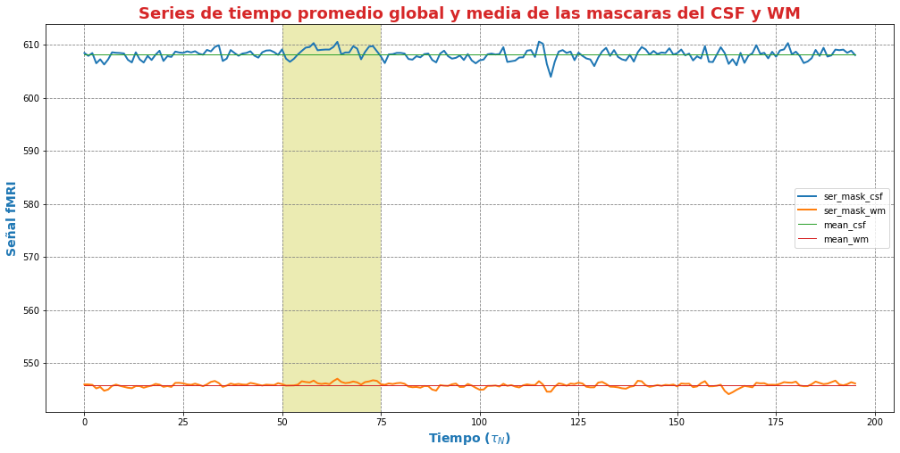
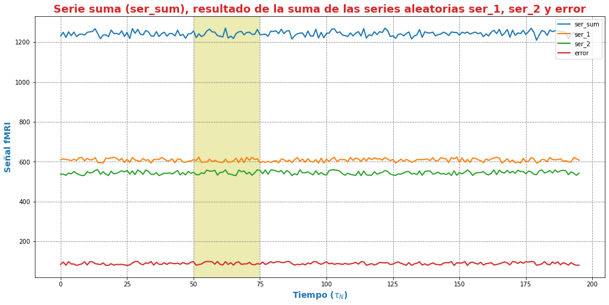
.. |image3| image:: imagenes/output_75_1.png
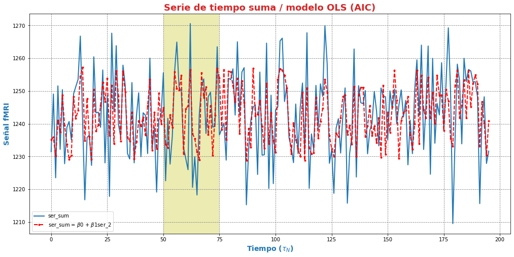
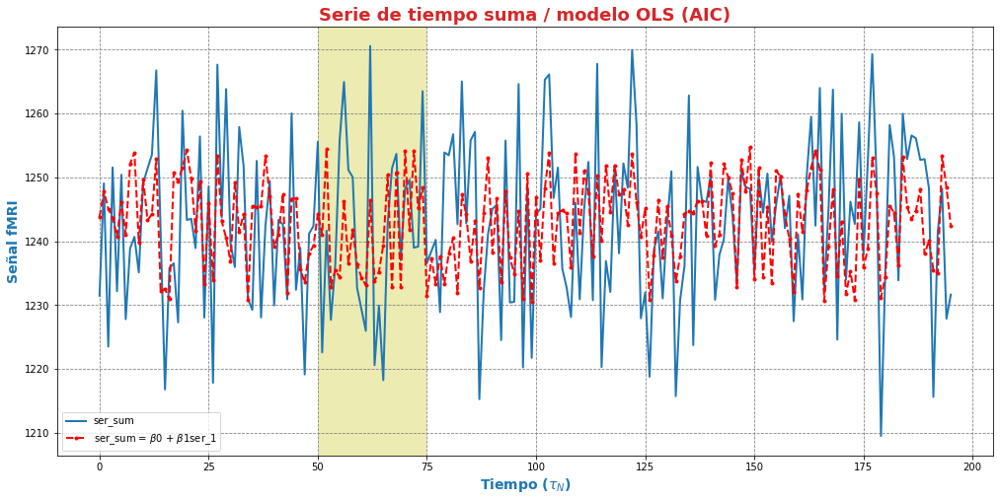
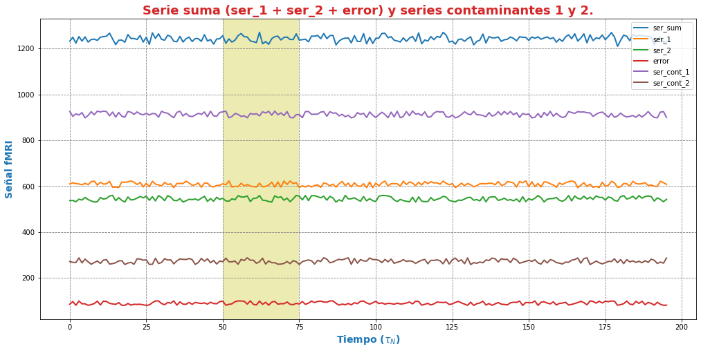
.. |image7| image:: imagenes/output_114_1.png
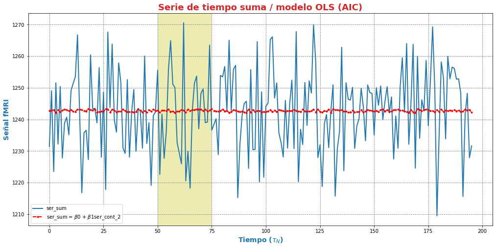
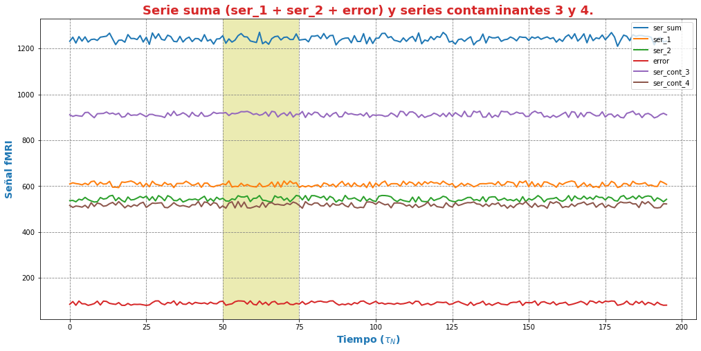
.. |image10| image:: imagenes/output_152_1.png

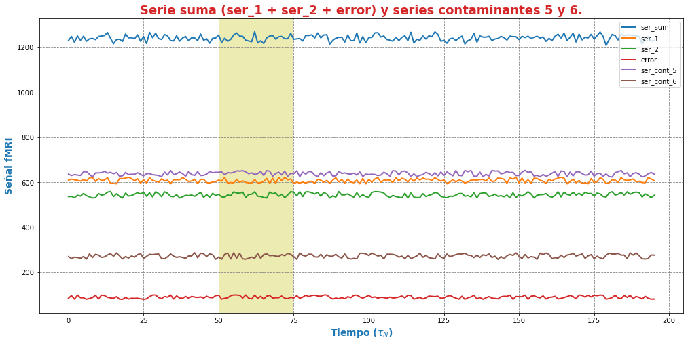
.. |image13| image:: imagenes/output_190_1.png
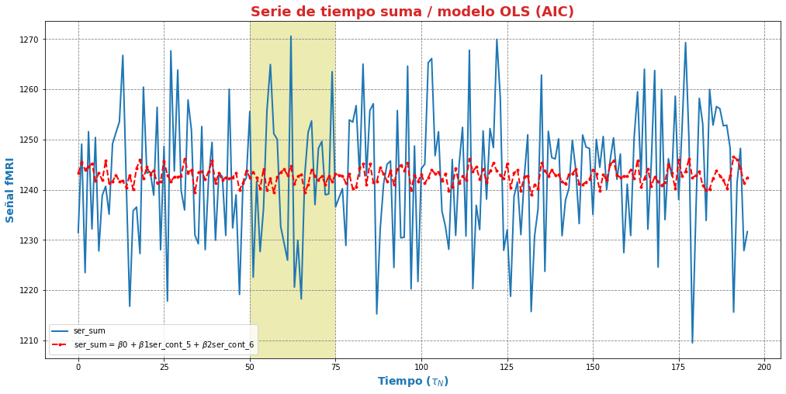

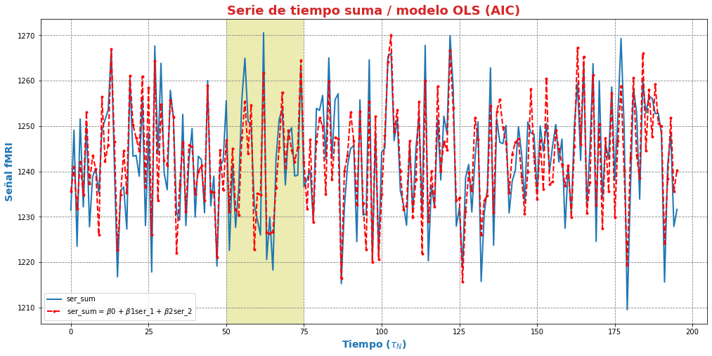

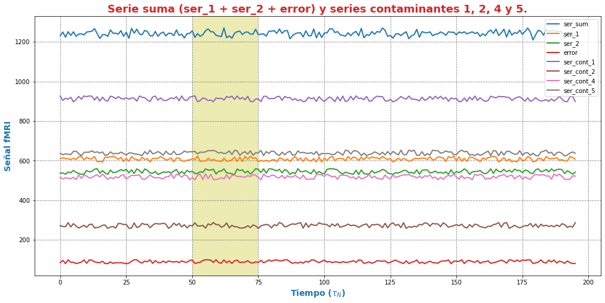
.. |image19| image:: imagenes/output_266_1.png
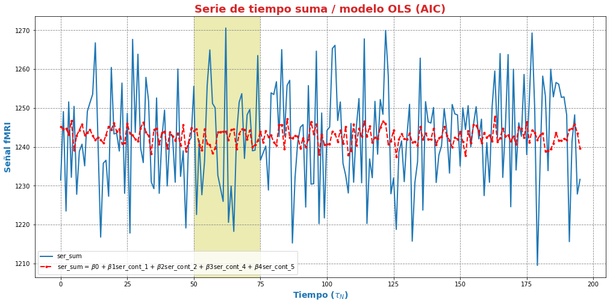
