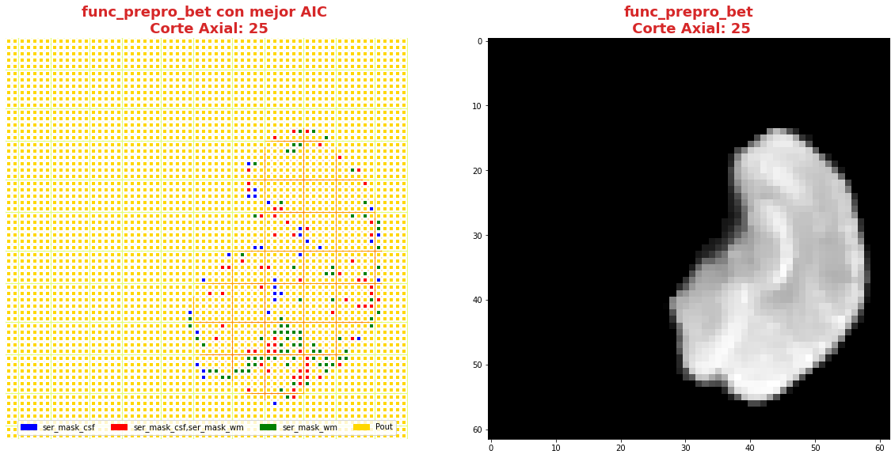
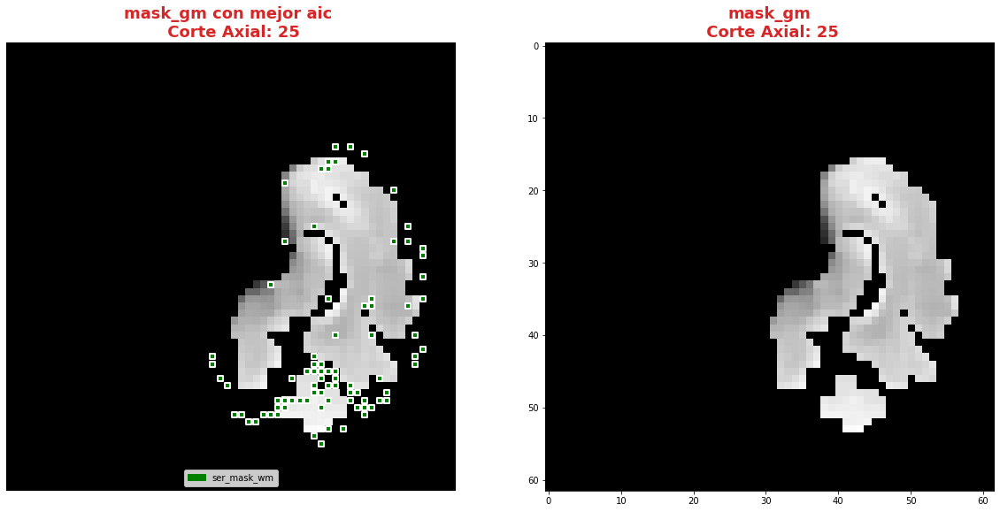
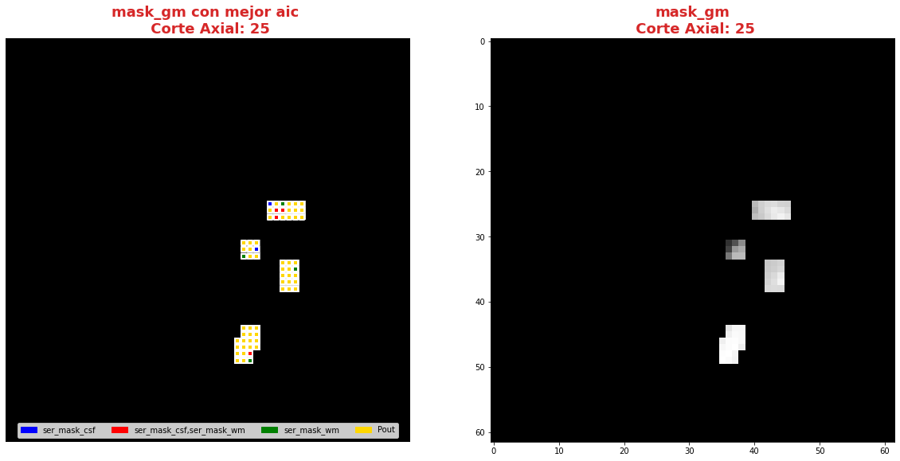
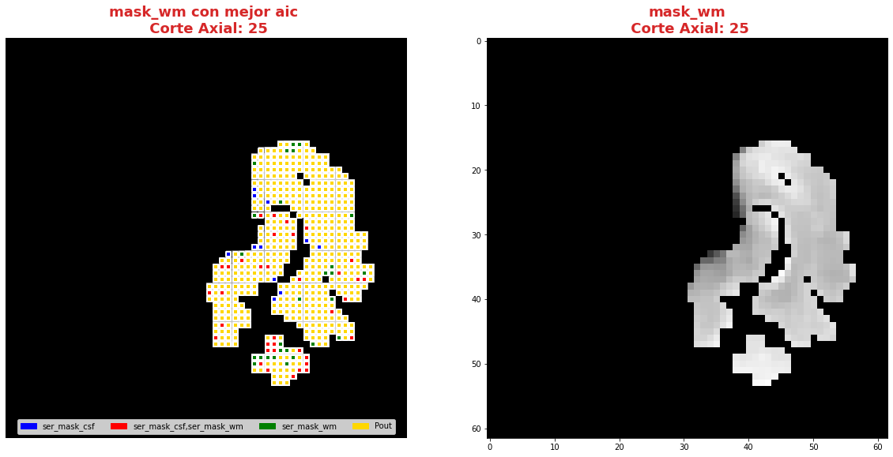
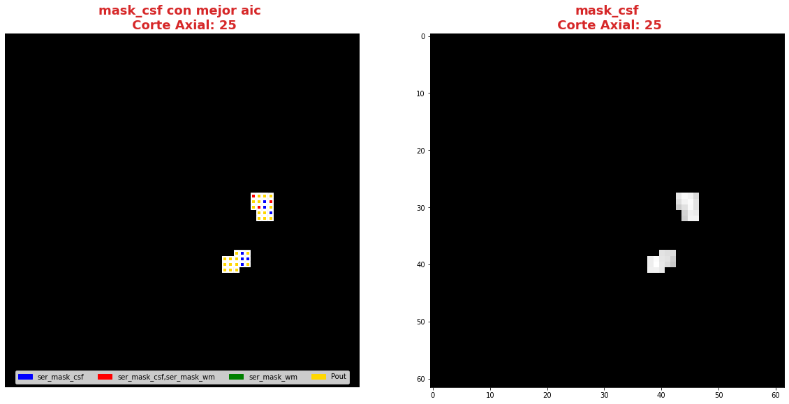
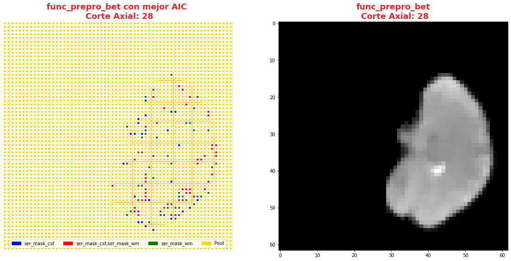
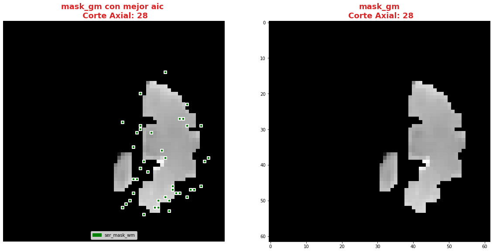
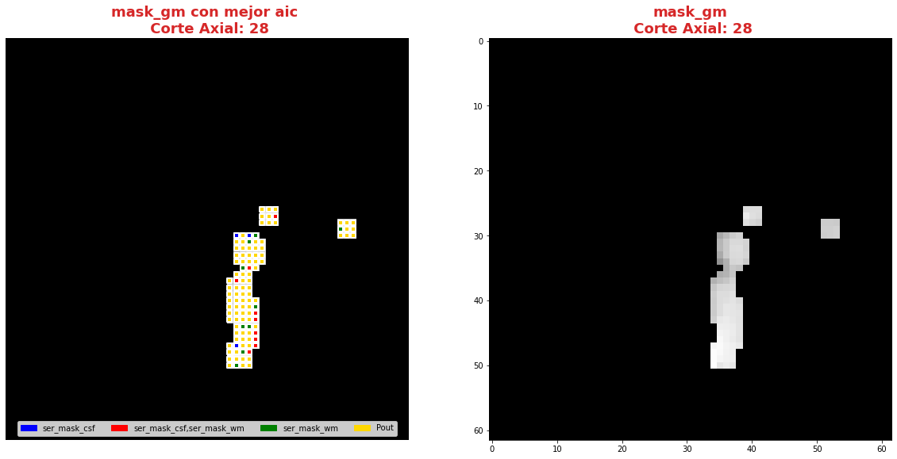
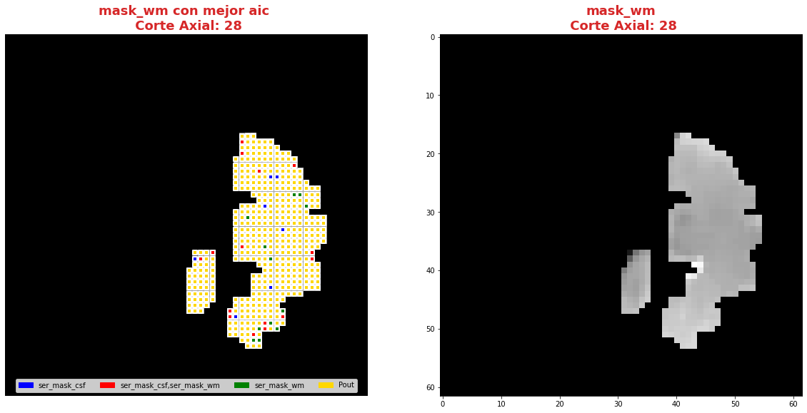
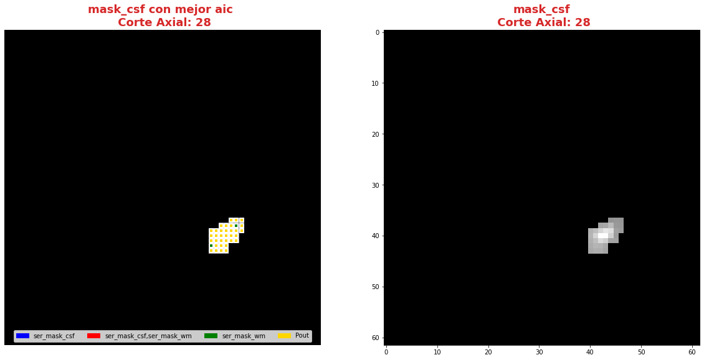

|image0|

--------------

--------------

**Andres Eduardo Aracena Rangel**

*Estudiante del programa del Magister en Física Médica*

--------------

--------------

Acronimos:

-  CSF: Cerebrospinal Fluid (*líquido cefalorraquídeo*)
-  GM: Gray Matter (*materia gris*)
-  WM: White Matter (*materia blanca*)

--------------

--------------

NOTA: Cuando indiquemos imagenes brain o mascaras brain, nos estamos
refieriendo a las imagenes o mascaras de csf, wm, gm

--------------

--------------

Regresión regresión lineal múltiple mediante el método de mínimo cuadrado ordinarios.
=====================================================================================

Para encontrar el modelo de regresión lineal múltiple que mejor se
ajusta a la variable dependiente, usaremos el método de mínimo cuadrado
ordinarios (OLS, de las siglas en ingles de Ordinary Least Squares).

Importamos librerias
--------------------

.. code:: python

   import time # medir el tiempo de ejecución de nuestros programas
   start = time.process_time()
   inicio = time.time()

.. code:: python

   import os # El módulo os nos permite acceder a funcionalidades dependientes del Sistema Operativo
   from os.path import join as opj   # Este método concatena varios componentes de ruta con exactamente un separador de directorio(‘/’)
   import matplotlib.pyplot as plt   # Permite la generación de gráficos
   import pandas as pd               #Biblioteca para manipulación de marcos de datos
   import numpy as np
   from numpy import random
   import nibabel as nib

   import matplotlib.patches as mpatches

   #Biblioteca para estimar modelos estadísticos y realizar pruebas estadísticas
   import statsmodels.api as sm

Definimos parámetros
--------------------

.. code:: python

   '''
   Ruta del directorio de la data
   '''
   path_data = '/home/aracena/thesis_ds002422/' 

   # ruta donde reposa la imagen funcional procesada con bet

   path_fmri = opj(path_data,'02_fase1_extraccion_brain_fmri_prepro','output')

   #ruta mascaras brain
   path_brain = opj(path_data,'01_fase1_extraccion_mask_brain','output','datasink','masks_brain')

   '''
   Ruta donde reposan las series promedios brain en archivo csv
   '''
   # Ruta donde reposan las series brain
   path_csv = opj(path_data,'03_fase2_extraccion_series_tiempo_brain', 'output', '0.95', 'archivos_csv')

   '''
   Ruta donde reposan las series promedios 'brain' y 'series aleatorias' en archivo csv
   '''
   path_series = opj(path_data,'04_fase2_promedio_series_tiempo_brain','output','0.95', 'archivos_csv')

   '''
   Ruta donde se guardaran los resultados
   '''
   path_output = opj(path_data,'08_fase5_analisis_estadistico_aic/', 'output')
   path_png = opj(path_output,'archivos_png')
                  
   # Crear la carpeta de salida
   os.system('mkdir -p %s'%path_output)
   os.system('mkdir -p %s'%path_png)

   '''
   Creamos la carpeta de salida para tablas
   '''
   path_out_DF = opj(path_output,'tablas_proyecto')
   os.system('mkdir -p %s'%path_out_DF)

   '''
   lista de tejidos a procesar
   '''
   tejido = ['csf', 'gm', 'wm']

           
   '''
   Ingrese el umbral que desea extraer (se extrajeron tres mask brain para tres umbrales distintos)
   '''
   umbral_sel = '0.95'

Funciones
---------

Función para graficar series de tiempo
~~~~~~~~~~~~~~~~~~~~~~~~~~~~~~~~~~~~~~

.. code:: python

   '''
   Función grafica las series de tiempo de una DF introducida. Se requiere input:

   - df_data = Dataframe que contiene las series de tiempo
   - name_save = nombre con que desea guardar el grafico
   '''

   def plot_series_time(df_data, resaltar, titulo, name_save): 
       # Creamos una lista con las claves del diccionario ingresado
       tejido = list(df_data.keys())
       # definimos una ventana
       vent_min = 50
       vent_max = 75

       font1 = {'fontsize':14, 'fontweight':'bold', 'color':'tab:blue'}
       font2  = {'fontsize':18, 'fontweight':'bold', 'color':'tab:red'}

       fig, ax = plt.subplots(figsize = (17,8))
       for i,tisue in enumerate(tejido):
           if resaltar[0] == 'all':
               ax.plot(df_data[tisue], linewidth=2, label=tisue)
           elif i < len(resaltar):
               ax.plot(df_data[resaltar[i]], linewidth=2, label=tisue)
           else:           
               ax.plot(df_data[tisue], linewidth=1, label=tisue)

       ax.legend()
       ax.set_xlabel('Tiempo ($\\tau_N$)',fontdict=font1)
       ax.set_ylabel('Señal fMRI',fontdict=font1)
       ax.set_title(titulo, fontdict = font2)
       ax.grid(axis = 'x', color = 'gray', linestyle = 'dashed')
       ax.grid(axis = 'y', color = 'gray', linestyle = 'dashed')
       ax.axvspan(vent_min,vent_max, alpha=0.3, facecolor='y')

       plt.savefig(opj(path_png, name_save))

Función crear lista de las series de un DF (lista de los valores de la columna del DF) y eliminar series
~~~~~~~~~~~~~~~~~~~~~~~~~~~~~~~~~~~~~~~~~~~~~~~~~~~~~~~~~~~~~~~~~~~~~~~~~~~~~~~~~~~~~~~~~~~~~~~~~~~~~~~~

.. code:: python

   '''
   Función  que extrae una lista de los valores de las columnas de un dataframe.

   Inputs:

   - df: Dataframe que se desea extrae una lista de los valores de las columnas,
   - elmiminar: lista de los valores de las columnas del DF que desea eliminar. Se debe ingresar una lista:
           * NO eliminar ningun valor de las columnas DF --> ['none']
           * Elimimnar uno o mas valores de la lista --> ['nombre_1' , 'nombre_2']
           
           LOS VALORES DEBE ESTAR EN FORMATO STRING (entre comillas simples o dobles)

   Output:

   - list_series: lista de series del DF
   '''

   def lista_dataframe(df, eliminar):
       # Creamos una lista de las columnas del dataframe
       series = df.columns.values
       list_series = list(series)
       
       tam = len(eliminar)

       if tam == 1:
           if eliminar[0] == 'none':
               list_series
           else:
               list_series.remove(eliminar[0]) 
       if tam != 1:   
           for i in range(tam):
               list_series.remove(eliminar[i])        
       
       return list_series    

Función de conjunto potencia ó de número de combinaciones
~~~~~~~~~~~~~~~~~~~~~~~~~~~~~~~~~~~~~~~~~~~~~~~~~~~~~~~~~

En matemáticas, dado un conjunto :math:`S`, se llama conjunto potencia o
conjunto de partes de :math:`S` (se denota por :math:`P(S)` o
:math:`2^S`) al conjunto formado por todos los subconjuntos posibles de
:math:`S`.

Por ejemplo, si :math:`S= {a, b, c}` entonces el conjunto potencia de
:math:`S` es

*P(S) = {{ }, {a}, {b}, {c}, {a, b}, {a, c}, {b, c}, {a, b, c} }*

.. code:: python

   '''
   Función para extraer todos los subconjuntos posibles de un conjunto de una lista de entrada.

   Inputs:

   - lista_conjunto: Lista donde se desea extraer el conjunto potencia
   - columnas: Numero de columnas para ordenar las combinaciones/modelos

   Output:

   - r: Lista de las combinaciones/modelos.
   '''

   def potencia(list_conjunto):
       '''
       Calcula y devuelve el conjunto potencia del conjunto c.
       En matemáticas, el conjunto potencia de un conjunto dado es otro conjunto 
       formado por todos los subconjuntos del conjunto dado.
       '''
      
       # Número de combinaciones
       if len(list_conjunto) == 0:
           return [[]]
       r = potencia(list_conjunto[:-1])
       
       return r + [s + [list_conjunto[-1]] for s in r]

Funcion para crear un dataframe de las combinaciones/modelos
~~~~~~~~~~~~~~~~~~~~~~~~~~~~~~~~~~~~~~~~~~~~~~~~~~~~~~~~~~~~

.. code:: python

   '''
   Función para visualizar las combinaciones/modelos en un dataframe, para ser incorporada en documentos.

   Inputs:

   - lista_combi: Lista de combinaciones/modelos 
   - columnas: Numero de columnas para ordenar las combinaciones/modelos

   Output:

   - df_combi: Dataframe con las combinaciones/modelos
   '''

   def crear_df_combi(lista_combi, columnas):
       combi = lista_combi
       '''
       ordenamos la lista
       '''
       combi.sort()
       
       '''
       Se reescribe el elemento lista de la lista en un solo valor, 
       que es la combinacion/modelo
       '''

       list_combi =[]
       beta = str('$\\beta$')
       for i, co in enumerate(combi):
           modelo= beta+str(0)
           for j, mo in enumerate(combi[i]):
               modelo = modelo + ' + ' + beta + str(j+1) + ' ' + mo
           list_combi.append(modelo)   
       
       '''
       PROCESO DE CONVERTIR DE LISTA 1D A UN DATAFRAME FIL X COLUM
       '''
       # Indique cuantas columnas quiere representar las combinaciones en un DF
       colum = columnas

       # Como se quiere crear una matriz de 'colum' columnas, 
       # verifico si 'long' es divisible entre 'colum'; de no ser serlo, 
       # agrego un elemneto vacio a la lista hasta conseguirlo
       long = len(list_combi)
       n=0
       while n==0:
           if long % colum == 0: 
               n=1
           else:
               list_combi.append('')
               long = len(list_combi)
               
       # Conviertimos la lista en un array
       co = np.array(list_combi)

       # Conviertimos un array de 1D a laa dimension fil x colum
       fil = int(long/colum) # numero de filas

       co = co.reshape(fil,colum)

       # Convertirmos la matriz fil x colum en un DF
       df_combi = pd.DataFrame(co)

       '''
       Cambiamos nombre de columnas
       '''
       #Creamos lista de nuevos nombres
       new_colum = []
       for i in range(colum):
           new_colum.append('Combinaciones / Modelos')

       df_combi.columns = new_colum

       '''
       Renombramos indice
       '''
       #Creamos diccionario de nuevos indices
       new_index = {}
       for i in range(fil):
           new_index[i]= ' '

       #renombramos indices
       df_combi.rename(index=new_index, inplace=True)
       
       return df_combi    

.. code:: python

   '''
   Función para visualizar las combinaciones/modelos en un dataframe, para ser incorporada en documentos.

   Inputs:

   - lista_combi: Lista de combinaciones/modelos 
   - columnas: Numero de columnas para ordenar las combinaciones/modelos

   Output:

   - df_combi: Dataframe con las combinaciones/modelos
   '''

   def crear_df_combi_1(lista_combi, columnas):
       '''
       ordenamos la lista
       '''
       combi.sort()
       
       '''
       Se reescribe el elemento lista de la lista en un solo valor, 
       que es la combinacion/modelo
       '''
       le = len(combi)
       list_combi =[]
       for i, co in enumerate(combi):
           ser = co
           w = len(ser)
           for i, se in enumerate(ser):
               if i == 0:
                   agr = se
               else:
                   agr = agr + ' + ' + se
           list_combi.append(agr)
           
       '''
       PROCESO DE CONVERTIR DE LISTA 1D A UN DATAFRAME FIL X COLUM
       '''
       # Indique cuantas columnas quiere representar las combinaciones en un DF
       colum = columnas

       # Como se quiere crear una matriz de 'colum' columnas, 
       # verifico si 'long' es divisible entre 'colum'; de no ser serlo, 
       # agrego un elemneto vacio a la lista hasta conseguirlo
       long = len(list_combi)
       n=0
       while n==0:
           if long % colum == 0: 
               n=1
           else:
               list_combi.append('')
               long = len(list_combi)
               
       # Conviertimos la lista en un array
       co = np.array(list_combi)

       # Conviertimos un array de 1D a laa dimension fil x colum
       fil = int(long/colum) # numero de filas

       co = co.reshape(fil,colum)

       # Convertirmos la matriz fil x colum en un DF
       df_combi = pd.DataFrame(co)

       '''
       Cambiamos nombre de columnas
       '''
       #Creamos lista de nuevos nombres
       new_colum = []
       for i in range(colum):
           new_colum.append('Combinaciones / Modelos')

       df_combi.columns = new_colum

       '''
       Renombramos indice
       '''
       #Creamos diccionario de nuevos indices
       new_index = {}
       for i in range(fil):
           new_index[i]= ' '

       #renombramos indices
       df_combi.rename(index=new_index, inplace=True)
       
       return df_combi    

Función aplicacion modelo OLS
~~~~~~~~~~~~~~~~~~~~~~~~~~~~~

.. code:: python

   '''
   df_analisis: Dataframe que contien la serie dependiente (variable dependiente o variable de respuesta)
                   y las series predictoras (ariables independientes o variables predictoras)
   var_depen: Variable dependiente del dataframe (serie a predecir)
   modelo: modelo a predecir la variable dependiente

   Output: 

   aic, r2, r2_adj, model: estadistios
   '''

   def estadisticos(df_analisis, var_depen, modelo):
       # Y: normalmente significa la variable respuesta (variable dependiente o variable de respuesta)
       #define response variable
       Y = df_analisis[var_depen]

       # X: usualmente significa nuestras variables de entrada (variables independientes o variables predictoras)
       X = df_analisis[modelo]

       #agregar constante a las variables predictoras [intercepción (beta_0) al modelo]
       X = sm.add_constant(X)

       #ajustamos modelo de regresión
       model = sm.OLS(Y, X).fit()    # sm.OLS(respuesta, entrada)

       #guardamos estadisticos AIC, R2, R2-AJUSTADO
       aic = model.aic
       r2 = model.rsquared
       r2_adj = model.rsquared_adj
       
       return aic, r2, r2_adj, model

Función para determinar el mejor modelo mediante modelo de regresión OSL
~~~~~~~~~~~~~~~~~~~~~~~~~~~~~~~~~~~~~~~~~~~~~~~~~~~~~~~~~~~~~~~~~~~~~~~~

.. code:: python

   def best_osl(df_depen, df_indep, var_depen, lista_combi):
       
       '''
       CReamos una lista de las series del corte de la var dep
       '''
       num_ser  = df_var_depen.columns.to_list()

       a = pd.DataFrame()
       b = pd.DataFrame()
       aa = pd.DataFrame()
       bb = pd.DataFrame()
       aaa = pd.DataFrame()
       bbb = pd.DataFrame()
       for i, nuser in enumerate(num_ser):
           #creamos una lista que identifica la serie del voxel, con la camtidad de combinaciones
           serie = []
           for j in enumerate(lista_combi):
               serie.append(nuser)
           #se crea dataframe que identifica voxel en estudio
           df_serie = pd.DataFrame(serie, columns=['serie'])

           #extraemos la serie de tiempo del voxel i
           serie_estudio = df_depen.iloc[:,[i]]
           serie_estudio.columns=[var_depen]

           analisis = pd.merge(serie_estudio, df_indep,
                                  right_index=True,left_index=True)

           #Ejecutamos la funcion aic
           RESULTADO_AIC = {}
           RESULTADO_R2 = {}
           RESULTADO_R2_AJU = {}
           modelo = {}
           for i, c in enumerate(lista_combi):
               li = lista_combi[i]
               anali = estadisticos(df_analisis=analisis,
                                    var_depen= var_depen,
                                    modelo=li)
               AIC = round(anali[0],2)
               R2 = round(anali[1],4)
               R2_AJU = round(anali[2],4)        
               c = ','.join(c)
               RESULTADO_AIC[c] = AIC
               RESULTADO_R2[c] = R2
               RESULTADO_R2_AJU[c] = R2_AJU
               modelo[c] = anali[3]

           '''
           DataFrame AIC
           '''
           #representamos el resultado aic en un dataframe
           DF_AIC = pd.DataFrame(list(RESULTADO_AIC.items()),
                          columns=['MODELO', 'AIC'])

           #representamos el resultado del modelo(resultado de la regresión
           # lineal) en un dataframe
           DF_MODELO = pd.DataFrame(list(modelo.items()),
                          columns=['MODELO', 'resultado_regresión'])

           # Unimos DF de resultado aic con DF modelo
           DF_AIC = pd.merge(DF_AIC,DF_MODELO, on='MODELO')

           #ordenamos de mayor a menor
           DFM_AIC = DF_AIC.sort_values('AIC')

           #restablecer el índice (para poder eliminar luego los dos ultimos)
           DFM_AIC.reset_index(drop=True, inplace=True)

           #unimos DFM con la identificacion del voxel
           best_model_aic = pd.merge(df_serie, DFM_AIC,
                              right_index=True,left_index=True)

           #elegimos el mejor modelo del voxel en estudio
           be = 1
           en =  len(lista_combi)
           best_aic = best_model_aic.drop(range(1, en, 1),axis=0)

           if i == 0:
               # creamos a y b para concatenar los demas resultados
               a = best_model_aic
               b = best_aic
           else:
               best_model_aic = pd.concat([a, best_model_aic])
               best_aic = pd.concat([b, best_aic])
               a = best_model_aic
               b = best_aic

           #restablecer el índice
           best_model_aic.reset_index(drop=True, inplace=True)
           best_aic.reset_index(drop=True, inplace=True)

           '''
           DataFrame R2
           '''

           #representamos el resultado aic en un dataframe
           DF_R2 = pd.DataFrame(list(RESULTADO_R2.items()),
                          columns=['MODELO', 'R2'])
           #representamos el resultado del modelo(resultado de la regresión
           # lineal) en un dataframe
           DF_MODELO_R2 = pd.DataFrame(list(modelo.items()),
                          columns=['MODELO', 'resultado_regresión'])

           # Unimos DF de resultado aic con DF modelo
           DF_R2 = pd.merge(DF_R2,DF_MODELO_R2, on='MODELO')

           #ordenamos de mayor a menor
           DFM_R2 = DF_R2.sort_values('R2',ascending=False)

           #restablecer el índice (para poder eliminar luego los dos ultimos)
           DFM_R2.reset_index(drop=True, inplace=True)

           #unimos DFM con la identificacion del voxel
           best_model_r2 = pd.merge(df_serie, DFM_R2,
                              right_index=True,left_index=True)

           #elegimos el mejor modelo del voxel en estudio
           be = 1
           en =  len(lista_combi)
           best_r2 = best_model_r2.drop(range(1, en, 1),axis=0)

           if i == 0:
               # creamos a y b para concatenar los demas resultados
               aa = best_model_r2
               bb = best_r2
           else:
               best_model_r2 = pd.concat([aa, best_model_r2])
               best_r2 = pd.concat([bb, best_r2])
               aa = best_model_r2
               bb = best_r2

           #restablecer el índice
           best_model_r2.reset_index(drop=True, inplace=True)
           best_r2.reset_index(drop=True, inplace=True)

           '''
           DataFrame R2-ajustado
           '''
           #representamos el resultado aic en un dataframe
           DF_R2_AJU = pd.DataFrame(list(RESULTADO_R2_AJU.items()),
                          columns=['MODELO', 'R2-ajus'])

           #representamos el resultado del modelo(resultado de la regresión
           # lineal) en un dataframe
           DF_MODELO_R2_AJU = pd.DataFrame(list(modelo.items()),
                          columns=['MODELO', 'resultado_regresión'])

           # Unimos DF de resultado aic con DF modelo
           DF_R2_AJU= pd.merge(DF_R2_AJU,DF_MODELO_R2_AJU, on='MODELO')

           #ordenamos de mayor a menor
           DFM_R2_AJU = DF_R2_AJU.sort_values('R2-ajus',ascending=False)

           #restablecer el índice (para poder eliminar luego los dos ultimos)
           DFM_R2_AJU.reset_index(drop=True, inplace=True)

           #unimos DFM con la identificacion del voxel
           best_model_aju = pd.merge(df_serie, DFM_R2_AJU,
                              right_index=True,left_index=True)

           #elegimos el mejor modelo del voxel en estudio
           be = 1
           en =  len(lista_combi)
           best_r2_aju = best_model_aju.drop(range(1, en, 1),axis=0)

           if i == 0:
               # creamos a y b para concatenar los demas resultados
               aaa = best_model_aju
               bbb = best_r2_aju
           else:
               best_model_aju = pd.concat([aaa, best_model_aju])
               best_r2_aju = pd.concat([bbb, best_r2_aju])
               aaa = best_model_aju
               bbb = best_r2_aju

           #restablecer el índice
           best_model_aju.reset_index(drop=True, inplace=True)
           best_r2_aju.reset_index(drop=True, inplace=True)

       return  best_aic, best_model_aic, best_r2, best_model_r2, best_r2_aju, best_model_aju, 
       #print(DFM_R2)
       #print('\n',best_model)
       #print('\n', best_aic)

Función para extraer los valores p de los regresores
~~~~~~~~~~~~~~~~~~~~~~~~~~~~~~~~~~~~~~~~~~~~~~~~~~~~

.. code:: python

   '''
   Función para extraer los valores p de las variables regresoras y su analisis con respecto al nivel 
   significancia. Se requiere como inputs:

   - df_ana = DF que se desea analisar y que debe contener los resultados de la regresión lineal
   - nivel_signif = Nivel de significancia, si es de 5%, ingresamos 0.05, 
                                            si es del 10%, ingresamos 0.1, etc

   Como output obtendremos un DF con el analisis sobre el valor p en los regresores
   '''

   def analisi_p(df_anali, nivel_signif):
       import pandas as pd
       '''
       Extraemos el primer indice de la DF a analizar. Esto se realiza, ya que en el analisis podremos escojer 
       los mejores aic de un conjunto de series que no empiece en el voxel/serie cero, por ejemplo, 
       puedo escojer los voxels del valor 4865 al 9728 que corresponden al segundo corte, y si utilizamos 
       el ciclo for desde 0, nos cambiara la identificación del voxel para para ser ingresado a la DF; 
       por ejemplo, el primer voxel al pasar por el ciclo es el 4865, y el ciclo lo guaradara 
       como 0
       '''

       inicio = df_anali.index.start

       '''
       Extraemos los valores p
       '''
       tam = len(df_anali)

       df_coef = pd.DataFrame()
       df_suma = pd.DataFrame()
       for i in range(tam):
           #extraemos resultados de la regresión lineal (RL) de las series de la imagen
           best_model = df_anali['resultado_regresión'][i+inicio]     
           indice = inicio + i
           #creamos DF de los valores p de la RL de la serie
           df_co = pd.DataFrame(round(best_model.pvalues,2)).T
           df_co.index = [indice]    

           #concatenamos
           df_coef = pd.concat([df_coef,df_co])

           #extraemos nombre de las columnas (regresores) en una lista; se extraee de la lista antes de concaenar
           regresores = df_co.columns.values  
           list_regresor = list(regresores)

           suma_evaluacion = 0
           valores_p = [] # creamos una lista para guardar los valores p y luego anexarla al DF best_aic

           for i, re in enumerate(list_regresor):
               coef = df_coef[re][indice]
               if coef < nivel_signif:
                   suma_evaluacion = suma_evaluacion
               else:
                   suma_evaluacion = suma_evaluacion + 1

               valores_p.append(coef)

           '''
           Agregamos el resultado de la lista de valores p de los regresores y 
           la suma_evaluación al DF en evaluación
           '''
           df_su = pd.DataFrame()
           df_su['valores_p_regresores'] = [valores_p]
           df_su['suma_evaluación'] = [suma_evaluacion]
           df_su.index = [indice]

           # concatenamos
           df_suma = pd.concat([df_suma,df_su])

       '''
       Unimos en un DF el resultado final
       '''
       analisis_p = pd.merge(df_coef, df_suma,
                          right_index=True,left_index=True)
       '''
       Unimos con la DF analisi_p con la DF de entrada
       '''
       best_p_1 = pd.merge(df_anali, analisis_p,
                              right_index=True,left_index=True)

       # eliminamos la columna resultado_regresión, 
       best_p = best_p_1.drop(['resultado_regresión'], axis=1)
       
       '''
       Crearemos un DF donde anexaremos una nueva columna, donde al evaluar suma_evaluacion si es 0, 
       agregamos el modelo AIC, si es mayor a cero, agregamos la palabra 'Pout', indicandonos que el
       modelo iene un valor p matyor a 0.05
       '''
       modelo_p = pd.DataFrame()

       for i in range(tam):
           valeva = best_p['suma_evaluación'][i+inicio]

           model_p = pd.DataFrame()
           if valeva == 0:
               model_p['MODELO_P'] = [best_p['MODELO'][i+inicio]]
           else:
               model_p['MODELO_P'] = ['Pout']

           model_p.index = [i+inicio]
           modelo_p = pd.concat([modelo_p,model_p])
       '''
       UNIMOS DF
       '''
       df_anali_p = pd.merge(best_p, modelo_p,
                        right_index=True,left_index=True)
       
       return df_anali_p

.. code:: python

   '''
   Función para extraer los valores p de las variables regresoras y su analisis con respecto al nivel 
   significancia. Se requiere como inputs:

   - df_ana = DF que se desea analisar y que debe contener los resultados de la regresión lineal
   - nivel_signif = Nivel de significancia, si es de 5%, ingresamos 0.05, 
                                            si es del 10%, ingresamos 0.1, etc

   Como output obtendremos un DF con el analisis sobre el valor p en los regresores
   '''

   def analisi_p_1(df_anali, nivel_signif):
       import pandas as pd
       '''
       Extraemos el primer indice de la DF a analizar. Esto se realiza, ya que en el analisis podremos escojer 
       los mejores aic de un conjunto de series que no empiece en el voxel/serie cero, por ejemplo, 
       puedo escojer los voxels del valor 4865 al 9728 que corresponden al segundo corte, y si utilizamos 
       el ciclo for desde 0, nos cambiara la identificación del voxel para para ser ingresado a la DF; 
       por ejemplo, el primer voxel al pasar por el ciclo es el 4865, y el ciclo lo guaradara 
       como 0
       '''

       inicio = df_anali.index.start

       '''
       Extraemos los valores p
       '''
       tam = len(df_anali)

       df_coef = pd.DataFrame()
       df_suma = pd.DataFrame()
       for i in range(tam):
           #extraemos resultados de la regresión lineal (RL) de las series de la imagen
           best_model = df_anali['resultado_regresión'][i+inicio]     
           indice = inicio + i
           #creamos DF de los valores p de la RL de la serie
           df_co = pd.DataFrame(round(best_model.pvalues,2)).T
           df_co.index = [indice]   

           #concatenamos
           df_coef = pd.concat([df_coef,df_co])

           #extraemos nombre de las columnas (regresores) en una lista; se extrae de la lista antes de concaenar
           regresores = df_co.columns.values  
           list_regresor = list(regresores)

           suma_evaluacion = 0
           valores_p = [] # creamos una lista para guardar los valores p y luego anexarla al DF best_aic
           
           # El la evaluación, no tomamos en cuenta el valor p de la constante
           for i in range(len(list_regresor)-1):            
               coef = df_coef[list_regresor[i+1]][indice]
               if coef < nivel_signif:
                   suma_evaluacion = suma_evaluacion
               else:
                   suma_evaluacion = suma_evaluacion + 1

               valores_p.append(coef)

           '''
           Agregamos el resultado de la lista de valores p de los regresores y 
           la suma_evaluación al DF en evaluación
           '''
           df_su = pd.DataFrame()
           df_su['valores_p_regresores_ser'] = [valores_p]
           df_su['suma_evaluación'] = [suma_evaluacion]
           df_su.index = [indice]

           # concatenamos
           df_suma = pd.concat([df_suma,df_su])

       '''
       Unimos en un DF el resultado final
       '''
       analisis_p = pd.merge(df_coef, df_suma,
                          right_index=True,left_index=True)
       '''
       Unimos con la DF analisi_p con la DF de entrada
       '''
       best_p_1 = pd.merge(df_anali, analisis_p,
                              right_index=True,left_index=True)

       # eliminamos la columna resultado_regresión, 
       best_p = best_p_1.drop(['resultado_regresión'], axis=1)
       
       '''
       Crearemos un DF donde anexaremos una nueva columna, donde al evaluar suma_evaluacion si es 0, 
       agregamos el modelo AIC, si es mayor a cero, agregamos la palabra 'Pout', indicandonos que el
       modelo iene un valor p matyor a 0.05
       '''
       modelo_p = pd.DataFrame()

       for i in range(tam):
           valeva = best_p['suma_evaluación'][i+inicio]

           model_p = pd.DataFrame()
           if valeva == 0:
               model_p['MODELO_P'] = [best_p['MODELO'][i+inicio]]
           else:
               model_p['MODELO_P'] = ['Pout']

           model_p.index = [i+inicio]
           modelo_p = pd.concat([modelo_p,model_p])
       '''
       UNIMOS DF
       '''
       df_anali_p = pd.merge(best_p, modelo_p,
                        right_index=True,left_index=True)
       
       return df_anali_p

Función para graficar la variable dependiente en un modelo de OSL y el resultado del mejor modelo
~~~~~~~~~~~~~~~~~~~~~~~~~~~~~~~~~~~~~~~~~~~~~~~~~~~~~~~~~~~~~~~~~~~~~~~~~~~~~~~~~~~~~~~~~~~~~~~~~

.. code:: python

   '''
   Función para graficar la variable dependiente en un modelo de OSL y el resultado del mejor modelo 
   mediante modelo de regresión OSL.

   Inputs:

   - df_depen = Dataframe de la variable dependiente del modelo de OSL 
   - models_osl = Dataframe de los modelos de regresion al aplicar la funcion 'best_osl'. Ingresar solo
                   el resultado segun alguno de los estadistico de AIC, R2 o R2_adjustado.
   - best = seleccionar el modelo que quiere graficar. Si desea graficar el mejor modelo, se ingresa 0; 
           si desea graficar el segundo mejor modelo, se ingresa 1, y asi sucesivamente.
   - titulo = titulo de la grafica
   - name_save = nombre con el que se desea guardar la grafica
   '''

   def plot_series_osl(df_depen, models_osl, best, titulo, name_save): 
       '''
       Elegimos el modelo segun variable input best
       '''
       best_model= models_osl['resultado_regresión'][best]
       print(best_model.summary())
       
       '''
       Crear la etiqueta del mejor modelo
       '''

       for i, mo in enumerate(models_osl['MODELO'][best]):
           mo=models_osl['MODELO'][best].split(',') #Split regresa una lista de las palabras en la cadena, 
                                    # usando separador como el delimitador.

       '''
       Creamos nombre con los coeficientes y series del mejor modelo
       '''
       beta = str('$\\beta$')
       modelo_win = df_depen.columns.values[0]+' = '+beta+str(0)
       for i, m in enumerate(mo):
           modelo_win = modelo_win + ' + ' + beta + str(i+1) + m 
       
       '''
       Creamos etiqueta de la variable dependiente
       '''
       label_depen = df_depen.columns.values
       label_depen = label_depen[0]
       
       '''
       Dataframe del modelo de regresion OSL
       '''
       df_osl = pd.DataFrame(best_model.fittedvalues)
       df_osl.columns = ['modelo OLS']    
       
       # definimos una ventana
       vent_min = 50
       vent_max = 75

       font1 = {'fontsize':14, 'fontweight':'bold', 'color':'tab:blue'}
       font2  = {'fontsize':18, 'fontweight':'bold', 'color':'tab:red'}

       fig, ax = plt.subplots(figsize = (17,8))
       ax.plot(df_depen, linewidth=2, label=label_depen)
       ax.plot(df_osl, '--.', linewidth=2, color = 'red', label=modelo_win)

       ax.legend()
       ax.set_xlabel('Tiempo ($\\tau_N$)',fontdict=font1)
       ax.set_ylabel('Señal fMRI',fontdict=font1)
       ax.set_title(titulo, fontdict = font2)
       ax.grid(axis = 'x', color = 'gray', linestyle = 'dashed')
       ax.grid(axis = 'y', color = 'gray', linestyle = 'dashed')
       ax.axvspan(vent_min,vent_max, alpha=0.3, facecolor='y')

       plt.savefig(opj(path_png, name_save))

Función para comparar los modelos segun los estadisticos AIC, R2 Y R2 ajustado
~~~~~~~~~~~~~~~~~~~~~~~~~~~~~~~~~~~~~~~~~~~~~~~~~~~~~~~~~~~~~~~~~~~~~~~~~~~~~~

.. code:: python

   '''
   Función que genera un dataframe de comparacion de los modelos segun los estadisticos AIC, R2 Y R2 ajustado.

   Inputs:

   aic = DF modelos segun el estadistico AIC (DF resultante de la funcion 'best_osl')
   r2 = DF modelos segun el estadistico R2 (DF resultante de la funcion 'best_osl')
   r2_ajus = DF modelos segun el estadistico R2_ajus (DF resultante de la funcion 'best_osl')
   '''

   def compara_models_estad(aic,r2,r2_ajus):
       df_aic_best = aic_all.copy()
       df_aic_best = df_aic_best.drop(['serie', 'resultado_regresión'], axis=1)
       
       df_r2_best = r2_all.copy()
       df_r2_best = df_r2_best.drop(['serie', 'resultado_regresión'], axis=1)
       
       df_r2_aju_best = r2_ajus_all.copy()
       df_r2_aju_best = df_r2_aju_best.drop(['serie', 'resultado_regresión'], axis=1)
       
       df4 = pd.merge(df_aic_best,df_r2_best,on='MODELO',how='left')
       df5 = pd.merge(df4,df_r2_aju_best,on='MODELO',how='left')

       df5.style.highlight_max(axis=0)
       
       return     df5.style.\
                       highlight_max(subset=['AIC'], color='salmon').\
                       highlight_min(subset=['AIC'], color='yellow').\
                       highlight_max(subset=['R2','R2-ajus'], color='yellow').\
                       highlight_min(subset=['R2','R2-ajus'], color='salmon').\
                       format({'id':'{:.0f}'})
       

Función agregar la posición x,y,z a los voxel/series de un DF y una caracteristica
~~~~~~~~~~~~~~~~~~~~~~~~~~~~~~~~~~~~~~~~~~~~~~~~~~~~~~~~~~~~~~~~~~~~~~~~~~~~~~~~~~

.. code:: python

   '''
   Función agregar la posición x,y,z a los voxel/series de un DF. Se requiere como inputs:

   - voxel_posicion = DF de la posición de los voxeles en x,y,z
   - df_anali = DF que se desea anexarle la posición delos voxels
   - carac = caracteristica/variable que desea anexar al nuevo DF junto con a posición de los voxels

   Como output obtendremos un DF con la posición de los voxels y la caracteristica seleccionada
   '''

   def dataframe_posicion(voxel_posicion, df_anali, carac):  
       '''
       Extraemos el mejor modelo con evaluacion del valor p
       '''
       sel_model_p = df_anali[[carac]]

       '''
       Unimos DF
       '''

       df_anali_voxels = pd.merge(voxel_posicion, sel_model_p,
                               right_index=True,left_index=True)
       return df_anali_voxels

Función para visualizar resultado de la regresión lineal en un corte
~~~~~~~~~~~~~~~~~~~~~~~~~~~~~~~~~~~~~~~~~~~~~~~~~~~~~~~~~~~~~~~~~~~~

.. code:: python

   def visual_analis_corte_sagital(df_sel, datos_img_fis, vol, corte_selec,df_color):    
       '''
       Visualizamos
       '''
       vol_img_data = datos_img_fis[:, :, :, vol]
       corte_coro = vol_img_data[:, :, corte_selec]

       font1 = {'fontsize':14, 'fontweight':'bold', 'color':'tab:blue'}
       font2  = {'fontsize':18, 'fontweight':'bold', 'color':'tab:red'}
       titulo =['func_prepro_bet con mejor AIC \n Corte Axial: ' + str(corte_selec), 
                'func_prepro_bet\n Corte Axial: ' + str(corte_selec)]

       fig, axes = plt.subplots(1, 2, figsize=(20, 20))

       axes[0].imshow(corte_coro, cmap = 'Wistia')
       axes[1].imshow(corte_coro , cmap = 'gray')
       
       #Extraemos una lista del indice
       lista_indice = df_sel.index.to_list()

       for i,lis in enumerate(lista_indice):
           k = df_sel['MODELO_P'][lis]
           color = df_color['color'][k]

           axes[0].scatter(df_sel['y'][lis],df_sel['z'][lis], 
                             marker="s",edgecolor='white', 
                             color=color,linewidth=2,  s=40)            
           axes[0].axis('off')

       for i,title in enumerate(titulo):
           axes[i].set_title(title, fontdict=font2)

       #creamos leyenda
       list_label = list(df_color.index)

       leyen = []
       for i, la in enumerate(list_label):
           le = mpatches.Patch(color=df_color['color'][la], label=la)
           leyen.append(le)
       
       axes[0].legend(handles=leyen,loc = 'lower center',ncol=4)
       
       fig.patch.set_facecolor('xkcd:white')
       plt.show()
       
       return df_sel

Función para visulizar solo los modelos que se ajustan a wm en un corte
~~~~~~~~~~~~~~~~~~~~~~~~~~~~~~~~~~~~~~~~~~~~~~~~~~~~~~~~~~~~~~~~~~~~~~~

.. code:: python

   def visual_solo_wm(df_sel, datos_img_fis, vol, corte_selec):    
       '''
       Visualizamos
       '''
       vol_img_data = datos_img_fis[:, :, :, vol]
       corte_coro = vol_img_data[:, :, corte_selec]

       font1 = {'fontsize':14, 'fontweight':'bold', 'color':'tab:blue'}
       font2  = {'fontsize':18, 'fontweight':'bold', 'color':'tab:red'}
       titulo =['mask_gm con mejor aic \n Corte Axial: ' + str(corte_selec), 
                'mask_gm\n Corte Axial: ' + str(corte_selec)]

       fig, axes = plt.subplots(1, 2, figsize=(20, 20))

       axes[0].imshow(corte_coro, cmap = 'gray')
       axes[1].imshow(corte_coro , cmap = 'gray')
       
       #Extraemos una lista del indice
       lista_indice = df_sel.index.to_list()
       
       for i,lis in enumerate(lista_indice):
           k = df_sel['MODELO_P'][lis]
           if k == 'ser_mask_wm':
               colore = 'green'
               le_1 = mpatches.Patch(color=colore, label=k)
               axes[0].scatter(df_sel['y'][lis],df_sel['z'][lis], 
                                 marker="s",edgecolor='white', 
                                 color=colore,linewidth=2,  s=40)
               axes[0].axis('off')

       for i,title in enumerate(titulo):
           axes[i].set_title(title, fontdict=font2)

       fig.patch.set_facecolor('xkcd:white')
       axes[0].legend(handles=[le_1],loc = 'lower center',ncol=4)
       #axes[0].legend(handles=[le_2],loc = 'lower center',ncol=4)
       plt.show()
       
       return df_sel

Funcion para visualizar resultado dela regresón lineal solo en los voxels que dan forma la mascara
~~~~~~~~~~~~~~~~~~~~~~~~~~~~~~~~~~~~~~~~~~~~~~~~~~~~~~~~~~~~~~~~~~~~~~~~~~~~~~~~~~~~~~~~~~~~~~~~~~

.. code:: python

   def visual_analis_mask(df_sel, mascara, vol, corte_selec,df_color):    
       '''
       Visualizamos
       '''
       vol_img_data = datos_img[mascara][:, :, :, vol]
       corte_coro = vol_img_data[:, :, corte_selec]

       font1 = {'fontsize':14, 'fontweight':'bold', 'color':'tab:blue'}
       font2  = {'fontsize':18, 'fontweight':'bold', 'color':'tab:red'}
       titulo =[mascara + ' con mejor aic \n Corte Axial: ' + str(corte_selec), 
                mascara + '\n Corte Axial: ' + str(corte_selec)]

       fig, axes = plt.subplots(1, 2, figsize=(20, 20))

       axes[0].imshow(corte_coro, cmap = 'gray')
       axes[1].imshow(corte_coro , cmap = 'gray')
       
       #Extraemos una lista del indice
       lista_indice = df_sel.index.to_list()

       for i,lis in enumerate(lista_indice):
           k = df_sel['MODELO_P'][lis]
           color = df_color['color'][k]

           axes[0].scatter(df_sel['y'][lis],df_sel['z'][lis], 
                             marker="s",edgecolor='white', 
                             color=color,linewidth=2,  s=40)            
           axes[0].axis('off')

       for i,title in enumerate(titulo):
           axes[i].set_title(title, fontdict=font2)

       #creamos leyenda
       list_label = list(df_color.index)

       leyen = []
       for i, la in enumerate(list_label):
           le = mpatches.Patch(color=df_color['color'][la], label=la)
           leyen.append(le)
       
       axes[0].legend(handles=leyen,loc = 'lower center',ncol=4)
       
       fig.patch.set_facecolor('xkcd:white')
       plt.show()
       
       return df_sel

Cargamos imagen y datos de la imagen funcional
----------------------------------------------

.. code:: python

   img_func = 'fmri_prepro_bet.nii.gz'               # Nombre de la imagen funcional preprocesada con bet
   img_func_orig = nib.load(opj(path_fmri,img_func)) # Cargamos imagen nifti
   datos_func_orig = img_func_orig.get_fdata()       # Cargamos datos de la imagen

Cargamos imagenes y datos de las mascaras del tejido cerebral
-------------------------------------------------------------

.. code:: python

   img_masks = 'fmri_rest_prepro.nii.gz'               # Nombre de las mascaras del tejido cerebral

   '''
   mask_csf
   '''

   mask_csf_orig = nib.load(opj(path_brain, 'mask_ext_csf','threshold_0.95', img_masks)) # Cargamos imagen nifti
   datos_mask_csf= mask_csf_orig.get_fdata()                                         # Cargamos datos de la imagen

   '''
   mask_wm
   '''

   mask_wm_orig = nib.load(opj(path_brain, 'mask_ext_wm','threshold_0.95', img_masks)) # Cargamos imagen nifti
   datos_mask_wm= mask_wm_orig.get_fdata()                                         # Cargamos datos de la imagen

   '''
   mask_gm
   '''

   mask_gm_orig = nib.load(opj(path_brain, 'mask_ext_gm','threshold_0.95', img_masks)) # Cargamos imagen nifti
   datos_mask_gm= mask_gm_orig.get_fdata()                                         # Cargamos datos de la imagen

Creamos Diccinario con los datos de las imagenes
------------------------------------------------

.. code:: python

   datos_img={'func_prepro_bet': datos_func_orig, 'mask_csf': datos_mask_csf, 
              'mask_wm': datos_mask_wm , 'mask_gm': datos_mask_gm}

.. code:: python

   datos_img['mask_csf'].shape

::

   (62, 62, 44, 196)

Cargamos las series que conforman cada una de las imagenes
----------------------------------------------------------

Las series de todos los voxels de la imagen funcional es extraida del
notebook **02_fase2_extraccion_series_tiempo_brain**.

Series de tiempo de la imagen funcional preprocesada bet
~~~~~~~~~~~~~~~~~~~~~~~~~~~~~~~~~~~~~~~~~~~~~~~~~~~~~~~~

.. code:: python

   df_func = pd.read_csv (opj(path_csv,'serie_tiempo_all_func.csv'))
   df_func

.. container::

   .. raw:: html

      

   .. raw:: html

      <table border="1" class="dataframe">

   .. raw:: html

      <thead>

   .. raw:: html

      <tr style="text-align: right;">

   .. raw:: html

      <th>

   .. raw:: html

      </th>

   .. raw:: html

      <th>

   0

   .. raw:: html

      </th>

   .. raw:: html

      <th>

   1

   .. raw:: html

      </th>

   .. raw:: html

      <th>

   2

   .. raw:: html

      </th>

   .. raw:: html

      <th>

   3

   .. raw:: html

      </th>

   .. raw:: html

      <th>

   4

   .. raw:: html

      </th>

   .. raw:: html

      <th>

   5

   .. raw:: html

      </th>

   .. raw:: html

      <th>

   6

   .. raw:: html

      </th>

   .. raw:: html

      <th>

   7

   .. raw:: html

      </th>

   .. raw:: html

      <th>

   8

   .. raw:: html

      </th>

   .. raw:: html

      <th>

   9

   .. raw:: html

      </th>

   .. raw:: html

      <th>

   …

   .. raw:: html

      </th>

   .. raw:: html

      <th>

   169126

   .. raw:: html

      </th>

   .. raw:: html

      <th>

   169127

   .. raw:: html

      </th>

   .. raw:: html

      <th>

   169128

   .. raw:: html

      </th>

   .. raw:: html

      <th>

   169129

   .. raw:: html

      </th>

   .. raw:: html

      <th>

   169130

   .. raw:: html

      </th>

   .. raw:: html

      <th>

   169131

   .. raw:: html

      </th>

   .. raw:: html

      <th>

   169132

   .. raw:: html

      </th>

   .. raw:: html

      <th>

   169133

   .. raw:: html

      </th>

   .. raw:: html

      <th>

   169134

   .. raw:: html

      </th>

   .. raw:: html

      <th>

   169135

   .. raw:: html

      </th>

   .. raw:: html

      </tr>

   .. raw:: html

      </thead>

   .. raw:: html

      <tbody>

   .. raw:: html

      <tr>

   .. raw:: html

      <th>

   0

   .. raw:: html

      </th>

   .. raw:: html

      <td>

   0.0

   .. raw:: html

      </td>

   .. raw:: html

      <td>

   0.0

   .. raw:: html

      </td>

   .. raw:: html

      <td>

   0.0

   .. raw:: html

      </td>

   .. raw:: html

      <td>

   0.0

   .. raw:: html

      </td>

   .. raw:: html

      <td>

   0.0

   .. raw:: html

      </td>

   .. raw:: html

      <td>

   0.0

   .. raw:: html

      </td>

   .. raw:: html

      <td>

   0.0

   .. raw:: html

      </td>

   .. raw:: html

      <td>

   0.0

   .. raw:: html

      </td>

   .. raw:: html

      <td>

   0.0

   .. raw:: html

      </td>

   .. raw:: html

      <td>

   0.0

   .. raw:: html

      </td>

   .. raw:: html

      <td>

   …

   .. raw:: html

      </td>

   .. raw:: html

      <td>

   0.0

   .. raw:: html

      </td>

   .. raw:: html

      <td>

   0.0

   .. raw:: html

      </td>

   .. raw:: html

      <td>

   0.0

   .. raw:: html

      </td>

   .. raw:: html

      <td>

   0.0

   .. raw:: html

      </td>

   .. raw:: html

      <td>

   0.0

   .. raw:: html

      </td>

   .. raw:: html

      <td>

   0.0

   .. raw:: html

      </td>

   .. raw:: html

      <td>

   0.0

   .. raw:: html

      </td>

   .. raw:: html

      <td>

   0.0

   .. raw:: html

      </td>

   .. raw:: html

      <td>

   0.0

   .. raw:: html

      </td>

   .. raw:: html

      <td>

   0.0

   .. raw:: html

      </td>

   .. raw:: html

      </tr>

   .. raw:: html

      <tr>

   .. raw:: html

      <th>

   1

   .. raw:: html

      </th>

   .. raw:: html

      <td>

   0.0

   .. raw:: html

      </td>

   .. raw:: html

      <td>

   0.0

   .. raw:: html

      </td>

   .. raw:: html

      <td>

   0.0

   .. raw:: html

      </td>

   .. raw:: html

      <td>

   0.0

   .. raw:: html

      </td>

   .. raw:: html

      <td>

   0.0

   .. raw:: html

      </td>

   .. raw:: html

      <td>

   0.0

   .. raw:: html

      </td>

   .. raw:: html

      <td>

   0.0

   .. raw:: html

      </td>

   .. raw:: html

      <td>

   0.0

   .. raw:: html

      </td>

   .. raw:: html

      <td>

   0.0

   .. raw:: html

      </td>

   .. raw:: html

      <td>

   0.0

   .. raw:: html

      </td>

   .. raw:: html

      <td>

   …

   .. raw:: html

      </td>

   .. raw:: html

      <td>

   0.0

   .. raw:: html

      </td>

   .. raw:: html

      <td>

   0.0

   .. raw:: html

      </td>

   .. raw:: html

      <td>

   0.0

   .. raw:: html

      </td>

   .. raw:: html

      <td>

   0.0

   .. raw:: html

      </td>

   .. raw:: html

      <td>

   0.0

   .. raw:: html

      </td>

   .. raw:: html

      <td>

   0.0

   .. raw:: html

      </td>

   .. raw:: html

      <td>

   0.0

   .. raw:: html

      </td>

   .. raw:: html

      <td>

   0.0

   .. raw:: html

      </td>

   .. raw:: html

      <td>

   0.0

   .. raw:: html

      </td>

   .. raw:: html

      <td>

   0.0

   .. raw:: html

      </td>

   .. raw:: html

      </tr>

   .. raw:: html

      <tr>

   .. raw:: html

      <th>

   2

   .. raw:: html

      </th>

   .. raw:: html

      <td>

   0.0

   .. raw:: html

      </td>

   .. raw:: html

      <td>

   0.0

   .. raw:: html

      </td>

   .. raw:: html

      <td>

   0.0

   .. raw:: html

      </td>

   .. raw:: html

      <td>

   0.0

   .. raw:: html

      </td>

   .. raw:: html

      <td>

   0.0

   .. raw:: html

      </td>

   .. raw:: html

      <td>

   0.0

   .. raw:: html

      </td>

   .. raw:: html

      <td>

   0.0

   .. raw:: html

      </td>

   .. raw:: html

      <td>

   0.0

   .. raw:: html

      </td>

   .. raw:: html

      <td>

   0.0

   .. raw:: html

      </td>

   .. raw:: html

      <td>

   0.0

   .. raw:: html

      </td>

   .. raw:: html

      <td>

   …

   .. raw:: html

      </td>

   .. raw:: html

      <td>

   0.0

   .. raw:: html

      </td>

   .. raw:: html

      <td>

   0.0

   .. raw:: html

      </td>

   .. raw:: html

      <td>

   0.0

   .. raw:: html

      </td>

   .. raw:: html

      <td>

   0.0

   .. raw:: html

      </td>

   .. raw:: html

      <td>

   0.0

   .. raw:: html

      </td>

   .. raw:: html

      <td>

   0.0

   .. raw:: html

      </td>

   .. raw:: html

      <td>

   0.0

   .. raw:: html

      </td>

   .. raw:: html

      <td>

   0.0

   .. raw:: html

      </td>

   .. raw:: html

      <td>

   0.0

   .. raw:: html

      </td>

   .. raw:: html

      <td>

   0.0

   .. raw:: html

      </td>

   .. raw:: html

      </tr>

   .. raw:: html

      <tr>

   .. raw:: html

      <th>

   3

   .. raw:: html

      </th>

   .. raw:: html

      <td>

   0.0

   .. raw:: html

      </td>

   .. raw:: html

      <td>

   0.0

   .. raw:: html

      </td>

   .. raw:: html

      <td>

   0.0

   .. raw:: html

      </td>

   .. raw:: html

      <td>

   0.0

   .. raw:: html

      </td>

   .. raw:: html

      <td>

   0.0

   .. raw:: html

      </td>

   .. raw:: html

      <td>

   0.0

   .. raw:: html

      </td>

   .. raw:: html

      <td>

   0.0

   .. raw:: html

      </td>

   .. raw:: html

      <td>

   0.0

   .. raw:: html

      </td>

   .. raw:: html

      <td>

   0.0

   .. raw:: html

      </td>

   .. raw:: html

      <td>

   0.0

   .. raw:: html

      </td>

   .. raw:: html

      <td>

   …

   .. raw:: html

      </td>

   .. raw:: html

      <td>

   0.0

   .. raw:: html

      </td>

   .. raw:: html

      <td>

   0.0

   .. raw:: html

      </td>

   .. raw:: html

      <td>

   0.0

   .. raw:: html

      </td>

   .. raw:: html

      <td>

   0.0

   .. raw:: html

      </td>

   .. raw:: html

      <td>

   0.0

   .. raw:: html

      </td>

   .. raw:: html

      <td>

   0.0

   .. raw:: html

      </td>

   .. raw:: html

      <td>

   0.0

   .. raw:: html

      </td>

   .. raw:: html

      <td>

   0.0

   .. raw:: html

      </td>

   .. raw:: html

      <td>

   0.0

   .. raw:: html

      </td>

   .. raw:: html

      <td>

   0.0

   .. raw:: html

      </td>

   .. raw:: html

      </tr>

   .. raw:: html

      <tr>

   .. raw:: html

      <th>

   4

   .. raw:: html

      </th>

   .. raw:: html

      <td>

   0.0

   .. raw:: html

      </td>

   .. raw:: html

      <td>

   0.0

   .. raw:: html

      </td>

   .. raw:: html

      <td>

   0.0

   .. raw:: html

      </td>

   .. raw:: html

      <td>

   0.0

   .. raw:: html

      </td>

   .. raw:: html

      <td>

   0.0

   .. raw:: html

      </td>

   .. raw:: html

      <td>

   0.0

   .. raw:: html

      </td>

   .. raw:: html

      <td>

   0.0

   .. raw:: html

      </td>

   .. raw:: html

      <td>

   0.0

   .. raw:: html

      </td>

   .. raw:: html

      <td>

   0.0

   .. raw:: html

      </td>

   .. raw:: html

      <td>

   0.0

   .. raw:: html

      </td>

   .. raw:: html

      <td>

   …

   .. raw:: html

      </td>

   .. raw:: html

      <td>

   0.0

   .. raw:: html

      </td>

   .. raw:: html

      <td>

   0.0

   .. raw:: html

      </td>

   .. raw:: html

      <td>

   0.0

   .. raw:: html

      </td>

   .. raw:: html

      <td>

   0.0

   .. raw:: html

      </td>

   .. raw:: html

      <td>

   0.0

   .. raw:: html

      </td>

   .. raw:: html

      <td>

   0.0

   .. raw:: html

      </td>

   .. raw:: html

      <td>

   0.0

   .. raw:: html

      </td>

   .. raw:: html

      <td>

   0.0

   .. raw:: html

      </td>

   .. raw:: html

      <td>

   0.0

   .. raw:: html

      </td>

   .. raw:: html

      <td>

   0.0

   .. raw:: html

      </td>

   .. raw:: html

      </tr>

   .. raw:: html

      <tr>

   .. raw:: html

      <th>

   …

   .. raw:: html

      </th>

   .. raw:: html

      <td>

   …

   .. raw:: html

      </td>

   .. raw:: html

      <td>

   …

   .. raw:: html

      </td>

   .. raw:: html

      <td>

   …

   .. raw:: html

      </td>

   .. raw:: html

      <td>

   …

   .. raw:: html

      </td>

   .. raw:: html

      <td>

   …

   .. raw:: html

      </td>

   .. raw:: html

      <td>

   …

   .. raw:: html

      </td>

   .. raw:: html

      <td>

   …

   .. raw:: html

      </td>

   .. raw:: html

      <td>

   …

   .. raw:: html

      </td>

   .. raw:: html

      <td>

   …

   .. raw:: html

      </td>

   .. raw:: html

      <td>

   …

   .. raw:: html

      </td>

   .. raw:: html

      <td>

   …

   .. raw:: html

      </td>

   .. raw:: html

      <td>

   …

   .. raw:: html

      </td>

   .. raw:: html

      <td>

   …

   .. raw:: html

      </td>

   .. raw:: html

      <td>

   …

   .. raw:: html

      </td>

   .. raw:: html

      <td>

   …

   .. raw:: html

      </td>

   .. raw:: html

      <td>

   …

   .. raw:: html

      </td>

   .. raw:: html

      <td>

   …

   .. raw:: html

      </td>

   .. raw:: html

      <td>

   …

   .. raw:: html

      </td>

   .. raw:: html

      <td>

   …

   .. raw:: html

      </td>

   .. raw:: html

      <td>

   …

   .. raw:: html

      </td>

   .. raw:: html

      <td>

   …

   .. raw:: html

      </td>

   .. raw:: html

      </tr>

   .. raw:: html

      <tr>

   .. raw:: html

      <th>

   191

   .. raw:: html

      </th>

   .. raw:: html

      <td>

   0.0

   .. raw:: html

      </td>

   .. raw:: html

      <td>

   0.0

   .. raw:: html

      </td>

   .. raw:: html

      <td>

   0.0

   .. raw:: html

      </td>

   .. raw:: html

      <td>

   0.0

   .. raw:: html

      </td>

   .. raw:: html

      <td>

   0.0

   .. raw:: html

      </td>

   .. raw:: html

      <td>

   0.0

   .. raw:: html

      </td>

   .. raw:: html

      <td>

   0.0

   .. raw:: html

      </td>

   .. raw:: html

      <td>

   0.0

   .. raw:: html

      </td>

   .. raw:: html

      <td>

   0.0

   .. raw:: html

      </td>

   .. raw:: html

      <td>

   0.0

   .. raw:: html

      </td>

   .. raw:: html

      <td>

   …

   .. raw:: html

      </td>

   .. raw:: html

      <td>

   0.0

   .. raw:: html

      </td>

   .. raw:: html

      <td>

   0.0

   .. raw:: html

      </td>

   .. raw:: html

      <td>

   0.0

   .. raw:: html

      </td>

   .. raw:: html

      <td>

   0.0

   .. raw:: html

      </td>

   .. raw:: html

      <td>

   0.0

   .. raw:: html

      </td>

   .. raw:: html

      <td>

   0.0

   .. raw:: html

      </td>

   .. raw:: html

      <td>

   0.0

   .. raw:: html

      </td>

   .. raw:: html

      <td>

   0.0

   .. raw:: html

      </td>

   .. raw:: html

      <td>

   0.0

   .. raw:: html

      </td>

   .. raw:: html

      <td>

   0.0

   .. raw:: html

      </td>

   .. raw:: html

      </tr>

   .. raw:: html

      <tr>

   .. raw:: html

      <th>

   192

   .. raw:: html

      </th>

   .. raw:: html

      <td>

   0.0

   .. raw:: html

      </td>

   .. raw:: html

      <td>

   0.0

   .. raw:: html

      </td>

   .. raw:: html

      <td>

   0.0

   .. raw:: html

      </td>

   .. raw:: html

      <td>

   0.0

   .. raw:: html

      </td>

   .. raw:: html

      <td>

   0.0

   .. raw:: html

      </td>

   .. raw:: html

      <td>

   0.0

   .. raw:: html

      </td>

   .. raw:: html

      <td>

   0.0

   .. raw:: html

      </td>

   .. raw:: html

      <td>

   0.0

   .. raw:: html

      </td>

   .. raw:: html

      <td>

   0.0

   .. raw:: html

      </td>

   .. raw:: html

      <td>

   0.0

   .. raw:: html

      </td>

   .. raw:: html

      <td>

   …

   .. raw:: html

      </td>

   .. raw:: html

      <td>

   0.0

   .. raw:: html

      </td>

   .. raw:: html

      <td>

   0.0

   .. raw:: html

      </td>

   .. raw:: html

      <td>

   0.0

   .. raw:: html

      </td>

   .. raw:: html

      <td>

   0.0

   .. raw:: html

      </td>

   .. raw:: html

      <td>

   0.0

   .. raw:: html

      </td>

   .. raw:: html

      <td>

   0.0

   .. raw:: html

      </td>

   .. raw:: html

      <td>

   0.0

   .. raw:: html

      </td>

   .. raw:: html

      <td>

   0.0

   .. raw:: html

      </td>

   .. raw:: html

      <td>

   0.0

   .. raw:: html

      </td>

   .. raw:: html

      <td>

   0.0

   .. raw:: html

      </td>

   .. raw:: html

      </tr>

   .. raw:: html

      <tr>

   .. raw:: html

      <th>

   193

   .. raw:: html

      </th>

   .. raw:: html

      <td>

   0.0

   .. raw:: html

      </td>

   .. raw:: html

      <td>

   0.0

   .. raw:: html

      </td>

   .. raw:: html

      <td>

   0.0

   .. raw:: html

      </td>

   .. raw:: html

      <td>

   0.0

   .. raw:: html

      </td>

   .. raw:: html

      <td>

   0.0

   .. raw:: html

      </td>

   .. raw:: html

      <td>

   0.0

   .. raw:: html

      </td>

   .. raw:: html

      <td>

   0.0

   .. raw:: html

      </td>

   .. raw:: html

      <td>

   0.0

   .. raw:: html

      </td>

   .. raw:: html

      <td>

   0.0

   .. raw:: html

      </td>

   .. raw:: html

      <td>

   0.0

   .. raw:: html

      </td>

   .. raw:: html

      <td>

   …

   .. raw:: html

      </td>

   .. raw:: html

      <td>

   0.0

   .. raw:: html

      </td>

   .. raw:: html

      <td>

   0.0

   .. raw:: html

      </td>

   .. raw:: html

      <td>

   0.0

   .. raw:: html

      </td>

   .. raw:: html

      <td>

   0.0

   .. raw:: html

      </td>

   .. raw:: html

      <td>

   0.0

   .. raw:: html

      </td>

   .. raw:: html

      <td>

   0.0

   .. raw:: html

      </td>

   .. raw:: html

      <td>

   0.0

   .. raw:: html

      </td>

   .. raw:: html

      <td>

   0.0

   .. raw:: html

      </td>

   .. raw:: html

      <td>

   0.0

   .. raw:: html

      </td>

   .. raw:: html

      <td>

   0.0

   .. raw:: html

      </td>

   .. raw:: html

      </tr>

   .. raw:: html

      <tr>

   .. raw:: html

      <th>

   194

   .. raw:: html

      </th>

   .. raw:: html

      <td>

   0.0

   .. raw:: html

      </td>

   .. raw:: html

      <td>

   0.0

   .. raw:: html

      </td>

   .. raw:: html

      <td>

   0.0

   .. raw:: html

      </td>

   .. raw:: html

      <td>

   0.0

   .. raw:: html

      </td>

   .. raw:: html

      <td>

   0.0

   .. raw:: html

      </td>

   .. raw:: html

      <td>

   0.0

   .. raw:: html

      </td>

   .. raw:: html

      <td>

   0.0

   .. raw:: html

      </td>

   .. raw:: html

      <td>

   0.0

   .. raw:: html

      </td>

   .. raw:: html

      <td>

   0.0

   .. raw:: html

      </td>

   .. raw:: html

      <td>

   0.0

   .. raw:: html

      </td>

   .. raw:: html

      <td>

   …

   .. raw:: html

      </td>

   .. raw:: html

      <td>

   0.0

   .. raw:: html

      </td>

   .. raw:: html

      <td>

   0.0

   .. raw:: html

      </td>

   .. raw:: html

      <td>

   0.0

   .. raw:: html

      </td>

   .. raw:: html

      <td>

   0.0

   .. raw:: html

      </td>

   .. raw:: html

      <td>

   0.0

   .. raw:: html

      </td>

   .. raw:: html

      <td>

   0.0

   .. raw:: html

      </td>

   .. raw:: html

      <td>

   0.0

   .. raw:: html

      </td>

   .. raw:: html

      <td>

   0.0

   .. raw:: html

      </td>

   .. raw:: html

      <td>

   0.0

   .. raw:: html

      </td>

   .. raw:: html

      <td>

   0.0

   .. raw:: html

      </td>

   .. raw:: html

      </tr>

   .. raw:: html

      <tr>

   .. raw:: html

      <th>

   195

   .. raw:: html

      </th>

   .. raw:: html

      <td>

   0.0

   .. raw:: html

      </td>

   .. raw:: html

      <td>

   0.0

   .. raw:: html

      </td>

   .. raw:: html

      <td>

   0.0

   .. raw:: html

      </td>

   .. raw:: html

      <td>

   0.0

   .. raw:: html

      </td>

   .. raw:: html

      <td>

   0.0

   .. raw:: html

      </td>

   .. raw:: html

      <td>

   0.0

   .. raw:: html

      </td>

   .. raw:: html

      <td>

   0.0

   .. raw:: html

      </td>

   .. raw:: html

      <td>

   0.0

   .. raw:: html

      </td>

   .. raw:: html

      <td>

   0.0

   .. raw:: html

      </td>

   .. raw:: html

      <td>

   0.0

   .. raw:: html

      </td>

   .. raw:: html

      <td>

   …

   .. raw:: html

      </td>

   .. raw:: html

      <td>

   0.0

   .. raw:: html

      </td>

   .. raw:: html

      <td>

   0.0

   .. raw:: html

      </td>

   .. raw:: html

      <td>

   0.0

   .. raw:: html

      </td>

   .. raw:: html

      <td>

   0.0

   .. raw:: html

      </td>

   .. raw:: html

      <td>

   0.0

   .. raw:: html

      </td>

   .. raw:: html

      <td>

   0.0

   .. raw:: html

      </td>

   .. raw:: html

      <td>

   0.0

   .. raw:: html

      </td>

   .. raw:: html

      <td>

   0.0

   .. raw:: html

      </td>

   .. raw:: html

      <td>

   0.0

   .. raw:: html

      </td>

   .. raw:: html

      <td>

   0.0

   .. raw:: html

      </td>

   .. raw:: html

      </tr>

   .. raw:: html

      </tbody>

   .. raw:: html

      </table>

   .. raw:: html

      

   196 rows × 169136 columns

   .. raw:: html

      

.. code:: python

   '''
   Verificamos si los nombres de las columnas son string o enteros
   '''
   colum_name = df_func.columns.values

   tipo = type(colum_name[0])

   if tipo == str:
       '''
       Convertimos los nombres de columna en string a int
       '''
       colum_name_int = []
       for i,ne in enumerate(colum_name):
           colum_name_int.append(int(ne))

   '''
   Agregamos los nombres de la serie en entero
   '''
   df_func.columns = colum_name_int

   '''
   Verificamos
   '''
   #verificamos
   df_func[125156]

::

   0      602.551086
   1      607.188904
   2      591.853455
   3      599.024963
   4      587.435974
             ...    
   191    596.145020
   192    600.325745
   193    594.977112
   194    593.999084
   195    590.688110
   Name: 125156, Length: 196, dtype: float64

Series de tiempo de la imagen mask_csf
~~~~~~~~~~~~~~~~~~~~~~~~~~~~~~~~~~~~~~

.. code:: python

   pd.options.display.max_columns = 12 # para mejorar la visualización del DataFrame

   df_csf = pd.read_csv(opj(path_csv,'serie_tiempo_all_mask_csf.csv'))
   df_csf

.. container::

   .. raw:: html

      

   .. raw:: html

      <table border="1" class="dataframe">

   .. raw:: html

      <thead>

   .. raw:: html

      <tr style="text-align: right;">

   .. raw:: html

      <th>

   .. raw:: html

      </th>

   .. raw:: html

      <th>

   42789

   .. raw:: html

      </th>

   .. raw:: html

      <th>

   42790

   .. raw:: html

      </th>

   .. raw:: html

      <th>

   42791

   .. raw:: html

      </th>

   .. raw:: html

      <th>

   42833

   .. raw:: html

      </th>

   .. raw:: html

      <th>

   42834

   .. raw:: html

      </th>

   .. raw:: html

      <th>

   42835

   .. raw:: html

      </th>

   .. raw:: html

      <th>

   …

   .. raw:: html

      </th>

   .. raw:: html

      <th>

   119218

   .. raw:: html

      </th>

   .. raw:: html

      <th>

   119219

   .. raw:: html

      </th>

   .. raw:: html

      <th>

   119220

   .. raw:: html

      </th>

   .. raw:: html

      <th>

   119224

   .. raw:: html

      </th>

   .. raw:: html

      <th>

   119225

   .. raw:: html

      </th>

   .. raw:: html

      <th>

   119226

   .. raw:: html

      </th>

   .. raw:: html

      </tr>

   .. raw:: html

      </thead>

   .. raw:: html

      <tbody>

   .. raw:: html

      <tr>

   .. raw:: html

      <th>

   0

   .. raw:: html

      </th>

   .. raw:: html

      <td>

   147.668701

   .. raw:: html

      </td>

   .. raw:: html

      <td>

   199.851395

   .. raw:: html

      </td>

   .. raw:: html

      <td>

   321.464417

   .. raw:: html

      </td>

   .. raw:: html

      <td>

   319.859619

   .. raw:: html

      </td>

   .. raw:: html

      <td>

   390.075043

   .. raw:: html

      </td>

   .. raw:: html

      <td>

   485.286591

   .. raw:: html

      </td>

   .. raw:: html

      <td>

   …

   .. raw:: html

      </td>

   .. raw:: html

      <td>

   575.245911

   .. raw:: html

      </td>

   .. raw:: html

      <td>

   564.928162

   .. raw:: html

      </td>

   .. raw:: html

      <td>

   563.222595

   .. raw:: html

      </td>

   .. raw:: html

      <td>

   571.135742

   .. raw:: html

      </td>

   .. raw:: html

      <td>

   569.495667

   .. raw:: html

      </td>

   .. raw:: html

      <td>

   573.659790

   .. raw:: html

      </td>

   .. raw:: html

      </tr>

   .. raw:: html

      <tr>

   .. raw:: html

      <th>

   1

   .. raw:: html

      </th>

   .. raw:: html

      <td>

   147.734985

   .. raw:: html

      </td>

   .. raw:: html

      <td>

   203.295837

   .. raw:: html

      </td>

   .. raw:: html

      <td>

   316.090210

   .. raw:: html

      </td>

   .. raw:: html

      <td>

   320.602753

   .. raw:: html

      </td>

   .. raw:: html

      <td>

   394.869293

   .. raw:: html

      </td>

   .. raw:: html

      <td>

   489.250885

   .. raw:: html

      </td>

   .. raw:: html

      <td>

   …

   .. raw:: html

      </td>

   .. raw:: html

      <td>

   576.844482

   .. raw:: html

      </td>

   .. raw:: html

      <td>

   574.859253

   .. raw:: html

      </td>

   .. raw:: html

      <td>

   572.265747

   .. raw:: html

      </td>

   .. raw:: html

      <td>

   574.809692

   .. raw:: html

      </td>

   .. raw:: html

      <td>

   565.620789

   .. raw:: html

      </td>

   .. raw:: html

      <td>

   569.487976

   .. raw:: html

      </td>

   .. raw:: html

      </tr>

   .. raw:: html

      <tr>

   .. raw:: html

      <th>

   2

   .. raw:: html

      </th>

   .. raw:: html

      <td>

   147.813690

   .. raw:: html

      </td>

   .. raw:: html

      <td>

   198.290558

   .. raw:: html

      </td>

   .. raw:: html

      <td>

   318.719666

   .. raw:: html

      </td>

   .. raw:: html

      <td>

   324.457642

   .. raw:: html

      </td>

   .. raw:: html

      <td>

   391.678802

   .. raw:: html

      </td>

   .. raw:: html

      <td>

   484.849060

   .. raw:: html

      </td>

   .. raw:: html

      <td>

   …

   .. raw:: html

      </td>

   .. raw:: html

      <td>

   571.221802

   .. raw:: html

      </td>

   .. raw:: html

      <td>

   582.090027

   .. raw:: html

      </td>

   .. raw:: html

      <td>

   579.156067

   .. raw:: html

      </td>

   .. raw:: html

      <td>

   568.527588

   .. raw:: html

      </td>

   .. raw:: html

      <td>

   569.592651

   .. raw:: html

      </td>

   .. raw:: html

      <td>

   570.382019

   .. raw:: html

      </td>

   .. raw:: html

      </tr>

   .. raw:: html

      <tr>

   .. raw:: html

      <th>

   3

   .. raw:: html

      </th>

   .. raw:: html

      <td>

   148.630875

   .. raw:: html

      </td>

   .. raw:: html

      <td>

   207.636703

   .. raw:: html

      </td>

   .. raw:: html

      <td>

   311.952423

   .. raw:: html

      </td>

   .. raw:: html

      <td>

   325.447235

   .. raw:: html

      </td>

   .. raw:: html

      <td>

   387.747406

   .. raw:: html

      </td>

   .. raw:: html

      <td>

   489.182068

   .. raw:: html

      </td>

   .. raw:: html

      <td>

   …

   .. raw:: html

      </td>

   .. raw:: html

      <td>

   562.674438

   .. raw:: html

      </td>

   .. raw:: html

      <td>

   564.800537

   .. raw:: html

      </td>

   .. raw:: html

      <td>

   562.293640

   .. raw:: html

      </td>

   .. raw:: html

      <td>

   570.185669

   .. raw:: html

      </td>

   .. raw:: html

      <td>

   564.723206

   .. raw:: html

      </td>

   .. raw:: html

      <td>

   571.315186

   .. raw:: html

      </td>

   .. raw:: html

      </tr>

   .. raw:: html

      <tr>

   .. raw:: html

      <th>

   4

   .. raw:: html

      </th>

   .. raw:: html

      <td>

   148.653290

   .. raw:: html

      </td>

   .. raw:: html

      <td>

   203.587326

   .. raw:: html

      </td>

   .. raw:: html

      <td>

   304.501617

   .. raw:: html

      </td>

   .. raw:: html

      <td>

   329.378143

   .. raw:: html

      </td>

   .. raw:: html

      <td>

   391.722839

   .. raw:: html

      </td>

   .. raw:: html

      <td>

   488.992188

   .. raw:: html

      </td>

   .. raw:: html

      <td>

   …

   .. raw:: html

      </td>

   .. raw:: html

      <td>

   570.756592

   .. raw:: html

      </td>

   .. raw:: html

      <td>

   564.414001

   .. raw:: html

      </td>

   .. raw:: html

      <td>

   564.004456

   .. raw:: html

      </td>

   .. raw:: html

      <td>

   575.846069

   .. raw:: html

      </td>

   .. raw:: html

      <td>

   566.695435

   .. raw:: html

      </td>

   .. raw:: html

      <td>

   577.148010

   .. raw:: html

      </td>

   .. raw:: html

      </tr>

   .. raw:: html

      <tr>

   .. raw:: html

      <th>

   …

   .. raw:: html

      </th>

   .. raw:: html

      <td>

   …

   .. raw:: html

      </td>

   .. raw:: html

      <td>

   …

   .. raw:: html

      </td>

   .. raw:: html

      <td>

   …

   .. raw:: html

      </td>

   .. raw:: html

      <td>

   …

   .. raw:: html

      </td>

   .. raw:: html

      <td>

   …

   .. raw:: html

      </td>

   .. raw:: html

      <td>

   …

   .. raw:: html

      </td>

   .. raw:: html

      <td>

   …

   .. raw:: html

      </td>

   .. raw:: html

      <td>

   …

   .. raw:: html

      </td>

   .. raw:: html

      <td>

   …

   .. raw:: html

      </td>

   .. raw:: html

      <td>

   …

   .. raw:: html

      </td>

   .. raw:: html

      <td>

   …

   .. raw:: html

      </td>

   .. raw:: html

      <td>

   …

   .. raw:: html

      </td>

   .. raw:: html

      <td>

   …

   .. raw:: html

      </td>

   .. raw:: html

      </tr>

   .. raw:: html

      <tr>

   .. raw:: html

      <th>

   191

   .. raw:: html

      </th>

   .. raw:: html

      <td>

   141.190781

   .. raw:: html

      </td>

   .. raw:: html

      <td>

   206.106812

   .. raw:: html

      </td>

   .. raw:: html

      <td>

   308.748840

   .. raw:: html

      </td>

   .. raw:: html

      <td>

   318.514404

   .. raw:: html

      </td>

   .. raw:: html

      <td>

   415.739349

   .. raw:: html

      </td>

   .. raw:: html

      <td>

   496.409668

   .. raw:: html

      </td>

   .. raw:: html

      <td>

   …

   .. raw:: html

      </td>

   .. raw:: html

      <td>

   567.523254

   .. raw:: html

      </td>

   .. raw:: html

      <td>

   567.580322

   .. raw:: html

      </td>

   .. raw:: html

      <td>

   570.030457

   .. raw:: html

      </td>

   .. raw:: html

      <td>

   570.975403

   .. raw:: html

      </td>

   .. raw:: html

      <td>

   568.758972

   .. raw:: html

      </td>

   .. raw:: html

      <td>

   574.168945

   .. raw:: html

      </td>

   .. raw:: html

      </tr>

   .. raw:: html

      <tr>

   .. raw:: html

      <th>

   192

   .. raw:: html

      </th>

   .. raw:: html

      <td>

   148.696869

   .. raw:: html

      </td>

   .. raw:: html

      <td>

   212.194748

   .. raw:: html

      </td>

   .. raw:: html

      <td>

   314.824097

   .. raw:: html

      </td>

   .. raw:: html

      <td>

   325.573364

   .. raw:: html

      </td>

   .. raw:: html

      <td>

   412.295959

   .. raw:: html

      </td>

   .. raw:: html

      <td>

   502.475403

   .. raw:: html

      </td>

   .. raw:: html

      <td>

   …

   .. raw:: html

      </td>

   .. raw:: html

      <td>

   575.559021

   .. raw:: html

      </td>

   .. raw:: html

      <td>

   570.799500

   .. raw:: html

      </td>

   .. raw:: html

      <td>

   576.565796

   .. raw:: html

      </td>

   .. raw:: html

      <td>

   573.521729

   .. raw:: html

      </td>

   .. raw:: html

      <td>

   570.436768

   .. raw:: html

      </td>

   .. raw:: html

      <td>

   570.730591

   .. raw:: html

      </td>

   .. raw:: html

      </tr>

   .. raw:: html

      <tr>

   .. raw:: html

      <th>

   193

   .. raw:: html

      </th>

   .. raw:: html

      <td>

   152.130447

   .. raw:: html

      </td>

   .. raw:: html

      <td>

   211.498489

   .. raw:: html

      </td>

   .. raw:: html

      <td>

   313.927216

   .. raw:: html

      </td>

   .. raw:: html

      <td>

   315.044403

   .. raw:: html

      </td>

   .. raw:: html

      <td>

   415.206024

   .. raw:: html

      </td>

   .. raw:: html

      <td>

   503.547485

   .. raw:: html

      </td>

   .. raw:: html

      <td>

   …

   .. raw:: html

      </td>

   .. raw:: html

      <td>

   582.249146

   .. raw:: html

      </td>

   .. raw:: html

      <td>

   576.852112

   .. raw:: html

      </td>

   .. raw:: html

      <td>

   569.587463

   .. raw:: html

      </td>

   .. raw:: html

      <td>

   565.593323

   .. raw:: html

      </td>

   .. raw:: html

      <td>

   567.328613

   .. raw:: html

      </td>

   .. raw:: html

      <td>

   574.088501

   .. raw:: html

      </td>

   .. raw:: html

      </tr>

   .. raw:: html

      <tr>

   .. raw:: html

      <th>

   194

   .. raw:: html

      </th>

   .. raw:: html

      <td>

   146.669983

   .. raw:: html

      </td>

   .. raw:: html

      <td>

   214.301300

   .. raw:: html

      </td>

   .. raw:: html

      <td>

   301.381012

   .. raw:: html

      </td>

   .. raw:: html

      <td>

   306.016785

   .. raw:: html

      </td>

   .. raw:: html

      <td>

   417.359467

   .. raw:: html

      </td>

   .. raw:: html

      <td>

   507.997894

   .. raw:: html

      </td>

   .. raw:: html

      <td>

   …

   .. raw:: html

      </td>

   .. raw:: html

      <td>

   571.097778

   .. raw:: html

      </td>

   .. raw:: html

      <td>

   570.077942

   .. raw:: html

      </td>

   .. raw:: html

      <td>

   573.925476

   .. raw:: html

      </td>

   .. raw:: html

      <td>

   576.993652

   .. raw:: html

      </td>

   .. raw:: html

      <td>

   574.053040

   .. raw:: html

      </td>

   .. raw:: html

      <td>

   576.496826

   .. raw:: html

      </td>

   .. raw:: html

      </tr>

   .. raw:: html

      <tr>

   .. raw:: html

      <th>

   195

   .. raw:: html

      </th>

   .. raw:: html

      <td>

   140.227005

   .. raw:: html

      </td>

   .. raw:: html

      <td>

   208.586624

   .. raw:: html

      </td>

   .. raw:: html

      <td>

   303.595093

   .. raw:: html

      </td>

   .. raw:: html

      <td>

   295.467163

   .. raw:: html

      </td>

   .. raw:: html

      <td>

   411.607483

   .. raw:: html

      </td>

   .. raw:: html

      <td>

   511.367737

   .. raw:: html

      </td>

   .. raw:: html

      <td>

   …

   .. raw:: html

      </td>

   .. raw:: html

      <td>

   573.688782

   .. raw:: html

      </td>

   .. raw:: html

      <td>

   574.971375

   .. raw:: html

      </td>

   .. raw:: html

      <td>

   568.996338

   .. raw:: html

      </td>

   .. raw:: html

      <td>

   571.335266

   .. raw:: html

      </td>

   .. raw:: html

      <td>

   571.035278

   .. raw:: html

      </td>

   .. raw:: html

      <td>

   575.821350

   .. raw:: html

      </td>

   .. raw:: html

      </tr>

   .. raw:: html

      </tbody>

   .. raw:: html

      </table>

   .. raw:: html

      

   196 rows × 664 columns

   .. raw:: html

      

.. code:: python

   '''
   Verificamos si los nombres de las columnas son string o enteros
   '''
   colum_name = df_csf.columns.values

   tipo = type(colum_name[0])

   if tipo == str:
       '''
       Convertimos los nombres de columna en string a int
       '''
       colum_name_int = []
       for i,ne in enumerate(colum_name):
           colum_name_int.append(int(ne))

   '''
   Agregamos los nombres de la serie en entero
   '''
   df_csf.columns = colum_name_int

   '''
   Verificamos
   '''
   df_csf[42789]

::

   0      147.668701
   1      147.734985
   2      147.813690
   3      148.630875
   4      148.653290
             ...    
   191    141.190781
   192    148.696869
   193    152.130447
   194    146.669983
   195    140.227005
   Name: 42789, Length: 196, dtype: float64

Series de tiempo de la imagen mask_wm
~~~~~~~~~~~~~~~~~~~~~~~~~~~~~~~~~~~~~

.. code:: python

   df_wm = pd.read_csv(opj(path_csv,'serie_tiempo_all_mask_wm.csv'))
   df_wm

.. container::

   .. raw:: html

      

   .. raw:: html

      <table border="1" class="dataframe">

   .. raw:: html

      <thead>

   .. raw:: html

      <tr style="text-align: right;">

   .. raw:: html

      <th>

   .. raw:: html

      </th>

   .. raw:: html

      <th>

   45521

   .. raw:: html

      </th>

   .. raw:: html

      <th>

   45522

   .. raw:: html

      </th>

   .. raw:: html

      <th>

   45523

   .. raw:: html

      </th>

   .. raw:: html

      <th>

   45565

   .. raw:: html

      </th>

   .. raw:: html

      <th>

   45566

   .. raw:: html

      </th>

   .. raw:: html

      <th>

   45567

   .. raw:: html

      </th>

   .. raw:: html

      <th>

   …

   .. raw:: html

      </th>

   .. raw:: html

      <th>

   149133

   .. raw:: html

      </th>

   .. raw:: html

      <th>

   149134

   .. raw:: html

      </th>

   .. raw:: html

      <th>

   149135

   .. raw:: html

      </th>

   .. raw:: html

      <th>

   149177

   .. raw:: html

      </th>

   .. raw:: html

      <th>

   149178

   .. raw:: html

      </th>

   .. raw:: html

      <th>

   149179

   .. raw:: html

      </th>

   .. raw:: html

      </tr>

   .. raw:: html

      </thead>

   .. raw:: html

      <tbody>

   .. raw:: html

      <tr>

   .. raw:: html

      <th>

   0

   .. raw:: html

      </th>

   .. raw:: html

      <td>

   558.509705

   .. raw:: html

      </td>

   .. raw:: html

      <td>

   540.997253

   .. raw:: html

      </td>

   .. raw:: html

      <td>

   541.389648

   .. raw:: html

      </td>

   .. raw:: html

      <td>

   612.870605

   .. raw:: html

      </td>

   .. raw:: html

      <td>

   588.416565

   .. raw:: html

      </td>

   .. raw:: html

      <td>

   589.830811

   .. raw:: html

      </td>

   .. raw:: html

      <td>

   …

   .. raw:: html

      </td>

   .. raw:: html

      <td>

   707.064514

   .. raw:: html

      </td>

   .. raw:: html

      <td>

   696.431885

   .. raw:: html

      </td>

   .. raw:: html

      <td>

   692.887207

   .. raw:: html

      </td>

   .. raw:: html

      <td>

   705.565552

   .. raw:: html

      </td>

   .. raw:: html

      <td>

   682.213257

   .. raw:: html

      </td>

   .. raw:: html

      <td>

   680.011780

   .. raw:: html

      </td>

   .. raw:: html

      </tr>

   .. raw:: html

      <tr>

   .. raw:: html

      <th>

   1

   .. raw:: html

      </th>

   .. raw:: html

      <td>

   557.310730

   .. raw:: html

      </td>

   .. raw:: html

      <td>

   531.426636

   .. raw:: html

      </td>

   .. raw:: html

      <td>

   531.750427

   .. raw:: html

      </td>

   .. raw:: html

      <td>

   614.956848

   .. raw:: html

      </td>

   .. raw:: html

      <td>

   591.456055

   .. raw:: html

      </td>

   .. raw:: html

      <td>

   590.338989

   .. raw:: html

      </td>

   .. raw:: html

      <td>

   …

   .. raw:: html

      </td>

   .. raw:: html

      <td>

   707.434204

   .. raw:: html

      </td>

   .. raw:: html

      <td>

   692.308960

   .. raw:: html

      </td>

   .. raw:: html

      <td>

   688.676697

   .. raw:: html

      </td>

   .. raw:: html

      <td>

   699.486694

   .. raw:: html

      </td>

   .. raw:: html

      <td>

   686.828613

   .. raw:: html

      </td>

   .. raw:: html

      <td>

   682.569702

   .. raw:: html

      </td>

   .. raw:: html

      </tr>

   .. raw:: html

      <tr>

   .. raw:: html

      <th>

   2

   .. raw:: html

      </th>

   .. raw:: html

      <td>

   553.042358

   .. raw:: html

      </td>

   .. raw:: html

      <td>

   542.496765

   .. raw:: html

      </td>

   .. raw:: html

      <td>

   542.752930

   .. raw:: html

      </td>

   .. raw:: html

      <td>

   612.459534

   .. raw:: html

      </td>

   .. raw:: html

      <td>

   588.968567

   .. raw:: html

      </td>

   .. raw:: html

      <td>

   598.140747

   .. raw:: html

      </td>

   .. raw:: html

      <td>

   …

   .. raw:: html

      </td>

   .. raw:: html

      <td>

   706.353638

   .. raw:: html

      </td>

   .. raw:: html

      <td>

   700.280396

   .. raw:: html

      </td>

   .. raw:: html

      <td>

   695.907104

   .. raw:: html

      </td>

   .. raw:: html

      <td>

   697.278992

   .. raw:: html

      </td>

   .. raw:: html

      <td>

   682.359070

   .. raw:: html

      </td>

   .. raw:: html

      <td>

   680.453552

   .. raw:: html

      </td>

   .. raw:: html

      </tr>

   .. raw:: html

      <tr>

   .. raw:: html

      <th>

   3

   .. raw:: html

      </th>

   .. raw:: html

      <td>

   556.084290

   .. raw:: html

      </td>

   .. raw:: html

      <td>

   536.858459

   .. raw:: html

      </td>

   .. raw:: html

      <td>

   537.048035

   .. raw:: html

      </td>

   .. raw:: html

      <td>

   609.126282

   .. raw:: html

      </td>

   .. raw:: html

      <td>

   580.387085

   .. raw:: html

      </td>

   .. raw:: html

      <td>

   599.528992

   .. raw:: html

      </td>

   .. raw:: html

      <td>

   …

   .. raw:: html

      </td>

   .. raw:: html

      <td>

   703.976257

   .. raw:: html

      </td>

   .. raw:: html

      <td>

   696.470581

   .. raw:: html

      </td>

   .. raw:: html

      <td>

   690.543945

   .. raw:: html

      </td>

   .. raw:: html

      <td>

   697.413391

   .. raw:: html

      </td>

   .. raw:: html

      <td>

   687.366211

   .. raw:: html

      </td>

   .. raw:: html

      <td>

   683.097656

   .. raw:: html

      </td>

   .. raw:: html

      </tr>

   .. raw:: html

      <tr>

   .. raw:: html

      <th>

   4

   .. raw:: html

      </th>

   .. raw:: html

      <td>

   552.461121

   .. raw:: html

      </td>

   .. raw:: html

      <td>

   535.620850

   .. raw:: html

      </td>

   .. raw:: html

      <td>

   535.744812

   .. raw:: html

      </td>

   .. raw:: html

      <td>

   614.710693

   .. raw:: html

      </td>

   .. raw:: html

      <td>

   584.458618

   .. raw:: html

      </td>

   .. raw:: html

      <td>

   586.557007

   .. raw:: html

      </td>

   .. raw:: html

      <td>

   …

   .. raw:: html

      </td>

   .. raw:: html

      <td>

   705.783508

   .. raw:: html

      </td>

   .. raw:: html

      <td>

   696.361450

   .. raw:: html

      </td>

   .. raw:: html

      <td>

   691.490540

   .. raw:: html

      </td>

   .. raw:: html

      <td>

   704.485046

   .. raw:: html

      </td>

   .. raw:: html

      <td>

   686.238892

   .. raw:: html

      </td>

   .. raw:: html

      <td>

   679.217285

   .. raw:: html

      </td>

   .. raw:: html

      </tr>

   .. raw:: html

      <tr>

   .. raw:: html

      <th>

   …

   .. raw:: html

      </th>

   .. raw:: html

      <td>

   …

   .. raw:: html

      </td>

   .. raw:: html

      <td>

   …

   .. raw:: html

      </td>

   .. raw:: html

      <td>

   …

   .. raw:: html

      </td>

   .. raw:: html

      <td>

   …

   .. raw:: html

      </td>

   .. raw:: html

      <td>

   …

   .. raw:: html

      </td>

   .. raw:: html

      <td>

   …

   .. raw:: html

      </td>

   .. raw:: html

      <td>

   …

   .. raw:: html

      </td>

   .. raw:: html

      <td>

   …

   .. raw:: html

      </td>

   .. raw:: html

      <td>

   …

   .. raw:: html

      </td>

   .. raw:: html

      <td>

   …

   .. raw:: html

      </td>

   .. raw:: html

      <td>

   …

   .. raw:: html

      </td>

   .. raw:: html

      <td>

   …

   .. raw:: html

      </td>

   .. raw:: html

      <td>

   …

   .. raw:: html

      </td>

   .. raw:: html

      </tr>

   .. raw:: html

      <tr>

   .. raw:: html

      <th>

   191

   .. raw:: html

      </th>

   .. raw:: html

      <td>

   561.972473

   .. raw:: html

      </td>

   .. raw:: html

      <td>

   529.630554

   .. raw:: html

      </td>

   .. raw:: html

      <td>

   535.687500

   .. raw:: html

      </td>

   .. raw:: html

      <td>

   614.773926

   .. raw:: html

      </td>

   .. raw:: html

      <td>

   587.987854

   .. raw:: html

      </td>

   .. raw:: html

      <td>

   587.687195

   .. raw:: html

      </td>

   .. raw:: html

      <td>

   …

   .. raw:: html

      </td>

   .. raw:: html

      <td>

   706.727905

   .. raw:: html

      </td>

   .. raw:: html

      <td>

   695.396240

   .. raw:: html

      </td>

   .. raw:: html

      <td>

   688.720825

   .. raw:: html

      </td>

   .. raw:: html

      <td>

   699.697327

   .. raw:: html

      </td>

   .. raw:: html

      <td>

   680.160156

   .. raw:: html

      </td>

   .. raw:: html

      <td>

   678.870422

   .. raw:: html

      </td>

   .. raw:: html

      </tr>

   .. raw:: html

      <tr>

   .. raw:: html

      <th>

   192

   .. raw:: html

      </th>

   .. raw:: html

      <td>

   557.835083

   .. raw:: html

      </td>

   .. raw:: html

      <td>

   536.516235

   .. raw:: html

      </td>

   .. raw:: html

      <td>

   541.599182

   .. raw:: html

      </td>

   .. raw:: html

      <td>

   609.853760

   .. raw:: html

      </td>

   .. raw:: html

      <td>

   583.662842

   .. raw:: html

      </td>

   .. raw:: html

      <td>

   583.317261

   .. raw:: html

      </td>

   .. raw:: html

      <td>

   …

   .. raw:: html

      </td>

   .. raw:: html

      <td>

   708.028015

   .. raw:: html

      </td>

   .. raw:: html

      <td>

   696.687439

   .. raw:: html

      </td>

   .. raw:: html

      <td>

   687.257263

   .. raw:: html

      </td>

   .. raw:: html

      <td>

   702.897400

   .. raw:: html

      </td>

   .. raw:: html

      <td>

   682.628296

   .. raw:: html

      </td>

   .. raw:: html

      <td>

   680.961609

   .. raw:: html

      </td>

   .. raw:: html

      </tr>

   .. raw:: html

      <tr>

   .. raw:: html

      <th>

   193

   .. raw:: html

      </th>

   .. raw:: html

      <td>

   559.801941

   .. raw:: html

      </td>

   .. raw:: html

      <td>

   531.376709

   .. raw:: html

      </td>

   .. raw:: html

      <td>

   534.836853

   .. raw:: html

      </td>

   .. raw:: html

      <td>

   609.734924

   .. raw:: html

      </td>

   .. raw:: html

      <td>

   575.786438

   .. raw:: html

      </td>

   .. raw:: html

      <td>

   575.395325

   .. raw:: html

      </td>

   .. raw:: html

      <td>

   …

   .. raw:: html

      </td>

   .. raw:: html

      <td>

   703.313477

   .. raw:: html

      </td>

   .. raw:: html

      <td>

   693.849243

   .. raw:: html

      </td>

   .. raw:: html

      <td>

   689.939636

   .. raw:: html

      </td>

   .. raw:: html

      <td>

   694.144592

   .. raw:: html

      </td>

   .. raw:: html

      <td>

   685.434326

   .. raw:: html

      </td>

   .. raw:: html

      <td>

   684.456177

   .. raw:: html

      </td>

   .. raw:: html

      </tr>

   .. raw:: html

      <tr>

   .. raw:: html

      <th>

   194

   .. raw:: html

      </th>

   .. raw:: html

      <td>

   555.847839

   .. raw:: html

      </td>

   .. raw:: html

      <td>

   542.341858

   .. raw:: html

      </td>

   .. raw:: html

      <td>

   533.729126

   .. raw:: html

      </td>

   .. raw:: html

      <td>

   616.521912

   .. raw:: html

      </td>

   .. raw:: html

      <td>

   573.733948

   .. raw:: html

      </td>

   .. raw:: html

      <td>

   573.296631

   .. raw:: html

      </td>

   .. raw:: html

      <td>

   …

   .. raw:: html

      </td>

   .. raw:: html

      <td>

   700.210693

   .. raw:: html

      </td>

   .. raw:: html

      <td>

   692.626648

   .. raw:: html

      </td>

   .. raw:: html

      <td>

   690.553711

   .. raw:: html

      </td>

   .. raw:: html

      <td>

   694.869263

   .. raw:: html

      </td>

   .. raw:: html

      <td>

   688.940613

   .. raw:: html

      </td>

   .. raw:: html

      <td>

   687.568787

   .. raw:: html

      </td>

   .. raw:: html

      </tr>

   .. raw:: html

      <tr>

   .. raw:: html

      <th>

   195

   .. raw:: html

      </th>

   .. raw:: html

      <td>

   553.873474

   .. raw:: html

      </td>

   .. raw:: html

      <td>

   537.616516

   .. raw:: html

      </td>

   .. raw:: html

      <td>

   535.468933

   .. raw:: html

      </td>

   .. raw:: html

      <td>

   618.154297

   .. raw:: html

      </td>

   .. raw:: html

      <td>

   582.465637

   .. raw:: html

      </td>

   .. raw:: html

      <td>

   581.981445

   .. raw:: html

      </td>

   .. raw:: html

      <td>

   …

   .. raw:: html

      </td>

   .. raw:: html

      <td>

   706.183105

   .. raw:: html

      </td>

   .. raw:: html

      <td>

   698.888000

   .. raw:: html

      </td>

   .. raw:: html

      <td>

   693.698914

   .. raw:: html

      </td>

   .. raw:: html

      <td>

   699.624329

   .. raw:: html

      </td>

   .. raw:: html

      <td>

   685.680481

   .. raw:: html

      </td>

   .. raw:: html

      <td>

   679.593079

   .. raw:: html

      </td>

   .. raw:: html

      </tr>

   .. raw:: html

      </tbody>

   .. raw:: html

      </table>

   .. raw:: html

      

   196 rows × 9439 columns

   .. raw:: html

      

.. code:: python

   '''
   Verificamos si los nombres de las columnas son string o enteros
   '''
   colum_name = df_wm.columns.values

   tipo = type(colum_name[0])

   if tipo == str:
       '''
       Convertimos los nombres de columna en string a int
       '''
       colum_name_int = []
       for i,ne in enumerate(colum_name):
           colum_name_int.append(int(ne))

   '''
   Agregamos los nombres de la serie en entero
   '''
   df_wm.columns = colum_name_int

   '''
   Verificamos
   '''
   df_wm[45521]

::

   0      558.509705
   1      557.310730
   2      553.042358
   3      556.084290
   4      552.461121
             ...    
   191    561.972473
   192    557.835083
   193    559.801941
   194    555.847839
   195    553.873474
   Name: 45521, Length: 196, dtype: float64

Series de tiempo de la imagen mask_gm
~~~~~~~~~~~~~~~~~~~~~~~~~~~~~~~~~~~~~

.. code:: python

   df_gm = pd.read_csv(opj(path_csv,'serie_tiempo_all_mask_gm.csv'))
   df_gm

.. container::

   .. raw:: html

      

   .. raw:: html

      <table border="1" class="dataframe">

   .. raw:: html

      <thead>

   .. raw:: html

      <tr style="text-align: right;">

   .. raw:: html

      <th>

   .. raw:: html

      </th>

   .. raw:: html

      <th>

   69984

   .. raw:: html

      </th>

   .. raw:: html

      <th>

   69985

   .. raw:: html

      </th>

   .. raw:: html

      <th>

   69986

   .. raw:: html

      </th>

   .. raw:: html

      <th>

   70028

   .. raw:: html

      </th>

   .. raw:: html

      <th>

   70029

   .. raw:: html

      </th>

   .. raw:: html

      <th>

   70030

   .. raw:: html

      </th>

   .. raw:: html

      <th>

   …

   .. raw:: html

      </th>

   .. raw:: html

      <th>

   138011

   .. raw:: html

      </th>

   .. raw:: html

      <th>

   138012

   .. raw:: html

      </th>

   .. raw:: html

      <th>

   138013

   .. raw:: html

      </th>

   .. raw:: html

      <th>

   138054

   .. raw:: html

      </th>

   .. raw:: html

      <th>

   138055

   .. raw:: html

      </th>

   .. raw:: html

      <th>

   138056

   .. raw:: html

      </th>

   .. raw:: html

      </tr>

   .. raw:: html

      </thead>

   .. raw:: html

      <tbody>

   .. raw:: html

      <tr>

   .. raw:: html

      <th>

   0

   .. raw:: html

      </th>

   .. raw:: html

      <td>

   482.691833

   .. raw:: html

      </td>

   .. raw:: html

      <td>

   483.875824

   .. raw:: html

      </td>

   .. raw:: html

      <td>

   523.863342

   .. raw:: html

      </td>

   .. raw:: html

      <td>

   500.585510

   .. raw:: html

      </td>

   .. raw:: html

      <td>

   543.190735

   .. raw:: html

      </td>

   .. raw:: html

      <td>

   562.234924

   .. raw:: html

      </td>

   .. raw:: html

      <td>

   …

   .. raw:: html

      </td>

   .. raw:: html

      <td>

   645.991577

   .. raw:: html

      </td>

   .. raw:: html

      <td>

   620.883484

   .. raw:: html

      </td>

   .. raw:: html

      <td>

   566.739197

   .. raw:: html

      </td>

   .. raw:: html

      <td>

   604.856079

   .. raw:: html

      </td>

   .. raw:: html

      <td>

   611.386292

   .. raw:: html

      </td>

   .. raw:: html

      <td>

   608.635925

   .. raw:: html

      </td>

   .. raw:: html

      </tr>

   .. raw:: html

      <tr>

   .. raw:: html

      <th>

   1

   .. raw:: html

      </th>

   .. raw:: html

      <td>

   490.438690

   .. raw:: html

      </td>

   .. raw:: html

      <td>

   490.441040

   .. raw:: html

      </td>

   .. raw:: html

      <td>

   517.636902

   .. raw:: html

      </td>

   .. raw:: html

      <td>

   499.352142

   .. raw:: html

      </td>

   .. raw:: html

      <td>

   536.707214

   .. raw:: html

      </td>

   .. raw:: html

      <td>

   559.764709

   .. raw:: html

      </td>

   .. raw:: html

      <td>

   …

   .. raw:: html

      </td>

   .. raw:: html

      <td>

   641.451172

   .. raw:: html

      </td>

   .. raw:: html

      <td>

   617.706116

   .. raw:: html

      </td>

   .. raw:: html

      <td>

   565.928284

   .. raw:: html

      </td>

   .. raw:: html

      <td>

   607.190735

   .. raw:: html

      </td>

   .. raw:: html

      <td>

   616.314758

   .. raw:: html

      </td>

   .. raw:: html

      <td>

   612.303101

   .. raw:: html

      </td>

   .. raw:: html

      </tr>

   .. raw:: html

      <tr>

   .. raw:: html

      <th>

   2

   .. raw:: html

      </th>

   .. raw:: html

      <td>

   485.499817

   .. raw:: html

      </td>

   .. raw:: html

      <td>

   484.313629

   .. raw:: html

      </td>

   .. raw:: html

      <td>

   512.508789

   .. raw:: html

      </td>

   .. raw:: html

      <td>

   502.541199

   .. raw:: html

      </td>

   .. raw:: html

      <td>

   533.103638

   .. raw:: html

      </td>

   .. raw:: html

      <td>

   558.305786

   .. raw:: html

      </td>

   .. raw:: html

      <td>

   …

   .. raw:: html

      </td>

   .. raw:: html

      <td>

   642.839539

   .. raw:: html

      </td>

   .. raw:: html

      <td>

   626.015991

   .. raw:: html

      </td>

   .. raw:: html

      <td>

   560.519287

   .. raw:: html

      </td>

   .. raw:: html

      <td>

   603.756348

   .. raw:: html

      </td>

   .. raw:: html

      <td>

   613.508911

   .. raw:: html

      </td>

   .. raw:: html

      <td>

   611.362244

   .. raw:: html

      </td>

   .. raw:: html

      </tr>

   .. raw:: html

      <tr>

   .. raw:: html

      <th>

   3

   .. raw:: html

      </th>

   .. raw:: html

      <td>

   476.901245

   .. raw:: html

      </td>

   .. raw:: html

      <td>

   484.134796

   .. raw:: html

      </td>

   .. raw:: html

      <td>

   516.711487

   .. raw:: html

      </td>

   .. raw:: html

      <td>

   492.174194

   .. raw:: html

      </td>

   .. raw:: html

      <td>

   539.963135

   .. raw:: html

      </td>

   .. raw:: html

      <td>

   557.129456

   .. raw:: html

      </td>

   .. raw:: html

      <td>

   …

   .. raw:: html

      </td>

   .. raw:: html

      <td>

   634.700623

   .. raw:: html

      </td>

   .. raw:: html

      <td>

   620.761414

   .. raw:: html

      </td>

   .. raw:: html

      <td>

   577.031738

   .. raw:: html

      </td>

   .. raw:: html

      <td>

   596.944275

   .. raw:: html

      </td>

   .. raw:: html

      <td>

   603.076233

   .. raw:: html

      </td>

   .. raw:: html

      <td>

   608.359131

   .. raw:: html

      </td>

   .. raw:: html

      </tr>

   .. raw:: html

      <tr>

   .. raw:: html

      <th>

   4

   .. raw:: html

      </th>

   .. raw:: html

      <td>

   485.044861

   .. raw:: html

      </td>

   .. raw:: html

      <td>

   488.924286

   .. raw:: html

      </td>

   .. raw:: html

      <td>

   517.882935

   .. raw:: html

      </td>

   .. raw:: html

      <td>

   494.482971

   .. raw:: html

      </td>

   .. raw:: html

      <td>

   544.175903

   .. raw:: html

      </td>

   .. raw:: html

      <td>

   557.237122

   .. raw:: html

      </td>

   .. raw:: html

      <td>

   …

   .. raw:: html

      </td>

   .. raw:: html

      <td>

   635.966248

   .. raw:: html

      </td>

   .. raw:: html

      <td>

   614.508911

   .. raw:: html

      </td>

   .. raw:: html

      <td>

   553.956726

   .. raw:: html

      </td>

   .. raw:: html

      <td>

   606.033569

   .. raw:: html

      </td>

   .. raw:: html

      <td>

   615.232788

   .. raw:: html

      </td>

   .. raw:: html

      <td>

   603.548889

   .. raw:: html

      </td>

   .. raw:: html

      </tr>

   .. raw:: html

      <tr>

   .. raw:: html

      <th>

   …

   .. raw:: html

      </th>

   .. raw:: html

      <td>

   …

   .. raw:: html

      </td>

   .. raw:: html

      <td>

   …

   .. raw:: html

      </td>

   .. raw:: html

      <td>

   …

   .. raw:: html

      </td>

   .. raw:: html

      <td>

   …

   .. raw:: html

      </td>

   .. raw:: html

      <td>

   …

   .. raw:: html

      </td>

   .. raw:: html

      <td>

   …

   .. raw:: html

      </td>

   .. raw:: html

      <td>

   …

   .. raw:: html

      </td>

   .. raw:: html

      <td>

   …

   .. raw:: html

      </td>

   .. raw:: html

      <td>

   …

   .. raw:: html

      </td>

   .. raw:: html

      <td>

   …

   .. raw:: html

      </td>

   .. raw:: html

      <td>

   …

   .. raw:: html

      </td>

   .. raw:: html

      <td>

   …

   .. raw:: html

      </td>

   .. raw:: html

      <td>

   …

   .. raw:: html

      </td>

   .. raw:: html

      </tr>

   .. raw:: html

      <tr>

   .. raw:: html

      <th>

   191

   .. raw:: html

      </th>

   .. raw:: html

      <td>

   479.272766

   .. raw:: html

      </td>

   .. raw:: html

      <td>

   482.000244

   .. raw:: html

      </td>

   .. raw:: html

      <td>

   520.089600

   .. raw:: html

      </td>

   .. raw:: html

      <td>

   495.016785

   .. raw:: html

      </td>

   .. raw:: html

      <td>

   538.495911

   .. raw:: html

      </td>

   .. raw:: html

      <td>

   557.342529

   .. raw:: html

      </td>

   .. raw:: html

      <td>

   …

   .. raw:: html

      </td>

   .. raw:: html

      <td>

   636.059387

   .. raw:: html

      </td>

   .. raw:: html

      <td>

   623.618591

   .. raw:: html

      </td>

   .. raw:: html

      <td>

   569.794250

   .. raw:: html

      </td>

   .. raw:: html

      <td>

   598.263672

   .. raw:: html

      </td>

   .. raw:: html

      <td>

   613.219727

   .. raw:: html

      </td>

   .. raw:: html

      <td>

   609.638550

   .. raw:: html

      </td>

   .. raw:: html

      </tr>

   .. raw:: html

      <tr>

   .. raw:: html

      <th>

   192

   .. raw:: html

      </th>

   .. raw:: html

      <td>

   484.100555

   .. raw:: html

      </td>

   .. raw:: html

      <td>

   482.913391

   .. raw:: html

      </td>

   .. raw:: html

      <td>

   516.416931

   .. raw:: html

      </td>

   .. raw:: html

      <td>

   497.960968

   .. raw:: html

      </td>

   .. raw:: html

      <td>

   550.385437

   .. raw:: html

      </td>

   .. raw:: html

      <td>

   567.474548

   .. raw:: html

      </td>

   .. raw:: html

      <td>

   …

   .. raw:: html

      </td>

   .. raw:: html

      <td>

   631.828430

   .. raw:: html

      </td>

   .. raw:: html

      <td>

   606.168701

   .. raw:: html

      </td>

   .. raw:: html

      <td>

   565.765930

   .. raw:: html

      </td>

   .. raw:: html

      <td>

   603.287720

   .. raw:: html

      </td>

   .. raw:: html

      <td>

   609.638672

   .. raw:: html

      </td>

   .. raw:: html

      <td>

   608.893311

   .. raw:: html

      </td>

   .. raw:: html

      </tr>

   .. raw:: html

      <tr>

   .. raw:: html

      <th>

   193

   .. raw:: html

      </th>

   .. raw:: html

      <td>

   484.148315

   .. raw:: html

      </td>

   .. raw:: html

      <td>

   482.442291

   .. raw:: html

      </td>

   .. raw:: html

      <td>

   520.879272

   .. raw:: html

      </td>

   .. raw:: html

      <td>

   497.371368

   .. raw:: html

      </td>

   .. raw:: html

      <td>

   547.918213

   .. raw:: html

      </td>

   .. raw:: html

      <td>

   564.610901

   .. raw:: html

      </td>

   .. raw:: html

      <td>

   …

   .. raw:: html

      </td>

   .. raw:: html

      <td>

   628.325562

   .. raw:: html

      </td>

   .. raw:: html

      <td>

   612.783081

   .. raw:: html

      </td>

   .. raw:: html

      <td>

   564.594421

   .. raw:: html

      </td>

   .. raw:: html

      <td>

   602.537537

   .. raw:: html

      </td>

   .. raw:: html

      <td>

   611.554382

   .. raw:: html

      </td>

   .. raw:: html

      <td>

   612.415527

   .. raw:: html

      </td>

   .. raw:: html

      </tr>

   .. raw:: html

      <tr>

   .. raw:: html

      <th>

   194

   .. raw:: html

      </th>

   .. raw:: html

      <td>

   484.834839

   .. raw:: html

      </td>

   .. raw:: html

      <td>

   488.470093

   .. raw:: html

      </td>

   .. raw:: html

      <td>

   519.455383

   .. raw:: html

      </td>

   .. raw:: html

      <td>

   500.314392

   .. raw:: html

      </td>

   .. raw:: html

      <td>

   543.865784

   .. raw:: html

      </td>

   .. raw:: html

      <td>

   567.100037

   .. raw:: html

      </td>

   .. raw:: html

      <td>

   …

   .. raw:: html

      </td>

   .. raw:: html

      <td>

   629.879944

   .. raw:: html

      </td>

   .. raw:: html

      <td>

   612.956604

   .. raw:: html

      </td>

   .. raw:: html

      <td>

   568.226501

   .. raw:: html

      </td>

   .. raw:: html

      <td>

   604.447266

   .. raw:: html

      </td>

   .. raw:: html

      <td>

   611.404968

   .. raw:: html

      </td>

   .. raw:: html

      <td>

   607.777649

   .. raw:: html

      </td>

   .. raw:: html

      </tr>

   .. raw:: html

      <tr>

   .. raw:: html

      <th>

   195

   .. raw:: html

      </th>

   .. raw:: html

      <td>

   484.571167

   .. raw:: html

      </td>

   .. raw:: html

      <td>

   487.482025

   .. raw:: html

      </td>

   .. raw:: html

      <td>

   511.344116

   .. raw:: html

      </td>

   .. raw:: html

      <td>

   499.336914

   .. raw:: html

      </td>

   .. raw:: html

      <td>

   542.434387

   .. raw:: html

      </td>

   .. raw:: html

      <td>

   562.707520

   .. raw:: html

      </td>

   .. raw:: html

      <td>

   …

   .. raw:: html

      </td>

   .. raw:: html

      <td>

   642.090210

   .. raw:: html

      </td>

   .. raw:: html

      <td>

   621.086975

   .. raw:: html

      </td>

   .. raw:: html

      <td>

   580.031555

   .. raw:: html

      </td>

   .. raw:: html

      <td>

   606.760132

   .. raw:: html

      </td>

   .. raw:: html

      <td>

   614.058228

   .. raw:: html

      </td>

   .. raw:: html

      <td>

   614.360046

   .. raw:: html

      </td>

   .. raw:: html

      </tr>

   .. raw:: html

      </tbody>

   .. raw:: html

      </table>

   .. raw:: html

      

   196 rows × 1794 columns

   .. raw:: html

      

.. code:: python

   '''
   Verificamos si los nombres de las columnas son string o enteros
   '''
   colum_name = df_gm.columns.values

   tipo = type(colum_name[0])

   if tipo == str:
       '''
       Convertimos los nombres de columna en string a int
       '''
       colum_name_int = []
       for i,ne in enumerate(colum_name):
           colum_name_int.append(int(ne))

   '''
   Agregamos los nombres de la serie en entero
   '''
   df_gm.columns = colum_name_int

   '''
   Verificamos
   '''
   df_gm[69984]

::

   0      482.691833
   1      490.438690
   2      485.499817
   3      476.901245
   4      485.044861
             ...    
   191    479.272766
   192    484.100555
   193    484.148315
   194    484.834839
   195    484.571167
   Name: 69984, Length: 196, dtype: float64

Cargamos las series promedio global CSF, GM y WM.
-------------------------------------------------

.. code:: python

   '''
   Cargamos la serie del csf
   '''
   df_csf = pd.read_csv (opj(path_series,'serie_tiempo_val_prom_ser_mask_csf.csv'))

   '''
   Cargamos la serie del gm
   '''
   df_gm = pd.read_csv (opj(path_series,'serie_tiempo_val_prom_ser_mask_gm.csv'))

   '''
   Cargamos la serie del wm
   '''
   df_wm = pd.read_csv (opj(path_series,'serie_tiempo_val_prom_ser_mask_wm.csv'))

Cargamos las posiciones de los voxels de las imagenes
-----------------------------------------------------

Posición voxels imagen funcional preprocesada bet
~~~~~~~~~~~~~~~~~~~~~~~~~~~~~~~~~~~~~~~~~~~~~~~~~

.. code:: python

   '''
   Cargamos el archivo csv de las posicion de los voxels
   '''
   voxels_func = pd.read_csv (opj(path_csv,'pos_vox_func.csv'))

   # Convertimos la columna voxel/serie en indice, sin eliminar la columna
   voxels_func = voxels_func.set_index('voxel/serie', drop=False)
   voxels_func

.. container::

   .. raw:: html

      

   .. raw:: html

      <table border="1" class="dataframe">

   .. raw:: html

      <thead>

   .. raw:: html

      <tr style="text-align: right;">

   .. raw:: html

      <th>

   .. raw:: html

      </th>

   .. raw:: html

      <th>

   voxel/serie

   .. raw:: html

      </th>

   .. raw:: html

      <th>

   z

   .. raw:: html

      </th>

   .. raw:: html

      <th>

   y

   .. raw:: html

      </th>

   .. raw:: html

      <th>

   x

   .. raw:: html

      </th>

   .. raw:: html

      </tr>

   .. raw:: html

      <tr>

   .. raw:: html

      <th>

   voxel/serie

   .. raw:: html

      </th>

   .. raw:: html

      <th>

   .. raw:: html

      </th>

   .. raw:: html

      <th>

   .. raw:: html

      </th>

   .. raw:: html

      <th>

   .. raw:: html

      </th>

   .. raw:: html

      <th>

   .. raw:: html

      </th>

   .. raw:: html

      </tr>

   .. raw:: html

      </thead>

   .. raw:: html

      <tbody>

   .. raw:: html

      <tr>

   .. raw:: html

      <th>

   0

   .. raw:: html

      </th>

   .. raw:: html

      <td>

   0

   .. raw:: html

      </td>

   .. raw:: html

      <td>

   0

   .. raw:: html

      </td>

   .. raw:: html

      <td>

   0

   .. raw:: html

      </td>

   .. raw:: html

      <td>

   0

   .. raw:: html

      </td>

   .. raw:: html

      </tr>

   .. raw:: html

      <tr>

   .. raw:: html

      <th>

   1

   .. raw:: html

      </th>

   .. raw:: html

      <td>

   1

   .. raw:: html

      </td>

   .. raw:: html

      <td>

   0

   .. raw:: html

      </td>

   .. raw:: html

      <td>

   0

   .. raw:: html

      </td>

   .. raw:: html

      <td>

   1

   .. raw:: html

      </td>

   .. raw:: html

      </tr>

   .. raw:: html

      <tr>

   .. raw:: html

      <th>

   2

   .. raw:: html

      </th>

   .. raw:: html

      <td>

   2

   .. raw:: html

      </td>

   .. raw:: html

      <td>

   0

   .. raw:: html

      </td>

   .. raw:: html

      <td>

   0

   .. raw:: html

      </td>

   .. raw:: html

      <td>

   2

   .. raw:: html

      </td>

   .. raw:: html

      </tr>

   .. raw:: html

      <tr>

   .. raw:: html

      <th>

   3

   .. raw:: html

      </th>

   .. raw:: html

      <td>

   3

   .. raw:: html

      </td>

   .. raw:: html

      <td>

   0

   .. raw:: html

      </td>

   .. raw:: html

      <td>

   0

   .. raw:: html

      </td>

   .. raw:: html

      <td>

   3

   .. raw:: html

      </td>

   .. raw:: html

      </tr>

   .. raw:: html

      <tr>

   .. raw:: html

      <th>

   4

   .. raw:: html

      </th>

   .. raw:: html

      <td>

   4

   .. raw:: html

      </td>

   .. raw:: html

      <td>

   0

   .. raw:: html

      </td>

   .. raw:: html

      <td>

   0

   .. raw:: html

      </td>

   .. raw:: html

      <td>

   4

   .. raw:: html

      </td>

   .. raw:: html

      </tr>

   .. raw:: html

      <tr>

   .. raw:: html

      <th>

   …

   .. raw:: html

      </th>

   .. raw:: html

      <td>

   …

   .. raw:: html

      </td>

   .. raw:: html

      <td>

   …

   .. raw:: html

      </td>

   .. raw:: html

      <td>

   …

   .. raw:: html

      </td>

   .. raw:: html

      <td>

   …

   .. raw:: html

      </td>

   .. raw:: html

      </tr>

   .. raw:: html

      <tr>

   .. raw:: html

      <th>

   169131

   .. raw:: html

      </th>

   .. raw:: html

      <td>

   169131

   .. raw:: html

      </td>

   .. raw:: html

      <td>

   61

   .. raw:: html

      </td>

   .. raw:: html

      <td>

   61

   .. raw:: html

      </td>

   .. raw:: html

      <td>

   39

   .. raw:: html

      </td>

   .. raw:: html

      </tr>

   .. raw:: html

      <tr>

   .. raw:: html

      <th>

   169132

   .. raw:: html

      </th>

   .. raw:: html

      <td>

   169132

   .. raw:: html

      </td>

   .. raw:: html

      <td>

   61

   .. raw:: html

      </td>

   .. raw:: html

      <td>

   61

   .. raw:: html

      </td>

   .. raw:: html

      <td>

   40

   .. raw:: html

      </td>

   .. raw:: html

      </tr>

   .. raw:: html

      <tr>

   .. raw:: html

      <th>

   169133

   .. raw:: html

      </th>

   .. raw:: html

      <td>

   169133

   .. raw:: html

      </td>

   .. raw:: html

      <td>

   61

   .. raw:: html

      </td>

   .. raw:: html

      <td>

   61

   .. raw:: html

      </td>

   .. raw:: html

      <td>

   41

   .. raw:: html

      </td>

   .. raw:: html

      </tr>

   .. raw:: html

      <tr>

   .. raw:: html

      <th>

   169134

   .. raw:: html

      </th>

   .. raw:: html

      <td>

   169134

   .. raw:: html

      </td>

   .. raw:: html

      <td>

   61

   .. raw:: html

      </td>

   .. raw:: html

      <td>

   61

   .. raw:: html

      </td>

   .. raw:: html

      <td>

   42

   .. raw:: html

      </td>

   .. raw:: html

      </tr>

   .. raw:: html

      <tr>

   .. raw:: html

      <th>

   169135

   .. raw:: html

      </th>

   .. raw:: html

      <td>

   169135

   .. raw:: html

      </td>

   .. raw:: html

      <td>

   61

   .. raw:: html

      </td>

   .. raw:: html

      <td>

   61

   .. raw:: html

      </td>

   .. raw:: html

      <td>

   43

   .. raw:: html

      </td>

   .. raw:: html

      </tr>

   .. raw:: html

      </tbody>

   .. raw:: html

      </table>

   .. raw:: html

      

   169136 rows × 4 columns

   .. raw:: html

      

Posición voxels imagen mask_csf
~~~~~~~~~~~~~~~~~~~~~~~~~~~~~~~

.. code:: python

   '''
   Cargamos el archivo csv de las posicion de los voxels
   '''
   voxels_csf = pd.read_csv (opj(path_csv,'pos_vox_mask_csf.csv'))

   # Convertimos la columna voxel/serie en indice, sin eliminar la columna
   voxels_csf = voxels_csf.set_index('voxel/serie', drop=False)
   voxels_csf

.. container::

   .. raw:: html

      

   .. raw:: html

      <table border="1" class="dataframe">

   .. raw:: html

      <thead>

   .. raw:: html

      <tr style="text-align: right;">

   .. raw:: html

      <th>

   .. raw:: html

      </th>

   .. raw:: html

      <th>

   voxel/serie

   .. raw:: html

      </th>

   .. raw:: html

      <th>

   z

   .. raw:: html

      </th>

   .. raw:: html

      <th>

   y

   .. raw:: html

      </th>

   .. raw:: html

      <th>

   x

   .. raw:: html

      </th>

   .. raw:: html

      </tr>

   .. raw:: html

      <tr>

   .. raw:: html

      <th>

   voxel/serie

   .. raw:: html

      </th>

   .. raw:: html

      <th>

   .. raw:: html

      </th>

   .. raw:: html

      <th>

   .. raw:: html

      </th>

   .. raw:: html

      <th>

   .. raw:: html

      </th>

   .. raw:: html

      <th>

   .. raw:: html

      </th>

   .. raw:: html

      </tr>

   .. raw:: html

      </thead>

   .. raw:: html

      <tbody>

   .. raw:: html

      <tr>

   .. raw:: html

      <th>

   42789

   .. raw:: html

      </th>

   .. raw:: html

      <td>

   42789

   .. raw:: html

      </td>

   .. raw:: html

      <td>

   15

   .. raw:: html

      </td>

   .. raw:: html

      <td>

   42

   .. raw:: html

      </td>

   .. raw:: html

      <td>

   21

   .. raw:: html

      </td>

   .. raw:: html

      </tr>

   .. raw:: html

      <tr>

   .. raw:: html

      <th>

   42790

   .. raw:: html

      </th>

   .. raw:: html

      <td>

   42790

   .. raw:: html

      </td>

   .. raw:: html

      <td>

   15

   .. raw:: html

      </td>

   .. raw:: html

      <td>

   42

   .. raw:: html

      </td>

   .. raw:: html

      <td>

   22

   .. raw:: html

      </td>

   .. raw:: html

      </tr>

   .. raw:: html

      <tr>

   .. raw:: html

      <th>

   42791

   .. raw:: html

      </th>

   .. raw:: html

      <td>

   42791

   .. raw:: html

      </td>

   .. raw:: html

      <td>

   15

   .. raw:: html

      </td>

   .. raw:: html

      <td>

   42

   .. raw:: html

      </td>

   .. raw:: html

      <td>

   23

   .. raw:: html

      </td>

   .. raw:: html

      </tr>

   .. raw:: html

      <tr>

   .. raw:: html

      <th>

   42833

   .. raw:: html

      </th>

   .. raw:: html

      <td>

   42833

   .. raw:: html

      </td>

   .. raw:: html

      <td>

   15

   .. raw:: html

      </td>

   .. raw:: html

      <td>

   43

   .. raw:: html

      </td>

   .. raw:: html

      <td>

   21

   .. raw:: html

      </td>

   .. raw:: html

      </tr>

   .. raw:: html

      <tr>

   .. raw:: html

      <th>

   42834

   .. raw:: html

      </th>

   .. raw:: html

      <td>

   42834

   .. raw:: html

      </td>

   .. raw:: html

      <td>

   15

   .. raw:: html

      </td>

   .. raw:: html

      <td>

   43

   .. raw:: html

      </td>

   .. raw:: html

      <td>

   22

   .. raw:: html

      </td>

   .. raw:: html

      </tr>

   .. raw:: html

      <tr>

   .. raw:: html

      <th>

   …

   .. raw:: html

      </th>

   .. raw:: html

      <td>

   …

   .. raw:: html

      </td>

   .. raw:: html

      <td>

   …

   .. raw:: html

      </td>

   .. raw:: html

      <td>

   …

   .. raw:: html

      </td>

   .. raw:: html

      <td>

   …

   .. raw:: html

      </td>

   .. raw:: html

      </tr>

   .. raw:: html

      <tr>

   .. raw:: html

      <th>

   119219

   .. raw:: html

      </th>

   .. raw:: html

      <td>

   119219

   .. raw:: html

      </td>

   .. raw:: html

      <td>

   43

   .. raw:: html

      </td>

   .. raw:: html

      <td>

   43

   .. raw:: html

      </td>

   .. raw:: html

      <td>

   23

   .. raw:: html

      </td>

   .. raw:: html

      </tr>

   .. raw:: html

      <tr>

   .. raw:: html

      <th>

   119220

   .. raw:: html

      </th>

   .. raw:: html

      <td>

   119220

   .. raw:: html

      </td>

   .. raw:: html

      <td>

   43

   .. raw:: html

      </td>

   .. raw:: html

      <td>

   43

   .. raw:: html

      </td>

   .. raw:: html

      <td>

   24

   .. raw:: html

      </td>

   .. raw:: html

      </tr>

   .. raw:: html

      <tr>

   .. raw:: html

      <th>

   119224

   .. raw:: html

      </th>

   .. raw:: html

      <td>

   119224

   .. raw:: html

      </td>

   .. raw:: html

      <td>

   43

   .. raw:: html

      </td>

   .. raw:: html

      <td>

   43

   .. raw:: html

      </td>

   .. raw:: html

      <td>

   28

   .. raw:: html

      </td>

   .. raw:: html

      </tr>

   .. raw:: html

      <tr>

   .. raw:: html

      <th>

   119225

   .. raw:: html

      </th>

   .. raw:: html

      <td>

   119225

   .. raw:: html

      </td>

   .. raw:: html

      <td>

   43

   .. raw:: html

      </td>

   .. raw:: html

      <td>

   43

   .. raw:: html

      </td>

   .. raw:: html

      <td>

   29

   .. raw:: html

      </td>

   .. raw:: html

      </tr>

   .. raw:: html

      <tr>

   .. raw:: html

      <th>

   119226

   .. raw:: html

      </th>

   .. raw:: html

      <td>

   119226

   .. raw:: html

      </td>

   .. raw:: html

      <td>

   43

   .. raw:: html

      </td>

   .. raw:: html

      <td>

   43

   .. raw:: html

      </td>

   .. raw:: html

      <td>

   30

   .. raw:: html

      </td>

   .. raw:: html

      </tr>

   .. raw:: html

      </tbody>

   .. raw:: html

      </table>

   .. raw:: html

      

   664 rows × 4 columns

   .. raw:: html

      

Posición voxels imagen mask_wm
~~~~~~~~~~~~~~~~~~~~~~~~~~~~~~

.. code:: python

   '''
   Cargamos el archivo csv de las posicion de los voxels
   '''
   voxels_wm = pd.read_csv (opj(path_csv,'pos_vox_mask_wm.csv'))

   # Convertimos la columna voxel/serie en indice, sin eliminar la columna
   voxels_wm = voxels_wm.set_index('voxel/serie', drop=False)
   voxels_wm

.. container::

   .. raw:: html

      

   .. raw:: html

      <table border="1" class="dataframe">

   .. raw:: html

      <thead>

   .. raw:: html

      <tr style="text-align: right;">

   .. raw:: html

      <th>

   .. raw:: html

      </th>

   .. raw:: html

      <th>

   voxel/serie

   .. raw:: html

      </th>

   .. raw:: html

      <th>

   z

   .. raw:: html

      </th>

   .. raw:: html

      <th>

   y

   .. raw:: html

      </th>

   .. raw:: html

      <th>

   x

   .. raw:: html

      </th>

   .. raw:: html

      </tr>

   .. raw:: html

      <tr>

   .. raw:: html

      <th>

   voxel/serie

   .. raw:: html

      </th>

   .. raw:: html

      <th>

   .. raw:: html

      </th>

   .. raw:: html

      <th>

   .. raw:: html

      </th>

   .. raw:: html

      <th>

   .. raw:: html

      </th>

   .. raw:: html

      <th>

   .. raw:: html

      </th>

   .. raw:: html

      </tr>

   .. raw:: html

      </thead>

   .. raw:: html

      <tbody>

   .. raw:: html

      <tr>

   .. raw:: html

      <th>

   45521

   .. raw:: html

      </th>

   .. raw:: html

      <td>

   45521

   .. raw:: html

      </td>

   .. raw:: html

      <td>

   16

   .. raw:: html

      </td>

   .. raw:: html

      <td>

   42

   .. raw:: html

      </td>

   .. raw:: html

      <td>

   25

   .. raw:: html

      </td>

   .. raw:: html

      </tr>

   .. raw:: html

      <tr>

   .. raw:: html

      <th>

   45522

   .. raw:: html

      </th>

   .. raw:: html

      <td>

   45522

   .. raw:: html

      </td>

   .. raw:: html

      <td>

   16

   .. raw:: html

      </td>

   .. raw:: html

      <td>

   42

   .. raw:: html

      </td>

   .. raw:: html

      <td>

   26

   .. raw:: html

      </td>

   .. raw:: html

      </tr>

   .. raw:: html

      <tr>

   .. raw:: html

      <th>

   45523

   .. raw:: html

      </th>

   .. raw:: html

      <td>

   45523

   .. raw:: html

      </td>

   .. raw:: html

      <td>

   16

   .. raw:: html

      </td>

   .. raw:: html

      <td>

   42

   .. raw:: html

      </td>

   .. raw:: html

      <td>

   27

   .. raw:: html

      </td>

   .. raw:: html

      </tr>

   .. raw:: html

      <tr>

   .. raw:: html

      <th>

   45565

   .. raw:: html

      </th>

   .. raw:: html

      <td>

   45565

   .. raw:: html

      </td>

   .. raw:: html

      <td>

   16

   .. raw:: html

      </td>

   .. raw:: html

      <td>

   43

   .. raw:: html

      </td>

   .. raw:: html

      <td>

   25

   .. raw:: html

      </td>

   .. raw:: html

      </tr>

   .. raw:: html

      <tr>

   .. raw:: html

      <th>

   45566

   .. raw:: html

      </th>

   .. raw:: html

      <td>

   45566

   .. raw:: html

      </td>

   .. raw:: html

      <td>

   16

   .. raw:: html

      </td>

   .. raw:: html

      <td>

   43

   .. raw:: html

      </td>

   .. raw:: html

      <td>

   26

   .. raw:: html

      </td>

   .. raw:: html

      </tr>

   .. raw:: html

      <tr>

   .. raw:: html

      <th>

   …

   .. raw:: html

      </th>

   .. raw:: html

      <td>

   …

   .. raw:: html

      </td>

   .. raw:: html

      <td>

   …

   .. raw:: html

      </td>

   .. raw:: html

      <td>

   …

   .. raw:: html

      </td>

   .. raw:: html

      <td>

   …

   .. raw:: html

      </td>

   .. raw:: html

      </tr>

   .. raw:: html

      <tr>

   .. raw:: html

      <th>

   149134

   .. raw:: html

      </th>

   .. raw:: html

      <td>

   149134

   .. raw:: html

      </td>

   .. raw:: html

      <td>

   54

   .. raw:: html

      </td>

   .. raw:: html

      <td>

   41

   .. raw:: html

      </td>

   .. raw:: html

      <td>

   18

   .. raw:: html

      </td>

   .. raw:: html

      </tr>

   .. raw:: html

      <tr>

   .. raw:: html

      <th>

   149135

   .. raw:: html

      </th>

   .. raw:: html

      <td>

   149135

   .. raw:: html

      </td>

   .. raw:: html

      <td>

   54

   .. raw:: html

      </td>

   .. raw:: html

      <td>

   41

   .. raw:: html

      </td>

   .. raw:: html

      <td>

   19

   .. raw:: html

      </td>

   .. raw:: html

      </tr>

   .. raw:: html

      <tr>

   .. raw:: html

      <th>

   149177

   .. raw:: html

      </th>

   .. raw:: html

      <td>

   149177

   .. raw:: html

      </td>

   .. raw:: html

      <td>

   54

   .. raw:: html

      </td>

   .. raw:: html

      <td>

   42

   .. raw:: html

      </td>

   .. raw:: html

      <td>

   17

   .. raw:: html

      </td>

   .. raw:: html

      </tr>

   .. raw:: html

      <tr>

   .. raw:: html

      <th>

   149178

   .. raw:: html

      </th>

   .. raw:: html

      <td>

   149178

   .. raw:: html

      </td>

   .. raw:: html

      <td>

   54

   .. raw:: html

      </td>

   .. raw:: html

      <td>

   42

   .. raw:: html

      </td>

   .. raw:: html

      <td>

   18

   .. raw:: html

      </td>

   .. raw:: html

      </tr>

   .. raw:: html

      <tr>

   .. raw:: html

      <th>

   149179

   .. raw:: html

      </th>

   .. raw:: html

      <td>

   149179

   .. raw:: html

      </td>

   .. raw:: html

      <td>

   54

   .. raw:: html

      </td>

   .. raw:: html

      <td>

   42

   .. raw:: html

      </td>

   .. raw:: html

      <td>

   19

   .. raw:: html

      </td>

   .. raw:: html

      </tr>

   .. raw:: html

      </tbody>

   .. raw:: html

      </table>

   .. raw:: html

      

   9439 rows × 4 columns

   .. raw:: html

      

Posición voxels imagen mask_gm
~~~~~~~~~~~~~~~~~~~~~~~~~~~~~~

.. code:: python

   '''
   Cargamos el archivo csv de las posicion de los voxels
   '''
   voxels_gm = pd.read_csv (opj(path_csv,'pos_vox_mask_gm.csv'))

   # Convertimos la columna voxel/serie en indice, sin eliminar la columna
   voxels_gm = voxels_gm.set_index('voxel/serie', drop=False)
   voxels_gm

.. container::

   .. raw:: html

      

   .. raw:: html

      <table border="1" class="dataframe">

   .. raw:: html

      <thead>

   .. raw:: html

      <tr style="text-align: right;">

   .. raw:: html

      <th>

   .. raw:: html

      </th>

   .. raw:: html

      <th>

   voxel/serie

   .. raw:: html

      </th>

   .. raw:: html

      <th>

   z

   .. raw:: html

      </th>

   .. raw:: html

      <th>

   y

   .. raw:: html

      </th>

   .. raw:: html

      <th>

   x

   .. raw:: html

      </th>

   .. raw:: html

      </tr>

   .. raw:: html

      <tr>

   .. raw:: html

      <th>

   voxel/serie

   .. raw:: html

      </th>

   .. raw:: html

      <th>

   .. raw:: html

      </th>

   .. raw:: html

      <th>

   .. raw:: html

      </th>

   .. raw:: html

      <th>

   .. raw:: html

      </th>

   .. raw:: html

      <th>

   .. raw:: html

      </th>

   .. raw:: html

      </tr>

   .. raw:: html

      </thead>

   .. raw:: html

      <tbody>

   .. raw:: html

      <tr>

   .. raw:: html

      <th>

   69984

   .. raw:: html

      </th>

   .. raw:: html

      <td>

   69984

   .. raw:: html

      </td>

   .. raw:: html

      <td>

   25

   .. raw:: html

      </td>

   .. raw:: html

      <td>

   40

   .. raw:: html

      </td>

   .. raw:: html

      <td>

   24

   .. raw:: html

      </td>

   .. raw:: html

      </tr>

   .. raw:: html

      <tr>

   .. raw:: html

      <th>

   69985

   .. raw:: html

      </th>

   .. raw:: html

      <td>

   69985

   .. raw:: html

      </td>

   .. raw:: html

      <td>

   25

   .. raw:: html

      </td>

   .. raw:: html

      <td>

   40

   .. raw:: html

      </td>

   .. raw:: html

      <td>

   25

   .. raw:: html

      </td>

   .. raw:: html

      </tr>

   .. raw:: html

      <tr>

   .. raw:: html

      <th>

   69986

   .. raw:: html

      </th>

   .. raw:: html

      <td>

   69986

   .. raw:: html

      </td>

   .. raw:: html

      <td>

   25

   .. raw:: html

      </td>

   .. raw:: html

      <td>

   40

   .. raw:: html

      </td>

   .. raw:: html

      <td>

   26

   .. raw:: html

      </td>

   .. raw:: html

      </tr>

   .. raw:: html

      <tr>

   .. raw:: html

      <th>

   70028

   .. raw:: html

      </th>

   .. raw:: html

      <td>

   70028

   .. raw:: html

      </td>

   .. raw:: html

      <td>

   25

   .. raw:: html

      </td>

   .. raw:: html

      <td>

   41

   .. raw:: html

      </td>

   .. raw:: html

      <td>

   24

   .. raw:: html

      </td>

   .. raw:: html

      </tr>

   .. raw:: html

      <tr>

   .. raw:: html

      <th>

   70029

   .. raw:: html

      </th>

   .. raw:: html

      <td>

   70029

   .. raw:: html

      </td>

   .. raw:: html

      <td>

   25

   .. raw:: html

      </td>

   .. raw:: html

      <td>

   41

   .. raw:: html

      </td>

   .. raw:: html

      <td>

   25

   .. raw:: html

      </td>

   .. raw:: html

      </tr>

   .. raw:: html

      <tr>

   .. raw:: html

      <th>

   …

   .. raw:: html

      </th>

   .. raw:: html

      <td>

   …

   .. raw:: html

      </td>

   .. raw:: html

      <td>

   …

   .. raw:: html

      </td>

   .. raw:: html

      <td>

   …

   .. raw:: html

      </td>

   .. raw:: html

      <td>

   …

   .. raw:: html

      </td>

   .. raw:: html

      </tr>

   .. raw:: html

      <tr>

   .. raw:: html

      <th>

   138012

   .. raw:: html

      </th>

   .. raw:: html

      <td>

   138012

   .. raw:: html

      </td>

   .. raw:: html

      <td>

   50

   .. raw:: html

      </td>

   .. raw:: html

      <td>

   36

   .. raw:: html

      </td>

   .. raw:: html

      <td>

   28

   .. raw:: html

      </td>

   .. raw:: html

      </tr>

   .. raw:: html

      <tr>

   .. raw:: html

      <th>

   138013

   .. raw:: html

      </th>

   .. raw:: html

      <td>

   138013

   .. raw:: html

      </td>

   .. raw:: html

      <td>

   50

   .. raw:: html

      </td>

   .. raw:: html

      <td>

   36

   .. raw:: html

      </td>

   .. raw:: html

      <td>

   29

   .. raw:: html

      </td>

   .. raw:: html

      </tr>

   .. raw:: html

      <tr>

   .. raw:: html

      <th>

   138054

   .. raw:: html

      </th>

   .. raw:: html

      <td>

   138054

   .. raw:: html

      </td>

   .. raw:: html

      <td>

   50

   .. raw:: html

      </td>

   .. raw:: html

      <td>

   37

   .. raw:: html

      </td>

   .. raw:: html

      <td>

   26

   .. raw:: html

      </td>

   .. raw:: html

      </tr>

   .. raw:: html

      <tr>

   .. raw:: html

      <th>

   138055

   .. raw:: html

      </th>

   .. raw:: html

      <td>

   138055

   .. raw:: html

      </td>

   .. raw:: html

      <td>

   50

   .. raw:: html

      </td>

   .. raw:: html

      <td>

   37

   .. raw:: html

      </td>

   .. raw:: html

      <td>

   27

   .. raw:: html

      </td>

   .. raw:: html

      </tr>

   .. raw:: html

      <tr>

   .. raw:: html

      <th>

   138056

   .. raw:: html

      </th>

   .. raw:: html

      <td>

   138056

   .. raw:: html

      </td>

   .. raw:: html

      <td>

   50

   .. raw:: html

      </td>

   .. raw:: html

      <td>

   37

   .. raw:: html

      </td>

   .. raw:: html

      <td>

   28

   .. raw:: html

      </td>

   .. raw:: html

      </tr>

   .. raw:: html

      </tbody>

   .. raw:: html

      </table>

   .. raw:: html

      

   1794 rows × 4 columns

   .. raw:: html

      

Seleccionar un corte y extraemos las series correspondientes a ese corte
------------------------------------------------------------------------

Selección del corte sagital
~~~~~~~~~~~~~~~~~~~~~~~~~~~

.. code:: python

   '''
   Indicamos el corte sagital
   '''
   corte_sagital = 25

Extraemos las series que corresponden al corte seleccionado en la imagen funcional
~~~~~~~~~~~~~~~~~~~~~~~~~~~~~~~~~~~~~~~~~~~~~~~~~~~~~~~~~~~~~~~~~~~~~~~~~~~~~~~~~~

Extraemos las posiciones de los voxels del corte seleccionado
^^^^^^^^^^^^^^^^^^^^^^^^^^^^^^^^^^^^^^^^^^^^^^^^^^^^^^^^^^^^^

.. code:: python

   '''
   Extraemos las posiciones de los voxels del corte seleccionado
   '''
   voxels_sel  = voxels_func[voxels_func['x']==corte_sagital]
   voxels_sel

.. container::

   .. raw:: html

      

   .. raw:: html

      <table border="1" class="dataframe">

   .. raw:: html

      <thead>

   .. raw:: html

      <tr style="text-align: right;">

   .. raw:: html

      <th>

   .. raw:: html

      </th>

   .. raw:: html

      <th>

   voxel/serie

   .. raw:: html

      </th>

   .. raw:: html

      <th>

   z

   .. raw:: html

      </th>

   .. raw:: html

      <th>

   y

   .. raw:: html

      </th>

   .. raw:: html

      <th>

   x

   .. raw:: html

      </th>

   .. raw:: html

      </tr>

   .. raw:: html

      <tr>

   .. raw:: html

      <th>

   voxel/serie

   .. raw:: html

      </th>

   .. raw:: html

      <th>

   .. raw:: html

      </th>

   .. raw:: html

      <th>

   .. raw:: html

      </th>

   .. raw:: html

      <th>

   .. raw:: html

      </th>

   .. raw:: html

      <th>

   .. raw:: html

      </th>

   .. raw:: html

      </tr>

   .. raw:: html

      </thead>

   .. raw:: html

      <tbody>

   .. raw:: html

      <tr>

   .. raw:: html

      <th>

   25

   .. raw:: html

      </th>

   .. raw:: html

      <td>

   25

   .. raw:: html

      </td>

   .. raw:: html

      <td>

   0

   .. raw:: html

      </td>

   .. raw:: html

      <td>

   0

   .. raw:: html

      </td>

   .. raw:: html

      <td>

   25

   .. raw:: html

      </td>

   .. raw:: html

      </tr>

   .. raw:: html

      <tr>

   .. raw:: html

      <th>

   69

   .. raw:: html

      </th>

   .. raw:: html

      <td>

   69

   .. raw:: html

      </td>

   .. raw:: html

      <td>

   0

   .. raw:: html

      </td>

   .. raw:: html

      <td>

   1

   .. raw:: html

      </td>

   .. raw:: html

      <td>

   25

   .. raw:: html

      </td>

   .. raw:: html

      </tr>

   .. raw:: html

      <tr>

   .. raw:: html

      <th>

   113

   .. raw:: html

      </th>

   .. raw:: html

      <td>

   113

   .. raw:: html

      </td>

   .. raw:: html

      <td>

   0

   .. raw:: html

      </td>

   .. raw:: html

      <td>

   2

   .. raw:: html

      </td>

   .. raw:: html

      <td>

   25

   .. raw:: html

      </td>

   .. raw:: html

      </tr>

   .. raw:: html

      <tr>

   .. raw:: html

      <th>

   157

   .. raw:: html

      </th>

   .. raw:: html

      <td>

   157

   .. raw:: html

      </td>

   .. raw:: html

      <td>

   0

   .. raw:: html

      </td>

   .. raw:: html

      <td>

   3

   .. raw:: html

      </td>

   .. raw:: html

      <td>

   25

   .. raw:: html

      </td>

   .. raw:: html

      </tr>

   .. raw:: html

      <tr>

   .. raw:: html

      <th>

   201

   .. raw:: html

      </th>

   .. raw:: html

      <td>

   201

   .. raw:: html

      </td>

   .. raw:: html

      <td>

   0

   .. raw:: html

      </td>

   .. raw:: html

      <td>

   4

   .. raw:: html

      </td>

   .. raw:: html

      <td>

   25

   .. raw:: html

      </td>

   .. raw:: html

      </tr>

   .. raw:: html

      <tr>

   .. raw:: html

      <th>

   …

   .. raw:: html

      </th>

   .. raw:: html

      <td>

   …

   .. raw:: html

      </td>

   .. raw:: html

      <td>

   …

   .. raw:: html

      </td>

   .. raw:: html

      <td>

   …

   .. raw:: html

      </td>

   .. raw:: html

      <td>

   …

   .. raw:: html

      </td>

   .. raw:: html

      </tr>

   .. raw:: html

      <tr>

   .. raw:: html

      <th>

   168941

   .. raw:: html

      </th>

   .. raw:: html

      <td>

   168941

   .. raw:: html

      </td>

   .. raw:: html

      <td>

   61

   .. raw:: html

      </td>

   .. raw:: html

      <td>

   57

   .. raw:: html

      </td>

   .. raw:: html

      <td>

   25

   .. raw:: html

      </td>

   .. raw:: html

      </tr>

   .. raw:: html

      <tr>

   .. raw:: html

      <th>

   168985

   .. raw:: html

      </th>

   .. raw:: html

      <td>

   168985

   .. raw:: html

      </td>

   .. raw:: html

      <td>

   61

   .. raw:: html

      </td>

   .. raw:: html

      <td>

   58

   .. raw:: html

      </td>

   .. raw:: html

      <td>

   25

   .. raw:: html

      </td>

   .. raw:: html

      </tr>

   .. raw:: html

      <tr>

   .. raw:: html

      <th>

   169029

   .. raw:: html

      </th>

   .. raw:: html

      <td>

   169029

   .. raw:: html

      </td>

   .. raw:: html

      <td>

   61

   .. raw:: html

      </td>

   .. raw:: html

      <td>

   59

   .. raw:: html

      </td>

   .. raw:: html

      <td>

   25

   .. raw:: html

      </td>

   .. raw:: html

      </tr>

   .. raw:: html

      <tr>

   .. raw:: html

      <th>

   169073

   .. raw:: html

      </th>

   .. raw:: html

      <td>

   169073

   .. raw:: html

      </td>

   .. raw:: html

      <td>

   61

   .. raw:: html

      </td>

   .. raw:: html

      <td>

   60

   .. raw:: html

      </td>

   .. raw:: html

      <td>

   25

   .. raw:: html

      </td>

   .. raw:: html

      </tr>

   .. raw:: html

      <tr>

   .. raw:: html

      <th>

   169117

   .. raw:: html

      </th>

   .. raw:: html

      <td>

   169117

   .. raw:: html

      </td>

   .. raw:: html

      <td>

   61

   .. raw:: html

      </td>

   .. raw:: html

      <td>

   61

   .. raw:: html

      </td>

   .. raw:: html

      <td>

   25

   .. raw:: html

      </td>

   .. raw:: html

      </tr>

   .. raw:: html

      </tbody>

   .. raw:: html

      </table>

   .. raw:: html

      

   3844 rows × 4 columns

   .. raw:: html

      

Extraemos las series que corresponden a ese corte
^^^^^^^^^^^^^^^^^^^^^^^^^^^^^^^^^^^^^^^^^^^^^^^^^

.. code:: python

   '''
   Extraemos una lista del indice
   '''
   lista_indice = voxels_sel[voxels_sel['x']==corte_sagital].index.to_list()

   '''
   Extraemos las series del corte seleccionado.
   Cuando queramos usar los índices de las columnas para extraer las series, 
   podemos usar iloc()
   '''
   df_func_corte = df_func.iloc[:,lista_indice]
   df_func_corte

.. container::

   .. raw:: html

      

   .. raw:: html

      <table border="1" class="dataframe">

   .. raw:: html

      <thead>

   .. raw:: html

      <tr style="text-align: right;">

   .. raw:: html

      <th>

   .. raw:: html

      </th>

   .. raw:: html

      <th>

   25

   .. raw:: html

      </th>

   .. raw:: html

      <th>

   69

   .. raw:: html

      </th>

   .. raw:: html

      <th>

   113

   .. raw:: html

      </th>

   .. raw:: html

      <th>

   157

   .. raw:: html

      </th>

   .. raw:: html

      <th>

   201

   .. raw:: html

      </th>

   .. raw:: html

      <th>

   245

   .. raw:: html

      </th>

   .. raw:: html

      <th>

   …

   .. raw:: html

      </th>

   .. raw:: html

      <th>

   168897

   .. raw:: html

      </th>

   .. raw:: html

      <th>

   168941

   .. raw:: html

      </th>

   .. raw:: html

      <th>

   168985

   .. raw:: html

      </th>

   .. raw:: html

      <th>

   169029

   .. raw:: html

      </th>

   .. raw:: html

      <th>

   169073

   .. raw:: html

      </th>

   .. raw:: html

      <th>

   169117

   .. raw:: html

      </th>

   .. raw:: html

      </tr>

   .. raw:: html

      </thead>

   .. raw:: html

      <tbody>

   .. raw:: html

      <tr>

   .. raw:: html

      <th>

   0

   .. raw:: html

      </th>

   .. raw:: html

      <td>

   0.0

   .. raw:: html

      </td>

   .. raw:: html

      <td>

   0.0

   .. raw:: html

      </td>

   .. raw:: html

      <td>

   0.0

   .. raw:: html

      </td>

   .. raw:: html

      <td>

   0.0

   .. raw:: html

      </td>

   .. raw:: html

      <td>

   0.0

   .. raw:: html

      </td>

   .. raw:: html

      <td>

   0.0

   .. raw:: html

      </td>

   .. raw:: html

      <td>

   …

   .. raw:: html

      </td>

   .. raw:: html

      <td>

   0.0

   .. raw:: html

      </td>

   .. raw:: html

      <td>

   0.0

   .. raw:: html

      </td>

   .. raw:: html

      <td>

   0.0

   .. raw:: html

      </td>

   .. raw:: html

      <td>

   0.0

   .. raw:: html

      </td>

   .. raw:: html

      <td>

   0.0

   .. raw:: html

      </td>

   .. raw:: html

      <td>

   0.0

   .. raw:: html

      </td>

   .. raw:: html

      </tr>

   .. raw:: html

      <tr>

   .. raw:: html

      <th>

   1

   .. raw:: html

      </th>

   .. raw:: html

      <td>

   0.0

   .. raw:: html

      </td>

   .. raw:: html

      <td>

   0.0

   .. raw:: html

      </td>

   .. raw:: html

      <td>

   0.0

   .. raw:: html

      </td>

   .. raw:: html

      <td>

   0.0

   .. raw:: html

      </td>

   .. raw:: html

      <td>

   0.0

   .. raw:: html

      </td>

   .. raw:: html

      <td>

   0.0

   .. raw:: html

      </td>

   .. raw:: html

      <td>

   …

   .. raw:: html

      </td>

   .. raw:: html

      <td>

   0.0

   .. raw:: html

      </td>

   .. raw:: html

      <td>

   0.0

   .. raw:: html

      </td>

   .. raw:: html

      <td>

   0.0

   .. raw:: html

      </td>

   .. raw:: html

      <td>

   0.0

   .. raw:: html

      </td>

   .. raw:: html

      <td>

   0.0

   .. raw:: html

      </td>

   .. raw:: html

      <td>

   0.0

   .. raw:: html

      </td>

   .. raw:: html

      </tr>

   .. raw:: html

      <tr>

   .. raw:: html

      <th>

   2

   .. raw:: html

      </th>

   .. raw:: html

      <td>

   0.0

   .. raw:: html

      </td>

   .. raw:: html

      <td>

   0.0

   .. raw:: html

      </td>

   .. raw:: html

      <td>

   0.0

   .. raw:: html

      </td>

   .. raw:: html

      <td>

   0.0

   .. raw:: html

      </td>

   .. raw:: html

      <td>

   0.0

   .. raw:: html

      </td>

   .. raw:: html

      <td>

   0.0

   .. raw:: html

      </td>

   .. raw:: html

      <td>

   …

   .. raw:: html

      </td>

   .. raw:: html

      <td>

   0.0

   .. raw:: html

      </td>

   .. raw:: html

      <td>

   0.0

   .. raw:: html

      </td>

   .. raw:: html

      <td>

   0.0

   .. raw:: html

      </td>

   .. raw:: html

      <td>

   0.0

   .. raw:: html

      </td>

   .. raw:: html

      <td>

   0.0

   .. raw:: html

      </td>

   .. raw:: html

      <td>

   0.0

   .. raw:: html

      </td>

   .. raw:: html

      </tr>

   .. raw:: html

      <tr>

   .. raw:: html

      <th>

   3

   .. raw:: html

      </th>

   .. raw:: html

      <td>

   0.0

   .. raw:: html

      </td>

   .. raw:: html

      <td>

   0.0

   .. raw:: html

      </td>

   .. raw:: html

      <td>

   0.0

   .. raw:: html

      </td>

   .. raw:: html

      <td>

   0.0

   .. raw:: html

      </td>

   .. raw:: html

      <td>

   0.0

   .. raw:: html

      </td>

   .. raw:: html

      <td>

   0.0

   .. raw:: html

      </td>

   .. raw:: html

      <td>

   …

   .. raw:: html

      </td>

   .. raw:: html

      <td>

   0.0

   .. raw:: html

      </td>

   .. raw:: html

      <td>

   0.0

   .. raw:: html

      </td>

   .. raw:: html

      <td>

   0.0

   .. raw:: html

      </td>

   .. raw:: html

      <td>

   0.0

   .. raw:: html

      </td>

   .. raw:: html

      <td>

   0.0

   .. raw:: html

      </td>

   .. raw:: html

      <td>

   0.0

   .. raw:: html

      </td>

   .. raw:: html

      </tr>

   .. raw:: html

      <tr>

   .. raw:: html

      <th>

   4

   .. raw:: html

      </th>

   .. raw:: html

      <td>

   0.0

   .. raw:: html

      </td>

   .. raw:: html

      <td>

   0.0

   .. raw:: html

      </td>

   .. raw:: html

      <td>

   0.0

   .. raw:: html

      </td>

   .. raw:: html

      <td>

   0.0

   .. raw:: html

      </td>

   .. raw:: html

      <td>

   0.0

   .. raw:: html

      </td>

   .. raw:: html

      <td>

   0.0

   .. raw:: html

      </td>

   .. raw:: html

      <td>

   …

   .. raw:: html

      </td>

   .. raw:: html

      <td>

   0.0

   .. raw:: html

      </td>

   .. raw:: html

      <td>

   0.0

   .. raw:: html

      </td>

   .. raw:: html

      <td>

   0.0

   .. raw:: html

      </td>

   .. raw:: html

      <td>

   0.0

   .. raw:: html

      </td>

   .. raw:: html

      <td>

   0.0

   .. raw:: html

      </td>

   .. raw:: html

      <td>

   0.0

   .. raw:: html

      </td>

   .. raw:: html

      </tr>

   .. raw:: html

      <tr>

   .. raw:: html

      <th>

   …

   .. raw:: html

      </th>

   .. raw:: html

      <td>

   …

   .. raw:: html

      </td>

   .. raw:: html

      <td>

   …

   .. raw:: html

      </td>

   .. raw:: html

      <td>

   …

   .. raw:: html

      </td>

   .. raw:: html

      <td>

   …

   .. raw:: html

      </td>

   .. raw:: html

      <td>

   …

   .. raw:: html

      </td>

   .. raw:: html

      <td>

   …

   .. raw:: html

      </td>

   .. raw:: html

      <td>

   …

   .. raw:: html

      </td>

   .. raw:: html

      <td>

   …

   .. raw:: html

      </td>

   .. raw:: html

      <td>

   …

   .. raw:: html

      </td>

   .. raw:: html

      <td>

   …

   .. raw:: html

      </td>

   .. raw:: html

      <td>

   …

   .. raw:: html

      </td>

   .. raw:: html

      <td>

   …

   .. raw:: html

      </td>

   .. raw:: html

      <td>

   …

   .. raw:: html

      </td>

   .. raw:: html

      </tr>

   .. raw:: html

      <tr>

   .. raw:: html

      <th>

   191

   .. raw:: html

      </th>

   .. raw:: html

      <td>

   0.0

   .. raw:: html

      </td>

   .. raw:: html

      <td>

   0.0

   .. raw:: html

      </td>

   .. raw:: html

      <td>

   0.0

   .. raw:: html

      </td>

   .. raw:: html

      <td>

   0.0

   .. raw:: html

      </td>

   .. raw:: html

      <td>

   0.0

   .. raw:: html

      </td>

   .. raw:: html

      <td>

   0.0

   .. raw:: html

      </td>

   .. raw:: html

      <td>

   …

   .. raw:: html

      </td>

   .. raw:: html

      <td>

   0.0

   .. raw:: html

      </td>

   .. raw:: html

      <td>

   0.0

   .. raw:: html

      </td>

   .. raw:: html

      <td>

   0.0

   .. raw:: html

      </td>

   .. raw:: html

      <td>

   0.0

   .. raw:: html

      </td>

   .. raw:: html

      <td>

   0.0

   .. raw:: html

      </td>

   .. raw:: html

      <td>

   0.0

   .. raw:: html

      </td>

   .. raw:: html

      </tr>

   .. raw:: html

      <tr>

   .. raw:: html

      <th>

   192

   .. raw:: html

      </th>

   .. raw:: html

      <td>

   0.0

   .. raw:: html

      </td>

   .. raw:: html

      <td>

   0.0

   .. raw:: html

      </td>

   .. raw:: html

      <td>

   0.0

   .. raw:: html

      </td>

   .. raw:: html

      <td>

   0.0

   .. raw:: html

      </td>

   .. raw:: html

      <td>

   0.0

   .. raw:: html

      </td>

   .. raw:: html

      <td>

   0.0

   .. raw:: html

      </td>

   .. raw:: html

      <td>

   …

   .. raw:: html

      </td>

   .. raw:: html

      <td>

   0.0

   .. raw:: html

      </td>

   .. raw:: html

      <td>

   0.0

   .. raw:: html

      </td>

   .. raw:: html

      <td>

   0.0

   .. raw:: html

      </td>

   .. raw:: html

      <td>

   0.0

   .. raw:: html

      </td>

   .. raw:: html

      <td>

   0.0

   .. raw:: html

      </td>

   .. raw:: html

      <td>

   0.0

   .. raw:: html

      </td>

   .. raw:: html

      </tr>

   .. raw:: html

      <tr>

   .. raw:: html

      <th>

   193

   .. raw:: html

      </th>

   .. raw:: html

      <td>

   0.0

   .. raw:: html

      </td>

   .. raw:: html

      <td>

   0.0

   .. raw:: html

      </td>

   .. raw:: html

      <td>

   0.0

   .. raw:: html

      </td>

   .. raw:: html

      <td>

   0.0

   .. raw:: html

      </td>

   .. raw:: html

      <td>

   0.0

   .. raw:: html

      </td>

   .. raw:: html

      <td>

   0.0

   .. raw:: html

      </td>

   .. raw:: html

      <td>

   …

   .. raw:: html

      </td>

   .. raw:: html

      <td>

   0.0

   .. raw:: html

      </td>

   .. raw:: html

      <td>

   0.0

   .. raw:: html

      </td>

   .. raw:: html

      <td>

   0.0

   .. raw:: html

      </td>

   .. raw:: html

      <td>

   0.0

   .. raw:: html

      </td>

   .. raw:: html

      <td>

   0.0

   .. raw:: html

      </td>

   .. raw:: html

      <td>

   0.0

   .. raw:: html

      </td>

   .. raw:: html

      </tr>

   .. raw:: html

      <tr>

   .. raw:: html

      <th>

   194

   .. raw:: html

      </th>

   .. raw:: html

      <td>

   0.0

   .. raw:: html

      </td>

   .. raw:: html

      <td>

   0.0

   .. raw:: html

      </td>

   .. raw:: html

      <td>

   0.0

   .. raw:: html

      </td>

   .. raw:: html

      <td>

   0.0

   .. raw:: html

      </td>

   .. raw:: html

      <td>

   0.0

   .. raw:: html

      </td>

   .. raw:: html

      <td>

   0.0

   .. raw:: html

      </td>

   .. raw:: html

      <td>

   …

   .. raw:: html

      </td>

   .. raw:: html

      <td>

   0.0

   .. raw:: html

      </td>

   .. raw:: html

      <td>

   0.0

   .. raw:: html

      </td>

   .. raw:: html

      <td>

   0.0

   .. raw:: html

      </td>

   .. raw:: html

      <td>

   0.0

   .. raw:: html

      </td>

   .. raw:: html

      <td>

   0.0

   .. raw:: html

      </td>

   .. raw:: html

      <td>

   0.0

   .. raw:: html

      </td>

   .. raw:: html

      </tr>

   .. raw:: html

      <tr>

   .. raw:: html

      <th>

   195

   .. raw:: html

      </th>

   .. raw:: html

      <td>

   0.0

   .. raw:: html

      </td>

   .. raw:: html

      <td>

   0.0

   .. raw:: html

      </td>

   .. raw:: html

      <td>

   0.0

   .. raw:: html

      </td>

   .. raw:: html

      <td>

   0.0

   .. raw:: html

      </td>

   .. raw:: html

      <td>

   0.0

   .. raw:: html

      </td>

   .. raw:: html

      <td>

   0.0

   .. raw:: html

      </td>

   .. raw:: html

      <td>

   …

   .. raw:: html

      </td>

   .. raw:: html

      <td>

   0.0

   .. raw:: html

      </td>

   .. raw:: html

      <td>

   0.0

   .. raw:: html

      </td>

   .. raw:: html

      <td>

   0.0

   .. raw:: html

      </td>

   .. raw:: html

      <td>

   0.0

   .. raw:: html

      </td>

   .. raw:: html

      <td>

   0.0

   .. raw:: html

      </td>

   .. raw:: html

      <td>

   0.0

   .. raw:: html

      </td>

   .. raw:: html

      </tr>

   .. raw:: html

      </tbody>

   .. raw:: html

      </table>

   .. raw:: html

      

   196 rows × 3844 columns

   .. raw:: html

      

.. code:: python

   num_ser = df_func_corte.shape[1]
   print('El (los) corte(s) tiene(n) ---> '+ str(num_ser) + ' voxels/series')

::

   El (los) corte(s) tiene(n) ---> 3844 voxels/series

Definimos DataFrame con la variable depiendiente y las variables independientes
-------------------------------------------------------------------------------

.. code:: python

   '''
   DF con la variable dependiente
   '''
   df_var_depen = df_func_corte

   '''
   DF con la variables indeopendientes (series promedio global csf y wm)
   '''

   df_var_indep = pd.merge(df_csf,df_wm,
                           right_index=True,left_index=True)
   df_var_indep 

.. container::

   .. raw:: html

      

   .. raw:: html

      <table border="1" class="dataframe">

   .. raw:: html

      <thead>

   .. raw:: html

      <tr style="text-align: right;">

   .. raw:: html

      <th>

   .. raw:: html

      </th>

   .. raw:: html

      <th>

   ser_mask_csf

   .. raw:: html

      </th>

   .. raw:: html

      <th>

   ser_mask_wm

   .. raw:: html

      </th>

   .. raw:: html

      </tr>

   .. raw:: html

      </thead>

   .. raw:: html

      <tbody>

   .. raw:: html

      <tr>

   .. raw:: html

      <th>

   0

   .. raw:: html

      </th>

   .. raw:: html

      <td>

   608.445532

   .. raw:: html

      </td>

   .. raw:: html

      <td>

   545.955034

   .. raw:: html

      </td>

   .. raw:: html

      </tr>

   .. raw:: html

      <tr>

   .. raw:: html

      <th>

   1

   .. raw:: html

      </th>

   .. raw:: html

      <td>

   607.909773

   .. raw:: html

      </td>

   .. raw:: html

      <td>

   545.948231

   .. raw:: html

      </td>

   .. raw:: html

      </tr>

   .. raw:: html

      <tr>

   .. raw:: html

      <th>

   2

   .. raw:: html

      </th>

   .. raw:: html

      <td>

   608.436558

   .. raw:: html

      </td>

   .. raw:: html

      <td>

   545.871291

   .. raw:: html

      </td>

   .. raw:: html

      </tr>

   .. raw:: html

      <tr>

   .. raw:: html

      <th>

   3

   .. raw:: html

      </th>

   .. raw:: html

      <td>

   606.512312

   .. raw:: html

      </td>

   .. raw:: html

      <td>

   545.199905

   .. raw:: html

      </td>

   .. raw:: html

      </tr>

   .. raw:: html

      <tr>

   .. raw:: html

      <th>

   4

   .. raw:: html

      </th>

   .. raw:: html

      <td>

   607.254498

   .. raw:: html

      </td>

   .. raw:: html

      <td>

   545.471301

   .. raw:: html

      </td>

   .. raw:: html

      </tr>

   .. raw:: html

      <tr>

   .. raw:: html

      <th>

   …

   .. raw:: html

      </th>

   .. raw:: html

      <td>

   …

   .. raw:: html

      </td>

   .. raw:: html

      <td>

   …

   .. raw:: html

      </td>

   .. raw:: html

      </tr>

   .. raw:: html

      <tr>

   .. raw:: html

      <th>

   191

   .. raw:: html

      </th>

   .. raw:: html

      <td>

   608.981452

   .. raw:: html

      </td>

   .. raw:: html

      <td>

   545.935069

   .. raw:: html

      </td>

   .. raw:: html

      </tr>

   .. raw:: html

      <tr>

   .. raw:: html

      <th>

   192

   .. raw:: html

      </th>

   .. raw:: html

      <td>

   609.086091

   .. raw:: html

      </td>

   .. raw:: html

      <td>

   545.772953

   .. raw:: html

      </td>

   .. raw:: html

      </tr>

   .. raw:: html

      <tr>

   .. raw:: html

      <th>

   193

   .. raw:: html

      </th>

   .. raw:: html

      <td>

   608.484934

   .. raw:: html

      </td>

   .. raw:: html

      <td>

   545.998505

   .. raw:: html

      </td>

   .. raw:: html

      </tr>

   .. raw:: html

      <tr>

   .. raw:: html

      <th>

   194

   .. raw:: html

      </th>

   .. raw:: html

      <td>

   608.888241

   .. raw:: html

      </td>

   .. raw:: html

      <td>

   546.368934

   .. raw:: html

      </td>

   .. raw:: html

      </tr>

   .. raw:: html

      <tr>

   .. raw:: html

      <th>

   195

   .. raw:: html

      </th>

   .. raw:: html

      <td>

   608.049152

   .. raw:: html

      </td>

   .. raw:: html

      <td>

   546.133773

   .. raw:: html

      </td>

   .. raw:: html

      </tr>

   .. raw:: html

      </tbody>

   .. raw:: html

      </table>

   .. raw:: html

      

   196 rows × 2 columns

   .. raw:: html

      

Regresión Lineal OLS al corte seleccionado
------------------------------------------

Usaremos el módulo statsmodels de Python para implementar el método
Ordinary Least Squares( OLS ) de regresión lineal. Para la primera
Validación, usaremos la data de *df_suma_random*, sin agregar series
aleatorias adicionales.

Extraemos las combinaciones
~~~~~~~~~~~~~~~~~~~~~~~~~~~

Para extraer las posibles combinaciones o modelos que me pueden predecir
la serie promedio global de la GM (*ser_mask_gm*), en esta primera
validación tomamos en cuenta la serie promedio global de la CSF y WM
(*ser_mask_csf* y *ser_mask_wm*) para la construcción de los modelos.

Lista de series que forman parte de las combinaciones ó modelos
^^^^^^^^^^^^^^^^^^^^^^^^^^^^^^^^^^^^^^^^^^^^^^^^^^^^^^^^^^^^^^^

Para extraer la lista que formaran parte de las combinaciones ó modelos,
usamos la funcion *lista_dataframe*. Ahora, debemos tener claro que
dataframe usaremos como input, para asi poder definir el input de la
función *eliminar*. Por ejemplo, si usamos el dataframe *df_ser_random*
y no queremos que la serie error sea parte del modelo, el input
*eliminar* debe ser la lista *eliminar=[‘error’]*; si usamos el
dataframe *df_suma_random* y no queremos que la serie error sea parte
del modelo, asi como la *ser_sum* ya que es la que queremos predecir, el
input *eliminar* debe ser la lista *eliminar=[‘ser_sum’, ‘error’]*

.. code:: python

   '''
   Aplicamos funcion lista_dataframe
   '''
   list_ser = lista_dataframe(df=df_var_indep,
                              eliminar='')

   list_ser

::

   ['ser_mask_csf', 'ser_mask_wm']

Combinaciones de las series para generar ser_tiem_sum
^^^^^^^^^^^^^^^^^^^^^^^^^^^^^^^^^^^^^^^^^^^^^^^^^^^^^

.. code:: python

   '''
   Posibles combinaciones de las series para generar ser_tiem_sum
   '''
   #ejecutamos funcion potencia
   combi = potencia(list_ser)
   combi

::

   [[], ['ser_mask_csf'], ['ser_mask_wm'], ['ser_mask_csf', 'ser_mask_wm']]

Como al ejecutar la función potencia, entre los subconjuntos esta el
conjunto vacio, lo eliminamos de nuestra lista

.. code:: python

   '''
   Eliminamos primer elemento lista combi
   '''
   combi.pop(0)

   print('posibles combinaciones de las series brain:\n', combi, '\n\n')

   print('cantidad de combinaciones/modelos:\n\n', len(combi))

::

   posibles combinaciones de las series brain:
    [['ser_mask_csf'], ['ser_mask_wm'], ['ser_mask_csf', 'ser_mask_wm']] 

   cantidad de combinaciones/modelos:

    3

Generamos un DF de las combinaciones/modelos para un documento
^^^^^^^^^^^^^^^^^^^^^^^^^^^^^^^^^^^^^^^^^^^^^^^^^^^^^^^^^^^^^^

.. code:: python

   pd.set_option( 'max_colwidth', 1)
   crear_df_combi(lista_combi=combi, 
                  columnas = 1)

.. container::

   .. raw:: html

      

   .. raw:: html

      <table border="1" class="dataframe">

   .. raw:: html

      <thead>

   .. raw:: html

      <tr style="text-align: right;">

   .. raw:: html

      <th>

   .. raw:: html

      </th>

   .. raw:: html

      <th>

   Combinaciones / Modelos

   .. raw:: html

      </th>

   .. raw:: html

      </tr>

   .. raw:: html

      </thead>

   .. raw:: html

      <tbody>

   .. raw:: html

      <tr>

   .. raw:: html

      <th>

   .. raw:: html

      </th>

   .. raw:: html

      <td>

   $:raw-latex:`\beta`$0 +
   $:raw-latex:`\beta`\ :math:`1 ser_mask_csf</td>  </tr>  <tr>  <th></th>  <td>`\ :raw-latex:`\beta`$0
   + $:raw-latex:`\beta`$1 ser_mask_csf +
   $:raw-latex:`\beta`\ :math:`2 ser_mask_wm</td>  </tr>  <tr>  <th></th>  <td>`\ :raw-latex:`\beta`$0
   + $:raw-latex:`\beta`$1 ser_mask_wm

   .. raw:: html

      </td>

   .. raw:: html

      </tr>

   .. raw:: html

      </tbody>

   .. raw:: html

      </table>

Aplicamos el modelo OLS
~~~~~~~~~~~~~~~~~~~~~~~

Ejecutamos la función *best_osl* para determinar el mejor modelo mediante modelo de regresión OSL
^^^^^^^^^^^^^^^^^^^^^^^^^^^^^^^^^^^^^^^^^^^^^^^^^^^^^^^^^^^^^^^^^^^^^^^^^^^^^^^^^^^^^^^^^^^^^^^^^

.. code:: python

   modelo_regre = best_osl(df_depen=df_var_depen, 
                           df_indep=df_var_indep, 
                           var_depen='ser_mask_gm',
                           lista_combi=combi)

::

   /home/aracena/anaconda3/lib/python3.9/site-packages/statsmodels/regression/linear_model.py:926: RuntimeWarning: divide by zero encountered in log
     llf = -nobs2*np.log(2*np.pi) - nobs2*np.log(ssr / nobs) - nobs2
   /home/aracena/anaconda3/lib/python3.9/site-packages/statsmodels/regression/linear_model.py:1738: RuntimeWarning: invalid value encountered in double_scalars
     return 1 - self.ssr/self.centered_tss

.. code:: python

   mejor_aic = modelo_regre[0]
   aic_all = modelo_regre[1]
   mejor_r2 = modelo_regre[2]
   r2_all = modelo_regre[3]
   mejor_r2_ajus = modelo_regre[4]
   r2_ajus_all = modelo_regre[5]

.. code:: python

   mejor_aic

.. container::

   .. raw:: html

      

   .. raw:: html

      <table border="1" class="dataframe">

   .. raw:: html

      <thead>

   .. raw:: html

      <tr style="text-align: right;">

   .. raw:: html

      <th>

   .. raw:: html

      </th>

   .. raw:: html

      <th>

   serie

   .. raw:: html

      </th>

   .. raw:: html

      <th>

   MODELO

   .. raw:: html

      </th>

   .. raw:: html

      <th>

   AIC

   .. raw:: html

      </th>

   .. raw:: html

      <th>

   resultado_regresión

   .. raw:: html

      </th>

   .. raw:: html

      </tr>

   .. raw:: html

      </thead>

   .. raw:: html

      <tbody>

   .. raw:: html

      <tr>

   .. raw:: html

      <th>

   0

   .. raw:: html

      </th>

   .. raw:: html

      <td>

   25

   .. raw:: html

      </td>

   .. raw:: html

      <td>

   ser_mask_csf

   .. raw:: html

      </td>

   .. raw:: html

      <td>

   -inf

   .. raw:: html

      </td>

   .. raw:: html

      <td>

   <statsmodels.regression.linear_model.RegressionResultsWrapper object
   at 0x7ff3d4bfc340>

   .. raw:: html

      </td>

   .. raw:: html

      </tr>

   .. raw:: html

      <tr>

   .. raw:: html

      <th>

   1

   .. raw:: html

      </th>

   .. raw:: html

      <td>

   69

   .. raw:: html

      </td>

   .. raw:: html

      <td>

   ser_mask_csf

   .. raw:: html

      </td>

   .. raw:: html

      <td>

   -inf

   .. raw:: html

      </td>

   .. raw:: html

      <td>

   <statsmodels.regression.linear_model.RegressionResultsWrapper object
   at 0x7ff3d4bc4d00>

   .. raw:: html

      </td>

   .. raw:: html

      </tr>

   .. raw:: html

      <tr>

   .. raw:: html

      <th>

   2

   .. raw:: html

      </th>

   .. raw:: html

      <td>

   113

   .. raw:: html

      </td>

   .. raw:: html

      <td>

   ser_mask_csf

   .. raw:: html

      </td>

   .. raw:: html

      <td>

   -inf

   .. raw:: html

      </td>

   .. raw:: html

      <td>

   <statsmodels.regression.linear_model.RegressionResultsWrapper object
   at 0x7ff3d4bc4970>

   .. raw:: html

      </td>

   .. raw:: html

      </tr>

   .. raw:: html

      <tr>

   .. raw:: html

      <th>

   3

   .. raw:: html

      </th>

   .. raw:: html

      <td>

   157

   .. raw:: html

      </td>

   .. raw:: html

      <td>

   ser_mask_csf

   .. raw:: html

      </td>

   .. raw:: html

      <td>

   -inf

   .. raw:: html

      </td>

   .. raw:: html

      <td>

   <statsmodels.regression.linear_model.RegressionResultsWrapper object
   at 0x7ff3d2e234c0>

   .. raw:: html

      </td>

   .. raw:: html

      </tr>

   .. raw:: html

      <tr>

   .. raw:: html

      <th>

   4

   .. raw:: html

      </th>

   .. raw:: html

      <td>

   201

   .. raw:: html

      </td>

   .. raw:: html

      <td>

   ser_mask_csf

   .. raw:: html

      </td>

   .. raw:: html

      <td>

   -inf

   .. raw:: html

      </td>

   .. raw:: html

      <td>

   <statsmodels.regression.linear_model.RegressionResultsWrapper object
   at 0x7ff3d2e0a880>

   .. raw:: html

      </td>

   .. raw:: html

      </tr>

   .. raw:: html

      <tr>

   .. raw:: html

      <th>

   …

   .. raw:: html

      </th>

   .. raw:: html

      <td>

   …

   .. raw:: html

      </td>

   .. raw:: html

      <td>

   …

   .. raw:: html

      </td>

   .. raw:: html

      <td>

   …

   .. raw:: html

      </td>

   .. raw:: html

      <td>

   …

   .. raw:: html

      </td>

   .. raw:: html

      </tr>

   .. raw:: html

      <tr>

   .. raw:: html

      <th>

   3839

   .. raw:: html

      </th>

   .. raw:: html

      <td>

   168941

   .. raw:: html

      </td>

   .. raw:: html

      <td>

   ser_mask_csf

   .. raw:: html

      </td>

   .. raw:: html

      <td>

   -inf

   .. raw:: html

      </td>

   .. raw:: html

      <td>

   <statsmodels.regression.linear_model.RegressionResultsWrapper object
   at 0x7ff3d0e61940>

   .. raw:: html

      </td>

   .. raw:: html

      </tr>

   .. raw:: html

      <tr>

   .. raw:: html

      <th>

   3840

   .. raw:: html

      </th>

   .. raw:: html

      <td>

   168985

   .. raw:: html

      </td>

   .. raw:: html

      <td>

   ser_mask_csf

   .. raw:: html

      </td>

   .. raw:: html

      <td>

   -inf

   .. raw:: html

      </td>

   .. raw:: html

      <td>

   <statsmodels.regression.linear_model.RegressionResultsWrapper object
   at 0x7ff3d0e1c250>

   .. raw:: html

      </td>

   .. raw:: html

      </tr>

   .. raw:: html

      <tr>

   .. raw:: html

      <th>

   3841

   .. raw:: html

      </th>

   .. raw:: html

      <td>

   169029

   .. raw:: html

      </td>

   .. raw:: html

      <td>

   ser_mask_csf

   .. raw:: html

      </td>

   .. raw:: html

      <td>

   -inf

   .. raw:: html

      </td>

   .. raw:: html

      <td>

   <statsmodels.regression.linear_model.RegressionResultsWrapper object
   at 0x7ff3d0e4acd0>

   .. raw:: html

      </td>

   .. raw:: html

      </tr>

   .. raw:: html

      <tr>

   .. raw:: html

      <th>

   3842

   .. raw:: html

      </th>

   .. raw:: html

      <td>

   169073

   .. raw:: html

      </td>

   .. raw:: html

      <td>

   ser_mask_csf

   .. raw:: html

      </td>

   .. raw:: html

      <td>

   -inf

   .. raw:: html

      </td>

   .. raw:: html

      <td>

   <statsmodels.regression.linear_model.RegressionResultsWrapper object
   at 0x7ff3d0e689d0>

   .. raw:: html

      </td>

   .. raw:: html

      </tr>

   .. raw:: html

      <tr>

   .. raw:: html

      <th>

   3843

   .. raw:: html

      </th>

   .. raw:: html

      <td>

   169117

   .. raw:: html

      </td>

   .. raw:: html

      <td>

   ser_mask_csf

   .. raw:: html

      </td>

   .. raw:: html

      <td>

   -inf

   .. raw:: html

      </td>

   .. raw:: html

      <td>

   <statsmodels.regression.linear_model.RegressionResultsWrapper object
   at 0x7ff3d0e05d00>

   .. raw:: html

      </td>

   .. raw:: html

      </tr>

   .. raw:: html

      </tbody>

   .. raw:: html

      </table>

   .. raw:: html

      

   3844 rows × 4 columns

   .. raw:: html

      

.. code:: python

   pd.set_option('display.max_colwidth', 60)
   aic_all

.. container::

   .. raw:: html

      

   .. raw:: html

      <table border="1" class="dataframe">

   .. raw:: html

      <thead>

   .. raw:: html

      <tr style="text-align: right;">

   .. raw:: html

      <th>

   .. raw:: html

      </th>

   .. raw:: html

      <th>

   serie

   .. raw:: html

      </th>

   .. raw:: html

      <th>

   MODELO

   .. raw:: html

      </th>

   .. raw:: html

      <th>

   AIC

   .. raw:: html

      </th>

   .. raw:: html

      <th>

   resultado_regresión

   .. raw:: html

      </th>

   .. raw:: html

      </tr>

   .. raw:: html

      </thead>

   .. raw:: html

      <tbody>

   .. raw:: html

      <tr>

   .. raw:: html

      <th>

   0

   .. raw:: html

      </th>

   .. raw:: html

      <td>

   25

   .. raw:: html

      </td>

   .. raw:: html

      <td>

   ser_mask_csf

   .. raw:: html

      </td>

   .. raw:: html

      <td>

   -inf

   .. raw:: html

      </td>

   .. raw:: html

      <td>

   <statsmodels.regression.linear_model.RegressionResultsWr…

   .. raw:: html

      </td>

   .. raw:: html

      </tr>

   .. raw:: html

      <tr>

   .. raw:: html

      <th>

   1

   .. raw:: html

      </th>

   .. raw:: html

      <td>

   25

   .. raw:: html

      </td>

   .. raw:: html

      <td>

   ser_mask_csf,ser_mask_wm

   .. raw:: html

      </td>

   .. raw:: html

      <td>

   -inf

   .. raw:: html

      </td>

   .. raw:: html

      <td>

   <statsmodels.regression.linear_model.RegressionResultsWr…

   .. raw:: html

      </td>

   .. raw:: html

      </tr>

   .. raw:: html

      <tr>

   .. raw:: html

      <th>

   2

   .. raw:: html

      </th>

   .. raw:: html

      <td>

   25

   .. raw:: html

      </td>

   .. raw:: html

      <td>

   ser_mask_wm

   .. raw:: html

      </td>

   .. raw:: html

      <td>

   -inf

   .. raw:: html

      </td>

   .. raw:: html

      <td>

   <statsmodels.regression.linear_model.RegressionResultsWr…

   .. raw:: html

      </td>

   .. raw:: html

      </tr>

   .. raw:: html

      <tr>

   .. raw:: html

      <th>

   3

   .. raw:: html

      </th>

   .. raw:: html

      <td>

   69

   .. raw:: html

      </td>

   .. raw:: html

      <td>

   ser_mask_csf

   .. raw:: html

      </td>

   .. raw:: html

      <td>

   -inf

   .. raw:: html

      </td>

   .. raw:: html

      <td>

   <statsmodels.regression.linear_model.RegressionResultsWr…

   .. raw:: html

      </td>

   .. raw:: html

      </tr>

   .. raw:: html

      <tr>

   .. raw:: html

      <th>

   4

   .. raw:: html

      </th>

   .. raw:: html

      <td>

   69

   .. raw:: html

      </td>

   .. raw:: html

      <td>

   ser_mask_csf,ser_mask_wm

   .. raw:: html

      </td>

   .. raw:: html

      <td>

   -inf

   .. raw:: html

      </td>

   .. raw:: html

      <td>

   <statsmodels.regression.linear_model.RegressionResultsWr…

   .. raw:: html

      </td>

   .. raw:: html

      </tr>

   .. raw:: html

      <tr>

   .. raw:: html

      <th>

   …

   .. raw:: html

      </th>

   .. raw:: html

      <td>

   …

   .. raw:: html

      </td>

   .. raw:: html

      <td>

   …

   .. raw:: html

      </td>

   .. raw:: html

      <td>

   …

   .. raw:: html

      </td>

   .. raw:: html

      <td>

   …

   .. raw:: html

      </td>

   .. raw:: html

      </tr>

   .. raw:: html

      <tr>

   .. raw:: html

      <th>

   11527

   .. raw:: html

      </th>

   .. raw:: html

      <td>

   169073

   .. raw:: html

      </td>

   .. raw:: html

      <td>

   ser_mask_csf,ser_mask_wm

   .. raw:: html

      </td>

   .. raw:: html

      <td>

   -inf

   .. raw:: html

      </td>

   .. raw:: html

      <td>

   <statsmodels.regression.linear_model.RegressionResultsWr…

   .. raw:: html

      </td>

   .. raw:: html

      </tr>

   .. raw:: html

      <tr>

   .. raw:: html

      <th>

   11528

   .. raw:: html

      </th>

   .. raw:: html

      <td>

   169073

   .. raw:: html

      </td>

   .. raw:: html

      <td>

   ser_mask_wm

   .. raw:: html

      </td>

   .. raw:: html

      <td>

   -inf

   .. raw:: html

      </td>

   .. raw:: html

      <td>

   <statsmodels.regression.linear_model.RegressionResultsWr…

   .. raw:: html

      </td>

   .. raw:: html

      </tr>

   .. raw:: html

      <tr>

   .. raw:: html

      <th>

   11529

   .. raw:: html

      </th>

   .. raw:: html

      <td>

   169117

   .. raw:: html

      </td>

   .. raw:: html

      <td>

   ser_mask_csf

   .. raw:: html

      </td>

   .. raw:: html

      <td>

   -inf

   .. raw:: html

      </td>

   .. raw:: html

      <td>

   <statsmodels.regression.linear_model.RegressionResultsWr…

   .. raw:: html

      </td>

   .. raw:: html

      </tr>

   .. raw:: html

      <tr>

   .. raw:: html

      <th>

   11530

   .. raw:: html

      </th>

   .. raw:: html

      <td>

   169117

   .. raw:: html

      </td>

   .. raw:: html

      <td>

   ser_mask_csf,ser_mask_wm

   .. raw:: html

      </td>

   .. raw:: html

      <td>

   -inf

   .. raw:: html

      </td>

   .. raw:: html

      <td>

   <statsmodels.regression.linear_model.RegressionResultsWr…

   .. raw:: html

      </td>

   .. raw:: html

      </tr>

   .. raw:: html

      <tr>

   .. raw:: html

      <th>

   11531

   .. raw:: html

      </th>

   .. raw:: html

      <td>

   169117

   .. raw:: html

      </td>

   .. raw:: html

      <td>

   ser_mask_wm

   .. raw:: html

      </td>

   .. raw:: html

      <td>

   -inf

   .. raw:: html

      </td>

   .. raw:: html

      <td>

   <statsmodels.regression.linear_model.RegressionResultsWr…

   .. raw:: html

      </td>

   .. raw:: html

      </tr>

   .. raw:: html

      </tbody>

   .. raw:: html

      </table>

   .. raw:: html

      

   11532 rows × 4 columns

   .. raw:: html

      

Aplicamos función *analisi_p* para extraer los valores p de los regresores, y confirmar mejor modelo
^^^^^^^^^^^^^^^^^^^^^^^^^^^^^^^^^^^^^^^^^^^^^^^^^^^^^^^^^^^^^^^^^^^^^^^^^^^^^^^^^^^^^^^^^^^^^^^^^^^^

.. code:: python

   analisis_p_aic = analisi_p(df_anali=mejor_aic, 
                              nivel_signif=0.05)

   analisis_p_aic

.. container::

   .. raw:: html

      

   .. raw:: html

      <table border="1" class="dataframe">

   .. raw:: html

      <thead>

   .. raw:: html

      <tr style="text-align: right;">

   .. raw:: html

      <th>

   .. raw:: html

      </th>

   .. raw:: html

      <th>

   serie

   .. raw:: html

      </th>

   .. raw:: html

      <th>

   MODELO

   .. raw:: html

      </th>

   .. raw:: html

      <th>

   AIC

   .. raw:: html

      </th>

   .. raw:: html

      <th>

   const

   .. raw:: html

      </th>

   .. raw:: html

      <th>

   ser_mask_csf

   .. raw:: html

      </th>

   .. raw:: html

      <th>

   ser_mask_wm

   .. raw:: html

      </th>

   .. raw:: html

      <th>

   valores_p_regresores

   .. raw:: html

      </th>

   .. raw:: html

      <th>

   suma_evaluación

   .. raw:: html

      </th>

   .. raw:: html

      <th>

   MODELO_P

   .. raw:: html

      </th>

   .. raw:: html

      </tr>

   .. raw:: html

      </thead>

   .. raw:: html

      <tbody>

   .. raw:: html

      <tr>

   .. raw:: html

      <th>

   0

   .. raw:: html

      </th>

   .. raw:: html

      <td>

   25

   .. raw:: html

      </td>

   .. raw:: html

      <td>

   ser_mask_csf

   .. raw:: html

      </td>

   .. raw:: html

      <td>

   -inf

   .. raw:: html

      </td>

   .. raw:: html

      <td>

   NaN

   .. raw:: html

      </td>

   .. raw:: html

      <td>

   NaN

   .. raw:: html

      </td>

   .. raw:: html

      <td>

   NaN

   .. raw:: html

      </td>

   .. raw:: html

      <td>

   [nan, nan]

   .. raw:: html

      </td>

   .. raw:: html

      <td>

   2

   .. raw:: html

      </td>

   .. raw:: html

      <td>

   Pout

   .. raw:: html

      </td>

   .. raw:: html

      </tr>

   .. raw:: html

      <tr>

   .. raw:: html

      <th>

   1

   .. raw:: html

      </th>

   .. raw:: html

      <td>

   69

   .. raw:: html

      </td>

   .. raw:: html

      <td>

   ser_mask_csf

   .. raw:: html

      </td>

   .. raw:: html

      <td>

   -inf

   .. raw:: html

      </td>

   .. raw:: html

      <td>

   NaN

   .. raw:: html

      </td>

   .. raw:: html

      <td>

   NaN

   .. raw:: html

      </td>

   .. raw:: html

      <td>

   NaN

   .. raw:: html

      </td>

   .. raw:: html

      <td>

   [nan, nan]

   .. raw:: html

      </td>

   .. raw:: html

      <td>

   2

   .. raw:: html

      </td>

   .. raw:: html

      <td>

   Pout

   .. raw:: html

      </td>

   .. raw:: html

      </tr>

   .. raw:: html

      <tr>

   .. raw:: html

      <th>

   2

   .. raw:: html

      </th>

   .. raw:: html

      <td>

   113

   .. raw:: html

      </td>

   .. raw:: html

      <td>

   ser_mask_csf

   .. raw:: html

      </td>

   .. raw:: html

      <td>

   -inf

   .. raw:: html

      </td>

   .. raw:: html

      <td>

   NaN

   .. raw:: html

      </td>

   .. raw:: html

      <td>

   NaN

   .. raw:: html

      </td>

   .. raw:: html

      <td>

   NaN

   .. raw:: html

      </td>

   .. raw:: html

      <td>

   [nan, nan]

   .. raw:: html

      </td>

   .. raw:: html

      <td>

   2

   .. raw:: html

      </td>

   .. raw:: html

      <td>

   Pout

   .. raw:: html

      </td>

   .. raw:: html

      </tr>

   .. raw:: html

      <tr>

   .. raw:: html

      <th>

   3

   .. raw:: html

      </th>

   .. raw:: html

      <td>

   157

   .. raw:: html

      </td>

   .. raw:: html

      <td>

   ser_mask_csf

   .. raw:: html

      </td>

   .. raw:: html

      <td>

   -inf

   .. raw:: html

      </td>

   .. raw:: html

      <td>

   NaN

   .. raw:: html

      </td>

   .. raw:: html

      <td>

   NaN

   .. raw:: html

      </td>

   .. raw:: html

      <td>

   NaN

   .. raw:: html

      </td>

   .. raw:: html

      <td>

   [nan, nan]

   .. raw:: html

      </td>

   .. raw:: html

      <td>

   2

   .. raw:: html

      </td>

   .. raw:: html

      <td>

   Pout

   .. raw:: html

      </td>

   .. raw:: html

      </tr>

   .. raw:: html

      <tr>

   .. raw:: html

      <th>

   4

   .. raw:: html

      </th>

   .. raw:: html

      <td>

   201

   .. raw:: html

      </td>

   .. raw:: html

      <td>

   ser_mask_csf

   .. raw:: html

      </td>

   .. raw:: html

      <td>

   -inf

   .. raw:: html

      </td>

   .. raw:: html

      <td>

   NaN

   .. raw:: html

      </td>

   .. raw:: html

      <td>

   NaN

   .. raw:: html

      </td>

   .. raw:: html

      <td>

   NaN

   .. raw:: html

      </td>

   .. raw:: html

      <td>

   [nan, nan]

   .. raw:: html

      </td>

   .. raw:: html

      <td>

   2

   .. raw:: html

      </td>

   .. raw:: html

      <td>

   Pout

   .. raw:: html

      </td>

   .. raw:: html

      </tr>

   .. raw:: html

      <tr>

   .. raw:: html

      <th>

   …

   .. raw:: html

      </th>

   .. raw:: html

      <td>

   …

   .. raw:: html

      </td>

   .. raw:: html

      <td>

   …

   .. raw:: html

      </td>

   .. raw:: html

      <td>

   …

   .. raw:: html

      </td>

   .. raw:: html

      <td>

   …

   .. raw:: html

      </td>

   .. raw:: html

      <td>

   …

   .. raw:: html

      </td>

   .. raw:: html

      <td>

   …

   .. raw:: html

      </td>

   .. raw:: html

      <td>

   …

   .. raw:: html

      </td>

   .. raw:: html

      <td>

   …

   .. raw:: html

      </td>

   .. raw:: html

      <td>

   …

   .. raw:: html

      </td>

   .. raw:: html

      </tr>

   .. raw:: html

      <tr>

   .. raw:: html

      <th>

   3839

   .. raw:: html

      </th>

   .. raw:: html

      <td>

   168941

   .. raw:: html

      </td>

   .. raw:: html

      <td>

   ser_mask_csf

   .. raw:: html

      </td>

   .. raw:: html

      <td>

   -inf

   .. raw:: html

      </td>

   .. raw:: html

      <td>

   NaN

   .. raw:: html

      </td>

   .. raw:: html

      <td>

   NaN

   .. raw:: html

      </td>

   .. raw:: html

      <td>

   NaN

   .. raw:: html

      </td>

   .. raw:: html

      <td>

   [nan, nan]

   .. raw:: html

      </td>

   .. raw:: html

      <td>

   2

   .. raw:: html

      </td>

   .. raw:: html

      <td>

   Pout

   .. raw:: html

      </td>

   .. raw:: html

      </tr>

   .. raw:: html

      <tr>

   .. raw:: html

      <th>

   3840

   .. raw:: html

      </th>

   .. raw:: html

      <td>

   168985

   .. raw:: html

      </td>

   .. raw:: html

      <td>

   ser_mask_csf

   .. raw:: html

      </td>

   .. raw:: html

      <td>

   -inf

   .. raw:: html

      </td>

   .. raw:: html

      <td>

   NaN

   .. raw:: html

      </td>

   .. raw:: html

      <td>

   NaN

   .. raw:: html

      </td>

   .. raw:: html

      <td>

   NaN

   .. raw:: html

      </td>

   .. raw:: html

      <td>

   [nan, nan]

   .. raw:: html

      </td>

   .. raw:: html

      <td>

   2

   .. raw:: html

      </td>

   .. raw:: html

      <td>

   Pout

   .. raw:: html

      </td>

   .. raw:: html

      </tr>

   .. raw:: html

      <tr>

   .. raw:: html

      <th>

   3841

   .. raw:: html

      </th>

   .. raw:: html

      <td>

   169029

   .. raw:: html

      </td>

   .. raw:: html

      <td>

   ser_mask_csf

   .. raw:: html

      </td>

   .. raw:: html

      <td>

   -inf

   .. raw:: html

      </td>

   .. raw:: html

      <td>

   NaN

   .. raw:: html

      </td>

   .. raw:: html

      <td>

   NaN

   .. raw:: html

      </td>

   .. raw:: html

      <td>

   NaN

   .. raw:: html

      </td>

   .. raw:: html

      <td>

   [nan, nan]

   .. raw:: html

      </td>

   .. raw:: html

      <td>

   2

   .. raw:: html

      </td>

   .. raw:: html

      <td>

   Pout

   .. raw:: html

      </td>

   .. raw:: html

      </tr>

   .. raw:: html

      <tr>

   .. raw:: html

      <th>

   3842

   .. raw:: html

      </th>

   .. raw:: html

      <td>

   169073

   .. raw:: html

      </td>

   .. raw:: html

      <td>

   ser_mask_csf

   .. raw:: html

      </td>

   .. raw:: html

      <td>

   -inf

   .. raw:: html

      </td>

   .. raw:: html

      <td>

   NaN

   .. raw:: html

      </td>

   .. raw:: html

      <td>

   NaN

   .. raw:: html

      </td>

   .. raw:: html

      <td>

   NaN

   .. raw:: html

      </td>

   .. raw:: html

      <td>

   [nan, nan]

   .. raw:: html

      </td>

   .. raw:: html

      <td>

   2

   .. raw:: html

      </td>

   .. raw:: html

      <td>

   Pout

   .. raw:: html

      </td>

   .. raw:: html

      </tr>

   .. raw:: html

      <tr>

   .. raw:: html

      <th>

   3843

   .. raw:: html

      </th>

   .. raw:: html

      <td>

   169117

   .. raw:: html

      </td>

   .. raw:: html

      <td>

   ser_mask_csf

   .. raw:: html

      </td>

   .. raw:: html

      <td>

   -inf

   .. raw:: html

      </td>

   .. raw:: html

      <td>

   NaN

   .. raw:: html

      </td>

   .. raw:: html

      <td>

   NaN

   .. raw:: html

      </td>

   .. raw:: html

      <td>

   NaN

   .. raw:: html

      </td>

   .. raw:: html

      <td>

   [nan, nan]

   .. raw:: html

      </td>

   .. raw:: html

      <td>

   2

   .. raw:: html

      </td>

   .. raw:: html

      <td>

   Pout

   .. raw:: html

      </td>

   .. raw:: html

      </tr>

   .. raw:: html

      </tbody>

   .. raw:: html

      </table>

   .. raw:: html

      

   3844 rows × 9 columns

   .. raw:: html

      

.. code:: python

   analisis_p_aic.set_index('serie', inplace = True)
   analisis_p_aic

.. container::

   .. raw:: html

      

   .. raw:: html

      <table border="1" class="dataframe">

   .. raw:: html

      <thead>

   .. raw:: html

      <tr style="text-align: right;">

   .. raw:: html

      <th>

   .. raw:: html

      </th>

   .. raw:: html

      <th>

   MODELO

   .. raw:: html

      </th>

   .. raw:: html

      <th>

   AIC

   .. raw:: html

      </th>

   .. raw:: html

      <th>

   const

   .. raw:: html

      </th>

   .. raw:: html

      <th>

   ser_mask_csf

   .. raw:: html

      </th>

   .. raw:: html

      <th>

   ser_mask_wm

   .. raw:: html

      </th>

   .. raw:: html

      <th>

   valores_p_regresores

   .. raw:: html

      </th>

   .. raw:: html

      <th>

   suma_evaluación

   .. raw:: html

      </th>

   .. raw:: html

      <th>

   MODELO_P

   .. raw:: html

      </th>

   .. raw:: html

      </tr>

   .. raw:: html

      <tr>

   .. raw:: html

      <th>

   serie

   .. raw:: html

      </th>

   .. raw:: html

      <th>

   .. raw:: html

      </th>

   .. raw:: html

      <th>

   .. raw:: html

      </th>

   .. raw:: html

      <th>

   .. raw:: html

      </th>

   .. raw:: html

      <th>

   .. raw:: html

      </th>

   .. raw:: html

      <th>

   .. raw:: html

      </th>

   .. raw:: html

      <th>

   .. raw:: html

      </th>

   .. raw:: html

      <th>

   .. raw:: html

      </th>

   .. raw:: html

      <th>

   .. raw:: html

      </th>

   .. raw:: html

      </tr>

   .. raw:: html

      </thead>

   .. raw:: html

      <tbody>

   .. raw:: html

      <tr>

   .. raw:: html

      <th>

   25

   .. raw:: html

      </th>

   .. raw:: html

      <td>

   ser_mask_csf

   .. raw:: html

      </td>

   .. raw:: html

      <td>

   -inf

   .. raw:: html

      </td>

   .. raw:: html

      <td>

   NaN

   .. raw:: html

      </td>

   .. raw:: html

      <td>

   NaN

   .. raw:: html

      </td>

   .. raw:: html

      <td>

   NaN

   .. raw:: html

      </td>

   .. raw:: html

      <td>

   [nan, nan]

   .. raw:: html

      </td>

   .. raw:: html

      <td>

   2

   .. raw:: html

      </td>

   .. raw:: html

      <td>

   Pout

   .. raw:: html

      </td>

   .. raw:: html

      </tr>

   .. raw:: html

      <tr>

   .. raw:: html

      <th>

   69

   .. raw:: html

      </th>

   .. raw:: html

      <td>

   ser_mask_csf

   .. raw:: html

      </td>

   .. raw:: html

      <td>

   -inf

   .. raw:: html

      </td>

   .. raw:: html

      <td>

   NaN

   .. raw:: html

      </td>

   .. raw:: html

      <td>

   NaN

   .. raw:: html

      </td>

   .. raw:: html

      <td>

   NaN

   .. raw:: html

      </td>

   .. raw:: html

      <td>

   [nan, nan]

   .. raw:: html

      </td>

   .. raw:: html

      <td>

   2

   .. raw:: html

      </td>

   .. raw:: html

      <td>

   Pout

   .. raw:: html

      </td>

   .. raw:: html

      </tr>

   .. raw:: html

      <tr>

   .. raw:: html

      <th>

   113

   .. raw:: html

      </th>

   .. raw:: html

      <td>

   ser_mask_csf

   .. raw:: html

      </td>

   .. raw:: html

      <td>

   -inf

   .. raw:: html

      </td>

   .. raw:: html

      <td>

   NaN

   .. raw:: html

      </td>

   .. raw:: html

      <td>

   NaN

   .. raw:: html

      </td>

   .. raw:: html

      <td>

   NaN

   .. raw:: html

      </td>

   .. raw:: html

      <td>

   [nan, nan]

   .. raw:: html

      </td>

   .. raw:: html

      <td>

   2

   .. raw:: html

      </td>

   .. raw:: html

      <td>

   Pout

   .. raw:: html

      </td>

   .. raw:: html

      </tr>

   .. raw:: html

      <tr>

   .. raw:: html

      <th>

   157

   .. raw:: html

      </th>

   .. raw:: html

      <td>

   ser_mask_csf

   .. raw:: html

      </td>

   .. raw:: html

      <td>

   -inf

   .. raw:: html

      </td>

   .. raw:: html

      <td>

   NaN

   .. raw:: html

      </td>

   .. raw:: html

      <td>

   NaN

   .. raw:: html

      </td>

   .. raw:: html

      <td>

   NaN

   .. raw:: html

      </td>

   .. raw:: html

      <td>

   [nan, nan]

   .. raw:: html

      </td>

   .. raw:: html

      <td>

   2

   .. raw:: html

      </td>

   .. raw:: html

      <td>

   Pout

   .. raw:: html

      </td>

   .. raw:: html

      </tr>

   .. raw:: html

      <tr>

   .. raw:: html

      <th>

   201

   .. raw:: html

      </th>

   .. raw:: html

      <td>

   ser_mask_csf

   .. raw:: html

      </td>

   .. raw:: html

      <td>

   -inf

   .. raw:: html

      </td>

   .. raw:: html

      <td>

   NaN

   .. raw:: html

      </td>

   .. raw:: html

      <td>

   NaN

   .. raw:: html

      </td>

   .. raw:: html

      <td>

   NaN

   .. raw:: html

      </td>

   .. raw:: html

      <td>

   [nan, nan]

   .. raw:: html

      </td>

   .. raw:: html

      <td>

   2

   .. raw:: html

      </td>

   .. raw:: html

      <td>

   Pout

   .. raw:: html

      </td>

   .. raw:: html

      </tr>

   .. raw:: html

      <tr>

   .. raw:: html

      <th>

   …

   .. raw:: html

      </th>

   .. raw:: html

      <td>

   …

   .. raw:: html

      </td>

   .. raw:: html

      <td>

   …

   .. raw:: html

      </td>

   .. raw:: html

      <td>

   …

   .. raw:: html

      </td>

   .. raw:: html

      <td>

   …

   .. raw:: html

      </td>

   .. raw:: html

      <td>

   …

   .. raw:: html

      </td>

   .. raw:: html

      <td>

   …

   .. raw:: html

      </td>

   .. raw:: html

      <td>

   …

   .. raw:: html

      </td>

   .. raw:: html

      <td>

   …

   .. raw:: html

      </td>

   .. raw:: html

      </tr>

   .. raw:: html

      <tr>

   .. raw:: html

      <th>

   168941

   .. raw:: html

      </th>

   .. raw:: html

      <td>

   ser_mask_csf

   .. raw:: html

      </td>

   .. raw:: html

      <td>

   -inf

   .. raw:: html

      </td>

   .. raw:: html

      <td>

   NaN

   .. raw:: html

      </td>

   .. raw:: html

      <td>

   NaN

   .. raw:: html

      </td>

   .. raw:: html

      <td>

   NaN

   .. raw:: html

      </td>

   .. raw:: html

      <td>

   [nan, nan]

   .. raw:: html

      </td>

   .. raw:: html

      <td>

   2

   .. raw:: html

      </td>

   .. raw:: html

      <td>

   Pout

   .. raw:: html

      </td>

   .. raw:: html

      </tr>

   .. raw:: html

      <tr>

   .. raw:: html

      <th>

   168985

   .. raw:: html

      </th>

   .. raw:: html

      <td>

   ser_mask_csf

   .. raw:: html

      </td>

   .. raw:: html

      <td>

   -inf

   .. raw:: html

      </td>

   .. raw:: html

      <td>

   NaN

   .. raw:: html

      </td>

   .. raw:: html

      <td>

   NaN

   .. raw:: html

      </td>

   .. raw:: html

      <td>

   NaN

   .. raw:: html

      </td>

   .. raw:: html

      <td>

   [nan, nan]

   .. raw:: html

      </td>

   .. raw:: html

      <td>

   2

   .. raw:: html

      </td>

   .. raw:: html

      <td>

   Pout

   .. raw:: html

      </td>

   .. raw:: html

      </tr>

   .. raw:: html

      <tr>

   .. raw:: html

      <th>

   169029

   .. raw:: html

      </th>

   .. raw:: html

      <td>

   ser_mask_csf

   .. raw:: html

      </td>

   .. raw:: html

      <td>

   -inf

   .. raw:: html

      </td>

   .. raw:: html

      <td>

   NaN

   .. raw:: html

      </td>

   .. raw:: html

      <td>

   NaN

   .. raw:: html

      </td>

   .. raw:: html

      <td>

   NaN

   .. raw:: html

      </td>

   .. raw:: html

      <td>

   [nan, nan]

   .. raw:: html

      </td>

   .. raw:: html

      <td>

   2

   .. raw:: html

      </td>

   .. raw:: html

      <td>

   Pout

   .. raw:: html

      </td>

   .. raw:: html

      </tr>

   .. raw:: html

      <tr>

   .. raw:: html

      <th>

   169073

   .. raw:: html

      </th>

   .. raw:: html

      <td>

   ser_mask_csf

   .. raw:: html

      </td>

   .. raw:: html

      <td>

   -inf

   .. raw:: html

      </td>

   .. raw:: html

      <td>

   NaN

   .. raw:: html

      </td>

   .. raw:: html

      <td>

   NaN

   .. raw:: html

      </td>

   .. raw:: html

      <td>

   NaN

   .. raw:: html

      </td>

   .. raw:: html

      <td>

   [nan, nan]

   .. raw:: html

      </td>

   .. raw:: html

      <td>

   2

   .. raw:: html

      </td>

   .. raw:: html

      <td>

   Pout

   .. raw:: html

      </td>

   .. raw:: html

      </tr>

   .. raw:: html

      <tr>

   .. raw:: html

      <th>

   169117

   .. raw:: html

      </th>

   .. raw:: html

      <td>

   ser_mask_csf

   .. raw:: html

      </td>

   .. raw:: html

      <td>

   -inf

   .. raw:: html

      </td>

   .. raw:: html

      <td>

   NaN

   .. raw:: html

      </td>

   .. raw:: html

      <td>

   NaN

   .. raw:: html

      </td>

   .. raw:: html

      <td>

   NaN

   .. raw:: html

      </td>

   .. raw:: html

      <td>

   [nan, nan]

   .. raw:: html

      </td>

   .. raw:: html

      <td>

   2

   .. raw:: html

      </td>

   .. raw:: html

      <td>

   Pout

   .. raw:: html

      </td>

   .. raw:: html

      </tr>

   .. raw:: html

      </tbody>

   .. raw:: html

      </table>

   .. raw:: html

      

   3844 rows × 8 columns

   .. raw:: html

      

Extraemos el resultado del anlisis p y con la posicion de los voels de la serie
-------------------------------------------------------------------------------

.. code:: python

   aic_p_voxels = dataframe_posicion(voxel_posicion= voxels_sel, 
                                      df_anali= analisis_p_aic, 
                                      carac= 'MODELO_P')
   aic_p_voxels

.. container::

   .. raw:: html

      

   .. raw:: html

      <table border="1" class="dataframe">

   .. raw:: html

      <thead>

   .. raw:: html

      <tr style="text-align: right;">

   .. raw:: html

      <th>

   .. raw:: html

      </th>

   .. raw:: html

      <th>

   voxel/serie

   .. raw:: html

      </th>

   .. raw:: html

      <th>

   z

   .. raw:: html

      </th>

   .. raw:: html

      <th>

   y

   .. raw:: html

      </th>

   .. raw:: html

      <th>

   x

   .. raw:: html

      </th>

   .. raw:: html

      <th>

   MODELO_P

   .. raw:: html

      </th>

   .. raw:: html

      </tr>

   .. raw:: html

      <tr>

   .. raw:: html

      <th>

   voxel/serie

   .. raw:: html

      </th>

   .. raw:: html

      <th>

   .. raw:: html

      </th>

   .. raw:: html

      <th>

   .. raw:: html

      </th>

   .. raw:: html

      <th>

   .. raw:: html

      </th>

   .. raw:: html

      <th>

   .. raw:: html

      </th>

   .. raw:: html

      <th>

   .. raw:: html

      </th>

   .. raw:: html

      </tr>

   .. raw:: html

      </thead>

   .. raw:: html

      <tbody>

   .. raw:: html

      <tr>

   .. raw:: html

      <th>

   25

   .. raw:: html

      </th>

   .. raw:: html

      <td>

   25

   .. raw:: html

      </td>

   .. raw:: html

      <td>

   0

   .. raw:: html

      </td>

   .. raw:: html

      <td>

   0

   .. raw:: html

      </td>

   .. raw:: html

      <td>

   25

   .. raw:: html

      </td>

   .. raw:: html

      <td>

   Pout

   .. raw:: html

      </td>

   .. raw:: html

      </tr>

   .. raw:: html

      <tr>

   .. raw:: html

      <th>

   69

   .. raw:: html

      </th>

   .. raw:: html

      <td>

   69

   .. raw:: html

      </td>

   .. raw:: html

      <td>

   0

   .. raw:: html

      </td>

   .. raw:: html

      <td>

   1

   .. raw:: html

      </td>

   .. raw:: html

      <td>

   25

   .. raw:: html

      </td>

   .. raw:: html

      <td>

   Pout

   .. raw:: html

      </td>

   .. raw:: html

      </tr>

   .. raw:: html

      <tr>

   .. raw:: html

      <th>

   113

   .. raw:: html

      </th>

   .. raw:: html

      <td>

   113

   .. raw:: html

      </td>

   .. raw:: html

      <td>

   0

   .. raw:: html

      </td>

   .. raw:: html

      <td>

   2

   .. raw:: html

      </td>

   .. raw:: html

      <td>

   25

   .. raw:: html

      </td>

   .. raw:: html

      <td>

   Pout

   .. raw:: html

      </td>

   .. raw:: html

      </tr>

   .. raw:: html

      <tr>

   .. raw:: html

      <th>

   157

   .. raw:: html

      </th>

   .. raw:: html

      <td>

   157

   .. raw:: html

      </td>

   .. raw:: html

      <td>

   0

   .. raw:: html

      </td>

   .. raw:: html

      <td>

   3

   .. raw:: html

      </td>

   .. raw:: html

      <td>

   25

   .. raw:: html

      </td>

   .. raw:: html

      <td>

   Pout

   .. raw:: html

      </td>

   .. raw:: html

      </tr>

   .. raw:: html

      <tr>

   .. raw:: html

      <th>

   201

   .. raw:: html

      </th>

   .. raw:: html

      <td>

   201

   .. raw:: html

      </td>

   .. raw:: html

      <td>

   0

   .. raw:: html

      </td>

   .. raw:: html

      <td>

   4

   .. raw:: html

      </td>

   .. raw:: html

      <td>

   25

   .. raw:: html

      </td>

   .. raw:: html

      <td>

   Pout

   .. raw:: html

      </td>

   .. raw:: html

      </tr>

   .. raw:: html

      <tr>

   .. raw:: html

      <th>

   …

   .. raw:: html

      </th>

   .. raw:: html

      <td>

   …

   .. raw:: html

      </td>

   .. raw:: html

      <td>

   …

   .. raw:: html

      </td>

   .. raw:: html

      <td>

   …

   .. raw:: html

      </td>

   .. raw:: html

      <td>

   …

   .. raw:: html

      </td>

   .. raw:: html

      <td>

   …

   .. raw:: html

      </td>

   .. raw:: html

      </tr>

   .. raw:: html

      <tr>

   .. raw:: html

      <th>

   168941

   .. raw:: html

      </th>

   .. raw:: html

      <td>

   168941

   .. raw:: html

      </td>

   .. raw:: html

      <td>

   61

   .. raw:: html

      </td>

   .. raw:: html

      <td>

   57

   .. raw:: html

      </td>

   .. raw:: html

      <td>

   25

   .. raw:: html

      </td>

   .. raw:: html

      <td>

   Pout

   .. raw:: html

      </td>

   .. raw:: html

      </tr>

   .. raw:: html

      <tr>

   .. raw:: html

      <th>

   168985

   .. raw:: html

      </th>

   .. raw:: html

      <td>

   168985

   .. raw:: html

      </td>

   .. raw:: html

      <td>

   61

   .. raw:: html

      </td>

   .. raw:: html

      <td>

   58

   .. raw:: html

      </td>

   .. raw:: html

      <td>

   25

   .. raw:: html

      </td>

   .. raw:: html

      <td>

   Pout

   .. raw:: html

      </td>

   .. raw:: html

      </tr>

   .. raw:: html

      <tr>

   .. raw:: html

      <th>

   169029

   .. raw:: html

      </th>

   .. raw:: html

      <td>

   169029

   .. raw:: html

      </td>

   .. raw:: html

      <td>

   61

   .. raw:: html

      </td>

   .. raw:: html

      <td>

   59

   .. raw:: html

      </td>

   .. raw:: html

      <td>

   25

   .. raw:: html

      </td>

   .. raw:: html

      <td>

   Pout

   .. raw:: html

      </td>

   .. raw:: html

      </tr>

   .. raw:: html

      <tr>

   .. raw:: html

      <th>

   169073

   .. raw:: html

      </th>

   .. raw:: html

      <td>

   169073

   .. raw:: html

      </td>

   .. raw:: html

      <td>

   61

   .. raw:: html

      </td>

   .. raw:: html

      <td>

   60

   .. raw:: html

      </td>

   .. raw:: html

      <td>

   25

   .. raw:: html

      </td>

   .. raw:: html

      <td>

   Pout

   .. raw:: html

      </td>

   .. raw:: html

      </tr>

   .. raw:: html

      <tr>

   .. raw:: html

      <th>

   169117

   .. raw:: html

      </th>

   .. raw:: html

      <td>

   169117

   .. raw:: html

      </td>

   .. raw:: html

      <td>

   61

   .. raw:: html

      </td>

   .. raw:: html

      <td>

   61

   .. raw:: html

      </td>

   .. raw:: html

      <td>

   25

   .. raw:: html

      </td>

   .. raw:: html

      <td>

   Pout

   .. raw:: html

      </td>

   .. raw:: html

      </tr>

   .. raw:: html

      </tbody>

   .. raw:: html

      </table>

   .. raw:: html

      

   3844 rows × 5 columns

   .. raw:: html

      

Visualizamos el resultado de la regesión lineal en el corte seleccionado de la imagen funcional preprocesada
------------------------------------------------------------------------------------------------------------

Creamos una DF de los colores
~~~~~~~~~~~~~~~~~~~~~~~~~~~~~

.. code:: python

   '''
   Conocemos las posibles combinaciones y creamos una lista 1d
   '''
   lista_com = []
   for i in range(len(combi)):
       co = combi[i][0]
       le = len(combi[i])
       for j in range(le-1):
           co = co + ',' +combi[i][j+1]
       lista_com.append(co)
   lista_com

::

   ['ser_mask_csf', 'ser_mask_csf,ser_mask_wm', 'ser_mask_wm']

.. code:: python

   # agregamos a la lista 'Pout'
   lista_com.append('Pout')
   lista_com

::

   ['ser_mask_csf', 'ser_mask_csf,ser_mask_wm', 'ser_mask_wm', 'Pout']

.. code:: python

   '''
   Creamos un DF con las combinaciones
   '''
   df_color = pd.DataFrame(lista_com)
   df_color.columns = ['MODELO']
   df_color.set_index('MODELO', inplace=True) # Convertimos la columna 'MODELO' en indice
   # agregamos columna vacia de color
   df_color['color'] = ''
   df_color

.. container::

   .. raw:: html

      

   .. raw:: html

      <table border="1" class="dataframe">

   .. raw:: html

      <thead>

   .. raw:: html

      <tr style="text-align: right;">

   .. raw:: html

      <th>

   .. raw:: html

      </th>

   .. raw:: html

      <th>

   color

   .. raw:: html

      </th>

   .. raw:: html

      </tr>

   .. raw:: html

      <tr>

   .. raw:: html

      <th>

   MODELO

   .. raw:: html

      </th>

   .. raw:: html

      <th>

   .. raw:: html

      </th>

   .. raw:: html

      </tr>

   .. raw:: html

      </thead>

   .. raw:: html

      <tbody>

   .. raw:: html

      <tr>

   .. raw:: html

      <th>

   ser_mask_csf

   .. raw:: html

      </th>

   .. raw:: html

      <td>

   .. raw:: html

      </td>

   .. raw:: html

      </tr>

   .. raw:: html

      <tr>

   .. raw:: html

      <th>

   ser_mask_csf,ser_mask_wm

   .. raw:: html

      </th>

   .. raw:: html

      <td>

   .. raw:: html

      </td>

   .. raw:: html

      </tr>

   .. raw:: html

      <tr>

   .. raw:: html

      <th>

   ser_mask_wm

   .. raw:: html

      </th>

   .. raw:: html

      <td>

   .. raw:: html

      </td>

   .. raw:: html

      </tr>

   .. raw:: html

      <tr>

   .. raw:: html

      <th>

   Pout

   .. raw:: html

      </th>

   .. raw:: html

      <td>

   .. raw:: html

      </td>

   .. raw:: html

      </tr>

   .. raw:: html

      </tbody>

   .. raw:: html

      </table>

.. code:: python

   '''
   Asignamos colores preestablecidos;
   estos colores se pueden modificar segun lo que se desee visualizar
   '''
   df_color['color']['ser_mask_csf'] = 'blue'
   df_color['color']['ser_mask_wm'] = 'green'
   df_color['color']['ser_mask_csf,ser_mask_wm'] = 'red'
   df_color['color']['Pout'] = 'gold'

.. code:: python

   df_color['color']['Pout']

::

   'gold'

.. code:: python

   df_color

.. container::

   .. raw:: html

      

   .. raw:: html

      <table border="1" class="dataframe">

   .. raw:: html

      <thead>

   .. raw:: html

      <tr style="text-align: right;">

   .. raw:: html

      <th>

   .. raw:: html

      </th>

   .. raw:: html

      <th>

   color

   .. raw:: html

      </th>

   .. raw:: html

      </tr>

   .. raw:: html

      <tr>

   .. raw:: html

      <th>

   MODELO

   .. raw:: html

      </th>

   .. raw:: html

      <th>

   .. raw:: html

      </th>

   .. raw:: html

      </tr>

   .. raw:: html

      </thead>

   .. raw:: html

      <tbody>

   .. raw:: html

      <tr>

   .. raw:: html

      <th>

   ser_mask_csf

   .. raw:: html

      </th>

   .. raw:: html

      <td>

   blue

   .. raw:: html

      </td>

   .. raw:: html

      </tr>

   .. raw:: html

      <tr>

   .. raw:: html

      <th>

   ser_mask_csf,ser_mask_wm

   .. raw:: html

      </th>

   .. raw:: html

      <td>

   red

   .. raw:: html

      </td>

   .. raw:: html

      </tr>

   .. raw:: html

      <tr>

   .. raw:: html

      <th>

   ser_mask_wm

   .. raw:: html

      </th>

   .. raw:: html

      <td>

   green

   .. raw:: html

      </td>

   .. raw:: html

      </tr>

   .. raw:: html

      <tr>

   .. raw:: html

      <th>

   Pout

   .. raw:: html

      </th>

   .. raw:: html

      <td>

   gold

   .. raw:: html

      </td>

   .. raw:: html

      </tr>

   .. raw:: html

      </tbody>

   .. raw:: html

      </table>

Visualizamos con la imagen funcional preprocesada bet
~~~~~~~~~~~~~~~~~~~~~~~~~~~~~~~~~~~~~~~~~~~~~~~~~~~~~

Visualización de todos los modelos
^^^^^^^^^^^^^^^^^^^^^^^^^^^^^^^^^^

.. code:: python

   visual_analis_corte_sagital(df_sel=aic_p_voxels,
                             datos_img_fis=datos_func_orig, 
                             vol=40,
                             corte_selec=corte_sagital,
                             df_color=df_color)

|image1|

.. container::

   .. raw:: html

      

   .. raw:: html

      <table border="1" class="dataframe">

   .. raw:: html

      <thead>

   .. raw:: html

      <tr style="text-align: right;">

   .. raw:: html

      <th>

   .. raw:: html

      </th>

   .. raw:: html

      <th>

   voxel/serie

   .. raw:: html

      </th>

   .. raw:: html

      <th>

   z

   .. raw:: html

      </th>

   .. raw:: html

      <th>

   y

   .. raw:: html

      </th>

   .. raw:: html

      <th>

   x

   .. raw:: html

      </th>

   .. raw:: html

      <th>

   MODELO_P

   .. raw:: html

      </th>

   .. raw:: html

      </tr>

   .. raw:: html

      <tr>

   .. raw:: html

      <th>

   voxel/serie

   .. raw:: html

      </th>

   .. raw:: html

      <th>

   .. raw:: html

      </th>

   .. raw:: html

      <th>

   .. raw:: html

      </th>

   .. raw:: html

      <th>

   .. raw:: html

      </th>

   .. raw:: html

      <th>

   .. raw:: html

      </th>

   .. raw:: html

      <th>

   .. raw:: html

      </th>

   .. raw:: html

      </tr>

   .. raw:: html

      </thead>

   .. raw:: html

      <tbody>

   .. raw:: html

      <tr>

   .. raw:: html

      <th>

   25

   .. raw:: html

      </th>

   .. raw:: html

      <td>

   25

   .. raw:: html

      </td>

   .. raw:: html

      <td>

   0

   .. raw:: html

      </td>

   .. raw:: html

      <td>

   0

   .. raw:: html

      </td>

   .. raw:: html

      <td>

   25

   .. raw:: html

      </td>

   .. raw:: html

      <td>

   Pout

   .. raw:: html

      </td>

   .. raw:: html

      </tr>

   .. raw:: html

      <tr>

   .. raw:: html

      <th>

   69

   .. raw:: html

      </th>

   .. raw:: html

      <td>

   69

   .. raw:: html

      </td>

   .. raw:: html

      <td>

   0

   .. raw:: html

      </td>

   .. raw:: html

      <td>

   1

   .. raw:: html

      </td>

   .. raw:: html

      <td>

   25

   .. raw:: html

      </td>

   .. raw:: html

      <td>

   Pout

   .. raw:: html

      </td>

   .. raw:: html

      </tr>

   .. raw:: html

      <tr>

   .. raw:: html

      <th>

   113

   .. raw:: html

      </th>

   .. raw:: html

      <td>

   113

   .. raw:: html

      </td>

   .. raw:: html

      <td>

   0

   .. raw:: html

      </td>

   .. raw:: html

      <td>

   2

   .. raw:: html

      </td>

   .. raw:: html

      <td>

   25

   .. raw:: html

      </td>

   .. raw:: html

      <td>

   Pout

   .. raw:: html

      </td>

   .. raw:: html

      </tr>

   .. raw:: html

      <tr>

   .. raw:: html

      <th>

   157

   .. raw:: html

      </th>

   .. raw:: html

      <td>

   157

   .. raw:: html

      </td>

   .. raw:: html

      <td>

   0

   .. raw:: html

      </td>

   .. raw:: html

      <td>

   3

   .. raw:: html

      </td>

   .. raw:: html

      <td>

   25

   .. raw:: html

      </td>

   .. raw:: html

      <td>

   Pout

   .. raw:: html

      </td>

   .. raw:: html

      </tr>

   .. raw:: html

      <tr>

   .. raw:: html

      <th>

   201

   .. raw:: html

      </th>

   .. raw:: html

      <td>

   201

   .. raw:: html

      </td>

   .. raw:: html

      <td>

   0

   .. raw:: html

      </td>

   .. raw:: html

      <td>

   4

   .. raw:: html

      </td>

   .. raw:: html

      <td>

   25

   .. raw:: html

      </td>

   .. raw:: html

      <td>

   Pout

   .. raw:: html

      </td>

   .. raw:: html

      </tr>

   .. raw:: html

      <tr>

   .. raw:: html

      <th>

   …

   .. raw:: html

      </th>

   .. raw:: html

      <td>

   …

   .. raw:: html

      </td>

   .. raw:: html

      <td>

   …

   .. raw:: html

      </td>

   .. raw:: html

      <td>

   …

   .. raw:: html

      </td>

   .. raw:: html

      <td>

   …

   .. raw:: html

      </td>

   .. raw:: html

      <td>

   …

   .. raw:: html

      </td>

   .. raw:: html

      </tr>

   .. raw:: html

      <tr>

   .. raw:: html

      <th>

   168941

   .. raw:: html

      </th>

   .. raw:: html

      <td>

   168941

   .. raw:: html

      </td>

   .. raw:: html

      <td>

   61

   .. raw:: html

      </td>

   .. raw:: html

      <td>

   57

   .. raw:: html

      </td>

   .. raw:: html

      <td>

   25

   .. raw:: html

      </td>

   .. raw:: html

      <td>

   Pout

   .. raw:: html

      </td>

   .. raw:: html

      </tr>

   .. raw:: html

      <tr>

   .. raw:: html

      <th>

   168985

   .. raw:: html

      </th>

   .. raw:: html

      <td>

   168985

   .. raw:: html

      </td>

   .. raw:: html

      <td>

   61

   .. raw:: html

      </td>

   .. raw:: html

      <td>

   58

   .. raw:: html

      </td>

   .. raw:: html

      <td>

   25

   .. raw:: html

      </td>

   .. raw:: html

      <td>

   Pout

   .. raw:: html

      </td>

   .. raw:: html

      </tr>

   .. raw:: html

      <tr>

   .. raw:: html

      <th>

   169029

   .. raw:: html

      </th>

   .. raw:: html

      <td>

   169029

   .. raw:: html

      </td>

   .. raw:: html

      <td>

   61

   .. raw:: html

      </td>

   .. raw:: html

      <td>

   59

   .. raw:: html

      </td>

   .. raw:: html

      <td>

   25

   .. raw:: html

      </td>

   .. raw:: html

      <td>

   Pout

   .. raw:: html

      </td>

   .. raw:: html

      </tr>

   .. raw:: html

      <tr>

   .. raw:: html

      <th>

   169073

   .. raw:: html

      </th>

   .. raw:: html

      <td>

   169073

   .. raw:: html

      </td>

   .. raw:: html

      <td>

   61

   .. raw:: html

      </td>

   .. raw:: html

      <td>

   60

   .. raw:: html

      </td>

   .. raw:: html

      <td>

   25

   .. raw:: html

      </td>

   .. raw:: html

      <td>

   Pout

   .. raw:: html

      </td>

   .. raw:: html

      </tr>

   .. raw:: html

      <tr>

   .. raw:: html

      <th>

   169117

   .. raw:: html

      </th>

   .. raw:: html

      <td>

   169117

   .. raw:: html

      </td>

   .. raw:: html

      <td>

   61

   .. raw:: html

      </td>

   .. raw:: html

      <td>

   61

   .. raw:: html

      </td>

   .. raw:: html

      <td>

   25

   .. raw:: html

      </td>

   .. raw:: html

      <td>

   Pout

   .. raw:: html

      </td>

   .. raw:: html

      </tr>

   .. raw:: html

      </tbody>

   .. raw:: html

      </table>

   .. raw:: html

      

   3844 rows × 5 columns

   .. raw:: html

      

Solo los modelos que se ajustan a wm
^^^^^^^^^^^^^^^^^^^^^^^^^^^^^^^^^^^^

.. code:: python

   visual_solo_wm(df_sel=aic_p_voxels, 
                   datos_img_fis=datos_mask_wm,
                   vol=40, 
                   corte_selec=corte_sagital)

|image2|

.. container::

   .. raw:: html

      

   .. raw:: html

      <table border="1" class="dataframe">

   .. raw:: html

      <thead>

   .. raw:: html

      <tr style="text-align: right;">

   .. raw:: html

      <th>

   .. raw:: html

      </th>

   .. raw:: html

      <th>

   voxel/serie

   .. raw:: html

      </th>

   .. raw:: html

      <th>

   z

   .. raw:: html

      </th>

   .. raw:: html

      <th>

   y

   .. raw:: html

      </th>

   .. raw:: html

      <th>

   x

   .. raw:: html

      </th>

   .. raw:: html

      <th>

   MODELO_P

   .. raw:: html

      </th>

   .. raw:: html

      </tr>

   .. raw:: html

      <tr>

   .. raw:: html

      <th>

   voxel/serie

   .. raw:: html

      </th>

   .. raw:: html

      <th>

   .. raw:: html

      </th>

   .. raw:: html

      <th>

   .. raw:: html

      </th>

   .. raw:: html

      <th>

   .. raw:: html

      </th>

   .. raw:: html

      <th>

   .. raw:: html

      </th>

   .. raw:: html

      <th>

   .. raw:: html

      </th>

   .. raw:: html

      </tr>

   .. raw:: html

      </thead>

   .. raw:: html

      <tbody>

   .. raw:: html

      <tr>

   .. raw:: html

      <th>

   25

   .. raw:: html

      </th>

   .. raw:: html

      <td>

   25

   .. raw:: html

      </td>

   .. raw:: html

      <td>

   0

   .. raw:: html

      </td>

   .. raw:: html

      <td>

   0

   .. raw:: html

      </td>

   .. raw:: html

      <td>

   25

   .. raw:: html

      </td>

   .. raw:: html

      <td>

   Pout

   .. raw:: html

      </td>

   .. raw:: html

      </tr>

   .. raw:: html

      <tr>

   .. raw:: html

      <th>

   69

   .. raw:: html

      </th>

   .. raw:: html

      <td>

   69

   .. raw:: html

      </td>

   .. raw:: html

      <td>

   0

   .. raw:: html

      </td>

   .. raw:: html

      <td>

   1

   .. raw:: html

      </td>

   .. raw:: html

      <td>

   25

   .. raw:: html

      </td>

   .. raw:: html

      <td>

   Pout

   .. raw:: html

      </td>

   .. raw:: html

      </tr>

   .. raw:: html

      <tr>

   .. raw:: html

      <th>

   113

   .. raw:: html

      </th>

   .. raw:: html

      <td>

   113

   .. raw:: html

      </td>

   .. raw:: html

      <td>

   0

   .. raw:: html

      </td>

   .. raw:: html

      <td>

   2

   .. raw:: html

      </td>

   .. raw:: html

      <td>

   25

   .. raw:: html

      </td>

   .. raw:: html

      <td>

   Pout

   .. raw:: html

      </td>

   .. raw:: html

      </tr>

   .. raw:: html

      <tr>

   .. raw:: html

      <th>

   157

   .. raw:: html

      </th>

   .. raw:: html

      <td>

   157

   .. raw:: html

      </td>

   .. raw:: html

      <td>

   0

   .. raw:: html

      </td>

   .. raw:: html

      <td>

   3

   .. raw:: html

      </td>

   .. raw:: html

      <td>

   25

   .. raw:: html

      </td>

   .. raw:: html

      <td>

   Pout

   .. raw:: html

      </td>

   .. raw:: html

      </tr>

   .. raw:: html

      <tr>

   .. raw:: html

      <th>

   201

   .. raw:: html

      </th>

   .. raw:: html

      <td>

   201

   .. raw:: html

      </td>

   .. raw:: html

      <td>

   0

   .. raw:: html

      </td>

   .. raw:: html

      <td>

   4

   .. raw:: html

      </td>

   .. raw:: html

      <td>

   25

   .. raw:: html

      </td>

   .. raw:: html

      <td>

   Pout

   .. raw:: html

      </td>

   .. raw:: html

      </tr>

   .. raw:: html

      <tr>

   .. raw:: html

      <th>

   …

   .. raw:: html

      </th>

   .. raw:: html

      <td>

   …

   .. raw:: html

      </td>

   .. raw:: html

      <td>

   …

   .. raw:: html

      </td>

   .. raw:: html

      <td>

   …

   .. raw:: html

      </td>

   .. raw:: html

      <td>

   …

   .. raw:: html

      </td>

   .. raw:: html

      <td>

   …

   .. raw:: html

      </td>

   .. raw:: html

      </tr>

   .. raw:: html

      <tr>

   .. raw:: html

      <th>

   168941

   .. raw:: html

      </th>

   .. raw:: html

      <td>

   168941

   .. raw:: html

      </td>

   .. raw:: html

      <td>

   61

   .. raw:: html

      </td>

   .. raw:: html

      <td>

   57

   .. raw:: html

      </td>

   .. raw:: html

      <td>

   25

   .. raw:: html

      </td>

   .. raw:: html

      <td>

   Pout

   .. raw:: html

      </td>

   .. raw:: html

      </tr>

   .. raw:: html

      <tr>

   .. raw:: html

      <th>

   168985

   .. raw:: html

      </th>

   .. raw:: html

      <td>

   168985

   .. raw:: html

      </td>

   .. raw:: html

      <td>

   61

   .. raw:: html

      </td>

   .. raw:: html

      <td>

   58

   .. raw:: html

      </td>

   .. raw:: html

      <td>

   25

   .. raw:: html

      </td>

   .. raw:: html

      <td>

   Pout

   .. raw:: html

      </td>

   .. raw:: html

      </tr>

   .. raw:: html

      <tr>

   .. raw:: html

      <th>

   169029

   .. raw:: html

      </th>

   .. raw:: html

      <td>

   169029

   .. raw:: html

      </td>

   .. raw:: html

      <td>

   61

   .. raw:: html

      </td>

   .. raw:: html

      <td>

   59

   .. raw:: html

      </td>

   .. raw:: html

      <td>

   25

   .. raw:: html

      </td>

   .. raw:: html

      <td>

   Pout

   .. raw:: html

      </td>

   .. raw:: html

      </tr>

   .. raw:: html

      <tr>

   .. raw:: html

      <th>

   169073

   .. raw:: html

      </th>

   .. raw:: html

      <td>

   169073

   .. raw:: html

      </td>

   .. raw:: html

      <td>

   61

   .. raw:: html

      </td>

   .. raw:: html

      <td>

   60

   .. raw:: html

      </td>

   .. raw:: html

      <td>

   25

   .. raw:: html

      </td>

   .. raw:: html

      <td>

   Pout

   .. raw:: html

      </td>

   .. raw:: html

      </tr>

   .. raw:: html

      <tr>

   .. raw:: html

      <th>

   169117

   .. raw:: html

      </th>

   .. raw:: html

      <td>

   169117

   .. raw:: html

      </td>

   .. raw:: html

      <td>

   61

   .. raw:: html

      </td>

   .. raw:: html

      <td>

   61

   .. raw:: html

      </td>

   .. raw:: html

      <td>

   25

   .. raw:: html

      </td>

   .. raw:: html

      <td>

   Pout

   .. raw:: html

      </td>

   .. raw:: html

      </tr>

   .. raw:: html

      </tbody>

   .. raw:: html

      </table>

   .. raw:: html

      

   3844 rows × 5 columns

   .. raw:: html

      

Visualizamos el resultado de la regresión lineal solo en los voxels de las mascaras del tejido cerebral
-------------------------------------------------------------------------------------------------------

.. _extraemos-las-posiciones-de-los-voxels-del-corte-seleccionado-1:

Extraemos las posiciones de los voxels del corte seleccionado
~~~~~~~~~~~~~~~~~~~~~~~~~~~~~~~~~~~~~~~~~~~~~~~~~~~~~~~~~~~~~

GM
^^

.. code:: python

   '''
   Extraemos las posiciones de los voxels del corte seleccionado
   '''
   voxels_sel_gm  = voxels_gm[voxels_gm['x']==corte_sagital]
   voxels_sel_gm

.. container::

   .. raw:: html

      

   .. raw:: html

      <table border="1" class="dataframe">

   .. raw:: html

      <thead>

   .. raw:: html

      <tr style="text-align: right;">

   .. raw:: html

      <th>

   .. raw:: html

      </th>

   .. raw:: html

      <th>

   voxel/serie

   .. raw:: html

      </th>

   .. raw:: html

      <th>

   z

   .. raw:: html

      </th>

   .. raw:: html

      <th>

   y

   .. raw:: html

      </th>

   .. raw:: html

      <th>

   x

   .. raw:: html

      </th>

   .. raw:: html

      </tr>

   .. raw:: html

      <tr>

   .. raw:: html

      <th>

   voxel/serie

   .. raw:: html

      </th>

   .. raw:: html

      <th>

   .. raw:: html

      </th>

   .. raw:: html

      <th>

   .. raw:: html

      </th>

   .. raw:: html

      <th>

   .. raw:: html

      </th>

   .. raw:: html

      <th>

   .. raw:: html

      </th>

   .. raw:: html

      </tr>

   .. raw:: html

      </thead>

   .. raw:: html

      <tbody>

   .. raw:: html

      <tr>

   .. raw:: html

      <th>

   69985

   .. raw:: html

      </th>

   .. raw:: html

      <td>

   69985

   .. raw:: html

      </td>

   .. raw:: html

      <td>

   25

   .. raw:: html

      </td>

   .. raw:: html

      <td>

   40

   .. raw:: html

      </td>

   .. raw:: html

      <td>

   25

   .. raw:: html

      </td>

   .. raw:: html

      </tr>

   .. raw:: html

      <tr>

   .. raw:: html

      <th>

   70029

   .. raw:: html

      </th>

   .. raw:: html

      <td>

   70029

   .. raw:: html

      </td>

   .. raw:: html

      <td>

   25

   .. raw:: html

      </td>

   .. raw:: html

      <td>

   41

   .. raw:: html

      </td>

   .. raw:: html

      <td>

   25

   .. raw:: html

      </td>

   .. raw:: html

      </tr>

   .. raw:: html

      <tr>

   .. raw:: html

      <th>

   70073

   .. raw:: html

      </th>

   .. raw:: html

      <td>

   70073

   .. raw:: html

      </td>

   .. raw:: html

      <td>

   25

   .. raw:: html

      </td>

   .. raw:: html

      <td>

   42

   .. raw:: html

      </td>

   .. raw:: html

      <td>

   25

   .. raw:: html

      </td>

   .. raw:: html

      </tr>

   .. raw:: html

      <tr>

   .. raw:: html

      <th>

   70117

   .. raw:: html

      </th>

   .. raw:: html

      <td>

   70117

   .. raw:: html

      </td>

   .. raw:: html

      <td>

   25

   .. raw:: html

      </td>

   .. raw:: html

      <td>

   43

   .. raw:: html

      </td>

   .. raw:: html

      <td>

   25

   .. raw:: html

      </td>

   .. raw:: html

      </tr>

   .. raw:: html

      <tr>

   .. raw:: html

      <th>

   70161

   .. raw:: html

      </th>

   .. raw:: html

      <td>

   70161

   .. raw:: html

      </td>

   .. raw:: html

      <td>

   25

   .. raw:: html

      </td>

   .. raw:: html

      <td>

   44

   .. raw:: html

      </td>

   .. raw:: html

      <td>

   25

   .. raw:: html

      </td>

   .. raw:: html

      </tr>

   .. raw:: html

      <tr>

   .. raw:: html

      <th>

   …

   .. raw:: html

      </th>

   .. raw:: html

      <td>

   …

   .. raw:: html

      </td>

   .. raw:: html

      <td>

   …

   .. raw:: html

      </td>

   .. raw:: html

      <td>

   …

   .. raw:: html

      </td>

   .. raw:: html

      <td>

   …

   .. raw:: html

      </td>

   .. raw:: html

      </tr>

   .. raw:: html

      <tr>

   .. raw:: html

      <th>

   132553

   .. raw:: html

      </th>

   .. raw:: html

      <td>

   132553

   .. raw:: html

      </td>

   .. raw:: html

      <td>

   48

   .. raw:: html

      </td>

   .. raw:: html

      <td>

   36

   .. raw:: html

      </td>

   .. raw:: html

      <td>

   25

   .. raw:: html

      </td>

   .. raw:: html

      </tr>

   .. raw:: html

      <tr>

   .. raw:: html

      <th>

   132597

   .. raw:: html

      </th>

   .. raw:: html

      <td>

   132597

   .. raw:: html

      </td>

   .. raw:: html

      <td>

   48

   .. raw:: html

      </td>

   .. raw:: html

      <td>

   37

   .. raw:: html

      </td>

   .. raw:: html

      <td>

   25

   .. raw:: html

      </td>

   .. raw:: html

      </tr>

   .. raw:: html

      <tr>

   .. raw:: html

      <th>

   135237

   .. raw:: html

      </th>

   .. raw:: html

      <td>

   135237

   .. raw:: html

      </td>

   .. raw:: html

      <td>

   49

   .. raw:: html

      </td>

   .. raw:: html

      <td>

   35

   .. raw:: html

      </td>

   .. raw:: html

      <td>

   25

   .. raw:: html

      </td>

   .. raw:: html

      </tr>

   .. raw:: html

      <tr>

   .. raw:: html

      <th>

   135281

   .. raw:: html

      </th>

   .. raw:: html

      <td>

   135281

   .. raw:: html

      </td>

   .. raw:: html

      <td>

   49

   .. raw:: html

      </td>

   .. raw:: html

      <td>

   36

   .. raw:: html

      </td>

   .. raw:: html

      <td>

   25

   .. raw:: html

      </td>

   .. raw:: html

      </tr>

   .. raw:: html

      <tr>

   .. raw:: html

      <th>

   135325

   .. raw:: html

      </th>

   .. raw:: html

      <td>

   135325

   .. raw:: html

      </td>

   .. raw:: html

      <td>

   49

   .. raw:: html

      </td>

   .. raw:: html

      <td>

   37

   .. raw:: html

      </td>

   .. raw:: html

      <td>

   25

   .. raw:: html

      </td>

   .. raw:: html

      </tr>

   .. raw:: html

      </tbody>

   .. raw:: html

      </table>

   .. raw:: html

      

   62 rows × 4 columns

   .. raw:: html

      

CSF
^^^

.. code:: python

   '''
   Extraemos las posiciones de los voxels del corte seleccionado
   '''
   voxels_sel_csf  = voxels_csf[voxels_csf['x']==corte_sagital]
   voxels_sel_csf

.. container::

   .. raw:: html

      

   .. raw:: html

      <table border="1" class="dataframe">

   .. raw:: html

      <thead>

   .. raw:: html

      <tr style="text-align: right;">

   .. raw:: html

      <th>

   .. raw:: html

      </th>

   .. raw:: html

      <th>

   voxel/serie

   .. raw:: html

      </th>

   .. raw:: html

      <th>

   z

   .. raw:: html

      </th>

   .. raw:: html

      <th>

   y

   .. raw:: html

      </th>

   .. raw:: html

      <th>

   x

   .. raw:: html

      </th>

   .. raw:: html

      </tr>

   .. raw:: html

      <tr>

   .. raw:: html

      <th>

   voxel/serie

   .. raw:: html

      </th>

   .. raw:: html

      <th>

   .. raw:: html

      </th>

   .. raw:: html

      <th>

   .. raw:: html

      </th>

   .. raw:: html

      <th>

   .. raw:: html

      </th>

   .. raw:: html

      <th>

   .. raw:: html

      </th>

   .. raw:: html

      </tr>

   .. raw:: html

      </thead>

   .. raw:: html

      <tbody>

   .. raw:: html

      <tr>

   .. raw:: html

      <th>

   78301

   .. raw:: html

      </th>

   .. raw:: html

      <td>

   78301

   .. raw:: html

      </td>

   .. raw:: html

      <td>

   28

   .. raw:: html

      </td>

   .. raw:: html

      <td>

   43

   .. raw:: html

      </td>

   .. raw:: html

      <td>

   25

   .. raw:: html

      </td>

   .. raw:: html

      </tr>

   .. raw:: html

      <tr>

   .. raw:: html

      <th>

   78345

   .. raw:: html

      </th>

   .. raw:: html

      <td>

   78345

   .. raw:: html

      </td>

   .. raw:: html

      <td>

   28

   .. raw:: html

      </td>

   .. raw:: html

      <td>

   44

   .. raw:: html

      </td>

   .. raw:: html

      <td>

   25

   .. raw:: html

      </td>

   .. raw:: html

      </tr>

   .. raw:: html

      <tr>

   .. raw:: html

      <th>

   78389

   .. raw:: html

      </th>

   .. raw:: html

      <td>

   78389

   .. raw:: html

      </td>

   .. raw:: html

      <td>

   28

   .. raw:: html

      </td>

   .. raw:: html

      <td>

   45

   .. raw:: html

      </td>

   .. raw:: html

      <td>

   25

   .. raw:: html

      </td>

   .. raw:: html

      </tr>

   .. raw:: html

      <tr>

   .. raw:: html

      <th>

   78433

   .. raw:: html

      </th>

   .. raw:: html

      <td>

   78433

   .. raw:: html

      </td>

   .. raw:: html

      <td>

   28

   .. raw:: html

      </td>

   .. raw:: html

      <td>

   46

   .. raw:: html

      </td>

   .. raw:: html

      <td>

   25

   .. raw:: html

      </td>

   .. raw:: html

      </tr>

   .. raw:: html

      <tr>

   .. raw:: html

      <th>

   81029

   .. raw:: html

      </th>

   .. raw:: html

      <td>

   81029

   .. raw:: html

      </td>

   .. raw:: html

      <td>

   29

   .. raw:: html

      </td>

   .. raw:: html

      <td>

   43

   .. raw:: html

      </td>

   .. raw:: html

      <td>

   25

   .. raw:: html

      </td>

   .. raw:: html

      </tr>

   .. raw:: html

      <tr>

   .. raw:: html

      <th>

   81073

   .. raw:: html

      </th>

   .. raw:: html

      <td>

   81073

   .. raw:: html

      </td>

   .. raw:: html

      <td>

   29

   .. raw:: html

      </td>

   .. raw:: html

      <td>

   44

   .. raw:: html

      </td>

   .. raw:: html

      <td>

   25

   .. raw:: html

      </td>

   .. raw:: html

      </tr>

   .. raw:: html

      <tr>

   .. raw:: html

      <th>

   81117

   .. raw:: html

      </th>

   .. raw:: html

      <td>

   81117

   .. raw:: html

      </td>

   .. raw:: html

      <td>

   29

   .. raw:: html

      </td>

   .. raw:: html

      <td>

   45

   .. raw:: html

      </td>

   .. raw:: html

      <td>

   25

   .. raw:: html

      </td>

   .. raw:: html

      </tr>

   .. raw:: html

      <tr>

   .. raw:: html

      <th>

   81161

   .. raw:: html

      </th>

   .. raw:: html

      <td>

   81161

   .. raw:: html

      </td>

   .. raw:: html

      <td>

   29

   .. raw:: html

      </td>

   .. raw:: html

      <td>

   46

   .. raw:: html

      </td>

   .. raw:: html

      <td>

   25

   .. raw:: html

      </td>

   .. raw:: html

      </tr>

   .. raw:: html

      <tr>

   .. raw:: html

      <th>

   83757

   .. raw:: html

      </th>

   .. raw:: html

      <td>

   83757

   .. raw:: html

      </td>

   .. raw:: html

      <td>

   30

   .. raw:: html

      </td>

   .. raw:: html

      <td>

   43

   .. raw:: html

      </td>

   .. raw:: html

      <td>

   25

   .. raw:: html

      </td>

   .. raw:: html

      </tr>

   .. raw:: html

      <tr>

   .. raw:: html

      <th>

   83801

   .. raw:: html

      </th>

   .. raw:: html

      <td>

   83801

   .. raw:: html

      </td>

   .. raw:: html

      <td>

   30

   .. raw:: html

      </td>

   .. raw:: html

      <td>

   44

   .. raw:: html

      </td>

   .. raw:: html

      <td>

   25

   .. raw:: html

      </td>

   .. raw:: html

      </tr>

   .. raw:: html

      <tr>

   .. raw:: html

      <th>

   83845

   .. raw:: html

      </th>

   .. raw:: html

      <td>

   83845

   .. raw:: html

      </td>

   .. raw:: html

      <td>

   30

   .. raw:: html

      </td>

   .. raw:: html

      <td>

   45

   .. raw:: html

      </td>

   .. raw:: html

      <td>

   25

   .. raw:: html

      </td>

   .. raw:: html

      </tr>

   .. raw:: html

      <tr>

   .. raw:: html

      <th>

   83889

   .. raw:: html

      </th>

   .. raw:: html

      <td>

   83889

   .. raw:: html

      </td>

   .. raw:: html

      <td>

   30

   .. raw:: html

      </td>

   .. raw:: html

      <td>

   46

   .. raw:: html

      </td>

   .. raw:: html

      <td>

   25

   .. raw:: html

      </td>

   .. raw:: html

      </tr>

   .. raw:: html

      <tr>

   .. raw:: html

      <th>

   86529

   .. raw:: html

      </th>

   .. raw:: html

      <td>

   86529

   .. raw:: html

      </td>

   .. raw:: html

      <td>

   31

   .. raw:: html

      </td>

   .. raw:: html

      <td>

   44

   .. raw:: html

      </td>

   .. raw:: html

      <td>

   25

   .. raw:: html

      </td>

   .. raw:: html

      </tr>

   .. raw:: html

      <tr>

   .. raw:: html

      <th>

   86573

   .. raw:: html

      </th>

   .. raw:: html

      <td>

   86573

   .. raw:: html

      </td>

   .. raw:: html

      <td>

   31

   .. raw:: html

      </td>

   .. raw:: html

      <td>

   45

   .. raw:: html

      </td>

   .. raw:: html

      <td>

   25

   .. raw:: html

      </td>

   .. raw:: html

      </tr>

   .. raw:: html

      <tr>

   .. raw:: html

      <th>

   86617

   .. raw:: html

      </th>

   .. raw:: html

      <td>

   86617

   .. raw:: html

      </td>

   .. raw:: html

      <td>

   31

   .. raw:: html

      </td>

   .. raw:: html

      <td>

   46

   .. raw:: html

      </td>

   .. raw:: html

      <td>

   25

   .. raw:: html

      </td>

   .. raw:: html

      </tr>

   .. raw:: html

      <tr>

   .. raw:: html

      <th>

   89257

   .. raw:: html

      </th>

   .. raw:: html

      <td>

   89257

   .. raw:: html

      </td>

   .. raw:: html

      <td>

   32

   .. raw:: html

      </td>

   .. raw:: html

      <td>

   44

   .. raw:: html

      </td>

   .. raw:: html

      <td>

   25

   .. raw:: html

      </td>

   .. raw:: html

      </tr>

   .. raw:: html

      <tr>

   .. raw:: html

      <th>

   89301

   .. raw:: html

      </th>

   .. raw:: html

      <td>

   89301

   .. raw:: html

      </td>

   .. raw:: html

      <td>

   32

   .. raw:: html

      </td>

   .. raw:: html

      <td>

   45

   .. raw:: html

      </td>

   .. raw:: html

      <td>

   25

   .. raw:: html

      </td>

   .. raw:: html

      </tr>

   .. raw:: html

      <tr>

   .. raw:: html

      <th>

   89345

   .. raw:: html

      </th>

   .. raw:: html

      <td>

   89345

   .. raw:: html

      </td>

   .. raw:: html

      <td>

   32

   .. raw:: html

      </td>

   .. raw:: html

      <td>

   46

   .. raw:: html

      </td>

   .. raw:: html

      <td>

   25

   .. raw:: html

      </td>

   .. raw:: html

      </tr>

   .. raw:: html

      <tr>

   .. raw:: html

      <th>

   105449

   .. raw:: html

      </th>

   .. raw:: html

      <td>

   105449

   .. raw:: html

      </td>

   .. raw:: html

      <td>

   38

   .. raw:: html

      </td>

   .. raw:: html

      <td>

   40

   .. raw:: html

      </td>

   .. raw:: html

      <td>

   25

   .. raw:: html

      </td>

   .. raw:: html

      </tr>

   .. raw:: html

      <tr>

   .. raw:: html

      <th>

   105493

   .. raw:: html

      </th>

   .. raw:: html

      <td>

   105493

   .. raw:: html

      </td>

   .. raw:: html

      <td>

   38

   .. raw:: html

      </td>

   .. raw:: html

      <td>

   41

   .. raw:: html

      </td>

   .. raw:: html

      <td>

   25

   .. raw:: html

      </td>

   .. raw:: html

      </tr>

   .. raw:: html

      <tr>

   .. raw:: html

      <th>

   105537

   .. raw:: html

      </th>

   .. raw:: html

      <td>

   105537

   .. raw:: html

      </td>

   .. raw:: html

      <td>

   38

   .. raw:: html

      </td>

   .. raw:: html

      <td>

   42

   .. raw:: html

      </td>

   .. raw:: html

      <td>

   25

   .. raw:: html

      </td>

   .. raw:: html

      </tr>

   .. raw:: html

      <tr>

   .. raw:: html

      <th>

   108089

   .. raw:: html

      </th>

   .. raw:: html

      <td>

   108089

   .. raw:: html

      </td>

   .. raw:: html

      <td>

   39

   .. raw:: html

      </td>

   .. raw:: html

      <td>

   38

   .. raw:: html

      </td>

   .. raw:: html

      <td>

   25

   .. raw:: html

      </td>

   .. raw:: html

      </tr>

   .. raw:: html

      <tr>

   .. raw:: html

      <th>

   108133

   .. raw:: html

      </th>

   .. raw:: html

      <td>

   108133

   .. raw:: html

      </td>

   .. raw:: html

      <td>

   39

   .. raw:: html

      </td>

   .. raw:: html

      <td>

   39

   .. raw:: html

      </td>

   .. raw:: html

      <td>

   25

   .. raw:: html

      </td>

   .. raw:: html

      </tr>

   .. raw:: html

      <tr>

   .. raw:: html

      <th>

   108177

   .. raw:: html

      </th>

   .. raw:: html

      <td>

   108177

   .. raw:: html

      </td>

   .. raw:: html

      <td>

   39

   .. raw:: html

      </td>

   .. raw:: html

      <td>

   40

   .. raw:: html

      </td>

   .. raw:: html

      <td>

   25

   .. raw:: html

      </td>

   .. raw:: html

      </tr>

   .. raw:: html

      <tr>

   .. raw:: html

      <th>

   108221

   .. raw:: html

      </th>

   .. raw:: html

      <td>

   108221

   .. raw:: html

      </td>

   .. raw:: html

      <td>

   39

   .. raw:: html

      </td>

   .. raw:: html

      <td>

   41

   .. raw:: html

      </td>

   .. raw:: html

      <td>

   25

   .. raw:: html

      </td>

   .. raw:: html

      </tr>

   .. raw:: html

      <tr>

   .. raw:: html

      <th>

   108265

   .. raw:: html

      </th>

   .. raw:: html

      <td>

   108265

   .. raw:: html

      </td>

   .. raw:: html

      <td>

   39

   .. raw:: html

      </td>

   .. raw:: html

      <td>

   42

   .. raw:: html

      </td>

   .. raw:: html

      <td>

   25

   .. raw:: html

      </td>

   .. raw:: html

      </tr>

   .. raw:: html

      <tr>

   .. raw:: html

      <th>

   110817

   .. raw:: html

      </th>

   .. raw:: html

      <td>

   110817

   .. raw:: html

      </td>

   .. raw:: html

      <td>

   40

   .. raw:: html

      </td>

   .. raw:: html

      <td>

   38

   .. raw:: html

      </td>

   .. raw:: html

      <td>

   25

   .. raw:: html

      </td>

   .. raw:: html

      </tr>

   .. raw:: html

      <tr>

   .. raw:: html

      <th>

   110861

   .. raw:: html

      </th>

   .. raw:: html

      <td>

   110861

   .. raw:: html

      </td>

   .. raw:: html

      <td>

   40

   .. raw:: html

      </td>

   .. raw:: html

      <td>

   39

   .. raw:: html

      </td>

   .. raw:: html

      <td>

   25

   .. raw:: html

      </td>

   .. raw:: html

      </tr>

   .. raw:: html

      <tr>

   .. raw:: html

      <th>

   110905

   .. raw:: html

      </th>

   .. raw:: html

      <td>

   110905

   .. raw:: html

      </td>

   .. raw:: html

      <td>

   40

   .. raw:: html

      </td>

   .. raw:: html

      <td>

   40

   .. raw:: html

      </td>

   .. raw:: html

      <td>

   25

   .. raw:: html

      </td>

   .. raw:: html

      </tr>

   .. raw:: html

      <tr>

   .. raw:: html

      <th>

   110949

   .. raw:: html

      </th>

   .. raw:: html

      <td>

   110949

   .. raw:: html

      </td>

   .. raw:: html

      <td>

   40

   .. raw:: html

      </td>

   .. raw:: html

      <td>

   41

   .. raw:: html

      </td>

   .. raw:: html

      <td>

   25

   .. raw:: html

      </td>

   .. raw:: html

      </tr>

   .. raw:: html

      <tr>

   .. raw:: html

      <th>

   110993

   .. raw:: html

      </th>

   .. raw:: html

      <td>

   110993

   .. raw:: html

      </td>

   .. raw:: html

      <td>

   40

   .. raw:: html

      </td>

   .. raw:: html

      <td>

   42

   .. raw:: html

      </td>

   .. raw:: html

      <td>

   25

   .. raw:: html

      </td>

   .. raw:: html

      </tr>

   .. raw:: html

      <tr>

   .. raw:: html

      <th>

   113545

   .. raw:: html

      </th>

   .. raw:: html

      <td>

   113545

   .. raw:: html

      </td>

   .. raw:: html

      <td>

   41

   .. raw:: html

      </td>

   .. raw:: html

      <td>

   38

   .. raw:: html

      </td>

   .. raw:: html

      <td>

   25

   .. raw:: html

      </td>

   .. raw:: html

      </tr>

   .. raw:: html

      <tr>

   .. raw:: html

      <th>

   113589

   .. raw:: html

      </th>

   .. raw:: html

      <td>

   113589

   .. raw:: html

      </td>

   .. raw:: html

      <td>

   41

   .. raw:: html

      </td>

   .. raw:: html

      <td>

   39

   .. raw:: html

      </td>

   .. raw:: html

      <td>

   25

   .. raw:: html

      </td>

   .. raw:: html

      </tr>

   .. raw:: html

      <tr>

   .. raw:: html

      <th>

   113633

   .. raw:: html

      </th>

   .. raw:: html

      <td>

   113633

   .. raw:: html

      </td>

   .. raw:: html

      <td>

   41

   .. raw:: html

      </td>

   .. raw:: html

      <td>

   40

   .. raw:: html

      </td>

   .. raw:: html

      <td>

   25

   .. raw:: html

      </td>

   .. raw:: html

      </tr>

   .. raw:: html

      </tbody>

   .. raw:: html

      </table>

WM
^^

.. code:: python

   '''
   Extraemos las posiciones de los voxels del corte seleccionado
   '''
   voxels_sel_wm  = voxels_wm[voxels_wm['x']==corte_sagital]
   voxels_sel_wm

.. container::

   .. raw:: html

      

   .. raw:: html

      <table border="1" class="dataframe">

   .. raw:: html

      <thead>

   .. raw:: html

      <tr style="text-align: right;">

   .. raw:: html

      <th>

   .. raw:: html

      </th>

   .. raw:: html

      <th>

   voxel/serie

   .. raw:: html

      </th>

   .. raw:: html

      <th>

   z

   .. raw:: html

      </th>

   .. raw:: html

      <th>

   y

   .. raw:: html

      </th>

   .. raw:: html

      <th>

   x

   .. raw:: html

      </th>

   .. raw:: html

      </tr>

   .. raw:: html

      <tr>

   .. raw:: html

      <th>

   voxel/serie

   .. raw:: html

      </th>

   .. raw:: html

      <th>

   .. raw:: html

      </th>

   .. raw:: html

      <th>

   .. raw:: html

      </th>

   .. raw:: html

      <th>

   .. raw:: html

      </th>

   .. raw:: html

      <th>

   .. raw:: html

      </th>

   .. raw:: html

      </tr>

   .. raw:: html

      </thead>

   .. raw:: html

      <tbody>

   .. raw:: html

      <tr>

   .. raw:: html

      <th>

   45521

   .. raw:: html

      </th>

   .. raw:: html

      <td>

   45521

   .. raw:: html

      </td>

   .. raw:: html

      <td>

   16

   .. raw:: html

      </td>

   .. raw:: html

      <td>

   42

   .. raw:: html

      </td>

   .. raw:: html

      <td>

   25

   .. raw:: html

      </td>

   .. raw:: html

      </tr>

   .. raw:: html

      <tr>

   .. raw:: html

      <th>

   45565

   .. raw:: html

      </th>

   .. raw:: html

      <td>

   45565

   .. raw:: html

      </td>

   .. raw:: html

      <td>

   16

   .. raw:: html

      </td>

   .. raw:: html

      <td>

   43

   .. raw:: html

      </td>

   .. raw:: html

      <td>

   25

   .. raw:: html

      </td>

   .. raw:: html

      </tr>

   .. raw:: html

      <tr>

   .. raw:: html

      <th>

   45609

   .. raw:: html

      </th>

   .. raw:: html

      <td>

   45609

   .. raw:: html

      </td>

   .. raw:: html

      <td>

   16

   .. raw:: html

      </td>

   .. raw:: html

      <td>

   44

   .. raw:: html

      </td>

   .. raw:: html

      <td>

   25

   .. raw:: html

      </td>

   .. raw:: html

      </tr>

   .. raw:: html

      <tr>

   .. raw:: html

      <th>

   45653

   .. raw:: html

      </th>

   .. raw:: html

      <td>

   45653

   .. raw:: html

      </td>

   .. raw:: html

      <td>

   16

   .. raw:: html

      </td>

   .. raw:: html

      <td>

   45

   .. raw:: html

      </td>

   .. raw:: html

      <td>

   25

   .. raw:: html

      </td>

   .. raw:: html

      </tr>

   .. raw:: html

      <tr>

   .. raw:: html

      <th>

   45697

   .. raw:: html

      </th>

   .. raw:: html

      <td>

   45697

   .. raw:: html

      </td>

   .. raw:: html

      <td>

   16

   .. raw:: html

      </td>

   .. raw:: html

      <td>

   46

   .. raw:: html

      </td>

   .. raw:: html

      <td>

   25

   .. raw:: html

      </td>

   .. raw:: html

      </tr>

   .. raw:: html

      <tr>

   .. raw:: html

      <th>

   …

   .. raw:: html

      </th>

   .. raw:: html

      <td>

   …

   .. raw:: html

      </td>

   .. raw:: html

      <td>

   …

   .. raw:: html

      </td>

   .. raw:: html

      <td>

   …

   .. raw:: html

      </td>

   .. raw:: html

      <td>

   …

   .. raw:: html

      </td>

   .. raw:: html

      </tr>

   .. raw:: html

      <tr>

   .. raw:: html

      <th>

   143773

   .. raw:: html

      </th>

   .. raw:: html

      <td>

   143773

   .. raw:: html

      </td>

   .. raw:: html

      <td>

   52

   .. raw:: html

      </td>

   .. raw:: html

      <td>

   43

   .. raw:: html

      </td>

   .. raw:: html

      <td>

   25

   .. raw:: html

      </td>

   .. raw:: html

      </tr>

   .. raw:: html

      <tr>

   .. raw:: html

      <th>

   143817

   .. raw:: html

      </th>

   .. raw:: html

      <td>

   143817

   .. raw:: html

      </td>

   .. raw:: html

      <td>

   52

   .. raw:: html

      </td>

   .. raw:: html

      <td>

   44

   .. raw:: html

      </td>

   .. raw:: html

      <td>

   25

   .. raw:: html

      </td>

   .. raw:: html

      </tr>

   .. raw:: html

      <tr>

   .. raw:: html

      <th>

   146413

   .. raw:: html

      </th>

   .. raw:: html

      <td>

   146413

   .. raw:: html

      </td>

   .. raw:: html

      <td>

   53

   .. raw:: html

      </td>

   .. raw:: html

      <td>

   41

   .. raw:: html

      </td>

   .. raw:: html

      <td>

   25

   .. raw:: html

      </td>

   .. raw:: html

      </tr>

   .. raw:: html

      <tr>

   .. raw:: html

      <th>

   146457

   .. raw:: html

      </th>

   .. raw:: html

      <td>

   146457

   .. raw:: html

      </td>

   .. raw:: html

      <td>

   53

   .. raw:: html

      </td>

   .. raw:: html

      <td>

   42

   .. raw:: html

      </td>

   .. raw:: html

      <td>

   25

   .. raw:: html

      </td>

   .. raw:: html

      </tr>

   .. raw:: html

      <tr>

   .. raw:: html

      <th>

   146501

   .. raw:: html

      </th>

   .. raw:: html

      <td>

   146501

   .. raw:: html

      </td>

   .. raw:: html

      <td>

   53

   .. raw:: html

      </td>

   .. raw:: html

      <td>

   43

   .. raw:: html

      </td>

   .. raw:: html

      <td>

   25

   .. raw:: html

      </td>

   .. raw:: html

      </tr>

   .. raw:: html

      </tbody>

   .. raw:: html

      </table>

   .. raw:: html

      

   536 rows × 4 columns

   .. raw:: html

      

Fusionamos y extraemos los valores del mejor AIC
~~~~~~~~~~~~~~~~~~~~~~~~~~~~~~~~~~~~~~~~~~~~~~~~

.. _gm-1:

GM
^^

.. code:: python

   aic_p_voxels_gm = dataframe_posicion(voxel_posicion= voxels_sel_gm, 
                                      df_anali= analisis_p_aic, 
                                      carac= 'MODELO_P')
   aic_p_voxels_gm

.. container::

   .. raw:: html

      

   .. raw:: html

      <table border="1" class="dataframe">

   .. raw:: html

      <thead>

   .. raw:: html

      <tr style="text-align: right;">

   .. raw:: html

      <th>

   .. raw:: html

      </th>

   .. raw:: html

      <th>

   voxel/serie

   .. raw:: html

      </th>

   .. raw:: html

      <th>

   z

   .. raw:: html

      </th>

   .. raw:: html

      <th>

   y

   .. raw:: html

      </th>

   .. raw:: html

      <th>

   x

   .. raw:: html

      </th>

   .. raw:: html

      <th>

   MODELO_P

   .. raw:: html

      </th>

   .. raw:: html

      </tr>

   .. raw:: html

      </thead>

   .. raw:: html

      <tbody>

   .. raw:: html

      <tr>

   .. raw:: html

      <th>

   69985

   .. raw:: html

      </th>

   .. raw:: html

      <td>

   69985

   .. raw:: html

      </td>

   .. raw:: html

      <td>

   25

   .. raw:: html

      </td>

   .. raw:: html

      <td>

   40

   .. raw:: html

      </td>

   .. raw:: html

      <td>

   25

   .. raw:: html

      </td>

   .. raw:: html

      <td>

   ser_mask_csf

   .. raw:: html

      </td>

   .. raw:: html

      </tr>

   .. raw:: html

      <tr>

   .. raw:: html

      <th>

   70029

   .. raw:: html

      </th>

   .. raw:: html

      <td>

   70029

   .. raw:: html

      </td>

   .. raw:: html

      <td>

   25

   .. raw:: html

      </td>

   .. raw:: html

      <td>

   41

   .. raw:: html

      </td>

   .. raw:: html

      <td>

   25

   .. raw:: html

      </td>

   .. raw:: html

      <td>

   Pout

   .. raw:: html

      </td>

   .. raw:: html

      </tr>

   .. raw:: html

      <tr>

   .. raw:: html

      <th>

   70073

   .. raw:: html

      </th>

   .. raw:: html

      <td>

   70073

   .. raw:: html

      </td>

   .. raw:: html

      <td>

   25

   .. raw:: html

      </td>

   .. raw:: html

      <td>

   42

   .. raw:: html

      </td>

   .. raw:: html

      <td>

   25

   .. raw:: html

      </td>

   .. raw:: html

      <td>

   ser_mask_wm

   .. raw:: html

      </td>

   .. raw:: html

      </tr>

   .. raw:: html

      <tr>

   .. raw:: html

      <th>

   70117

   .. raw:: html

      </th>

   .. raw:: html

      <td>

   70117

   .. raw:: html

      </td>

   .. raw:: html

      <td>

   25

   .. raw:: html

      </td>

   .. raw:: html

      <td>

   43

   .. raw:: html

      </td>

   .. raw:: html

      <td>

   25

   .. raw:: html

      </td>

   .. raw:: html

      <td>

   Pout

   .. raw:: html

      </td>

   .. raw:: html

      </tr>

   .. raw:: html

      <tr>

   .. raw:: html

      <th>

   70161

   .. raw:: html

      </th>

   .. raw:: html

      <td>

   70161

   .. raw:: html

      </td>

   .. raw:: html

      <td>

   25

   .. raw:: html

      </td>

   .. raw:: html

      <td>

   44

   .. raw:: html

      </td>

   .. raw:: html

      <td>

   25

   .. raw:: html

      </td>

   .. raw:: html

      <td>

   Pout

   .. raw:: html

      </td>

   .. raw:: html

      </tr>

   .. raw:: html

      <tr>

   .. raw:: html

      <th>

   …

   .. raw:: html

      </th>

   .. raw:: html

      <td>

   …

   .. raw:: html

      </td>

   .. raw:: html

      <td>

   …

   .. raw:: html

      </td>

   .. raw:: html

      <td>

   …

   .. raw:: html

      </td>

   .. raw:: html

      <td>

   …

   .. raw:: html

      </td>

   .. raw:: html

      <td>

   …

   .. raw:: html

      </td>

   .. raw:: html

      </tr>

   .. raw:: html

      <tr>

   .. raw:: html

      <th>

   132553

   .. raw:: html

      </th>

   .. raw:: html

      <td>

   132553

   .. raw:: html

      </td>

   .. raw:: html

      <td>

   48

   .. raw:: html

      </td>

   .. raw:: html

      <td>

   36

   .. raw:: html

      </td>

   .. raw:: html

      <td>

   25

   .. raw:: html

      </td>

   .. raw:: html

      <td>

   Pout

   .. raw:: html

      </td>

   .. raw:: html

      </tr>

   .. raw:: html

      <tr>

   .. raw:: html

      <th>

   132597

   .. raw:: html

      </th>

   .. raw:: html

      <td>

   132597

   .. raw:: html

      </td>

   .. raw:: html

      <td>

   48

   .. raw:: html

      </td>

   .. raw:: html

      <td>

   37

   .. raw:: html

      </td>

   .. raw:: html

      <td>

   25

   .. raw:: html

      </td>

   .. raw:: html

      <td>

   ser_mask_csf,ser_mask_wm

   .. raw:: html

      </td>

   .. raw:: html

      </tr>

   .. raw:: html

      <tr>

   .. raw:: html

      <th>

   135237

   .. raw:: html

      </th>

   .. raw:: html

      <td>

   135237

   .. raw:: html

      </td>

   .. raw:: html

      <td>

   49

   .. raw:: html

      </td>

   .. raw:: html

      <td>

   35

   .. raw:: html

      </td>

   .. raw:: html

      <td>

   25

   .. raw:: html

      </td>

   .. raw:: html

      <td>

   Pout

   .. raw:: html

      </td>

   .. raw:: html

      </tr>

   .. raw:: html

      <tr>

   .. raw:: html

      <th>

   135281

   .. raw:: html

      </th>

   .. raw:: html

      <td>

   135281

   .. raw:: html

      </td>

   .. raw:: html

      <td>

   49

   .. raw:: html

      </td>

   .. raw:: html

      <td>

   36

   .. raw:: html

      </td>

   .. raw:: html

      <td>

   25

   .. raw:: html

      </td>

   .. raw:: html

      <td>

   Pout

   .. raw:: html

      </td>

   .. raw:: html

      </tr>

   .. raw:: html

      <tr>

   .. raw:: html

      <th>

   135325

   .. raw:: html

      </th>

   .. raw:: html

      <td>

   135325

   .. raw:: html

      </td>

   .. raw:: html

      <td>

   49

   .. raw:: html

      </td>

   .. raw:: html

      <td>

   37

   .. raw:: html

      </td>

   .. raw:: html

      <td>

   25

   .. raw:: html

      </td>

   .. raw:: html

      <td>

   ser_mask_wm

   .. raw:: html

      </td>

   .. raw:: html

      </tr>

   .. raw:: html

      </tbody>

   .. raw:: html

      </table>

   .. raw:: html

      

   62 rows × 5 columns

   .. raw:: html

      

.. _csf-1:

CSF
^^^

.. code:: python

   aic_p_voxels_csf = dataframe_posicion(voxel_posicion= voxels_sel_csf,
                                         df_anali= analisis_p_aic, 
                                         carac= 'MODELO_P')
   aic_p_voxels_csf

.. container::

   .. raw:: html

      

   .. raw:: html

      <table border="1" class="dataframe">

   .. raw:: html

      <thead>

   .. raw:: html

      <tr style="text-align: right;">

   .. raw:: html

      <th>

   .. raw:: html

      </th>

   .. raw:: html

      <th>

   voxel/serie

   .. raw:: html

      </th>

   .. raw:: html

      <th>

   z

   .. raw:: html

      </th>

   .. raw:: html

      <th>

   y

   .. raw:: html

      </th>

   .. raw:: html

      <th>

   x

   .. raw:: html

      </th>

   .. raw:: html

      <th>

   MODELO_P

   .. raw:: html

      </th>

   .. raw:: html

      </tr>

   .. raw:: html

      </thead>

   .. raw:: html

      <tbody>

   .. raw:: html

      <tr>

   .. raw:: html

      <th>

   78301

   .. raw:: html

      </th>

   .. raw:: html

      <td>

   78301

   .. raw:: html

      </td>

   .. raw:: html

      <td>

   28

   .. raw:: html

      </td>

   .. raw:: html

      <td>

   43

   .. raw:: html

      </td>

   .. raw:: html

      <td>

   25

   .. raw:: html

      </td>

   .. raw:: html

      <td>

   ser_mask_csf,ser_mask_wm

   .. raw:: html

      </td>

   .. raw:: html

      </tr>

   .. raw:: html

      <tr>

   .. raw:: html

      <th>

   78345

   .. raw:: html

      </th>

   .. raw:: html

      <td>

   78345

   .. raw:: html

      </td>

   .. raw:: html

      <td>

   28

   .. raw:: html

      </td>

   .. raw:: html

      <td>

   44

   .. raw:: html

      </td>

   .. raw:: html

      <td>

   25

   .. raw:: html

      </td>

   .. raw:: html

      <td>

   Pout

   .. raw:: html

      </td>

   .. raw:: html

      </tr>

   .. raw:: html

      <tr>

   .. raw:: html

      <th>

   78389

   .. raw:: html

      </th>

   .. raw:: html

      <td>

   78389

   .. raw:: html

      </td>

   .. raw:: html

      <td>

   28

   .. raw:: html

      </td>

   .. raw:: html

      <td>

   45

   .. raw:: html

      </td>

   .. raw:: html

      <td>

   25

   .. raw:: html

      </td>

   .. raw:: html

      <td>

   Pout

   .. raw:: html

      </td>

   .. raw:: html

      </tr>

   .. raw:: html

      <tr>

   .. raw:: html

      <th>

   78433

   .. raw:: html

      </th>

   .. raw:: html

      <td>

   78433

   .. raw:: html

      </td>

   .. raw:: html

      <td>

   28

   .. raw:: html

      </td>

   .. raw:: html

      <td>

   46

   .. raw:: html

      </td>

   .. raw:: html

      <td>

   25

   .. raw:: html

      </td>

   .. raw:: html

      <td>

   Pout

   .. raw:: html

      </td>

   .. raw:: html

      </tr>

   .. raw:: html

      <tr>

   .. raw:: html

      <th>

   81029

   .. raw:: html

      </th>

   .. raw:: html

      <td>

   81029

   .. raw:: html

      </td>

   .. raw:: html

      <td>

   29

   .. raw:: html

      </td>

   .. raw:: html

      <td>

   43

   .. raw:: html

      </td>

   .. raw:: html

      <td>

   25

   .. raw:: html

      </td>

   .. raw:: html

      <td>

   Pout

   .. raw:: html

      </td>

   .. raw:: html

      </tr>

   .. raw:: html

      <tr>

   .. raw:: html

      <th>

   81073

   .. raw:: html

      </th>

   .. raw:: html

      <td>

   81073

   .. raw:: html

      </td>

   .. raw:: html

      <td>

   29

   .. raw:: html

      </td>

   .. raw:: html

      <td>

   44

   .. raw:: html

      </td>

   .. raw:: html

      <td>

   25

   .. raw:: html

      </td>

   .. raw:: html

      <td>

   Pout

   .. raw:: html

      </td>

   .. raw:: html

      </tr>

   .. raw:: html

      <tr>

   .. raw:: html

      <th>

   81117

   .. raw:: html

      </th>

   .. raw:: html

      <td>

   81117

   .. raw:: html

      </td>

   .. raw:: html

      <td>

   29

   .. raw:: html

      </td>

   .. raw:: html

      <td>

   45

   .. raw:: html

      </td>

   .. raw:: html

      <td>

   25

   .. raw:: html

      </td>

   .. raw:: html

      <td>

   ser_mask_csf

   .. raw:: html

      </td>

   .. raw:: html

      </tr>

   .. raw:: html

      <tr>

   .. raw:: html

      <th>

   81161

   .. raw:: html

      </th>

   .. raw:: html

      <td>

   81161

   .. raw:: html

      </td>

   .. raw:: html

      <td>

   29

   .. raw:: html

      </td>

   .. raw:: html

      <td>

   46

   .. raw:: html

      </td>

   .. raw:: html

      <td>

   25

   .. raw:: html

      </td>

   .. raw:: html

      <td>

   ser_mask_csf,ser_mask_wm

   .. raw:: html

      </td>

   .. raw:: html

      </tr>

   .. raw:: html

      <tr>

   .. raw:: html

      <th>

   83757

   .. raw:: html

      </th>

   .. raw:: html

      <td>

   83757

   .. raw:: html

      </td>

   .. raw:: html

      <td>

   30

   .. raw:: html

      </td>

   .. raw:: html

      <td>

   43

   .. raw:: html

      </td>

   .. raw:: html

      <td>

   25

   .. raw:: html

      </td>

   .. raw:: html

      <td>

   Pout

   .. raw:: html

      </td>

   .. raw:: html

      </tr>

   .. raw:: html

      <tr>

   .. raw:: html

      <th>

   83801

   .. raw:: html

      </th>

   .. raw:: html

      <td>

   83801

   .. raw:: html

      </td>

   .. raw:: html

      <td>

   30

   .. raw:: html

      </td>

   .. raw:: html

      <td>

   44

   .. raw:: html

      </td>

   .. raw:: html

      <td>

   25

   .. raw:: html

      </td>

   .. raw:: html

      <td>

   ser_mask_csf,ser_mask_wm

   .. raw:: html

      </td>

   .. raw:: html

      </tr>

   .. raw:: html

      <tr>

   .. raw:: html

      <th>

   83845

   .. raw:: html

      </th>

   .. raw:: html

      <td>

   83845

   .. raw:: html

      </td>

   .. raw:: html

      <td>

   30

   .. raw:: html

      </td>

   .. raw:: html

      <td>

   45

   .. raw:: html

      </td>

   .. raw:: html

      <td>

   25

   .. raw:: html

      </td>

   .. raw:: html

      <td>

   ser_mask_csf

   .. raw:: html

      </td>

   .. raw:: html

      </tr>

   .. raw:: html

      <tr>

   .. raw:: html

      <th>

   83889

   .. raw:: html

      </th>

   .. raw:: html

      <td>

   83889

   .. raw:: html

      </td>

   .. raw:: html

      <td>

   30

   .. raw:: html

      </td>

   .. raw:: html

      <td>

   46

   .. raw:: html

      </td>

   .. raw:: html

      <td>

   25

   .. raw:: html

      </td>

   .. raw:: html

      <td>

   Pout

   .. raw:: html

      </td>

   .. raw:: html

      </tr>

   .. raw:: html

      <tr>

   .. raw:: html

      <th>

   86529

   .. raw:: html

      </th>

   .. raw:: html

      <td>

   86529

   .. raw:: html

      </td>

   .. raw:: html

      <td>

   31

   .. raw:: html

      </td>

   .. raw:: html

      <td>

   44

   .. raw:: html

      </td>

   .. raw:: html

      <td>

   25

   .. raw:: html

      </td>

   .. raw:: html

      <td>

   Pout

   .. raw:: html

      </td>

   .. raw:: html

      </tr>

   .. raw:: html

      <tr>

   .. raw:: html

      <th>

   86573

   .. raw:: html

      </th>

   .. raw:: html

      <td>

   86573

   .. raw:: html

      </td>

   .. raw:: html

      <td>

   31

   .. raw:: html

      </td>

   .. raw:: html

      <td>

   45

   .. raw:: html

      </td>

   .. raw:: html

      <td>

   25

   .. raw:: html

      </td>

   .. raw:: html

      <td>

   Pout

   .. raw:: html

      </td>

   .. raw:: html

      </tr>

   .. raw:: html

      <tr>

   .. raw:: html

      <th>

   86617

   .. raw:: html

      </th>

   .. raw:: html

      <td>

   86617

   .. raw:: html

      </td>

   .. raw:: html

      <td>

   31

   .. raw:: html

      </td>

   .. raw:: html

      <td>

   46

   .. raw:: html

      </td>

   .. raw:: html

      <td>

   25

   .. raw:: html

      </td>

   .. raw:: html

      <td>

   ser_mask_csf

   .. raw:: html

      </td>

   .. raw:: html

      </tr>

   .. raw:: html

      <tr>

   .. raw:: html

      <th>

   89257

   .. raw:: html

      </th>

   .. raw:: html

      <td>

   89257

   .. raw:: html

      </td>

   .. raw:: html

      <td>

   32

   .. raw:: html

      </td>

   .. raw:: html

      <td>

   44

   .. raw:: html

      </td>

   .. raw:: html

      <td>

   25

   .. raw:: html

      </td>

   .. raw:: html

      <td>

   Pout

   .. raw:: html

      </td>

   .. raw:: html

      </tr>

   .. raw:: html

      <tr>

   .. raw:: html

      <th>

   89301

   .. raw:: html

      </th>

   .. raw:: html

      <td>

   89301

   .. raw:: html

      </td>

   .. raw:: html

      <td>

   32

   .. raw:: html

      </td>

   .. raw:: html

      <td>

   45

   .. raw:: html

      </td>

   .. raw:: html

      <td>

   25

   .. raw:: html

      </td>

   .. raw:: html

      <td>

   Pout

   .. raw:: html

      </td>

   .. raw:: html

      </tr>

   .. raw:: html

      <tr>

   .. raw:: html

      <th>

   89345

   .. raw:: html

      </th>

   .. raw:: html

      <td>

   89345

   .. raw:: html

      </td>

   .. raw:: html

      <td>

   32

   .. raw:: html

      </td>

   .. raw:: html

      <td>

   46

   .. raw:: html

      </td>

   .. raw:: html

      <td>

   25

   .. raw:: html

      </td>

   .. raw:: html

      <td>

   Pout

   .. raw:: html

      </td>

   .. raw:: html

      </tr>

   .. raw:: html

      <tr>

   .. raw:: html

      <th>

   105449

   .. raw:: html

      </th>

   .. raw:: html

      <td>

   105449

   .. raw:: html

      </td>

   .. raw:: html

      <td>

   38

   .. raw:: html

      </td>

   .. raw:: html

      <td>

   40

   .. raw:: html

      </td>

   .. raw:: html

      <td>

   25

   .. raw:: html

      </td>

   .. raw:: html

      <td>

   Pout

   .. raw:: html

      </td>

   .. raw:: html

      </tr>

   .. raw:: html

      <tr>

   .. raw:: html

      <th>

   105493

   .. raw:: html

      </th>

   .. raw:: html

      <td>

   105493

   .. raw:: html

      </td>

   .. raw:: html

      <td>

   38

   .. raw:: html

      </td>

   .. raw:: html

      <td>

   41

   .. raw:: html

      </td>

   .. raw:: html

      <td>

   25

   .. raw:: html

      </td>

   .. raw:: html

      <td>

   ser_mask_csf

   .. raw:: html

      </td>

   .. raw:: html

      </tr>

   .. raw:: html

      <tr>

   .. raw:: html

      <th>

   105537

   .. raw:: html

      </th>

   .. raw:: html

      <td>

   105537

   .. raw:: html

      </td>

   .. raw:: html

      <td>

   38

   .. raw:: html

      </td>

   .. raw:: html

      <td>

   42

   .. raw:: html

      </td>

   .. raw:: html

      <td>

   25

   .. raw:: html

      </td>

   .. raw:: html

      <td>

   Pout

   .. raw:: html

      </td>

   .. raw:: html

      </tr>

   .. raw:: html

      <tr>

   .. raw:: html

      <th>

   108089

   .. raw:: html

      </th>

   .. raw:: html

      <td>

   108089

   .. raw:: html

      </td>

   .. raw:: html

      <td>

   39

   .. raw:: html

      </td>

   .. raw:: html

      <td>

   38

   .. raw:: html

      </td>

   .. raw:: html

      <td>

   25

   .. raw:: html

      </td>

   .. raw:: html

      <td>

   Pout

   .. raw:: html

      </td>

   .. raw:: html

      </tr>

   .. raw:: html

      <tr>

   .. raw:: html

      <th>

   108133

   .. raw:: html

      </th>

   .. raw:: html

      <td>

   108133

   .. raw:: html

      </td>

   .. raw:: html

      <td>

   39

   .. raw:: html

      </td>

   .. raw:: html

      <td>

   39

   .. raw:: html

      </td>

   .. raw:: html

      <td>

   25

   .. raw:: html

      </td>

   .. raw:: html

      <td>

   Pout

   .. raw:: html

      </td>

   .. raw:: html

      </tr>

   .. raw:: html

      <tr>

   .. raw:: html

      <th>

   108177

   .. raw:: html

      </th>

   .. raw:: html

      <td>

   108177

   .. raw:: html

      </td>

   .. raw:: html

      <td>

   39

   .. raw:: html

      </td>

   .. raw:: html

      <td>

   40

   .. raw:: html

      </td>

   .. raw:: html

      <td>

   25

   .. raw:: html

      </td>

   .. raw:: html

      <td>

   Pout

   .. raw:: html

      </td>

   .. raw:: html

      </tr>

   .. raw:: html

      <tr>

   .. raw:: html

      <th>

   108221

   .. raw:: html

      </th>

   .. raw:: html

      <td>

   108221

   .. raw:: html

      </td>

   .. raw:: html

      <td>

   39

   .. raw:: html

      </td>

   .. raw:: html

      <td>

   41

   .. raw:: html

      </td>

   .. raw:: html

      <td>

   25

   .. raw:: html

      </td>

   .. raw:: html

      <td>

   ser_mask_csf

   .. raw:: html

      </td>

   .. raw:: html

      </tr>

   .. raw:: html

      <tr>

   .. raw:: html

      <th>

   108265

   .. raw:: html

      </th>

   .. raw:: html

      <td>

   108265

   .. raw:: html

      </td>

   .. raw:: html

      <td>

   39

   .. raw:: html

      </td>

   .. raw:: html

      <td>

   42

   .. raw:: html

      </td>

   .. raw:: html

      <td>

   25

   .. raw:: html

      </td>

   .. raw:: html

      <td>

   ser_mask_csf

   .. raw:: html

      </td>

   .. raw:: html

      </tr>

   .. raw:: html

      <tr>

   .. raw:: html

      <th>

   110817

   .. raw:: html

      </th>

   .. raw:: html

      <td>

   110817

   .. raw:: html

      </td>

   .. raw:: html

      <td>

   40

   .. raw:: html

      </td>

   .. raw:: html

      <td>

   38

   .. raw:: html

      </td>

   .. raw:: html

      <td>

   25

   .. raw:: html

      </td>

   .. raw:: html

      <td>

   Pout

   .. raw:: html

      </td>

   .. raw:: html

      </tr>

   .. raw:: html

      <tr>

   .. raw:: html

      <th>

   110861

   .. raw:: html

      </th>

   .. raw:: html

      <td>

   110861

   .. raw:: html

      </td>

   .. raw:: html

      <td>

   40

   .. raw:: html

      </td>

   .. raw:: html

      <td>

   39

   .. raw:: html

      </td>

   .. raw:: html

      <td>

   25

   .. raw:: html

      </td>

   .. raw:: html

      <td>

   Pout

   .. raw:: html

      </td>

   .. raw:: html

      </tr>

   .. raw:: html

      <tr>

   .. raw:: html

      <th>

   110905

   .. raw:: html

      </th>

   .. raw:: html

      <td>

   110905

   .. raw:: html

      </td>

   .. raw:: html

      <td>

   40

   .. raw:: html

      </td>

   .. raw:: html

      <td>

   40

   .. raw:: html

      </td>

   .. raw:: html

      <td>

   25

   .. raw:: html

      </td>

   .. raw:: html

      <td>

   Pout

   .. raw:: html

      </td>

   .. raw:: html

      </tr>

   .. raw:: html

      <tr>

   .. raw:: html

      <th>

   110949

   .. raw:: html

      </th>

   .. raw:: html

      <td>

   110949

   .. raw:: html

      </td>

   .. raw:: html

      <td>

   40

   .. raw:: html

      </td>

   .. raw:: html

      <td>

   41

   .. raw:: html

      </td>

   .. raw:: html

      <td>

   25

   .. raw:: html

      </td>

   .. raw:: html

      <td>

   ser_mask_csf

   .. raw:: html

      </td>

   .. raw:: html

      </tr>

   .. raw:: html

      <tr>

   .. raw:: html

      <th>

   110993

   .. raw:: html

      </th>

   .. raw:: html

      <td>

   110993

   .. raw:: html

      </td>

   .. raw:: html

      <td>

   40

   .. raw:: html

      </td>

   .. raw:: html

      <td>

   42

   .. raw:: html

      </td>

   .. raw:: html

      <td>

   25

   .. raw:: html

      </td>

   .. raw:: html

      <td>

   Pout

   .. raw:: html

      </td>

   .. raw:: html

      </tr>

   .. raw:: html

      <tr>

   .. raw:: html

      <th>

   113545

   .. raw:: html

      </th>

   .. raw:: html

      <td>

   113545

   .. raw:: html

      </td>

   .. raw:: html

      <td>

   41

   .. raw:: html

      </td>

   .. raw:: html

      <td>

   38

   .. raw:: html

      </td>

   .. raw:: html

      <td>

   25

   .. raw:: html

      </td>

   .. raw:: html

      <td>

   Pout

   .. raw:: html

      </td>

   .. raw:: html

      </tr>

   .. raw:: html

      <tr>

   .. raw:: html

      <th>

   113589

   .. raw:: html

      </th>

   .. raw:: html

      <td>

   113589

   .. raw:: html

      </td>

   .. raw:: html

      <td>

   41

   .. raw:: html

      </td>

   .. raw:: html

      <td>

   39

   .. raw:: html

      </td>

   .. raw:: html

      <td>

   25

   .. raw:: html

      </td>

   .. raw:: html

      <td>

   Pout

   .. raw:: html

      </td>

   .. raw:: html

      </tr>

   .. raw:: html

      <tr>

   .. raw:: html

      <th>

   113633

   .. raw:: html

      </th>

   .. raw:: html

      <td>

   113633

   .. raw:: html

      </td>

   .. raw:: html

      <td>

   41

   .. raw:: html

      </td>

   .. raw:: html

      <td>

   40

   .. raw:: html

      </td>

   .. raw:: html

      <td>

   25

   .. raw:: html

      </td>

   .. raw:: html

      <td>

   Pout

   .. raw:: html

      </td>

   .. raw:: html

      </tr>

   .. raw:: html

      </tbody>

   .. raw:: html

      </table>

.. _wm-1:

WM
^^

.. code:: python

   aic_p_voxels_wm = dataframe_posicion(voxel_posicion= voxels_sel_wm, 
                                        df_anali= analisis_p_aic, 
                                        carac= 'MODELO_P')
   aic_p_voxels_wm

.. container::

   .. raw:: html

      

   .. raw:: html

      <table border="1" class="dataframe">

   .. raw:: html

      <thead>

   .. raw:: html

      <tr style="text-align: right;">

   .. raw:: html

      <th>

   .. raw:: html

      </th>

   .. raw:: html

      <th>

   voxel/serie

   .. raw:: html

      </th>

   .. raw:: html

      <th>

   z

   .. raw:: html

      </th>

   .. raw:: html

      <th>

   y

   .. raw:: html

      </th>

   .. raw:: html

      <th>

   x

   .. raw:: html

      </th>

   .. raw:: html

      <th>

   MODELO_P

   .. raw:: html

      </th>

   .. raw:: html

      </tr>

   .. raw:: html

      </thead>

   .. raw:: html

      <tbody>

   .. raw:: html

      <tr>

   .. raw:: html

      <th>

   45521

   .. raw:: html

      </th>

   .. raw:: html

      <td>

   45521

   .. raw:: html

      </td>

   .. raw:: html

      <td>

   16

   .. raw:: html

      </td>

   .. raw:: html

      <td>

   42

   .. raw:: html

      </td>

   .. raw:: html

      <td>

   25

   .. raw:: html

      </td>

   .. raw:: html

      <td>

   Pout

   .. raw:: html

      </td>

   .. raw:: html

      </tr>

   .. raw:: html

      <tr>

   .. raw:: html

      <th>

   45565

   .. raw:: html

      </th>

   .. raw:: html

      <td>

   45565

   .. raw:: html

      </td>

   .. raw:: html

      <td>

   16

   .. raw:: html

      </td>

   .. raw:: html

      <td>

   43

   .. raw:: html

      </td>

   .. raw:: html

      <td>

   25

   .. raw:: html

      </td>

   .. raw:: html

      <td>

   Pout

   .. raw:: html

      </td>

   .. raw:: html

      </tr>

   .. raw:: html

      <tr>

   .. raw:: html

      <th>

   45609

   .. raw:: html

      </th>

   .. raw:: html

      <td>

   45609

   .. raw:: html

      </td>

   .. raw:: html

      <td>

   16

   .. raw:: html

      </td>

   .. raw:: html

      <td>

   44

   .. raw:: html

      </td>

   .. raw:: html

      <td>

   25

   .. raw:: html

      </td>

   .. raw:: html

      <td>

   ser_mask_wm

   .. raw:: html

      </td>

   .. raw:: html

      </tr>

   .. raw:: html

      <tr>

   .. raw:: html

      <th>

   45653

   .. raw:: html

      </th>

   .. raw:: html

      <td>

   45653

   .. raw:: html

      </td>

   .. raw:: html

      <td>

   16

   .. raw:: html

      </td>

   .. raw:: html

      <td>

   45

   .. raw:: html

      </td>

   .. raw:: html

      <td>

   25

   .. raw:: html

      </td>

   .. raw:: html

      <td>

   ser_mask_wm

   .. raw:: html

      </td>

   .. raw:: html

      </tr>

   .. raw:: html

      <tr>

   .. raw:: html

      <th>

   45697

   .. raw:: html

      </th>

   .. raw:: html

      <td>

   45697

   .. raw:: html

      </td>

   .. raw:: html

      <td>

   16

   .. raw:: html

      </td>

   .. raw:: html

      <td>

   46

   .. raw:: html

      </td>

   .. raw:: html

      <td>

   25

   .. raw:: html

      </td>

   .. raw:: html

      <td>

   Pout

   .. raw:: html

      </td>

   .. raw:: html

      </tr>

   .. raw:: html

      <tr>

   .. raw:: html

      <th>

   …

   .. raw:: html

      </th>

   .. raw:: html

      <td>

   …

   .. raw:: html

      </td>

   .. raw:: html

      <td>

   …

   .. raw:: html

      </td>

   .. raw:: html

      <td>

   …

   .. raw:: html

      </td>

   .. raw:: html

      <td>

   …

   .. raw:: html

      </td>

   .. raw:: html

      <td>

   …

   .. raw:: html

      </td>

   .. raw:: html

      </tr>

   .. raw:: html

      <tr>

   .. raw:: html

      <th>

   143773

   .. raw:: html

      </th>

   .. raw:: html

      <td>

   143773

   .. raw:: html

      </td>

   .. raw:: html

      <td>

   52

   .. raw:: html

      </td>

   .. raw:: html

      <td>

   43

   .. raw:: html

      </td>

   .. raw:: html

      <td>

   25

   .. raw:: html

      </td>

   .. raw:: html

      <td>

   Pout

   .. raw:: html

      </td>

   .. raw:: html

      </tr>

   .. raw:: html

      <tr>

   .. raw:: html

      <th>

   143817

   .. raw:: html

      </th>

   .. raw:: html

      <td>

   143817

   .. raw:: html

      </td>

   .. raw:: html

      <td>

   52

   .. raw:: html

      </td>

   .. raw:: html

      <td>

   44

   .. raw:: html

      </td>

   .. raw:: html

      <td>

   25

   .. raw:: html

      </td>

   .. raw:: html

      <td>

   ser_mask_csf,ser_mask_wm

   .. raw:: html

      </td>

   .. raw:: html

      </tr>

   .. raw:: html

      <tr>

   .. raw:: html

      <th>

   146413

   .. raw:: html

      </th>

   .. raw:: html

      <td>

   146413

   .. raw:: html

      </td>

   .. raw:: html

      <td>

   53

   .. raw:: html

      </td>

   .. raw:: html

      <td>

   41

   .. raw:: html

      </td>

   .. raw:: html

      <td>

   25

   .. raw:: html

      </td>

   .. raw:: html

      <td>

   Pout

   .. raw:: html

      </td>

   .. raw:: html

      </tr>

   .. raw:: html

      <tr>

   .. raw:: html

      <th>

   146457

   .. raw:: html

      </th>

   .. raw:: html

      <td>

   146457

   .. raw:: html

      </td>

   .. raw:: html

      <td>

   53

   .. raw:: html

      </td>

   .. raw:: html

      <td>

   42

   .. raw:: html

      </td>

   .. raw:: html

      <td>

   25

   .. raw:: html

      </td>

   .. raw:: html

      <td>

   Pout

   .. raw:: html

      </td>

   .. raw:: html

      </tr>

   .. raw:: html

      <tr>

   .. raw:: html

      <th>

   146501

   .. raw:: html

      </th>

   .. raw:: html

      <td>

   146501

   .. raw:: html

      </td>

   .. raw:: html

      <td>

   53

   .. raw:: html

      </td>

   .. raw:: html

      <td>

   43

   .. raw:: html

      </td>

   .. raw:: html

      <td>

   25

   .. raw:: html

      </td>

   .. raw:: html

      <td>

   Pout

   .. raw:: html

      </td>

   .. raw:: html

      </tr>

   .. raw:: html

      </tbody>

   .. raw:: html

      </table>

   .. raw:: html

      

   536 rows × 5 columns

   .. raw:: html

      

Visualizamos
~~~~~~~~~~~~

.. code:: python

   visual_analis_mask(df_sel=aic_p_voxels_gm,
                             mascara='mask_gm', 
                             vol=40,
                             corte_selec=corte_sagital,
                             df_color=df_color)

|image3|

.. container::

   .. raw:: html

      

   .. raw:: html

      <table border="1" class="dataframe">

   .. raw:: html

      <thead>

   .. raw:: html

      <tr style="text-align: right;">

   .. raw:: html

      <th>

   .. raw:: html

      </th>

   .. raw:: html

      <th>

   voxel/serie

   .. raw:: html

      </th>

   .. raw:: html

      <th>

   z

   .. raw:: html

      </th>

   .. raw:: html

      <th>

   y

   .. raw:: html

      </th>

   .. raw:: html

      <th>

   x

   .. raw:: html

      </th>

   .. raw:: html

      <th>

   MODELO_P

   .. raw:: html

      </th>

   .. raw:: html

      </tr>

   .. raw:: html

      </thead>

   .. raw:: html

      <tbody>

   .. raw:: html

      <tr>

   .. raw:: html

      <th>

   69985

   .. raw:: html

      </th>

   .. raw:: html

      <td>

   69985

   .. raw:: html

      </td>

   .. raw:: html

      <td>

   25

   .. raw:: html

      </td>

   .. raw:: html

      <td>

   40

   .. raw:: html

      </td>

   .. raw:: html

      <td>

   25

   .. raw:: html

      </td>

   .. raw:: html

      <td>

   ser_mask_csf

   .. raw:: html

      </td>

   .. raw:: html

      </tr>

   .. raw:: html

      <tr>

   .. raw:: html

      <th>

   70029

   .. raw:: html

      </th>

   .. raw:: html

      <td>

   70029

   .. raw:: html

      </td>

   .. raw:: html

      <td>

   25

   .. raw:: html

      </td>

   .. raw:: html

      <td>

   41

   .. raw:: html

      </td>

   .. raw:: html

      <td>

   25

   .. raw:: html

      </td>

   .. raw:: html

      <td>

   Pout

   .. raw:: html

      </td>

   .. raw:: html

      </tr>

   .. raw:: html

      <tr>

   .. raw:: html

      <th>

   70073

   .. raw:: html

      </th>

   .. raw:: html

      <td>

   70073

   .. raw:: html

      </td>

   .. raw:: html

      <td>

   25

   .. raw:: html

      </td>

   .. raw:: html

      <td>

   42

   .. raw:: html

      </td>

   .. raw:: html

      <td>

   25

   .. raw:: html

      </td>

   .. raw:: html

      <td>

   ser_mask_wm

   .. raw:: html

      </td>

   .. raw:: html

      </tr>

   .. raw:: html

      <tr>

   .. raw:: html

      <th>

   70117

   .. raw:: html

      </th>

   .. raw:: html

      <td>

   70117

   .. raw:: html

      </td>

   .. raw:: html

      <td>

   25

   .. raw:: html

      </td>

   .. raw:: html

      <td>

   43

   .. raw:: html

      </td>

   .. raw:: html

      <td>

   25

   .. raw:: html

      </td>

   .. raw:: html

      <td>

   Pout

   .. raw:: html

      </td>

   .. raw:: html

      </tr>

   .. raw:: html

      <tr>

   .. raw:: html

      <th>

   70161

   .. raw:: html

      </th>

   .. raw:: html

      <td>

   70161

   .. raw:: html

      </td>

   .. raw:: html

      <td>

   25

   .. raw:: html

      </td>

   .. raw:: html

      <td>

   44

   .. raw:: html

      </td>

   .. raw:: html

      <td>

   25

   .. raw:: html

      </td>

   .. raw:: html

      <td>

   Pout

   .. raw:: html

      </td>

   .. raw:: html

      </tr>

   .. raw:: html

      <tr>

   .. raw:: html

      <th>

   …

   .. raw:: html

      </th>

   .. raw:: html

      <td>

   …

   .. raw:: html

      </td>

   .. raw:: html

      <td>

   …

   .. raw:: html

      </td>

   .. raw:: html

      <td>

   …

   .. raw:: html

      </td>

   .. raw:: html

      <td>

   …

   .. raw:: html

      </td>

   .. raw:: html

      <td>

   …

   .. raw:: html

      </td>

   .. raw:: html

      </tr>

   .. raw:: html

      <tr>

   .. raw:: html

      <th>

   132553

   .. raw:: html

      </th>

   .. raw:: html

      <td>

   132553

   .. raw:: html

      </td>

   .. raw:: html

      <td>

   48

   .. raw:: html

      </td>

   .. raw:: html

      <td>

   36

   .. raw:: html

      </td>

   .. raw:: html

      <td>

   25

   .. raw:: html

      </td>

   .. raw:: html

      <td>

   Pout

   .. raw:: html

      </td>

   .. raw:: html

      </tr>

   .. raw:: html

      <tr>

   .. raw:: html

      <th>

   132597

   .. raw:: html

      </th>

   .. raw:: html

      <td>

   132597

   .. raw:: html

      </td>

   .. raw:: html

      <td>

   48

   .. raw:: html

      </td>

   .. raw:: html

      <td>

   37

   .. raw:: html

      </td>

   .. raw:: html

      <td>

   25

   .. raw:: html

      </td>

   .. raw:: html

      <td>

   ser_mask_csf,ser_mask_wm

   .. raw:: html

      </td>

   .. raw:: html

      </tr>

   .. raw:: html

      <tr>

   .. raw:: html

      <th>

   135237

   .. raw:: html

      </th>

   .. raw:: html

      <td>

   135237

   .. raw:: html

      </td>

   .. raw:: html

      <td>

   49

   .. raw:: html

      </td>

   .. raw:: html

      <td>

   35

   .. raw:: html

      </td>

   .. raw:: html

      <td>

   25

   .. raw:: html

      </td>

   .. raw:: html

      <td>

   Pout

   .. raw:: html

      </td>

   .. raw:: html

      </tr>

   .. raw:: html

      <tr>

   .. raw:: html

      <th>

   135281

   .. raw:: html

      </th>

   .. raw:: html

      <td>

   135281

   .. raw:: html

      </td>

   .. raw:: html

      <td>

   49

   .. raw:: html

      </td>

   .. raw:: html

      <td>

   36

   .. raw:: html

      </td>

   .. raw:: html

      <td>

   25

   .. raw:: html

      </td>

   .. raw:: html

      <td>

   Pout

   .. raw:: html

      </td>

   .. raw:: html

      </tr>

   .. raw:: html

      <tr>

   .. raw:: html

      <th>

   135325

   .. raw:: html

      </th>

   .. raw:: html

      <td>

   135325

   .. raw:: html

      </td>

   .. raw:: html

      <td>

   49

   .. raw:: html

      </td>

   .. raw:: html

      <td>

   37

   .. raw:: html

      </td>

   .. raw:: html

      <td>

   25

   .. raw:: html

      </td>

   .. raw:: html

      <td>

   ser_mask_wm

   .. raw:: html

      </td>

   .. raw:: html

      </tr>

   .. raw:: html

      </tbody>

   .. raw:: html

      </table>

   .. raw:: html

      

   62 rows × 5 columns

   .. raw:: html

      

.. code:: python

   visual_analis_mask(df_sel=aic_p_voxels_wm,
                             mascara='mask_wm', 
                             vol=40,
                             corte_selec=corte_sagital,
                             df_color=df_color)

|image4|

.. container::

   .. raw:: html

      

   .. raw:: html

      <table border="1" class="dataframe">

   .. raw:: html

      <thead>

   .. raw:: html

      <tr style="text-align: right;">

   .. raw:: html

      <th>

   .. raw:: html

      </th>

   .. raw:: html

      <th>

   voxel/serie

   .. raw:: html

      </th>

   .. raw:: html

      <th>

   z

   .. raw:: html

      </th>

   .. raw:: html

      <th>

   y

   .. raw:: html

      </th>

   .. raw:: html

      <th>

   x

   .. raw:: html

      </th>

   .. raw:: html

      <th>

   MODELO_P

   .. raw:: html

      </th>

   .. raw:: html

      </tr>

   .. raw:: html

      </thead>

   .. raw:: html

      <tbody>

   .. raw:: html

      <tr>

   .. raw:: html

      <th>

   45521

   .. raw:: html

      </th>

   .. raw:: html

      <td>

   45521

   .. raw:: html

      </td>

   .. raw:: html

      <td>

   16

   .. raw:: html

      </td>

   .. raw:: html

      <td>

   42

   .. raw:: html

      </td>

   .. raw:: html

      <td>

   25

   .. raw:: html

      </td>

   .. raw:: html

      <td>

   Pout

   .. raw:: html

      </td>

   .. raw:: html

      </tr>

   .. raw:: html

      <tr>

   .. raw:: html

      <th>

   45565

   .. raw:: html

      </th>

   .. raw:: html

      <td>

   45565

   .. raw:: html

      </td>

   .. raw:: html

      <td>

   16

   .. raw:: html

      </td>

   .. raw:: html

      <td>

   43

   .. raw:: html

      </td>

   .. raw:: html

      <td>

   25

   .. raw:: html

      </td>

   .. raw:: html

      <td>

   Pout

   .. raw:: html

      </td>

   .. raw:: html

      </tr>

   .. raw:: html

      <tr>

   .. raw:: html

      <th>

   45609

   .. raw:: html

      </th>

   .. raw:: html

      <td>

   45609

   .. raw:: html

      </td>

   .. raw:: html

      <td>

   16

   .. raw:: html

      </td>

   .. raw:: html

      <td>

   44

   .. raw:: html

      </td>

   .. raw:: html

      <td>

   25

   .. raw:: html

      </td>

   .. raw:: html

      <td>

   ser_mask_wm

   .. raw:: html

      </td>

   .. raw:: html

      </tr>

   .. raw:: html

      <tr>

   .. raw:: html

      <th>

   45653

   .. raw:: html

      </th>

   .. raw:: html

      <td>

   45653

   .. raw:: html

      </td>

   .. raw:: html

      <td>

   16

   .. raw:: html

      </td>

   .. raw:: html

      <td>

   45

   .. raw:: html

      </td>

   .. raw:: html

      <td>

   25

   .. raw:: html

      </td>

   .. raw:: html

      <td>

   ser_mask_wm

   .. raw:: html

      </td>

   .. raw:: html

      </tr>

   .. raw:: html

      <tr>

   .. raw:: html

      <th>

   45697

   .. raw:: html

      </th>

   .. raw:: html

      <td>

   45697

   .. raw:: html

      </td>

   .. raw:: html

      <td>

   16

   .. raw:: html

      </td>

   .. raw:: html

      <td>

   46

   .. raw:: html

      </td>

   .. raw:: html

      <td>

   25

   .. raw:: html

      </td>

   .. raw:: html

      <td>

   Pout

   .. raw:: html

      </td>

   .. raw:: html

      </tr>

   .. raw:: html

      <tr>

   .. raw:: html

      <th>

   …

   .. raw:: html

      </th>

   .. raw:: html

      <td>

   …

   .. raw:: html

      </td>

   .. raw:: html

      <td>

   …

   .. raw:: html

      </td>

   .. raw:: html

      <td>

   …

   .. raw:: html

      </td>

   .. raw:: html

      <td>

   …

   .. raw:: html

      </td>

   .. raw:: html

      <td>

   …

   .. raw:: html

      </td>

   .. raw:: html

      </tr>

   .. raw:: html

      <tr>

   .. raw:: html

      <th>

   143773

   .. raw:: html

      </th>

   .. raw:: html

      <td>

   143773

   .. raw:: html

      </td>

   .. raw:: html

      <td>

   52

   .. raw:: html

      </td>

   .. raw:: html

      <td>

   43

   .. raw:: html

      </td>

   .. raw:: html

      <td>

   25

   .. raw:: html

      </td>

   .. raw:: html

      <td>

   Pout

   .. raw:: html

      </td>

   .. raw:: html

      </tr>

   .. raw:: html

      <tr>

   .. raw:: html

      <th>

   143817

   .. raw:: html

      </th>

   .. raw:: html

      <td>

   143817

   .. raw:: html

      </td>

   .. raw:: html

      <td>

   52

   .. raw:: html

      </td>

   .. raw:: html

      <td>

   44

   .. raw:: html

      </td>

   .. raw:: html

      <td>

   25

   .. raw:: html

      </td>

   .. raw:: html

      <td>

   ser_mask_csf,ser_mask_wm

   .. raw:: html

      </td>

   .. raw:: html

      </tr>

   .. raw:: html

      <tr>

   .. raw:: html

      <th>

   146413

   .. raw:: html

      </th>

   .. raw:: html

      <td>

   146413

   .. raw:: html

      </td>

   .. raw:: html

      <td>

   53

   .. raw:: html

      </td>

   .. raw:: html

      <td>

   41

   .. raw:: html

      </td>

   .. raw:: html

      <td>

   25

   .. raw:: html

      </td>

   .. raw:: html

      <td>

   Pout

   .. raw:: html

      </td>

   .. raw:: html

      </tr>

   .. raw:: html

      <tr>

   .. raw:: html

      <th>

   146457

   .. raw:: html

      </th>

   .. raw:: html

      <td>

   146457

   .. raw:: html

      </td>

   .. raw:: html

      <td>

   53

   .. raw:: html

      </td>

   .. raw:: html

      <td>

   42

   .. raw:: html

      </td>

   .. raw:: html

      <td>

   25

   .. raw:: html

      </td>

   .. raw:: html

      <td>

   Pout

   .. raw:: html

      </td>

   .. raw:: html

      </tr>

   .. raw:: html

      <tr>

   .. raw:: html

      <th>

   146501

   .. raw:: html

      </th>

   .. raw:: html

      <td>

   146501

   .. raw:: html

      </td>

   .. raw:: html

      <td>

   53

   .. raw:: html

      </td>

   .. raw:: html

      <td>

   43

   .. raw:: html

      </td>

   .. raw:: html

      <td>

   25

   .. raw:: html

      </td>

   .. raw:: html

      <td>

   Pout

   .. raw:: html

      </td>

   .. raw:: html

      </tr>

   .. raw:: html

      </tbody>

   .. raw:: html

      </table>

   .. raw:: html

      

   536 rows × 5 columns

   .. raw:: html

      

.. code:: python

   visual_analis_mask(df_sel=aic_p_voxels_csf,
                             mascara='mask_csf', 
                             vol=40,
                             corte_selec=corte_sagital,
                             df_color=df_color)

|image5|

.. container::

   .. raw:: html

      

   .. raw:: html

      <table border="1" class="dataframe">

   .. raw:: html

      <thead>

   .. raw:: html

      <tr style="text-align: right;">

   .. raw:: html

      <th>

   .. raw:: html

      </th>

   .. raw:: html

      <th>

   voxel/serie

   .. raw:: html

      </th>

   .. raw:: html

      <th>

   z

   .. raw:: html

      </th>

   .. raw:: html

      <th>

   y

   .. raw:: html

      </th>

   .. raw:: html

      <th>

   x

   .. raw:: html

      </th>

   .. raw:: html

      <th>

   MODELO_P

   .. raw:: html

      </th>

   .. raw:: html

      </tr>

   .. raw:: html

      </thead>

   .. raw:: html

      <tbody>

   .. raw:: html

      <tr>

   .. raw:: html

      <th>

   78301

   .. raw:: html

      </th>

   .. raw:: html

      <td>

   78301

   .. raw:: html

      </td>

   .. raw:: html

      <td>

   28

   .. raw:: html

      </td>

   .. raw:: html

      <td>

   43

   .. raw:: html

      </td>

   .. raw:: html

      <td>

   25

   .. raw:: html

      </td>

   .. raw:: html

      <td>

   ser_mask_csf,ser_mask_wm

   .. raw:: html

      </td>

   .. raw:: html

      </tr>

   .. raw:: html

      <tr>

   .. raw:: html

      <th>

   78345

   .. raw:: html

      </th>

   .. raw:: html

      <td>

   78345

   .. raw:: html

      </td>

   .. raw:: html

      <td>

   28

   .. raw:: html

      </td>

   .. raw:: html

      <td>

   44

   .. raw:: html

      </td>

   .. raw:: html

      <td>

   25

   .. raw:: html

      </td>

   .. raw:: html

      <td>

   Pout

   .. raw:: html

      </td>

   .. raw:: html

      </tr>

   .. raw:: html

      <tr>

   .. raw:: html

      <th>

   78389

   .. raw:: html

      </th>

   .. raw:: html

      <td>

   78389

   .. raw:: html

      </td>

   .. raw:: html

      <td>

   28

   .. raw:: html

      </td>

   .. raw:: html

      <td>

   45

   .. raw:: html

      </td>

   .. raw:: html

      <td>

   25

   .. raw:: html

      </td>

   .. raw:: html

      <td>

   Pout

   .. raw:: html

      </td>

   .. raw:: html

      </tr>

   .. raw:: html

      <tr>

   .. raw:: html

      <th>

   78433

   .. raw:: html

      </th>

   .. raw:: html

      <td>

   78433

   .. raw:: html

      </td>

   .. raw:: html

      <td>

   28

   .. raw:: html

      </td>

   .. raw:: html

      <td>

   46

   .. raw:: html

      </td>

   .. raw:: html

      <td>

   25

   .. raw:: html

      </td>

   .. raw:: html

      <td>

   Pout

   .. raw:: html

      </td>

   .. raw:: html

      </tr>

   .. raw:: html

      <tr>

   .. raw:: html

      <th>

   81029

   .. raw:: html

      </th>

   .. raw:: html

      <td>

   81029

   .. raw:: html

      </td>

   .. raw:: html

      <td>

   29

   .. raw:: html

      </td>

   .. raw:: html

      <td>

   43

   .. raw:: html

      </td>

   .. raw:: html

      <td>

   25

   .. raw:: html

      </td>

   .. raw:: html

      <td>

   Pout

   .. raw:: html

      </td>

   .. raw:: html

      </tr>

   .. raw:: html

      <tr>

   .. raw:: html

      <th>

   81073

   .. raw:: html

      </th>

   .. raw:: html

      <td>

   81073

   .. raw:: html

      </td>

   .. raw:: html

      <td>

   29

   .. raw:: html

      </td>

   .. raw:: html

      <td>

   44

   .. raw:: html

      </td>

   .. raw:: html

      <td>

   25

   .. raw:: html

      </td>

   .. raw:: html

      <td>

   Pout

   .. raw:: html

      </td>

   .. raw:: html

      </tr>

   .. raw:: html

      <tr>

   .. raw:: html

      <th>

   81117

   .. raw:: html

      </th>

   .. raw:: html

      <td>

   81117

   .. raw:: html

      </td>

   .. raw:: html

      <td>

   29

   .. raw:: html

      </td>

   .. raw:: html

      <td>

   45

   .. raw:: html

      </td>

   .. raw:: html

      <td>

   25

   .. raw:: html

      </td>

   .. raw:: html

      <td>

   ser_mask_csf

   .. raw:: html

      </td>

   .. raw:: html

      </tr>

   .. raw:: html

      <tr>

   .. raw:: html

      <th>

   81161

   .. raw:: html

      </th>

   .. raw:: html

      <td>

   81161

   .. raw:: html

      </td>

   .. raw:: html

      <td>

   29

   .. raw:: html

      </td>

   .. raw:: html

      <td>

   46

   .. raw:: html

      </td>

   .. raw:: html

      <td>

   25

   .. raw:: html

      </td>

   .. raw:: html

      <td>

   ser_mask_csf,ser_mask_wm

   .. raw:: html

      </td>

   .. raw:: html

      </tr>

   .. raw:: html

      <tr>

   .. raw:: html

      <th>

   83757

   .. raw:: html

      </th>

   .. raw:: html

      <td>

   83757

   .. raw:: html

      </td>

   .. raw:: html

      <td>

   30

   .. raw:: html

      </td>

   .. raw:: html

      <td>

   43

   .. raw:: html

      </td>

   .. raw:: html

      <td>

   25

   .. raw:: html

      </td>

   .. raw:: html

      <td>

   Pout

   .. raw:: html

      </td>

   .. raw:: html

      </tr>

   .. raw:: html

      <tr>

   .. raw:: html

      <th>

   83801

   .. raw:: html

      </th>

   .. raw:: html

      <td>

   83801

   .. raw:: html

      </td>

   .. raw:: html

      <td>

   30

   .. raw:: html

      </td>

   .. raw:: html

      <td>

   44

   .. raw:: html

      </td>

   .. raw:: html

      <td>

   25

   .. raw:: html

      </td>

   .. raw:: html

      <td>

   ser_mask_csf,ser_mask_wm

   .. raw:: html

      </td>

   .. raw:: html

      </tr>

   .. raw:: html

      <tr>

   .. raw:: html

      <th>

   83845

   .. raw:: html

      </th>

   .. raw:: html

      <td>

   83845

   .. raw:: html

      </td>

   .. raw:: html

      <td>

   30

   .. raw:: html

      </td>

   .. raw:: html

      <td>

   45

   .. raw:: html

      </td>

   .. raw:: html

      <td>

   25

   .. raw:: html

      </td>

   .. raw:: html

      <td>

   ser_mask_csf

   .. raw:: html

      </td>

   .. raw:: html

      </tr>

   .. raw:: html

      <tr>

   .. raw:: html

      <th>

   83889

   .. raw:: html

      </th>

   .. raw:: html

      <td>

   83889

   .. raw:: html

      </td>

   .. raw:: html

      <td>

   30

   .. raw:: html

      </td>

   .. raw:: html

      <td>

   46

   .. raw:: html

      </td>

   .. raw:: html

      <td>

   25

   .. raw:: html

      </td>

   .. raw:: html

      <td>

   Pout

   .. raw:: html

      </td>

   .. raw:: html

      </tr>

   .. raw:: html

      <tr>

   .. raw:: html

      <th>

   86529

   .. raw:: html

      </th>

   .. raw:: html

      <td>

   86529

   .. raw:: html

      </td>

   .. raw:: html

      <td>

   31

   .. raw:: html

      </td>

   .. raw:: html

      <td>

   44

   .. raw:: html

      </td>

   .. raw:: html

      <td>

   25

   .. raw:: html

      </td>

   .. raw:: html

      <td>

   Pout

   .. raw:: html

      </td>

   .. raw:: html

      </tr>

   .. raw:: html

      <tr>

   .. raw:: html

      <th>

   86573

   .. raw:: html

      </th>

   .. raw:: html

      <td>

   86573

   .. raw:: html

      </td>

   .. raw:: html

      <td>

   31

   .. raw:: html

      </td>

   .. raw:: html

      <td>

   45

   .. raw:: html

      </td>

   .. raw:: html

      <td>

   25

   .. raw:: html

      </td>

   .. raw:: html

      <td>

   Pout

   .. raw:: html

      </td>

   .. raw:: html

      </tr>

   .. raw:: html

      <tr>

   .. raw:: html

      <th>

   86617

   .. raw:: html

      </th>

   .. raw:: html

      <td>

   86617

   .. raw:: html

      </td>

   .. raw:: html

      <td>

   31

   .. raw:: html

      </td>

   .. raw:: html

      <td>

   46

   .. raw:: html

      </td>

   .. raw:: html

      <td>

   25

   .. raw:: html

      </td>

   .. raw:: html

      <td>

   ser_mask_csf

   .. raw:: html

      </td>

   .. raw:: html

      </tr>

   .. raw:: html

      <tr>

   .. raw:: html

      <th>

   89257

   .. raw:: html

      </th>

   .. raw:: html

      <td>

   89257

   .. raw:: html

      </td>

   .. raw:: html

      <td>

   32

   .. raw:: html

      </td>

   .. raw:: html

      <td>

   44

   .. raw:: html

      </td>

   .. raw:: html

      <td>

   25

   .. raw:: html

      </td>

   .. raw:: html

      <td>

   Pout

   .. raw:: html

      </td>

   .. raw:: html

      </tr>

   .. raw:: html

      <tr>

   .. raw:: html

      <th>

   89301

   .. raw:: html

      </th>

   .. raw:: html

      <td>

   89301

   .. raw:: html

      </td>

   .. raw:: html

      <td>

   32

   .. raw:: html

      </td>

   .. raw:: html

      <td>

   45

   .. raw:: html

      </td>

   .. raw:: html

      <td>

   25

   .. raw:: html

      </td>

   .. raw:: html

      <td>

   Pout

   .. raw:: html

      </td>

   .. raw:: html

      </tr>

   .. raw:: html

      <tr>

   .. raw:: html

      <th>

   89345

   .. raw:: html

      </th>

   .. raw:: html

      <td>

   89345

   .. raw:: html

      </td>

   .. raw:: html

      <td>

   32

   .. raw:: html

      </td>

   .. raw:: html

      <td>

   46

   .. raw:: html

      </td>

   .. raw:: html

      <td>

   25

   .. raw:: html

      </td>

   .. raw:: html

      <td>

   Pout

   .. raw:: html

      </td>

   .. raw:: html

      </tr>

   .. raw:: html

      <tr>

   .. raw:: html

      <th>

   105449

   .. raw:: html

      </th>

   .. raw:: html

      <td>

   105449

   .. raw:: html

      </td>

   .. raw:: html

      <td>

   38

   .. raw:: html

      </td>

   .. raw:: html

      <td>

   40

   .. raw:: html

      </td>

   .. raw:: html

      <td>

   25

   .. raw:: html

      </td>

   .. raw:: html

      <td>

   Pout

   .. raw:: html

      </td>

   .. raw:: html

      </tr>

   .. raw:: html

      <tr>

   .. raw:: html

      <th>

   105493

   .. raw:: html

      </th>

   .. raw:: html

      <td>

   105493

   .. raw:: html

      </td>

   .. raw:: html

      <td>

   38

   .. raw:: html

      </td>

   .. raw:: html

      <td>

   41

   .. raw:: html

      </td>

   .. raw:: html

      <td>

   25

   .. raw:: html

      </td>

   .. raw:: html

      <td>

   ser_mask_csf

   .. raw:: html

      </td>

   .. raw:: html

      </tr>

   .. raw:: html

      <tr>

   .. raw:: html

      <th>

   105537

   .. raw:: html

      </th>

   .. raw:: html

      <td>

   105537

   .. raw:: html

      </td>

   .. raw:: html

      <td>

   38

   .. raw:: html

      </td>

   .. raw:: html

      <td>

   42

   .. raw:: html

      </td>

   .. raw:: html

      <td>

   25

   .. raw:: html

      </td>

   .. raw:: html

      <td>

   Pout

   .. raw:: html

      </td>

   .. raw:: html

      </tr>

   .. raw:: html

      <tr>

   .. raw:: html

      <th>

   108089

   .. raw:: html

      </th>

   .. raw:: html

      <td>

   108089

   .. raw:: html

      </td>

   .. raw:: html

      <td>

   39

   .. raw:: html

      </td>

   .. raw:: html

      <td>

   38

   .. raw:: html

      </td>

   .. raw:: html

      <td>

   25

   .. raw:: html

      </td>

   .. raw:: html

      <td>

   Pout

   .. raw:: html

      </td>

   .. raw:: html

      </tr>

   .. raw:: html

      <tr>

   .. raw:: html

      <th>

   108133

   .. raw:: html

      </th>

   .. raw:: html

      <td>

   108133

   .. raw:: html

      </td>

   .. raw:: html

      <td>

   39

   .. raw:: html

      </td>

   .. raw:: html

      <td>

   39

   .. raw:: html

      </td>

   .. raw:: html

      <td>

   25

   .. raw:: html

      </td>

   .. raw:: html

      <td>

   Pout

   .. raw:: html

      </td>

   .. raw:: html

      </tr>

   .. raw:: html

      <tr>

   .. raw:: html

      <th>

   108177

   .. raw:: html

      </th>

   .. raw:: html

      <td>

   108177

   .. raw:: html

      </td>

   .. raw:: html

      <td>

   39

   .. raw:: html

      </td>

   .. raw:: html

      <td>

   40

   .. raw:: html

      </td>

   .. raw:: html

      <td>

   25

   .. raw:: html

      </td>

   .. raw:: html

      <td>

   Pout

   .. raw:: html

      </td>

   .. raw:: html

      </tr>

   .. raw:: html

      <tr>

   .. raw:: html

      <th>

   108221

   .. raw:: html

      </th>

   .. raw:: html

      <td>

   108221

   .. raw:: html

      </td>

   .. raw:: html

      <td>

   39

   .. raw:: html

      </td>

   .. raw:: html

      <td>

   41

   .. raw:: html

      </td>

   .. raw:: html

      <td>

   25

   .. raw:: html

      </td>

   .. raw:: html

      <td>

   ser_mask_csf

   .. raw:: html

      </td>

   .. raw:: html

      </tr>

   .. raw:: html

      <tr>

   .. raw:: html

      <th>

   108265

   .. raw:: html

      </th>

   .. raw:: html

      <td>

   108265

   .. raw:: html

      </td>

   .. raw:: html

      <td>

   39

   .. raw:: html

      </td>

   .. raw:: html

      <td>

   42

   .. raw:: html

      </td>

   .. raw:: html

      <td>

   25

   .. raw:: html

      </td>

   .. raw:: html

      <td>

   ser_mask_csf

   .. raw:: html

      </td>

   .. raw:: html

      </tr>

   .. raw:: html

      <tr>

   .. raw:: html

      <th>

   110817

   .. raw:: html

      </th>

   .. raw:: html

      <td>

   110817

   .. raw:: html

      </td>

   .. raw:: html

      <td>

   40

   .. raw:: html

      </td>

   .. raw:: html

      <td>

   38

   .. raw:: html

      </td>

   .. raw:: html

      <td>

   25

   .. raw:: html

      </td>

   .. raw:: html

      <td>

   Pout

   .. raw:: html

      </td>

   .. raw:: html

      </tr>

   .. raw:: html

      <tr>

   .. raw:: html

      <th>

   110861

   .. raw:: html

      </th>

   .. raw:: html

      <td>

   110861

   .. raw:: html

      </td>

   .. raw:: html

      <td>

   40

   .. raw:: html

      </td>

   .. raw:: html

      <td>

   39

   .. raw:: html

      </td>

   .. raw:: html

      <td>

   25

   .. raw:: html

      </td>

   .. raw:: html

      <td>

   Pout

   .. raw:: html

      </td>

   .. raw:: html

      </tr>

   .. raw:: html

      <tr>

   .. raw:: html

      <th>

   110905

   .. raw:: html

      </th>

   .. raw:: html

      <td>

   110905

   .. raw:: html

      </td>

   .. raw:: html

      <td>

   40

   .. raw:: html

      </td>

   .. raw:: html

      <td>

   40

   .. raw:: html

      </td>

   .. raw:: html

      <td>

   25

   .. raw:: html

      </td>

   .. raw:: html

      <td>

   Pout

   .. raw:: html

      </td>

   .. raw:: html

      </tr>

   .. raw:: html

      <tr>

   .. raw:: html

      <th>

   110949

   .. raw:: html

      </th>

   .. raw:: html

      <td>

   110949

   .. raw:: html

      </td>

   .. raw:: html

      <td>

   40

   .. raw:: html

      </td>

   .. raw:: html

      <td>

   41

   .. raw:: html

      </td>

   .. raw:: html

      <td>

   25

   .. raw:: html

      </td>

   .. raw:: html

      <td>

   ser_mask_csf

   .. raw:: html

      </td>

   .. raw:: html

      </tr>

   .. raw:: html

      <tr>

   .. raw:: html

      <th>

   110993

   .. raw:: html

      </th>

   .. raw:: html

      <td>

   110993

   .. raw:: html

      </td>

   .. raw:: html

      <td>

   40

   .. raw:: html

      </td>

   .. raw:: html

      <td>

   42

   .. raw:: html

      </td>

   .. raw:: html

      <td>

   25

   .. raw:: html

      </td>

   .. raw:: html

      <td>

   Pout

   .. raw:: html

      </td>

   .. raw:: html

      </tr>

   .. raw:: html

      <tr>

   .. raw:: html

      <th>

   113545

   .. raw:: html

      </th>

   .. raw:: html

      <td>

   113545

   .. raw:: html

      </td>

   .. raw:: html

      <td>

   41

   .. raw:: html

      </td>

   .. raw:: html

      <td>

   38

   .. raw:: html

      </td>

   .. raw:: html

      <td>

   25

   .. raw:: html

      </td>

   .. raw:: html

      <td>

   Pout

   .. raw:: html

      </td>

   .. raw:: html

      </tr>

   .. raw:: html

      <tr>

   .. raw:: html

      <th>

   113589

   .. raw:: html

      </th>

   .. raw:: html

      <td>

   113589

   .. raw:: html

      </td>

   .. raw:: html

      <td>

   41

   .. raw:: html

      </td>

   .. raw:: html

      <td>

   39

   .. raw:: html

      </td>

   .. raw:: html

      <td>

   25

   .. raw:: html

      </td>

   .. raw:: html

      <td>

   Pout

   .. raw:: html

      </td>

   .. raw:: html

      </tr>

   .. raw:: html

      <tr>

   .. raw:: html

      <th>

   113633

   .. raw:: html

      </th>

   .. raw:: html

      <td>

   113633

   .. raw:: html

      </td>

   .. raw:: html

      <td>

   41

   .. raw:: html

      </td>

   .. raw:: html

      <td>

   40

   .. raw:: html

      </td>

   .. raw:: html

      <td>

   25

   .. raw:: html

      </td>

   .. raw:: html

      <td>

   Pout

   .. raw:: html

      </td>

   .. raw:: html

      </tr>

   .. raw:: html

      </tbody>

   .. raw:: html

      </table>

ANALISAMOS EL CORTE SAGITAL QUE CONTIENE MAYOR CANTIDAD DE VOXELS CORRESPONDIENTES A LA GM.
-------------------------------------------------------------------------------------------

Dataframe de la cantidad de voxels que dan forma a la GM en cada corte de la imagen mask_gm
~~~~~~~~~~~~~~~~~~~~~~~~~~~~~~~~~~~~~~~~~~~~~~~~~~~~~~~~~~~~~~~~~~~~~~~~~~~~~~~~~~~~~~~~~~~

.. code:: python

   voxels_gm

.. container::

   .. raw:: html

      

   .. raw:: html

      <table border="1" class="dataframe">

   .. raw:: html

      <thead>

   .. raw:: html

      <tr style="text-align: right;">

   .. raw:: html

      <th>

   .. raw:: html

      </th>

   .. raw:: html

      <th>

   voxel/serie

   .. raw:: html

      </th>

   .. raw:: html

      <th>

   z

   .. raw:: html

      </th>

   .. raw:: html

      <th>

   y

   .. raw:: html

      </th>

   .. raw:: html

      <th>

   x

   .. raw:: html

      </th>

   .. raw:: html

      </tr>

   .. raw:: html

      <tr>

   .. raw:: html

      <th>

   voxel/serie

   .. raw:: html

      </th>

   .. raw:: html

      <th>

   .. raw:: html

      </th>

   .. raw:: html

      <th>

   .. raw:: html

      </th>

   .. raw:: html

      <th>

   .. raw:: html

      </th>

   .. raw:: html

      <th>

   .. raw:: html

      </th>

   .. raw:: html

      </tr>

   .. raw:: html

      </thead>

   .. raw:: html

      <tbody>

   .. raw:: html

      <tr>

   .. raw:: html

      <th>

   69984

   .. raw:: html

      </th>

   .. raw:: html

      <td>

   69984

   .. raw:: html

      </td>

   .. raw:: html

      <td>

   25

   .. raw:: html

      </td>

   .. raw:: html

      <td>

   40

   .. raw:: html

      </td>

   .. raw:: html

      <td>

   24

   .. raw:: html

      </td>

   .. raw:: html

      </tr>

   .. raw:: html

      <tr>

   .. raw:: html

      <th>

   69985

   .. raw:: html

      </th>

   .. raw:: html

      <td>

   69985

   .. raw:: html

      </td>

   .. raw:: html

      <td>

   25

   .. raw:: html

      </td>

   .. raw:: html

      <td>

   40

   .. raw:: html

      </td>

   .. raw:: html

      <td>

   25

   .. raw:: html

      </td>

   .. raw:: html

      </tr>

   .. raw:: html

      <tr>

   .. raw:: html

      <th>

   69986

   .. raw:: html

      </th>

   .. raw:: html

      <td>

   69986

   .. raw:: html

      </td>

   .. raw:: html

      <td>

   25

   .. raw:: html

      </td>

   .. raw:: html

      <td>

   40

   .. raw:: html

      </td>

   .. raw:: html

      <td>

   26

   .. raw:: html

      </td>

   .. raw:: html

      </tr>

   .. raw:: html

      <tr>

   .. raw:: html

      <th>

   70028

   .. raw:: html

      </th>

   .. raw:: html

      <td>

   70028

   .. raw:: html

      </td>

   .. raw:: html

      <td>

   25

   .. raw:: html

      </td>

   .. raw:: html

      <td>

   41

   .. raw:: html

      </td>

   .. raw:: html

      <td>

   24

   .. raw:: html

      </td>

   .. raw:: html

      </tr>

   .. raw:: html

      <tr>

   .. raw:: html

      <th>

   70029

   .. raw:: html

      </th>

   .. raw:: html

      <td>

   70029

   .. raw:: html

      </td>

   .. raw:: html

      <td>

   25

   .. raw:: html

      </td>

   .. raw:: html

      <td>

   41

   .. raw:: html

      </td>

   .. raw:: html

      <td>

   25

   .. raw:: html

      </td>

   .. raw:: html

      </tr>

   .. raw:: html

      <tr>

   .. raw:: html

      <th>

   …

   .. raw:: html

      </th>

   .. raw:: html

      <td>

   …

   .. raw:: html

      </td>

   .. raw:: html

      <td>

   …

   .. raw:: html

      </td>

   .. raw:: html

      <td>

   …

   .. raw:: html

      </td>

   .. raw:: html

      <td>

   …

   .. raw:: html

      </td>

   .. raw:: html

      </tr>

   .. raw:: html

      <tr>

   .. raw:: html

      <th>

   138012

   .. raw:: html

      </th>

   .. raw:: html

      <td>

   138012

   .. raw:: html

      </td>

   .. raw:: html

      <td>

   50

   .. raw:: html

      </td>

   .. raw:: html

      <td>

   36

   .. raw:: html

      </td>

   .. raw:: html

      <td>

   28

   .. raw:: html

      </td>

   .. raw:: html

      </tr>

   .. raw:: html

      <tr>

   .. raw:: html

      <th>

   138013

   .. raw:: html

      </th>

   .. raw:: html

      <td>

   138013

   .. raw:: html

      </td>

   .. raw:: html

      <td>

   50

   .. raw:: html

      </td>

   .. raw:: html

      <td>

   36

   .. raw:: html

      </td>

   .. raw:: html

      <td>

   29

   .. raw:: html

      </td>

   .. raw:: html

      </tr>

   .. raw:: html

      <tr>

   .. raw:: html

      <th>

   138054

   .. raw:: html

      </th>

   .. raw:: html

      <td>

   138054

   .. raw:: html

      </td>

   .. raw:: html

      <td>

   50

   .. raw:: html

      </td>

   .. raw:: html

      <td>

   37

   .. raw:: html

      </td>

   .. raw:: html

      <td>

   26

   .. raw:: html

      </td>

   .. raw:: html

      </tr>

   .. raw:: html

      <tr>

   .. raw:: html

      <th>

   138055

   .. raw:: html

      </th>

   .. raw:: html

      <td>

   138055

   .. raw:: html

      </td>

   .. raw:: html

      <td>

   50

   .. raw:: html

      </td>

   .. raw:: html

      <td>

   37

   .. raw:: html

      </td>

   .. raw:: html

      <td>

   27

   .. raw:: html

      </td>

   .. raw:: html

      </tr>

   .. raw:: html

      <tr>

   .. raw:: html

      <th>

   138056

   .. raw:: html

      </th>

   .. raw:: html

      <td>

   138056

   .. raw:: html

      </td>

   .. raw:: html

      <td>

   50

   .. raw:: html

      </td>

   .. raw:: html

      <td>

   37

   .. raw:: html

      </td>

   .. raw:: html

      <td>

   28

   .. raw:: html

      </td>

   .. raw:: html

      </tr>

   .. raw:: html

      </tbody>

   .. raw:: html

      </table>

   .. raw:: html

      

   1794 rows × 4 columns

   .. raw:: html

      

.. code:: python

   cant_vox_cort_gm = voxels_gm.x.value_counts()
   cant_vox_cort_gm = pd.DataFrame(cant_vox_cort_gm)
   cant_vox_cort_gm.columns = ['cantidad_voxels_gm']
   cant_vox_cort_gm.index.name = 'corte_sagital'
   cant_vox_cort_gm = cant_vox_cort_gm.sort_index() #ordenamos por indice
   cant_vox_cort_gm

.. container::

   .. raw:: html

      

   .. raw:: html

      <table border="1" class="dataframe">

   .. raw:: html

      <thead>

   .. raw:: html

      <tr style="text-align: right;">

   .. raw:: html

      <th>

   .. raw:: html

      </th>

   .. raw:: html

      <th>

   cantidad_voxels_gm

   .. raw:: html

      </th>

   .. raw:: html

      </tr>

   .. raw:: html

      <tr>

   .. raw:: html

      <th>

   corte_sagital

   .. raw:: html

      </th>

   .. raw:: html

      <th>

   .. raw:: html

      </th>

   .. raw:: html

      </tr>

   .. raw:: html

      </thead>

   .. raw:: html

      <tbody>

   .. raw:: html

      <tr>

   .. raw:: html

      <th>

   7

   .. raw:: html

      </th>

   .. raw:: html

      <td>

   9

   .. raw:: html

      </td>

   .. raw:: html

      </tr>

   .. raw:: html

      <tr>

   .. raw:: html

      <th>

   8

   .. raw:: html

      </th>

   .. raw:: html

      <td>

   9

   .. raw:: html

      </td>

   .. raw:: html

      </tr>

   .. raw:: html

      <tr>

   .. raw:: html

      <th>

   9

   .. raw:: html

      </th>

   .. raw:: html

      <td>

   36

   .. raw:: html

      </td>

   .. raw:: html

      </tr>

   .. raw:: html

      <tr>

   .. raw:: html

      <th>

   10

   .. raw:: html

      </th>

   .. raw:: html

      <td>

   39

   .. raw:: html

      </td>

   .. raw:: html

      </tr>

   .. raw:: html

      <tr>

   .. raw:: html

      <th>

   11

   .. raw:: html

      </th>

   .. raw:: html

      <td>

   58

   .. raw:: html

      </td>

   .. raw:: html

      </tr>

   .. raw:: html

      <tr>

   .. raw:: html

      <th>

   12

   .. raw:: html

      </th>

   .. raw:: html

      <td>

   49

   .. raw:: html

      </td>

   .. raw:: html

      </tr>

   .. raw:: html

      <tr>

   .. raw:: html

      <th>

   13

   .. raw:: html

      </th>

   .. raw:: html

      <td>

   61

   .. raw:: html

      </td>

   .. raw:: html

      </tr>

   .. raw:: html

      <tr>

   .. raw:: html

      <th>

   14

   .. raw:: html

      </th>

   .. raw:: html

      <td>

   60

   .. raw:: html

      </td>

   .. raw:: html

      </tr>

   .. raw:: html

      <tr>

   .. raw:: html

      <th>

   15

   .. raw:: html

      </th>

   .. raw:: html

      <td>

   86

   .. raw:: html

      </td>

   .. raw:: html

      </tr>

   .. raw:: html

      <tr>

   .. raw:: html

      <th>

   16

   .. raw:: html

      </th>

   .. raw:: html

      <td>

   90

   .. raw:: html

      </td>

   .. raw:: html

      </tr>

   .. raw:: html

      <tr>

   .. raw:: html

      <th>

   17

   .. raw:: html

      </th>

   .. raw:: html

      <td>

   93

   .. raw:: html

      </td>

   .. raw:: html

      </tr>

   .. raw:: html

      <tr>

   .. raw:: html

      <th>

   18

   .. raw:: html

      </th>

   .. raw:: html

      <td>

   84

   .. raw:: html

      </td>

   .. raw:: html

      </tr>

   .. raw:: html

      <tr>

   .. raw:: html

      <th>

   19

   .. raw:: html

      </th>

   .. raw:: html

      <td>

   78

   .. raw:: html

      </td>

   .. raw:: html

      </tr>

   .. raw:: html

      <tr>

   .. raw:: html

      <th>

   20

   .. raw:: html

      </th>

   .. raw:: html

      <td>

   40

   .. raw:: html

      </td>

   .. raw:: html

      </tr>

   .. raw:: html

      <tr>

   .. raw:: html

      <th>

   21

   .. raw:: html

      </th>

   .. raw:: html

      <td>

   24

   .. raw:: html

      </td>

   .. raw:: html

      </tr>

   .. raw:: html

      <tr>

   .. raw:: html

      <th>

   22

   .. raw:: html

      </th>

   .. raw:: html

      <td>

   18

   .. raw:: html

      </td>

   .. raw:: html

      </tr>

   .. raw:: html

      <tr>

   .. raw:: html

      <th>

   23

   .. raw:: html

      </th>

   .. raw:: html

      <td>

   18

   .. raw:: html

      </td>

   .. raw:: html

      </tr>

   .. raw:: html

      <tr>

   .. raw:: html

      <th>

   24

   .. raw:: html

      </th>

   .. raw:: html

      <td>

   42

   .. raw:: html

      </td>

   .. raw:: html

      </tr>

   .. raw:: html

      <tr>

   .. raw:: html

      <th>

   25

   .. raw:: html

      </th>

   .. raw:: html

      <td>

   62

   .. raw:: html

      </td>

   .. raw:: html

      </tr>

   .. raw:: html

      <tr>

   .. raw:: html

      <th>

   26

   .. raw:: html

      </th>

   .. raw:: html

      <td>

   104

   .. raw:: html

      </td>

   .. raw:: html

      </tr>

   .. raw:: html

      <tr>

   .. raw:: html

      <th>

   27

   .. raw:: html

      </th>

   .. raw:: html

      <td>

   95

   .. raw:: html

      </td>

   .. raw:: html

      </tr>

   .. raw:: html

      <tr>

   .. raw:: html

      <th>

   28

   .. raw:: html

      </th>

   .. raw:: html

      <td>

   109

   .. raw:: html

      </td>

   .. raw:: html

      </tr>

   .. raw:: html

      <tr>

   .. raw:: html

      <th>

   29

   .. raw:: html

      </th>

   .. raw:: html

      <td>

   96

   .. raw:: html

      </td>

   .. raw:: html

      </tr>

   .. raw:: html

      <tr>

   .. raw:: html

      <th>

   30

   .. raw:: html

      </th>

   .. raw:: html

      <td>

   71

   .. raw:: html

      </td>

   .. raw:: html

      </tr>

   .. raw:: html

      <tr>

   .. raw:: html

      <th>

   31

   .. raw:: html

      </th>

   .. raw:: html

      <td>

   39

   .. raw:: html

      </td>

   .. raw:: html

      </tr>

   .. raw:: html

      <tr>

   .. raw:: html

      <th>

   32

   .. raw:: html

      </th>

   .. raw:: html

      <td>

   55

   .. raw:: html

      </td>

   .. raw:: html

      </tr>

   .. raw:: html

      <tr>

   .. raw:: html

      <th>

   33

   .. raw:: html

      </th>

   .. raw:: html

      <td>

   58

   .. raw:: html

      </td>

   .. raw:: html

      </tr>

   .. raw:: html

      <tr>

   .. raw:: html

      <th>

   34

   .. raw:: html

      </th>

   .. raw:: html

      <td>

   67

   .. raw:: html

      </td>

   .. raw:: html

      </tr>

   .. raw:: html

      <tr>

   .. raw:: html

      <th>

   35

   .. raw:: html

      </th>

   .. raw:: html

      <td>

   58

   .. raw:: html

      </td>

   .. raw:: html

      </tr>

   .. raw:: html

      <tr>

   .. raw:: html

      <th>

   36

   .. raw:: html

      </th>

   .. raw:: html

      <td>

   43

   .. raw:: html

      </td>

   .. raw:: html

      </tr>

   .. raw:: html

      <tr>

   .. raw:: html

      <th>

   37

   .. raw:: html

      </th>

   .. raw:: html

      <td>

   34

   .. raw:: html

      </td>

   .. raw:: html

      </tr>

   .. raw:: html

      <tr>

   .. raw:: html

      <th>

   38

   .. raw:: html

      </th>

   .. raw:: html

      <td>

   9

   .. raw:: html

      </td>

   .. raw:: html

      </tr>

   .. raw:: html

      </tbody>

   .. raw:: html

      </table>

.. code:: python

   cant_vox_cort_gm.describe()

.. container::

   .. raw:: html

      

   .. raw:: html

      <table border="1" class="dataframe">

   .. raw:: html

      <thead>

   .. raw:: html

      <tr style="text-align: right;">

   .. raw:: html

      <th>

   .. raw:: html

      </th>

   .. raw:: html

      <th>

   cantidad_voxels_gm

   .. raw:: html

      </th>

   .. raw:: html

      </tr>

   .. raw:: html

      </thead>

   .. raw:: html

      <tbody>

   .. raw:: html

      <tr>

   .. raw:: html

      <th>

   count

   .. raw:: html

      </th>

   .. raw:: html

      <td>

   32.000000

   .. raw:: html

      </td>

   .. raw:: html

      </tr>

   .. raw:: html

      <tr>

   .. raw:: html

      <th>

   mean

   .. raw:: html

      </th>

   .. raw:: html

      <td>

   56.062500

   .. raw:: html

      </td>

   .. raw:: html

      </tr>

   .. raw:: html

      <tr>

   .. raw:: html

      <th>

   std

   .. raw:: html

      </th>

   .. raw:: html

      <td>

   28.979345

   .. raw:: html

      </td>

   .. raw:: html

      </tr>

   .. raw:: html

      <tr>

   .. raw:: html

      <th>

   min

   .. raw:: html

      </th>

   .. raw:: html

      <td>

   9.000000

   .. raw:: html

      </td>

   .. raw:: html

      </tr>

   .. raw:: html

      <tr>

   .. raw:: html

      <th>

   25%

   .. raw:: html

      </th>

   .. raw:: html

      <td>

   38.250000

   .. raw:: html

      </td>

   .. raw:: html

      </tr>

   .. raw:: html

      <tr>

   .. raw:: html

      <th>

   50%

   .. raw:: html

      </th>

   .. raw:: html

      <td>

   58.000000

   .. raw:: html

      </td>

   .. raw:: html

      </tr>

   .. raw:: html

      <tr>

   .. raw:: html

      <th>

   75%

   .. raw:: html

      </th>

   .. raw:: html

      <td>

   79.500000

   .. raw:: html

      </td>

   .. raw:: html

      </tr>

   .. raw:: html

      <tr>

   .. raw:: html

      <th>

   max

   .. raw:: html

      </th>

   .. raw:: html

      <td>

   109.000000

   .. raw:: html

      </td>

   .. raw:: html

      </tr>

   .. raw:: html

      </tbody>

   .. raw:: html

      </table>

Extraemos el indice del corte que contiene la mayor cantidad de voxels a GM
~~~~~~~~~~~~~~~~~~~~~~~~~~~~~~~~~~~~~~~~~~~~~~~~~~~~~~~~~~~~~~~~~~~~~~~~~~~

.. code:: python

   # SOLO PARA VISUALIZAR LA DATA
   cant_vox_cort_gm.loc[cant_vox_cort_gm['cantidad_voxels_gm']==cant_vox_cort_gm.max()[0]]

.. container::

   .. raw:: html

      

   .. raw:: html

      <table border="1" class="dataframe">

   .. raw:: html

      <thead>

   .. raw:: html

      <tr style="text-align: right;">

   .. raw:: html

      <th>

   .. raw:: html

      </th>

   .. raw:: html

      <th>

   cantidad_voxels_gm

   .. raw:: html

      </th>

   .. raw:: html

      </tr>

   .. raw:: html

      <tr>

   .. raw:: html

      <th>

   corte_sagital

   .. raw:: html

      </th>

   .. raw:: html

      <th>

   .. raw:: html

      </th>

   .. raw:: html

      </tr>

   .. raw:: html

      </thead>

   .. raw:: html

      <tbody>

   .. raw:: html

      <tr>

   .. raw:: html

      <th>

   28

   .. raw:: html

      </th>

   .. raw:: html

      <td>

   109

   .. raw:: html

      </td>

   .. raw:: html

      </tr>

   .. raw:: html

      </tbody>

   .. raw:: html

      </table>

.. code:: python

   # Extraemos el indice
   indi_max = cant_vox_cort_gm[['cantidad_voxels_gm']].idxmax() 
   indi_max = indi_max[0]
   indi_max

::

   28

.. _seleccionar-un-corte-y-extraemos-las-series-correspondientes-a-ese-corte-1:

Seleccionar un corte y extraemos las series correspondientes a ese corte
------------------------------------------------------------------------

Asignamos el indice a la variable, corte_sagital
~~~~~~~~~~~~~~~~~~~~~~~~~~~~~~~~~~~~~~~~~~~~~~~~

.. code:: python

   '''
   Indicamos el corte sagital
   '''
   corte_sagital = indi_max
   corte_sagital

::

   28

.. _extraemos-las-series-que-corresponden-al-corte-seleccionado-en-la-imagen-funcional-1:

Extraemos las series que corresponden al corte seleccionado en la imagen funcional
~~~~~~~~~~~~~~~~~~~~~~~~~~~~~~~~~~~~~~~~~~~~~~~~~~~~~~~~~~~~~~~~~~~~~~~~~~~~~~~~~~

.. _extraemos-las-posiciones-de-los-voxels-del-corte-seleccionado-2:

Extraemos las posiciones de los voxels del corte seleccionado
^^^^^^^^^^^^^^^^^^^^^^^^^^^^^^^^^^^^^^^^^^^^^^^^^^^^^^^^^^^^^

.. code:: python

   '''
   Extraemos las posiciones de los voxels del corte seleccionado
   '''
   voxels_sel  = voxels_func[voxels_func['x']==corte_sagital]
   voxels_sel

.. container::

   .. raw:: html

      

   .. raw:: html

      <table border="1" class="dataframe">

   .. raw:: html

      <thead>

   .. raw:: html

      <tr style="text-align: right;">

   .. raw:: html

      <th>

   .. raw:: html

      </th>

   .. raw:: html

      <th>

   voxel/serie

   .. raw:: html

      </th>

   .. raw:: html

      <th>

   z

   .. raw:: html

      </th>

   .. raw:: html

      <th>

   y

   .. raw:: html

      </th>

   .. raw:: html

      <th>

   x

   .. raw:: html

      </th>

   .. raw:: html

      </tr>

   .. raw:: html

      <tr>

   .. raw:: html

      <th>

   voxel/serie

   .. raw:: html

      </th>

   .. raw:: html

      <th>

   .. raw:: html

      </th>

   .. raw:: html

      <th>

   .. raw:: html

      </th>

   .. raw:: html

      <th>

   .. raw:: html

      </th>

   .. raw:: html

      <th>

   .. raw:: html

      </th>

   .. raw:: html

      </tr>

   .. raw:: html

      </thead>

   .. raw:: html

      <tbody>

   .. raw:: html

      <tr>

   .. raw:: html

      <th>

   28

   .. raw:: html

      </th>

   .. raw:: html

      <td>

   28

   .. raw:: html

      </td>

   .. raw:: html

      <td>

   0

   .. raw:: html

      </td>

   .. raw:: html

      <td>

   0

   .. raw:: html

      </td>

   .. raw:: html

      <td>

   28

   .. raw:: html

      </td>

   .. raw:: html

      </tr>

   .. raw:: html

      <tr>

   .. raw:: html

      <th>

   72

   .. raw:: html

      </th>

   .. raw:: html

      <td>

   72

   .. raw:: html

      </td>

   .. raw:: html

      <td>

   0

   .. raw:: html

      </td>

   .. raw:: html

      <td>

   1

   .. raw:: html

      </td>

   .. raw:: html

      <td>

   28

   .. raw:: html

      </td>

   .. raw:: html

      </tr>

   .. raw:: html

      <tr>

   .. raw:: html

      <th>

   116

   .. raw:: html

      </th>

   .. raw:: html

      <td>

   116

   .. raw:: html

      </td>

   .. raw:: html

      <td>

   0

   .. raw:: html

      </td>

   .. raw:: html

      <td>

   2

   .. raw:: html

      </td>

   .. raw:: html

      <td>

   28

   .. raw:: html

      </td>

   .. raw:: html

      </tr>

   .. raw:: html

      <tr>

   .. raw:: html

      <th>

   160

   .. raw:: html

      </th>

   .. raw:: html

      <td>

   160

   .. raw:: html

      </td>

   .. raw:: html

      <td>

   0

   .. raw:: html

      </td>

   .. raw:: html

      <td>

   3

   .. raw:: html

      </td>

   .. raw:: html

      <td>

   28

   .. raw:: html

      </td>

   .. raw:: html

      </tr>

   .. raw:: html

      <tr>

   .. raw:: html

      <th>

   204

   .. raw:: html

      </th>

   .. raw:: html

      <td>

   204

   .. raw:: html

      </td>

   .. raw:: html

      <td>

   0

   .. raw:: html

      </td>

   .. raw:: html

      <td>

   4

   .. raw:: html

      </td>

   .. raw:: html

      <td>

   28

   .. raw:: html

      </td>

   .. raw:: html

      </tr>

   .. raw:: html

      <tr>

   .. raw:: html

      <th>

   …

   .. raw:: html

      </th>

   .. raw:: html

      <td>

   …

   .. raw:: html

      </td>

   .. raw:: html

      <td>

   …

   .. raw:: html

      </td>

   .. raw:: html

      <td>

   …

   .. raw:: html

      </td>

   .. raw:: html

      <td>

   …

   .. raw:: html

      </td>

   .. raw:: html

      </tr>

   .. raw:: html

      <tr>

   .. raw:: html

      <th>

   168944

   .. raw:: html

      </th>

   .. raw:: html

      <td>

   168944

   .. raw:: html

      </td>

   .. raw:: html

      <td>

   61

   .. raw:: html

      </td>

   .. raw:: html

      <td>

   57

   .. raw:: html

      </td>

   .. raw:: html

      <td>

   28

   .. raw:: html

      </td>

   .. raw:: html

      </tr>

   .. raw:: html

      <tr>

   .. raw:: html

      <th>

   168988

   .. raw:: html

      </th>

   .. raw:: html

      <td>

   168988

   .. raw:: html

      </td>

   .. raw:: html

      <td>

   61

   .. raw:: html

      </td>

   .. raw:: html

      <td>

   58

   .. raw:: html

      </td>

   .. raw:: html

      <td>

   28

   .. raw:: html

      </td>

   .. raw:: html

      </tr>

   .. raw:: html

      <tr>

   .. raw:: html

      <th>

   169032

   .. raw:: html

      </th>

   .. raw:: html

      <td>

   169032

   .. raw:: html

      </td>

   .. raw:: html

      <td>

   61

   .. raw:: html

      </td>

   .. raw:: html

      <td>

   59

   .. raw:: html

      </td>

   .. raw:: html

      <td>

   28

   .. raw:: html

      </td>

   .. raw:: html

      </tr>

   .. raw:: html

      <tr>

   .. raw:: html

      <th>

   169076

   .. raw:: html

      </th>

   .. raw:: html

      <td>

   169076

   .. raw:: html

      </td>

   .. raw:: html

      <td>

   61

   .. raw:: html

      </td>

   .. raw:: html

      <td>

   60

   .. raw:: html

      </td>

   .. raw:: html

      <td>

   28

   .. raw:: html

      </td>

   .. raw:: html

      </tr>

   .. raw:: html

      <tr>

   .. raw:: html

      <th>

   169120

   .. raw:: html

      </th>

   .. raw:: html

      <td>

   169120

   .. raw:: html

      </td>

   .. raw:: html

      <td>

   61

   .. raw:: html

      </td>

   .. raw:: html

      <td>

   61

   .. raw:: html

      </td>

   .. raw:: html

      <td>

   28

   .. raw:: html

      </td>

   .. raw:: html

      </tr>

   .. raw:: html

      </tbody>

   .. raw:: html

      </table>

   .. raw:: html

      

   3844 rows × 4 columns

   .. raw:: html

      

.. _extraemos-las-series-que-corresponden-a-ese-corte-1:

Extraemos las series que corresponden a ese corte
^^^^^^^^^^^^^^^^^^^^^^^^^^^^^^^^^^^^^^^^^^^^^^^^^

.. code:: python

   '''
   Extraemos una lista del indice
   '''
   lista_indice = voxels_sel[voxels_sel['x']==corte_sagital].index.to_list()

   '''
   Extraemos las series del corte seleccionado.
   Cuando queramos usar los índices de las columnas para extraer las series, 
   podemos usar iloc()
   '''
   df_func_corte = df_func.iloc[:,lista_indice]
   df_func_corte

.. container::

   .. raw:: html

      

   .. raw:: html

      <table border="1" class="dataframe">

   .. raw:: html

      <thead>

   .. raw:: html

      <tr style="text-align: right;">

   .. raw:: html

      <th>

   .. raw:: html

      </th>

   .. raw:: html

      <th>

   28

   .. raw:: html

      </th>

   .. raw:: html

      <th>

   72

   .. raw:: html

      </th>

   .. raw:: html

      <th>

   116

   .. raw:: html

      </th>

   .. raw:: html

      <th>

   160

   .. raw:: html

      </th>

   .. raw:: html

      <th>

   204

   .. raw:: html

      </th>

   .. raw:: html

      <th>

   248

   .. raw:: html

      </th>

   .. raw:: html

      <th>

   …

   .. raw:: html

      </th>

   .. raw:: html

      <th>

   168900

   .. raw:: html

      </th>

   .. raw:: html

      <th>

   168944

   .. raw:: html

      </th>

   .. raw:: html

      <th>

   168988

   .. raw:: html

      </th>

   .. raw:: html

      <th>

   169032

   .. raw:: html

      </th>

   .. raw:: html

      <th>

   169076

   .. raw:: html

      </th>

   .. raw:: html

      <th>

   169120

   .. raw:: html

      </th>

   .. raw:: html

      </tr>

   .. raw:: html

      </thead>

   .. raw:: html

      <tbody>

   .. raw:: html

      <tr>

   .. raw:: html

      <th>

   0

   .. raw:: html

      </th>

   .. raw:: html

      <td>

   0.0

   .. raw:: html

      </td>

   .. raw:: html

      <td>

   0.0

   .. raw:: html

      </td>

   .. raw:: html

      <td>

   0.0

   .. raw:: html

      </td>

   .. raw:: html

      <td>

   0.0

   .. raw:: html

      </td>

   .. raw:: html

      <td>

   0.0

   .. raw:: html

      </td>

   .. raw:: html

      <td>

   0.0

   .. raw:: html

      </td>

   .. raw:: html

      <td>

   …

   .. raw:: html

      </td>

   .. raw:: html

      <td>

   0.0

   .. raw:: html

      </td>

   .. raw:: html

      <td>

   0.0

   .. raw:: html

      </td>

   .. raw:: html

      <td>

   0.0

   .. raw:: html

      </td>

   .. raw:: html

      <td>

   0.0

   .. raw:: html

      </td>

   .. raw:: html

      <td>

   0.0

   .. raw:: html

      </td>

   .. raw:: html

      <td>

   0.0

   .. raw:: html

      </td>

   .. raw:: html

      </tr>

   .. raw:: html

      <tr>

   .. raw:: html

      <th>

   1

   .. raw:: html

      </th>

   .. raw:: html

      <td>

   0.0

   .. raw:: html

      </td>

   .. raw:: html

      <td>

   0.0

   .. raw:: html

      </td>

   .. raw:: html

      <td>

   0.0

   .. raw:: html

      </td>

   .. raw:: html

      <td>

   0.0

   .. raw:: html

      </td>

   .. raw:: html

      <td>

   0.0

   .. raw:: html

      </td>

   .. raw:: html

      <td>

   0.0

   .. raw:: html

      </td>

   .. raw:: html

      <td>

   …

   .. raw:: html

      </td>

   .. raw:: html

      <td>

   0.0

   .. raw:: html

      </td>

   .. raw:: html

      <td>

   0.0

   .. raw:: html

      </td>

   .. raw:: html

      <td>

   0.0

   .. raw:: html

      </td>

   .. raw:: html

      <td>

   0.0

   .. raw:: html

      </td>

   .. raw:: html

      <td>

   0.0

   .. raw:: html

      </td>

   .. raw:: html

      <td>

   0.0

   .. raw:: html

      </td>

   .. raw:: html

      </tr>

   .. raw:: html

      <tr>

   .. raw:: html

      <th>

   2

   .. raw:: html

      </th>

   .. raw:: html

      <td>

   0.0

   .. raw:: html

      </td>

   .. raw:: html

      <td>

   0.0

   .. raw:: html

      </td>

   .. raw:: html

      <td>

   0.0

   .. raw:: html

      </td>

   .. raw:: html

      <td>

   0.0

   .. raw:: html

      </td>

   .. raw:: html

      <td>

   0.0

   .. raw:: html

      </td>

   .. raw:: html

      <td>

   0.0

   .. raw:: html

      </td>

   .. raw:: html

      <td>

   …

   .. raw:: html

      </td>

   .. raw:: html

      <td>

   0.0

   .. raw:: html

      </td>

   .. raw:: html

      <td>

   0.0

   .. raw:: html

      </td>

   .. raw:: html

      <td>

   0.0

   .. raw:: html

      </td>

   .. raw:: html

      <td>

   0.0

   .. raw:: html

      </td>

   .. raw:: html

      <td>

   0.0

   .. raw:: html

      </td>

   .. raw:: html

      <td>

   0.0

   .. raw:: html

      </td>

   .. raw:: html

      </tr>

   .. raw:: html

      <tr>

   .. raw:: html

      <th>

   3

   .. raw:: html

      </th>

   .. raw:: html

      <td>

   0.0

   .. raw:: html

      </td>

   .. raw:: html

      <td>

   0.0

   .. raw:: html

      </td>

   .. raw:: html

      <td>

   0.0

   .. raw:: html

      </td>

   .. raw:: html

      <td>

   0.0

   .. raw:: html

      </td>

   .. raw:: html

      <td>

   0.0

   .. raw:: html

      </td>

   .. raw:: html

      <td>

   0.0

   .. raw:: html

      </td>

   .. raw:: html

      <td>

   …

   .. raw:: html

      </td>

   .. raw:: html

      <td>

   0.0

   .. raw:: html

      </td>

   .. raw:: html

      <td>

   0.0

   .. raw:: html

      </td>

   .. raw:: html

      <td>

   0.0

   .. raw:: html

      </td>

   .. raw:: html

      <td>

   0.0

   .. raw:: html

      </td>

   .. raw:: html

      <td>

   0.0

   .. raw:: html

      </td>

   .. raw:: html

      <td>

   0.0

   .. raw:: html

      </td>

   .. raw:: html

      </tr>

   .. raw:: html

      <tr>

   .. raw:: html

      <th>

   4

   .. raw:: html

      </th>

   .. raw:: html

      <td>

   0.0

   .. raw:: html

      </td>

   .. raw:: html

      <td>

   0.0

   .. raw:: html

      </td>

   .. raw:: html

      <td>

   0.0

   .. raw:: html

      </td>

   .. raw:: html

      <td>

   0.0

   .. raw:: html

      </td>

   .. raw:: html

      <td>

   0.0

   .. raw:: html

      </td>

   .. raw:: html

      <td>

   0.0

   .. raw:: html

      </td>

   .. raw:: html

      <td>

   …

   .. raw:: html

      </td>

   .. raw:: html

      <td>

   0.0

   .. raw:: html

      </td>

   .. raw:: html

      <td>

   0.0

   .. raw:: html

      </td>

   .. raw:: html

      <td>

   0.0

   .. raw:: html

      </td>

   .. raw:: html

      <td>

   0.0

   .. raw:: html

      </td>

   .. raw:: html

      <td>

   0.0

   .. raw:: html

      </td>

   .. raw:: html

      <td>

   0.0

   .. raw:: html

      </td>

   .. raw:: html

      </tr>

   .. raw:: html

      <tr>

   .. raw:: html

      <th>

   …

   .. raw:: html

      </th>

   .. raw:: html

      <td>

   …

   .. raw:: html

      </td>

   .. raw:: html

      <td>

   …

   .. raw:: html

      </td>

   .. raw:: html

      <td>

   …

   .. raw:: html

      </td>

   .. raw:: html

      <td>

   …

   .. raw:: html

      </td>

   .. raw:: html

      <td>

   …

   .. raw:: html

      </td>

   .. raw:: html

      <td>

   …

   .. raw:: html

      </td>

   .. raw:: html

      <td>

   …

   .. raw:: html

      </td>

   .. raw:: html

      <td>

   …

   .. raw:: html

      </td>

   .. raw:: html

      <td>

   …

   .. raw:: html

      </td>

   .. raw:: html

      <td>

   …

   .. raw:: html

      </td>

   .. raw:: html

      <td>

   …

   .. raw:: html

      </td>

   .. raw:: html

      <td>

   …

   .. raw:: html

      </td>

   .. raw:: html

      <td>

   …

   .. raw:: html

      </td>

   .. raw:: html

      </tr>

   .. raw:: html

      <tr>

   .. raw:: html

      <th>

   191

   .. raw:: html

      </th>

   .. raw:: html

      <td>

   0.0

   .. raw:: html

      </td>

   .. raw:: html

      <td>

   0.0

   .. raw:: html

      </td>

   .. raw:: html

      <td>

   0.0

   .. raw:: html

      </td>

   .. raw:: html

      <td>

   0.0

   .. raw:: html

      </td>

   .. raw:: html

      <td>

   0.0

   .. raw:: html

      </td>

   .. raw:: html

      <td>

   0.0

   .. raw:: html

      </td>

   .. raw:: html

      <td>

   …

   .. raw:: html

      </td>

   .. raw:: html

      <td>

   0.0

   .. raw:: html

      </td>

   .. raw:: html

      <td>

   0.0

   .. raw:: html

      </td>

   .. raw:: html

      <td>

   0.0

   .. raw:: html

      </td>

   .. raw:: html

      <td>

   0.0

   .. raw:: html

      </td>

   .. raw:: html

      <td>

   0.0

   .. raw:: html

      </td>

   .. raw:: html

      <td>

   0.0

   .. raw:: html

      </td>

   .. raw:: html

      </tr>

   .. raw:: html

      <tr>

   .. raw:: html

      <th>

   192

   .. raw:: html

      </th>

   .. raw:: html

      <td>

   0.0

   .. raw:: html

      </td>

   .. raw:: html

      <td>

   0.0

   .. raw:: html

      </td>

   .. raw:: html

      <td>

   0.0

   .. raw:: html

      </td>

   .. raw:: html

      <td>

   0.0

   .. raw:: html

      </td>

   .. raw:: html

      <td>

   0.0

   .. raw:: html

      </td>

   .. raw:: html

      <td>

   0.0

   .. raw:: html

      </td>

   .. raw:: html

      <td>

   …

   .. raw:: html

      </td>

   .. raw:: html

      <td>

   0.0

   .. raw:: html

      </td>

   .. raw:: html

      <td>

   0.0

   .. raw:: html

      </td>

   .. raw:: html

      <td>

   0.0

   .. raw:: html

      </td>

   .. raw:: html

      <td>

   0.0

   .. raw:: html

      </td>

   .. raw:: html

      <td>

   0.0

   .. raw:: html

      </td>

   .. raw:: html

      <td>

   0.0

   .. raw:: html

      </td>

   .. raw:: html

      </tr>

   .. raw:: html

      <tr>

   .. raw:: html

      <th>

   193

   .. raw:: html

      </th>

   .. raw:: html

      <td>

   0.0

   .. raw:: html

      </td>

   .. raw:: html

      <td>

   0.0

   .. raw:: html

      </td>

   .. raw:: html

      <td>

   0.0

   .. raw:: html

      </td>

   .. raw:: html

      <td>

   0.0

   .. raw:: html

      </td>

   .. raw:: html

      <td>

   0.0

   .. raw:: html

      </td>

   .. raw:: html

      <td>

   0.0

   .. raw:: html

      </td>

   .. raw:: html

      <td>

   …

   .. raw:: html

      </td>

   .. raw:: html

      <td>

   0.0

   .. raw:: html

      </td>

   .. raw:: html

      <td>

   0.0

   .. raw:: html

      </td>

   .. raw:: html

      <td>

   0.0

   .. raw:: html

      </td>

   .. raw:: html

      <td>

   0.0

   .. raw:: html

      </td>

   .. raw:: html

      <td>

   0.0

   .. raw:: html

      </td>

   .. raw:: html

      <td>

   0.0

   .. raw:: html

      </td>

   .. raw:: html

      </tr>

   .. raw:: html

      <tr>

   .. raw:: html

      <th>

   194

   .. raw:: html

      </th>

   .. raw:: html

      <td>

   0.0

   .. raw:: html

      </td>

   .. raw:: html

      <td>

   0.0

   .. raw:: html

      </td>

   .. raw:: html

      <td>

   0.0

   .. raw:: html

      </td>

   .. raw:: html

      <td>

   0.0

   .. raw:: html

      </td>

   .. raw:: html

      <td>

   0.0

   .. raw:: html

      </td>

   .. raw:: html

      <td>

   0.0

   .. raw:: html

      </td>

   .. raw:: html

      <td>

   …

   .. raw:: html

      </td>

   .. raw:: html

      <td>

   0.0

   .. raw:: html

      </td>

   .. raw:: html

      <td>

   0.0

   .. raw:: html

      </td>

   .. raw:: html

      <td>

   0.0

   .. raw:: html

      </td>

   .. raw:: html

      <td>

   0.0

   .. raw:: html

      </td>

   .. raw:: html

      <td>

   0.0

   .. raw:: html

      </td>

   .. raw:: html

      <td>

   0.0

   .. raw:: html

      </td>

   .. raw:: html

      </tr>

   .. raw:: html

      <tr>

   .. raw:: html

      <th>

   195

   .. raw:: html

      </th>

   .. raw:: html

      <td>

   0.0

   .. raw:: html

      </td>

   .. raw:: html

      <td>

   0.0

   .. raw:: html

      </td>

   .. raw:: html

      <td>

   0.0

   .. raw:: html

      </td>

   .. raw:: html

      <td>

   0.0

   .. raw:: html

      </td>

   .. raw:: html

      <td>

   0.0

   .. raw:: html

      </td>

   .. raw:: html

      <td>

   0.0

   .. raw:: html

      </td>

   .. raw:: html

      <td>

   …

   .. raw:: html

      </td>

   .. raw:: html

      <td>

   0.0

   .. raw:: html

      </td>

   .. raw:: html

      <td>

   0.0

   .. raw:: html

      </td>

   .. raw:: html

      <td>

   0.0

   .. raw:: html

      </td>

   .. raw:: html

      <td>

   0.0

   .. raw:: html

      </td>

   .. raw:: html

      <td>

   0.0

   .. raw:: html

      </td>

   .. raw:: html

      <td>

   0.0

   .. raw:: html

      </td>

   .. raw:: html

      </tr>

   .. raw:: html

      </tbody>

   .. raw:: html

      </table>

   .. raw:: html

      

   196 rows × 3844 columns

   .. raw:: html

      

.. code:: python

   num_ser = df_func_corte.shape[1]
   print('El (los) corte(s) tiene(n) ---> '+ str(num_ser) + ' voxels/series')

::

   El (los) corte(s) tiene(n) ---> 3844 voxels/series

.. _definimos-dataframe-con-la-variable-depiendiente-y-las-variables-independientes-1:

Definimos DataFrame con la variable depiendiente y las variables independientes
-------------------------------------------------------------------------------

.. code:: python

   '''
   DF con la variable dependiente
   '''
   df_var_depen = df_func_corte

   '''
   DF con la variables indeopendientes (series promedio global csf y wm)
   '''

   df_var_indep = pd.merge(df_csf,df_wm,
                           right_index=True,left_index=True)
   df_var_indep 

.. container::

   .. raw:: html

      

   .. raw:: html

      <table border="1" class="dataframe">

   .. raw:: html

      <thead>

   .. raw:: html

      <tr style="text-align: right;">

   .. raw:: html

      <th>

   .. raw:: html

      </th>

   .. raw:: html

      <th>

   ser_mask_csf

   .. raw:: html

      </th>

   .. raw:: html

      <th>

   ser_mask_wm

   .. raw:: html

      </th>

   .. raw:: html

      </tr>

   .. raw:: html

      </thead>

   .. raw:: html

      <tbody>

   .. raw:: html

      <tr>

   .. raw:: html

      <th>

   0

   .. raw:: html

      </th>

   .. raw:: html

      <td>

   608.445532

   .. raw:: html

      </td>

   .. raw:: html

      <td>

   545.955034

   .. raw:: html

      </td>

   .. raw:: html

      </tr>

   .. raw:: html

      <tr>

   .. raw:: html

      <th>

   1

   .. raw:: html

      </th>

   .. raw:: html

      <td>

   607.909773

   .. raw:: html

      </td>

   .. raw:: html

      <td>

   545.948231

   .. raw:: html

      </td>

   .. raw:: html

      </tr>

   .. raw:: html

      <tr>

   .. raw:: html

      <th>

   2

   .. raw:: html

      </th>

   .. raw:: html

      <td>

   608.436558

   .. raw:: html

      </td>

   .. raw:: html

      <td>

   545.871291

   .. raw:: html

      </td>

   .. raw:: html

      </tr>

   .. raw:: html

      <tr>

   .. raw:: html

      <th>

   3

   .. raw:: html

      </th>

   .. raw:: html

      <td>

   606.512312

   .. raw:: html

      </td>

   .. raw:: html

      <td>

   545.199905

   .. raw:: html

      </td>

   .. raw:: html

      </tr>

   .. raw:: html

      <tr>

   .. raw:: html

      <th>

   4

   .. raw:: html

      </th>

   .. raw:: html

      <td>

   607.254498

   .. raw:: html

      </td>

   .. raw:: html

      <td>

   545.471301

   .. raw:: html

      </td>

   .. raw:: html

      </tr>

   .. raw:: html

      <tr>

   .. raw:: html

      <th>

   …

   .. raw:: html

      </th>

   .. raw:: html

      <td>

   …

   .. raw:: html

      </td>

   .. raw:: html

      <td>

   …

   .. raw:: html

      </td>

   .. raw:: html

      </tr>

   .. raw:: html

      <tr>

   .. raw:: html

      <th>

   191

   .. raw:: html

      </th>

   .. raw:: html

      <td>

   608.981452

   .. raw:: html

      </td>

   .. raw:: html

      <td>

   545.935069

   .. raw:: html

      </td>

   .. raw:: html

      </tr>

   .. raw:: html

      <tr>

   .. raw:: html

      <th>

   192

   .. raw:: html

      </th>

   .. raw:: html

      <td>

   609.086091

   .. raw:: html

      </td>

   .. raw:: html

      <td>

   545.772953

   .. raw:: html

      </td>

   .. raw:: html

      </tr>

   .. raw:: html

      <tr>

   .. raw:: html

      <th>

   193

   .. raw:: html

      </th>

   .. raw:: html

      <td>

   608.484934

   .. raw:: html

      </td>

   .. raw:: html

      <td>

   545.998505

   .. raw:: html

      </td>

   .. raw:: html

      </tr>

   .. raw:: html

      <tr>

   .. raw:: html

      <th>

   194

   .. raw:: html

      </th>

   .. raw:: html

      <td>

   608.888241

   .. raw:: html

      </td>

   .. raw:: html

      <td>

   546.368934

   .. raw:: html

      </td>

   .. raw:: html

      </tr>

   .. raw:: html

      <tr>

   .. raw:: html

      <th>

   195

   .. raw:: html

      </th>

   .. raw:: html

      <td>

   608.049152

   .. raw:: html

      </td>

   .. raw:: html

      <td>

   546.133773

   .. raw:: html

      </td>

   .. raw:: html

      </tr>

   .. raw:: html

      </tbody>

   .. raw:: html

      </table>

   .. raw:: html

      

   196 rows × 2 columns

   .. raw:: html

      

.. _regresión-lineal-ols-al-corte-seleccionado-1:

Regresión Lineal OLS al corte seleccionado
------------------------------------------

Usaremos el módulo statsmodels de Python para implementar el método
Ordinary Least Squares( OLS ) de regresión lineal. Para la primera
Validación, usaremos la data de *df_suma_random*, sin agregar series
aleatorias adicionales.

.. _extraemos-las-combinaciones-1:

Extraemos las combinaciones
~~~~~~~~~~~~~~~~~~~~~~~~~~~

Para extraer las posibles combinaciones o modelos que me pueden predecir
la serie promedio global de la GM (*ser_mask_gm*), en esta primera
validación tomamos en cuenta la serie promedio global de la CSF y WM
(*ser_mask_csf* y *ser_mask_wm*) para la construcción de los modelos.

.. _lista-de-series-que-forman-parte-de-las-combinaciones-ó-modelos-1:

Lista de series que forman parte de las combinaciones ó modelos
^^^^^^^^^^^^^^^^^^^^^^^^^^^^^^^^^^^^^^^^^^^^^^^^^^^^^^^^^^^^^^^

Para extraer la lista que formaran parte de las combinaciones ó modelos,
usamos la funcion *lista_dataframe*. Ahora, debemos tener claro que
dataframe usaremos como input, para asi poder definir el input de la
función *eliminar*. Por ejemplo, si usamos el dataframe *df_ser_random*
y no queremos que la serie error sea parte del modelo, el input
*eliminar* debe ser la lista *eliminar=[‘error’]*; si usamos el
dataframe *df_suma_random* y no queremos que la serie error sea parte
del modelo, asi como la *ser_sum* ya que es la que queremos predecir, el
input *eliminar* debe ser la lista *eliminar=[‘ser_sum’, ‘error’]*

.. code:: python

   '''
   Aplicamos funcion lista_dataframe
   '''
   list_ser = lista_dataframe(df=df_var_indep,
                              eliminar='')

   list_ser

::

   ['ser_mask_csf', 'ser_mask_wm']

.. _combinaciones-de-las-series-para-generar-ser_tiem_sum-1:

Combinaciones de las series para generar ser_tiem_sum
^^^^^^^^^^^^^^^^^^^^^^^^^^^^^^^^^^^^^^^^^^^^^^^^^^^^^

.. code:: python

   '''
   Posibles combinaciones de las series para generar ser_tiem_sum
   '''
   #ejecutamos funcion potencia
   combi = potencia(list_ser)
   combi

::

   [[], ['ser_mask_csf'], ['ser_mask_wm'], ['ser_mask_csf', 'ser_mask_wm']]

Como al ejecutar la función potencia, entre los subconjuntos esta el
conjunto vacio, lo eliminamos de nuestra lista

.. code:: python

   '''
   Eliminamos primer elemento lista combi
   '''
   combi.pop(0)

   print('posibles combinaciones de las series brain:\n', combi, '\n\n')

   print('cantidad de combinaciones/modelos:\n\n', len(combi))

::

   posibles combinaciones de las series brain:
    [['ser_mask_csf'], ['ser_mask_wm'], ['ser_mask_csf', 'ser_mask_wm']] 

   cantidad de combinaciones/modelos:

    3

.. _generamos-un-df-de-las-combinacionesmodelos-para-un-documento-1:

Generamos un DF de las combinaciones/modelos para un documento
^^^^^^^^^^^^^^^^^^^^^^^^^^^^^^^^^^^^^^^^^^^^^^^^^^^^^^^^^^^^^^

.. code:: python

   pd.set_option( 'max_colwidth', 1)
   crear_df_combi(lista_combi=combi, 
                  columnas = 1)

.. container::

   .. raw:: html

      

   .. raw:: html

      <table border="1" class="dataframe">

   .. raw:: html

      <thead>

   .. raw:: html

      <tr style="text-align: right;">

   .. raw:: html

      <th>

   .. raw:: html

      </th>

   .. raw:: html

      <th>

   Combinaciones / Modelos

   .. raw:: html

      </th>

   .. raw:: html

      </tr>

   .. raw:: html

      </thead>

   .. raw:: html

      <tbody>

   .. raw:: html

      <tr>

   .. raw:: html

      <th>

   .. raw:: html

      </th>

   .. raw:: html

      <td>

   $:raw-latex:`\beta`$0 +
   $:raw-latex:`\beta`\ :math:`1 ser_mask_csf</td>  </tr>  <tr>  <th></th>  <td>`\ :raw-latex:`\beta`$0
   + $:raw-latex:`\beta`$1 ser_mask_csf +
   $:raw-latex:`\beta`\ :math:`2 ser_mask_wm</td>  </tr>  <tr>  <th></th>  <td>`\ :raw-latex:`\beta`$0
   + $:raw-latex:`\beta`$1 ser_mask_wm

   .. raw:: html

      </td>

   .. raw:: html

      </tr>

   .. raw:: html

      </tbody>

   .. raw:: html

      </table>

.. _aplicamos-el-modelo-ols-1:

Aplicamos el modelo OLS
~~~~~~~~~~~~~~~~~~~~~~~

.. _ejecutamos-la-función-best_osl-para-determinar-el-mejor-modelo-mediante-modelo-de-regresión-osl-1:

Ejecutamos la función *best_osl* para determinar el mejor modelo mediante modelo de regresión OSL
^^^^^^^^^^^^^^^^^^^^^^^^^^^^^^^^^^^^^^^^^^^^^^^^^^^^^^^^^^^^^^^^^^^^^^^^^^^^^^^^^^^^^^^^^^^^^^^^^

.. code:: python

   modelo_regre = best_osl(df_depen=df_var_depen, 
                           df_indep=df_var_indep, 
                           var_depen='ser_mask_gm',
                           lista_combi=combi)

::

   /home/aracena/anaconda3/lib/python3.9/site-packages/statsmodels/regression/linear_model.py:926: RuntimeWarning: divide by zero encountered in log
     llf = -nobs2*np.log(2*np.pi) - nobs2*np.log(ssr / nobs) - nobs2
   /home/aracena/anaconda3/lib/python3.9/site-packages/statsmodels/regression/linear_model.py:1738: RuntimeWarning: invalid value encountered in double_scalars
     return 1 - self.ssr/self.centered_tss

.. code:: python

   mejor_aic = modelo_regre[0]
   aic_all = modelo_regre[1]
   mejor_r2 = modelo_regre[2]
   r2_all = modelo_regre[3]
   mejor_r2_ajus = modelo_regre[4]
   r2_ajus_all = modelo_regre[5]

.. code:: python

   mejor_aic

.. container::

   .. raw:: html

      

   .. raw:: html

      <table border="1" class="dataframe">

   .. raw:: html

      <thead>

   .. raw:: html

      <tr style="text-align: right;">

   .. raw:: html

      <th>

   .. raw:: html

      </th>

   .. raw:: html

      <th>

   serie

   .. raw:: html

      </th>

   .. raw:: html

      <th>

   MODELO

   .. raw:: html

      </th>

   .. raw:: html

      <th>

   AIC

   .. raw:: html

      </th>

   .. raw:: html

      <th>

   resultado_regresión

   .. raw:: html

      </th>

   .. raw:: html

      </tr>

   .. raw:: html

      </thead>

   .. raw:: html

      <tbody>

   .. raw:: html

      <tr>

   .. raw:: html

      <th>

   0

   .. raw:: html

      </th>

   .. raw:: html

      <td>

   28

   .. raw:: html

      </td>

   .. raw:: html

      <td>

   ser_mask_csf

   .. raw:: html

      </td>

   .. raw:: html

      <td>

   -inf

   .. raw:: html

      </td>

   .. raw:: html

      <td>

   <statsmodels.regression.linear_model.RegressionResultsWrapper object
   at 0x7ff3cd2db0d0>

   .. raw:: html

      </td>

   .. raw:: html

      </tr>

   .. raw:: html

      <tr>

   .. raw:: html

      <th>

   1

   .. raw:: html

      </th>

   .. raw:: html

      <td>

   72

   .. raw:: html

      </td>

   .. raw:: html

      <td>

   ser_mask_csf

   .. raw:: html

      </td>

   .. raw:: html

      <td>

   -inf

   .. raw:: html

      </td>

   .. raw:: html

      <td>

   <statsmodels.regression.linear_model.RegressionResultsWrapper object
   at 0x7ff3cd2e0ac0>

   .. raw:: html

      </td>

   .. raw:: html

      </tr>

   .. raw:: html

      <tr>

   .. raw:: html

      <th>

   2

   .. raw:: html

      </th>

   .. raw:: html

      <td>

   116

   .. raw:: html

      </td>

   .. raw:: html

      <td>

   ser_mask_csf

   .. raw:: html

      </td>

   .. raw:: html

      <td>

   -inf

   .. raw:: html

      </td>

   .. raw:: html

      <td>

   <statsmodels.regression.linear_model.RegressionResultsWrapper object
   at 0x7ff330c8a5e0>

   .. raw:: html

      </td>

   .. raw:: html

      </tr>

   .. raw:: html

      <tr>

   .. raw:: html

      <th>

   3

   .. raw:: html

      </th>

   .. raw:: html

      <td>

   160

   .. raw:: html

      </td>

   .. raw:: html

      <td>

   ser_mask_csf

   .. raw:: html

      </td>

   .. raw:: html

      <td>

   -inf

   .. raw:: html

      </td>

   .. raw:: html

      <td>

   <statsmodels.regression.linear_model.RegressionResultsWrapper object
   at 0x7ff3cd2e0af0>

   .. raw:: html

      </td>

   .. raw:: html

      </tr>

   .. raw:: html

      <tr>

   .. raw:: html

      <th>

   4

   .. raw:: html

      </th>

   .. raw:: html

      <td>

   204

   .. raw:: html

      </td>

   .. raw:: html

      <td>

   ser_mask_csf

   .. raw:: html

      </td>

   .. raw:: html

      <td>

   -inf

   .. raw:: html

      </td>

   .. raw:: html

      <td>

   <statsmodels.regression.linear_model.RegressionResultsWrapper object
   at 0x7ff3cd2ded60>

   .. raw:: html

      </td>

   .. raw:: html

      </tr>

   .. raw:: html

      <tr>

   .. raw:: html

      <th>

   …

   .. raw:: html

      </th>

   .. raw:: html

      <td>

   …

   .. raw:: html

      </td>

   .. raw:: html

      <td>

   …

   .. raw:: html

      </td>

   .. raw:: html

      <td>

   …

   .. raw:: html

      </td>

   .. raw:: html

      <td>

   …

   .. raw:: html

      </td>

   .. raw:: html

      </tr>

   .. raw:: html

      <tr>

   .. raw:: html

      <th>

   3839

   .. raw:: html

      </th>

   .. raw:: html

      <td>

   168944

   .. raw:: html

      </td>

   .. raw:: html

      <td>

   ser_mask_csf

   .. raw:: html

      </td>

   .. raw:: html

      <td>

   -inf

   .. raw:: html

      </td>

   .. raw:: html

      <td>

   <statsmodels.regression.linear_model.RegressionResultsWrapper object
   at 0x7ff38d0b4fa0>

   .. raw:: html

      </td>

   .. raw:: html

      </tr>

   .. raw:: html

      <tr>

   .. raw:: html

      <th>

   3840

   .. raw:: html

      </th>

   .. raw:: html

      <td>

   168988

   .. raw:: html

      </td>

   .. raw:: html

      <td>

   ser_mask_csf

   .. raw:: html

      </td>

   .. raw:: html

      <td>

   -inf

   .. raw:: html

      </td>

   .. raw:: html

      <td>

   <statsmodels.regression.linear_model.RegressionResultsWrapper object
   at 0x7ff38d0662e0>

   .. raw:: html

      </td>

   .. raw:: html

      </tr>

   .. raw:: html

      <tr>

   .. raw:: html

      <th>

   3841

   .. raw:: html

      </th>

   .. raw:: html

      <td>

   169032

   .. raw:: html

      </td>

   .. raw:: html

      <td>

   ser_mask_csf

   .. raw:: html

      </td>

   .. raw:: html

      <td>

   -inf

   .. raw:: html

      </td>

   .. raw:: html

      <td>

   <statsmodels.regression.linear_model.RegressionResultsWrapper object
   at 0x7ff38d0a4310>

   .. raw:: html

      </td>

   .. raw:: html

      </tr>

   .. raw:: html

      <tr>

   .. raw:: html

      <th>

   3842

   .. raw:: html

      </th>

   .. raw:: html

      <td>

   169076

   .. raw:: html

      </td>

   .. raw:: html

      <td>

   ser_mask_csf

   .. raw:: html

      </td>

   .. raw:: html

      <td>

   -inf

   .. raw:: html

      </td>

   .. raw:: html

      <td>

   <statsmodels.regression.linear_model.RegressionResultsWrapper object
   at 0x7ff38d0b48b0>

   .. raw:: html

      </td>

   .. raw:: html

      </tr>

   .. raw:: html

      <tr>

   .. raw:: html

      <th>

   3843

   .. raw:: html

      </th>

   .. raw:: html

      <td>

   169120

   .. raw:: html

      </td>

   .. raw:: html

      <td>

   ser_mask_csf

   .. raw:: html

      </td>

   .. raw:: html

      <td>

   -inf

   .. raw:: html

      </td>

   .. raw:: html

      <td>

   <statsmodels.regression.linear_model.RegressionResultsWrapper object
   at 0x7ff38d06d9a0>

   .. raw:: html

      </td>

   .. raw:: html

      </tr>

   .. raw:: html

      </tbody>

   .. raw:: html

      </table>

   .. raw:: html

      

   3844 rows × 4 columns

   .. raw:: html

      

.. code:: python

   pd.set_option('display.max_colwidth', 60)
   aic_all

.. container::

   .. raw:: html

      

   .. raw:: html

      <table border="1" class="dataframe">

   .. raw:: html

      <thead>

   .. raw:: html

      <tr style="text-align: right;">

   .. raw:: html

      <th>

   .. raw:: html

      </th>

   .. raw:: html

      <th>

   serie

   .. raw:: html

      </th>

   .. raw:: html

      <th>

   MODELO

   .. raw:: html

      </th>

   .. raw:: html

      <th>

   AIC

   .. raw:: html

      </th>

   .. raw:: html

      <th>

   resultado_regresión

   .. raw:: html

      </th>

   .. raw:: html

      </tr>

   .. raw:: html

      </thead>

   .. raw:: html

      <tbody>

   .. raw:: html

      <tr>

   .. raw:: html

      <th>

   0

   .. raw:: html

      </th>

   .. raw:: html

      <td>

   28

   .. raw:: html

      </td>

   .. raw:: html

      <td>

   ser_mask_csf

   .. raw:: html

      </td>

   .. raw:: html

      <td>

   -inf

   .. raw:: html

      </td>

   .. raw:: html

      <td>

   <statsmodels.regression.linear_model.RegressionResultsWr…

   .. raw:: html

      </td>

   .. raw:: html

      </tr>

   .. raw:: html

      <tr>

   .. raw:: html

      <th>

   1

   .. raw:: html

      </th>

   .. raw:: html

      <td>

   28

   .. raw:: html

      </td>

   .. raw:: html

      <td>

   ser_mask_csf,ser_mask_wm

   .. raw:: html

      </td>

   .. raw:: html

      <td>

   -inf

   .. raw:: html

      </td>

   .. raw:: html

      <td>

   <statsmodels.regression.linear_model.RegressionResultsWr…

   .. raw:: html

      </td>

   .. raw:: html

      </tr>

   .. raw:: html

      <tr>

   .. raw:: html

      <th>

   2

   .. raw:: html

      </th>

   .. raw:: html

      <td>

   28

   .. raw:: html

      </td>

   .. raw:: html

      <td>

   ser_mask_wm

   .. raw:: html

      </td>

   .. raw:: html

      <td>

   -inf

   .. raw:: html

      </td>

   .. raw:: html

      <td>

   <statsmodels.regression.linear_model.RegressionResultsWr…

   .. raw:: html

      </td>

   .. raw:: html

      </tr>

   .. raw:: html

      <tr>

   .. raw:: html

      <th>

   3

   .. raw:: html

      </th>

   .. raw:: html

      <td>

   72

   .. raw:: html

      </td>

   .. raw:: html

      <td>

   ser_mask_csf

   .. raw:: html

      </td>

   .. raw:: html

      <td>

   -inf

   .. raw:: html

      </td>

   .. raw:: html

      <td>

   <statsmodels.regression.linear_model.RegressionResultsWr…

   .. raw:: html

      </td>

   .. raw:: html

      </tr>

   .. raw:: html

      <tr>

   .. raw:: html

      <th>

   4

   .. raw:: html

      </th>

   .. raw:: html

      <td>

   72

   .. raw:: html

      </td>

   .. raw:: html

      <td>

   ser_mask_csf,ser_mask_wm

   .. raw:: html

      </td>

   .. raw:: html

      <td>

   -inf

   .. raw:: html

      </td>

   .. raw:: html

      <td>

   <statsmodels.regression.linear_model.RegressionResultsWr…

   .. raw:: html

      </td>

   .. raw:: html

      </tr>

   .. raw:: html

      <tr>

   .. raw:: html

      <th>

   …

   .. raw:: html

      </th>

   .. raw:: html

      <td>

   …

   .. raw:: html

      </td>

   .. raw:: html

      <td>

   …

   .. raw:: html

      </td>

   .. raw:: html

      <td>

   …

   .. raw:: html

      </td>

   .. raw:: html

      <td>

   …

   .. raw:: html

      </td>

   .. raw:: html

      </tr>

   .. raw:: html

      <tr>

   .. raw:: html

      <th>

   11527

   .. raw:: html

      </th>

   .. raw:: html

      <td>

   169076

   .. raw:: html

      </td>

   .. raw:: html

      <td>

   ser_mask_csf,ser_mask_wm

   .. raw:: html

      </td>

   .. raw:: html

      <td>

   -inf

   .. raw:: html

      </td>

   .. raw:: html

      <td>

   <statsmodels.regression.linear_model.RegressionResultsWr…

   .. raw:: html

      </td>

   .. raw:: html

      </tr>

   .. raw:: html

      <tr>

   .. raw:: html

      <th>

   11528

   .. raw:: html

      </th>

   .. raw:: html

      <td>

   169076

   .. raw:: html

      </td>

   .. raw:: html

      <td>

   ser_mask_wm

   .. raw:: html

      </td>

   .. raw:: html

      <td>

   -inf

   .. raw:: html

      </td>

   .. raw:: html

      <td>

   <statsmodels.regression.linear_model.RegressionResultsWr…

   .. raw:: html

      </td>

   .. raw:: html

      </tr>

   .. raw:: html

      <tr>

   .. raw:: html

      <th>

   11529

   .. raw:: html

      </th>

   .. raw:: html

      <td>

   169120

   .. raw:: html

      </td>

   .. raw:: html

      <td>

   ser_mask_csf

   .. raw:: html

      </td>

   .. raw:: html

      <td>

   -inf

   .. raw:: html

      </td>

   .. raw:: html

      <td>

   <statsmodels.regression.linear_model.RegressionResultsWr…

   .. raw:: html

      </td>

   .. raw:: html

      </tr>

   .. raw:: html

      <tr>

   .. raw:: html

      <th>

   11530

   .. raw:: html

      </th>

   .. raw:: html

      <td>

   169120

   .. raw:: html

      </td>

   .. raw:: html

      <td>

   ser_mask_csf,ser_mask_wm

   .. raw:: html

      </td>

   .. raw:: html

      <td>

   -inf

   .. raw:: html

      </td>

   .. raw:: html

      <td>

   <statsmodels.regression.linear_model.RegressionResultsWr…

   .. raw:: html

      </td>

   .. raw:: html

      </tr>

   .. raw:: html

      <tr>

   .. raw:: html

      <th>

   11531

   .. raw:: html

      </th>

   .. raw:: html

      <td>

   169120

   .. raw:: html

      </td>

   .. raw:: html

      <td>

   ser_mask_wm

   .. raw:: html

      </td>

   .. raw:: html

      <td>

   -inf

   .. raw:: html

      </td>

   .. raw:: html

      <td>

   <statsmodels.regression.linear_model.RegressionResultsWr…

   .. raw:: html

      </td>

   .. raw:: html

      </tr>

   .. raw:: html

      </tbody>

   .. raw:: html

      </table>

   .. raw:: html

      

   11532 rows × 4 columns

   .. raw:: html

      

.. _aplicamos-función-analisi_p-para-extraer-los-valores-p-de-los-regresores-y-confirmar-mejor-modelo-1:

Aplicamos función *analisi_p* para extraer los valores p de los regresores, y confirmar mejor modelo
^^^^^^^^^^^^^^^^^^^^^^^^^^^^^^^^^^^^^^^^^^^^^^^^^^^^^^^^^^^^^^^^^^^^^^^^^^^^^^^^^^^^^^^^^^^^^^^^^^^^

.. code:: python

   analisis_p_aic = analisi_p(df_anali=mejor_aic, 
                              nivel_signif=0.05)

   analisis_p_aic

.. container::

   .. raw:: html

      

   .. raw:: html

      <table border="1" class="dataframe">

   .. raw:: html

      <thead>

   .. raw:: html

      <tr style="text-align: right;">

   .. raw:: html

      <th>

   .. raw:: html

      </th>

   .. raw:: html

      <th>

   serie

   .. raw:: html

      </th>

   .. raw:: html

      <th>

   MODELO

   .. raw:: html

      </th>

   .. raw:: html

      <th>

   AIC

   .. raw:: html

      </th>

   .. raw:: html

      <th>

   const

   .. raw:: html

      </th>

   .. raw:: html

      <th>

   ser_mask_csf

   .. raw:: html

      </th>

   .. raw:: html

      <th>

   ser_mask_wm

   .. raw:: html

      </th>

   .. raw:: html

      <th>

   valores_p_regresores

   .. raw:: html

      </th>

   .. raw:: html

      <th>

   suma_evaluación

   .. raw:: html

      </th>

   .. raw:: html

      <th>

   MODELO_P

   .. raw:: html

      </th>

   .. raw:: html

      </tr>

   .. raw:: html

      </thead>

   .. raw:: html

      <tbody>

   .. raw:: html

      <tr>

   .. raw:: html

      <th>

   0

   .. raw:: html

      </th>

   .. raw:: html

      <td>

   28

   .. raw:: html

      </td>

   .. raw:: html

      <td>

   ser_mask_csf

   .. raw:: html

      </td>

   .. raw:: html

      <td>

   -inf

   .. raw:: html

      </td>

   .. raw:: html

      <td>

   NaN

   .. raw:: html

      </td>

   .. raw:: html

      <td>

   NaN

   .. raw:: html

      </td>

   .. raw:: html

      <td>

   NaN

   .. raw:: html

      </td>

   .. raw:: html

      <td>

   [nan, nan]

   .. raw:: html

      </td>

   .. raw:: html

      <td>

   2

   .. raw:: html

      </td>

   .. raw:: html

      <td>

   Pout

   .. raw:: html

      </td>

   .. raw:: html

      </tr>

   .. raw:: html

      <tr>

   .. raw:: html

      <th>

   1

   .. raw:: html

      </th>

   .. raw:: html

      <td>

   72

   .. raw:: html

      </td>

   .. raw:: html

      <td>

   ser_mask_csf

   .. raw:: html

      </td>

   .. raw:: html

      <td>

   -inf

   .. raw:: html

      </td>

   .. raw:: html

      <td>

   NaN

   .. raw:: html

      </td>

   .. raw:: html

      <td>

   NaN

   .. raw:: html

      </td>

   .. raw:: html

      <td>

   NaN

   .. raw:: html

      </td>

   .. raw:: html

      <td>

   [nan, nan]

   .. raw:: html

      </td>

   .. raw:: html

      <td>

   2

   .. raw:: html

      </td>

   .. raw:: html

      <td>

   Pout

   .. raw:: html

      </td>

   .. raw:: html

      </tr>

   .. raw:: html

      <tr>

   .. raw:: html

      <th>

   2

   .. raw:: html

      </th>

   .. raw:: html

      <td>

   116

   .. raw:: html

      </td>

   .. raw:: html

      <td>

   ser_mask_csf

   .. raw:: html

      </td>

   .. raw:: html

      <td>

   -inf

   .. raw:: html

      </td>

   .. raw:: html

      <td>

   NaN

   .. raw:: html

      </td>

   .. raw:: html

      <td>

   NaN

   .. raw:: html

      </td>

   .. raw:: html

      <td>

   NaN

   .. raw:: html

      </td>

   .. raw:: html

      <td>

   [nan, nan]

   .. raw:: html

      </td>

   .. raw:: html

      <td>

   2

   .. raw:: html

      </td>

   .. raw:: html

      <td>

   Pout

   .. raw:: html

      </td>

   .. raw:: html

      </tr>

   .. raw:: html

      <tr>

   .. raw:: html

      <th>

   3

   .. raw:: html

      </th>

   .. raw:: html

      <td>

   160

   .. raw:: html

      </td>

   .. raw:: html

      <td>

   ser_mask_csf

   .. raw:: html

      </td>

   .. raw:: html

      <td>

   -inf

   .. raw:: html

      </td>

   .. raw:: html

      <td>

   NaN

   .. raw:: html

      </td>

   .. raw:: html

      <td>

   NaN

   .. raw:: html

      </td>

   .. raw:: html

      <td>

   NaN

   .. raw:: html

      </td>

   .. raw:: html

      <td>

   [nan, nan]

   .. raw:: html

      </td>

   .. raw:: html

      <td>

   2

   .. raw:: html

      </td>

   .. raw:: html

      <td>

   Pout

   .. raw:: html

      </td>

   .. raw:: html

      </tr>

   .. raw:: html

      <tr>

   .. raw:: html

      <th>

   4

   .. raw:: html

      </th>

   .. raw:: html

      <td>

   204

   .. raw:: html

      </td>

   .. raw:: html

      <td>

   ser_mask_csf

   .. raw:: html

      </td>

   .. raw:: html

      <td>

   -inf

   .. raw:: html

      </td>

   .. raw:: html

      <td>

   NaN

   .. raw:: html

      </td>

   .. raw:: html

      <td>

   NaN

   .. raw:: html

      </td>

   .. raw:: html

      <td>

   NaN

   .. raw:: html

      </td>

   .. raw:: html

      <td>

   [nan, nan]

   .. raw:: html

      </td>

   .. raw:: html

      <td>

   2

   .. raw:: html

      </td>

   .. raw:: html

      <td>

   Pout

   .. raw:: html

      </td>

   .. raw:: html

      </tr>

   .. raw:: html

      <tr>

   .. raw:: html

      <th>

   …

   .. raw:: html

      </th>

   .. raw:: html

      <td>

   …

   .. raw:: html

      </td>

   .. raw:: html

      <td>

   …

   .. raw:: html

      </td>

   .. raw:: html

      <td>

   …

   .. raw:: html

      </td>

   .. raw:: html

      <td>

   …

   .. raw:: html

      </td>

   .. raw:: html

      <td>

   …

   .. raw:: html

      </td>

   .. raw:: html

      <td>

   …

   .. raw:: html

      </td>

   .. raw:: html

      <td>

   …

   .. raw:: html

      </td>

   .. raw:: html

      <td>

   …

   .. raw:: html

      </td>

   .. raw:: html

      <td>

   …

   .. raw:: html

      </td>

   .. raw:: html

      </tr>

   .. raw:: html

      <tr>

   .. raw:: html

      <th>

   3839

   .. raw:: html

      </th>

   .. raw:: html

      <td>

   168944

   .. raw:: html

      </td>

   .. raw:: html

      <td>

   ser_mask_csf

   .. raw:: html

      </td>

   .. raw:: html

      <td>

   -inf

   .. raw:: html

      </td>

   .. raw:: html

      <td>

   NaN

   .. raw:: html

      </td>

   .. raw:: html

      <td>

   NaN

   .. raw:: html

      </td>

   .. raw:: html

      <td>

   NaN

   .. raw:: html

      </td>

   .. raw:: html

      <td>

   [nan, nan]

   .. raw:: html

      </td>

   .. raw:: html

      <td>

   2

   .. raw:: html

      </td>

   .. raw:: html

      <td>

   Pout

   .. raw:: html

      </td>

   .. raw:: html

      </tr>

   .. raw:: html

      <tr>

   .. raw:: html

      <th>

   3840

   .. raw:: html

      </th>

   .. raw:: html

      <td>

   168988

   .. raw:: html

      </td>

   .. raw:: html

      <td>

   ser_mask_csf

   .. raw:: html

      </td>

   .. raw:: html

      <td>

   -inf

   .. raw:: html

      </td>

   .. raw:: html

      <td>

   NaN

   .. raw:: html

      </td>

   .. raw:: html

      <td>

   NaN

   .. raw:: html

      </td>

   .. raw:: html

      <td>

   NaN

   .. raw:: html

      </td>

   .. raw:: html

      <td>

   [nan, nan]

   .. raw:: html

      </td>

   .. raw:: html

      <td>

   2

   .. raw:: html

      </td>

   .. raw:: html

      <td>

   Pout

   .. raw:: html

      </td>

   .. raw:: html

      </tr>

   .. raw:: html

      <tr>

   .. raw:: html

      <th>

   3841

   .. raw:: html

      </th>

   .. raw:: html

      <td>

   169032

   .. raw:: html

      </td>

   .. raw:: html

      <td>

   ser_mask_csf

   .. raw:: html

      </td>

   .. raw:: html

      <td>

   -inf

   .. raw:: html

      </td>

   .. raw:: html

      <td>

   NaN

   .. raw:: html

      </td>

   .. raw:: html

      <td>

   NaN

   .. raw:: html

      </td>

   .. raw:: html

      <td>

   NaN

   .. raw:: html

      </td>

   .. raw:: html

      <td>

   [nan, nan]

   .. raw:: html

      </td>

   .. raw:: html

      <td>

   2

   .. raw:: html

      </td>

   .. raw:: html

      <td>

   Pout

   .. raw:: html

      </td>

   .. raw:: html

      </tr>

   .. raw:: html

      <tr>

   .. raw:: html

      <th>

   3842

   .. raw:: html

      </th>

   .. raw:: html

      <td>

   169076

   .. raw:: html

      </td>

   .. raw:: html

      <td>

   ser_mask_csf

   .. raw:: html

      </td>

   .. raw:: html

      <td>

   -inf

   .. raw:: html

      </td>

   .. raw:: html

      <td>

   NaN

   .. raw:: html

      </td>

   .. raw:: html

      <td>

   NaN

   .. raw:: html

      </td>

   .. raw:: html

      <td>

   NaN

   .. raw:: html

      </td>

   .. raw:: html

      <td>

   [nan, nan]

   .. raw:: html

      </td>

   .. raw:: html

      <td>

   2

   .. raw:: html

      </td>

   .. raw:: html

      <td>

   Pout

   .. raw:: html

      </td>

   .. raw:: html

      </tr>

   .. raw:: html

      <tr>

   .. raw:: html

      <th>

   3843

   .. raw:: html

      </th>

   .. raw:: html

      <td>

   169120

   .. raw:: html

      </td>

   .. raw:: html

      <td>

   ser_mask_csf

   .. raw:: html

      </td>

   .. raw:: html

      <td>

   -inf

   .. raw:: html

      </td>

   .. raw:: html

      <td>

   NaN

   .. raw:: html

      </td>

   .. raw:: html

      <td>

   NaN

   .. raw:: html

      </td>

   .. raw:: html

      <td>

   NaN

   .. raw:: html

      </td>

   .. raw:: html

      <td>

   [nan, nan]

   .. raw:: html

      </td>

   .. raw:: html

      <td>

   2

   .. raw:: html

      </td>

   .. raw:: html

      <td>

   Pout

   .. raw:: html

      </td>

   .. raw:: html

      </tr>

   .. raw:: html

      </tbody>

   .. raw:: html

      </table>

   .. raw:: html

      

   3844 rows × 9 columns

   .. raw:: html

      

.. code:: python

   analisis_p_aic.set_index('serie', inplace = True)
   analisis_p_aic

.. container::

   .. raw:: html

      

   .. raw:: html

      <table border="1" class="dataframe">

   .. raw:: html

      <thead>

   .. raw:: html

      <tr style="text-align: right;">

   .. raw:: html

      <th>

   .. raw:: html

      </th>

   .. raw:: html

      <th>

   MODELO

   .. raw:: html

      </th>

   .. raw:: html

      <th>

   AIC

   .. raw:: html

      </th>

   .. raw:: html

      <th>

   const

   .. raw:: html

      </th>

   .. raw:: html

      <th>

   ser_mask_csf

   .. raw:: html

      </th>

   .. raw:: html

      <th>

   ser_mask_wm

   .. raw:: html

      </th>

   .. raw:: html

      <th>

   valores_p_regresores

   .. raw:: html

      </th>

   .. raw:: html

      <th>

   suma_evaluación

   .. raw:: html

      </th>

   .. raw:: html

      <th>

   MODELO_P

   .. raw:: html

      </th>

   .. raw:: html

      </tr>

   .. raw:: html

      <tr>

   .. raw:: html

      <th>

   serie

   .. raw:: html

      </th>

   .. raw:: html

      <th>

   .. raw:: html

      </th>

   .. raw:: html

      <th>

   .. raw:: html

      </th>

   .. raw:: html

      <th>

   .. raw:: html

      </th>

   .. raw:: html

      <th>

   .. raw:: html

      </th>

   .. raw:: html

      <th>

   .. raw:: html

      </th>

   .. raw:: html

      <th>

   .. raw:: html

      </th>

   .. raw:: html

      <th>

   .. raw:: html

      </th>

   .. raw:: html

      <th>

   .. raw:: html

      </th>

   .. raw:: html

      </tr>

   .. raw:: html

      </thead>

   .. raw:: html

      <tbody>

   .. raw:: html

      <tr>

   .. raw:: html

      <th>

   28

   .. raw:: html

      </th>

   .. raw:: html

      <td>

   ser_mask_csf

   .. raw:: html

      </td>

   .. raw:: html

      <td>

   -inf

   .. raw:: html

      </td>

   .. raw:: html

      <td>

   NaN

   .. raw:: html

      </td>

   .. raw:: html

      <td>

   NaN

   .. raw:: html

      </td>

   .. raw:: html

      <td>

   NaN

   .. raw:: html

      </td>

   .. raw:: html

      <td>

   [nan, nan]

   .. raw:: html

      </td>

   .. raw:: html

      <td>

   2

   .. raw:: html

      </td>

   .. raw:: html

      <td>

   Pout

   .. raw:: html

      </td>

   .. raw:: html

      </tr>

   .. raw:: html

      <tr>

   .. raw:: html

      <th>

   72

   .. raw:: html

      </th>

   .. raw:: html

      <td>

   ser_mask_csf

   .. raw:: html

      </td>

   .. raw:: html

      <td>

   -inf

   .. raw:: html

      </td>

   .. raw:: html

      <td>

   NaN

   .. raw:: html

      </td>

   .. raw:: html

      <td>

   NaN

   .. raw:: html

      </td>

   .. raw:: html

      <td>

   NaN

   .. raw:: html

      </td>

   .. raw:: html

      <td>

   [nan, nan]

   .. raw:: html

      </td>

   .. raw:: html

      <td>

   2

   .. raw:: html

      </td>

   .. raw:: html

      <td>

   Pout

   .. raw:: html

      </td>

   .. raw:: html

      </tr>

   .. raw:: html

      <tr>

   .. raw:: html

      <th>

   116

   .. raw:: html

      </th>

   .. raw:: html

      <td>

   ser_mask_csf

   .. raw:: html

      </td>

   .. raw:: html

      <td>

   -inf

   .. raw:: html

      </td>

   .. raw:: html

      <td>

   NaN

   .. raw:: html

      </td>

   .. raw:: html

      <td>

   NaN

   .. raw:: html

      </td>

   .. raw:: html

      <td>

   NaN

   .. raw:: html

      </td>

   .. raw:: html

      <td>

   [nan, nan]

   .. raw:: html

      </td>

   .. raw:: html

      <td>

   2

   .. raw:: html

      </td>

   .. raw:: html

      <td>

   Pout

   .. raw:: html

      </td>

   .. raw:: html

      </tr>

   .. raw:: html

      <tr>

   .. raw:: html

      <th>

   160

   .. raw:: html

      </th>

   .. raw:: html

      <td>

   ser_mask_csf

   .. raw:: html

      </td>

   .. raw:: html

      <td>

   -inf

   .. raw:: html

      </td>

   .. raw:: html

      <td>

   NaN

   .. raw:: html

      </td>

   .. raw:: html

      <td>

   NaN

   .. raw:: html

      </td>

   .. raw:: html

      <td>

   NaN

   .. raw:: html

      </td>

   .. raw:: html

      <td>

   [nan, nan]

   .. raw:: html

      </td>

   .. raw:: html

      <td>

   2

   .. raw:: html

      </td>

   .. raw:: html

      <td>

   Pout

   .. raw:: html

      </td>

   .. raw:: html

      </tr>

   .. raw:: html

      <tr>

   .. raw:: html

      <th>

   204

   .. raw:: html

      </th>

   .. raw:: html

      <td>

   ser_mask_csf

   .. raw:: html

      </td>

   .. raw:: html

      <td>

   -inf

   .. raw:: html

      </td>

   .. raw:: html

      <td>

   NaN

   .. raw:: html

      </td>

   .. raw:: html

      <td>

   NaN

   .. raw:: html

      </td>

   .. raw:: html

      <td>

   NaN

   .. raw:: html

      </td>

   .. raw:: html

      <td>

   [nan, nan]

   .. raw:: html

      </td>

   .. raw:: html

      <td>

   2

   .. raw:: html

      </td>

   .. raw:: html

      <td>

   Pout

   .. raw:: html

      </td>

   .. raw:: html

      </tr>

   .. raw:: html

      <tr>

   .. raw:: html

      <th>

   …

   .. raw:: html

      </th>

   .. raw:: html

      <td>

   …

   .. raw:: html

      </td>

   .. raw:: html

      <td>

   …

   .. raw:: html

      </td>

   .. raw:: html

      <td>

   …

   .. raw:: html

      </td>

   .. raw:: html

      <td>

   …

   .. raw:: html

      </td>

   .. raw:: html

      <td>

   …

   .. raw:: html

      </td>

   .. raw:: html

      <td>

   …

   .. raw:: html

      </td>

   .. raw:: html

      <td>

   …

   .. raw:: html

      </td>

   .. raw:: html

      <td>

   …

   .. raw:: html

      </td>

   .. raw:: html

      </tr>

   .. raw:: html

      <tr>

   .. raw:: html

      <th>

   168944

   .. raw:: html

      </th>

   .. raw:: html

      <td>

   ser_mask_csf

   .. raw:: html

      </td>

   .. raw:: html

      <td>

   -inf

   .. raw:: html

      </td>

   .. raw:: html

      <td>

   NaN

   .. raw:: html

      </td>

   .. raw:: html

      <td>

   NaN

   .. raw:: html

      </td>

   .. raw:: html

      <td>

   NaN

   .. raw:: html

      </td>

   .. raw:: html

      <td>

   [nan, nan]

   .. raw:: html

      </td>

   .. raw:: html

      <td>

   2

   .. raw:: html

      </td>

   .. raw:: html

      <td>

   Pout

   .. raw:: html

      </td>

   .. raw:: html

      </tr>

   .. raw:: html

      <tr>

   .. raw:: html

      <th>

   168988

   .. raw:: html

      </th>

   .. raw:: html

      <td>

   ser_mask_csf

   .. raw:: html

      </td>

   .. raw:: html

      <td>

   -inf

   .. raw:: html

      </td>

   .. raw:: html

      <td>

   NaN

   .. raw:: html

      </td>

   .. raw:: html

      <td>

   NaN

   .. raw:: html

      </td>

   .. raw:: html

      <td>

   NaN

   .. raw:: html

      </td>

   .. raw:: html

      <td>

   [nan, nan]

   .. raw:: html

      </td>

   .. raw:: html

      <td>

   2

   .. raw:: html

      </td>

   .. raw:: html

      <td>

   Pout

   .. raw:: html

      </td>

   .. raw:: html

      </tr>

   .. raw:: html

      <tr>

   .. raw:: html

      <th>

   169032

   .. raw:: html

      </th>

   .. raw:: html

      <td>

   ser_mask_csf

   .. raw:: html

      </td>

   .. raw:: html

      <td>

   -inf

   .. raw:: html

      </td>

   .. raw:: html

      <td>

   NaN

   .. raw:: html

      </td>

   .. raw:: html

      <td>

   NaN

   .. raw:: html

      </td>

   .. raw:: html

      <td>

   NaN

   .. raw:: html

      </td>

   .. raw:: html

      <td>

   [nan, nan]

   .. raw:: html

      </td>

   .. raw:: html

      <td>

   2

   .. raw:: html

      </td>

   .. raw:: html

      <td>

   Pout

   .. raw:: html

      </td>

   .. raw:: html

      </tr>

   .. raw:: html

      <tr>

   .. raw:: html

      <th>

   169076

   .. raw:: html

      </th>

   .. raw:: html

      <td>

   ser_mask_csf

   .. raw:: html

      </td>

   .. raw:: html

      <td>

   -inf

   .. raw:: html

      </td>

   .. raw:: html

      <td>

   NaN

   .. raw:: html

      </td>

   .. raw:: html

      <td>

   NaN

   .. raw:: html

      </td>

   .. raw:: html

      <td>

   NaN

   .. raw:: html

      </td>

   .. raw:: html

      <td>

   [nan, nan]

   .. raw:: html

      </td>

   .. raw:: html

      <td>

   2

   .. raw:: html

      </td>

   .. raw:: html

      <td>

   Pout

   .. raw:: html

      </td>

   .. raw:: html

      </tr>

   .. raw:: html

      <tr>

   .. raw:: html

      <th>

   169120

   .. raw:: html

      </th>

   .. raw:: html

      <td>

   ser_mask_csf

   .. raw:: html

      </td>

   .. raw:: html

      <td>

   -inf

   .. raw:: html

      </td>

   .. raw:: html

      <td>

   NaN

   .. raw:: html

      </td>

   .. raw:: html

      <td>

   NaN

   .. raw:: html

      </td>

   .. raw:: html

      <td>

   NaN

   .. raw:: html

      </td>

   .. raw:: html

      <td>

   [nan, nan]

   .. raw:: html

      </td>

   .. raw:: html

      <td>

   2

   .. raw:: html

      </td>

   .. raw:: html

      <td>

   Pout

   .. raw:: html

      </td>

   .. raw:: html

      </tr>

   .. raw:: html

      </tbody>

   .. raw:: html

      </table>

   .. raw:: html

      

   3844 rows × 8 columns

   .. raw:: html

      

.. _extraemos-el-resultado-del-anlisis-p-y-con-la-posicion-de-los-voels-de-la-serie-1:

Extraemos el resultado del anlisis p y con la posicion de los voels de la serie
-------------------------------------------------------------------------------

.. code:: python

   aic_p_voxels = dataframe_posicion(voxel_posicion= voxels_sel, 
                                      df_anali= analisis_p_aic, 
                                      carac= 'MODELO_P')
   aic_p_voxels

.. container::

   .. raw:: html

      

   .. raw:: html

      <table border="1" class="dataframe">

   .. raw:: html

      <thead>

   .. raw:: html

      <tr style="text-align: right;">

   .. raw:: html

      <th>

   .. raw:: html

      </th>

   .. raw:: html

      <th>

   voxel/serie

   .. raw:: html

      </th>

   .. raw:: html

      <th>

   z

   .. raw:: html

      </th>

   .. raw:: html

      <th>

   y

   .. raw:: html

      </th>

   .. raw:: html

      <th>

   x

   .. raw:: html

      </th>

   .. raw:: html

      <th>

   MODELO_P

   .. raw:: html

      </th>

   .. raw:: html

      </tr>

   .. raw:: html

      <tr>

   .. raw:: html

      <th>

   voxel/serie

   .. raw:: html

      </th>

   .. raw:: html

      <th>

   .. raw:: html

      </th>

   .. raw:: html

      <th>

   .. raw:: html

      </th>

   .. raw:: html

      <th>

   .. raw:: html

      </th>

   .. raw:: html

      <th>

   .. raw:: html

      </th>

   .. raw:: html

      <th>

   .. raw:: html

      </th>

   .. raw:: html

      </tr>

   .. raw:: html

      </thead>

   .. raw:: html

      <tbody>

   .. raw:: html

      <tr>

   .. raw:: html

      <th>

   28

   .. raw:: html

      </th>

   .. raw:: html

      <td>

   28

   .. raw:: html

      </td>

   .. raw:: html

      <td>

   0

   .. raw:: html

      </td>

   .. raw:: html

      <td>

   0

   .. raw:: html

      </td>

   .. raw:: html

      <td>

   28

   .. raw:: html

      </td>

   .. raw:: html

      <td>

   Pout

   .. raw:: html

      </td>

   .. raw:: html

      </tr>

   .. raw:: html

      <tr>

   .. raw:: html

      <th>

   72

   .. raw:: html

      </th>

   .. raw:: html

      <td>

   72

   .. raw:: html

      </td>

   .. raw:: html

      <td>

   0

   .. raw:: html

      </td>

   .. raw:: html

      <td>

   1

   .. raw:: html

      </td>

   .. raw:: html

      <td>

   28

   .. raw:: html

      </td>

   .. raw:: html

      <td>

   Pout

   .. raw:: html

      </td>

   .. raw:: html

      </tr>

   .. raw:: html

      <tr>

   .. raw:: html

      <th>

   116

   .. raw:: html

      </th>

   .. raw:: html

      <td>

   116

   .. raw:: html

      </td>

   .. raw:: html

      <td>

   0

   .. raw:: html

      </td>

   .. raw:: html

      <td>

   2

   .. raw:: html

      </td>

   .. raw:: html

      <td>

   28

   .. raw:: html

      </td>

   .. raw:: html

      <td>

   Pout

   .. raw:: html

      </td>

   .. raw:: html

      </tr>

   .. raw:: html

      <tr>

   .. raw:: html

      <th>

   160

   .. raw:: html

      </th>

   .. raw:: html

      <td>

   160

   .. raw:: html

      </td>

   .. raw:: html

      <td>

   0

   .. raw:: html

      </td>

   .. raw:: html

      <td>

   3

   .. raw:: html

      </td>

   .. raw:: html

      <td>

   28

   .. raw:: html

      </td>

   .. raw:: html

      <td>

   Pout

   .. raw:: html

      </td>

   .. raw:: html

      </tr>

   .. raw:: html

      <tr>

   .. raw:: html

      <th>

   204

   .. raw:: html

      </th>

   .. raw:: html

      <td>

   204

   .. raw:: html

      </td>

   .. raw:: html

      <td>

   0

   .. raw:: html

      </td>

   .. raw:: html

      <td>

   4

   .. raw:: html

      </td>

   .. raw:: html

      <td>

   28

   .. raw:: html

      </td>

   .. raw:: html

      <td>

   Pout

   .. raw:: html

      </td>

   .. raw:: html

      </tr>

   .. raw:: html

      <tr>

   .. raw:: html

      <th>

   …

   .. raw:: html

      </th>

   .. raw:: html

      <td>

   …

   .. raw:: html

      </td>

   .. raw:: html

      <td>

   …

   .. raw:: html

      </td>

   .. raw:: html

      <td>

   …

   .. raw:: html

      </td>

   .. raw:: html

      <td>

   …

   .. raw:: html

      </td>

   .. raw:: html

      <td>

   …

   .. raw:: html

      </td>

   .. raw:: html

      </tr>

   .. raw:: html

      <tr>

   .. raw:: html

      <th>

   168944

   .. raw:: html

      </th>

   .. raw:: html

      <td>

   168944

   .. raw:: html

      </td>

   .. raw:: html

      <td>

   61

   .. raw:: html

      </td>

   .. raw:: html

      <td>

   57

   .. raw:: html

      </td>

   .. raw:: html

      <td>

   28

   .. raw:: html

      </td>

   .. raw:: html

      <td>

   Pout

   .. raw:: html

      </td>

   .. raw:: html

      </tr>

   .. raw:: html

      <tr>

   .. raw:: html

      <th>

   168988

   .. raw:: html

      </th>

   .. raw:: html

      <td>

   168988

   .. raw:: html

      </td>

   .. raw:: html

      <td>

   61

   .. raw:: html

      </td>

   .. raw:: html

      <td>

   58

   .. raw:: html

      </td>

   .. raw:: html

      <td>

   28

   .. raw:: html

      </td>

   .. raw:: html

      <td>

   Pout

   .. raw:: html

      </td>

   .. raw:: html

      </tr>

   .. raw:: html

      <tr>

   .. raw:: html

      <th>

   169032

   .. raw:: html

      </th>

   .. raw:: html

      <td>

   169032

   .. raw:: html

      </td>

   .. raw:: html

      <td>

   61

   .. raw:: html

      </td>

   .. raw:: html

      <td>

   59

   .. raw:: html

      </td>

   .. raw:: html

      <td>

   28

   .. raw:: html

      </td>

   .. raw:: html

      <td>

   Pout

   .. raw:: html

      </td>

   .. raw:: html

      </tr>

   .. raw:: html

      <tr>

   .. raw:: html

      <th>

   169076

   .. raw:: html

      </th>

   .. raw:: html

      <td>

   169076

   .. raw:: html

      </td>

   .. raw:: html

      <td>

   61

   .. raw:: html

      </td>

   .. raw:: html

      <td>

   60

   .. raw:: html

      </td>

   .. raw:: html

      <td>

   28

   .. raw:: html

      </td>

   .. raw:: html

      <td>

   Pout

   .. raw:: html

      </td>

   .. raw:: html

      </tr>

   .. raw:: html

      <tr>

   .. raw:: html

      <th>

   169120

   .. raw:: html

      </th>

   .. raw:: html

      <td>

   169120

   .. raw:: html

      </td>

   .. raw:: html

      <td>

   61

   .. raw:: html

      </td>

   .. raw:: html

      <td>

   61

   .. raw:: html

      </td>

   .. raw:: html

      <td>

   28

   .. raw:: html

      </td>

   .. raw:: html

      <td>

   Pout

   .. raw:: html

      </td>

   .. raw:: html

      </tr>

   .. raw:: html

      </tbody>

   .. raw:: html

      </table>

   .. raw:: html

      

   3844 rows × 5 columns

   .. raw:: html

      

.. _visualizamos-el-resultado-de-la-regesión-lineal-en-el-corte-seleccionado-de-la-imagen-funcional-preprocesada-1:

Visualizamos el resultado de la regesión lineal en el corte seleccionado de la imagen funcional preprocesada
------------------------------------------------------------------------------------------------------------

.. _creamos-una-df-de-los-colores-1:

Creamos una DF de los colores
~~~~~~~~~~~~~~~~~~~~~~~~~~~~~

.. code:: python

   '''
   Conocemos las posibles combinaciones y creamos una lista 1d
   '''
   lista_com = []
   for i in range(len(combi)):
       co = combi[i][0]
       le = len(combi[i])
       for j in range(le-1):
           co = co + ',' +combi[i][j+1]
       lista_com.append(co)
   lista_com

::

   ['ser_mask_csf', 'ser_mask_csf,ser_mask_wm', 'ser_mask_wm']

.. code:: python

   # agregamos a la lista 'Pout'
   lista_com.append('Pout')
   lista_com

::

   ['ser_mask_csf', 'ser_mask_csf,ser_mask_wm', 'ser_mask_wm', 'Pout']

.. code:: python

   '''
   Creamos un DF con las combinaciones
   '''
   df_color = pd.DataFrame(lista_com)
   df_color.columns = ['MODELO']
   df_color.set_index('MODELO', inplace=True) # Convertimos la columna 'MODELO' en indice
   # agregamos columna vacia de color
   df_color['color'] = ''
   df_color

.. container::

   .. raw:: html

      

   .. raw:: html

      <table border="1" class="dataframe">

   .. raw:: html

      <thead>

   .. raw:: html

      <tr style="text-align: right;">

   .. raw:: html

      <th>

   .. raw:: html

      </th>

   .. raw:: html

      <th>

   color

   .. raw:: html

      </th>

   .. raw:: html

      </tr>

   .. raw:: html

      <tr>

   .. raw:: html

      <th>

   MODELO

   .. raw:: html

      </th>

   .. raw:: html

      <th>

   .. raw:: html

      </th>

   .. raw:: html

      </tr>

   .. raw:: html

      </thead>

   .. raw:: html

      <tbody>

   .. raw:: html

      <tr>

   .. raw:: html

      <th>

   ser_mask_csf

   .. raw:: html

      </th>

   .. raw:: html

      <td>

   .. raw:: html

      </td>

   .. raw:: html

      </tr>

   .. raw:: html

      <tr>

   .. raw:: html

      <th>

   ser_mask_csf,ser_mask_wm

   .. raw:: html

      </th>

   .. raw:: html

      <td>

   .. raw:: html

      </td>

   .. raw:: html

      </tr>

   .. raw:: html

      <tr>

   .. raw:: html

      <th>

   ser_mask_wm

   .. raw:: html

      </th>

   .. raw:: html

      <td>

   .. raw:: html

      </td>

   .. raw:: html

      </tr>

   .. raw:: html

      <tr>

   .. raw:: html

      <th>

   Pout

   .. raw:: html

      </th>

   .. raw:: html

      <td>

   .. raw:: html

      </td>

   .. raw:: html

      </tr>

   .. raw:: html

      </tbody>

   .. raw:: html

      </table>

.. code:: python

   '''
   Asignamos colores preestablecidos;
   estos colores se pueden modificar segun lo que se desee visualizar
   '''
   df_color['color']['ser_mask_csf'] = 'blue'
   df_color['color']['ser_mask_wm'] = 'green'
   df_color['color']['ser_mask_csf,ser_mask_wm'] = 'red'
   df_color['color']['Pout'] = 'gold'

.. code:: python

   df_color['color']['Pout']

::

   'gold'

.. code:: python

   df_color

.. container::

   .. raw:: html

      

   .. raw:: html

      <table border="1" class="dataframe">

   .. raw:: html

      <thead>

   .. raw:: html

      <tr style="text-align: right;">

   .. raw:: html

      <th>

   .. raw:: html

      </th>

   .. raw:: html

      <th>

   color

   .. raw:: html

      </th>

   .. raw:: html

      </tr>

   .. raw:: html

      <tr>

   .. raw:: html

      <th>

   MODELO

   .. raw:: html

      </th>

   .. raw:: html

      <th>

   .. raw:: html

      </th>

   .. raw:: html

      </tr>

   .. raw:: html

      </thead>

   .. raw:: html

      <tbody>

   .. raw:: html

      <tr>

   .. raw:: html

      <th>

   ser_mask_csf

   .. raw:: html

      </th>

   .. raw:: html

      <td>

   blue

   .. raw:: html

      </td>

   .. raw:: html

      </tr>

   .. raw:: html

      <tr>

   .. raw:: html

      <th>

   ser_mask_csf,ser_mask_wm

   .. raw:: html

      </th>

   .. raw:: html

      <td>

   red

   .. raw:: html

      </td>

   .. raw:: html

      </tr>

   .. raw:: html

      <tr>

   .. raw:: html

      <th>

   ser_mask_wm

   .. raw:: html

      </th>

   .. raw:: html

      <td>

   green

   .. raw:: html

      </td>

   .. raw:: html

      </tr>

   .. raw:: html

      <tr>

   .. raw:: html

      <th>

   Pout

   .. raw:: html

      </th>

   .. raw:: html

      <td>

   gold

   .. raw:: html

      </td>

   .. raw:: html

      </tr>

   .. raw:: html

      </tbody>

   .. raw:: html

      </table>

.. _visualizamos-con-la-imagen-funcional-preprocesada-bet-1:

Visualizamos con la imagen funcional preprocesada bet
~~~~~~~~~~~~~~~~~~~~~~~~~~~~~~~~~~~~~~~~~~~~~~~~~~~~~

.. _visualización-de-todos-los-modelos-1:

Visualización de todos los modelos
^^^^^^^^^^^^^^^^^^^^^^^^^^^^^^^^^^

.. code:: python

   visual_analis_corte_sagital(df_sel=aic_p_voxels,
                             datos_img_fis=datos_func_orig, 
                             vol=40,
                             corte_selec=corte_sagital,
                             df_color=df_color)

|image6|

.. container::

   .. raw:: html

      

   .. raw:: html

      <table border="1" class="dataframe">

   .. raw:: html

      <thead>

   .. raw:: html

      <tr style="text-align: right;">

   .. raw:: html

      <th>

   .. raw:: html

      </th>

   .. raw:: html

      <th>

   voxel/serie

   .. raw:: html

      </th>

   .. raw:: html

      <th>

   z

   .. raw:: html

      </th>

   .. raw:: html

      <th>

   y

   .. raw:: html

      </th>

   .. raw:: html

      <th>

   x

   .. raw:: html

      </th>

   .. raw:: html

      <th>

   MODELO_P

   .. raw:: html

      </th>

   .. raw:: html

      </tr>

   .. raw:: html

      <tr>

   .. raw:: html

      <th>

   voxel/serie

   .. raw:: html

      </th>

   .. raw:: html

      <th>

   .. raw:: html

      </th>

   .. raw:: html

      <th>

   .. raw:: html

      </th>

   .. raw:: html

      <th>

   .. raw:: html

      </th>

   .. raw:: html

      <th>

   .. raw:: html

      </th>

   .. raw:: html

      <th>

   .. raw:: html

      </th>

   .. raw:: html

      </tr>

   .. raw:: html

      </thead>

   .. raw:: html

      <tbody>

   .. raw:: html

      <tr>

   .. raw:: html

      <th>

   28

   .. raw:: html

      </th>

   .. raw:: html

      <td>

   28

   .. raw:: html

      </td>

   .. raw:: html

      <td>

   0

   .. raw:: html

      </td>

   .. raw:: html

      <td>

   0

   .. raw:: html

      </td>

   .. raw:: html

      <td>

   28

   .. raw:: html

      </td>

   .. raw:: html

      <td>

   Pout

   .. raw:: html

      </td>

   .. raw:: html

      </tr>

   .. raw:: html

      <tr>

   .. raw:: html

      <th>

   72

   .. raw:: html

      </th>

   .. raw:: html

      <td>

   72

   .. raw:: html

      </td>

   .. raw:: html

      <td>

   0

   .. raw:: html

      </td>

   .. raw:: html

      <td>

   1

   .. raw:: html

      </td>

   .. raw:: html

      <td>

   28

   .. raw:: html

      </td>

   .. raw:: html

      <td>

   Pout

   .. raw:: html

      </td>

   .. raw:: html

      </tr>

   .. raw:: html

      <tr>

   .. raw:: html

      <th>

   116

   .. raw:: html

      </th>

   .. raw:: html

      <td>

   116

   .. raw:: html

      </td>

   .. raw:: html

      <td>

   0

   .. raw:: html

      </td>

   .. raw:: html

      <td>

   2

   .. raw:: html

      </td>

   .. raw:: html

      <td>

   28

   .. raw:: html

      </td>

   .. raw:: html

      <td>

   Pout

   .. raw:: html

      </td>

   .. raw:: html

      </tr>

   .. raw:: html

      <tr>

   .. raw:: html

      <th>

   160

   .. raw:: html

      </th>

   .. raw:: html

      <td>

   160

   .. raw:: html

      </td>

   .. raw:: html

      <td>

   0

   .. raw:: html

      </td>

   .. raw:: html

      <td>

   3

   .. raw:: html

      </td>

   .. raw:: html

      <td>

   28

   .. raw:: html

      </td>

   .. raw:: html

      <td>

   Pout

   .. raw:: html

      </td>

   .. raw:: html

      </tr>

   .. raw:: html

      <tr>

   .. raw:: html

      <th>

   204

   .. raw:: html

      </th>

   .. raw:: html

      <td>

   204

   .. raw:: html

      </td>

   .. raw:: html

      <td>

   0

   .. raw:: html

      </td>

   .. raw:: html

      <td>

   4

   .. raw:: html

      </td>

   .. raw:: html

      <td>

   28

   .. raw:: html

      </td>

   .. raw:: html

      <td>

   Pout

   .. raw:: html

      </td>

   .. raw:: html

      </tr>

   .. raw:: html

      <tr>

   .. raw:: html

      <th>

   …

   .. raw:: html

      </th>

   .. raw:: html

      <td>

   …

   .. raw:: html

      </td>

   .. raw:: html

      <td>

   …

   .. raw:: html

      </td>

   .. raw:: html

      <td>

   …

   .. raw:: html

      </td>

   .. raw:: html

      <td>

   …

   .. raw:: html

      </td>

   .. raw:: html

      <td>

   …

   .. raw:: html

      </td>

   .. raw:: html

      </tr>

   .. raw:: html

      <tr>

   .. raw:: html

      <th>

   168944

   .. raw:: html

      </th>

   .. raw:: html

      <td>

   168944

   .. raw:: html

      </td>

   .. raw:: html

      <td>

   61

   .. raw:: html

      </td>

   .. raw:: html

      <td>

   57

   .. raw:: html

      </td>

   .. raw:: html

      <td>

   28

   .. raw:: html

      </td>

   .. raw:: html

      <td>

   Pout

   .. raw:: html

      </td>

   .. raw:: html

      </tr>

   .. raw:: html

      <tr>

   .. raw:: html

      <th>

   168988

   .. raw:: html

      </th>

   .. raw:: html

      <td>

   168988

   .. raw:: html

      </td>

   .. raw:: html

      <td>

   61

   .. raw:: html

      </td>

   .. raw:: html

      <td>

   58

   .. raw:: html

      </td>

   .. raw:: html

      <td>

   28

   .. raw:: html

      </td>

   .. raw:: html

      <td>

   Pout

   .. raw:: html

      </td>

   .. raw:: html

      </tr>

   .. raw:: html

      <tr>

   .. raw:: html

      <th>

   169032

   .. raw:: html

      </th>

   .. raw:: html

      <td>

   169032

   .. raw:: html

      </td>

   .. raw:: html

      <td>

   61

   .. raw:: html

      </td>

   .. raw:: html

      <td>

   59

   .. raw:: html

      </td>

   .. raw:: html

      <td>

   28

   .. raw:: html

      </td>

   .. raw:: html

      <td>

   Pout

   .. raw:: html

      </td>

   .. raw:: html

      </tr>

   .. raw:: html

      <tr>

   .. raw:: html

      <th>

   169076

   .. raw:: html

      </th>

   .. raw:: html

      <td>

   169076

   .. raw:: html

      </td>

   .. raw:: html

      <td>

   61

   .. raw:: html

      </td>

   .. raw:: html

      <td>

   60

   .. raw:: html

      </td>

   .. raw:: html

      <td>

   28

   .. raw:: html

      </td>

   .. raw:: html

      <td>

   Pout

   .. raw:: html

      </td>

   .. raw:: html

      </tr>

   .. raw:: html

      <tr>

   .. raw:: html

      <th>

   169120

   .. raw:: html

      </th>

   .. raw:: html

      <td>

   169120

   .. raw:: html

      </td>

   .. raw:: html

      <td>

   61

   .. raw:: html

      </td>

   .. raw:: html

      <td>

   61

   .. raw:: html

      </td>

   .. raw:: html

      <td>

   28

   .. raw:: html

      </td>

   .. raw:: html

      <td>

   Pout

   .. raw:: html

      </td>

   .. raw:: html

      </tr>

   .. raw:: html

      </tbody>

   .. raw:: html

      </table>

   .. raw:: html

      

   3844 rows × 5 columns

   .. raw:: html

      

Solo los models que se ajustan a wm
^^^^^^^^^^^^^^^^^^^^^^^^^^^^^^^^^^^

.. code:: python

   visual_solo_wm(df_sel=aic_p_voxels, 
                   datos_img_fis=datos_mask_wm,
                   vol=40, 
                   corte_selec=corte_sagital)

|image7|

.. container::

   .. raw:: html

      

   .. raw:: html

      <table border="1" class="dataframe">

   .. raw:: html

      <thead>

   .. raw:: html

      <tr style="text-align: right;">

   .. raw:: html

      <th>

   .. raw:: html

      </th>

   .. raw:: html

      <th>

   voxel/serie

   .. raw:: html

      </th>

   .. raw:: html

      <th>

   z

   .. raw:: html

      </th>

   .. raw:: html

      <th>

   y

   .. raw:: html

      </th>

   .. raw:: html

      <th>

   x

   .. raw:: html

      </th>

   .. raw:: html

      <th>

   MODELO_P

   .. raw:: html

      </th>

   .. raw:: html

      </tr>

   .. raw:: html

      <tr>

   .. raw:: html

      <th>

   voxel/serie

   .. raw:: html

      </th>

   .. raw:: html

      <th>

   .. raw:: html

      </th>

   .. raw:: html

      <th>

   .. raw:: html

      </th>

   .. raw:: html

      <th>

   .. raw:: html

      </th>

   .. raw:: html

      <th>

   .. raw:: html

      </th>

   .. raw:: html

      <th>

   .. raw:: html

      </th>

   .. raw:: html

      </tr>

   .. raw:: html

      </thead>

   .. raw:: html

      <tbody>

   .. raw:: html

      <tr>

   .. raw:: html

      <th>

   28

   .. raw:: html

      </th>

   .. raw:: html

      <td>

   28

   .. raw:: html

      </td>

   .. raw:: html

      <td>

   0

   .. raw:: html

      </td>

   .. raw:: html

      <td>

   0

   .. raw:: html

      </td>

   .. raw:: html

      <td>

   28

   .. raw:: html

      </td>

   .. raw:: html

      <td>

   Pout

   .. raw:: html

      </td>

   .. raw:: html

      </tr>

   .. raw:: html

      <tr>

   .. raw:: html

      <th>

   72

   .. raw:: html

      </th>

   .. raw:: html

      <td>

   72

   .. raw:: html

      </td>

   .. raw:: html

      <td>

   0

   .. raw:: html

      </td>

   .. raw:: html

      <td>

   1

   .. raw:: html

      </td>

   .. raw:: html

      <td>

   28

   .. raw:: html

      </td>

   .. raw:: html

      <td>

   Pout

   .. raw:: html

      </td>

   .. raw:: html

      </tr>

   .. raw:: html

      <tr>

   .. raw:: html

      <th>

   116

   .. raw:: html

      </th>

   .. raw:: html

      <td>

   116

   .. raw:: html

      </td>

   .. raw:: html

      <td>

   0

   .. raw:: html

      </td>

   .. raw:: html

      <td>

   2

   .. raw:: html

      </td>

   .. raw:: html

      <td>

   28

   .. raw:: html

      </td>

   .. raw:: html

      <td>

   Pout

   .. raw:: html

      </td>

   .. raw:: html

      </tr>

   .. raw:: html

      <tr>

   .. raw:: html

      <th>

   160

   .. raw:: html

      </th>

   .. raw:: html

      <td>

   160

   .. raw:: html

      </td>

   .. raw:: html

      <td>

   0

   .. raw:: html

      </td>

   .. raw:: html

      <td>

   3

   .. raw:: html

      </td>

   .. raw:: html

      <td>

   28

   .. raw:: html

      </td>

   .. raw:: html

      <td>

   Pout

   .. raw:: html

      </td>

   .. raw:: html

      </tr>

   .. raw:: html

      <tr>

   .. raw:: html

      <th>

   204

   .. raw:: html

      </th>

   .. raw:: html

      <td>

   204

   .. raw:: html

      </td>

   .. raw:: html

      <td>

   0

   .. raw:: html

      </td>

   .. raw:: html

      <td>

   4

   .. raw:: html

      </td>

   .. raw:: html

      <td>

   28

   .. raw:: html

      </td>

   .. raw:: html

      <td>

   Pout

   .. raw:: html

      </td>

   .. raw:: html

      </tr>

   .. raw:: html

      <tr>

   .. raw:: html

      <th>

   …

   .. raw:: html

      </th>

   .. raw:: html

      <td>

   …

   .. raw:: html

      </td>

   .. raw:: html

      <td>

   …

   .. raw:: html

      </td>

   .. raw:: html

      <td>

   …

   .. raw:: html

      </td>

   .. raw:: html

      <td>

   …

   .. raw:: html

      </td>

   .. raw:: html

      <td>

   …

   .. raw:: html

      </td>

   .. raw:: html

      </tr>

   .. raw:: html

      <tr>

   .. raw:: html

      <th>

   168944

   .. raw:: html

      </th>

   .. raw:: html

      <td>

   168944

   .. raw:: html

      </td>

   .. raw:: html

      <td>

   61

   .. raw:: html

      </td>

   .. raw:: html

      <td>

   57

   .. raw:: html

      </td>

   .. raw:: html

      <td>

   28

   .. raw:: html

      </td>

   .. raw:: html

      <td>

   Pout

   .. raw:: html

      </td>

   .. raw:: html

      </tr>

   .. raw:: html

      <tr>

   .. raw:: html

      <th>

   168988

   .. raw:: html

      </th>

   .. raw:: html

      <td>

   168988

   .. raw:: html

      </td>

   .. raw:: html

      <td>

   61

   .. raw:: html

      </td>

   .. raw:: html

      <td>

   58

   .. raw:: html

      </td>

   .. raw:: html

      <td>

   28

   .. raw:: html

      </td>

   .. raw:: html

      <td>

   Pout

   .. raw:: html

      </td>

   .. raw:: html

      </tr>

   .. raw:: html

      <tr>

   .. raw:: html

      <th>

   169032

   .. raw:: html

      </th>

   .. raw:: html

      <td>

   169032

   .. raw:: html

      </td>

   .. raw:: html

      <td>

   61

   .. raw:: html

      </td>

   .. raw:: html

      <td>

   59

   .. raw:: html

      </td>

   .. raw:: html

      <td>

   28

   .. raw:: html

      </td>

   .. raw:: html

      <td>

   Pout

   .. raw:: html

      </td>

   .. raw:: html

      </tr>

   .. raw:: html

      <tr>

   .. raw:: html

      <th>

   169076

   .. raw:: html

      </th>

   .. raw:: html

      <td>

   169076

   .. raw:: html

      </td>

   .. raw:: html

      <td>

   61

   .. raw:: html

      </td>

   .. raw:: html

      <td>

   60

   .. raw:: html

      </td>

   .. raw:: html

      <td>

   28

   .. raw:: html

      </td>

   .. raw:: html

      <td>

   Pout

   .. raw:: html

      </td>

   .. raw:: html

      </tr>

   .. raw:: html

      <tr>

   .. raw:: html

      <th>

   169120

   .. raw:: html

      </th>

   .. raw:: html

      <td>

   169120

   .. raw:: html

      </td>

   .. raw:: html

      <td>

   61

   .. raw:: html

      </td>

   .. raw:: html

      <td>

   61

   .. raw:: html

      </td>

   .. raw:: html

      <td>

   28

   .. raw:: html

      </td>

   .. raw:: html

      <td>

   Pout

   .. raw:: html

      </td>

   .. raw:: html

      </tr>

   .. raw:: html

      </tbody>

   .. raw:: html

      </table>

   .. raw:: html

      

   3844 rows × 5 columns

   .. raw:: html

      

.. _visualizamos-el-resultado-de-la-regresión-lineal-solo-en-los-voxels-de-las-mascaras-del-tejido-cerebral-1:

Visualizamos el resultado de la regresión lineal solo en los voxels de las mascaras del tejido cerebral
-------------------------------------------------------------------------------------------------------

.. _extraemos-las-posiciones-de-los-voxels-del-corte-seleccionado-3:

Extraemos las posiciones de los voxels del corte seleccionado
~~~~~~~~~~~~~~~~~~~~~~~~~~~~~~~~~~~~~~~~~~~~~~~~~~~~~~~~~~~~~

.. _gm-2:

GM
^^

.. code:: python

   '''
   Extraemos las posiciones de los voxels del corte seleccionado
   '''
   voxels_sel_gm  = voxels_gm[voxels_gm['x']==corte_sagital]
   voxels_sel_gm

.. container::

   .. raw:: html

      

   .. raw:: html

      <table border="1" class="dataframe">

   .. raw:: html

      <thead>

   .. raw:: html

      <tr style="text-align: right;">

   .. raw:: html

      <th>

   .. raw:: html

      </th>

   .. raw:: html

      <th>

   voxel/serie

   .. raw:: html

      </th>

   .. raw:: html

      <th>

   z

   .. raw:: html

      </th>

   .. raw:: html

      <th>

   y

   .. raw:: html

      </th>

   .. raw:: html

      <th>

   x

   .. raw:: html

      </th>

   .. raw:: html

      </tr>

   .. raw:: html

      <tr>

   .. raw:: html

      <th>

   voxel/serie

   .. raw:: html

      </th>

   .. raw:: html

      <th>

   .. raw:: html

      </th>

   .. raw:: html

      <th>

   .. raw:: html

      </th>

   .. raw:: html

      <th>

   .. raw:: html

      </th>

   .. raw:: html

      <th>

   .. raw:: html

      </th>

   .. raw:: html

      </tr>

   .. raw:: html

      </thead>

   .. raw:: html

      <tbody>

   .. raw:: html

      <tr>

   .. raw:: html

      <th>

   72672

   .. raw:: html

      </th>

   .. raw:: html

      <td>

   72672

   .. raw:: html

      </td>

   .. raw:: html

      <td>

   26

   .. raw:: html

      </td>

   .. raw:: html

      <td>

   39

   .. raw:: html

      </td>

   .. raw:: html

      <td>

   28

   .. raw:: html

      </td>

   .. raw:: html

      </tr>

   .. raw:: html

      <tr>

   .. raw:: html

      <th>

   72716

   .. raw:: html

      </th>

   .. raw:: html

      <td>

   72716

   .. raw:: html

      </td>

   .. raw:: html

      <td>

   26

   .. raw:: html

      </td>

   .. raw:: html

      <td>

   40

   .. raw:: html

      </td>

   .. raw:: html

      <td>

   28

   .. raw:: html

      </td>

   .. raw:: html

      </tr>

   .. raw:: html

      <tr>

   .. raw:: html

      <th>

   72760

   .. raw:: html

      </th>

   .. raw:: html

      <td>

   72760

   .. raw:: html

      </td>

   .. raw:: html

      <td>

   26

   .. raw:: html

      </td>

   .. raw:: html

      <td>

   41

   .. raw:: html

      </td>

   .. raw:: html

      <td>

   28

   .. raw:: html

      </td>

   .. raw:: html

      </tr>

   .. raw:: html

      <tr>

   .. raw:: html

      <th>

   75400

   .. raw:: html

      </th>

   .. raw:: html

      <td>

   75400

   .. raw:: html

      </td>

   .. raw:: html

      <td>

   27

   .. raw:: html

      </td>

   .. raw:: html

      <td>

   39

   .. raw:: html

      </td>

   .. raw:: html

      <td>

   28

   .. raw:: html

      </td>

   .. raw:: html

      </tr>

   .. raw:: html

      <tr>

   .. raw:: html

      <th>

   75444

   .. raw:: html

      </th>

   .. raw:: html

      <td>

   75444

   .. raw:: html

      </td>

   .. raw:: html

      <td>

   27

   .. raw:: html

      </td>

   .. raw:: html

      <td>

   40

   .. raw:: html

      </td>

   .. raw:: html

      <td>

   28

   .. raw:: html

      </td>

   .. raw:: html

      </tr>

   .. raw:: html

      <tr>

   .. raw:: html

      <th>

   …

   .. raw:: html

      </th>

   .. raw:: html

      <td>

   …

   .. raw:: html

      </td>

   .. raw:: html

      <td>

   …

   .. raw:: html

      </td>

   .. raw:: html

      <td>

   …

   .. raw:: html

      </td>

   .. raw:: html

      <td>

   …

   .. raw:: html

      </td>

   .. raw:: html

      </tr>

   .. raw:: html

      <tr>

   .. raw:: html

      <th>

   135328

   .. raw:: html

      </th>

   .. raw:: html

      <td>

   135328

   .. raw:: html

      </td>

   .. raw:: html

      <td>

   49

   .. raw:: html

      </td>

   .. raw:: html

      <td>

   37

   .. raw:: html

      </td>

   .. raw:: html

      <td>

   28

   .. raw:: html

      </td>

   .. raw:: html

      </tr>

   .. raw:: html

      <tr>

   .. raw:: html

      <th>

   137924

   .. raw:: html

      </th>

   .. raw:: html

      <td>

   137924

   .. raw:: html

      </td>

   .. raw:: html

      <td>

   50

   .. raw:: html

      </td>

   .. raw:: html

      <td>

   34

   .. raw:: html

      </td>

   .. raw:: html

      <td>

   28

   .. raw:: html

      </td>

   .. raw:: html

      </tr>

   .. raw:: html

      <tr>

   .. raw:: html

      <th>

   137968

   .. raw:: html

      </th>

   .. raw:: html

      <td>

   137968

   .. raw:: html

      </td>

   .. raw:: html

      <td>

   50

   .. raw:: html

      </td>

   .. raw:: html

      <td>

   35

   .. raw:: html

      </td>

   .. raw:: html

      <td>

   28

   .. raw:: html

      </td>

   .. raw:: html

      </tr>

   .. raw:: html

      <tr>

   .. raw:: html

      <th>

   138012

   .. raw:: html

      </th>

   .. raw:: html

      <td>

   138012

   .. raw:: html

      </td>

   .. raw:: html

      <td>

   50

   .. raw:: html

      </td>

   .. raw:: html

      <td>

   36

   .. raw:: html

      </td>

   .. raw:: html

      <td>

   28

   .. raw:: html

      </td>

   .. raw:: html

      </tr>

   .. raw:: html

      <tr>

   .. raw:: html

      <th>

   138056

   .. raw:: html

      </th>

   .. raw:: html

      <td>

   138056

   .. raw:: html

      </td>

   .. raw:: html

      <td>

   50

   .. raw:: html

      </td>

   .. raw:: html

      <td>

   37

   .. raw:: html

      </td>

   .. raw:: html

      <td>

   28

   .. raw:: html

      </td>

   .. raw:: html

      </tr>

   .. raw:: html

      </tbody>

   .. raw:: html

      </table>

   .. raw:: html

      

   109 rows × 4 columns

   .. raw:: html

      

.. _csf-2:

CSF
^^^

.. code:: python

   '''
   Extraemos las posiciones de los voxels del corte seleccionado
   '''
   voxels_sel_csf  = voxels_csf[voxels_csf['x']==corte_sagital]
   voxels_sel_csf

.. container::

   .. raw:: html

      

   .. raw:: html

      <table border="1" class="dataframe">

   .. raw:: html

      <thead>

   .. raw:: html

      <tr style="text-align: right;">

   .. raw:: html

      <th>

   .. raw:: html

      </th>

   .. raw:: html

      <th>

   voxel/serie

   .. raw:: html

      </th>

   .. raw:: html

      <th>

   z

   .. raw:: html

      </th>

   .. raw:: html

      <th>

   y

   .. raw:: html

      </th>

   .. raw:: html

      <th>

   x

   .. raw:: html

      </th>

   .. raw:: html

      </tr>

   .. raw:: html

      <tr>

   .. raw:: html

      <th>

   voxel/serie

   .. raw:: html

      </th>

   .. raw:: html

      <th>

   .. raw:: html

      </th>

   .. raw:: html

      <th>

   .. raw:: html

      </th>

   .. raw:: html

      <th>

   .. raw:: html

      </th>

   .. raw:: html

      <th>

   .. raw:: html

      </th>

   .. raw:: html

      </tr>

   .. raw:: html

      </thead>

   .. raw:: html

      <tbody>

   .. raw:: html

      <tr>

   .. raw:: html

      <th>

   102900

   .. raw:: html

      </th>

   .. raw:: html

      <td>

   102900

   .. raw:: html

      </td>

   .. raw:: html

      <td>

   37

   .. raw:: html

      </td>

   .. raw:: html

      <td>

   44

   .. raw:: html

      </td>

   .. raw:: html

      <td>

   28

   .. raw:: html

      </td>

   .. raw:: html

      </tr>

   .. raw:: html

      <tr>

   .. raw:: html

      <th>

   102944

   .. raw:: html

      </th>

   .. raw:: html

      <td>

   102944

   .. raw:: html

      </td>

   .. raw:: html

      <td>

   37

   .. raw:: html

      </td>

   .. raw:: html

      <td>

   45

   .. raw:: html

      </td>

   .. raw:: html

      <td>

   28

   .. raw:: html

      </td>

   .. raw:: html

      </tr>

   .. raw:: html

      <tr>

   .. raw:: html

      <th>

   102988

   .. raw:: html

      </th>

   .. raw:: html

      <td>

   102988

   .. raw:: html

      </td>

   .. raw:: html

      <td>

   37

   .. raw:: html

      </td>

   .. raw:: html

      <td>

   46

   .. raw:: html

      </td>

   .. raw:: html

      <td>

   28

   .. raw:: html

      </td>

   .. raw:: html

      </tr>

   .. raw:: html

      <tr>

   .. raw:: html

      <th>

   105540

   .. raw:: html

      </th>

   .. raw:: html

      <td>

   105540

   .. raw:: html

      </td>

   .. raw:: html

      <td>

   38

   .. raw:: html

      </td>

   .. raw:: html

      <td>

   42

   .. raw:: html

      </td>

   .. raw:: html

      <td>

   28

   .. raw:: html

      </td>

   .. raw:: html

      </tr>

   .. raw:: html

      <tr>

   .. raw:: html

      <th>

   105584

   .. raw:: html

      </th>

   .. raw:: html

      <td>

   105584

   .. raw:: html

      </td>

   .. raw:: html

      <td>

   38

   .. raw:: html

      </td>

   .. raw:: html

      <td>

   43

   .. raw:: html

      </td>

   .. raw:: html

      <td>

   28

   .. raw:: html

      </td>

   .. raw:: html

      </tr>

   .. raw:: html

      <tr>

   .. raw:: html

      <th>

   105628

   .. raw:: html

      </th>

   .. raw:: html

      <td>

   105628

   .. raw:: html

      </td>

   .. raw:: html

      <td>

   38

   .. raw:: html

      </td>

   .. raw:: html

      <td>

   44

   .. raw:: html

      </td>

   .. raw:: html

      <td>

   28

   .. raw:: html

      </td>

   .. raw:: html

      </tr>

   .. raw:: html

      <tr>

   .. raw:: html

      <th>

   105672

   .. raw:: html

      </th>

   .. raw:: html

      <td>

   105672

   .. raw:: html

      </td>

   .. raw:: html

      <td>

   38

   .. raw:: html

      </td>

   .. raw:: html

      <td>

   45

   .. raw:: html

      </td>

   .. raw:: html

      <td>

   28

   .. raw:: html

      </td>

   .. raw:: html

      </tr>

   .. raw:: html

      <tr>

   .. raw:: html

      <th>

   105716

   .. raw:: html

      </th>

   .. raw:: html

      <td>

   105716

   .. raw:: html

      </td>

   .. raw:: html

      <td>

   38

   .. raw:: html

      </td>

   .. raw:: html

      <td>

   46

   .. raw:: html

      </td>

   .. raw:: html

      <td>

   28

   .. raw:: html

      </td>

   .. raw:: html

      </tr>

   .. raw:: html

      <tr>

   .. raw:: html

      <th>

   108180

   .. raw:: html

      </th>

   .. raw:: html

      <td>

   108180

   .. raw:: html

      </td>

   .. raw:: html

      <td>

   39

   .. raw:: html

      </td>

   .. raw:: html

      <td>

   40

   .. raw:: html

      </td>

   .. raw:: html

      <td>

   28

   .. raw:: html

      </td>

   .. raw:: html

      </tr>

   .. raw:: html

      <tr>

   .. raw:: html

      <th>

   108224

   .. raw:: html

      </th>

   .. raw:: html

      <td>

   108224

   .. raw:: html

      </td>

   .. raw:: html

      <td>

   39

   .. raw:: html

      </td>

   .. raw:: html

      <td>

   41

   .. raw:: html

      </td>

   .. raw:: html

      <td>

   28

   .. raw:: html

      </td>

   .. raw:: html

      </tr>

   .. raw:: html

      <tr>

   .. raw:: html

      <th>

   108268

   .. raw:: html

      </th>

   .. raw:: html

      <td>

   108268

   .. raw:: html

      </td>

   .. raw:: html

      <td>

   39

   .. raw:: html

      </td>

   .. raw:: html

      <td>

   42

   .. raw:: html

      </td>

   .. raw:: html

      <td>

   28

   .. raw:: html

      </td>

   .. raw:: html

      </tr>

   .. raw:: html

      <tr>

   .. raw:: html

      <th>

   108312

   .. raw:: html

      </th>

   .. raw:: html

      <td>

   108312

   .. raw:: html

      </td>

   .. raw:: html

      <td>

   39

   .. raw:: html

      </td>

   .. raw:: html

      <td>

   43

   .. raw:: html

      </td>

   .. raw:: html

      <td>

   28

   .. raw:: html

      </td>

   .. raw:: html

      </tr>

   .. raw:: html

      <tr>

   .. raw:: html

      <th>

   108356

   .. raw:: html

      </th>

   .. raw:: html

      <td>

   108356

   .. raw:: html

      </td>

   .. raw:: html

      <td>

   39

   .. raw:: html

      </td>

   .. raw:: html

      <td>

   44

   .. raw:: html

      </td>

   .. raw:: html

      <td>

   28

   .. raw:: html

      </td>

   .. raw:: html

      </tr>

   .. raw:: html

      <tr>

   .. raw:: html

      <th>

   108400

   .. raw:: html

      </th>

   .. raw:: html

      <td>

   108400

   .. raw:: html

      </td>

   .. raw:: html

      <td>

   39

   .. raw:: html

      </td>

   .. raw:: html

      <td>

   45

   .. raw:: html

      </td>

   .. raw:: html

      <td>

   28

   .. raw:: html

      </td>

   .. raw:: html

      </tr>

   .. raw:: html

      <tr>

   .. raw:: html

      <th>

   108444

   .. raw:: html

      </th>

   .. raw:: html

      <td>

   108444

   .. raw:: html

      </td>

   .. raw:: html

      <td>

   39

   .. raw:: html

      </td>

   .. raw:: html

      <td>

   46

   .. raw:: html

      </td>

   .. raw:: html

      <td>

   28

   .. raw:: html

      </td>

   .. raw:: html

      </tr>

   .. raw:: html

      <tr>

   .. raw:: html

      <th>

   110908

   .. raw:: html

      </th>

   .. raw:: html

      <td>

   110908

   .. raw:: html

      </td>

   .. raw:: html

      <td>

   40

   .. raw:: html

      </td>

   .. raw:: html

      <td>

   40

   .. raw:: html

      </td>

   .. raw:: html

      <td>

   28

   .. raw:: html

      </td>

   .. raw:: html

      </tr>

   .. raw:: html

      <tr>

   .. raw:: html

      <th>

   110952

   .. raw:: html

      </th>

   .. raw:: html

      <td>

   110952

   .. raw:: html

      </td>

   .. raw:: html

      <td>

   40

   .. raw:: html

      </td>

   .. raw:: html

      <td>

   41

   .. raw:: html

      </td>

   .. raw:: html

      <td>

   28

   .. raw:: html

      </td>

   .. raw:: html

      </tr>

   .. raw:: html

      <tr>

   .. raw:: html

      <th>

   110996

   .. raw:: html

      </th>

   .. raw:: html

      <td>

   110996

   .. raw:: html

      </td>

   .. raw:: html

      <td>

   40

   .. raw:: html

      </td>

   .. raw:: html

      <td>

   42

   .. raw:: html

      </td>

   .. raw:: html

      <td>

   28

   .. raw:: html

      </td>

   .. raw:: html

      </tr>

   .. raw:: html

      <tr>

   .. raw:: html

      <th>

   111040

   .. raw:: html

      </th>

   .. raw:: html

      <td>

   111040

   .. raw:: html

      </td>

   .. raw:: html

      <td>

   40

   .. raw:: html

      </td>

   .. raw:: html

      <td>

   43

   .. raw:: html

      </td>

   .. raw:: html

      <td>

   28

   .. raw:: html

      </td>

   .. raw:: html

      </tr>

   .. raw:: html

      <tr>

   .. raw:: html

      <th>

   111084

   .. raw:: html

      </th>

   .. raw:: html

      <td>

   111084

   .. raw:: html

      </td>

   .. raw:: html

      <td>

   40

   .. raw:: html

      </td>

   .. raw:: html

      <td>

   44

   .. raw:: html

      </td>

   .. raw:: html

      <td>

   28

   .. raw:: html

      </td>

   .. raw:: html

      </tr>

   .. raw:: html

      <tr>

   .. raw:: html

      <th>

   111128

   .. raw:: html

      </th>

   .. raw:: html

      <td>

   111128

   .. raw:: html

      </td>

   .. raw:: html

      <td>

   40

   .. raw:: html

      </td>

   .. raw:: html

      <td>

   45

   .. raw:: html

      </td>

   .. raw:: html

      <td>

   28

   .. raw:: html

      </td>

   .. raw:: html

      </tr>

   .. raw:: html

      <tr>

   .. raw:: html

      <th>

   113636

   .. raw:: html

      </th>

   .. raw:: html

      <td>

   113636

   .. raw:: html

      </td>

   .. raw:: html

      <td>

   41

   .. raw:: html

      </td>

   .. raw:: html

      <td>

   40

   .. raw:: html

      </td>

   .. raw:: html

      <td>

   28

   .. raw:: html

      </td>

   .. raw:: html

      </tr>

   .. raw:: html

      <tr>

   .. raw:: html

      <th>

   113680

   .. raw:: html

      </th>

   .. raw:: html

      <td>

   113680

   .. raw:: html

      </td>

   .. raw:: html

      <td>

   41

   .. raw:: html

      </td>

   .. raw:: html

      <td>

   41

   .. raw:: html

      </td>

   .. raw:: html

      <td>

   28

   .. raw:: html

      </td>

   .. raw:: html

      </tr>

   .. raw:: html

      <tr>

   .. raw:: html

      <th>

   113724

   .. raw:: html

      </th>

   .. raw:: html

      <td>

   113724

   .. raw:: html

      </td>

   .. raw:: html

      <td>

   41

   .. raw:: html

      </td>

   .. raw:: html

      <td>

   42

   .. raw:: html

      </td>

   .. raw:: html

      <td>

   28

   .. raw:: html

      </td>

   .. raw:: html

      </tr>

   .. raw:: html

      <tr>

   .. raw:: html

      <th>

   113768

   .. raw:: html

      </th>

   .. raw:: html

      <td>

   113768

   .. raw:: html

      </td>

   .. raw:: html

      <td>

   41

   .. raw:: html

      </td>

   .. raw:: html

      <td>

   43

   .. raw:: html

      </td>

   .. raw:: html

      <td>

   28

   .. raw:: html

      </td>

   .. raw:: html

      </tr>

   .. raw:: html

      <tr>

   .. raw:: html

      <th>

   113812

   .. raw:: html

      </th>

   .. raw:: html

      <td>

   113812

   .. raw:: html

      </td>

   .. raw:: html

      <td>

   41

   .. raw:: html

      </td>

   .. raw:: html

      <td>

   44

   .. raw:: html

      </td>

   .. raw:: html

      <td>

   28

   .. raw:: html

      </td>

   .. raw:: html

      </tr>

   .. raw:: html

      <tr>

   .. raw:: html

      <th>

   113856

   .. raw:: html

      </th>

   .. raw:: html

      <td>

   113856

   .. raw:: html

      </td>

   .. raw:: html

      <td>

   41

   .. raw:: html

      </td>

   .. raw:: html

      <td>

   45

   .. raw:: html

      </td>

   .. raw:: html

      <td>

   28

   .. raw:: html

      </td>

   .. raw:: html

      </tr>

   .. raw:: html

      <tr>

   .. raw:: html

      <th>

   116364

   .. raw:: html

      </th>

   .. raw:: html

      <td>

   116364

   .. raw:: html

      </td>

   .. raw:: html

      <td>

   42

   .. raw:: html

      </td>

   .. raw:: html

      <td>

   40

   .. raw:: html

      </td>

   .. raw:: html

      <td>

   28

   .. raw:: html

      </td>

   .. raw:: html

      </tr>

   .. raw:: html

      <tr>

   .. raw:: html

      <th>

   116408

   .. raw:: html

      </th>

   .. raw:: html

      <td>

   116408

   .. raw:: html

      </td>

   .. raw:: html

      <td>

   42

   .. raw:: html

      </td>

   .. raw:: html

      <td>

   41

   .. raw:: html

      </td>

   .. raw:: html

      <td>

   28

   .. raw:: html

      </td>

   .. raw:: html

      </tr>

   .. raw:: html

      <tr>

   .. raw:: html

      <th>

   116452

   .. raw:: html

      </th>

   .. raw:: html

      <td>

   116452

   .. raw:: html

      </td>

   .. raw:: html

      <td>

   42

   .. raw:: html

      </td>

   .. raw:: html

      <td>

   42

   .. raw:: html

      </td>

   .. raw:: html

      <td>

   28

   .. raw:: html

      </td>

   .. raw:: html

      </tr>

   .. raw:: html

      <tr>

   .. raw:: html

      <th>

   116496

   .. raw:: html

      </th>

   .. raw:: html

      <td>

   116496

   .. raw:: html

      </td>

   .. raw:: html

      <td>

   42

   .. raw:: html

      </td>

   .. raw:: html

      <td>

   43

   .. raw:: html

      </td>

   .. raw:: html

      <td>

   28

   .. raw:: html

      </td>

   .. raw:: html

      </tr>

   .. raw:: html

      <tr>

   .. raw:: html

      <th>

   119092

   .. raw:: html

      </th>

   .. raw:: html

      <td>

   119092

   .. raw:: html

      </td>

   .. raw:: html

      <td>

   43

   .. raw:: html

      </td>

   .. raw:: html

      <td>

   40

   .. raw:: html

      </td>

   .. raw:: html

      <td>

   28

   .. raw:: html

      </td>

   .. raw:: html

      </tr>

   .. raw:: html

      <tr>

   .. raw:: html

      <th>

   119136

   .. raw:: html

      </th>

   .. raw:: html

      <td>

   119136

   .. raw:: html

      </td>

   .. raw:: html

      <td>

   43

   .. raw:: html

      </td>

   .. raw:: html

      <td>

   41

   .. raw:: html

      </td>

   .. raw:: html

      <td>

   28

   .. raw:: html

      </td>

   .. raw:: html

      </tr>

   .. raw:: html

      <tr>

   .. raw:: html

      <th>

   119180

   .. raw:: html

      </th>

   .. raw:: html

      <td>

   119180

   .. raw:: html

      </td>

   .. raw:: html

      <td>

   43

   .. raw:: html

      </td>

   .. raw:: html

      <td>

   42

   .. raw:: html

      </td>

   .. raw:: html

      <td>

   28

   .. raw:: html

      </td>

   .. raw:: html

      </tr>

   .. raw:: html

      <tr>

   .. raw:: html

      <th>

   119224

   .. raw:: html

      </th>

   .. raw:: html

      <td>

   119224

   .. raw:: html

      </td>

   .. raw:: html

      <td>

   43

   .. raw:: html

      </td>

   .. raw:: html

      <td>

   43

   .. raw:: html

      </td>

   .. raw:: html

      <td>

   28

   .. raw:: html

      </td>

   .. raw:: html

      </tr>

   .. raw:: html

      </tbody>

   .. raw:: html

      </table>

.. _wm-2:

WM
^^

.. code:: python

   '''
   Extraemos las posiciones de los voxels del corte seleccionado
   '''
   voxels_sel_wm  = voxels_wm[voxels_wm['x']==corte_sagital]
   voxels_sel_wm

.. container::

   .. raw:: html

      

   .. raw:: html

      <table border="1" class="dataframe">

   .. raw:: html

      <thead>

   .. raw:: html

      <tr style="text-align: right;">

   .. raw:: html

      <th>

   .. raw:: html

      </th>

   .. raw:: html

      <th>

   voxel/serie

   .. raw:: html

      </th>

   .. raw:: html

      <th>

   z

   .. raw:: html

      </th>

   .. raw:: html

      <th>

   y

   .. raw:: html

      </th>

   .. raw:: html

      <th>

   x

   .. raw:: html

      </th>

   .. raw:: html

      </tr>

   .. raw:: html

      <tr>

   .. raw:: html

      <th>

   voxel/serie

   .. raw:: html

      </th>

   .. raw:: html

      <th>

   .. raw:: html

      </th>

   .. raw:: html

      <th>

   .. raw:: html

      </th>

   .. raw:: html

      <th>

   .. raw:: html

      </th>

   .. raw:: html

      <th>

   .. raw:: html

      </th>

   .. raw:: html

      </tr>

   .. raw:: html

      </thead>

   .. raw:: html

      <tbody>

   .. raw:: html

      <tr>

   .. raw:: html

      <th>

   48164

   .. raw:: html

      </th>

   .. raw:: html

      <td>

   48164

   .. raw:: html

      </td>

   .. raw:: html

      <td>

   17

   .. raw:: html

      </td>

   .. raw:: html

      <td>

   40

   .. raw:: html

      </td>

   .. raw:: html

      <td>

   28

   .. raw:: html

      </td>

   .. raw:: html

      </tr>

   .. raw:: html

      <tr>

   .. raw:: html

      <th>

   48208

   .. raw:: html

      </th>

   .. raw:: html

      <td>

   48208

   .. raw:: html

      </td>

   .. raw:: html

      <td>

   17

   .. raw:: html

      </td>

   .. raw:: html

      <td>

   41

   .. raw:: html

      </td>

   .. raw:: html

      <td>

   28

   .. raw:: html

      </td>

   .. raw:: html

      </tr>

   .. raw:: html

      <tr>

   .. raw:: html

      <th>

   48252

   .. raw:: html

      </th>

   .. raw:: html

      <td>

   48252

   .. raw:: html

      </td>

   .. raw:: html

      <td>

   17

   .. raw:: html

      </td>

   .. raw:: html

      <td>

   42

   .. raw:: html

      </td>

   .. raw:: html

      <td>

   28

   .. raw:: html

      </td>

   .. raw:: html

      </tr>

   .. raw:: html

      <tr>

   .. raw:: html

      <th>

   50892

   .. raw:: html

      </th>

   .. raw:: html

      <td>

   50892

   .. raw:: html

      </td>

   .. raw:: html

      <td>

   18

   .. raw:: html

      </td>

   .. raw:: html

      <td>

   40

   .. raw:: html

      </td>

   .. raw:: html

      <td>

   28

   .. raw:: html

      </td>

   .. raw:: html

      </tr>

   .. raw:: html

      <tr>

   .. raw:: html

      <th>

   50936

   .. raw:: html

      </th>

   .. raw:: html

      <td>

   50936

   .. raw:: html

      </td>

   .. raw:: html

      <td>

   18

   .. raw:: html

      </td>

   .. raw:: html

      <td>

   41

   .. raw:: html

      </td>

   .. raw:: html

      <td>

   28

   .. raw:: html

      </td>

   .. raw:: html

      </tr>

   .. raw:: html

      <tr>

   .. raw:: html

      <th>

   …

   .. raw:: html

      </th>

   .. raw:: html

      <td>

   …

   .. raw:: html

      </td>

   .. raw:: html

      <td>

   …

   .. raw:: html

      </td>

   .. raw:: html

      <td>

   …

   .. raw:: html

      </td>

   .. raw:: html

      <td>

   …

   .. raw:: html

      </td>

   .. raw:: html

      </tr>

   .. raw:: html

      <tr>

   .. raw:: html

      <th>

   143732

   .. raw:: html

      </th>

   .. raw:: html

      <td>

   143732

   .. raw:: html

      </td>

   .. raw:: html

      <td>

   52

   .. raw:: html

      </td>

   .. raw:: html

      <td>

   42

   .. raw:: html

      </td>

   .. raw:: html

      <td>

   28

   .. raw:: html

      </td>

   .. raw:: html

      </tr>

   .. raw:: html

      <tr>

   .. raw:: html

      <th>

   143776

   .. raw:: html

      </th>

   .. raw:: html

      <td>

   143776

   .. raw:: html

      </td>

   .. raw:: html

      <td>

   52

   .. raw:: html

      </td>

   .. raw:: html

      <td>

   43

   .. raw:: html

      </td>

   .. raw:: html

      <td>

   28

   .. raw:: html

      </td>

   .. raw:: html

      </tr>

   .. raw:: html

      <tr>

   .. raw:: html

      <th>

   146416

   .. raw:: html

      </th>

   .. raw:: html

      <td>

   146416

   .. raw:: html

      </td>

   .. raw:: html

      <td>

   53

   .. raw:: html

      </td>

   .. raw:: html

      <td>

   41

   .. raw:: html

      </td>

   .. raw:: html

      <td>

   28

   .. raw:: html

      </td>

   .. raw:: html

      </tr>

   .. raw:: html

      <tr>

   .. raw:: html

      <th>

   146460

   .. raw:: html

      </th>

   .. raw:: html

      <td>

   146460

   .. raw:: html

      </td>

   .. raw:: html

      <td>

   53

   .. raw:: html

      </td>

   .. raw:: html

      <td>

   42

   .. raw:: html

      </td>

   .. raw:: html

      <td>

   28

   .. raw:: html

      </td>

   .. raw:: html

      </tr>

   .. raw:: html

      <tr>

   .. raw:: html

      <th>

   146504

   .. raw:: html

      </th>

   .. raw:: html

      <td>

   146504

   .. raw:: html

      </td>

   .. raw:: html

      <td>

   53

   .. raw:: html

      </td>

   .. raw:: html

      <td>

   43

   .. raw:: html

      </td>

   .. raw:: html

      <td>

   28

   .. raw:: html

      </td>

   .. raw:: html

      </tr>

   .. raw:: html

      </tbody>

   .. raw:: html

      </table>

   .. raw:: html

      

   456 rows × 4 columns

   .. raw:: html

      

.. _fusionamos-y-extraemos-los-valores-del-mejor-aic-1:

Fusionamos y extraemos los valores del mejor AIC
~~~~~~~~~~~~~~~~~~~~~~~~~~~~~~~~~~~~~~~~~~~~~~~~

.. _gm-3:

GM
^^

.. code:: python

   aic_p_voxels_gm = dataframe_posicion(voxel_posicion= voxels_sel_gm, 
                                      df_anali= analisis_p_aic, 
                                      carac= 'MODELO_P')
   aic_p_voxels_gm

.. container::

   .. raw:: html

      

   .. raw:: html

      <table border="1" class="dataframe">

   .. raw:: html

      <thead>

   .. raw:: html

      <tr style="text-align: right;">

   .. raw:: html

      <th>

   .. raw:: html

      </th>

   .. raw:: html

      <th>

   voxel/serie

   .. raw:: html

      </th>

   .. raw:: html

      <th>

   z

   .. raw:: html

      </th>

   .. raw:: html

      <th>

   y

   .. raw:: html

      </th>

   .. raw:: html

      <th>

   x

   .. raw:: html

      </th>

   .. raw:: html

      <th>

   MODELO_P

   .. raw:: html

      </th>

   .. raw:: html

      </tr>

   .. raw:: html

      </thead>

   .. raw:: html

      <tbody>

   .. raw:: html

      <tr>

   .. raw:: html

      <th>

   72672

   .. raw:: html

      </th>

   .. raw:: html

      <td>

   72672

   .. raw:: html

      </td>

   .. raw:: html

      <td>

   26

   .. raw:: html

      </td>

   .. raw:: html

      <td>

   39

   .. raw:: html

      </td>

   .. raw:: html

      <td>

   28

   .. raw:: html

      </td>

   .. raw:: html

      <td>

   Pout

   .. raw:: html

      </td>

   .. raw:: html

      </tr>

   .. raw:: html

      <tr>

   .. raw:: html

      <th>

   72716

   .. raw:: html

      </th>

   .. raw:: html

      <td>

   72716

   .. raw:: html

      </td>

   .. raw:: html

      <td>

   26

   .. raw:: html

      </td>

   .. raw:: html

      <td>

   40

   .. raw:: html

      </td>

   .. raw:: html

      <td>

   28

   .. raw:: html

      </td>

   .. raw:: html

      <td>

   Pout

   .. raw:: html

      </td>

   .. raw:: html

      </tr>

   .. raw:: html

      <tr>

   .. raw:: html

      <th>

   72760

   .. raw:: html

      </th>

   .. raw:: html

      <td>

   72760

   .. raw:: html

      </td>

   .. raw:: html

      <td>

   26

   .. raw:: html

      </td>

   .. raw:: html

      <td>

   41

   .. raw:: html

      </td>

   .. raw:: html

      <td>

   28

   .. raw:: html

      </td>

   .. raw:: html

      <td>

   Pout

   .. raw:: html

      </td>

   .. raw:: html

      </tr>

   .. raw:: html

      <tr>

   .. raw:: html

      <th>

   75400

   .. raw:: html

      </th>

   .. raw:: html

      <td>

   75400

   .. raw:: html

      </td>

   .. raw:: html

      <td>

   27

   .. raw:: html

      </td>

   .. raw:: html

      <td>

   39

   .. raw:: html

      </td>

   .. raw:: html

      <td>

   28

   .. raw:: html

      </td>

   .. raw:: html

      <td>

   Pout

   .. raw:: html

      </td>

   .. raw:: html

      </tr>

   .. raw:: html

      <tr>

   .. raw:: html

      <th>

   75444

   .. raw:: html

      </th>

   .. raw:: html

      <td>

   75444

   .. raw:: html

      </td>

   .. raw:: html

      <td>

   27

   .. raw:: html

      </td>

   .. raw:: html

      <td>

   40

   .. raw:: html

      </td>

   .. raw:: html

      <td>

   28

   .. raw:: html

      </td>

   .. raw:: html

      <td>

   Pout

   .. raw:: html

      </td>

   .. raw:: html

      </tr>

   .. raw:: html

      <tr>

   .. raw:: html

      <th>

   …

   .. raw:: html

      </th>

   .. raw:: html

      <td>

   …

   .. raw:: html

      </td>

   .. raw:: html

      <td>

   …

   .. raw:: html

      </td>

   .. raw:: html

      <td>

   …

   .. raw:: html

      </td>

   .. raw:: html

      <td>

   …

   .. raw:: html

      </td>

   .. raw:: html

      <td>

   …

   .. raw:: html

      </td>

   .. raw:: html

      </tr>

   .. raw:: html

      <tr>

   .. raw:: html

      <th>

   135328

   .. raw:: html

      </th>

   .. raw:: html

      <td>

   135328

   .. raw:: html

      </td>

   .. raw:: html

      <td>

   49

   .. raw:: html

      </td>

   .. raw:: html

      <td>

   37

   .. raw:: html

      </td>

   .. raw:: html

      <td>

   28

   .. raw:: html

      </td>

   .. raw:: html

      <td>

   Pout

   .. raw:: html

      </td>

   .. raw:: html

      </tr>

   .. raw:: html

      <tr>

   .. raw:: html

      <th>

   137924

   .. raw:: html

      </th>

   .. raw:: html

      <td>

   137924

   .. raw:: html

      </td>

   .. raw:: html

      <td>

   50

   .. raw:: html

      </td>

   .. raw:: html

      <td>

   34

   .. raw:: html

      </td>

   .. raw:: html

      <td>

   28

   .. raw:: html

      </td>

   .. raw:: html

      <td>

   Pout

   .. raw:: html

      </td>

   .. raw:: html

      </tr>

   .. raw:: html

      <tr>

   .. raw:: html

      <th>

   137968

   .. raw:: html

      </th>

   .. raw:: html

      <td>

   137968

   .. raw:: html

      </td>

   .. raw:: html

      <td>

   50

   .. raw:: html

      </td>

   .. raw:: html

      <td>

   35

   .. raw:: html

      </td>

   .. raw:: html

      <td>

   28

   .. raw:: html

      </td>

   .. raw:: html

      <td>

   ser_mask_wm

   .. raw:: html

      </td>

   .. raw:: html

      </tr>

   .. raw:: html

      <tr>

   .. raw:: html

      <th>

   138012

   .. raw:: html

      </th>

   .. raw:: html

      <td>

   138012

   .. raw:: html

      </td>

   .. raw:: html

      <td>

   50

   .. raw:: html

      </td>

   .. raw:: html

      <td>

   36

   .. raw:: html

      </td>

   .. raw:: html

      <td>

   28

   .. raw:: html

      </td>

   .. raw:: html

      <td>

   Pout

   .. raw:: html

      </td>

   .. raw:: html

      </tr>

   .. raw:: html

      <tr>

   .. raw:: html

      <th>

   138056

   .. raw:: html

      </th>

   .. raw:: html

      <td>

   138056

   .. raw:: html

      </td>

   .. raw:: html

      <td>

   50

   .. raw:: html

      </td>

   .. raw:: html

      <td>

   37

   .. raw:: html

      </td>

   .. raw:: html

      <td>

   28

   .. raw:: html

      </td>

   .. raw:: html

      <td>

   Pout

   .. raw:: html

      </td>

   .. raw:: html

      </tr>

   .. raw:: html

      </tbody>

   .. raw:: html

      </table>

   .. raw:: html

      

   109 rows × 5 columns

   .. raw:: html

      

.. _csf-3:

CSF
^^^

.. code:: python

   aic_p_voxels_csf = dataframe_posicion(voxel_posicion= voxels_sel_csf,
                                         df_anali= analisis_p_aic, 
                                         carac= 'MODELO_P')
   aic_p_voxels_csf

.. container::

   .. raw:: html

      

   .. raw:: html

      <table border="1" class="dataframe">

   .. raw:: html

      <thead>

   .. raw:: html

      <tr style="text-align: right;">

   .. raw:: html

      <th>

   .. raw:: html

      </th>

   .. raw:: html

      <th>

   voxel/serie

   .. raw:: html

      </th>

   .. raw:: html

      <th>

   z

   .. raw:: html

      </th>

   .. raw:: html

      <th>

   y

   .. raw:: html

      </th>

   .. raw:: html

      <th>

   x

   .. raw:: html

      </th>

   .. raw:: html

      <th>

   MODELO_P

   .. raw:: html

      </th>

   .. raw:: html

      </tr>

   .. raw:: html

      </thead>

   .. raw:: html

      <tbody>

   .. raw:: html

      <tr>

   .. raw:: html

      <th>

   102900

   .. raw:: html

      </th>

   .. raw:: html

      <td>

   102900

   .. raw:: html

      </td>

   .. raw:: html

      <td>

   37

   .. raw:: html

      </td>

   .. raw:: html

      <td>

   44

   .. raw:: html

      </td>

   .. raw:: html

      <td>

   28

   .. raw:: html

      </td>

   .. raw:: html

      <td>

   Pout

   .. raw:: html

      </td>

   .. raw:: html

      </tr>

   .. raw:: html

      <tr>

   .. raw:: html

      <th>

   102944

   .. raw:: html

      </th>

   .. raw:: html

      <td>

   102944

   .. raw:: html

      </td>

   .. raw:: html

      <td>

   37

   .. raw:: html

      </td>

   .. raw:: html

      <td>

   45

   .. raw:: html

      </td>

   .. raw:: html

      <td>

   28

   .. raw:: html

      </td>

   .. raw:: html

      <td>

   Pout

   .. raw:: html

      </td>

   .. raw:: html

      </tr>

   .. raw:: html

      <tr>

   .. raw:: html

      <th>

   102988

   .. raw:: html

      </th>

   .. raw:: html

      <td>

   102988

   .. raw:: html

      </td>

   .. raw:: html

      <td>

   37

   .. raw:: html

      </td>

   .. raw:: html

      <td>

   46

   .. raw:: html

      </td>

   .. raw:: html

      <td>

   28

   .. raw:: html

      </td>

   .. raw:: html

      <td>

   Pout

   .. raw:: html

      </td>

   .. raw:: html

      </tr>

   .. raw:: html

      <tr>

   .. raw:: html

      <th>

   105540

   .. raw:: html

      </th>

   .. raw:: html

      <td>

   105540

   .. raw:: html

      </td>

   .. raw:: html

      <td>

   38

   .. raw:: html

      </td>

   .. raw:: html

      <td>

   42

   .. raw:: html

      </td>

   .. raw:: html

      <td>

   28

   .. raw:: html

      </td>

   .. raw:: html

      <td>

   Pout

   .. raw:: html

      </td>

   .. raw:: html

      </tr>

   .. raw:: html

      <tr>

   .. raw:: html

      <th>

   105584

   .. raw:: html

      </th>

   .. raw:: html

      <td>

   105584

   .. raw:: html

      </td>

   .. raw:: html

      <td>

   38

   .. raw:: html

      </td>

   .. raw:: html

      <td>

   43

   .. raw:: html

      </td>

   .. raw:: html

      <td>

   28

   .. raw:: html

      </td>

   .. raw:: html

      <td>

   Pout

   .. raw:: html

      </td>

   .. raw:: html

      </tr>

   .. raw:: html

      <tr>

   .. raw:: html

      <th>

   105628

   .. raw:: html

      </th>

   .. raw:: html

      <td>

   105628

   .. raw:: html

      </td>

   .. raw:: html

      <td>

   38

   .. raw:: html

      </td>

   .. raw:: html

      <td>

   44

   .. raw:: html

      </td>

   .. raw:: html

      <td>

   28

   .. raw:: html

      </td>

   .. raw:: html

      <td>

   Pout

   .. raw:: html

      </td>

   .. raw:: html

      </tr>

   .. raw:: html

      <tr>

   .. raw:: html

      <th>

   105672

   .. raw:: html

      </th>

   .. raw:: html

      <td>

   105672

   .. raw:: html

      </td>

   .. raw:: html

      <td>

   38

   .. raw:: html

      </td>

   .. raw:: html

      <td>

   45

   .. raw:: html

      </td>

   .. raw:: html

      <td>

   28

   .. raw:: html

      </td>

   .. raw:: html

      <td>

   ser_mask_wm

   .. raw:: html

      </td>

   .. raw:: html

      </tr>

   .. raw:: html

      <tr>

   .. raw:: html

      <th>

   105716

   .. raw:: html

      </th>

   .. raw:: html

      <td>

   105716

   .. raw:: html

      </td>

   .. raw:: html

      <td>

   38

   .. raw:: html

      </td>

   .. raw:: html

      <td>

   46

   .. raw:: html

      </td>

   .. raw:: html

      <td>

   28

   .. raw:: html

      </td>

   .. raw:: html

      <td>

   Pout

   .. raw:: html

      </td>

   .. raw:: html

      </tr>

   .. raw:: html

      <tr>

   .. raw:: html

      <th>

   108180

   .. raw:: html

      </th>

   .. raw:: html

      <td>

   108180

   .. raw:: html

      </td>

   .. raw:: html

      <td>

   39

   .. raw:: html

      </td>

   .. raw:: html

      <td>

   40

   .. raw:: html

      </td>

   .. raw:: html

      <td>

   28

   .. raw:: html

      </td>

   .. raw:: html

      <td>

   Pout

   .. raw:: html

      </td>

   .. raw:: html

      </tr>

   .. raw:: html

      <tr>

   .. raw:: html

      <th>

   108224

   .. raw:: html

      </th>

   .. raw:: html

      <td>

   108224

   .. raw:: html

      </td>

   .. raw:: html

      <td>

   39

   .. raw:: html

      </td>

   .. raw:: html

      <td>

   41

   .. raw:: html

      </td>

   .. raw:: html

      <td>

   28

   .. raw:: html

      </td>

   .. raw:: html

      <td>

   Pout

   .. raw:: html

      </td>

   .. raw:: html

      </tr>

   .. raw:: html

      <tr>

   .. raw:: html

      <th>

   108268

   .. raw:: html

      </th>

   .. raw:: html

      <td>

   108268

   .. raw:: html

      </td>

   .. raw:: html

      <td>

   39

   .. raw:: html

      </td>

   .. raw:: html

      <td>

   42

   .. raw:: html

      </td>

   .. raw:: html

      <td>

   28

   .. raw:: html

      </td>

   .. raw:: html

      <td>

   Pout

   .. raw:: html

      </td>

   .. raw:: html

      </tr>

   .. raw:: html

      <tr>

   .. raw:: html

      <th>

   108312

   .. raw:: html

      </th>

   .. raw:: html

      <td>

   108312

   .. raw:: html

      </td>

   .. raw:: html

      <td>

   39

   .. raw:: html

      </td>

   .. raw:: html

      <td>

   43

   .. raw:: html

      </td>

   .. raw:: html

      <td>

   28

   .. raw:: html

      </td>

   .. raw:: html

      <td>

   Pout

   .. raw:: html

      </td>

   .. raw:: html

      </tr>

   .. raw:: html

      <tr>

   .. raw:: html

      <th>

   108356

   .. raw:: html

      </th>

   .. raw:: html

      <td>

   108356

   .. raw:: html

      </td>

   .. raw:: html

      <td>

   39

   .. raw:: html

      </td>

   .. raw:: html

      <td>

   44

   .. raw:: html

      </td>

   .. raw:: html

      <td>

   28

   .. raw:: html

      </td>

   .. raw:: html

      <td>

   Pout

   .. raw:: html

      </td>

   .. raw:: html

      </tr>

   .. raw:: html

      <tr>

   .. raw:: html

      <th>

   108400

   .. raw:: html

      </th>

   .. raw:: html

      <td>

   108400

   .. raw:: html

      </td>

   .. raw:: html

      <td>

   39

   .. raw:: html

      </td>

   .. raw:: html

      <td>

   45

   .. raw:: html

      </td>

   .. raw:: html

      <td>

   28

   .. raw:: html

      </td>

   .. raw:: html

      <td>

   Pout

   .. raw:: html

      </td>

   .. raw:: html

      </tr>

   .. raw:: html

      <tr>

   .. raw:: html

      <th>

   108444

   .. raw:: html

      </th>

   .. raw:: html

      <td>

   108444

   .. raw:: html

      </td>

   .. raw:: html

      <td>

   39

   .. raw:: html

      </td>

   .. raw:: html

      <td>

   46

   .. raw:: html

      </td>

   .. raw:: html

      <td>

   28

   .. raw:: html

      </td>

   .. raw:: html

      <td>

   Pout

   .. raw:: html

      </td>

   .. raw:: html

      </tr>

   .. raw:: html

      <tr>

   .. raw:: html

      <th>

   110908

   .. raw:: html

      </th>

   .. raw:: html

      <td>

   110908

   .. raw:: html

      </td>

   .. raw:: html

      <td>

   40

   .. raw:: html

      </td>

   .. raw:: html

      <td>

   40

   .. raw:: html

      </td>

   .. raw:: html

      <td>

   28

   .. raw:: html

      </td>

   .. raw:: html

      <td>

   Pout

   .. raw:: html

      </td>

   .. raw:: html

      </tr>

   .. raw:: html

      <tr>

   .. raw:: html

      <th>

   110952

   .. raw:: html

      </th>

   .. raw:: html

      <td>

   110952

   .. raw:: html

      </td>

   .. raw:: html

      <td>

   40

   .. raw:: html

      </td>

   .. raw:: html

      <td>

   41

   .. raw:: html

      </td>

   .. raw:: html

      <td>

   28

   .. raw:: html

      </td>

   .. raw:: html

      <td>

   Pout

   .. raw:: html

      </td>

   .. raw:: html

      </tr>

   .. raw:: html

      <tr>

   .. raw:: html

      <th>

   110996

   .. raw:: html

      </th>

   .. raw:: html

      <td>

   110996

   .. raw:: html

      </td>

   .. raw:: html

      <td>

   40

   .. raw:: html

      </td>

   .. raw:: html

      <td>

   42

   .. raw:: html

      </td>

   .. raw:: html

      <td>

   28

   .. raw:: html

      </td>

   .. raw:: html

      <td>

   Pout

   .. raw:: html

      </td>

   .. raw:: html

      </tr>

   .. raw:: html

      <tr>

   .. raw:: html

      <th>

   111040

   .. raw:: html

      </th>

   .. raw:: html

      <td>

   111040

   .. raw:: html

      </td>

   .. raw:: html

      <td>

   40

   .. raw:: html

      </td>

   .. raw:: html

      <td>

   43

   .. raw:: html

      </td>

   .. raw:: html

      <td>

   28

   .. raw:: html

      </td>

   .. raw:: html

      <td>

   Pout

   .. raw:: html

      </td>

   .. raw:: html

      </tr>

   .. raw:: html

      <tr>

   .. raw:: html

      <th>

   111084

   .. raw:: html

      </th>

   .. raw:: html

      <td>

   111084

   .. raw:: html

      </td>

   .. raw:: html

      <td>

   40

   .. raw:: html

      </td>

   .. raw:: html

      <td>

   44

   .. raw:: html

      </td>

   .. raw:: html

      <td>

   28

   .. raw:: html

      </td>

   .. raw:: html

      <td>

   Pout

   .. raw:: html

      </td>

   .. raw:: html

      </tr>

   .. raw:: html

      <tr>

   .. raw:: html

      <th>

   111128

   .. raw:: html

      </th>

   .. raw:: html

      <td>

   111128

   .. raw:: html

      </td>

   .. raw:: html

      <td>

   40

   .. raw:: html

      </td>

   .. raw:: html

      <td>

   45

   .. raw:: html

      </td>

   .. raw:: html

      <td>

   28

   .. raw:: html

      </td>

   .. raw:: html

      <td>

   Pout

   .. raw:: html

      </td>

   .. raw:: html

      </tr>

   .. raw:: html

      <tr>

   .. raw:: html

      <th>

   113636

   .. raw:: html

      </th>

   .. raw:: html

      <td>

   113636

   .. raw:: html

      </td>

   .. raw:: html

      <td>

   41

   .. raw:: html

      </td>

   .. raw:: html

      <td>

   40

   .. raw:: html

      </td>

   .. raw:: html

      <td>

   28

   .. raw:: html

      </td>

   .. raw:: html

      <td>

   Pout

   .. raw:: html

      </td>

   .. raw:: html

      </tr>

   .. raw:: html

      <tr>

   .. raw:: html

      <th>

   113680

   .. raw:: html

      </th>

   .. raw:: html

      <td>

   113680

   .. raw:: html

      </td>

   .. raw:: html

      <td>

   41

   .. raw:: html

      </td>

   .. raw:: html

      <td>

   41

   .. raw:: html

      </td>

   .. raw:: html

      <td>

   28

   .. raw:: html

      </td>

   .. raw:: html

      <td>

   Pout

   .. raw:: html

      </td>

   .. raw:: html

      </tr>

   .. raw:: html

      <tr>

   .. raw:: html

      <th>

   113724

   .. raw:: html

      </th>

   .. raw:: html

      <td>

   113724

   .. raw:: html

      </td>

   .. raw:: html

      <td>

   41

   .. raw:: html

      </td>

   .. raw:: html

      <td>

   42

   .. raw:: html

      </td>

   .. raw:: html

      <td>

   28

   .. raw:: html

      </td>

   .. raw:: html

      <td>

   Pout

   .. raw:: html

      </td>

   .. raw:: html

      </tr>

   .. raw:: html

      <tr>

   .. raw:: html

      <th>

   113768

   .. raw:: html

      </th>

   .. raw:: html

      <td>

   113768

   .. raw:: html

      </td>

   .. raw:: html

      <td>

   41

   .. raw:: html

      </td>

   .. raw:: html

      <td>

   43

   .. raw:: html

      </td>

   .. raw:: html

      <td>

   28

   .. raw:: html

      </td>

   .. raw:: html

      <td>

   Pout

   .. raw:: html

      </td>

   .. raw:: html

      </tr>

   .. raw:: html

      <tr>

   .. raw:: html

      <th>

   113812

   .. raw:: html

      </th>

   .. raw:: html

      <td>

   113812

   .. raw:: html

      </td>

   .. raw:: html

      <td>

   41

   .. raw:: html

      </td>

   .. raw:: html

      <td>

   44

   .. raw:: html

      </td>

   .. raw:: html

      <td>

   28

   .. raw:: html

      </td>

   .. raw:: html

      <td>

   Pout

   .. raw:: html

      </td>

   .. raw:: html

      </tr>

   .. raw:: html

      <tr>

   .. raw:: html

      <th>

   113856

   .. raw:: html

      </th>

   .. raw:: html

      <td>

   113856

   .. raw:: html

      </td>

   .. raw:: html

      <td>

   41

   .. raw:: html

      </td>

   .. raw:: html

      <td>

   45

   .. raw:: html

      </td>

   .. raw:: html

      <td>

   28

   .. raw:: html

      </td>

   .. raw:: html

      <td>

   Pout

   .. raw:: html

      </td>

   .. raw:: html

      </tr>

   .. raw:: html

      <tr>

   .. raw:: html

      <th>

   116364

   .. raw:: html

      </th>

   .. raw:: html

      <td>

   116364

   .. raw:: html

      </td>

   .. raw:: html

      <td>

   42

   .. raw:: html

      </td>

   .. raw:: html

      <td>

   40

   .. raw:: html

      </td>

   .. raw:: html

      <td>

   28

   .. raw:: html

      </td>

   .. raw:: html

      <td>

   ser_mask_wm

   .. raw:: html

      </td>

   .. raw:: html

      </tr>

   .. raw:: html

      <tr>

   .. raw:: html

      <th>

   116408

   .. raw:: html

      </th>

   .. raw:: html

      <td>

   116408

   .. raw:: html

      </td>

   .. raw:: html

      <td>

   42

   .. raw:: html

      </td>

   .. raw:: html

      <td>

   41

   .. raw:: html

      </td>

   .. raw:: html

      <td>

   28

   .. raw:: html

      </td>

   .. raw:: html

      <td>

   Pout

   .. raw:: html

      </td>

   .. raw:: html

      </tr>

   .. raw:: html

      <tr>

   .. raw:: html

      <th>

   116452

   .. raw:: html

      </th>

   .. raw:: html

      <td>

   116452

   .. raw:: html

      </td>

   .. raw:: html

      <td>

   42

   .. raw:: html

      </td>

   .. raw:: html

      <td>

   42

   .. raw:: html

      </td>

   .. raw:: html

      <td>

   28

   .. raw:: html

      </td>

   .. raw:: html

      <td>

   Pout

   .. raw:: html

      </td>

   .. raw:: html

      </tr>

   .. raw:: html

      <tr>

   .. raw:: html

      <th>

   116496

   .. raw:: html

      </th>

   .. raw:: html

      <td>

   116496

   .. raw:: html

      </td>

   .. raw:: html

      <td>

   42

   .. raw:: html

      </td>

   .. raw:: html

      <td>

   43

   .. raw:: html

      </td>

   .. raw:: html

      <td>

   28

   .. raw:: html

      </td>

   .. raw:: html

      <td>

   Pout

   .. raw:: html

      </td>

   .. raw:: html

      </tr>

   .. raw:: html

      <tr>

   .. raw:: html

      <th>

   119092

   .. raw:: html

      </th>

   .. raw:: html

      <td>

   119092

   .. raw:: html

      </td>

   .. raw:: html

      <td>

   43

   .. raw:: html

      </td>

   .. raw:: html

      <td>

   40

   .. raw:: html

      </td>

   .. raw:: html

      <td>

   28

   .. raw:: html

      </td>

   .. raw:: html

      <td>

   Pout

   .. raw:: html

      </td>

   .. raw:: html

      </tr>

   .. raw:: html

      <tr>

   .. raw:: html

      <th>

   119136

   .. raw:: html

      </th>

   .. raw:: html

      <td>

   119136

   .. raw:: html

      </td>

   .. raw:: html

      <td>

   43

   .. raw:: html

      </td>

   .. raw:: html

      <td>

   41

   .. raw:: html

      </td>

   .. raw:: html

      <td>

   28

   .. raw:: html

      </td>

   .. raw:: html

      <td>

   Pout

   .. raw:: html

      </td>

   .. raw:: html

      </tr>

   .. raw:: html

      <tr>

   .. raw:: html

      <th>

   119180

   .. raw:: html

      </th>

   .. raw:: html

      <td>

   119180

   .. raw:: html

      </td>

   .. raw:: html

      <td>

   43

   .. raw:: html

      </td>

   .. raw:: html

      <td>

   42

   .. raw:: html

      </td>

   .. raw:: html

      <td>

   28

   .. raw:: html

      </td>

   .. raw:: html

      <td>

   Pout

   .. raw:: html

      </td>

   .. raw:: html

      </tr>

   .. raw:: html

      <tr>

   .. raw:: html

      <th>

   119224

   .. raw:: html

      </th>

   .. raw:: html

      <td>

   119224

   .. raw:: html

      </td>

   .. raw:: html

      <td>

   43

   .. raw:: html

      </td>

   .. raw:: html

      <td>

   43

   .. raw:: html

      </td>

   .. raw:: html

      <td>

   28

   .. raw:: html

      </td>

   .. raw:: html

      <td>

   Pout

   .. raw:: html

      </td>

   .. raw:: html

      </tr>

   .. raw:: html

      </tbody>

   .. raw:: html

      </table>

.. _wm-3:

WM
^^

.. code:: python

   aic_p_voxels_wm = dataframe_posicion(voxel_posicion= voxels_sel_wm, 
                                        df_anali= analisis_p_aic, 
                                        carac= 'MODELO_P')
   aic_p_voxels_wm

.. container::

   .. raw:: html

      

   .. raw:: html

      <table border="1" class="dataframe">

   .. raw:: html

      <thead>

   .. raw:: html

      <tr style="text-align: right;">

   .. raw:: html

      <th>

   .. raw:: html

      </th>

   .. raw:: html

      <th>

   voxel/serie

   .. raw:: html

      </th>

   .. raw:: html

      <th>

   z

   .. raw:: html

      </th>

   .. raw:: html

      <th>

   y

   .. raw:: html

      </th>

   .. raw:: html

      <th>

   x

   .. raw:: html

      </th>

   .. raw:: html

      <th>

   MODELO_P

   .. raw:: html

      </th>

   .. raw:: html

      </tr>

   .. raw:: html

      </thead>

   .. raw:: html

      <tbody>

   .. raw:: html

      <tr>

   .. raw:: html

      <th>

   48164

   .. raw:: html

      </th>

   .. raw:: html

      <td>

   48164

   .. raw:: html

      </td>

   .. raw:: html

      <td>

   17

   .. raw:: html

      </td>

   .. raw:: html

      <td>

   40

   .. raw:: html

      </td>

   .. raw:: html

      <td>

   28

   .. raw:: html

      </td>

   .. raw:: html

      <td>

   Pout

   .. raw:: html

      </td>

   .. raw:: html

      </tr>

   .. raw:: html

      <tr>

   .. raw:: html

      <th>

   48208

   .. raw:: html

      </th>

   .. raw:: html

      <td>

   48208

   .. raw:: html

      </td>

   .. raw:: html

      <td>

   17

   .. raw:: html

      </td>

   .. raw:: html

      <td>

   41

   .. raw:: html

      </td>

   .. raw:: html

      <td>

   28

   .. raw:: html

      </td>

   .. raw:: html

      <td>

   Pout

   .. raw:: html

      </td>

   .. raw:: html

      </tr>

   .. raw:: html

      <tr>

   .. raw:: html

      <th>

   48252

   .. raw:: html

      </th>

   .. raw:: html

      <td>

   48252

   .. raw:: html

      </td>

   .. raw:: html

      <td>

   17

   .. raw:: html

      </td>

   .. raw:: html

      <td>

   42

   .. raw:: html

      </td>

   .. raw:: html

      <td>

   28

   .. raw:: html

      </td>

   .. raw:: html

      <td>

   Pout

   .. raw:: html

      </td>

   .. raw:: html

      </tr>

   .. raw:: html

      <tr>

   .. raw:: html

      <th>

   50892

   .. raw:: html

      </th>

   .. raw:: html

      <td>

   50892

   .. raw:: html

      </td>

   .. raw:: html

      <td>

   18

   .. raw:: html

      </td>

   .. raw:: html

      <td>

   40

   .. raw:: html

      </td>

   .. raw:: html

      <td>

   28

   .. raw:: html

      </td>

   .. raw:: html

      <td>

   ser_mask_csf,ser_mask_wm

   .. raw:: html

      </td>

   .. raw:: html

      </tr>

   .. raw:: html

      <tr>

   .. raw:: html

      <th>

   50936

   .. raw:: html

      </th>

   .. raw:: html

      <td>

   50936

   .. raw:: html

      </td>

   .. raw:: html

      <td>

   18

   .. raw:: html

      </td>

   .. raw:: html

      <td>

   41

   .. raw:: html

      </td>

   .. raw:: html

      <td>

   28

   .. raw:: html

      </td>

   .. raw:: html

      <td>

   Pout

   .. raw:: html

      </td>

   .. raw:: html

      </tr>

   .. raw:: html

      <tr>

   .. raw:: html

      <th>

   …

   .. raw:: html

      </th>

   .. raw:: html

      <td>

   …

   .. raw:: html

      </td>

   .. raw:: html

      <td>

   …

   .. raw:: html

      </td>

   .. raw:: html

      <td>

   …

   .. raw:: html

      </td>

   .. raw:: html

      <td>

   …

   .. raw:: html

      </td>

   .. raw:: html

      <td>

   …

   .. raw:: html

      </td>

   .. raw:: html

      </tr>

   .. raw:: html

      <tr>

   .. raw:: html

      <th>

   143732

   .. raw:: html

      </th>

   .. raw:: html

      <td>

   143732

   .. raw:: html

      </td>

   .. raw:: html

      <td>

   52

   .. raw:: html

      </td>

   .. raw:: html

      <td>

   42

   .. raw:: html

      </td>

   .. raw:: html

      <td>

   28

   .. raw:: html

      </td>

   .. raw:: html

      <td>

   ser_mask_wm

   .. raw:: html

      </td>

   .. raw:: html

      </tr>

   .. raw:: html

      <tr>

   .. raw:: html

      <th>

   143776

   .. raw:: html

      </th>

   .. raw:: html

      <td>

   143776

   .. raw:: html

      </td>

   .. raw:: html

      <td>

   52

   .. raw:: html

      </td>

   .. raw:: html

      <td>

   43

   .. raw:: html

      </td>

   .. raw:: html

      <td>

   28

   .. raw:: html

      </td>

   .. raw:: html

      <td>

   ser_mask_wm

   .. raw:: html

      </td>

   .. raw:: html

      </tr>

   .. raw:: html

      <tr>

   .. raw:: html

      <th>

   146416

   .. raw:: html

      </th>

   .. raw:: html

      <td>

   146416

   .. raw:: html

      </td>

   .. raw:: html

      <td>

   53

   .. raw:: html

      </td>

   .. raw:: html

      <td>

   41

   .. raw:: html

      </td>

   .. raw:: html

      <td>

   28

   .. raw:: html

      </td>

   .. raw:: html

      <td>

   Pout

   .. raw:: html

      </td>

   .. raw:: html

      </tr>

   .. raw:: html

      <tr>

   .. raw:: html

      <th>

   146460

   .. raw:: html

      </th>

   .. raw:: html

      <td>

   146460

   .. raw:: html

      </td>

   .. raw:: html

      <td>

   53

   .. raw:: html

      </td>

   .. raw:: html

      <td>

   42

   .. raw:: html

      </td>

   .. raw:: html

      <td>

   28

   .. raw:: html

      </td>

   .. raw:: html

      <td>

   Pout

   .. raw:: html

      </td>

   .. raw:: html

      </tr>

   .. raw:: html

      <tr>

   .. raw:: html

      <th>

   146504

   .. raw:: html

      </th>

   .. raw:: html

      <td>

   146504

   .. raw:: html

      </td>

   .. raw:: html

      <td>

   53

   .. raw:: html

      </td>

   .. raw:: html

      <td>

   43

   .. raw:: html

      </td>

   .. raw:: html

      <td>

   28

   .. raw:: html

      </td>

   .. raw:: html

      <td>

   Pout

   .. raw:: html

      </td>

   .. raw:: html

      </tr>

   .. raw:: html

      </tbody>

   .. raw:: html

      </table>

   .. raw:: html

      

   456 rows × 5 columns

   .. raw:: html

      

.. _visualizamos-1:

Visualizamos
~~~~~~~~~~~~

.. code:: python

   visual_analis_mask(df_sel=aic_p_voxels_gm,
                             mascara='mask_gm', 
                             vol=40,
                             corte_selec=corte_sagital,
                             df_color=df_color)

|image8|

.. container::

   .. raw:: html

      

   .. raw:: html

      <table border="1" class="dataframe">

   .. raw:: html

      <thead>

   .. raw:: html

      <tr style="text-align: right;">

   .. raw:: html

      <th>

   .. raw:: html

      </th>

   .. raw:: html

      <th>

   voxel/serie

   .. raw:: html

      </th>

   .. raw:: html

      <th>

   z

   .. raw:: html

      </th>

   .. raw:: html

      <th>

   y

   .. raw:: html

      </th>

   .. raw:: html

      <th>

   x

   .. raw:: html

      </th>

   .. raw:: html

      <th>

   MODELO_P

   .. raw:: html

      </th>

   .. raw:: html

      </tr>

   .. raw:: html

      </thead>

   .. raw:: html

      <tbody>

   .. raw:: html

      <tr>

   .. raw:: html

      <th>

   72672

   .. raw:: html

      </th>

   .. raw:: html

      <td>

   72672

   .. raw:: html

      </td>

   .. raw:: html

      <td>

   26

   .. raw:: html

      </td>

   .. raw:: html

      <td>

   39

   .. raw:: html

      </td>

   .. raw:: html

      <td>

   28

   .. raw:: html

      </td>

   .. raw:: html

      <td>

   Pout

   .. raw:: html

      </td>

   .. raw:: html

      </tr>

   .. raw:: html

      <tr>

   .. raw:: html

      <th>

   72716

   .. raw:: html

      </th>

   .. raw:: html

      <td>

   72716

   .. raw:: html

      </td>

   .. raw:: html

      <td>

   26

   .. raw:: html

      </td>

   .. raw:: html

      <td>

   40

   .. raw:: html

      </td>

   .. raw:: html

      <td>

   28

   .. raw:: html

      </td>

   .. raw:: html

      <td>

   Pout

   .. raw:: html

      </td>

   .. raw:: html

      </tr>

   .. raw:: html

      <tr>

   .. raw:: html

      <th>

   72760

   .. raw:: html

      </th>

   .. raw:: html

      <td>

   72760

   .. raw:: html

      </td>

   .. raw:: html

      <td>

   26

   .. raw:: html

      </td>

   .. raw:: html

      <td>

   41

   .. raw:: html

      </td>

   .. raw:: html

      <td>

   28

   .. raw:: html

      </td>

   .. raw:: html

      <td>

   Pout

   .. raw:: html

      </td>

   .. raw:: html

      </tr>

   .. raw:: html

      <tr>

   .. raw:: html

      <th>

   75400

   .. raw:: html

      </th>

   .. raw:: html

      <td>

   75400

   .. raw:: html

      </td>

   .. raw:: html

      <td>

   27

   .. raw:: html

      </td>

   .. raw:: html

      <td>

   39

   .. raw:: html

      </td>

   .. raw:: html

      <td>

   28

   .. raw:: html

      </td>

   .. raw:: html

      <td>

   Pout

   .. raw:: html

      </td>

   .. raw:: html

      </tr>

   .. raw:: html

      <tr>

   .. raw:: html

      <th>

   75444

   .. raw:: html

      </th>

   .. raw:: html

      <td>

   75444

   .. raw:: html

      </td>

   .. raw:: html

      <td>

   27

   .. raw:: html

      </td>

   .. raw:: html

      <td>

   40

   .. raw:: html

      </td>

   .. raw:: html

      <td>

   28

   .. raw:: html

      </td>

   .. raw:: html

      <td>

   Pout

   .. raw:: html

      </td>

   .. raw:: html

      </tr>

   .. raw:: html

      <tr>

   .. raw:: html

      <th>

   …

   .. raw:: html

      </th>

   .. raw:: html

      <td>

   …

   .. raw:: html

      </td>

   .. raw:: html

      <td>

   …

   .. raw:: html

      </td>

   .. raw:: html

      <td>

   …

   .. raw:: html

      </td>

   .. raw:: html

      <td>

   …

   .. raw:: html

      </td>

   .. raw:: html

      <td>

   …

   .. raw:: html

      </td>

   .. raw:: html

      </tr>

   .. raw:: html

      <tr>

   .. raw:: html

      <th>

   135328

   .. raw:: html

      </th>

   .. raw:: html

      <td>

   135328

   .. raw:: html

      </td>

   .. raw:: html

      <td>

   49

   .. raw:: html

      </td>

   .. raw:: html

      <td>

   37

   .. raw:: html

      </td>

   .. raw:: html

      <td>

   28

   .. raw:: html

      </td>

   .. raw:: html

      <td>

   Pout

   .. raw:: html

      </td>

   .. raw:: html

      </tr>

   .. raw:: html

      <tr>

   .. raw:: html

      <th>

   137924

   .. raw:: html

      </th>

   .. raw:: html

      <td>

   137924

   .. raw:: html

      </td>

   .. raw:: html

      <td>

   50

   .. raw:: html

      </td>

   .. raw:: html

      <td>

   34

   .. raw:: html

      </td>

   .. raw:: html

      <td>

   28

   .. raw:: html

      </td>

   .. raw:: html

      <td>

   Pout

   .. raw:: html

      </td>

   .. raw:: html

      </tr>

   .. raw:: html

      <tr>

   .. raw:: html

      <th>

   137968

   .. raw:: html

      </th>

   .. raw:: html

      <td>

   137968

   .. raw:: html

      </td>

   .. raw:: html

      <td>

   50

   .. raw:: html

      </td>

   .. raw:: html

      <td>

   35

   .. raw:: html

      </td>

   .. raw:: html

      <td>

   28

   .. raw:: html

      </td>

   .. raw:: html

      <td>

   ser_mask_wm

   .. raw:: html

      </td>

   .. raw:: html

      </tr>

   .. raw:: html

      <tr>

   .. raw:: html

      <th>

   138012

   .. raw:: html

      </th>

   .. raw:: html

      <td>

   138012

   .. raw:: html

      </td>

   .. raw:: html

      <td>

   50

   .. raw:: html

      </td>

   .. raw:: html

      <td>

   36

   .. raw:: html

      </td>

   .. raw:: html

      <td>

   28

   .. raw:: html

      </td>

   .. raw:: html

      <td>

   Pout

   .. raw:: html

      </td>

   .. raw:: html

      </tr>

   .. raw:: html

      <tr>

   .. raw:: html

      <th>

   138056

   .. raw:: html

      </th>

   .. raw:: html

      <td>

   138056

   .. raw:: html

      </td>

   .. raw:: html

      <td>

   50

   .. raw:: html

      </td>

   .. raw:: html

      <td>

   37

   .. raw:: html

      </td>

   .. raw:: html

      <td>

   28

   .. raw:: html

      </td>

   .. raw:: html

      <td>

   Pout

   .. raw:: html

      </td>

   .. raw:: html

      </tr>

   .. raw:: html

      </tbody>

   .. raw:: html

      </table>

   .. raw:: html

      

   109 rows × 5 columns

   .. raw:: html

      

.. code:: python

   visual_analis_mask(df_sel=aic_p_voxels_wm,
                             mascara='mask_wm', 
                             vol=40,
                             corte_selec=corte_sagital,
                             df_color=df_color)

|image9|

.. container::

   .. raw:: html

      

   .. raw:: html

      <table border="1" class="dataframe">

   .. raw:: html

      <thead>

   .. raw:: html

      <tr style="text-align: right;">

   .. raw:: html

      <th>

   .. raw:: html

      </th>

   .. raw:: html

      <th>

   voxel/serie

   .. raw:: html

      </th>

   .. raw:: html

      <th>

   z

   .. raw:: html

      </th>

   .. raw:: html

      <th>

   y

   .. raw:: html

      </th>

   .. raw:: html

      <th>

   x

   .. raw:: html

      </th>

   .. raw:: html

      <th>

   MODELO_P

   .. raw:: html

      </th>

   .. raw:: html

      </tr>

   .. raw:: html

      </thead>

   .. raw:: html

      <tbody>

   .. raw:: html

      <tr>

   .. raw:: html

      <th>

   48164

   .. raw:: html

      </th>

   .. raw:: html

      <td>

   48164

   .. raw:: html

      </td>

   .. raw:: html

      <td>

   17

   .. raw:: html

      </td>

   .. raw:: html

      <td>

   40

   .. raw:: html

      </td>

   .. raw:: html

      <td>

   28

   .. raw:: html

      </td>

   .. raw:: html

      <td>

   Pout

   .. raw:: html

      </td>

   .. raw:: html

      </tr>

   .. raw:: html

      <tr>

   .. raw:: html

      <th>

   48208

   .. raw:: html

      </th>

   .. raw:: html

      <td>

   48208

   .. raw:: html

      </td>

   .. raw:: html

      <td>

   17

   .. raw:: html

      </td>

   .. raw:: html

      <td>

   41

   .. raw:: html

      </td>

   .. raw:: html

      <td>

   28

   .. raw:: html

      </td>

   .. raw:: html

      <td>

   Pout

   .. raw:: html

      </td>

   .. raw:: html

      </tr>

   .. raw:: html

      <tr>

   .. raw:: html

      <th>

   48252

   .. raw:: html

      </th>

   .. raw:: html

      <td>

   48252

   .. raw:: html

      </td>

   .. raw:: html

      <td>

   17

   .. raw:: html

      </td>

   .. raw:: html

      <td>

   42

   .. raw:: html

      </td>

   .. raw:: html

      <td>

   28

   .. raw:: html

      </td>

   .. raw:: html

      <td>

   Pout

   .. raw:: html

      </td>

   .. raw:: html

      </tr>

   .. raw:: html

      <tr>

   .. raw:: html

      <th>

   50892

   .. raw:: html

      </th>

   .. raw:: html

      <td>

   50892

   .. raw:: html

      </td>

   .. raw:: html

      <td>

   18

   .. raw:: html

      </td>

   .. raw:: html

      <td>

   40

   .. raw:: html

      </td>

   .. raw:: html

      <td>

   28

   .. raw:: html

      </td>

   .. raw:: html

      <td>

   ser_mask_csf,ser_mask_wm

   .. raw:: html

      </td>

   .. raw:: html

      </tr>

   .. raw:: html

      <tr>

   .. raw:: html

      <th>

   50936

   .. raw:: html

      </th>

   .. raw:: html

      <td>

   50936

   .. raw:: html

      </td>

   .. raw:: html

      <td>

   18

   .. raw:: html

      </td>

   .. raw:: html

      <td>

   41

   .. raw:: html

      </td>

   .. raw:: html

      <td>

   28

   .. raw:: html

      </td>

   .. raw:: html

      <td>

   Pout

   .. raw:: html

      </td>

   .. raw:: html

      </tr>

   .. raw:: html

      <tr>

   .. raw:: html

      <th>

   …

   .. raw:: html

      </th>

   .. raw:: html

      <td>

   …

   .. raw:: html

      </td>

   .. raw:: html

      <td>

   …

   .. raw:: html

      </td>

   .. raw:: html

      <td>

   …

   .. raw:: html

      </td>

   .. raw:: html

      <td>

   …

   .. raw:: html

      </td>

   .. raw:: html

      <td>

   …

   .. raw:: html

      </td>

   .. raw:: html

      </tr>

   .. raw:: html

      <tr>

   .. raw:: html

      <th>

   143732

   .. raw:: html

      </th>

   .. raw:: html

      <td>

   143732

   .. raw:: html

      </td>

   .. raw:: html

      <td>

   52

   .. raw:: html

      </td>

   .. raw:: html

      <td>

   42

   .. raw:: html

      </td>

   .. raw:: html

      <td>

   28

   .. raw:: html

      </td>

   .. raw:: html

      <td>

   ser_mask_wm

   .. raw:: html

      </td>

   .. raw:: html

      </tr>

   .. raw:: html

      <tr>

   .. raw:: html

      <th>

   143776

   .. raw:: html

      </th>

   .. raw:: html

      <td>

   143776

   .. raw:: html

      </td>

   .. raw:: html

      <td>

   52

   .. raw:: html

      </td>

   .. raw:: html

      <td>

   43

   .. raw:: html

      </td>

   .. raw:: html

      <td>

   28

   .. raw:: html

      </td>

   .. raw:: html

      <td>

   ser_mask_wm

   .. raw:: html

      </td>

   .. raw:: html

      </tr>

   .. raw:: html

      <tr>

   .. raw:: html

      <th>

   146416

   .. raw:: html

      </th>

   .. raw:: html

      <td>

   146416

   .. raw:: html

      </td>

   .. raw:: html

      <td>

   53

   .. raw:: html

      </td>

   .. raw:: html

      <td>

   41

   .. raw:: html

      </td>

   .. raw:: html

      <td>

   28

   .. raw:: html

      </td>

   .. raw:: html

      <td>

   Pout

   .. raw:: html

      </td>

   .. raw:: html

      </tr>

   .. raw:: html

      <tr>

   .. raw:: html

      <th>

   146460

   .. raw:: html

      </th>

   .. raw:: html

      <td>

   146460

   .. raw:: html

      </td>

   .. raw:: html

      <td>

   53

   .. raw:: html

      </td>

   .. raw:: html

      <td>

   42

   .. raw:: html

      </td>

   .. raw:: html

      <td>

   28

   .. raw:: html

      </td>

   .. raw:: html

      <td>

   Pout

   .. raw:: html

      </td>

   .. raw:: html

      </tr>

   .. raw:: html

      <tr>

   .. raw:: html

      <th>

   146504

   .. raw:: html

      </th>

   .. raw:: html

      <td>

   146504

   .. raw:: html

      </td>

   .. raw:: html

      <td>

   53

   .. raw:: html

      </td>

   .. raw:: html

      <td>

   43

   .. raw:: html

      </td>

   .. raw:: html

      <td>

   28

   .. raw:: html

      </td>

   .. raw:: html

      <td>

   Pout

   .. raw:: html

      </td>

   .. raw:: html

      </tr>

   .. raw:: html

      </tbody>

   .. raw:: html

      </table>

   .. raw:: html

      

   456 rows × 5 columns

   .. raw:: html

      

.. code:: python

   visual_analis_mask(df_sel=aic_p_voxels_csf,
                             mascara='mask_csf', 
                             vol=40,
                             corte_selec=corte_sagital,
                             df_color=df_color)

|image10|

.. container::

   .. raw:: html

      

   .. raw:: html

      <table border="1" class="dataframe">

   .. raw:: html

      <thead>

   .. raw:: html

      <tr style="text-align: right;">

   .. raw:: html

      <th>

   .. raw:: html

      </th>

   .. raw:: html

      <th>

   voxel/serie

   .. raw:: html

      </th>

   .. raw:: html

      <th>

   z

   .. raw:: html

      </th>

   .. raw:: html

      <th>

   y

   .. raw:: html

      </th>

   .. raw:: html

      <th>

   x

   .. raw:: html

      </th>

   .. raw:: html

      <th>

   MODELO_P

   .. raw:: html

      </th>

   .. raw:: html

      </tr>

   .. raw:: html

      </thead>

   .. raw:: html

      <tbody>

   .. raw:: html

      <tr>

   .. raw:: html

      <th>

   102900

   .. raw:: html

      </th>

   .. raw:: html

      <td>

   102900

   .. raw:: html

      </td>

   .. raw:: html

      <td>

   37

   .. raw:: html

      </td>

   .. raw:: html

      <td>

   44

   .. raw:: html

      </td>

   .. raw:: html

      <td>

   28

   .. raw:: html

      </td>

   .. raw:: html

      <td>

   Pout

   .. raw:: html

      </td>

   .. raw:: html

      </tr>

   .. raw:: html

      <tr>

   .. raw:: html

      <th>

   102944

   .. raw:: html

      </th>

   .. raw:: html

      <td>

   102944

   .. raw:: html

      </td>

   .. raw:: html

      <td>

   37

   .. raw:: html

      </td>

   .. raw:: html

      <td>

   45

   .. raw:: html

      </td>

   .. raw:: html

      <td>

   28

   .. raw:: html

      </td>

   .. raw:: html

      <td>

   Pout

   .. raw:: html

      </td>

   .. raw:: html

      </tr>

   .. raw:: html

      <tr>

   .. raw:: html

      <th>

   102988

   .. raw:: html

      </th>

   .. raw:: html

      <td>

   102988

   .. raw:: html

      </td>

   .. raw:: html

      <td>

   37

   .. raw:: html

      </td>

   .. raw:: html

      <td>

   46

   .. raw:: html

      </td>

   .. raw:: html

      <td>

   28

   .. raw:: html

      </td>

   .. raw:: html

      <td>

   Pout

   .. raw:: html

      </td>

   .. raw:: html

      </tr>

   .. raw:: html

      <tr>

   .. raw:: html

      <th>

   105540

   .. raw:: html

      </th>

   .. raw:: html

      <td>

   105540

   .. raw:: html

      </td>

   .. raw:: html

      <td>

   38

   .. raw:: html

      </td>

   .. raw:: html

      <td>

   42

   .. raw:: html

      </td>

   .. raw:: html

      <td>

   28

   .. raw:: html

      </td>

   .. raw:: html

      <td>

   Pout

   .. raw:: html

      </td>

   .. raw:: html

      </tr>

   .. raw:: html

      <tr>

   .. raw:: html

      <th>

   105584

   .. raw:: html

      </th>

   .. raw:: html

      <td>

   105584

   .. raw:: html

      </td>

   .. raw:: html

      <td>

   38

   .. raw:: html

      </td>

   .. raw:: html

      <td>

   43

   .. raw:: html

      </td>

   .. raw:: html

      <td>

   28

   .. raw:: html

      </td>

   .. raw:: html

      <td>

   Pout

   .. raw:: html

      </td>

   .. raw:: html

      </tr>

   .. raw:: html

      <tr>

   .. raw:: html

      <th>

   105628

   .. raw:: html

      </th>

   .. raw:: html

      <td>

   105628

   .. raw:: html

      </td>

   .. raw:: html

      <td>

   38

   .. raw:: html

      </td>

   .. raw:: html

      <td>

   44

   .. raw:: html

      </td>

   .. raw:: html

      <td>

   28

   .. raw:: html

      </td>

   .. raw:: html

      <td>

   Pout

   .. raw:: html

      </td>

   .. raw:: html

      </tr>

   .. raw:: html

      <tr>

   .. raw:: html

      <th>

   105672

   .. raw:: html

      </th>

   .. raw:: html

      <td>

   105672

   .. raw:: html

      </td>

   .. raw:: html

      <td>

   38

   .. raw:: html

      </td>

   .. raw:: html

      <td>

   45

   .. raw:: html

      </td>

   .. raw:: html

      <td>

   28

   .. raw:: html

      </td>

   .. raw:: html

      <td>

   ser_mask_wm

   .. raw:: html

      </td>

   .. raw:: html

      </tr>

   .. raw:: html

      <tr>

   .. raw:: html

      <th>

   105716

   .. raw:: html

      </th>

   .. raw:: html

      <td>

   105716

   .. raw:: html

      </td>

   .. raw:: html

      <td>

   38

   .. raw:: html

      </td>

   .. raw:: html

      <td>

   46

   .. raw:: html

      </td>

   .. raw:: html

      <td>

   28

   .. raw:: html

      </td>

   .. raw:: html

      <td>

   Pout

   .. raw:: html

      </td>

   .. raw:: html

      </tr>

   .. raw:: html

      <tr>

   .. raw:: html

      <th>

   108180

   .. raw:: html

      </th>

   .. raw:: html

      <td>

   108180

   .. raw:: html

      </td>

   .. raw:: html

      <td>

   39

   .. raw:: html

      </td>

   .. raw:: html

      <td>

   40

   .. raw:: html

      </td>

   .. raw:: html

      <td>

   28

   .. raw:: html

      </td>

   .. raw:: html

      <td>

   Pout

   .. raw:: html

      </td>

   .. raw:: html

      </tr>

   .. raw:: html

      <tr>

   .. raw:: html

      <th>

   108224

   .. raw:: html

      </th>

   .. raw:: html

      <td>

   108224

   .. raw:: html

      </td>

   .. raw:: html

      <td>

   39

   .. raw:: html

      </td>

   .. raw:: html

      <td>

   41

   .. raw:: html

      </td>

   .. raw:: html

      <td>

   28

   .. raw:: html

      </td>

   .. raw:: html

      <td>

   Pout

   .. raw:: html

      </td>

   .. raw:: html

      </tr>

   .. raw:: html

      <tr>

   .. raw:: html

      <th>

   108268

   .. raw:: html

      </th>

   .. raw:: html

      <td>

   108268

   .. raw:: html

      </td>

   .. raw:: html

      <td>

   39

   .. raw:: html

      </td>

   .. raw:: html

      <td>

   42

   .. raw:: html

      </td>

   .. raw:: html

      <td>

   28

   .. raw:: html

      </td>

   .. raw:: html

      <td>

   Pout

   .. raw:: html

      </td>

   .. raw:: html

      </tr>

   .. raw:: html

      <tr>

   .. raw:: html

      <th>

   108312

   .. raw:: html

      </th>

   .. raw:: html

      <td>

   108312

   .. raw:: html

      </td>

   .. raw:: html

      <td>

   39

   .. raw:: html

      </td>

   .. raw:: html

      <td>

   43

   .. raw:: html

      </td>

   .. raw:: html

      <td>

   28

   .. raw:: html

      </td>

   .. raw:: html

      <td>

   Pout

   .. raw:: html

      </td>

   .. raw:: html

      </tr>

   .. raw:: html

      <tr>

   .. raw:: html

      <th>

   108356

   .. raw:: html

      </th>

   .. raw:: html

      <td>

   108356

   .. raw:: html

      </td>

   .. raw:: html

      <td>

   39

   .. raw:: html

      </td>

   .. raw:: html

      <td>

   44

   .. raw:: html

      </td>

   .. raw:: html

      <td>

   28

   .. raw:: html

      </td>

   .. raw:: html

      <td>

   Pout

   .. raw:: html

      </td>

   .. raw:: html

      </tr>

   .. raw:: html

      <tr>

   .. raw:: html

      <th>

   108400

   .. raw:: html

      </th>

   .. raw:: html

      <td>

   108400

   .. raw:: html

      </td>

   .. raw:: html

      <td>

   39

   .. raw:: html

      </td>

   .. raw:: html

      <td>

   45

   .. raw:: html

      </td>

   .. raw:: html

      <td>

   28

   .. raw:: html

      </td>

   .. raw:: html

      <td>

   Pout

   .. raw:: html

      </td>

   .. raw:: html

      </tr>

   .. raw:: html

      <tr>

   .. raw:: html

      <th>

   108444

   .. raw:: html

      </th>

   .. raw:: html

      <td>

   108444

   .. raw:: html

      </td>

   .. raw:: html

      <td>

   39

   .. raw:: html

      </td>

   .. raw:: html

      <td>

   46

   .. raw:: html

      </td>

   .. raw:: html

      <td>

   28

   .. raw:: html

      </td>

   .. raw:: html

      <td>

   Pout

   .. raw:: html

      </td>

   .. raw:: html

      </tr>

   .. raw:: html

      <tr>

   .. raw:: html

      <th>

   110908

   .. raw:: html

      </th>

   .. raw:: html

      <td>

   110908

   .. raw:: html

      </td>

   .. raw:: html

      <td>

   40

   .. raw:: html

      </td>

   .. raw:: html

      <td>

   40

   .. raw:: html

      </td>

   .. raw:: html

      <td>

   28

   .. raw:: html

      </td>

   .. raw:: html

      <td>

   Pout

   .. raw:: html

      </td>

   .. raw:: html

      </tr>

   .. raw:: html

      <tr>

   .. raw:: html

      <th>

   110952

   .. raw:: html

      </th>

   .. raw:: html

      <td>

   110952

   .. raw:: html

      </td>

   .. raw:: html

      <td>

   40

   .. raw:: html

      </td>

   .. raw:: html

      <td>

   41

   .. raw:: html

      </td>

   .. raw:: html

      <td>

   28

   .. raw:: html

      </td>

   .. raw:: html

      <td>

   Pout

   .. raw:: html

      </td>

   .. raw:: html

      </tr>

   .. raw:: html

      <tr>

   .. raw:: html

      <th>

   110996

   .. raw:: html

      </th>

   .. raw:: html

      <td>

   110996

   .. raw:: html

      </td>

   .. raw:: html

      <td>

   40

   .. raw:: html

      </td>

   .. raw:: html

      <td>

   42

   .. raw:: html

      </td>

   .. raw:: html

      <td>

   28

   .. raw:: html

      </td>

   .. raw:: html

      <td>

   Pout

   .. raw:: html

      </td>

   .. raw:: html

      </tr>

   .. raw:: html

      <tr>

   .. raw:: html

      <th>

   111040

   .. raw:: html

      </th>

   .. raw:: html

      <td>

   111040

   .. raw:: html

      </td>

   .. raw:: html

      <td>

   40

   .. raw:: html

      </td>

   .. raw:: html

      <td>

   43

   .. raw:: html

      </td>

   .. raw:: html

      <td>

   28

   .. raw:: html

      </td>

   .. raw:: html

      <td>

   Pout

   .. raw:: html

      </td>

   .. raw:: html

      </tr>

   .. raw:: html

      <tr>

   .. raw:: html

      <th>

   111084

   .. raw:: html

      </th>

   .. raw:: html

      <td>

   111084

   .. raw:: html

      </td>

   .. raw:: html

      <td>

   40

   .. raw:: html

      </td>

   .. raw:: html

      <td>

   44

   .. raw:: html

      </td>

   .. raw:: html

      <td>

   28

   .. raw:: html

      </td>

   .. raw:: html

      <td>

   Pout

   .. raw:: html

      </td>

   .. raw:: html

      </tr>

   .. raw:: html

      <tr>

   .. raw:: html

      <th>

   111128

   .. raw:: html

      </th>

   .. raw:: html

      <td>

   111128

   .. raw:: html

      </td>

   .. raw:: html

      <td>

   40

   .. raw:: html

      </td>

   .. raw:: html

      <td>

   45

   .. raw:: html

      </td>

   .. raw:: html

      <td>

   28

   .. raw:: html

      </td>

   .. raw:: html

      <td>

   Pout

   .. raw:: html

      </td>

   .. raw:: html

      </tr>

   .. raw:: html

      <tr>

   .. raw:: html

      <th>

   113636

   .. raw:: html

      </th>

   .. raw:: html

      <td>

   113636

   .. raw:: html

      </td>

   .. raw:: html

      <td>

   41

   .. raw:: html

      </td>

   .. raw:: html

      <td>

   40

   .. raw:: html

      </td>

   .. raw:: html

      <td>

   28

   .. raw:: html

      </td>

   .. raw:: html

      <td>

   Pout

   .. raw:: html

      </td>

   .. raw:: html

      </tr>

   .. raw:: html

      <tr>

   .. raw:: html

      <th>

   113680

   .. raw:: html

      </th>

   .. raw:: html

      <td>

   113680

   .. raw:: html

      </td>

   .. raw:: html

      <td>

   41

   .. raw:: html

      </td>

   .. raw:: html

      <td>

   41

   .. raw:: html

      </td>

   .. raw:: html

      <td>

   28

   .. raw:: html

      </td>

   .. raw:: html

      <td>

   Pout

   .. raw:: html

      </td>

   .. raw:: html

      </tr>

   .. raw:: html

      <tr>

   .. raw:: html

      <th>

   113724

   .. raw:: html

      </th>

   .. raw:: html

      <td>

   113724

   .. raw:: html

      </td>

   .. raw:: html

      <td>

   41

   .. raw:: html

      </td>

   .. raw:: html

      <td>

   42

   .. raw:: html

      </td>

   .. raw:: html

      <td>

   28

   .. raw:: html

      </td>

   .. raw:: html

      <td>

   Pout

   .. raw:: html

      </td>

   .. raw:: html

      </tr>

   .. raw:: html

      <tr>

   .. raw:: html

      <th>

   113768

   .. raw:: html

      </th>

   .. raw:: html

      <td>

   113768

   .. raw:: html

      </td>

   .. raw:: html

      <td>

   41

   .. raw:: html

      </td>

   .. raw:: html

      <td>

   43

   .. raw:: html

      </td>

   .. raw:: html

      <td>

   28

   .. raw:: html

      </td>

   .. raw:: html

      <td>

   Pout

   .. raw:: html

      </td>

   .. raw:: html

      </tr>

   .. raw:: html

      <tr>

   .. raw:: html

      <th>

   113812

   .. raw:: html

      </th>

   .. raw:: html

      <td>

   113812

   .. raw:: html

      </td>

   .. raw:: html

      <td>

   41

   .. raw:: html

      </td>

   .. raw:: html

      <td>

   44

   .. raw:: html

      </td>

   .. raw:: html

      <td>

   28

   .. raw:: html

      </td>

   .. raw:: html

      <td>

   Pout

   .. raw:: html

      </td>

   .. raw:: html

      </tr>

   .. raw:: html

      <tr>

   .. raw:: html

      <th>

   113856

   .. raw:: html

      </th>

   .. raw:: html

      <td>

   113856

   .. raw:: html

      </td>

   .. raw:: html

      <td>

   41

   .. raw:: html

      </td>

   .. raw:: html

      <td>

   45

   .. raw:: html

      </td>

   .. raw:: html

      <td>

   28

   .. raw:: html

      </td>

   .. raw:: html

      <td>

   Pout

   .. raw:: html

      </td>

   .. raw:: html

      </tr>

   .. raw:: html

      <tr>

   .. raw:: html

      <th>

   116364

   .. raw:: html

      </th>

   .. raw:: html

      <td>

   116364

   .. raw:: html

      </td>

   .. raw:: html

      <td>

   42

   .. raw:: html

      </td>

   .. raw:: html

      <td>

   40

   .. raw:: html

      </td>

   .. raw:: html

      <td>

   28

   .. raw:: html

      </td>

   .. raw:: html

      <td>

   ser_mask_wm

   .. raw:: html

      </td>

   .. raw:: html

      </tr>

   .. raw:: html

      <tr>

   .. raw:: html

      <th>

   116408

   .. raw:: html

      </th>

   .. raw:: html

      <td>

   116408

   .. raw:: html

      </td>

   .. raw:: html

      <td>

   42

   .. raw:: html

      </td>

   .. raw:: html

      <td>

   41

   .. raw:: html

      </td>

   .. raw:: html

      <td>

   28

   .. raw:: html

      </td>

   .. raw:: html

      <td>

   Pout

   .. raw:: html

      </td>

   .. raw:: html

      </tr>

   .. raw:: html

      <tr>

   .. raw:: html

      <th>

   116452

   .. raw:: html

      </th>

   .. raw:: html

      <td>

   116452

   .. raw:: html

      </td>

   .. raw:: html

      <td>

   42

   .. raw:: html

      </td>

   .. raw:: html

      <td>

   42

   .. raw:: html

      </td>

   .. raw:: html

      <td>

   28

   .. raw:: html

      </td>

   .. raw:: html

      <td>

   Pout

   .. raw:: html

      </td>

   .. raw:: html

      </tr>

   .. raw:: html

      <tr>

   .. raw:: html

      <th>

   116496

   .. raw:: html

      </th>

   .. raw:: html

      <td>

   116496

   .. raw:: html

      </td>

   .. raw:: html

      <td>

   42

   .. raw:: html

      </td>

   .. raw:: html

      <td>

   43

   .. raw:: html

      </td>

   .. raw:: html

      <td>

   28

   .. raw:: html

      </td>

   .. raw:: html

      <td>

   Pout

   .. raw:: html

      </td>

   .. raw:: html

      </tr>

   .. raw:: html

      <tr>

   .. raw:: html

      <th>

   119092

   .. raw:: html

      </th>

   .. raw:: html

      <td>

   119092

   .. raw:: html

      </td>

   .. raw:: html

      <td>

   43

   .. raw:: html

      </td>

   .. raw:: html

      <td>

   40

   .. raw:: html

      </td>

   .. raw:: html

      <td>

   28

   .. raw:: html

      </td>

   .. raw:: html

      <td>

   Pout

   .. raw:: html

      </td>

   .. raw:: html

      </tr>

   .. raw:: html

      <tr>

   .. raw:: html

      <th>

   119136

   .. raw:: html

      </th>

   .. raw:: html

      <td>

   119136

   .. raw:: html

      </td>

   .. raw:: html

      <td>

   43

   .. raw:: html

      </td>

   .. raw:: html

      <td>

   41

   .. raw:: html

      </td>

   .. raw:: html

      <td>

   28

   .. raw:: html

      </td>

   .. raw:: html

      <td>

   Pout

   .. raw:: html

      </td>

   .. raw:: html

      </tr>

   .. raw:: html

      <tr>

   .. raw:: html

      <th>

   119180

   .. raw:: html

      </th>

   .. raw:: html

      <td>

   119180

   .. raw:: html

      </td>

   .. raw:: html

      <td>

   43

   .. raw:: html

      </td>

   .. raw:: html

      <td>

   42

   .. raw:: html

      </td>

   .. raw:: html

      <td>

   28

   .. raw:: html

      </td>

   .. raw:: html

      <td>

   Pout

   .. raw:: html

      </td>

   .. raw:: html

      </tr>

   .. raw:: html

      <tr>

   .. raw:: html

      <th>

   119224

   .. raw:: html

      </th>

   .. raw:: html

      <td>

   119224

   .. raw:: html

      </td>

   .. raw:: html

      <td>

   43

   .. raw:: html

      </td>

   .. raw:: html

      <td>

   43

   .. raw:: html

      </td>

   .. raw:: html

      <td>

   28

   .. raw:: html

      </td>

   .. raw:: html

      <td>

   Pout

   .. raw:: html

      </td>

   .. raw:: html

      </tr>

   .. raw:: html

      </tbody>

   .. raw:: html

      </table>

Tiempo de ejecución
-------------------

.. code:: python

   fin = time.time()
   end = time.process_time()
   tiempo = fin - inicio
   tiempo2 = end - start

   print('-----------------------------\n', 
         'tiempo de ejecución\n\n', tiempo, 'seg\n', tiempo/60, 'min\n',      
        '-----------------------------\n')
   print('---------------------------------------\n', 
         'tiempo de ejecución del sistema y CPU\n\n', tiempo2, 'seg\n', tiempo2/60, 'min\n',   
        '---------------------------------------\n')

::

   -----------------------------
    tiempo de ejecución

    593.7891054153442 seg
    9.896485090255737 min
    -----------------------------

   ---------------------------------------
    tiempo de ejecución del sistema y CPU

    590.717419956 seg
    9.8452903326 min
    ---------------------------------------

Referencia
----------

Con referencia:

-  `Pagina oficial NIbabel <https://nipy.org/nibabel/index.html>`__

Imagenes de fMRI extraidas de OpenNuero:

-  `ds002422 <https://openneuro.org/datasets/ds002422/versions/1.1.0>`__

Localización del script de python
---------------------------------

`08_analisis_estadistico_aic <https://github.com/aracenafisica/08_analisis_estadistico_aic.git>`__

FIN
---

.. |image0| image:: imagenes/UC_FMRI.jpg

